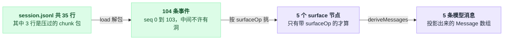
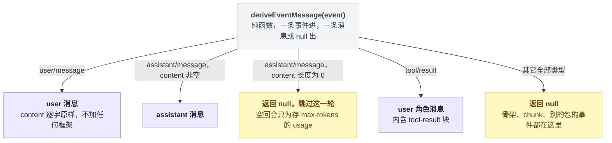
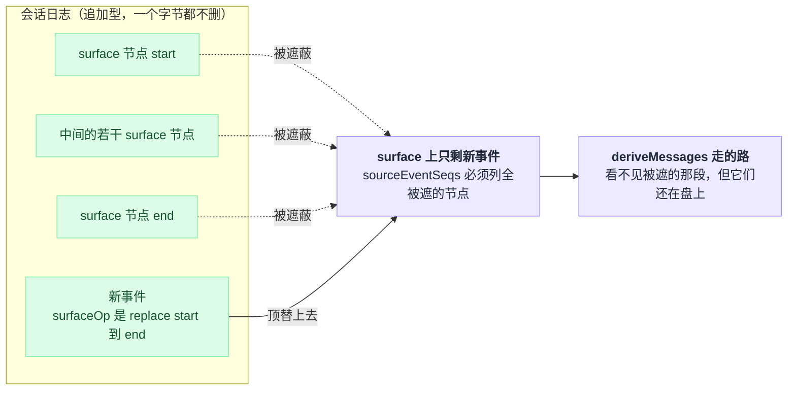
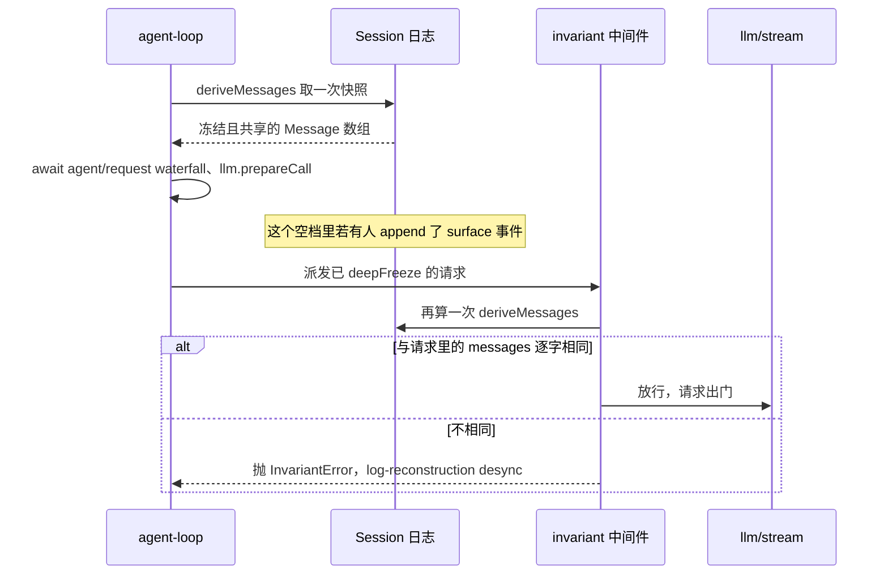
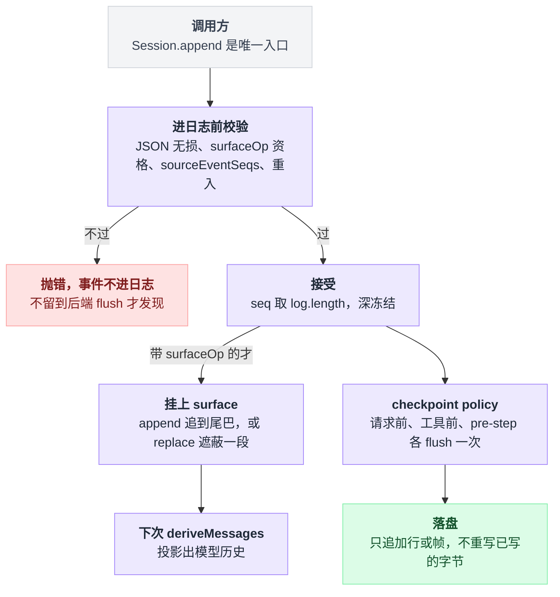
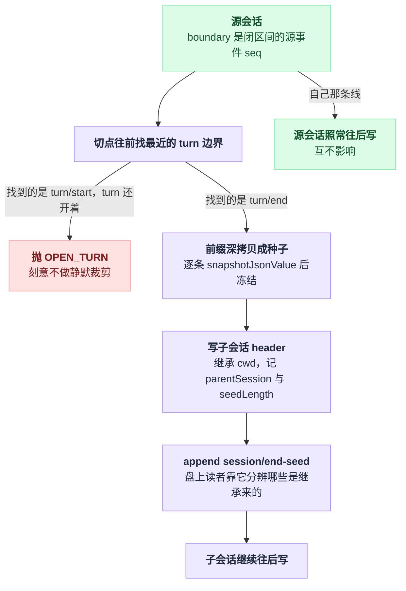
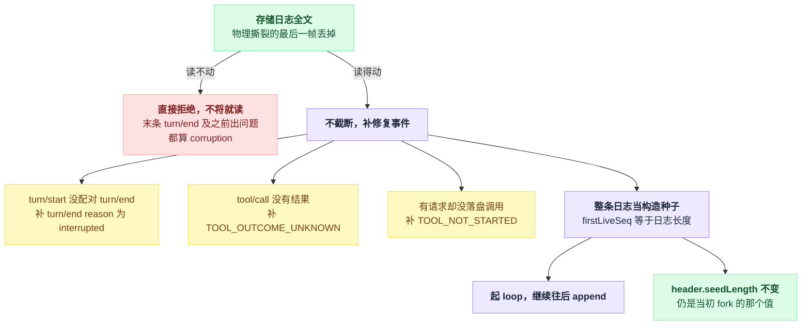

# 16 · 会话日志与分叉

> 基于 `deepseek-ai/deepseek-harness` v0.1.0-rc.5（commit `47f9438`），2026-08-14 核对。

[01 章](./01-数据住在哪循环靠什么转.md)用一节讲了"只有一份真数据"，那是结论。这一章把它拆开：日志文件长什么样、模型历史是怎么从它算出来的、fork 和 resume 各自动了哪些字节、以及三天后你怎么把某次工具调用从一堆事件里翻出来。

读完你应该能干一件很具体的事：拿到一份陌生的 `session.jsonl`，逐行说出每一条在干什么。

以及记住一个形态上的结论：**"我想改掉历史里的一句话"在这套系统里的唯一形态是再追加一条。** 压缩（`compaction/*`）本质上就是日志上的一次区间替换，机制在这章讲透，什么时候压、压成什么样留给 [17 章](./17-压缩与长会话.md)。

---

## 先打开一份真日志

不用先把 dsh 跑起来，仓库里就躺着可读的样本：`examples/acp-agent/tests/snapshots/tool-call-turn/session.jsonl`。内容是一次完整对话——用 bash 跑 `echo SNAPSHOT_OK`，然后回一个 DONE——整个文件 **35 行**。

下面是截断长字段后的开头，`{{cwd}}` 这类是快照占位符，真实文件里是真值：

```jsonl
{"type":"session","version":0,"id":"e9421ff4-…","createdAt":1783352044766,"cwd":"{{cwd}}","delegationDepth":0}
{"type":"agent/inbox/spliced","seq":0,"time":1785498764160,"data":{"target":"next-turn",…}}
{"type":"turn/start","seq":1,"time":1785821362944,"data":{"turn":1}}
{"type":"agent/inbox/spliced","seq":2,"time":1785821362944,"data":{"target":"next-turn","removedCount":1,…}}
{"type":"step/start","seq":3,"time":1783352044773,"data":{"turn":1,"step":1}}
{"type":"user/message","seq":4,…,"surfaceOp":"append"}
{"type":"user/message","seq":5,…,"surfaceOp":"append"}
{"type":"session/title","seq":6,…,"data":{"title":"Use the bash tool to","messageSeqs":[4],…}}
{"type":"request/header","seq":7,…,"data":{"header":{"config":{…},"system":"{{system}}","tools":"{{tools}}"},"reason":"initial"}}
```

第一行没有 `seq`，因为它压根不是事件。它是 **header**：存储元数据，记版本、id、cwd、血缘，刻意不进事件日志。

从第二行起 `seq` 才开始，从 0 连续往上——不是巧合，是硬约束：`seq` 恒等于 `log.length`，日志里不许有洞。出处分别是 `docs/subsystems/persistence.md:43` 和 `docs/subsystems/session.md:196`。

最值得盯的是 `surfaceOp` 这个字段：整份日志里只有 5 行带它。**surface 就是"模型真正看得见的那串事件"**，104 条事件里只有这 5 条会变成模型消息，剩下的九十多条是执行骨架和回放料。

再看两条关键行的尾部：

```jsonl
{"type":"assistant/message","seq":63,…,"sourceEventSeqs":[9,10,11,…,62],"surfaceOp":"append"}
{"type":"tool/result","seq":65,…,"sourceEventSeqs":[64],"surfaceOp":"append"}
```

`assistant/message` 把拼装它的 54 条流式 chunk 的 seq 全列了出来，数组正好是 9…62；`tool/result` 指回它的 `tool/call`，数组是 `[64]`。这就是整套设计的核心手法：**不删任何东西，只加指针。**（同一份快照文件的 `:19` 与 `:21`。）

至于 35 行怎么装下 104 条事件——最后一行 `turn/end` 的 `seq` 是 103（同文件 `:35`）——那是 JSONL 后端默认开着的 `packChunks` 在起作用。它把 ≥3 条连续的同 block delta 压成一行 `text-chunks` / `reasoning-chunks` / `tool-call-chunks`，用 `seq0`/`time0` 加每个成员的 `dt` 偏移无损还原（`packages/session/session-persistence-jsonl/README.md:18`）。

这个文件的账是这么平的：

| 盘上的 35 行 | 折算成事件 |
|---|---|
| 1 行 header | 不是事件，不占 `seq` |
| 31 行普通事件 | 31 条 |
| 3 行压过的 chunk 包：`:12` 顶 17 条、`:14` 顶 31 条、`:25` 顶 25 条 | 73 条 |
| 合计 | **104 条** |

好在读的时候完全是"布局盲"的——压过的、没压过的、混着的，`load` 出来一模一样。

这份文件其实是三层叠着的，盘上的行数、解出来的事件数、模型真正看见的消息数，三个数字一路收窄：



---

## 事件的形状：一个信封，44 种载荷

信封字段是固定的（`docs/subsystems/session.md:212-244`）。`type` 是判别式，`switch (event.type)` 能直接收窄 `event.data`，不用 cast；`seq` 是会话内的单调位置；`time` 是 epoch 毫秒；`data` 是该类型的载荷，硬性要求**无损 JSON**。

剩下三个字段各有脾气。

`ignorable?: true` 管的是向前兼容：读到不认识的类型时，只有带这个标记才允许跳过，不带就必须拒绝重建整条会话——宁可打不开，也不给你一份缺了东西却看起来正常的历史。

`surfaceOp` 和 `sourceEventSeqs` 是**条件字段**，只有三种 surface 类型才能带，其它类型带了编译期就报错。

`docs/persistence-catalog.md` 是生成的完整目录，2026-08-14 这个时点共 **44 个事件类型**（`docs/persistence-catalog.md:95` 以下，每个都标了 surface / log-only 徽章和声明位置）。分布很偏：**3 个 surface、41 个 log-only**；按声明位置分，**13 个由 core 的 `packages/core/session/src/types.ts` 拥有，另外 31 个来自别的包的 declaration merging**。

| 大类 | 例子 | 声明在哪 |
|---|---|---|
| **执行骨架**（log-only） | `turn/start` `turn/end` `step/start` `step/end` | core（`types.ts:243-256`） |
| **模型面**（surface，全仓仅此 3 个） | `user/message` `assistant/message` `tool/result` | core（`types.ts:264,273,291`） |
| **回放料 / 请求重建**（log-only） | `assistant/chunk` `tool/call` `request/header` `request/context` `todo/write` | core（`types.ts:266,279,299,304,309`） |
| **别的包合并进来的**（log-only） | `compaction/*` `hook/*` `approval/*` `llm/retry` `plan/mode` `sandbox/mode` `goal/change` `session/title` `tool-workflow/*` … | 各自的包，如 `packages/llm/llm-retry/src/types.ts:9`、`packages/session/session-title/src/index.ts:100` |

有一个特别容易记反：`todo/write` 长得像插件塞进来的东西，其实是 core 自己声明的。所以 `dsh-session/invariant` 才会把它和 `request/header` 一起要求"必须被 turn 包住"（`packages/core/session/src/invariant.ts:150-155`）。

插件靠 TypeScript declaration merging 往 `SessionEventMap` 里加自己的类型。加进来的**一律是 log-only**：不能带 `surfaceOp`，不参与模型历史。

这条约束有个直接后果——你的 `switch (event.type)` 上永远不许写 `assertNever`，因为别人加的类型对你来说就是合法的未知值。出处：`docs/subsystems/session.md:11`（declaration merging）、同文件 `:595`（log-only）、`:247`（`assertNever`）。

---

## `deriveMessages()`：历史是算出来的，不是攒出来的

日志是唯一事实源，`Message[]` 是它的一个**函数**。每条事件怎么投影，全写在 `deriveEventMessage()` 这一个纯函数里，规则就三条半：

```
for seq in surface:                    # 注意：走的是 surface，不是整份日志
    e = log[seq]
    switch e.type:
        case 'user/message':
            emit(user, e.content)      # 逐字原样，不加任何框架
        case 'assistant/message':
            if len(e.content) == 0:
                continue               # 空回合只为存 max-tokens 那步的 usage
            emit(assistant, e.content)
        case 'tool/result':
            emit(user 角色, 内含 tool-result 块)
        default:
            null                       # 那半条规则：其它全部返回 null
```

`user/message` 的"不加任何框架"是句实打实的约定：`<context>` 这类壳由生产方自己烤进 content。源码 88-95 行的注释专门写了这件事，还留了话——如果哪天要把框架重新引进来，也得走 `meta` 映射加专用渲染器，不能在这里直接拼。

`assistant/chunk` 落在 `default` 里被显式跳过，理由是拼好的 `assistant/message` 才是权威。

出处：规则实现在 `packages/core/session/src/surface.ts:83-114`，chunk 那条见 `docs/subsystems/session.md:526`。

把这三条半规则并排摆开，投影就是一次按 `type` 的分流，只有三个出口能长出消息：



这里有个说法上的陷阱，值得停一秒：它不是"遍历全部日志"，而是**沿 surface 走**。surface 是 `surfaceOp` 标记维护出来的一串 seq，只有两种操作：

```
append:                          surface 尾部追一个自己的 seq
{ op:'replace', start, end }:    把 surface 上 start..end 这段（闭区间）摘掉，换成自己
                                 # 日志里那几条一个字节都没动，只是不再进模型历史
```

压缩用的就是后者（`docs/subsystems/session.md:285-290`）。

`replace` 的形状值得单独看一眼：日志那一列一条不少，变的只是 surface 这条读取路径绕过了中间那段。



实现本身只有 22 行：每个 surface 节点只投影一次并缓存，一次调用的代价是 O(新节点)；一旦发生 `replace`（`replaceGeneration` 变了）整个缓存重建。

返回的数组每次都是新快照，但里面的 `Message` 对象是**共享且深冻结**的——拿到投影也改不动历史。见 `packages/core/session/src/index.ts:726-747`，冻结那段在同文件 `:717-723`。

回到第一节那份文件，整条链路是：104 条事件 → 5 个 surface 节点 → 5 条消息。分别是 seq 4 用户提问、seq 5 注入的 runtime context、seq 63 assistant、seq 65 工具结果、seq 101 assistant。

为什么不干脆维护一个可变的 `messages` 数组？因为一旦历史是算出来的，fork 和 resume 就变成免费的了——复制一段前缀重新投影即可，不用同步两份状态；压缩不用"重写历史"，只是再 append 一条带 `replace` 的事件；崩溃恢复只需要重放。

最实在的是：不存在"日志说 A、数组说 B"这种局面，因为只有一个源。

---

## "模型可见 ⟺ 已落日志"：一条死路，加一道可选的闸

这条不变量的意思很直白：**发给模型的每一条消息，必须先是日志里的一条事件；日志里没有的，模型看不到。**

第一道防线在构造处，而且永远生效。loop 构建请求时直接把投影塞进去，没有第二条路径——`packages/core/agent-loop/src/agent.ts:341` 那行就是把 `this.session.deriveMessages()` 和 `turn, step, assembly.tools, system, signal` 一起交出去。

这个数组一路传到 `buildRequest` 末尾，连同整个请求一起 `deepFreeze` 后打上 agent-loop 标记（`agent.ts:486-493`）。请求和它的 `messages` 都是冻的，而 cordis 的 `waterfall` 又是固定实参、`next()` 不接受替换参数（`vendor/cordis/src/events.ts:234-243`）。

"在 `llm/stream` 中间件里偷偷加一条临时提示"这条路，是被物理堵死的。

第二道是 01 章提过的那个会抛异常的运行时检查，装在 `llm/stream` 上并且 `prepend: true`——跑在最外层，防止有人在前面短路掉它。核心三行长这样（`packages/core/agent-loop/src/invariant.ts:39-42`）：

```ts
const expected = session.deriveMessages()
if (JSON.stringify(options.messages) !== JSON.stringify(expected)) {
  fail(`llm request for session "${String(session.id)}" diverges from the dispatch-time durable derivation (log-reconstruction desync)`)
}
```

同一个 installer 还顺手断言了一串：请求必须是 frozen 的、必须带活着的 `sessionId`、日志里必须已经有 `step/start` 和 `request/header`，以及 model / system / temperature / maxTokens / stop / tools 必须与折叠出来的 `request/header` 完全一致（`packages/core/agent-loop/src/invariant.ts:23-52`）。

`fail()` 是**抛**，不是记日志——签名就写死了 `InvariantFailure = (message: string) => never`（`docs/subsystems/invariants.md:33`）。抛出的是 `InvariantError`，`code: 'INVARIANT'`，消息带包名前缀（`packages/runtime-diagnostics/invariants/src/index.ts:50-65`）：

```
invariant violated by "@deepseek-ai/dsh-agent-loop": llm request for session "session-1" diverges from the dispatch-time durable derivation (log-reconstruction desync)
```

它到底在抓什么？`deriveMessages()` 在 `buildRequest` 里取的是一次快照，之后 `buildRequest` 还要 `await` 掉 `agent/request` waterfall、`llm.prepareCall()` 等好几步（`agent.ts:438-455`）。如果在这个空档里有人往会话 append 了一条 surface 事件，请求里的 messages 就落后于日志了。这条检查就是在请求真正出门前的最后一刻把它按住。

想给模型加东西的正确做法是 append 进会话（[15 章](./15-系统提示词与上下文装配.md)的 prompt 装配、`agent.inject()` 那条路），让它成为日志里的 `user/message`，下一次投影自然会带上。

守的就是取快照到真出门这一段空档，四方的先后是这样的：



**但这道闸默认不在启动树上。** 注册它需要 `@deepseek-ai/dsh-invariants` 服务加上各包的 `./invariant` 伴生插件，而这两样在随产品的 bundle / profile YAML 里一行都没有（`packages/bundle/**/*.yml` 全文搜不到 invariant 行）。它是开发期诊断，得自己挂；挂上之后默认 `enabled: true`，可以用 `package_allowlist` / `package_blocklist` 正则筛（`docs/subsystems/invariants.md:12-23`）。

不变量的**持久化那一半**倒是默认开的。`dsh-session-checkpoint-policy` 就在 base bundle 里（`packages/bundle/base/cordis.patch.yml:354-356`），它在三个位置各做一次 flush：模型适配器收到请求之前、顶层工具体可能产生外部副作用之前、以及每个 `agent/pre-step` 边界上。

而且 **checkpoint 失败是 fail-closed 的——适配器和工具体都不会跑**（`packages/session/session-checkpoint-policy/README.md:5,21,23`）。它和持久化后端是两个插件，你可以只装后端不装它，代价是崩溃时可能丢掉还在批处理窗口里的事件（同上 `:19`）。

---

## `append` 自己就会拒绝的东西

一条事件从调用到进日志、到落盘、到被折叠进模型历史，中间只有一道闸，过不去就在现场抛：



和上一节那道可选的闸不同，`Session.append()` 是唯一入口，校验在事件进日志**之前**完成，任何配置组合下都跑（`packages/core/session/src/index.ts:604-655`）。

这是一张值得收藏的报错对照表：

| 触发条件 | 报错文本（来源） |
|---|---|
| `data` 含 BigInt / 函数 / Symbol / `undefined` / `Map` / `Date` / 循环引用 / 稀疏数组 / `NaN` | `session event "<type>" carries non-JSON-serializable data`（`index.ts:616`，判定逻辑在 `json.ts:117-162`） |
| log-only 类型带了 `surfaceOp` | `session event "<type>" is not surface-eligible and cannot carry surfaceOp`（`surface.ts:189`） |
| surface 类型没带 `surfaceOp` | `session event "<type>" is surface-eligible and requires a surfaceOp marker`（`surface.ts:198`） |
| `sourceEventSeqs` 引用了不早于自己的 seq | `sourceEventSeqs must reference earlier events: N >= current seq M`（`surface.ts:236`） |
| `replace` 没覆盖全被遮蔽的节点 | `surface replace: sourceEventSeqs must include every shadowed surface node; missing …`（`surface.ts:241`） |
| 在 append 的发布回调里再 append | `session append cannot reenter while another append is being published`（`index.ts:625`） |

跨事件的关系归另一个可选伴生插件 `dsh-session/invariant` 管（同样要先挂 `dsh-invariants`）：turn / step 编号连续、执行类事件必须被 turn 包住、`tool/result` 必须在同一 step 里有前置 `tool/call`。典型报错是 `turn/start expected turn 3, got 5`、`<type> appended outside any open turn (core execution events must be turn-enclosed)`、`tool/result for <callId> with no prior tool/call in this step`（`packages/core/session/src/invariant.ts:77,154,140`）。

设计取向没什么弯弯绕：**坏事件在 append 现场就炸，不留到后端 flush 时才发现**——那时候日志已经脏了。

---

## 日志在磁盘的哪里，怎么打开看

默认后端是 JSONL。`root` 这个配置项**没有默认值**（`packages/session/session-persistence-jsonl/README.md:26`），在 base bundle 里被钉死为 `$DSH_HOME/sessions`（`packages/bundle/base/cordis.patch.yml:98-101`）：

```yaml
- id: session-persistence-jsonl
  name: '@deepseek-ai/dsh-session-persistence-jsonl'
  config:
    root: !!js dshHomePath('sessions')
```

往下是按 cwd 分目录、按 session id 建子目录（`packages/session/session-persistence-jsonl/README.md:9-15`）：

```
~/.dsh/sessions/
  --Users-cong-code-demo--/
    session-3f2b1c8e-…/
      session.jsonl.zstd
      session.jsonl
  _no-cwd/
```

那个满是横杠的目录名是 `projectKey(cwd)` 的结果：分隔符全变 `-`，去掉前导 `-`，两侧包 `--`。里层是 `encodeSegment(id)`，不安全字符转 `~XXXX`。

日志文件默认是 `session.jsonl.zstd`，只有 `compression: 'none'` 时才是裸的 `session.jsonl`；没有 cwd 的会话统一进 `_no-cwd/`。规则分别在 `packages/session/session-persistence-jsonl/src/format.ts:147-167`（`projectKey`）、`:189-191`（`sessionDir`）、`:201-208`（`logPath`）。

目录名就是 id 本身，UUID 这类字符原样保留，而 Web 建的会话 id 形如 `session-<uuid>`（`packages/host/apiproxy/src/api-proxy.ts:2168`，fork 出来的在 `:2415`），所以盘上看到的就是上面那个样子。

有一点别踩：projectKey 是**有损**的，不同 cwd 归一化后可能撞进同一个项目目录，真正的区分依据是 session id。

默认 zstd 意味着 `cat` 不出来。三条路可以打开它。

**一，直接下载**，Web 在跑时最省事。`GET /api/session.export?sessionId=<id>` 返回一个 ZIP，里面的 `session.jsonl` 是解码后的**逐字原文**——`SessionRawArtifact.content` 的定义原话就是 "decoded from the backend's physical encoding"（`packages/session/session-persistence/src/index.ts:33-41`）。

子 agent 的日志在 `subagents/<id>/`，引用到的图片在 `media/`（`packages/host/apiproxy/src/fetch/handler.ts:260-270`，`packages/host/apiproxy/src/session-export.ts:1-20`）。加 `&includeDescendants=true` 可以带上后代，但这个参数只认 `true`/`false`/不写，拼错直接 400（`packages/host/apiproxy/src/api/downloads.schema.ts:18-22`）。读之前 host 会先对活会话做一次 flush 屏障。

**二，改成不压缩**，用一个 patch 覆盖那一格。这里有个坑：patch 是**按 id 整体替换该字段、不深合并**的（`vendor/include/src/index.ts:121-124` 就是一句 `target[key] = value`），而 `root` 又是必填项，所以你必须把 `root` 一起写回去。存成 `my-plain-log.patch.yml`：

```yaml
- id: session-persistence-jsonl
  config:
    root: !!js dshHomePath('sessions-plain')
    packChunks: false
    compression: none
```

然后 `dsh --profile web --patch ./my-plain-log.patch.yml`。`dshHomePath` 是启动上下文提供的值（`packages/boot/app-boot/src/index.ts:770`）；`compression: none` 这种写法在仓库里有真实先例，见 `examples/headless-agent/workspace-context-resume.cordis.snapshot.yml:7-9`。顺手把 `packChunks: false` 也带上，每条事件一行，诊断时好读得多（README `:27`）。

注意**一个 root 只归属一种编码**——启动时发现到相反后缀会直接报错，没有迁移、没有混读、没有双写（同上 `:38,72`）。所以要换编码，就必须换新 root。

**三，用后端读**。`ctx.sessionPersistence.inspect(id)` 拿到不落盘、不发布的逻辑视图（README `:46`），`readRaw(id)` 拿逐字原文。

调 `readRaw` 之前先看 `supportsRawArtifacts`：JSONL 是 `true`（`session-persistence-jsonl/src/index.ts:122`），SQLite 持久化后端是 `false`（`session-persistence-sqlite/src/index.ts:100`），对不支持的后端调它是 **reject**，报 `this session persistence backend does not expose raw artifacts`（`packages/session/session-persistence/src/index.ts:119-124`）；而返回 `undefined` 是另一回事，只代表"这个会话没有落盘工件"。

最后说回第一行那个 header。字段固定为 `{ type: 'session', version, id, createdAt, cwd?, parentSession?, seedLength?, origin?, delegationDepth, agentPreset? }`（`packages/session/session-persistence-jsonl/src/format.ts:33-44`）。

`version` 目前恒为 `SESSION_FORMAT_VERSION = 0`（`packages/core/session/src/types.ts:56`），**预发布期，不保证兼容**：读到更高版本会说 "the log was written by a newer harness — upgrade the harness to open it"，读到更低版本说 "this build ships no upgrade path for it"（`packages/session/session-persistence/src/coordinator.ts:77-81`）。

---

## fork 就是复制一段前缀

底层 API 一句话说得完（`packages/core/session/src/index.ts:1081-1095`）：选源会话的一段前缀，深拷贝成新会话的种子，写上血缘。

```ts
const child = ctx.sessions.fork(sourceSessionIdOrObject, boundary, childId)
```

`boundary` 是**闭区间**的源事件 seq，省略就是源当前最后一条。种子是真·深拷贝，非 restore 路径每条事件都要过一遍 `snapshotJsonValue` 再冻结（`packages/core/session/src/index.ts:516-536`）。子会话 header 继承 `cwd`，另外写上 `parentSession` 和 `seedLength = seed.length`。

拒绝的情形有专门的错误码（`:771-776`）：`SESSION_NOT_FOUND` / `SESSION_NOT_LIVE` / `SESSION_ALREADY_EXISTS` / `INVALID_BOUNDARY` / `OPEN_TURN`。

最后那个 `OPEN_TURN` 值得单独说。切点会往前找最近的 turn 边界：

```
b = boundary ?? 源日志最后一条的 seq
从 b 往前找最近的 turn 边界:
    找到 turn/end   → 通过
    找到 turn/start → 这个 turn 还没闭合，直接抛 OPEN_TURN
```

抛出来长这样（`packages/core/session/src/index.ts:1128-1135`）：

```
fork boundary 42 in session "session-1" ends inside open turn 3
```

这是刻意不做静默裁剪。一个开着的 turn 里可能有已发出的 `tool/call` 却没有 `tool/result`，复制过去的历史模型没法接着走；与其给你一份看着能用、跑起来才炸的会话，不如当场拒绝。

分叉出来的形状就是共享一段前缀、然后两边各长各的：



Web 上那个"从这条消息分叉"的按钮走的是另一层策略，它压根不调 `ctx.sessions.fork()`：

```
atSeq = 用户点的那条消息的 seq
b = 第一个 seq >= atSeq 的 turn/end        # 所以点一条消息 = 它所在的整个 turn 都进去
b = 从 b 继续往后延到下一个 turn/start 之前 # 捎上紧跟着的 session/title、注入事件
if 那个 turn 还没结束:
    return fork-unavailable                # 不会悄悄退回到更早的 turn
child = ctx.agents.create({ seed: 前缀, meta })
```

`fork-unavailable` 的消息是 `session "…" has not completed the turn containing event N`。子会话还会继承源的 agent preset，理由和 `OPEN_TURN` 同源：种子历史是在那套工具下产生的，换一套组合会让已有的 tool call 悬空。

出处都在 `packages/host/apiproxy/src/api-proxy.ts:2363-2440`：找边界 `:2383-2385`，往后延 `:2399-2404`，继承 preset `:2416-2421`。客户端侧的调用点在 `packages/client/ui-conversation/src/client/apply.ts:417-423`：`forkAt(seq)` → `sessions.fork({ sessionId, atSeq: seq, increaseTitle: true })` → 打开子会话。

还有一条容易忽略的事件：种子塞进去之后，构造函数会立刻 append 一条空载荷的 `session/end-seed`。它是 `firstLiveSeq` 的持久化投影——只拿到磁盘字节的读者，靠它区分"哪些是继承来的、哪些是本次生命周期写的"。

找的时候记得找**最后一条**：种子末尾已经有一条时不会重复打标，所以打开一个没动过的会话不会让日志一次次变长。出处：`packages/core/session/src/index.ts:545-547`，设计说明 `docs/subsystems/session.md:583-589`，不重复打标那句在同文件 `:587`。

---

## resume 是把整条存储日志当种子

fork 复制前缀，resume 复制全部。仓库里有真实跑的 fixture，下面是逐字照抄 `examples/headless-agent/tests/fixtures/workspace-context-resume-agent.ts:20-23`：

```ts
const handle = await ctx.agents.resume({
  resumeSessionId: 'workspace-context-resume' as SessionId,
  agentOptions: { provider: 'deepseek-official', model: 'deepseek-v4-flash' },
})
```

该插件的 `inject` 是 `['agents', 'agentLoop', 'sessionPersistence']`，挂载见 `examples/headless-agent/workspace-context-resume.cordis.snapshot.yml:36-37`。`ctx.agents.resume()` 先经持久化把会话读回来再起 loop（`docs/subsystems/core.md:637-643`），失败点有三个：没注册 agent factory、没配持久化、日志读不动。

有两个边界特别容易混，定义都在 `packages/core/session/src/index.ts:450-459`：

| | `header.seedLength` | `session.firstLiveSeq` |
|---|---|---|
| 是什么 | **持久的** fork 血缘边界 | **本进程**的构造种子长度 |
| resume 之后 | 仍然是当初 fork 时的那个值 | 等于整条存储日志的长度 |

崩溃恢复这块的处理挺讲究：**不截断**。

```
log = 读全整条存储日志       # 物理撕裂的最后一帧丢掉，这可以将就
                             # 但最后一条已提交的 turn/end 之前（含）出任何问题 = corruption，直接拒绝
每个没配对 turn/end 的 turn/start → 补一条 turn/end { reason: { kind: 'interrupted' } }
每个没有 tool/result 的 tool/call → 补 TOOL_OUTCOME_UNKNOWN
每个有 assistant 请求却没落盘调用 → 补 TOOL_NOT_STARTED
seed = log                   # 整条日志当构造种子
```

之所以不砍掉那些事件：一个 turn 在长任务里可能非常大，而且它们崩溃前已经落盘了。`interrupted` 是唯一一个 loop 永远不会自己发的 `TurnEndReason`。

`TOOL_OUTCOME_UNKNOWN` 是在告诉模型"这次调用结果未知，只重试只读或幂等的操作，可能的副作用要去核实或问用户"。

出处：`turn/end` 补法见 `docs/subsystems/persistence.md:15`，两条工具补法见 `packages/session/session-persistence-jsonl/README.md:60`，撕裂帧与 corruption 判定见同一 README 的 `:45`。

重建的顺序是先把日志读全、再给崩溃留下的口子补事件、最后才把它整条当种子交出去：



---

## 没有回退，也没有删除

这一节是全章最反直觉的地方，五件你可能想干的事，实际发生的都不是你以为的那个。

**想撤销刚才那条消息？** 没有这个操作。`Session` 的公开面上只有 `append`，没有任何 truncate / delete。唯一的路是 fork 到更早的 boundary，在新会话里继续。

**想让模型"忘掉"一段？** append 一条带 `replace` 的 surface 事件，把那段从 surface 上摘掉——压缩就是这么干的。**日志里原文还在。**

**想改一条已写入的事件？** 事件在 accept 时深冻结，`session.events` 返回不可变快照，cast 也改不动（`docs/subsystems/session.md:429-434`）。

**想删掉一个会话的文件？** 持久化 seam **没有删除 API**，日志一直堆在 `root` 下，直到外部手动清（`packages/session/session-persistence-jsonl/README.md:75`）。

**想重写盘上已 flush 的内容？** 不会发生。后续批次只追加行 / 追加帧；写或 fsync 失败会把文件回滚到之前的字节长度（同上 `:44`）。

代价是真实的，不用粉饰：磁盘只增不减，`assistant/chunk` 一条不落地存着——因为 `seq` 必须连续，所以不能过滤掉 chunk（`docs/subsystems/session.md:603`）。换来的是"任何一次请求都是日志的纯函数"这条能被机器断言的性质。

顺带记住一个隐含约束：**一个会话同时只能有一个活写者**。另一个后端实例或另一个进程不许写同一个会话（`packages/session/session-persistence-jsonl/README.md:76`）。

---

## 三天后，怎么把某次工具调用翻出来

`ctx.sessionQuery` 是统一的查询 seam，策略是"live 优先"——同一个 id 如果有活会话就读活的，否则读持久化的（`docs/subsystems/session-query.md:371-373`）。

它的能力分成两半，左边那半任何部署都能用，右边那半要有全文索引后端撑着（`docs/subsystems/session-query.md:375-489`）：

| 与后端无关（**任何部署都可用**） | 需要全文索引后端 |
|---|---|
| `listSessions()` 列全部 | `searchSessions(request)` 跨会话全文搜，按最强命中事件分组 |
| `readSession(id)` 读整条原始日志 | `searchEvents(request)` 单会话内全文搜 |
| `filterSessions(filters)` 按 id / cwd / 创建时间 / 父会话 / 可用性筛 | |
| `filterEvents(id, filters)` 按 seq / time / type / surface / **字面文本**筛 | |
| `readEvent({ sessionId, seq, before, after })` 读一条事件 + 上下文窗口 | |
| `traceEvent({ sessionId, seq })` 追替换链与引用关系 | |
| `traceSession(id)` 追祖先与后代森林 | |

字段名是 `sessionId`，不是 `id`——见 `packages/session-query/session-query/src/types.ts:127-136` 与 `:97-102`。

**默认全文搜是关的。** 插件自己的 schema 默认是 `openAt: startup`，但 base bundle 和 web bundle 都把它压成了 `never`（`packages/bundle/base/cordis.patch.yml:117-121`、`packages/bundle/web-app/cordis.patch.yml:30-33`）。

此时 `searchSessions` / `searchEvents` 抛 `SESSION_QUERY_SEARCH_DISABLED`，`node:sqlite` 根本不会被 import，但上表左半边全部照常工作。要打开就再叠一层 patch，存成 `my-search.patch.yml`：

```yaml
- id: session-query-sqlite
  config:
    path: !!js dshHomePath('session-index.sqlite')
    openAt: first-search
```

`first-search` 把 SQLite 的 import 和句柄推迟到第一次搜索，Node 22 **启动**时就不会打实验性警告——注意只是推迟，第一次真搜的时候该警告还是会出现（`packages/session-query/session-query-sqlite/README.md:19,30`）。另外**不要把 `path` 指到持久化那个库上**（同上 `:23`）。

### 实操

好消息是找一次工具调用根本不需要开索引。`filterEvents` 的 `text` 子句是字面的、大小写不敏感、空白宽松的扫描，与全文 provider 无关（`docs/subsystems/session-query.md:105`）。

写成一个小插件挂进去就行，存成 `find-tool-call.ts`：

```ts
import type { Context } from '@deepseek-ai/cordis'
import type { SessionId } from '@deepseek-ai/dsh-session'

export const name = 'find-tool-call'
export const inject = ['sessionQuery']

export async function apply(ctx: Context): Promise<void> {
  const sessionId = process.env.TARGET_SESSION as SessionId
  const hits = await ctx.sessionQuery.filterEvents(sessionId, [
    { kind: 'type', values: ['tool/call'] },
    { kind: 'text', text: 'echo SNAPSHOT_OK' },
  ])
  for (const hit of hits) {
    const window = await ctx.sessionQuery.readEvent({ sessionId, seq: hit.seq, before: 1, after: 2 })
    ctx.logger.info('%s @seq %d -> %o', hit.type, hit.seq, window.target.data)
  }
}
```

`ctx.logger` 是 cordis 内置服务，不用写进 `inject`；`%s` / `%d` / `%o` 是它自带的格式化符（`vendor/cordis/src/logger.ts:50-61,188-194`）。挂载方式和 [06 章](./06-你的第一个插件.md)一样，往 profile 里 `insert` 一行 `{ id: find-tool-call, name: './find-tool-call.ts' }`，写法见 `docs/user/develop/basic/config.md:36-43`。

拿它去查第一节那份日志，`hits` 会命中 **seq 64**，也就是 `tool/call` 那条——它的语义文本是 `name` + `arguments`，而 `arguments` 里就有 `echo SNAPSHOT_OK`。`readEvent` 的 `before: 1, after: 2` 窗口覆盖 seq 63–66，把 `assistant/message`(63)、`tool/call`(64)、`tool/result`(65)、`step/end`(66) 一起带出来，一次调用就还原了整个现场。

几个口径要记牢，否则会搜了个寂寞：

- **语义文本抽取按代码是这样的**（`packages/session-query/session-query/src/extraction.ts:13-83`）：`user/message` / `assistant/message` 取内容块，`tool/call` 取 `name` + `arguments`，`tool/result` 取内容 + error 名与 code，`todo/write` 取状态 + 内容，`turn/end` 只在结局是 `error` / `aborted` / `max-tokens` / `interrupted` 时出文本；结构事件、`assistant/chunk`、`request/header` 与所有合并进来的插件事件一律空串。块级别只取 `text` / `tool-call` / `tool-result`，**`reasoning` 块返回空数组（`:72-73`），搜不到**。⚠️ 子系统文档 `docs/subsystems/session-query.md:141` 把 reasoning 也列进了可搜文本，与 HEAD 的代码不符——以代码为准。
- 每条命中带 `surface` 字段，三态：`current`（当前模型上下文）/ `shadowed`（被压缩替换掉的）/ `log-only`（`types.ts:21,52-63`）。默认三种都搜（sqlite README `:13`），要收窄就加 `{ kind: 'surface', values: ['current'] }`。
- `readEvent` 的 `before` / `after` 上限由 `readWindowMax` 控制，默认 50（`packages/session-query/session-query-sqlite/README.md:35`）。
- Web 侧的搜索框走 `session.search` RPC（`packages/host/apiproxy/src/api/rpc-map.ts:26`），它把事件类型硬性限制在 `user/message` + `assistant/message`、surface 限制在 `current`（`packages/host/apiproxy/src/api-proxy.ts:2074-2080`）——比 `ctx.sessionQuery` 直调窄得多。
- FTS5 用 `unicode61` 分词，是**词/短语召回，不是任意子串召回**：`AI` 匹配不到 `BRAID` 里的 `AI`。要子串就用 `filterEvents` 的 `text` 子句（`packages/session-query/session-query-sqlite/README.md:40`）。

最后避个雷：用 `@` 引用另一条会话作为上下文，是完全另一套东西（`docs/subsystems/session-reference.md:5`）。它把被引会话的**当前 surface** 投影成一段不可信上下文塞进你的消息，和这里的查询不是一回事。

---

## 一句话带走

**日志只追加，surface 是它上面的一层索引，模型历史是沿 surface 走一遍算出来的；于是"改历史"只有一种形态——再 append 一条，而 fork 不是复制会话，是换一条读取路径。**

---

## 本章未确认

- ⚠️ `apps/cli/src/args.ts:69` 的帮助文本里有 `dsh --profile tui --resume <session>` 这个例子，但 `apps/` 下只有 `cli` 和 `web` 两个 app，**没有 tui app**，全仓也没有任何代码把 `--resume` 声明成一个选项（只有 `packages/boot/cmdline/src/index.ts:24-25` 和 `apps/cli/tests/args.spec.ts:35-36` 拿它举"透传参数"的例子）。设计说明 `.agents/notes/implemented/architecture/2026-08-06-app-owned-command-line.md:19` 说 `--resume` / `--session` 归**树外**的 turtle-ui 所有，与此吻合；但那是设计文档的说法，本仓库里无从验证其命令行语义，**未确认**。已确认可用的 resume 入口是 `ctx.agents.resume({ resumeSessionId })`。
- ⚠️ 默认的 `.jsonl.zstd` 是"标准的独立 Zstandard 帧串接"（`packages/session/session-persistence-jsonl/README.md:36`）。按 zstd 规范这类文件用 `zstd -d` 应当能解，但本次没有运行环境，**未实测**。要保险就走 `/api/session.export` 或换 `compression: 'none'` 的新 root。
- ⚠️ `apps/web/tests/snapshots/*/session.jsonl` 这批快照的事件形状与 HEAD 的类型定义**不一致**：里面有 `turn/start` 带 `trigger` 的行，而 `packages/core/session/src/types.ts:243` 的载荷只有 `{ turn }`；也有 `tool/result` 是扁平 `callId`/`content`/`isError` 的行，而 `:291-297` 的载荷是 `{ turn, step, message, error?, meta? }`。部分快照的 header 还缺 README 要求的 `delegationDepth`。推测是较旧格式的遗留快照，但未逐个核对其生成时间，所以本章一律以 `examples/acp-agent/tests/snapshots/tool-call-turn/session.jsonl` 为样本。
- ⚠️ base bundle 里 `openAt: never` 时 Web 侧边栏"只按标题和 workspace 名匹配"这句来自配置文件注释（`packages/bundle/base/cordis.patch.yml:113-114`），客户端降级逻辑本章未跟进源码确认。
- ⚠️ `SessionStartSource` 里有 `'clear'` 和 `'compact'` 两档（`packages/core/agent/src/runtime-types.ts:61`），但全仓只有这行类型声明、`agent/session-start` 的事件载荷（`:217`）和 `publish(source)` 的形参用到该类型，**没有任何生产者真的传这两个值**，也找不到对应的用户可见"清空会话"路径，其语义未确认。
