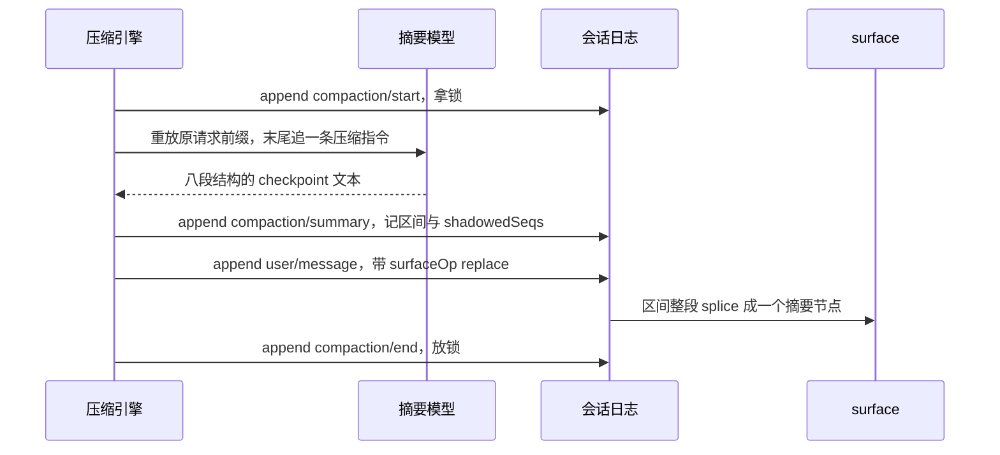
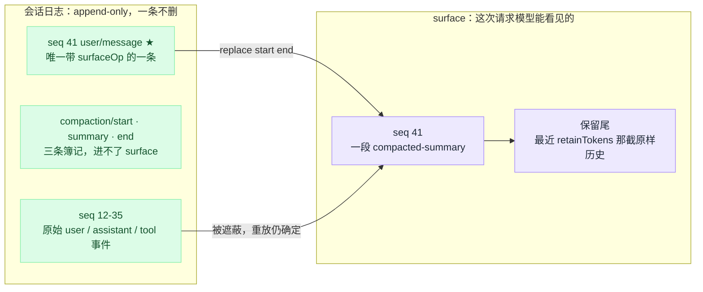
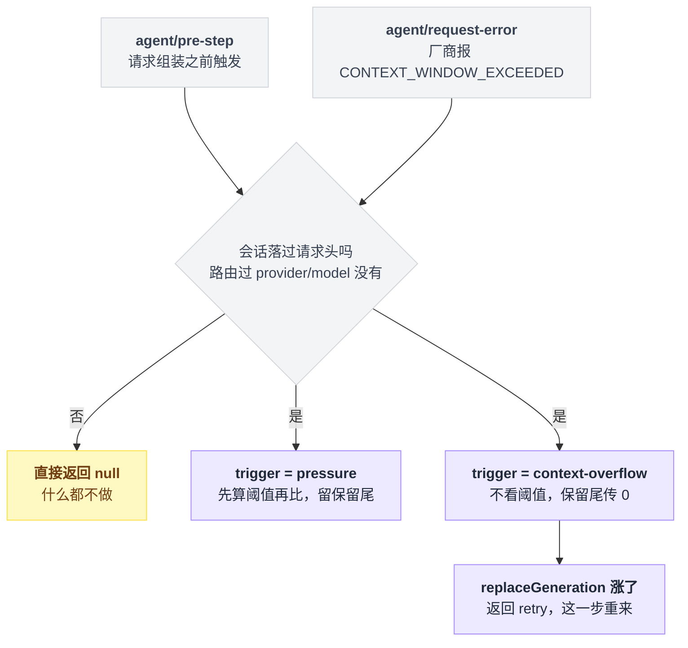
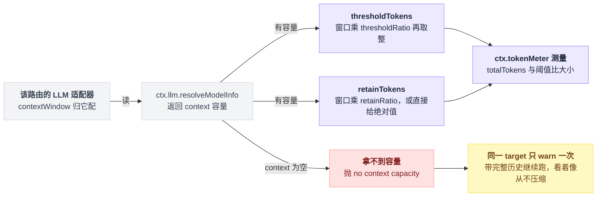
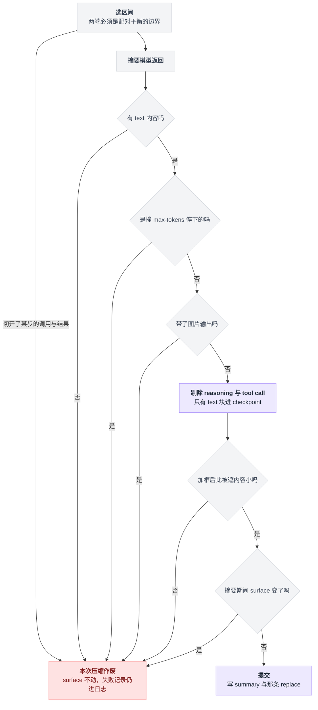
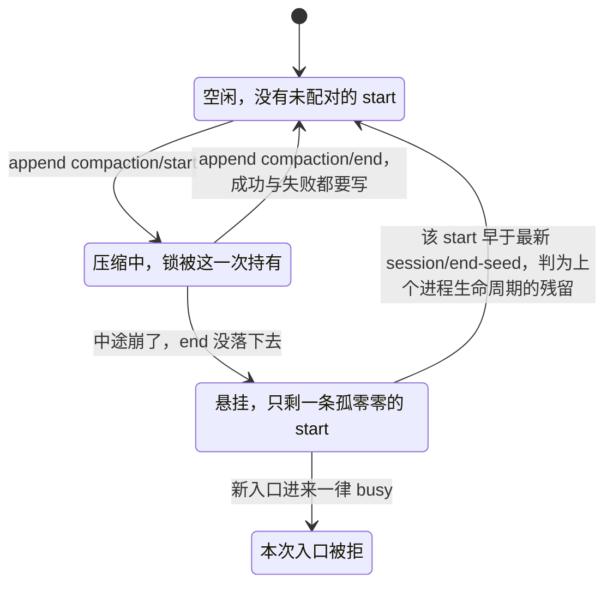

# 17 · 压缩与长会话

> 基于 `deepseek-ai/deepseek-harness` v0.1.0-rc.5（commit `47f9438`），2026-08-14 核对。

会话跑到第两个小时，你会在日志里看到这么一行：

```
compaction (step pressure): shadowed 24 surface nodes (seqs 12-35, ~48210 tokens)
```

二十四条历史消失了，换成一段摘要。

但日志文件一个字节都没少——这是上一章那条 append-only 日志的直接推论：压缩改的是「模型能看见哪些节点」这层投影，不是日志本身（[16 章](./16-会话日志与分叉.md)）。

这一章要回答的是另外三个问题：谁决定要压、压哪一段、压完模型看到的到底是什么。读完你应该能对着日志说出自己那次压缩是被什么触发的，以及想换个压法该动哪一行配置。

---

## 减压有三档，只有一档要花钱

「上下文快满了」在 dsh 里不是一个动作，是三个发生在不同时刻、代价差一个数量级的动作。

| 档位 | 什么时候跑 | 花模型调用吗 | 计量单位 | 改动落在哪 | 插件 |
|---|---|---|---|---|---|
| spill 溢写 | 单个工具刚返回时 | 不花 | UTF-8 字节 | 全文写磁盘，模型只看到预览 + 路径 | `dsh-spill-policy` + `dsh-spill-local` |
| tool-result 修剪 | 压力已超阈值、选摘要区间之前 | 不花 | Unicode 码点 | 日志里追加一条替换版 `tool/result` | `dsh-compaction-tool-result-pruner` |
| 摘要压缩 | 同上，修剪后仍超阈值 | 花一次额外请求 | token（估算） | 一段旧历史被一条摘要节点整段遮蔽 | `dsh-compaction-basic` |

它们在时间轴上是接力关系，前面两档能挡住的活儿绝不会传给第三档：

```
工具返回超大文本 ──spill──► 日志里存的就是"预览+磁盘路径"（整段 ≤ maxInlineBytes）
                                  │
     每步开始前测一次压力 ◄───────┘   agent/pre-step，请求组装之前
                                  │  totalTokens ≥ thresholdTokens ?
                                  ├─ 否 ──► 什么都不做
                                  └─ 是 ──► 修剪超长 tool/result ──► 重新测量
                                                                     ├─ 已降到阈值下 ──► 收工，不调模型
                                                                     └─ 仍超 ──► 选区间 → 调模型出摘要 → replace
```

> 想知道同一个问题上 Pi / Codex / LangChain 各自怎么做，见 [五个 agent 系统源码解剖](../2026-08_五个agent系统源码解剖/00-总览与阅读指南.md)。

---

## 一次成功的压缩，恰好追加四条事件

日志只追加不修改，那"让老历史消失"这件事只能靠追加来完成。

dsh 的做法是往后写四条事件，其中只有一条碰 surface：

```
compaction/start    log-only，拿锁
   （调模型出摘要，这一步不落事件）
compaction/summary  log-only，记摘要、被遮区间、shadowedSeqs、token 数、provider/model
user/message        ★ 唯一一次改动 surface：surfaceOp = { op:'replace', start, end }
compaction/end      log-only，放锁
```

出处：四条事件的说明见 `packages/compaction/compaction/README.md:41-49`；四次 append 分别在 `packages/compaction/compaction-basic/src/region.ts:189`、`:447`、`:462`、`:215`。

四条事件之间还夹着一次不落盘的模型调用。摊在时间轴上，谁只写日志、谁动 surface 就分得很清楚：



摘要为什么非要"搭车"在一条合成的 `user/message` 上？

因为 `SurfaceEventType` 是个封闭联合，只有 `user/message` / `assistant/message` / `tool/result` 允许携带 `surfaceOp`（`packages/core/session/src/types.ts:343-346`）。`compaction/*` 事件天生进不了 surface，它自己没法把自己放上去（`docs/subsystems/compaction.md:11`）。

顺带一提，`dsh-compaction` 这个包实际声明了四种 `compaction/*` 事件——`start` / `summary` / `end` / `prune`（`packages/compaction/compaction/src/types.ts:16-89`），而子系统文档还写着"三种"，是 `compaction/prune` 加进来之后没同步。

### surface 那一侧只是一次数组 splice

整个区间换成一个新节点（`packages/core/session/src/surface.ts:369-370`）：

```
replace 前： [12] [13] [14] [15] [16] [17]
              └──── 被遮蔽 ────┘
replace 后： [ 41 ] [16] [17]        41 = 摘要节点的 seq
```

换个角度看同一件事：日志那一侧一条没少，变的只是模型这一侧的入口——被遮的那些节点从投影里退场，位置上换成一个摘要节点。



### 自己实现 replace，有两处特别容易翻车

**新节点的 `sourceEventSeqs` 必须一个不落地列出它遮蔽的所有源节点 seq。** 少写一个当场抛：`surface replace: sourceEventSeqs must include every shadowed surface node; missing …`（`packages/core/session/src/surface.ts:239-242`）。

compaction-basic 写的是 `[startEvent.seq, summaryEvent.seq, ...shadowedSeqs]`，连两条簿记事件也一并引用进去（`region.ts:462-465`）。

**`start` / `end` 说的是 surface 上的位置，不是 seq 的大小。** 校验拿 `indexOf` 出来的下标比，不比 seq 值（`surface.ts:250-260`）。

我第一遍读这里读错了，以为 `start > end` 是数据坏了。其实上一次压缩留下的那个摘要节点 seq 很大，位置却很靠前，所以 `start` 大于 `end` 完全正常，不是 bug（`docs/subsystems/compaction.md:44-52`）。真正权威的是 `shadowedSeqs` 那个有序列表（`:53-54`）。

### 连锁都在日志里

`compaction/start` 先落盘、`compaction/end` 最后落盘。中途崩了就留下一个没配对的 start，下次进来直接报 busy——宁可卡住，也不留一个假装压缩成功的 end（`docs/subsystems/compaction.md:19`、`packages/compaction/compaction/README.md:49`、`:57`）。

被遮蔽的原始事件仍在日志里躺着，重放依然确定（`README.md:53`）。

---

## 触发它的只有两件事

自动压缩的两个入口都由 `compaction-basic` 在构造时注册，前提是 `auto: true`——这是默认值（`packages/compaction/compaction-basic/src/index.ts:129`）。

| 触发器 | 挂在哪个事件上 | 语义 |
|---|---|---|
| `pressure` | `agent/pre-step`，请求组装之前 | 估算 token 超过阈值 |
| `context-overflow` | `agent/request-error`，且 `failure.code === CONTEXT_WINDOW_EXCEEDED` | 厂商已经明确说超窗了 |

两个入口最后汇进同一个 `compactIfNeeded`，只是带着不同的 trigger 进去，之后的脾气就分岔了：



把这张图写成一段示意代码，两条路的差别更直白：

```
compactIfNeeded(trigger):
    if 会话还没落过请求头:            return null   // 没路由过任何 provider/model
    if 有未配对的 compaction/start:   return busy

    if trigger == pressure:
        if totalTokens < thresholdTokens:  return null
        修剪超长的 tool/result
        if totalTokens < thresholdTokens:  return null   // 省掉一次摘要请求
        区间 = selectCompactableRange(..., retainTokens)  // 留保留尾

    if trigger == context-overflow:
        区间 = selectCompactableRange(..., 0)             // 不看阈值，保留尾传 0

    摘要 = 调模型(重放原请求前缀 + 一条压缩指令)
    过六道防线，写 summary 与那条 replace

    if trigger == context-overflow 且 surface.replaceGeneration 涨了:
        return { kind: 'retry' }                          // 这一步重来
```

第二条路和第一条的性格不一样：厂商都已经报错了，就没必要再看阈值、也不留保留尾（`selectCompactableRange(..., 0)`，`:283-291`）；只要 `surface.replaceGeneration`——surface 被 replace 过几次的计数器——涨了，就返回 `{ kind: 'retry' }` 让这一步重来（`:191`、`:218-222`）。

还有个前置条件很容易漏掉：会话还没落过一次请求头（没路由过任何 provider/model）时，`compactIfNeeded` 直接返回 `null`，什么都不做（`:263-264`）。

剩下的是这两个入口自身的一些登记信息：

| 事实 | 出处 |
|---|---|
| 两个事件都是 waterfall（[11 章](./11-waterfall专章.md)），`@mode waterfall` 声明在两处 | `packages/core/agent/src/runtime-types.ts:229-231`、`:258-260` |
| 错误码常量叫 `CONTEXT_WINDOW_EXCEEDED_CODE`，值就是字符串 `'CONTEXT_WINDOW_EXCEEDED'` | `packages/llm/llm/src/error.ts:25` |
| 两个监听器：pre-step 与 overflow 恢复 | `compaction-basic/src/index.ts:147-165`、`:179-223` |
| 另有两个纯记账监听器：agent 变 idle 或收到新的 `assistant/message` 时，把超窗重试计数清零 | `:167-177` |

---

## 阈值是个比例，分母不归压缩管

阈值不是一个写死的 token 数，是按最近一次落盘请求所用模型的 `contextWindow` 现算的（`compaction-basic/src/config.ts:144-147`）：

```
thresholdTokens = floor(contextWindow × thresholdRatio)
retainTokens    = floor(contextWindow × retainRatio)     若没给绝对值
```

能拧的旋钮就这么几个（`config.ts:20`、`:23`、`:89-95`）：

| 键 | 默认 | 含义 |
|---|---|---|
| `thresholdRatio` | `0.8` | 到窗口的 80% 就压 |
| `retainRatio` | `0.16` | 最近 16% 的历史原样保留（与 `retainTokens` 二选一） |
| `summarizationProvider` / `summarizationModel` | `''` / `''` | 空对 = 跟着会话当前路由走 |
| `maxTokens` | `8192` | 摘要生成上限（可能被推理 token 吃掉） |
| `compactionRetries` | `1` | 第一次压完还超阈值，最多再补几次 |
| `maxOverflowRetries` | `1` | 超窗恢复的重试上限，`0` = 只关恢复 |
| `auto` | `true` | 置 `false` 则上面那四个监听器一个都不注册，只留手动 |
| `modelPolicies` | `[]` | 按 `{provider, model}` 精确覆盖上表中除 `auto` / `modelPolicies` 外的任意一项（`config.ts:26-35`） |

这条算式跨了两个模块：分子由压缩自己现算，分母得先从适配器那里问出来，问不到就整条断掉。



注意那个分母。`contextWindow` 不归压缩模块管，归**该路由的 LLM 适配器**：`compactIfNeeded` 拿的是 `(await ctx.llm.resolveModelInfo(provider, model, signal)).context`，拿不到就抛 `compaction-basic: no context capacity for <provider>/<model>; configure contextWindow on that adapter model`。

自动路径对同一个 target 只 warn 一次，然后带着完整历史继续跑（`index.ts:293-302`、`:155-162`）——所以症状是"看着像从不压缩"，而不是报错。

**"我明明配了阈值却从来不压缩"，先查这里。** 好在内置的两个适配器都自带兜底容量——比如 `llm-deepseek` 的 `defaultContextWindow` 默认 1,000,000（`packages/llm/llm-deepseek/src/index.ts:97` → `src/adapter.ts:91`）——所以这条主要坑的是自定义适配器。

base bundle 里这一串默认就挂着：`token-meter`（`packages/bundle/base/cordis.patch.yml:281-282`）、`compaction-basic`（`:284-285`，不带任何 config）、`command-compact`（`:289-290`）、`tool-result-pruner`（`:360-365`）、spill 两件套（`:346-352`）。

---

## 摘要请求就是上一次请求的真前缀

直觉上，摘要应该另起一个干净的 summarizer 会话：把要压的那段消息塞进去，配一个"请总结"的 system prompt，省钱又省事。

dsh 反着来——它把原对话的前缀原样重放一遍：

```
摘要请求 = [
    原对话那份 system prompt,        // 一字不改
    原对话那份 tools schema,         // 一字不改
    ...被遮区间自己的那些消息,
    user("请按八段结构总结…"),        // 唯一新增的一条
]
```

整个数组除了最后那条指令，逐字就是上一次真实请求的前缀（`compaction-basic/src/region.ts:498-514`、`summarizer.ts:145-163`）。

理由是 KV cache。厂商对完全相同的请求前缀有缓存，这次调用既然是上一次请求的真前缀，热缓存就能一路复用到最后那条指令为止（`summarizer.ts:24-29`、`compaction-basic/README.md:156`）。多带的那些 token 是缓存价，另起炉灶省下的那些是全价。

### 指令要求的八段结构

模型必须严格输出八段固定 Markdown 结构，缺一段就写 `(none)`，不许少（`summarizer.ts:31-66`）：`Primary Request and Intent` / `Key Technical Concepts` / `Files and Code` / `Errors and Fixes` / `Pending Jobs` / `Current Work` / `Next Step` / `Critical Context`。

里面有两条规则值得单独拎出来。

一是路径、命令、报错原文、标识符、数值、函数签名要逐字保留（`:61`）。

二是如果历史里已经有一个 `<compacted-summary>` 块，那是上一次的 checkpoint，要合并成一份，不许照抄下去（`:65`）——否则摘要会像滚雪球一样越滚越大。

落到日志上的那条 `user/message` 长这样（`summarizer.ts:69-70`、`:189-195`）：

```
This is an automatically generated checkpoint condensing an earlier span …

<compacted-summary>
（模型吐出来的八段结构）
</compacted-summary>
```

### 用哪个模型出摘要

按 `configured ?? latest ?? agentTarget` 三级回退，三个都没有就抛错（`summarizer.ts:128-143`）：

| 优先级 | 取哪个 |
|---|---|
| 1 | 显式配的 pair |
| 2 | 最近一次落盘请求的路由 |
| 3 | agent 自己的 provider/model |

请求带 `purpose: 'compaction'`（`:161`），DeepSeek 适配器据此加一个 `x-deepseek-harness-compact: 1` 请求头，body 一个字不动（`packages/llm/llm-deepseek/src/adapter.ts:293`、`compaction-basic/README.md:18`）。

---

## 六道防线拦着摘要模型犯浑

摘要这一步是把控制权交给了模型，而模型是会出岔子的。下面这些不是"建议"，是会当场抛错、让本次压缩作废的检查。

1. **摘要必须比被遮内容小**，按加框之后的 token 算。不小就抛 `summary is not smaller than the shadowed content (N estimated framed tokens >= M)`（`region.ts:373-378`）。
2. **摘要里不能有图片输出。** 抛 `LlmError('compaction summary cannot contain image output', 'UNSUPPORTED_CONTENT')`，而不是把图悄悄丢掉了事（`summarizer.ts:217-222`）。
3. **只有 text 块能进 checkpoint。** reasoning 和 tool call 一律剔除，免得泄露推理过程、或者造出一个没有主人的工具调用（`summarizer.ts:223`）。
4. **撞上 `max-tokens` 结束视为失败**，报 `summarization truncated at the token cap (incomplete checkpoint)`。宁可这次不压，也不留半截 checkpoint（`summarizer.ts:206-210`）。
5. **空摘要视为失败**：`summarization produced no text summary content`（`summarizer.ts:170-172`）。
6. **区间两端必须 tool 调用/结果配对平衡**，不能从一个 step 的调用和结果中间切开：`compactRegion: start seq N is not a balanced boundary (would split a step's tool-call/result pair)`（`region.ts:327-333`）。

这些检查串在同一条路上，从选区间一直排到提交前的最后一刻，任何一道不过，本次压缩整体作废：



### 跟并发有关的还有两道，逻辑更微妙一些

**摘要跑着的时候 surface 变了就作废**，但自动和手动的严格程度不一样：自动压缩要求整个 surface 逐节点相等（`region.ts:387-396`）；手动 `/compact` 只要求选中的那一段没变，因为摘要期间允许有别的东西被注入进来（`region.ts:403-424`、`packages/compaction/compaction/README.md:51`）。

**锁的判定要看时代。** 任何入口进来先查有没有未配对的 `compaction/start`，有就 `busy`；但如果那个 start 比最新的 `session/end-seed` 还早，它属于上一个进程生命周期的残留，不拦。写成三行就是：

```
未配对的 start = 最后一条 compaction/start，且其后没有 compaction/end
if 不存在这样的 start:                          放行
elif 该 start 早于最新的 session/end-seed:      放行   // 上个进程生命周期的残留
else:                                          busy
```

判定在 `region.ts:286-298`。包内还自带一个 invariant companion 逐条校验事件配对，例如 `compaction/summary repeated within one compaction`、`successful compaction/end requires one compaction/summary`（`packages/compaction/compaction/src/invariant.ts:184`、`:215`）。

这把锁没有任何内存状态，它的全部状态就是日志里 start 和 end 配没配上：



撞上任何一道，会话都不会被搞坏。

`changed` 和 `summary` 两类失败不改动 surface，但失败记录仍然留在日志里（`docs/subsystems/compaction.md:84`）。自动路径只 warn 一句 `step compaction failed: …; continuing the turn`，然后带着超预算的完整历史继续跑（`index.ts:161`）。重试若干次还压不下去，才抛 `compaction still above threshold after N compaction attempts`（`index.ts:328-331`）。

---

## tool-result-pruner：能不调模型就不调

这是可选的一档补充策略，compaction-basic 用 `ctx.get('toolResultPruner')` 软引用它（`index.ts:281`），没装照样跑。

它只在压力已经超阈值之后才动手，动完重新测量；如果这一下就降到阈值以下，这一步完全不调模型（`index.ts:308-312`）。所以它的价值不在压得多干净，在于省掉一次摘要请求。

有个反直觉的地方：它算的是 **Unicode 码点，不是 token**，所以只能当粗筛用，"到底降下来没有"仍然以 `ctx.tokenMeter` 为准（`packages/compaction/compaction-tool-result-pruner/README.md:60`）。

超预算的 `tool/result` 被替换成「头 + 固定标记 + 尾」：

```
替换后的 content = 头 headChars 个码点
                 + "\n\n[... tool result middle pruned ...]\n\n"
                 + 尾 tailChars 个码点
turn / step / callId / 错误字段：原样保留，只改 content
```

| 键 | 默认 |
|---|---|
| `thresholdChars` | `8192` |
| `headChars` | `4096` |
| `tailChars` | `1024` |

标记常量在 `.../src/config.ts:7`，三个默认值在 `config.ts:10-14`，"只改 `content`" 见 `.../README.md:11`。

每次替换之前会紧邻着同步追加一条 `compaction/prune` 影子定价事件，把被遮节点的估算 token 记下来，这样纯函数消费者不必自己记账（`.../src/index.ts:162-173`、`docs/persistence-catalog.md:299-321`）。

它救不了两类东西：非工具类的大节点，以及修剪完剩下的部分仍然超窗的工具对（`compaction-basic/README.md:162`）。而且修剪是纯语法的，不判断中间哪几行更重要（pruner `README.md:61`）。

---

## spill 和压缩解决的不是同一个问题

spill 是另一条线，发生得比压缩早得多：它是一个 `tools/post-execute` 变换器，工具刚返回就动手（`packages/spill/spill-policy/README.md:5`）。

| | spill | 压缩 |
|---|---|---|
| 触发 | 单个工具结果 > `maxInlineBytes`（base 里配 50000，`packages/bundle/base/cordis.patch.yml:349-352`） | 整个请求的估算 token 超阈值 |
| 看的范围 | 一次工具调用 | 整条会话历史 |
| 全文去哪 | 写磁盘：`<root>/session-<sha256前缀>/<随机>-<安全名>`（`packages/spill/spill-local/README.md:9`、`:12-13`） | 不搬家，留在日志里 |
| 模型看到 | 头尾预览 + `(Omitted N bytes. Full formatted result stored at: <路径>. <取回提示>)` | 一段 `<compacted-summary>` |
| 模型还能拿回来吗 | 能，用 `read` / `grep` 去读那个路径 | 不能，只剩摘要 |
| 失败了怎么办 | best-effort：存不下就保留原始内联结果，绝不把成功的调用变成 `isError`（spill-policy `README.md:31`） | 见上面那六道防线 |

几个边界值得记住：

- `read` 工具的结果不 spill——否则 `read → spill → 再 read` 就死循环了。
- 被 block 的结果不 spill。
- 非纯文本结果不 spill。

以上三条见 spill-policy `README.md:18-19`。

spill 文件没有生命周期清理，因为 resume / fork 出来的会话可能还引用着那个路径（spill-local `README.md:33`）。spill 之后的结果会一直留在历史里，直到某次压缩把它吃掉（spill-policy `README.md:49`）。

---

## 实操 A：把阈值调低一点

用户 patch 的叠放顺序是：各 bundle 的 patch → `$DSH_HOME/profiles/<name>/cordis.patch.yml` → `$DSH_HOME/cordis.patch.yml` → `--patch` 覆盖层（`apps/cli/README.md:34-37`）。

把下面这段写进 `~/.dsh/profiles/web/cordis.patch.yml`：

```yaml
- id: compaction-basic
  config:
    thresholdRatio: 0.6
    retainRatio: 0.2
    maxTokens: 4096
    modelPolicies:
      - provider: deepseek-official
        model: deepseek-v4-flash
        thresholdRatio: 0.75
```

`provider` / `model` 必须写成路由上真实存在的那一对，`modelPolicies` 是精确匹配，不做前缀也不做通配（`config.ts:109-111`）；base 的默认路由就是这一对（`packages/bundle/base/cordis.patch.yml:63-67`，模型清单见 `packages/llm/llm-deepseek/src/index.ts:49-51`）。

改完用 `dsh --profile web --dump-config` 看合成结果（`docs/architecture.md:32`），确认 `compaction-basic` 那一行的 config 就是你想要的。

这里有三个坑，我把最阴的那个放前面。

**按 id 打 patch 是整体替换 `config`，不是深合并**（`packages/boot/app-boot/README.md:60`）。base 里 `compaction-basic` 本来就没 config，所以上面这例是安全的。

但 `tool-result-pruner` 在 base 里带着三个字段，你只写一句 `thresholdChars: 4096`，另外两个就退回插件默认值 4096 和 1024，于是 `4096 + 39(标记) + 1024 = 5159 > 4096`，插件加载直接失败：`ToolResultPruneConfig: headChars + marker + tailChars (5159) must be at most thresholdChars (4096)`（`.../compaction-tool-result-pruner/src/config.ts:55-63`；39 是标记的码点数）。要改就三个一起写全。

**配错是加载期失败，不是运行期降级。**

| 配错法 | 报什么 | 出处 |
|---|---|---|
| 写了未知键 | `BasicCompactionConfig: unknown key "<键>"` | `compaction-basic/src/config.ts:278-282` |
| `retainRatio` 和 `retainTokens` 同时给 | `retainRatio and retainTokens are mutually exclusive` | `:240-242` |
| `retainRatio >= thresholdRatio` | 直接抛 | `:185-190` |
| `summarizationProvider` / `summarizationModel` 一个空一个非空 | 抛（两者必须成对出现，同为空或同为非空） | `:267-274` |

**`retainTokens` 这种绝对值得等模型容量出来才能校验**，所以它的报错来得晚——第一次能解析到该 target 时才失败：`retainTokens (N) must be less than threshold tokens M`（`:148-153`）。

压缩成功那一刻，日志里会留下开头那行 info（`compaction-basic/src/index.ts:139-144`）。

---

## 实操 B：手动压一次

`/compact` 由 `dsh-command-compact` 注册成一条全局命令，不触发模型 turn；base 默认挂着它，Web 客户端提供命令适配器（`packages/compaction/command-compact/README.md:5`、`:44`）。

| 输入 | 结果 |
|---|---|
| `/compact` | `Compacted N history items (~T tokens).`（`command-compact/src/index.ts:70`） |
| 没有可压的历史 | `No compactable history yet.`，一条事件都不写（`README.md:12`） |
| `/compact 随便什么参数` | `Usage: /compact (no arguments)`，压根不调后端（`README.md:13`、`src/index.ts:62-64`） |

它走的是 `compactNow()`，跟自动路径有三处不同：低于阈值也照压，标记对写成 `turn: null` 的独立 bracket，返回之前还要等一次持久化 flush（`compaction-basic/src/index.ts:368-420`）。

失败码一共六个（`packages/compaction/compaction/src/index.ts:28-34`），命令层把它们映射成六句固定文案（`command-compact/src/index.ts:24-54`）：

| 失败码 | 说明 |
|---|---|
| `busy` | 有 turn 在跑，或者已经有一次压缩在进行 |
| `cancelled` | → `Compaction cancelled.` |
| `changed` | 不改动会话，失败记录留在日志里 |
| `summary` | 同上，不改动会话，失败记录留在日志里 |
| `commit` | — |
| `persistence` | — |

包 README 的表只列了其中五个，漏掉了 `cancelled`（`command-compact/README.md:19-25`）。

两条限制。

**只能在 idle 时用**，命令本身不排队（`README.md:64`）。

**不接受区间参数**——指定区间只有编程入口 `compactRegion()`（`README.md:65`），而且它要求会话有一个打开着的 turn，在全闭合的会话上调会抛 `compactRegion: no open turn — automatic compaction events must be enclosed in a turn`（`compaction-basic/src/region.ts:177-179`、`compaction-basic/README.md:163`）。

没有命令适配器的形态就只剩自动压缩了（`command-compact/README.md:66`）；headless bundle 的 patch 里确实没插任何命令适配器（`packages/bundle/headless/cordis.patch.yml:22-35`）。

---

## 实操 C：换掉压缩策略

按力度从轻到重排，多数需求停在第二档就够了。

**只关自动。** `- id: compaction-basic` 配上 `config: { auto: false }`，四个监听器一个都不注册，`/compact` 仍然可用（`compaction-basic/README.md:41`）。

**只换摘要生成方式。** `summarize()` 是唯一的子类钩子，压力判断、保留策略、区间选择、收缩校验全部照旧（`compaction-basic/README.md:24`、`src/index.ts:236-246`）：

```ts
import { BasicCompactionEngine } from '@deepseek-ai/dsh-compaction-basic'
import type { SummarizationInput, SummaryResult } from '@deepseek-ai/dsh-compaction-basic/src/summarizer.ts'
import type { Agent } from '@deepseek-ai/dsh-agent'

export class TemplateCompactionEngine extends BasicCompactionEngine {
  protected override async summarize(
    input: SummarizationInput,
    agent: Agent,
  ): Promise<SummaryResult> {
    const text = `## Current Work\n- elided ${input.messages.length} messages`
    return { summary: [{ type: 'text', text }], provider: 'local', model: 'template' }
  }
}

export default TemplateCompactionEngine
```

返回值不带 `llmStreamCall` 就归到"未标记"分支，`rawOutput` 可选（`summarizer.ts:88-108`）。

上面这个模板根本不发请求，所以省掉了第三个 `signal` 参数——但只要你的实现真去调模型，就必须把 `signal` 收下并透传进去（`packages/compaction/compaction/README.md:29`）。

另外别忘了那六道防线照样生效：模板摘要如果不比被遮内容小，一样会被拒。

**整体顶替后端。** `CompactionEngine` 是 cordis Service，构造时 `super(ctx, 'compaction')` 注册（`packages/compaction/compaction/src/index.ts:96-99`）。

同一个 isolate 里重复注册同名 service，cordis 会抛 `service "compaction" has been registered at <…>`（`vendor/cordis/src/service.ts:57` → `vendor/cordis/src/reflect.ts:289-291`），所以必须先禁掉原来那行再插自己的。patch 的写法（`disabled` 与 `insert` 的形态照抄 `packages/bundle/headless/cordis.patch.yml:14-15` 与 `:22-25`）：

```yaml
- id: compaction-basic
  disabled: true
- insert:
    - id: my-compaction
      name: '/absolute/path/to/my-compaction/index.ts'
```

本地插件路径必须是绝对路径（`docs/user/develop/basic/index.md:56`）。想临时试一下不用改 profile：`dsh web --patch ./my-compaction/cordis.yml`（`apps/cli/reference/README.md:59`；启动器的 flag 必须写在应用参数之前，`packages/boot/cmdline/README.md:71`）。

从零实现要写全三个抽象方法 `compactIfNeeded` / `compactNow` / `compactRegion`，并且替换用的那条 user 消息必须用 `compactCheckpointSource(compactionId)` 当 source，否则包内 invariant 会拒（`packages/compaction/compaction/README.md:65-67`、`src/invariant.ts:63-71`）。

**彻底不要压缩。** 把 `compaction-basic` 和 `command-compact` 两行都 `disabled: true`。代价是上下文满了只会撞厂商的超窗错误，没有任何恢复动作。

---

## 一句话带走

**压缩不是重写历史，是往 append-only 日志里追加四条事件，其中只有一条 `user/message` 携带 `surfaceOp: replace` 改动模型可见面。**

阈值是 `contextWindow × thresholdRatio` 现算的，所以分母出问题（适配器没配容量）比分子出问题更常见；摘要请求刻意复用上一次请求的真前缀来吃 KV cache；六道机械防线保证摘要模型再不靠谱也只会让本次压缩作废，不会把会话搞坏。

---
