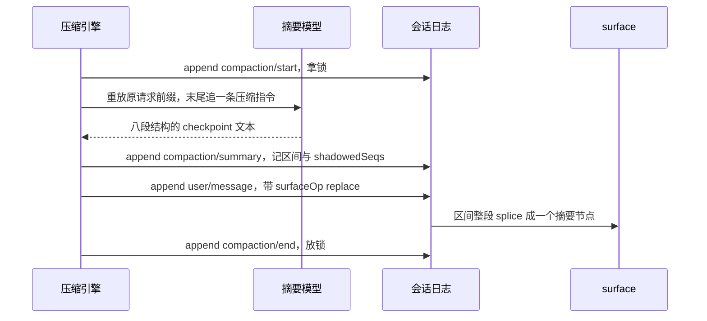
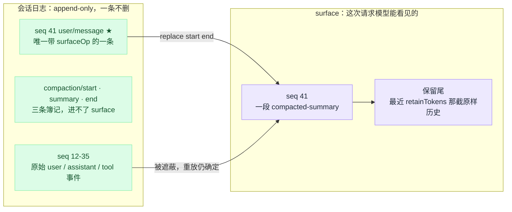
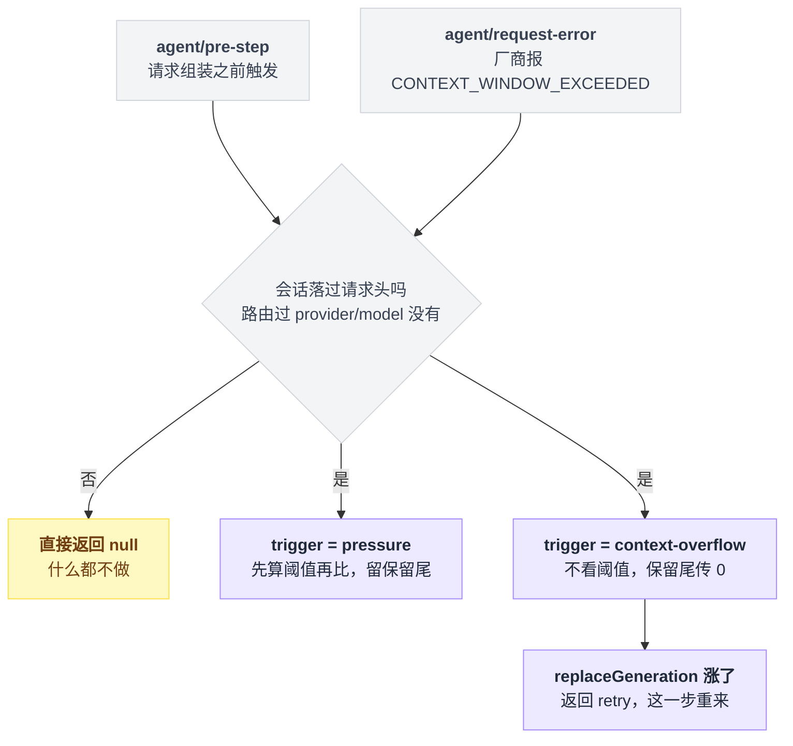
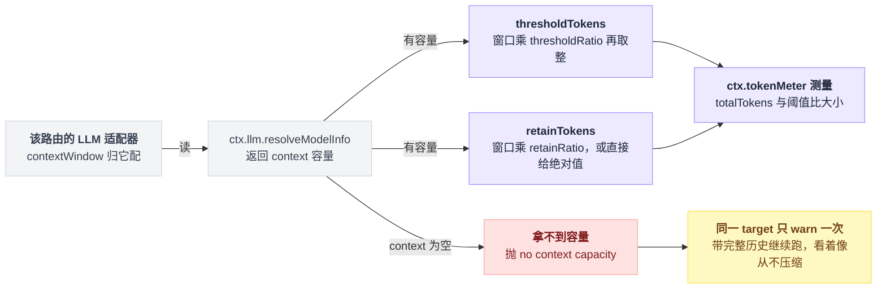
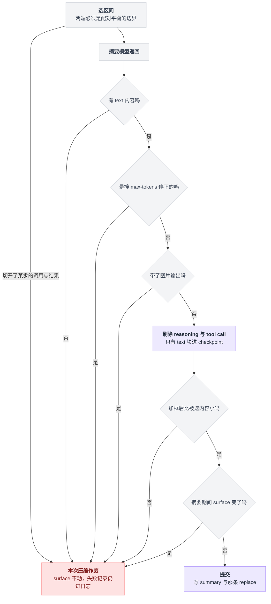
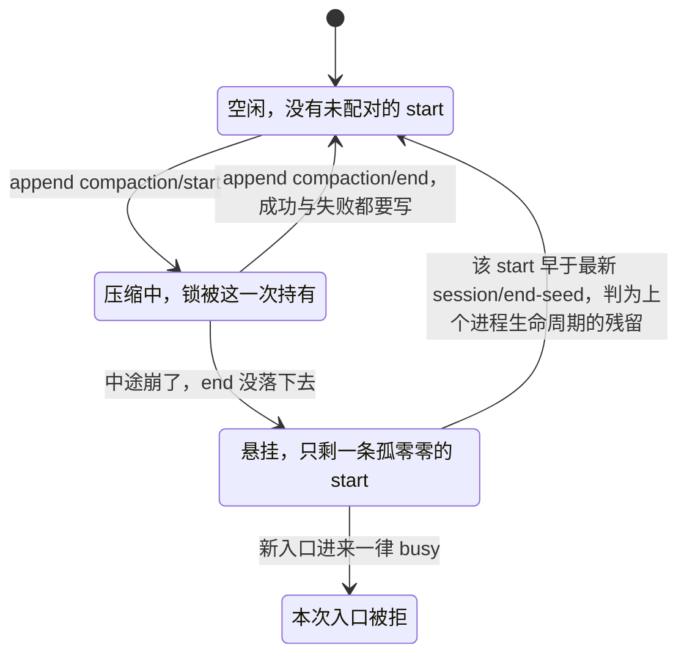

# 17 · 压缩与长会话

> 基于 `deepseek-ai/deepseek-harness` v0.1.0-rc.5（commit `47f9438`），2026-08-14 核对。正文只讲机制；可照抄的代码统一收在文末[附录](#附录可以照抄的模板)，出处收在[脚注](#出处)，点角标可跳转。

会话跑到第两个小时，你会在日志里看到这么一行：

```
compaction (step pressure): shadowed 24 surface nodes (seqs 12-35, ~48210 tokens)
```

二十四条历史消失了，换成一段摘要。

第一反应多半是：历史被删掉了，或者至少被改写了。

不是的。日志文件一个字节都没少——这是上一章那条 append-only 日志的直接推论：压缩改的是「模型能看见哪些节点」这层投影，不是日志本身（[16 章](./16-会话日志与分叉.md)）。

这一章要回答的是剩下三个问题：谁决定要压、压哪一段、压完模型看到的到底是什么。读完你应该能对着日志说出自己那次压缩是被什么触发的，以及想换个压法该动哪一行配置。

---

## 减压有三档，只有一档要花钱

先拆第二个误解：「上下文快满了」在 dsh 里不是一个动作。它是三个发生在不同时刻、代价差一个数量级的动作。

| 档位 | 什么时候跑 | 花模型调用吗 | 计量单位 | 改动落在哪 | 插件 |
|---|---|---|---|---|---|
| spill 溢写 | 单个工具刚返回时 | 不花 | UTF-8 字节 | 全文写磁盘，模型只看到预览 + 路径 | `dsh-spill-policy` + `dsh-spill-local` |
| tool-result 修剪 | 压力已超阈值、选摘要区间之前 | 不花 | Unicode 码点 | 日志里追加一条替换版 `tool/result` | `dsh-compaction-tool-result-pruner` |
| 摘要压缩 | 同上，修剪后仍超阈值 | 花一次额外请求 | token（估算） | 一段旧历史被一条摘要节点整段遮蔽 | `dsh-compaction-basic` |

它们在时间轴上是接力关系，**前面两档能挡住的活儿，绝不会传给要花钱的第三档**：

```
工具返回超大文本 ──spill──► 日志里存的就是"预览+磁盘路径"（整段 ≤ maxInlineBytes）
                                  │
     每步开始前测一次压力 ◄───────┘   agent/pre-step，请求组装之前
                                  │  totalTokens ≥ thresholdTokens ?
                                  ├─ 否 ──► 什么都不做
                                  └─ 是 ──► 修剪超长 tool/result ──► 重新测量
                                                                     ├─ 已降到阈值下 ──► 收工，不调模型
                                                                     └─ 仍超 ──► 选区间 → 调模型出摘要 → replace
```

> 想知道同一个问题上 Pi / Codex / LangChain 各自怎么做，见 [五个 agent 系统源码解剖](../2026-08_五个agent系统源码解剖/00-总览与阅读指南.md)。

本章的主角是第三档。前两档各自的脾气留到后半章，先把最贵的这条路走通。

---

## 一次成功的压缩，恰好追加四条事件

日志只追加不修改，那"让老历史消失"这件事怎么做到？

答案立成一根柱子：**让历史消失的唯一手段，还是追加。** dsh 往日志尾巴写四条事件，其中只有一条碰 surface[^1]：

```
compaction/start    log-only，拿锁
   （调模型出摘要，这一步不落事件）
compaction/summary  log-only，记摘要、被遮区间、shadowedSeqs、token 数、provider/model
user/message        ★ 唯一一次改动 surface：surfaceOp = { op:'replace', start, end }
compaction/end      log-only，放锁
```

四条事件之间还夹着一次不落盘的模型调用。摊在时间轴上，谁只写日志、谁动 surface 就分得很清楚：



看到这里你该问：摘要为什么非要"搭车"在一条合成的 `user/message` 上，而不是让 `compaction/summary` 自己上场？

因为 `SurfaceEventType` 是个封闭联合，只有 `user/message`、`assistant/message`、`tool/result` 三种事件允许携带 `surfaceOp`；`compaction/*` 事件天生进不了 surface，它自己没法把自己放上去[^2]。

顺带一提，压缩这个包实际声明了四种 `compaction/*` 事件——start / summary / end / prune，而子系统文档还写着"三种"，是 `compaction/prune` 加进来之后没同步[^3]。

### surface 那一侧只是一次数组 splice

整个区间换成一个新节点[^4]：

```
replace 前： [12] [13] [14] [15] [16] [17]
              └──── 被遮蔽 ────┘
replace 后： [ 41 ] [16] [17]        41 = 摘要节点的 seq
```

换个角度看同一件事：日志那一侧一条没少，变的只是模型这一侧的入口——被遮的那些节点从投影里退场，位置上换成一个摘要节点。



### 自己实现 replace，有两处特别容易翻车

**新节点的 `sourceEventSeqs` 必须一个不落地列出它遮蔽的所有源节点 seq。** 少写一个当场抛：`surface replace: sourceEventSeqs must include every shadowed surface node; missing …`。compaction-basic 的写法是把 start、summary 两条簿记事件的 seq 也连同全部被遮 seq 一起列进去[^5]。

**start 和 end 说的是 surface 上的位置，不是 seq 的大小。** 校验拿下标比，不比 seq 值。我第一遍读这里读错了，以为 start 大于 end 是数据坏了。其实上一次压缩留下的那个摘要节点 seq 很大，位置却很靠前，所以 start 大于 end 完全正常，不是 bug；真正权威的是 shadowedSeqs 那个有序列表[^6]。

### 连锁都在日志里

`compaction/start` 先落盘、`compaction/end` 最后落盘。中途崩了就留下一个没配对的 start，下次进来直接报 busy——宁可卡住，也不留一个假装压缩成功的 end。被遮蔽的原始事件仍在日志里躺着，重放依然确定[^7]。

---

## 触发它的只有两件事

你可能以为有个后台线程在盯着上下文水位。没有——自动压缩的两个入口都是事件监听器，由 compaction-basic 在构造时注册，前提是 `auto` 开着，这是默认值[^8]。

| 触发器 | 挂在哪个事件上 | 语义 |
|---|---|---|
| `pressure` | `agent/pre-step`，请求组装之前 | 估算 token 超过阈值 |
| `context-overflow` | `agent/request-error`，且错误码正是"超窗"那一个 | 厂商已经明确说超窗了 |

两个入口最后汇进同一个按需压缩入口，只是带着不同的 trigger 进去，之后的脾气就分岔了：



把这张图写成一段示意代码，两条路的差别更直白：

```
compactIfNeeded(trigger):
    if 会话还没落过请求头:            return null   // 没路由过任何 provider/model
    if 有未配对的 compaction/start:   return busy

    if trigger == pressure:
        if totalTokens < thresholdTokens:  return null
        修剪超长的 tool/result
        if totalTokens < thresholdTokens:  return null   // 省掉一次摘要请求
        区间 = selectCompactableRange(..., retainTokens)  // 留保留尾

    if trigger == context-overflow:
        区间 = selectCompactableRange(..., 0)             // 不看阈值，保留尾传 0

    摘要 = 调模型(重放原请求前缀 + 一条压缩指令)
    过六道防线，写 summary 与那条 replace

    if trigger == context-overflow 且 surface.replaceGeneration 涨了:
        return { kind: 'retry' }                          // 这一步重来
```

两条路的性格差异有个简单的解释：pressure 是"我估计要满了"，所以谨慎——先比阈值，压的时候留一截保留尾；context-overflow 是"厂商已经定案说满了"，估算没有发言权，就没必要再看阈值、也不留保留尾。后者压完只要 surface 那个"被 replace 过几次"的计数器涨了，就返回"重试"，让这一步重来[^10]。

还有个前置条件很容易漏掉：会话还没落过一次请求头（没路由过任何 provider/model）时，按需压缩直接返回空，什么都不做[^10]。

剩下的是这两个入口自身的一些登记信息：

- 两个事件都是 waterfall 模式（[11 章](./11-waterfall专章.md)），声明处都标着[^9]。
- 超窗错误码是个常量，值就是那串字符串本身[^9]。
- 除了这两个入口监听器，还有两个纯记账监听器：agent 变 idle 或收到新的 `assistant/message` 时，把超窗重试计数清零[^8]。

---

## 阈值是个比例，分母不归压缩管

阈值不是一个写死的 token 数，是按最近一次落盘请求所用模型的窗口容量现算的[^11]：

```
thresholdTokens = floor(contextWindow × thresholdRatio)
retainTokens    = floor(contextWindow × retainRatio)     若没给绝对值
```

能拧的旋钮就这么几个[^12]：

| 键 | 默认 | 含义 |
|---|---|---|
| `thresholdRatio` | `0.8` | 到窗口的 80% 就压 |
| `retainRatio` | `0.16` | 最近 16% 的历史原样保留（与 `retainTokens` 二选一） |
| `summarizationProvider` / `summarizationModel` | `''` / `''` | 空对 = 跟着会话当前路由走 |
| `maxTokens` | `8192` | 摘要生成上限（可能被推理 token 吃掉） |
| `compactionRetries` | `1` | 第一次压完还超阈值，最多再补几次 |
| `maxOverflowRetries` | `1` | 超窗恢复的重试上限，`0` = 只关恢复 |
| `auto` | `true` | 置 `false` 则上面那四个监听器一个都不注册，只留手动 |
| `modelPolicies` | `[]` | 按 provider + model 精确覆盖上表中除 `auto` / `modelPolicies` 外的任意一项 |

这条算式有个陷阱藏在分母里：**分子由压缩自己现算，分母却在别人手里。** 窗口容量不归压缩模块管，归该路由的 LLM 适配器——压缩去问适配器的模型信息接口要容量，问不到就整条断掉[^13]。



断掉时抛的是 `compaction-basic: no context capacity for <provider>/<model>; configure contextWindow on that adapter model`。但你多半看不到这个报错——自动路径对同一个 target 只 warn 一次，然后带着完整历史继续跑[^13]。所以症状是"看着像从不压缩"，而不是报错。

**"我明明配了阈值却从来不压缩"，先查这里。** 好在内置的两个适配器都自带兜底容量——比如 DeepSeek 适配器的默认窗口是 1,000,000[^14]——所以这条主要坑的是自定义适配器。

base bundle 里这一串默认就挂着：token 计量、compaction-basic（不带任何 config）、command-compact、tool-result-pruner、spill 两件套[^15]。

---

## 摘要请求就是上一次请求的真前缀

直觉上，摘要应该另起一个干净的 summarizer 会话：把要压的那段消息塞进去，配一个"请总结"的 system prompt，省钱又省事。

dsh 反着来——它把原对话的前缀原样重放一遍：

```
摘要请求 = [
    原对话那份 system prompt,        // 一字不改
    原对话那份 tools schema,         // 一字不改
    ...被遮区间自己的那些消息,
    user("请按八段结构总结…"),        // 唯一新增的一条
]
```

整个数组除了最后那条指令，逐字就是上一次真实请求的前缀[^16]。

理由是 KV cache。厂商对完全相同的请求前缀有缓存，这次调用既然是上一次请求的真前缀，热缓存就能一路复用到最后那条指令为止[^17]。"干净的 summarizer 会话"看着省 token，其实每个 token 都是全价；重放前缀多带了 token，但都是缓存价。

### 指令要求的八段结构

模型必须严格输出八段固定 Markdown 结构，缺一段就写 "(none)"，不许少[^18]：`Primary Request and Intent` / `Key Technical Concepts` / `Files and Code` / `Errors and Fixes` / `Pending Jobs` / `Current Work` / `Next Step` / `Critical Context`。

里面有两条规则值得单独拎出来。

一是路径、命令、报错原文、标识符、数值、函数签名要逐字保留[^18]。

二是如果历史里已经有一个 `<compacted-summary>` 块，那是上一次的 checkpoint，要合并成一份，不许照抄下去[^18]——否则摘要会像滚雪球一样越滚越大。

落到日志上的那条 `user/message` 长这样[^19]：

```
This is an automatically generated checkpoint condensing an earlier span …

<compacted-summary>
（模型吐出来的八段结构）
</compacted-summary>
```

### 用哪个模型出摘要

按"显式配的 → 最近一次落盘请求的路由 → agent 自己的"三级回退，三个都没有就抛错[^20]：

| 优先级 | 取哪个 |
|---|---|
| 1 | 显式配的 pair |
| 2 | 最近一次落盘请求的路由 |
| 3 | agent 自己的 provider/model |

请求带着"这是压缩用途"的标记，DeepSeek 适配器据此加一个专用请求头，body 一个字不动[^20]。

---

## 六道防线拦着摘要模型犯浑

摘要这一步是把控制权交给了模型，而模型是会出岔子的。dsh 对此的姿态立成一根柱子：**摘要模型再不靠谱，最坏结果也只是本次压缩作废，surface 一动不动。** 下面这些不是"建议"，是会当场抛错的检查[^21]。

1. **摘要必须比被遮内容小**，按加框之后的 token 算。不小就抛 `summary is not smaller than the shadowed content (N estimated framed tokens >= M)`。
2. **摘要里不能有图片输出。** 抛 `LlmError('compaction summary cannot contain image output', 'UNSUPPORTED_CONTENT')`，而不是把图悄悄丢掉了事。
3. **只有 text 块能进 checkpoint。** reasoning 和 tool call 一律剔除，免得泄露推理过程、或者造出一个没有主人的工具调用。
4. **撞上 `max-tokens` 结束视为失败**，报 `summarization truncated at the token cap (incomplete checkpoint)`。宁可这次不压，也不留半截 checkpoint。
5. **空摘要视为失败**：`summarization produced no text summary content`。
6. **区间两端必须 tool 调用/结果配对平衡**，不能从一个 step 的调用和结果中间切开：`compactRegion: start seq N is not a balanced boundary (would split a step's tool-call/result pair)`。

这些检查串在同一条路上，从选区间一直排到提交前的最后一刻，任何一道不过，本次压缩整体作废：



### 跟并发有关的还有两道，逻辑更微妙一些

**摘要跑着的时候 surface 变了就作废**，但自动和手动的严格程度不一样：自动压缩要求整个 surface 逐节点相等；手动 `/compact` 只要求选中的那一段没变，因为摘要期间允许有别的东西被注入进来[^22]。

**锁的判定要看时代。** 任何入口进来先查有没有未配对的 `compaction/start`，有就 busy；但如果那个 start 比最新的 `session/end-seed` 还早，它属于上一个进程生命周期的残留，不拦。写成三行就是：

```
未配对的 start = 最后一条 compaction/start，且其后没有 compaction/end
if 不存在这样的 start:                          放行
elif 该 start 早于最新的 session/end-seed:      放行   // 上个进程生命周期的残留
else:                                          busy
```

包内还自带一个 invariant companion 逐条校验事件配对，例如 `compaction/summary repeated within one compaction`、`successful compaction/end requires one compaction/summary`[^23]。

这把锁没有任何内存状态，它的全部状态就是日志里 start 和 end 配没配上：



撞上任何一道，会话都不会被搞坏。

changed 和 summary 两类失败不改动 surface，但失败记录仍然留在日志里。自动路径只 warn 一句 `step compaction failed: …; continuing the turn`，然后带着超预算的完整历史继续跑。重试若干次还压不下去，才抛 `compaction still above threshold after N compaction attempts`[^24]。

---

## tool-result-pruner：能不调模型就不调

回到接力赛的第二棒。这是可选的一档补充策略，compaction-basic 用软引用去找它，没装照样跑[^25]。

它只在压力已经超阈值之后才动手，动完重新测量；如果这一下就降到阈值以下，这一步完全不调模型[^25]。所以它的价值不在压得多干净，在于省掉一次摘要请求。

有个反直觉的地方：它算的是 **Unicode 码点，不是 token**，所以只能当粗筛用，"到底降下来没有"仍然以 token 计量服务的测量为准[^26]。

超预算的 `tool/result` 被替换成「头 + 固定标记 + 尾」：

```
替换后的 content = 头 headChars 个码点
                 + "\n\n[... tool result middle pruned ...]\n\n"
                 + 尾 tailChars 个码点
turn / step / callId / 错误字段：原样保留，只改 content
```

| 键 | 默认 |
|---|---|
| `thresholdChars` | `8192` |
| `headChars` | `4096` |
| `tailChars` | `1024` |

标记常量、三个默认值、"只改 content"的承诺都写在包里[^27]。

每次替换之前会紧邻着同步追加一条 `compaction/prune` 影子定价事件，把被遮节点的估算 token 记下来，这样纯函数消费者不必自己记账[^28]。

它救不了两类东西：非工具类的大节点，以及修剪完剩下的部分仍然超窗的工具对[^29]。而且修剪是纯语法的，不判断中间哪几行更重要[^26]。

---

## spill 和压缩解决的不是同一个问题

接力赛的第一棒其实不在压缩家族里。spill 是另一条线，发生得比压缩早得多：它是挂在"工具执行后"拦截点上的一个变换器，工具刚返回就动手[^30]。

| | spill | 压缩 |
|---|---|---|
| 触发 | 单个工具结果 > `maxInlineBytes`（base 里配 50000）[^30] | 整个请求的估算 token 超阈值 |
| 看的范围 | 一次工具调用 | 整条会话历史 |
| 全文去哪 | 写磁盘：`<root>/session-<sha256前缀>/<随机>-<安全名>`[^31] | 不搬家，留在日志里 |
| 模型看到 | 头尾预览 + `(Omitted N bytes. Full formatted result stored at: <路径>. <取回提示>)` | 一段 `<compacted-summary>` |
| 模型还能拿回来吗 | 能，用 `read` / `grep` 去读那个路径 | 不能，只剩摘要 |
| 失败了怎么办 | best-effort：存不下就保留原始内联结果，绝不把成功的调用变成 `isError`[^32] | 见上面那六道防线 |

一句话分工：spill 是可逆的搬家，压缩是不可逆的遗忘。

几个边界值得记住[^32]：

- `read` 工具的结果不 spill——否则 `read → spill → 再 read` 就死循环了。
- 被 block 的结果不 spill。
- 非纯文本结果不 spill。

spill 文件没有生命周期清理，因为 resume / fork 出来的会话可能还引用着那个路径；spill 之后的结果会一直留在历史里，直到某次压缩把它吃掉[^33]。

---

## 实操 A：把阈值调低一点

用户 patch 的叠放有四层，后面的盖前面的：各 bundle 自带的 patch → profile 目录里的 → 家目录全局的 → 命令行 `--patch` 覆盖层[^34]。

把下面这段写进 `~/.dsh/profiles/web/cordis.patch.yml`：

```yaml
- id: compaction-basic
  config:
    thresholdRatio: 0.6
    retainRatio: 0.2
    maxTokens: 4096
    modelPolicies:
      - provider: deepseek-official
        model: deepseek-v4-flash
        thresholdRatio: 0.75
```

`provider` / `model` 必须写成路由上真实存在的那一对，`modelPolicies` 是精确匹配，不做前缀也不做通配；base 的默认路由就是上面这一对[^35]。

改完用 `dsh --profile web --dump-config` 看合成结果[^36]，确认 `compaction-basic` 那一行的 config 就是你想要的。

这里有三个坑，我把最阴的那个放前面。

**按 id 打 patch 是整体替换 config，不是深合并**[^37]。base 里 compaction-basic 本来就没 config，所以上面这例是安全的。

但 tool-result-pruner 在 base 里带着三个字段，你只把阈值一个字段改成 4096，另外两个就退回插件默认值 4096 和 1024，于是 4096 + 39（标记的码点数）+ 1024 = 5159 > 4096，插件加载直接失败：`ToolResultPruneConfig: headChars + marker + tailChars (5159) must be at most thresholdChars (4096)`[^37]。要改就三个一起写全。

**配错是加载期失败，不是运行期降级**[^38]。

| 配错法 | 报什么 |
|---|---|
| 写了未知键 | `BasicCompactionConfig: unknown key "<键>"` |
| `retainRatio` 和 `retainTokens` 同时给 | `retainRatio and retainTokens are mutually exclusive` |
| `retainRatio >= thresholdRatio` | 直接抛 |
| `summarizationProvider` / `summarizationModel` 一个空一个非空 | 抛（两者必须成对出现，同为空或同为非空） |

**`retainTokens` 这种绝对值得等模型容量出来才能校验**，所以它的报错来得晚——第一次能解析到该 target 时才失败：`retainTokens (N) must be less than threshold tokens M`[^38]。

压缩成功那一刻，日志里会留下开头那行 info[^39]。

---

## 实操 B：手动压一次

`/compact` 由 `dsh-command-compact` 注册成一条全局命令，不触发模型 turn；base 默认挂着它，Web 客户端提供命令适配器[^40]。

三种输入三种结果[^41]：

| 输入 | 结果 |
|---|---|
| `/compact` | `Compacted N history items (~T tokens).` |
| 没有可压的历史 | `No compactable history yet.`，一条事件都不写 |
| `/compact 随便什么参数` | `Usage: /compact (no arguments)`，压根不调后端 |

它走的是手动入口 `compactNow`，跟自动路径有三处不同：低于阈值也照压，标记对写成不属于任何 turn 的独立 bracket，返回之前还要等一次持久化 flush[^42]。

失败码一共六个，命令层把它们映射成六句固定文案[^43]：

| 失败码 | 说明 |
|---|---|
| `busy` | 有 turn 在跑，或者已经有一次压缩在进行 |
| `cancelled` | → `Compaction cancelled.` |
| `changed` | 不改动会话，失败记录留在日志里 |
| `summary` | 同上，不改动会话，失败记录留在日志里 |
| `commit` | — |
| `persistence` | — |

包 README 的表只列了其中五个，漏掉了 `cancelled`[^43]。

两条限制。

**只能在 idle 时用**，命令本身不排队[^44]。

**不接受区间参数**——指定区间只有编程入口 `compactRegion`，而且它要求会话有一个打开着的 turn，在全闭合的会话上调会抛 `compactRegion: no open turn — automatic compaction events must be enclosed in a turn`[^44]。

没有命令适配器的形态就只剩自动压缩了；headless bundle 的 patch 里确实没插任何命令适配器[^45]。

---

## 实操 C：换掉压缩策略

按力度从轻到重排，多数需求停在第二档就够了。

**只关自动。** 给 compaction-basic 那一行打个 patch，`/compact` 仍然可用，四个监听器一个都不注册[^46]：

```yaml
- id: compaction-basic
  config:
    auto: false
```

**只换摘要生成方式。** `summarize` 是唯一的子类钩子，压力判断、保留策略、区间选择、收缩校验全部照旧[^47]。模板照抄[附录 A](#a-只换摘要生成方式的模板引擎)。

返回值不带 `llmStreamCall` 就归到"未标记"分支，`rawOutput` 可选[^47]。

附录那个模板根本不发请求，所以省掉了第三个 `signal` 参数——但只要你的实现真去调模型，就必须把 `signal` 收下并透传进去[^47]。

另外别忘了那六道防线照样生效：模板摘要如果不比被遮内容小，一样会被拒。

**整体顶替后端。** `CompactionEngine` 是 cordis Service，构造时以 compaction 之名注册[^48]。

同一个 isolate 里重复注册同名 service，cordis 会抛 `service "compaction" has been registered at <…>`[^48]，所以必须先禁掉原来那行再插自己的。patch 的写法（`disabled` 与 `insert` 的形态照抄 headless bundle 的 patch[^49]）：

```yaml
- id: compaction-basic
  disabled: true
- insert:
    - id: my-compaction
      name: '/absolute/path/to/my-compaction/index.ts'
```

本地插件路径必须是绝对路径[^49]。想临时试一下不用改 profile：`dsh web --patch ./my-compaction/cordis.yml`——注意启动器的 flag 必须写在应用参数之前[^49]。

从零实现要写全三个抽象方法——按需压、立即压、指定区间压（`compactIfNeeded` / `compactNow` / `compactRegion`），并且替换用的那条 user 消息必须用 `compactCheckpointSource` 生成的 source，否则包内 invariant 会拒[^50]。

**彻底不要压缩。** 把 `compaction-basic` 和 `command-compact` 两行都 `disabled: true`。代价是上下文满了只会撞厂商的超窗错误，没有任何恢复动作。

---

## 一句话带走

把全章倒着串一遍，每一条结论都该能从前面的画面里自己长出来：

- 开头那行日志说"二十四条历史消失了"，可日志一个字节没少——因为**让历史消失的唯一手段是追加**：四条事件里只有那条合成的 `user/message` 带着 replace 指令，`compaction/*` 进不了封闭联合，只能搭车；
- surface 那侧只是一次数组 splice，所以 start 大于 end 不是数据坏了，是上一次的摘要节点 seq 大、位置靠前；
- 没有后台线程盯水位，触发只有两个事件入口：pressure 是"我估计要满了"所以看阈值、留保留尾，context-overflow 是"厂商已定案"所以不看阈值、保留尾传 0；
- 阈值按当时模型的窗口容量乘比例现算，分母在适配器手里——所以"配了阈值却从不压缩"的第一嫌疑人是分母缺失，症状还偏偏是静默的（同一 target 只 warn 一次）；
- 摘要请求刻意重放上一次请求的真前缀，多带的 token 走缓存价，"干净会话"的每个 token 才是全价；
- 摘要模型会犯浑，但六道机械防线加两道并发防线保证最坏结果只是**本次压缩作废，surface 不动**，锁的全部状态就在日志的 start/end 配对里；
- 摘要要花钱，所以前面垫了两棒不花钱的：spill 是可逆的搬家（路径还在，`read` 能取回），pruner 是码点粗筛（省掉一次摘要请求）——**前两棒能挡住的活儿，绝不传给第三棒**。

---

## 附录：可以照抄的模板

### A. 只换摘要生成方式的模板引擎

对应实操 C 的第二档：继承基础引擎，只覆写 `summarize`[^47]：

```ts
import { BasicCompactionEngine } from '@deepseek-ai/dsh-compaction-basic'
import type { SummarizationInput, SummaryResult } from '@deepseek-ai/dsh-compaction-basic/src/summarizer.ts'
import type { Agent } from '@deepseek-ai/dsh-agent'

export class TemplateCompactionEngine extends BasicCompactionEngine {
  protected override async summarize(
    input: SummarizationInput,
    agent: Agent,
  ): Promise<SummaryResult> {
    const text = `## Current Work\n- elided ${input.messages.length} messages`
    return { summary: [{ type: 'text', text }], provider: 'local', model: 'template' }
  }
}

export default TemplateCompactionEngine
```

---

## 出处

[^1]: 四条事件的说明：`packages/compaction/compaction/README.md:41-49`；四次 append 分别在 `packages/compaction/compaction-basic/src/region.ts:189`（start）、`:447`（summary）、`:462`（user/message）、`:215`（end）。
[^2]: `SurfaceEventType` 封闭联合（只有这三种事件可带 `surfaceOp`）：`packages/core/session/src/types.ts:343-346`；`compaction/*` 进不了 surface：`docs/subsystems/compaction.md:11`。
[^3]: 四种 `compaction/*` 事件的声明：`packages/compaction/compaction/src/types.ts:16-89`；子系统文档仍写"三种"，是 `compaction/prune` 加入后未同步。
[^4]: replace 在 surface 侧就是一次数组 splice：`packages/core/session/src/surface.ts:369-370`。
[^5]: `sourceEventSeqs` 缺漏当场抛：`packages/core/session/src/surface.ts:239-242`；compaction-basic 把 start、summary 的 seq 连同全部 shadowedSeqs 一起列进去：`packages/compaction/compaction-basic/src/region.ts:462-465`。
[^6]: start / end 按 `indexOf` 出来的下标比、不比 seq 值：`packages/core/session/src/surface.ts:250-260`；"start > end 完全正常"：`docs/subsystems/compaction.md:44-52`；shadowedSeqs 才是权威列表：`:53-54`。
[^7]: 未配对 start 导致 busy、"宁可卡住"：`docs/subsystems/compaction.md:19`、`packages/compaction/compaction/README.md:49`、`:57`；被遮事件仍在日志、重放确定：`packages/compaction/compaction/README.md:53`。
[^8]: 两个入口监听器由构造时注册、`auto: true` 是默认值：`packages/compaction/compaction-basic/src/index.ts:129`；pre-step 与 overflow 恢复两个监听器：`:147-165`、`:179-223`；两个纯记账监听器（清零超窗重试计数）：`:167-177`。
[^9]: 两个事件的 `@mode waterfall` 声明：`packages/core/agent/src/runtime-types.ts:229-231`、`:258-260`；错误码常量 `CONTEXT_WINDOW_EXCEEDED_CODE`，值就是字符串 `'CONTEXT_WINDOW_EXCEEDED'`：`packages/llm/llm/src/error.ts:25`。
[^10]: overflow 不看阈值、保留尾传 0（`selectCompactableRange(..., 0)`）：`packages/compaction/compaction-basic/src/index.ts:283-291`；`surface.replaceGeneration` 涨了就返回 `{ kind: 'retry' }`：`:191`、`:218-222`；会话未落过请求头直接返回 `null`：`:263-264`。
[^11]: 阈值按窗口容量现算：`packages/compaction/compaction-basic/src/config.ts:144-147`。
[^12]: 各旋钮与默认值：`packages/compaction/compaction-basic/src/config.ts:20`、`:23`、`:89-95`；`modelPolicies` 按 `{provider, model}` 精确覆盖：`:26-35`。
[^13]: 容量取自 `(await ctx.llm.resolveModelInfo(provider, model, signal)).context`，拿不到就抛、且对同一 target 只 warn 一次后带完整历史继续跑：`packages/compaction/compaction-basic/src/index.ts:293-302`、`:155-162`。
[^14]: `llm-deepseek` 的 `defaultContextWindow` 默认 1,000,000：`packages/llm/llm-deepseek/src/index.ts:97` → `src/adapter.ts:91`。
[^15]: base bundle 的默认挂载：token-meter `packages/bundle/base/cordis.patch.yml:281-282`、compaction-basic `:284-285`（不带任何 config）、command-compact `:289-290`、tool-result-pruner `:360-365`、spill 两件套 `:346-352`。
[^16]: 重放前缀的组装：`packages/compaction/compaction-basic/src/region.ts:498-514`、`packages/compaction/compaction-basic/src/summarizer.ts:145-163`。
[^17]: KV cache 理由：`packages/compaction/compaction-basic/src/summarizer.ts:24-29`、`packages/compaction/compaction-basic/README.md:156`。
[^18]: 八段结构的压缩指令全文：`packages/compaction/compaction-basic/src/summarizer.ts:31-66`；"逐字保留"在 `:61`；"合并上一个 checkpoint、不许照抄"在 `:65`。
[^19]: checkpoint 的外框文案与落盘：`packages/compaction/compaction-basic/src/summarizer.ts:69-70`、`:189-195`。
[^20]: 三级回退 `configured ?? latest ?? agentTarget`：`packages/compaction/compaction-basic/src/summarizer.ts:128-143`；请求带 `purpose: 'compaction'`：`:161`；DeepSeek 适配器据此加 `x-deepseek-harness-compact: 1` 请求头、body 不动：`packages/llm/llm-deepseek/src/adapter.ts:293`、`packages/compaction/compaction-basic/README.md:18`。
[^21]: 六道防线逐条：收缩校验 `packages/compaction/compaction-basic/src/region.ts:373-378`；图片输出即抛 `packages/compaction/compaction-basic/src/summarizer.ts:217-222`；只留 text 块 `:223`；撞 max-tokens 视为失败 `:206-210`；空摘要视为失败 `:170-172`；配对平衡边界 `packages/compaction/compaction-basic/src/region.ts:327-333`。
[^22]: 自动压缩要求整个 surface 逐节点相等：`packages/compaction/compaction-basic/src/region.ts:387-396`；手动只要求选中区间没变：`:403-424`、`packages/compaction/compaction/README.md:51`。
[^23]: 锁判定（未配对 start；早于最新 `session/end-seed` 则放行）：`packages/compaction/compaction-basic/src/region.ts:286-298`；invariant companion 的逐条校验：`packages/compaction/compaction/src/invariant.ts:184`、`:215`。
[^24]: changed / summary 两类失败不动 surface、失败记录仍进日志：`docs/subsystems/compaction.md:84`；自动路径 warn 后继续跑：`packages/compaction/compaction-basic/src/index.ts:161`；重试用尽才抛：`:328-331`。
[^25]: 软引用 `ctx.get('toolResultPruner')`：`packages/compaction/compaction-basic/src/index.ts:281`；修剪后重新测量、降到阈值下就不调模型：`:308-312`。
[^26]: 计量单位是 Unicode 码点、只能当粗筛：`packages/compaction/compaction-tool-result-pruner/README.md:60`；修剪是纯语法的、不判断重要性：`:61`。
[^27]: 标记常量：`packages/compaction/compaction-tool-result-pruner/src/config.ts:7`；三个默认值：`:10-14`；"只改 `content`"：`packages/compaction/compaction-tool-result-pruner/README.md:11`。
[^28]: `compaction/prune` 影子定价事件：`packages/compaction/compaction-tool-result-pruner/src/index.ts:162-173`、`docs/persistence-catalog.md:299-321`。
[^29]: 救不了非工具大节点与修剪后仍超窗的工具对：`packages/compaction/compaction-basic/README.md:162`。
[^30]: spill 是 `tools/post-execute` 变换器：`packages/spill/spill-policy/README.md:5`；base 里 `maxInlineBytes` 配 50000：`packages/bundle/base/cordis.patch.yml:349-352`。
[^31]: 溢写文件的落盘路径规则：`packages/spill/spill-local/README.md:9`、`:12-13`。
[^32]: best-effort、绝不把成功调用变成 `isError`：`packages/spill/spill-policy/README.md:31`；read 结果 / 被 block / 非纯文本三类不 spill：`:18-19`。
[^33]: spill 文件无生命周期清理（resume / fork 可能还引用着路径）：`packages/spill/spill-local/README.md:33`；spill 后的结果留在历史里直到被压缩吃掉：`packages/spill/spill-policy/README.md:49`。
[^34]: patch 叠放顺序（bundle patch → `$DSH_HOME/profiles/<name>/cordis.patch.yml` → `$DSH_HOME/cordis.patch.yml` → `--patch` 覆盖层）：`apps/cli/README.md:34-37`。
[^35]: `modelPolicies` 精确匹配、不做前缀不做通配：`packages/compaction/compaction-basic/src/config.ts:109-111`；base 默认路由：`packages/bundle/base/cordis.patch.yml:63-67`；模型清单：`packages/llm/llm-deepseek/src/index.ts:49-51`。
[^36]: `--dump-config` 看合成结果：`docs/architecture.md:32`。
[^37]: 按 id 打 patch 整体替换 `config`：`packages/boot/app-boot/README.md:60`；pruner 三字段不写全时的加载期报错：`packages/compaction/compaction-tool-result-pruner/src/config.ts:55-63`（39 是标记的码点数）。
[^38]: 未知键：`packages/compaction/compaction-basic/src/config.ts:278-282`；`retainRatio` 与 `retainTokens` 互斥：`:240-242`；`retainRatio >= thresholdRatio` 直接抛：`:185-190`；summarization 两键必须成对：`:267-274`；`retainTokens` 迟到的校验：`:148-153`。
[^39]: 压缩成功的 info 日志：`packages/compaction/compaction-basic/src/index.ts:139-144`。
[^40]: `/compact` 的注册、不触发模型 turn、Web 客户端提供适配器：`packages/compaction/command-compact/README.md:5`、`:44`。
[^41]: 成功文案：`packages/compaction/command-compact/src/index.ts:70`；没有可压历史：`packages/compaction/command-compact/README.md:12`；带参数直接拒、不调后端：`README.md:13`（同一 README）、`src/index.ts:62-64`。
[^42]: `compactNow()` 与自动路径的三处不同：`packages/compaction/compaction-basic/src/index.ts:368-420`。
[^43]: 六个失败码：`packages/compaction/compaction/src/index.ts:28-34`；映射成固定文案：`packages/compaction/command-compact/src/index.ts:24-54`；README 的表漏掉 `cancelled`：`packages/compaction/command-compact/README.md:19-25`。
[^44]: 只能 idle 用、命令不排队：`packages/compaction/command-compact/README.md:64`；不接受区间参数：`:65`；`compactRegion()` 要求有打开的 turn：`packages/compaction/compaction-basic/src/region.ts:177-179`、`packages/compaction/compaction-basic/README.md:163`。
[^45]: 无命令适配器只剩自动压缩：`packages/compaction/command-compact/README.md:66`；headless bundle 未插任何命令适配器：`packages/bundle/headless/cordis.patch.yml:22-35`。
[^46]: `auto: false` 后四个监听器一个不注册、`/compact` 仍可用：`packages/compaction/compaction-basic/README.md:41`。
[^47]: `summarize()` 是唯一子类钩子：`packages/compaction/compaction-basic/README.md:24`、`packages/compaction/compaction-basic/src/index.ts:236-246`；返回值不带 `llmStreamCall` 归"未标记"分支、`rawOutput` 可选：`packages/compaction/compaction-basic/src/summarizer.ts:88-108`；真调模型必须透传 `signal`：`packages/compaction/compaction/README.md:29`。
[^48]: Service 注册 `super(ctx, 'compaction')`：`packages/compaction/compaction/src/index.ts:96-99`；重复注册同名 service 抛错：`vendor/cordis/src/service.ts:57` → `vendor/cordis/src/reflect.ts:289-291`。
[^49]: `disabled` 与 `insert` 的形态：`packages/bundle/headless/cordis.patch.yml:14-15`、`:22-25`；本地插件路径必须是绝对路径：`docs/user/develop/basic/index.md:56`；`--patch` 临时试：`apps/cli/reference/README.md:59`；启动器 flag 必须写在应用参数之前：`packages/boot/cmdline/README.md:71`。
[^50]: 三个抽象方法与 `compactCheckpointSource(compactionId)` 当 source：`packages/compaction/compaction/README.md:65-67`、`packages/compaction/compaction/src/invariant.ts:63-71`。
