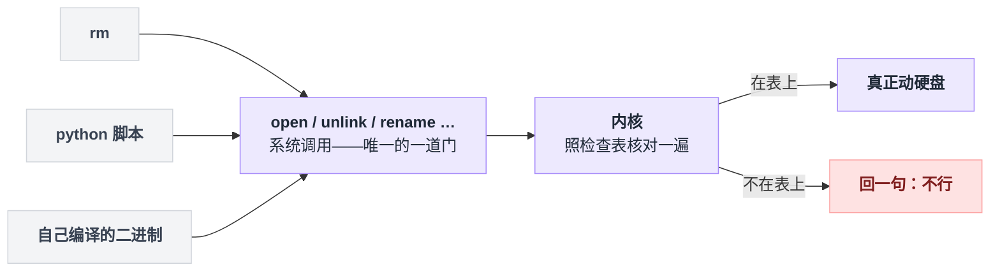
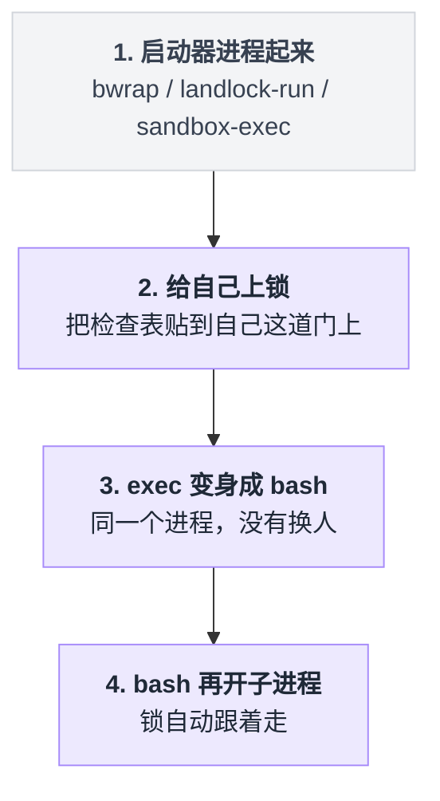
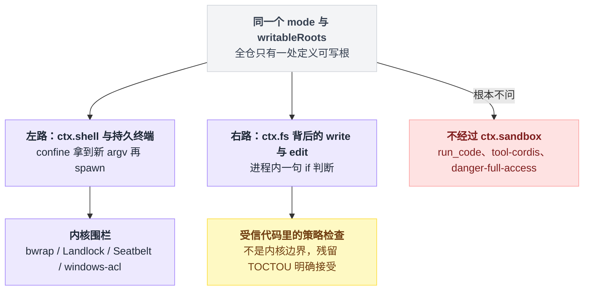
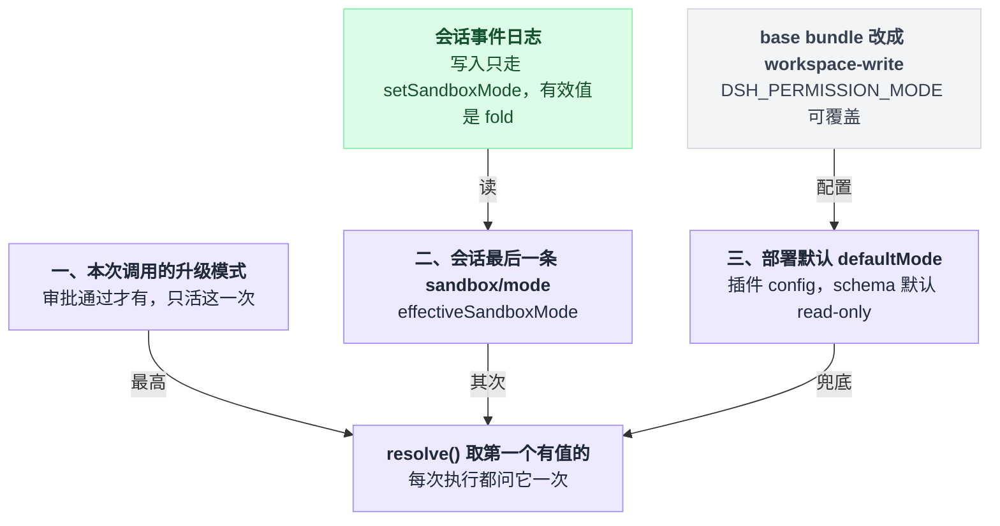
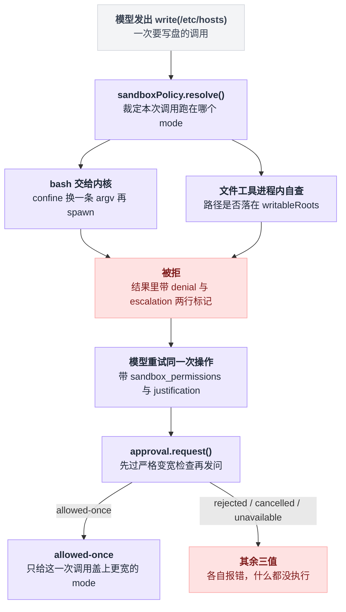
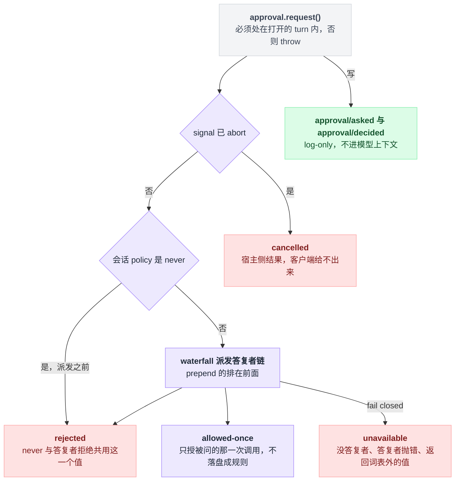
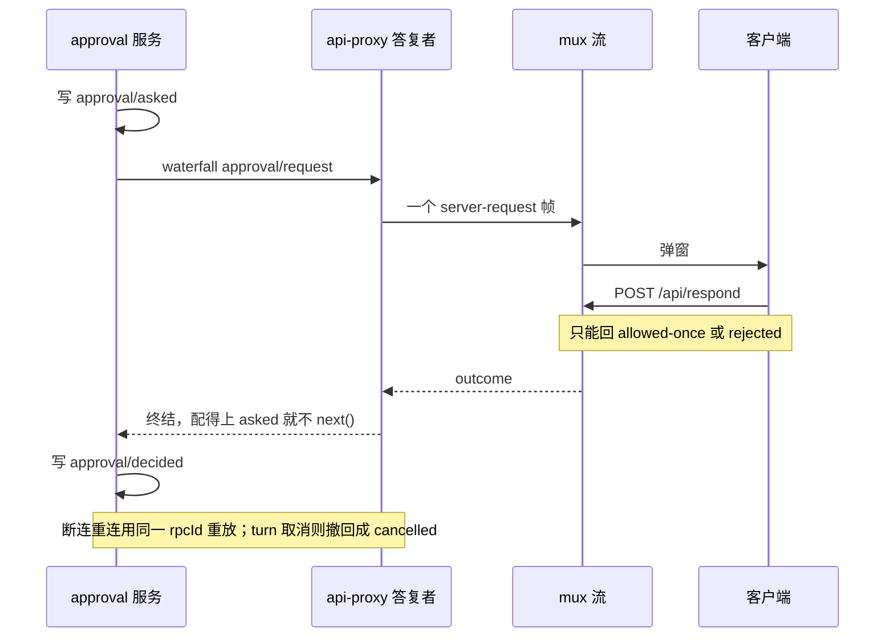
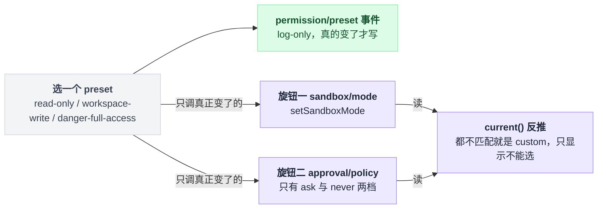
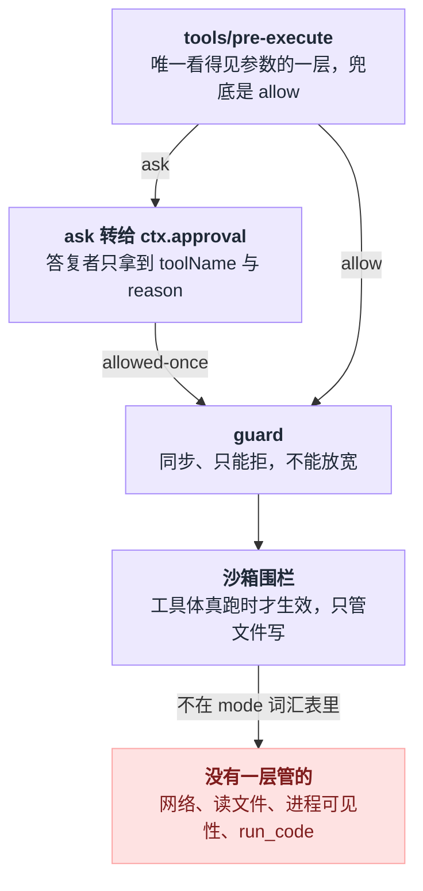

# 18 · 沙箱审批与权限

> 基于 `deepseek-ai/deepseek-harness` v0.1.0-rc.5（commit `47f9438`），2026-08-14 核对。正文只讲机制；可照抄的代码统一收在文末[附录](#附录可以照抄的模板)，出处收在[脚注](#出处)，点角标可跳转。

00 章里有句话：沙箱约束的是世界，不是模型智力。

这一章是那句话的兑现处，也是它的打折处——dsh 的沙箱确实约束世界，但约束的范围比大多数人默认的窄得多。

不过在拆 dsh 之前，得先把三个操作系统层面的画面搭起来。**这三个画面立住了，围栏是怎么回事、为什么它只管写不管读、为什么模型绕不过去、以及为什么有一条路压根不算围栏，全都会自动清楚。** 第四个画面是 dsh 特有的，留到最后当对照。

## 画面一：程序碰不到硬盘，它只能"求人办事"

最常见的误解是：程序想删文件，就自己去删了。

不是的。硬盘、网卡、内存这些东西，普通程序**一根手指都碰不到**。它想删文件，唯一的办法是喊一声"内核，帮我把这个文件删了"。这一声喊叫有个名字，叫**系统调用**（syscall）。



这张图有个特别重要的性质：**门只有一道，没有后门。**

不管命令写得多花哨——`rm`、`python`、`curl`、自己编译的二进制——它想动文件，最后都得走 `open` 这一声喊叫。

于是围栏的思路就出来了：**不用去猜命令想干什么，只要在这道门上挂一张检查表。** 内核每次收到喊叫，先照表核对，不在表上的直接回绝。

这就是所有沙箱的共同本质。它拦的不是"你想干什么"，而是"你能不能得逞"。

## 画面二：锁是进程自己给自己上的

新问题来了：既然是检查表，**谁来贴这张表？**

直觉答案是"外面有个监工进程盯着"。但那样的话，监工必须一直跑着、权限必须比被监视的高，而且模型只要想办法把监工干掉就自由了。

真实机制比这聪明得多，也反直觉得多：**表是被限制的进程自己贴的。**



注意第二步和第三步之间是**同一个进程**，没有换人——先上锁，再变身成 bash。

这套机制靠三条性质撑着，缺任何一条就整个塌掉：

**不可逆。** 限制一旦加上，进程自己没有任何办法解除，内核压根没提供"撤销"这个操作。所以 bash 起来之后已经是被绑住的状态，它想解绑，无绑可解。

**可继承。** bash 开出的每一个子进程、每一次 exec 换成新程序，限制都跟着走。所以模型写一段 python 脚本，或者去跑一个自己下载的二进制，一样跑不掉。

**无特权就能做。** 不需要 root 就能给自己上锁——因为内核规定这个操作**只能收紧、不能放宽**。既然谁也没法用它给自己加权限，内核就放心让所有人随便调。

### 落到 dsh：confine 只改写命令，不执行命令

理解了上面三条，dsh 里那句容易让人困惑的描述就好懂了：`ctx.sandbox` 只有一个方法 `confine`，它**不执行任何东西，只返回替你去 spawn 的那条 argv**[^1]。

它做的事就是把这个：

```
bash -c "rm -rf /etc"
```

改写成大致这样（真实 flag 由 profile 决定[^2]）：

```
bwrap --ro-bind / / --bind <workspace> <workspace> -- bash -c "rm -rf /etc"
```

前半段那个 `bwrap` 就是图里的启动器：它先跑，上锁，然后变身成后半段的 bash。**模型能控制的只有 `--` 后面那一截。**

## 画面三：四种上锁方式，四个生活比喻

不同系统提供的上锁接口不一样，但目的都是往那道门上贴表。用比喻最好懂。

### bwrap（Linux）——换一间假房子

它不改检查表，它改你**看到的世界**：给你重新搭一套文件系统视图，整个硬盘以只读方式摆出来，只有工作区那块可写。

你不是被拒绝，你是根本没有一条通往"可写的 /etc"的路。改写后那条命令里的 `--ro-bind` 就是"整个根目录只读地摆过来"的意思[^2]。

### Landlock（Linux）——门卫手里的名单

房子没变，但门口多了个门卫拿着一张清单：根目录只准读，/dev/null 准写。每次你敲门，门卫照单核对。

profile 里的那张单子就两行：全盘只读，再单独放行空设备可写[^3]。

这里能顺手解释那个让人困惑的 `partial`：Landlock 是较新的内核功能，能管的动作是一版版加上去的。老版本的门卫只认得"开门读"和"开门写"，还不认得"改名字"、"截断"这些花招。探针探到老版本就报 `partial`——意思是"锁确实上了，但这个版本的清单表达不了你想禁的全部动作"。

**这是被报告的事实，不是保证。**

### Seatbelt（macOS）——同样是名单，只是写法不同

它的清单三步走：先全开，再关掉所有写，最后给 /dev/null 单独开一个口子[^4]。

**这个写法本身就解释了一个反直觉的结论：为什么 `read-only` 模式下还能读到 SSH 私钥？**

因为清单上只写了"禁止写"，从来没写过"禁止读"。

所以 `read-only` 模式下的 bash **依然能读** `~/.ssh/id_rsa`，也依然能读 `$DSH_HOME/.credentials.yaml`[^5]。

read-only 的意思一直是"不许写"，不是"看不见"。

三套 profile 在这一点上是一致的——都明写着全盘只读授权，bwrap、Landlock、Seatbelt 三份清单各用各的方言写了同一句话[^2][^3][^4]。

> 想知道这一点上 Pi / Codex / LangChain 怎么做，见 [五个 agent 系统源码解剖](../2026-08_五个agent系统源码解剖/00-总览与阅读指南.md)。

### windows-acl——不发名单，改你的工牌

Windows 没有路径清单这套东西，它的思路是改**你是谁**：给进程发一张受限的工牌，之后每次访问要过两遍核验——按正常身份查一遍，按受限身份再查一遍，两遍都过才放行。

它**恒为 partial**，两个原因都写在代码注释里[^6]：

1. `WRITE_RESTRICTED` 令牌必须在 restricting list 里保留 Everyone——否则系统里大量正常操作会直接崩，可它一留下，任何对 Everyone 开放写权限的地方就还是能写；
2. NTFS 硬链接——权限挂在文件本体上，不是挂在路径上。工作区里的一个文件完全可以在工作区外有另一个名字指向同一份数据，"路径在围栏内"这个前提就破了。

包 README 说得更直白：**写受限，读、网络、进程可见性都不受限**，所以 Windows 上 `read-only` 这个模式无法只靠该机制表达[^7]。

### 四条链的 enforcement 汇总

拿到 argv 的同时还会拿到一个 enforcement 值，它说的是"这台机器上策略被执行得有多完整"[^8]：

| runner | 静态 enforcement |
|---|---|
| bwrap | `full` |
| landlock | 恒由探针给出 `full` / `partial`（老 ABI 报 partial）；静态表里那行 full 走不到 |
| seatbelt | `full` |
| windows-acl | **恒为 `partial`** |

### 挑哪一条链：多候选才探针，一个都不能用就报错

本地实现按平台选一条 runner 链：

```
                     LocalSandboxProvider.confine()
                                │
          ┌─────────────────────┼──────────────────────┐
       linux                 darwin                  win32
    ['bwrap',              ['seatbelt']          ['windows-acl']
     'landlock']                │                      │
   两个候选 → 逐个探针        单候选 → 不探针        单候选 → 不探针
```

选择逻辑就三句：

```
候选链 = 平台对应的那一条
if 候选链只有一个:  直接用它，连探针都不跑
else:               逐个跑探针，第一个能用的胜出
if 一个能用的都没有: throw SandboxUnavailableError   // 绝不降级成不受限执行
```

最后那句是重点：**绝不静默降级成不受限执行**，这是 seam 契约里写死的一条[^9]。这种"出错就往严的方向倒"的姿态下文还会反复出现，本章统一叫它 fail closed。

### 拒绝是从 stderr 文本里"猜"出来的

每次 wrap 除了 argv 和 enforcement，还带回两组 stderr 分类字典[^10]：

- `denialSignatures`：记录这个后端拒绝写时会吐什么字——bwrap 的 `read-only file system`、Landlock 的 `permission denied`、Seatbelt 的 `operation not permitted`
- `runnerFailureRules`：记录 runner 自己挂掉的证据

这里最容易踩的是：**拒绝是猜出来的。** 一个恰好打印了同样字样的普通报错会被误判成 denial，一条被截断的 denial 会被漏判[^11]。

dsh 自己就在这上面栽过——Landlock 老内核每次都打印一行良性提示，早期实现把它当成 runner 失败，结果 ripgrep 那个"无匹配 exit 1"被报成了 `SANDBOX_UNAVAILABLE`[^12]。

现在的规则收紧成三条同时成立才算 runner 挂了[^13]：

```
if exit code 没过闸门:            不算 runner 挂
lines = stderr 按整行剔除精确良性行
if lines 里没有命中致命签名:      不算 runner 挂
否则:                            才判定 runner 失败
```

## 画面四：还有一条路，根本没走内核

前面讲的全是 bash 那条路。但 dsh 里还有另一条完全不同的路，**这是本章最想让你注意的地方**。



左路是把命令整个交给内核：先请 `confine` 把整条 bash 命令改写成新 argv，再拿它去 spawn；持久终端走同一条路[^14]。

右路具体做的事，说穿了就是一句 if 判断：

```
把模型给的路径整理成标准形式
if 开头不是工作区那个前缀:  return 一个错误
```

**全程没有内核什么事**。它的模块注释自己都承认了："这是受信代码里的策略检查，不是内核边界"[^15]。

### 那它凭什么还算数

打个比方：左边是给保险柜上了把锁，右边是收银员自己写了张纸条"本人不拿柜里的钱"。

纸条有用的前提是**收银员本人是老实的**——而这里的收银员是工具的代码，是人类开发者写的，模型只能往里传参数，改不了代码。所以对"手滑写错路径"这种事，纸条完全够用；对"代码本身有问题"就一点用没有。

它之所以还算数的另一半理由是：两条路共用同一个 `writableRoots`，不会出现"bash 写得了 /tmp 而 write 工具写不了"这种分裂[^16]。

### 还有个更细的漏洞：TOCTOU

它被明确写成"接受"[^17]。

用生活比喻：你查了地址确认是"工作区/文件"，转身去取笔的这几秒里，有人把路牌换了，你按原来的地址走过去，落到了别处。

检查和真正动手之间隔了一小段时间，中间路径可以被掉包（具体说就是祖先目录的 symlink 被人换掉）。要真堵住这个，得让内核在解析路径的同时保证不越界，那就不是进程内一句 if 能做到的事了。

### 谁在名单上，谁不在

全仓把沙箱声明成注入依赖的只有 `bash-sandbox` 和 `pwsh-sandbox` 两个执行器，terminal 不走声明、是自己伸手去取的[^18]。

名单就这么长，所以 **`run_code` 不在其中**：worker-thread 代码运行时的官方定位是"containment，不是安全边界，信任姿态按 bash 等价设计"[^19]。

还有一个实操坑，撞上了会莫名其妙：会话里有持久终端开着时切 sandbox 模式会直接 throw，让你先关掉终端[^20]。

## 把四个画面串起来

现在回看整章的结论，应该顺了：

- 围栏之所以有效，是因为**文件操作只有一道门（内核）**，堵一道就够了；
- 围栏之所以模型绕不过，是因为**锁是进程自己上的、不可逆、会继承**，模型只能填最后那截命令；
- 围栏之所以只管"写"不管"读"和"网络"，是因为**清单上就只写了写**——不是漏了，是这套词汇表压根没有那几个词；
- 围栏之所以在 Windows 上更弱，是因为那边**只能改身份不能列路径**，而身份这条路有天然的破口；
- 而 write / edit 这些工具压根没走内核那条路，**它们的围栏是纸做的**。

## 词汇表只描述文件效果

上面第三条值得单独坐实一下，因为它是整章最容易被想当然的地方。

dsh 在源码注释里把话说死了：`SandboxMode` 的整套词汇表**只描述文件效果**，全部词汇一共三个——`read-only`、`workspace-write`、`danger-full-access`[^21]。

紧挨着类型定义的文档注释原话是 "Network and process visibility are outside this vocabulary"。包 README 的 Known Limitations 第一条重复了一遍，而且更狠：**这个 seam 不表达任何网络、进程、syscall、设备、凭证限制**[^21]。

seam 是这套代码里的高频词，指"一处可整体替换实现的能力接缝"——`ctx.sandbox` 是接缝，`sandbox-local` 是它此刻挂着的实现。

三个模式各自管住了什么、管不住什么：

| 模式 | 写 | 读 | 网络 | 谁来执行 |
|---|---|---|---|---|
| `read-only` | 只有后端必需的 sink（POSIX 上是 /dev/null） | 全盘 | 不管 | 平台 runner |
| `workspace-write` | workspace root、/tmp、系统临时目录 | 全盘 | 不管 | 平台 runner |
| `danger-full-access` | 不限 | 全盘 | 不管 | **完全不调用 `ctx.sandbox`** |

"只留必需 sink"不是修辞，落到 profile 上就是 Landlock 和 Seatbelt 各自那行"只放行 /dev/null 可写"。`danger-full-access` 绕开 `ctx.sandbox` 也不是省事，是写进包 README 的明确设计[^22]。

可写根的定义全仓只有一处[^23]：不在 `workspace-write` 模式下就给空表；在的话，把工作区根、/tmp、系统临时目录三条各自规范化成真实路径，再去重。

## 模式从哪来：三级优先级

`ctx.sandboxPolicy` 的 `resolve` 是唯一的裁决点，每次执行都问它一次[^24]：

```
mode  = 本次调用的 approved 升级模式        （最高，见「审批」一节）
      ?? 会话日志里最后一条 sandbox/mode    （effectiveSandboxMode）
      ?? 部署默认 defaultMode               （插件 config，schema 默认 read-only）

workspaceRoot = session.header.cwd ?? config.workspaceRoot ?? process.cwd()
```

工作区根这条链实际拆在两处：构造时先拿部署配置、兜底到进程当前目录，resolve 时再让会话头里的 cwd 优先；两处都先做规范化解析，所以 cwd 里带 symlink 或上跳段也会指向真实落点[^25]。

schema 默认是 `read-only`，但**你实际跑的 CLI 不是这个默认**——shipped 的 base bundle 把它改成了 `workspace-write`：那个条目的 mode 一栏先读环境变量 `DSH_PERMISSION_MODE`，读不到才落回 workspace-write，工作区根则钉在进程当前目录[^26]。

中间那层——会话级覆盖——就是一条 append-only 事件。写路径只有 `setSandboxMode` 一个，有效值是日志的 fold[^27]。

所以 resume 一个会话不需要任何额外状态：重放日志本身就是状态。这是 01 章那句"日志是唯一真相"在权限上的又一次兑现。

三级各自从哪来、谁写得进去，摞起来是这个形状。



## 被拒之后：审批与一次性放行

被围栏拦下之后还有一条路——模型可以带着理由重试一次，这一次要过审批的政策闸和答复者链，通过了也只放行这一次调用。

整条链路是这样：



`ApprovalOutcome` 是封闭的四值——`allowed-once`、`rejected`、`cancelled`、`unavailable`——其中**只有第一个是通行证**[^28]。

`unavailable` 是 fail closed 的兜底：没有答复者、答复者抛错、答复者返回了词汇表外的值，三种情况全部归一成它[^29]。

一次 request 走到这四个结局里的哪一个，判定顺序是固定的——两个结局在派发之前就定了，根本轮不到答复者说话：

```
if 不在打开的 turn 内:     throw            // 硬前置
if signal 已 abort:        return cancelled  // 派发之前
if 会话 policy 是 never:   return rejected   // 派发之前
否则:                      waterfall 派发答复者链
                           拿不到有效答复 → unavailable
```



### 弹窗从哪来：两类入口，其中一类几乎不发生

产生审批请求的入口只有两类，因为全仓向审批服务发问的地方就这两处。

第一类是工具管线的 ask 决策：某个挂在 `tools/pre-execute` 上的监听器给出"要问人"（ask）的决定[^30]（那条降级路径见 [13 章](./13-工具执行管线.md)）。

第二类是沙箱升级重试：模型被拒之后带着 `sandbox_permissions` 和 `justification` 重试一次[^31]。

第一类在默认组合里**几乎不会发生**。全仓给得出 ask 决定的地方只有 hook 兼容桥 `hooks-claude-code`，而 `hooks-codex` 桥连 ask 都不认，只认 deny[^32]。

也就是说，**你在 Web UI 里看到的弹窗，绝大多数是第二类。**

升级这条路的完整时序（逐条出处见脚注[^33]）：

```
write("/etc/hosts") 被拒
   └─ 工具结果里塞两行标记（模型能看见），由 tool-fs 拼接
        [sandbox: file access denied under workspace-write mode]
        [sandbox: escalation available — retry this exact operation …]
   └─ 模型重试同一次操作，带上 sandbox_permissions + justification
        └─ 严格变宽检查（read-only→{ws-write,full}；ws-write→{full}）
        └─ approval.request({ reason: `escalate sandbox to X: <理由>` })
             ├─ allowed-once → 只给这一次调用盖上更宽的 mode
             └─ 其余三值 → 各自不同的报错文案，什么都没执行
```

那个 approval 不是 import 进来的服务，而是工具层把 `ctx.approval` 当闭包传下去的[^34]。

### once 是字面意思

`allowed-once` 的授权只作用于**被问的那一次调用**，不落盘成规则。README 的限制条目写得毫不含糊——词汇表里**没有 `allow-always`、没有记忆规则、没有撤销、没有授权存储**，会话级策略只有 `ask` / `never` 两档[^35]。

两档的分工[^36]：

| 策略 | 行为 |
|---|---|
| `ask` | 派发给组合好的答复者链；**没有答复者就 fail closed 成 `unavailable`**——README 明说"没有内置答复者" |
| `never` | 在服务内部、waterfall 派发**之前**就直接 `rejected` |

注释解释了 `never` 为什么必须做在这里而不是做成监听器——后注册的 `prepend` 监听器会排在任何"闸门监听器"前面，只有服务自己的 request 路径能保证 `never` 的确定性。这个细节在下面写插件时还会咬人。

每次 request 都写一对审计事件 `approval/asked` + `approval/decided`，二者 **log-only、不进模型上下文**。还有一条硬前置：request 必须处在打开的 turn 内，否则直接 throw[^37]。

### UI 上什么时候弹窗

Web 形态里，答复者是 api-proxy。它监听 `approval/request`，把问题变成 mux 流上的一个 server-request 帧，由 `POST /api/respond` 回答[^38]。

客户端只能回两个值：`allowed-once` 或 `rejected`——答复载荷的类型把 outcome 钉死在这两个值上[^39]。

`cancelled` 和 `unavailable` 是宿主侧结果，客户端给不出来。断连也不丢：mux 重连会用同一个 rpcId 重放仍在 pending 的帧，turn 被取消则请求撤回成 `cancelled`[^40]。

ACP 形态另有一个机器答复者，只提供 Allow once / Reject 两个选项[^41]。

一次弹窗在四方之间的往返是这样的，注意答复者这一环就是 api-proxy 自己。



## preset 把两个旋钮捆成一个下拉框

preset 这一层**自己不执行任何东西**，它只是把 `sandbox/mode` 和 `approval/policy` 两个互相独立的旋钮打包成一个客户端能渲染的选项[^42]。

shipped 的 base bundle 配了三档[^43]：

| preset | sandbox | approval |
|---|---|---|
| `read-only` | read-only | ask |
| `workspace-write` | workspace-write | ask |
| `danger-full-access` | danger-full-access | never |

服务自带的默认表只有后两档，`read-only` 这一档是 bundle 加上去的[^44]。

选下去（set）的动作顺序是固定的[^45]：

```
if 选的就是当前 preset:   一个事件都不写，直接返回
append 一条 log-only 的 permission/preset 事件
for 旋钮 in [sandbox/mode, approval/policy]:
    if 该旋钮的值真的变了:  调它自己的 setter    // 没变的不碰
```

读回来（current）反过来是从旋钮值推导出来的：

```
if 上次选择仍然匹配当前两个旋钮:  返回它       // 优先保持
elif 表里有匹配项:                返回第一个
else:                             返回 custom  // 只能显示，不能选
```

选下去和读回来是两个方向：选是往两个旋钮上写，读是从两个旋钮值反推。



这里有两个坑。

**第一个是包 README 和源码不一致，以源码为准[^46]：**

| 东西 | README 里写的 | 源码里实际是 |
|---|---|---|
| 事件名 | `permissionPresets/preset` | `permission/preset` |
| 命令名 | `/permissionPresets` | `permission` |
| settings 命名空间 | —— | `permission` |

**第二个是组合校验在插件加载期就 fail loud**：表里出现名为 custom 的条目会 throw；挂在一个不做限制的 bash 执行器上（没有 `sandboxMode` 能力事实）同样 throw[^47]。这两条报错都发生在启动阶段，不会拖到运行时才炸。

新会话的初值由 `pinInitialPermission` 钉进日志[^48]：全新会话按当前用户默认写入三条事件，被 seed 或部分初始化的会话则保留既有有效值、只补缺失的那几条。所以改了默认不会动到已有会话。

## 实操 A：写一个自定义审批答复插件

场景很具体：headless 跑批时会话跑在 `read-only`，你希望模型"升级到 `workspace-write` 的写操作"自动放行，其它一律交回默认链路。

`approval/request` 是一个 waterfall 事件——监听器按注册顺序层层包裹，只有把问题往里递才轮到下一层，不递就是自己拍板（机制见 [11 章](./11-waterfall专章.md)）。

动手之前有个事实必须先知道：**Web 组合里 api-proxy 已经是一个答复者**，而它只在找不到配对的 `approval/asked` 时才把问题往下递[^49]——正常的服务发问永远配得上。所以后注册的兄弟监听器根本轮不到你，必须用 `prepend` 把自己排到它前面。

插件全文照抄[附录 A](#a-自动放行升级请求的答复插件)，存成 `scratch-approval/src/auto-escalate.ts`——里面每一处写法都能对上源码，逐条依据见脚注[^50]。挂载文件照抄[附录 B](#b-挂载文件)，写成 `scratch-approval/cordis.yml`，注意 `name` 必须是绝对路径[^51]。然后启动：

```sh
DSH_PERMISSION_MODE=read-only pnpm dsh web --patch ./scratch-approval/cordis.yml
```

期望现象：命中的升级请求不再弹窗，终端打出 `auto-approve write: escalate sandbox to workspace-write: …`；不命中的请求照常弹窗。

有三条约束必须记住，否则这个插件会在你以为它生效的时候失效。

**`prepend` 只是"排在前面"，不是"更高优先级"。** 官方原话是："每个部署组合一个终结性答复者，因为兄弟监听器顺序不是策略优先级机制"[^52]。再来一个插件同样 prepend，就排到你前面去了。

**`never` policy 下你永远收不到请求**，服务在派发之前就 `rejected` 了[^36]。

**答复者拿不到工具参数。** `ApprovalRequest` 上只有 agent、toolName、callId、reason、signal 五个字段（后三个可缺），刻意不重复渲染参数[^53]。想按"命令内容"判断，得下到 `tools/pre-execute` 那一层（[13 章](./13-工具执行管线.md)）。

## 实操 B：换一个 preset，三条路作用域各不相同

三条路各自动到哪一层，出处见脚注[^54]：

| 想改的范围 | 怎么做 |
|---|---|
| 只改当前会话 | 在会话里发 `/permission read-only`；不带参数则打印当前值与可选项 |
| 改以后新建的会话 | 改 `$DSH_HOME/settings.yaml` 里 `permission` 段的 `defaultPreset`（Web 设置面板渲染的就是这份 schema） |
| 改整个部署的默认 | 启动前设 `DSH_PERMISSION_MODE`，或用 patch 覆盖 `sandbox-policy` / `approval` / `permission` 三个条目的 config |

```sh
DSH_PERMISSION_MODE=read-only pnpm dsh web
```

`DSH_PERMISSION_MODE` 有个联动值得知道：base bundle 里 `approval.policy` 读的是同一个变量——设成 `danger-full-access` 时 approval 会一并变成 `never`[^55]。

这是符合直觉的，但反过来说，你没法只放宽沙箱而保留弹窗，除非分开写 config。

如果要改 preset 表本身，记住 patch 是**按 id 整体替换 config、不深合并**[^56]。必须把三档全部重写一遍，只写一档等于把另外两档删了。

## 它挡不住什么

把几道闸按执行先后摞起来，就能看见空的是哪一块：参数只有第一道闸看得见，沙箱只表达文件写效果，剩下的维度不归任何一层管。



下面每一条都能追到源码或官方文档，出处按行给在脚注里。做安全评估时请按"没有"来规划，不要按"应该有吧"。

| 你可能以为有 | 实际 |
|---|---|
| 网络管控（禁止外连 / 域名白名单） | **完全没有**。mode 词汇表不表达网络[^57] |
| 危险命令分类器（识别危险命令并弹窗） | **没有**。默认组合里没有任何东西会给出 ask 决定；`tools/pre-execute` 的兜底是 allow[^58] |
| 读文件受限 | **没有**。三套 profile 都是全盘只读授权[^2][^3][^4] |
| 进程可见性 / syscall / 设备限制 | 没有[^59] |
| "记住这次选择"的授权规则 | 没有。只有 one-shot `allowed-once`，无 allow-always、无撤销、无存储[^35] |
| 内置的人机审批 UI | 服务自己**从不**提示任何人；没组合答复者就 fail closed[^60] |
| `run_code` 也被沙箱管 | 不被 `ctx.sandbox` 管；定位是 containment 而非安全边界，信任姿态"按 bash 等价"[^19] |
| `tool-cordis` 之类扩展被沙箱管 | 不。它"对诚实代码是 containment，不是安全边界——sandbox 全局上的宿主 realm 助手是可达的，包代码能够到 Node；加载它要像授予 bash 权限一样谨慎"[^61] |
| `fs` 的 config.cwd 是围栏 | 不是，只是解析默认值；绝对路径和上跳段都能出去[^62] |
| 容器 / microVM 级隔离 | 不是本 seam 的后端；那要整组替换 capability 实现[^63] |
| Windows 上等价于 Linux 的隔离 | 恒 `partial`：Everyone 必须保留在 restricting list，NTFS 硬链接可别名[^64] |
| 拒绝判定是可靠的结构化信号 | bash 侧是从 stderr 文本推断的，会误报也会漏报[^11] |
| runner 诊断不可伪造 | 是带内通道；被限制的子进程可以故意打印 runner 的致命行造成误判（不能绕过限制，但会污染诊断）[^65] |
| 环境变量里的密钥不会外泄 | **这一条是真的**：名字命中 KEY / PASSWORD / SECRET / TOKEN（不分大小写）或 DSH_ 前缀的变量不传给子进程；但磁盘上的凭证文件照样能读[^66] |

最后一行是唯一一个"比你以为的更严"的格子，其余全是往下修正预期。

## 一句话带走

**dsh 的沙箱是"防误伤"的文件写围栏，不是"防恶意"的隔离层；审批是一次性的、不留记忆的，而且默认组合里几乎只为沙箱升级而弹。**

要收紧，先看你想拦的是什么：

- 拦写路径 → 改 mode 或 preset
- 拦具体命令内容 → 下到 `tools/pre-execute`
- 拦"谁来拍板" → 往 `approval/request` 上挂答复者

真要跑不可信代码，别指望调 mode——那得换更大的家伙：容器或者虚拟机，把整台"机器"都虚拟掉，而不是在一道门上贴清单。官方给的方向也是这个：整组替换 capability 实现（容器 / microVM / 远程执行）。

下一章 [19 章](./19-子agent与workflow.md) 讲子 agent 与 workflow，那里的权限继承关系值得和本章对照着看。

---

## 附录：可以照抄的模板

### A. 自动放行升级请求的答复插件

实操 A 的插件全文，存成 `scratch-approval/src/auto-escalate.ts`，每一处写法的源码依据见脚注[^50]：

```ts
import type { Context } from '@deepseek-ai/cordis'
import Schema from '@deepseek-ai/schemastery'
import type { ApprovalOutcome } from '@deepseek-ai/dsh-user-approval/types'

export const name = 'auto-escalate-workspace-write'
export const inject = ['approval']

export interface Config {
  tools: string[]
}

export const Config: Schema<Config> = Schema.object({
  tools: Schema.array(Schema.string()).default(['write', 'edit']),
})

export function apply(ctx: Context, config: Config) {
  ctx.on('approval/request', (req, next) => {
    const reason = req.reason
    if (!config.tools.includes(req.toolName)) return next()
    if (reason === undefined || !reason.startsWith('escalate sandbox to workspace-write:')) return next()
    ctx.logger.info(`auto-approve ${req.toolName}: ${reason}`)
    return Promise.resolve<ApprovalOutcome>('allowed-once')
  }, { prepend: true })
}
```

### B. 挂载文件

写成 `scratch-approval/cordis.yml`，`name` 必须是绝对路径[^51]：

```yaml
- insert:
    - id: auto-escalate
      name: '/absolute/path/to/scratch-approval/src/auto-escalate.ts'
      config:
        tools: ['write', 'edit']
```

---

## 出处

[^1]: `confine(argv, policy)` 是 `ctx.sandbox` 的唯一方法、只返回改写后的 argv 而不执行：`packages/sandbox/sandbox/src/index.ts:175`。
[^2]: bwrap profile 的全盘只读挂载 `--ro-bind / /`：`packages/sandbox/sandbox-local/src/profiles.ts:17`。
[^3]: Landlock 清单：`readOnly: ['/']` 在 `packages/sandbox/sandbox-local/src/profiles.ts:35`，`readWrite: ['/dev/null']` 在 `:31`。
[^4]: Seatbelt 清单的三步原文——先 `(allow default)`，再 `(deny file-write*)`，最后 `(allow file-write* (literal "/dev/null"))`：`packages/sandbox/sandbox-local/src/profiles.ts:52`。
[^5]: 凭证文件名 `.credentials.yaml` 见 `packages/credentials/credentials-local/src/index.ts:52`，默认落在 harness home 下见同文件 `:56`。
[^6]: windows-acl 恒 partial 的两个原因写在代码注释里：`packages/sandbox/sandbox-local/src/index.ts:181-185`。
[^7]: "写受限，读、网络、进程可见性都不受限"：`packages/sandbox/sandbox-windows-acl/README.md:77`。
[^8]: 静态 enforcement：bwrap `packages/sandbox/sandbox-local/src/index.ts:178`、seatbelt `:180`、windows-acl 恒 partial `:186`；landlock 的探针判定在 `:524-527`，静态表里那行 full 走不到的原因见 `:168-176`。
[^9]: 平台候选链表在 `packages/sandbox/sandbox-local/src/index.ts:159-166`，"多候选才探针、单候选直接选"在 `:499-510`，抛错在 `:494`；错误码 `SANDBOX_UNAVAILABLE` 与不降级契约在 `packages/sandbox/sandbox/src/index.ts:124`、`:153-156`。
[^10]: 返回类型见 `packages/sandbox/sandbox/src/index.ts:95-116`，两组字典分别在 `packages/sandbox/sandbox-local/src/index.ts:205-213` 与同文件 `:231-240`。
[^11]: 误报与漏报的说明：`packages/shell/bash-sandbox/README.md:86`。
[^12]: 事故复盘：`docs/postmortem/0004-landlock-partial-notice-misclassified-child-failures.md:9`。
[^13]: 三条判定规则在 `packages/sandbox/sandbox/src/index.ts:74-79`，postmortem 里的对应记录在 `docs/postmortem/0004-landlock-partial-notice-misclassified-child-failures.md:43`。
[^14]: bash 执行器调 `ctx.sandbox.confine(['bash','-c',cmd], policy)` 再 spawn：`packages/shell/bash-sandbox/src/index.ts:177-179`；持久终端走同一条路：`packages/terminal/terminal-bash/src/index.ts:74-79`。
[^15]: 右路的进程内检查：`packages/fs/fs-sandbox/src/index.ts:126-148`；"受信代码里的策略检查，不是内核边界"的模块注释在 `:10-14`。
[^16]: 两条路共用的 `writableRoots()`：`packages/sandbox/sandbox/src/roots.ts:1-11`。
[^17]: TOCTOU 被明确写成"接受"：`packages/fs/fs-sandbox/src/index.ts:15-18`。
[^18]: 全仓 `inject` 了 `'sandbox'` 的只有两处：`packages/shell/bash-sandbox/src/index.ts:45`、`packages/shell/pwsh-sandbox/src/index.ts:53`；terminal 用 `ctx.get('sandbox')` 取：`packages/terminal/terminal-bash/src/index.ts:74`。
[^19]: worker-thread 代码运行时的定位原话：`packages/code-runtime/code-runtime-worker-thread/README.md:5`。
[^20]: 持久终端开着时切 sandbox 模式直接 throw：`packages/terminal/terminal-bash/src/index.ts:43-52`。
[^21]: `SandboxMode` 类型定义（三个值）在 `packages/sandbox/sandbox/src/index.ts:29`，"Network and process visibility are outside this vocabulary" 的注释在 `:26-27`；README 的 Known Limitations 那条在 `packages/sandbox/sandbox/README.md:39`。
[^22]: sink 的说明在 `packages/sandbox/sandbox/src/index.ts:24-25`，两条 profile 在 `packages/sandbox/sandbox-local/src/profiles.ts:31` 与同文件 `:52`；`danger-full-access` 绕开 `ctx.sandbox` 的设计说明在 `packages/shell/bash-sandbox/README.md:88`。
[^23]: `writableRoots()` 全文（`workspace-write` 之外返回空表；三条路径过 `canonicalPath` 后进 Set 去重）：`packages/sandbox/sandbox/src/roots.ts:52-55`。
[^24]: `ctx.sandboxPolicy.resolve()`：`packages/sandbox/sandbox-policy/src/index.ts:135-142`。
[^25]: 构造函数里是 `config.workspaceRoot ?? process.cwd()`（`packages/sandbox/sandbox-policy/src/index.ts:110`），resolve 时是 `session?.header.cwd ?? this.workspaceRoot`（`:139`）；两处都过 `resolvePath(canonicalPath(path))`（`:33-35`）。
[^26]: schema 默认 `read-only` 在 `packages/sandbox/sandbox-policy/src/index.ts:94`；base bundle 对 `sandbox-policy` 条目的覆盖在 `packages/bundle/base/cordis.patch.yml:172-176`，原文是 `mode: !!js process.env.DSH_PERMISSION_MODE ?? 'workspace-write'` 与 `workspaceRoot: !!js process.cwd()`。
[^27]: 写路径 `setSandboxMode()` 在 `packages/sandbox/sandbox-policy/src/session-mode.ts:69-71`，有效值是日志 fold 在 `:52-58`。
[^28]: `ApprovalOutcome` 的四值封闭定义：`packages/interaction/user-approval/src/types.ts:29`。
[^29]: 三种情况归一成 `unavailable`：`packages/interaction/user-approval/src/index.ts:317-329`。
[^30]: `tools/pre-execute` 监听器返回 `{ kind: 'ask' }` 触发审批：`packages/core/tools/src/index.ts:588-591`、`:1479-1481`、`:1706`。
[^31]: 升级重试链路：`packages/sandbox/sandbox/src/escalation.ts:157-189`。
[^32]: 全仓返回 `{ kind: 'ask' }` 的地方只有 `packages/hooks/hooks-claude-code/src/index.ts:242`；`hooks-codex` 只认 deny：`packages/hooks/hooks-codex/src/index.ts:229-230`。
[^33]: 完整时序在 `packages/sandbox/sandbox/src/escalation.ts:157-189`。两行标记由 tool-fs 拼接（`packages/fs/tool-fs/src/sandbox.ts:129`），denial 那行来自 `escalation.ts:72`，hint 那行来自 `:85`；严格变宽表在 `:28-31`、执行期检查在 `:162`；发问在 `:173-179`；`allowed-once` 的返回在 `:183`，其余三值各自的报错在 `:184-186`。
[^34]: `ctx.approval` 当闭包传下去：`packages/sandbox/sandbox/src/escalation.ts:10-14`，调用方见 `packages/fs/tool-fs/src/sandbox.ts:97-107`。
[^35]: 审批词汇表的限制条目（无 allow-always、无记忆规则、无撤销、无授权存储）：`packages/interaction/user-approval/README.md:60`。
[^36]: 两档分工写在 `packages/interaction/user-approval/src/index.ts:84-94`；"没有内置答复者"在 `README.md:62`；`never` 在派发之前直接 `rejected` 在 `src/index.ts:312`。
[^37]: 审计事件写入在 `packages/interaction/user-approval/src/index.ts:267-274`，log-only、不进模型上下文的说明在 `:36-58` 与 `README.md:47`；"必须处在打开的 turn 内"的硬前置在 `:259-265`。
[^38]: api-proxy 答复者：`packages/host/apiproxy/src/api-proxy.ts:1407-1422`。
[^39]: 答复载荷类型（字段只有 sessionId / approvalId / outcome，outcome 只有 `allowed-once` 和 `rejected` 两个值）：`packages/host/apiproxy/src/api/approvals.ts:17-21`。
[^40]: 重连重放与撤回：`packages/host/apiproxy/src/api-proxy.ts:1410-1413`。
[^41]: ACP 的机器答复者：`packages/acp/acp/src/index.ts:215-229`。
[^42]: preset 层不执行任何东西的定位：`docs/subsystems/permission-presets.md:5`。
[^43]: base bundle 的三档 preset 表：`packages/bundle/base/cordis.patch.yml:193-205`；条目 id 为 `permission`，插件为 `@deepseek-ai/dsh-permission-presets`。
[^44]: 服务自带默认表只有后两档：`packages/interaction/permission-presets/src/index.ts:167-176`。
[^45]: `set()` 在 `packages/interaction/permission-presets/src/index.ts:375-392`，`current()` 在 `:309-321`，`custom` 不可选在 `:66-70`。
[^46]: README 路径为 `packages/interaction/permission-presets/README.md`：事件名在 `:7`、命令名在 `:13`；源码侧事件名在 `src/index.ts:50`、命令名在 `:259`、settings 命名空间在 `:73`。
[^47]: 名为 `custom` 的条目会 throw：`packages/interaction/permission-presets/src/index.ts:189-191`；挂在不做限制的 bash 执行器上同样 throw：`:192-194`。
[^48]: `pinInitialPermission()`：`packages/interaction/permission-presets/src/index.ts:400-430`。
[^49]: api-proxy 只在找不到配对的 `approval/asked` 时才 `next()`：`packages/host/apiproxy/src/api-proxy.ts:1457`。
[^50]: 逐条依据：监听器形状抄自 ACP 桥（`packages/acp/acp/src/index.ts:215-229`）；`reason` 前缀是 `approveEscalation` 拼出的定值 "escalate sandbox to ${mode}: ${justification}"（`packages/sandbox/sandbox/src/escalation.ts:177`）；`req.toolName` / `req.reason` 的字段定义在 `packages/interaction/user-approval/src/index.ts:153-174`；`write` / `edit` 是真实工具名（`packages/fs/tool-fs/src/write.ts:70`、`edit.ts:84`）；`@deepseek-ai/dsh-user-approval/types` 这个 subpath 在 `packages/interaction/user-approval/package.json` 的 `exports` 里真实存在；`prepend` 是 cordis 真实选项（`vendor/cordis/src/events.ts:112-117`、`:255`）；`ctx.logger.info()` 在 `vendor/cordis/src/logger.ts:188-193`；插件三件套（`name` / `apply` + schemastery `Config`）的写法来自 `docs/user/develop/basic/index.md:19-27` 与 `docs/user/develop/basic/config.md:23-27`；`export const inject` 的写法来自 `docs/user/develop/basic/tool.md:16`。
[^51]: 挂载文件的 `name` 必须是绝对路径：`docs/user/develop/basic/index.md:56`。
[^52]: "一个部署组合一个终结性答复者"的官方原话：`packages/interaction/user-approval/README.md:9`。
[^53]: `ApprovalRequest` 的字段定义（`agent` / `toolName` / `callId?` / `reason?` / `signal?`）：`packages/interaction/user-approval/src/index.ts:153-174`。
[^54]: 会话内命令在 `packages/interaction/permission-presets/src/index.ts:257-277`；settings 命名空间在 `:73`、schema 在 `:201-218`，settings 文件位置在 `packages/settings/settings-file/src/index.ts:56`；部署默认在 `packages/bundle/base/cordis.patch.yml:175` 与 `:191`。
[^55]: `approval.policy` 读同一个环境变量：`packages/bundle/base/cordis.patch.yml:191`。
[^56]: patch 按 id 整体替换 config、不深合并：`packages/boot/app-boot/README.md:60`。
[^57]: `packages/sandbox/sandbox/src/index.ts:26-27`、`packages/sandbox/sandbox/README.md:39`、`packages/sandbox/sandbox-policy/README.md:68`。
[^58]: `tools/pre-execute` 兜底 allow：`packages/core/tools/src/index.ts:1475-1478`；全仓 `kind: 'ask'` 仅见 `packages/hooks/hooks-claude-code/src/index.ts:242`。
[^59]: `packages/sandbox/sandbox/README.md:39`。
[^60]: `packages/interaction/user-approval/README.md:62`。
[^61]: `packages/extensions/tool-cordis/README.md:102`。
[^62]: `packages/fs/fs-local/README.md:38`。
[^63]: `packages/sandbox/sandbox/README.md:40`。
[^64]: `packages/sandbox/sandbox-local/src/index.ts:181-186`、`packages/sandbox/sandbox-windows-acl/README.md:77`。
[^65]: `packages/sandbox/sandbox/README.md:42`、`docs/postmortem/0004-landlock-partial-notice-misclassified-child-failures.md:39`。
[^66]: 过滤规则（名字命中 `/KEY|PASSWORD|SECRET|TOKEN/i` 或 `DSH_*`）：`packages/subprocess/subprocess/src/index.ts:44`、`:60-66`。
