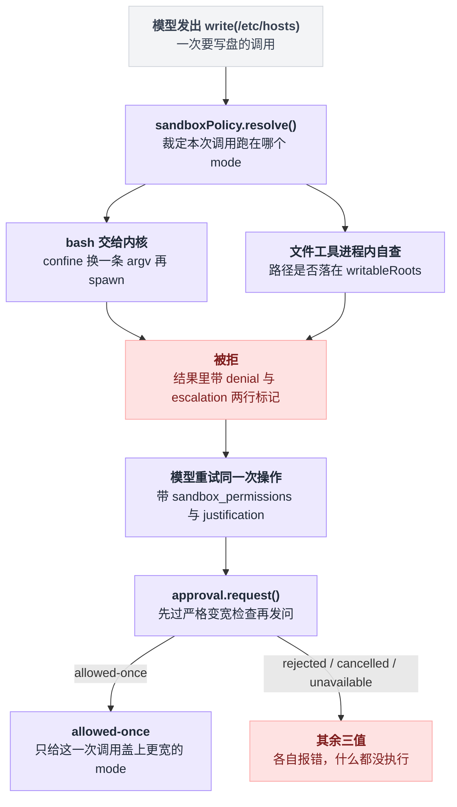
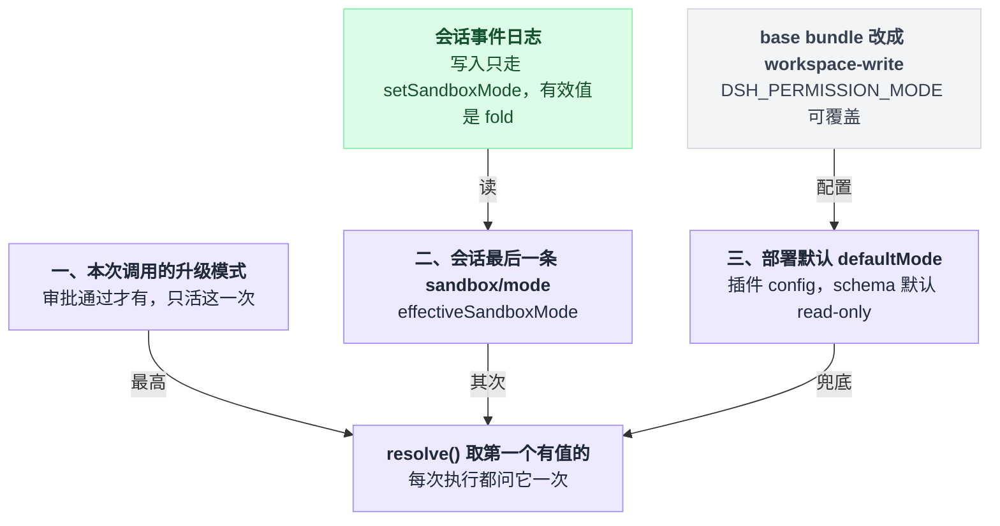
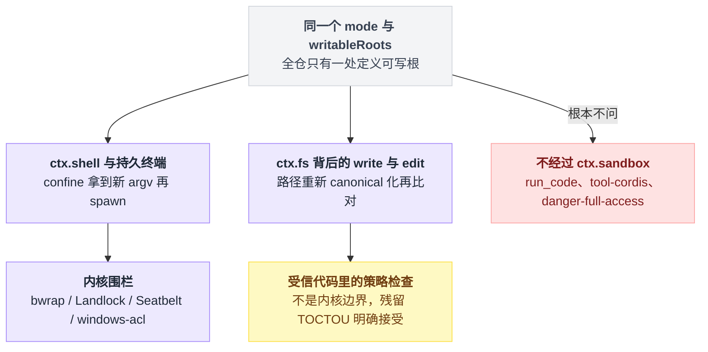
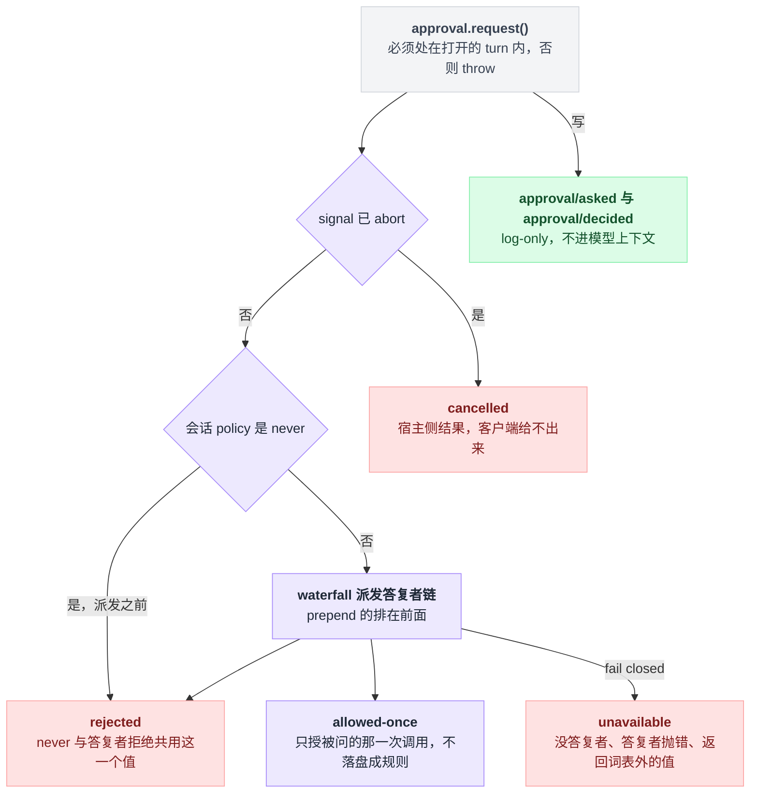
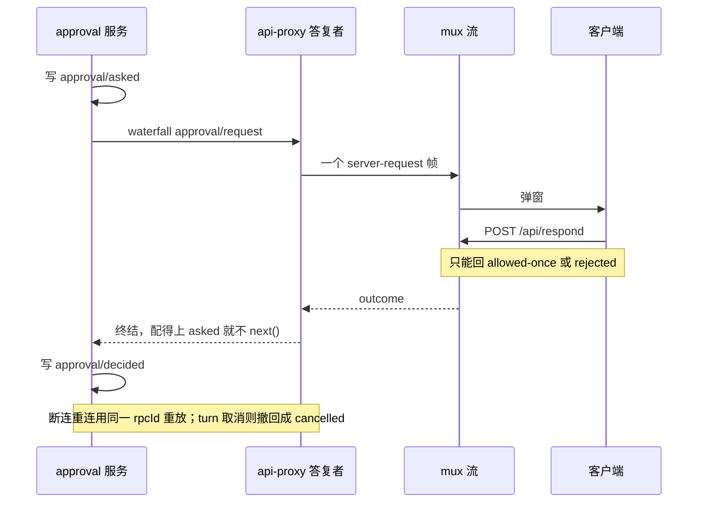
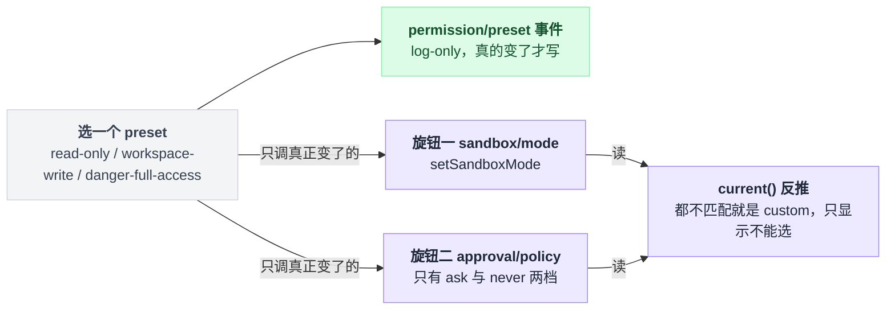
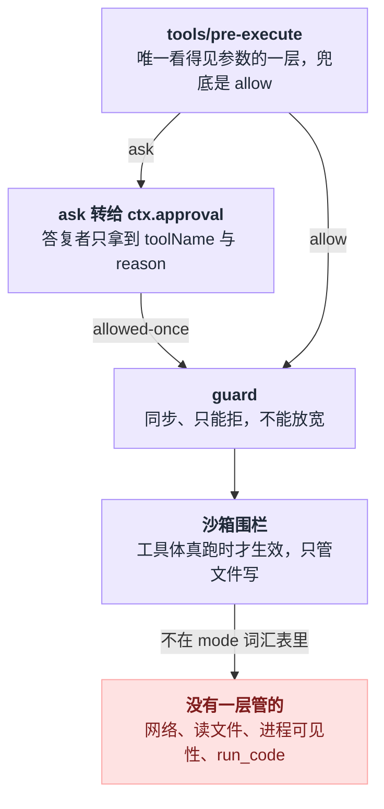

# 18 · 沙箱审批与权限

> 基于 `deepseek-ai/deepseek-harness` v0.1.0-rc.5（commit `47f9438`），2026-08-14 核对。

00 章里有句话：沙箱约束的是世界，不是模型智力。

这一章是那句话的兑现处，也是它的打折处——dsh 的沙箱确实约束世界，但约束的范围比大多数人默认的窄得多。

跟着一次 `write("/etc/hosts")` 走一遍就清楚了。这个调用发出去之后，先由 `sandboxPolicy` 裁定它跑在哪个模式下；然后落到两条完全不同的执行路径之一——bash 命令交给内核，文件工具在进程内自查；被拦下之后，模型可以带着理由重试一次，这一次要过审批的政策闸和答复者链，通过了也只放行这一次调用。

所以想收紧权限，你要改的是这三层里的某一层：

- 配置层的 mode（改默认值或者切 preset）
- 执行层的围栏（换 sandbox 后端）
- waterfall 上的答复者（自己写插件拍板）

这一章把三层各自能做什么、做不到什么讲清楚，最后给一份逐条带出处的能力边界清单——**沙箱挡不住什么，比它挡得住什么更重要。**

整章要走的就是这一趟：裁定模式 → 分两条路执行 → 被拒 → 模型带理由重试 → 过审批 → 只放行这一次。



## 先校准预期：这个"沙箱"只管文件写

很多人看到 sandbox 会默认它是通用安全沙箱。dsh 在源码注释里把话说死了：`SandboxMode` 的整套词汇表**只描述文件效果**。

```ts
export type SandboxMode = 'read-only' | 'workspace-write' | 'danger-full-access'
```

紧挨着这行类型的文档注释原话是 "Network and process visibility are outside this vocabulary"。包 README 的 Known Limitations 第一条重复了一遍，而且更狠：**这个 seam 不表达任何网络、进程、syscall、设备、凭证限制。**

seam 是这套代码里的高频词，指"一处可整体替换实现的能力接缝"——`ctx.sandbox` 是接缝，`sandbox-local` 是它此刻挂着的实现。

出处：类型定义在 `packages/sandbox/sandbox/src/index.ts:29`，注释在同文件 `:26-27`；README 那条在 `packages/sandbox/sandbox/README.md:39`。

三个模式各自管住了什么、管不住什么：

| 模式 | 写 | 读 | 网络 | 谁来执行 |
|---|---|---|---|---|
| `read-only` | 只有后端必需的 sink（POSIX 上是 `/dev/null`） | 全盘 | 不管 | 平台 runner |
| `workspace-write` | workspace root + `/tmp` + `os.tmpdir()` | 全盘 | 不管 | 平台 runner |
| `danger-full-access` | 不限 | 全盘 | 不管 | **完全不调用 `ctx.sandbox`** |

"只留必需 sink"不是修辞，落到 profile 上就是 Landlock 的 `readWrite = ['/dev/null']` 和 Seatbelt 的 `(allow file-write* (literal "/dev/null"))`。`danger-full-access` 绕开 `ctx.sandbox` 也不是省事，是写进包 README 的明确设计。

出处：sink 的说明在 `packages/sandbox/sandbox/src/index.ts:24-25`，两条 profile 在 `packages/sandbox/sandbox-local/src/profiles.ts:31` 与同文件 `:52`；绕开的设计说明在 `packages/shell/bash-sandbox/README.md:88`。

可写根的定义全仓只有一处，`workspace-write` 展开成三条路径再做 canonical 去重（`packages/sandbox/sandbox/src/roots.ts:52-55`）：

```ts
export function writableRoots(policy: SandboxExecutionPolicy): string[] {
  if (policy.mode !== 'workspace-write') return []
  return [...new Set([policy.workspaceRoot, '/tmp', tmpdir()].map(canonicalPath))]
}
```

"读全盘"那一列不是我推断的，是 profile 里明写着的：bwrap 用 `--ro-bind / /`，Landlock 用 `readOnly: ['/']`，Seatbelt 先 `(allow default)` 再 `(deny file-write*)`。三条依次在 `packages/sandbox/sandbox-local/src/profiles.ts:17`、同文件 `:35`、同文件 `:52`。

这条的后果值得单独说一遍：`read-only` 模式下的 bash **依然能读** `~/.ssh/id_rsa`，也依然能读 `$DSH_HOME/.credentials.yaml`。

read-only 的意思是"不许写"，不是"看不见"。

（凭证文件名见 `packages/credentials/credentials-local/src/index.ts:52`，默认落在 harness home 下见同文件 `:56`。）

> 想知道这一点上 Pi / Codex / LangChain 怎么做，见 [五个 agent 系统源码解剖](../2026-08_五个agent系统源码解剖/00-总览与阅读指南.md)。

## 三个平台后端，以及 full 与 partial 的区别

`ctx.sandbox` 只有一个方法：`confine(argv, policy)`，它不执行任何东西，只返回**替你去 spawn 的那条 argv**（`packages/sandbox/sandbox/src/index.ts:175`）。

本地实现按平台选一条 runner 链：

```
                     LocalSandboxProvider.confine()
                                │
          ┌─────────────────────┼──────────────────────┐
       linux                 darwin                  win32
    ['bwrap',              ['seatbelt']          ['windows-acl']
     'landlock']                │                      │
   两个候选 → 逐个探针        单候选 → 不探针        单候选 → 不探针
```

选择逻辑就三句：

```
候选链 = 平台对应的那一条
if 候选链只有一个:  直接用它，连探针都不跑
else:               逐个跑探针，第一个能用的胜出
if 一个能用的都没有: throw SandboxUnavailableError   // 绝不降级成不受限执行
```

最后那句是重点：**绝不静默降级成不受限执行**，这是 seam 契约里写死的一条。这种"出错就往严的方向倒"的姿态下文还会反复出现，本章统一叫它 fail closed。

出处：链表写在 `packages/sandbox/sandbox-local/src/index.ts:159-166`，"多候选才探针、单候选直接选"在同文件 `:499-510`，抛错在 `:494`；错误码 `SANDBOX_UNAVAILABLE` 与不降级契约在 `packages/sandbox/sandbox/src/index.ts:124`、`:153-156`。

拿到 argv 的同时还会拿到一个 enforcement 值。要注意这是**被报告的事实，不是保证**——它说的是"这台机器上策略被执行得有多完整"：

| runner | 静态 enforcement | 出处 |
|---|---|---|
| bwrap | `full` | `packages/sandbox/sandbox-local/src/index.ts:178` |
| landlock | 恒由探针给出 `full` / `partial`（老 ABI 报 partial） | `:524-527`；静态表里那行 `full` 走不到，原因见 `:168-176` |
| seatbelt | `full` | `:180` |
| windows-acl | **恒为 `partial`** | `:186` |

Windows 恒 partial 的理由写在代码注释里：`WRITE_RESTRICTED` 令牌必须在 restricting list 里保留 Everyone，再加上 NTFS 硬链接能让工作区内的文件对外别名（`packages/sandbox/sandbox-local/src/index.ts:181-185`）。

包 README 说得更直白：**写受限，读、网络、进程可见性都不受限**，所以 Windows 上 `read-only` 这个模式无法只靠该机制表达（`packages/sandbox/sandbox-windows-acl/README.md:77`）。

每次 wrap 除了 argv 和 enforcement，还带回两组 stderr 分类字典：

- `denialSignatures`：记录这个后端拒绝写时会吐什么字——bwrap 的 `read-only file system`、Landlock 的 `permission denied`、Seatbelt 的 `operation not permitted`
- `runnerFailureRules`：记录 runner 自己挂掉的证据

出处：返回类型见 `packages/sandbox/sandbox/src/index.ts:95-116`，两组字典分别在 `packages/sandbox/sandbox-local/src/index.ts:205-213` 与同文件 `:231-240`。

这里最容易踩的是：**拒绝是从 stderr 文本里"猜"出来的。** 一个恰好打印了同样字样的普通报错会被误判成 denial，一条被截断的 denial 会被漏判（`packages/shell/bash-sandbox/README.md:86`）。

dsh 自己就在这上面栽过——Landlock 老内核每次都打印一行良性提示，早期实现把它当成 runner 失败，结果 ripgrep 那个"无匹配 exit 1"被报成了 `SANDBOX_UNAVAILABLE`（`docs/postmortem/0004-landlock-partial-notice-misclassified-child-failures.md:9`）。

现在的规则收紧成三条同时成立才算 runner 挂了：

```
if exit code 没过闸门:            不算 runner 挂
lines = stderr 按整行剔除精确良性行
if lines 里没有命中致命签名:      不算 runner 挂
否则:                            才判定 runner 失败
```

出处：`packages/sandbox/sandbox/src/index.ts:74-79`、postmortem `:43`。

## 模式从哪来：三级优先级

`ctx.sandboxPolicy.resolve()` 是唯一的裁决点（`packages/sandbox/sandbox-policy/src/index.ts:135-142`），每次执行都问它一次：

```
mode  = 本次调用的 approved 升级模式        （最高，见「审批」一节）
      ?? 会话日志里最后一条 sandbox/mode    （effectiveSandboxMode）
      ?? 部署默认 defaultMode               （插件 config，schema 默认 read-only）

workspaceRoot = session.header.cwd ?? config.workspaceRoot ?? process.cwd()
```

`workspaceRoot` 这条链实际拆在两处：构造函数里是 `config.workspaceRoot ?? process.cwd()`（`:110`），resolve 时是 `session?.header.cwd ?? this.workspaceRoot`（`:139`）。两处都过 `resolvePath(canonicalPath(path))`（`:33-35`），所以 cwd 里带 symlink 或 `..` 也会指向真实落点。

schema 默认是 `read-only`（`packages/sandbox/sandbox-policy/src/index.ts:94`），但**你实际跑的 CLI 不是这个默认**——shipped 的 base bundle 把它改成了 `workspace-write`（`packages/bundle/base/cordis.patch.yml:172-176`）：

```yaml
- id: sandbox-policy
  name: '@deepseek-ai/dsh-sandbox-policy'
  config:
    mode: !!js process.env.DSH_PERMISSION_MODE ?? 'workspace-write'
    workspaceRoot: !!js process.cwd()
```

中间那层——会话级覆盖——就是一条 append-only 事件。写路径只有 `setSandboxMode()` 一个（`packages/sandbox/sandbox-policy/src/session-mode.ts:69-71`），有效值是日志的 fold（`:52-58`）。

所以 resume 一个会话不需要任何额外状态：重放日志本身就是状态。这是 01 章那句"日志是唯一真相"在权限上的又一次兑现。

三级各自从哪来、谁写得进去，摞起来是这个形状。



## 同一个 mode，两条执行路径

同一份 mode 和可写根，往下岔成两条性质完全不同的路，旁边还站着一批根本不经过 `ctx.sandbox` 的执行器。



`ctx.shell` 的做法是把命令整个交给内核：`ctx.sandbox.confine(['bash','-c',cmd], policy)` 拿到新 argv 再 spawn（`packages/shell/bash-sandbox/src/index.ts:177-179`）。持久终端走同一条路（`packages/terminal/terminal-bash/src/index.ts:74-79`）。

`ctx.fs`（也就是 write / edit 这些工具背后的能力）走的完全是另一条：**进程内策略检查**——把目标路径重新 canonical 化，判断它是否落在 `writableRoots` 里（`packages/fs/fs-sandbox/src/index.ts:126-148`）。

这条路的模块注释自己就承认了它的性质："这是受信代码里的策略检查，不是内核边界"（`packages/fs/fs-sandbox/src/index.ts:10-14`）。残留的 TOCTOU——检查完到真正 syscall 之间，祖先目录的 symlink 被人换掉——被明确写成"接受"（`:15-18`）。

它之所以还算数，是因为两条路共用同一个 `writableRoots()`，不会出现"bash 写得了 `/tmp` 而 write 工具写不了"这种分裂（`packages/sandbox/sandbox/src/roots.ts:1-11`）。

全仓 `inject` 了 `'sandbox'` 的只有 `bash-sandbox` 和 `pwsh-sandbox` 两个执行器（`packages/shell/bash-sandbox/src/index.ts:45`、`packages/shell/pwsh-sandbox/src/index.ts:53`），terminal 是用 `ctx.get('sandbox')` 取的（`packages/terminal/terminal-bash/src/index.ts:74`）。

名单就这么长，所以 **`run_code` 不在其中**：worker-thread 代码运行时的官方定位是"containment，不是安全边界，信任姿态按 bash 等价设计"（`packages/code-runtime/code-runtime-worker-thread/README.md:5`）。

还有一个实操坑，撞上了会莫名其妙：会话里有持久终端开着时切 sandbox 模式会直接 throw，让你先关掉终端（`packages/terminal/terminal-bash/src/index.ts:43-52`）。

## 审批：请求从哪产生，`allowed-once` 到底授了什么

`ApprovalOutcome` 是封闭的四值，其中**只有一个是通行证**（`packages/interaction/user-approval/src/types.ts:29`）：

```ts
export type ApprovalOutcome = 'allowed-once' | 'rejected' | 'cancelled' | 'unavailable'
```

`unavailable` 是 fail closed 的兜底：没有答复者、答复者抛错、答复者返回了词汇表外的值，三种情况全部归一成它（`packages/interaction/user-approval/src/index.ts:317-329`）。

一次 request 走到这四个结局里的哪一个，判定顺序是固定的——两个结局在派发之前就定了，根本轮不到答复者说话：

```
if 不在打开的 turn 内:     throw            // 硬前置
if signal 已 abort:        return cancelled  // 派发之前
if 会话 policy 是 never:   return rejected   // 派发之前
否则:                      waterfall 派发答复者链
                           拿不到有效答复 → unavailable
```



产生审批请求的入口只有两类，因为全仓调 `request()` 的地方就这两处。

第一类是工具管线的 `ask` 决策：某个 `tools/pre-execute` 监听器返回 `{ kind: 'ask' }`（`packages/core/tools/src/index.ts:588-591`、`:1479-1481`、`:1706`，那条降级路径见 [13 章](./13-工具执行管线.md)）。

第二类是沙箱升级重试：模型被拒之后带着 `sandbox_permissions` 和 `justification` 重试一次（`packages/sandbox/sandbox/src/escalation.ts:157-189`）。

第一类在默认组合里**几乎不会发生**。全仓返回 `{ kind: 'ask' }` 的地方只有 hook 兼容桥 `hooks-claude-code`（`packages/hooks/hooks-claude-code/src/index.ts:242`），而 `hooks-codex` 桥连 `ask` 都不认，只认 deny（`packages/hooks/hooks-codex/src/index.ts:229-230`）。

也就是说，**你在 Web UI 里看到的弹窗，绝大多数是第二类。**

升级这条路的完整时序在 `packages/sandbox/sandbox/src/escalation.ts:157-189`：

```
write("/etc/hosts") 被拒
   └─ 工具结果里塞两行标记（模型能看见），由 tool-fs 拼接
        [sandbox: file access denied under workspace-write mode]
        [sandbox: escalation available — retry this exact operation …]
   └─ 模型重试同一次操作，带上 sandbox_permissions + justification
        └─ 严格变宽检查（read-only→{ws-write,full}；ws-write→{full}）
        └─ approval.request({ reason: `escalate sandbox to X: <理由>` })
             ├─ allowed-once → 只给这一次调用盖上更宽的 mode
             └─ 其余三值 → 各自不同的报错文案，什么都没执行
```

逐条对应的出处：两行标记由 tool-fs 拼接（`packages/fs/tool-fs/src/sandbox.ts:129`），denial 那行来自 `escalation.ts:72`，hint 那行来自 `:85`；严格变宽表在 `:28-31`、执行期检查在 `:162`；发问在 `:173-179`；`allowed-once` 的返回在 `:183`，其余三值各自的报错在 `:184-186`。

图里那个 `approval` 不是 import 进来的服务，而是工具层把 `ctx.approval` 当闭包传下去的（`escalation.ts:10-14`，调用方见 `packages/fs/tool-fs/src/sandbox.ts:97-107`）。

`allowed-once` 的 once 是字面意思：授权只作用于**被问的那一次调用**，不落盘成规则。README 的限制条目写得毫不含糊——词汇表里**没有 `allow-always`、没有记忆规则、没有撤销、没有授权存储**，会话级策略只有 `ask` / `never` 两档（`packages/interaction/user-approval/README.md:60`）。

两档的分工写在 `packages/interaction/user-approval/src/index.ts:84-94`：

| 策略 | 行为 | 出处 |
|---|---|---|
| `ask` | 派发给组合好的答复者链；**没有答复者就 fail closed 成 `unavailable`** | README:62 明说"没有内置答复者" |
| `never` | 在服务内部、waterfall 派发**之前**就直接 `rejected` | `:312` |

注释解释了 `never` 为什么必须做在这里而不是做成监听器——后注册的 `prepend` 监听器会排在任何"闸门监听器"前面，只有服务自己的 request 路径能保证 `never` 的确定性。这个细节在下面写插件时还会咬人。

每次 request 都写一对审计事件 `approval/asked` + `approval/decided`（`:267-274`），二者 **log-only、不进模型上下文**（`:36-58`、`README.md:47`）。还有一条硬前置：request 必须处在打开的 turn 内，否则直接 throw（`:259-265`）。

### UI 上什么时候弹窗

Web 形态里，答复者是 api-proxy。它监听 `approval/request`，把问题变成 mux 流上的一个 server-request 帧，由 `POST /api/respond` 回答（`packages/host/apiproxy/src/api-proxy.ts:1407-1422`）。

客户端只能回两个值（`packages/host/apiproxy/src/api/approvals.ts:17-21`）：

```ts
export interface ApprovalResponsePayload {
  sessionId: SessionId
  approvalId: ApprovalRequestId
  outcome: 'allowed-once' | 'rejected'
}
```

`cancelled` 和 `unavailable` 是宿主侧结果，客户端给不出来。断连也不丢：mux 重连会用同一个 rpcId 重放仍在 pending 的帧，turn 被取消则请求撤回成 `cancelled`（`:1410-1413`）。

ACP 形态另有一个机器答复者，只提供 Allow once / Reject 两个选项（`packages/acp/acp/src/index.ts:215-229`）。

一次弹窗在四方之间的往返是这样的，注意答复者这一环就是 api-proxy 自己。



## preset 把两个旋钮捆成一个下拉框

preset 这一层**自己不执行任何东西**，它只是把 `sandbox/mode` 和 `approval/policy` 两个互相独立的旋钮打包成一个客户端能渲染的选项（`docs/subsystems/permission-presets.md:5`）。

shipped 的 base bundle 配了三档（`packages/bundle/base/cordis.patch.yml:193-205`）：

```yaml
- id: permission
  name: '@deepseek-ai/dsh-permission-presets'
  config:
    presets:
      read-only:
        sandbox: read-only
        approval: ask
      workspace-write:
        sandbox: workspace-write
        approval: ask
      danger-full-access:
        sandbox: danger-full-access
        approval: never
```

服务自带的默认表只有后两档（`packages/interaction/permission-presets/src/index.ts:167-176`），`read-only` 这一档是 bundle 加上去的。

`set(session, name)` 的动作顺序是固定的：

```
if 选的就是当前 preset:   一个事件都不写，直接返回
append 一条 log-only 的 permission/preset 事件
for 旋钮 in [sandbox/mode, approval/policy]:
    if 该旋钮的值真的变了:  调它自己的 setter    // 没变的不碰
```

`current()` 反过来是从旋钮值推导出来的：

```
if 上次选择仍然匹配当前两个旋钮:  返回它       // 优先保持
elif 表里有匹配项:                返回第一个
else:                             返回 custom  // 只能显示，不能选
```

出处：`set()` 在 `:375-392`，`current()` 在 `:309-321`，`custom` 不可选在 `:66-70`。

选下去和读回来是两个方向：选是往两个旋钮上写，读是从两个旋钮值反推。



这里有两个坑。

**第一个是包 README 和源码不一致，以源码为准：**

| 东西 | README 里写的 | 源码里实际是 |
|---|---|---|
| 事件名 | `permissionPresets/preset`（`README.md:7`） | `permission/preset`（`src/index.ts:50`） |
| 命令名 | `/permissionPresets`（`README.md:13`） | `permission`（`:259`） |
| settings 命名空间 | —— | `permission`（`:73`） |

（README 路径为 `packages/interaction/permission-presets/README.md`。）

**第二个是组合校验在插件加载期就 fail loud**：表里出现名为 `custom` 的条目会 throw（`:189-191`）；挂在一个不做限制的 bash 执行器上（没有 `sandboxMode` 能力事实）同样 throw（`:192-194`）。这两条报错都发生在启动阶段，不会拖到运行时才炸。

新会话的初值由 `pinInitialPermission()` 钉进日志（`:400-430`）：全新会话按当前用户默认写入三条事件，被 seed 或部分初始化的会话则保留既有有效值、只补缺失的那几条。所以改了默认不会动到已有会话。

## 实操 A：写一个自定义审批答复插件

场景很具体：headless 跑批时会话跑在 `read-only`，你希望模型"升级到 `workspace-write` 的写操作"自动放行，其它一律交回默认链路。

`approval/request` 是一个 waterfall 事件——监听器按注册顺序层层包裹，只有调了 `next()` 才把问题递给下一层，不调就是自己拍板（机制见 [11 章](./11-waterfall专章.md)）。

动手之前有个事实必须先知道：**Web 组合里 api-proxy 已经是一个答复者**，而它只在找不到配对的 `approval/asked` 时才 `next()`（`packages/host/apiproxy/src/api-proxy.ts:1457`）——正常的服务发问永远配得上。所以后注册的兄弟监听器根本轮不到你，必须用 `{ prepend: true }` 把自己排到它前面。

文件放在 `scratch-approval/src/auto-escalate.ts`：

```ts
import type { Context } from '@deepseek-ai/cordis'
import Schema from '@deepseek-ai/schemastery'
import type { ApprovalOutcome } from '@deepseek-ai/dsh-user-approval/types'

export const name = 'auto-escalate-workspace-write'
export const inject = ['approval']

export interface Config {
  tools: string[]
}

export const Config: Schema<Config> = Schema.object({
  tools: Schema.array(Schema.string()).default(['write', 'edit']),
})

export function apply(ctx: Context, config: Config) {
  ctx.on('approval/request', (req, next) => {
    const reason = req.reason
    if (!config.tools.includes(req.toolName)) return next()
    if (reason === undefined || !reason.startsWith('escalate sandbox to workspace-write:')) return next()
    ctx.logger.info(`auto-approve ${req.toolName}: ${reason}`)
    return Promise.resolve<ApprovalOutcome>('allowed-once')
  }, { prepend: true })
}
```

每一处都能对上源码：

| 写法 | 依据 |
|---|---|
| 监听器形状 | 抄自 ACP 桥 `packages/acp/acp/src/index.ts:215-229` |
| `reason` 前缀 | `approveEscalation` 拼出的定值 `` `escalate sandbox to ${mode}: ${justification}` ``，`packages/sandbox/sandbox/src/escalation.ts:177` |
| `req.toolName` / `req.reason` | `packages/interaction/user-approval/src/index.ts:153-174` |
| `write` / `edit` 是真实工具名 | `packages/fs/tool-fs/src/write.ts:70`、`edit.ts:84` |
| `@deepseek-ai/dsh-user-approval/types` 这个 subpath 真实存在 | `packages/interaction/user-approval/package.json` 的 `exports` |
| `prepend` 是 cordis 真实选项 | `vendor/cordis/src/events.ts:112-117`、`:255` |
| `ctx.logger.info()` | `vendor/cordis/src/logger.ts:188-193` |
| 插件三件套（`name` / `apply` + schemastery `Config`） | `docs/user/develop/basic/index.md:19-27`、`docs/user/develop/basic/config.md:23-27` |
| `export const inject` 的写法 | `docs/user/develop/basic/tool.md:16` |

挂载文件写成 `scratch-approval/cordis.yml`，注意 `name` 必须是绝对路径（`docs/user/develop/basic/index.md:56`）：

```yaml
- insert:
    - id: auto-escalate
      name: '/absolute/path/to/scratch-approval/src/auto-escalate.ts'
      config:
        tools: ['write', 'edit']
```

```sh
DSH_PERMISSION_MODE=read-only pnpm dsh web --patch ./scratch-approval/cordis.yml
```

期望现象：命中的升级请求不再弹窗，终端打出 `auto-approve write: escalate sandbox to workspace-write: …`；不命中的请求照常弹窗。

有三条约束必须记住，否则这个插件会在你以为它生效的时候失效。

**`prepend` 只是"排在前面"，不是"更高优先级"。** 官方原话是："每个部署组合一个终结性答复者，因为兄弟监听器顺序不是策略优先级机制"（`packages/interaction/user-approval/README.md:9`）。再来一个插件同样 prepend，就排到你前面去了。

**`never` policy 下你永远收不到请求**，服务在派发之前就 `rejected` 了（`packages/interaction/user-approval/src/index.ts:312`）。

**答复者拿不到工具参数。** `ApprovalRequest` 上只有 `agent` / `toolName` / `callId?` / `reason?` / `signal?`（`:153-174`），刻意不重复渲染参数。想按"命令内容"判断，得下到 `tools/pre-execute` 那一层（[13 章](./13-工具执行管线.md)）。

## 实操 B：换一个 preset，三条路作用域各不相同

| 想改的范围 | 怎么做 | 出处 |
|---|---|---|
| 只改当前会话 | 在会话里发 `/permission read-only`；不带参数则打印当前值与可选项 | `packages/interaction/permission-presets/src/index.ts:257-277` |
| 改以后新建的会话 | 改 `$DSH_HOME/settings.yaml` 里 `permission` 段的 `defaultPreset`（Web 设置面板渲染的就是这份 schema） | `:73`、`:201-218`；文件位置见 `packages/settings/settings-file/src/index.ts:56` |
| 改整个部署的默认 | 启动前设 `DSH_PERMISSION_MODE`，或用 patch 覆盖 `sandbox-policy` / `approval` / `permission` 三个条目的 config | `packages/bundle/base/cordis.patch.yml:175`、`:191` |

```sh
DSH_PERMISSION_MODE=read-only pnpm dsh web
```

`DSH_PERMISSION_MODE` 有个联动值得知道：base bundle 里 `approval.policy` 读的是同一个变量——设成 `danger-full-access` 时 approval 会一并变成 `never`（`packages/bundle/base/cordis.patch.yml:191`）。

这是符合直觉的，但反过来说，你没法只放宽沙箱而保留弹窗，除非分开写 config。

如果要改 preset 表本身，记住 patch 是**按 id 整体替换 config、不深合并**（`packages/boot/app-boot/README.md:60`）。必须把三档全部重写一遍，只写一档等于把另外两档删了。

## 它挡不住什么

把几道闸按执行先后摞起来，就能看见空的是哪一块：参数只有第一道闸看得见，沙箱只表达文件写效果，剩下的维度不归任何一层管。



下面每一条都能追到源码或官方文档。做安全评估时请按"没有"来规划，不要按"应该有吧"。

| 你可能以为有 | 实际 | 出处 |
|---|---|---|
| 网络管控（禁止外连 / 域名白名单） | **完全没有**。mode 词汇表不表达网络 | `packages/sandbox/sandbox/src/index.ts:26-27`、`README.md:39`、`packages/sandbox/sandbox-policy/README.md:68` |
| 危险命令分类器（识别 `rm -rf` 并弹窗） | **没有**。默认组合里没有任何东西会返回 `ask`；`tools/pre-execute` 的兜底是 `allow` | `packages/core/tools/src/index.ts:1475-1478`；全仓 `kind: 'ask'` 仅见 `packages/hooks/hooks-claude-code/src/index.ts:242` |
| 读文件受限 | **没有**。三套 profile 都是全盘只读授权 | `packages/sandbox/sandbox-local/src/profiles.ts:17`、`:35`、`:52` |
| 进程可见性 / syscall / 设备限制 | 没有 | `packages/sandbox/sandbox/README.md:39` |
| "记住这次选择"的授权规则 | 没有。只有 one-shot `allowed-once`，无 allow-always、无撤销、无存储 | `packages/interaction/user-approval/README.md:60` |
| 内置的人机审批 UI | 服务自己**从不**提示任何人；没组合答复者就 fail closed | `packages/interaction/user-approval/README.md:62` |
| `run_code` 也被沙箱管 | 不被 `ctx.sandbox` 管；定位是 containment 而非安全边界，信任姿态"按 bash 等价" | `packages/code-runtime/code-runtime-worker-thread/README.md:5` |
| `tool-cordis` 之类扩展被沙箱管 | 不。它"对诚实代码是 containment，不是安全边界——sandbox 全局上的宿主 realm 助手是可达的，包代码能够到 Node；加载它要像授予 bash 权限一样谨慎" | `packages/extensions/tool-cordis/README.md:102` |
| `fs` 的 `config.cwd` 是围栏 | 不是，只是解析默认值；绝对路径和 `..` 都能出去 | `packages/fs/fs-local/README.md:38` |
| 容器 / microVM 级隔离 | 不是本 seam 的后端；那要整组替换 capability 实现 | `packages/sandbox/sandbox/README.md:40` |
| Windows 上等价于 Linux 的隔离 | 恒 `partial`：Everyone 必须保留在 restricting list，NTFS 硬链接可别名 | `packages/sandbox/sandbox-local/src/index.ts:181-186`、`packages/sandbox/sandbox-windows-acl/README.md:77` |
| 拒绝判定是可靠的结构化信号 | bash 侧是从 stderr 文本推断的，会误报也会漏报 | `packages/shell/bash-sandbox/README.md:86` |
| runner 诊断不可伪造 | 是带内通道；被限制的子进程可以故意打印 runner 的致命行造成误判（不能绕过限制，但会污染诊断） | `packages/sandbox/sandbox/README.md:42`、`docs/postmortem/0004-landlock-partial-notice-misclassified-child-failures.md:39` |
| 环境变量里的密钥不会外泄 | **这一条是真的**：名字命中 `/KEY\|PASSWORD\|SECRET\|TOKEN/i` 或 `DSH_*` 的变量不传给子进程；但磁盘上的凭证文件照样能读 | `packages/subprocess/subprocess/src/index.ts:44`、`:60-66` |

最后一行是唯一一个"比你以为的更严"的格子，其余全是往下修正预期。

## 一句话带走

**dsh 的沙箱是"防误伤"的文件写围栏，不是"防恶意"的隔离层；审批是一次性的、不留记忆的，而且默认组合里几乎只为沙箱升级而弹。**

要收紧，先看你想拦的是什么：

- 拦写路径 → 改 mode 或 preset
- 拦具体命令内容 → 下到 `tools/pre-execute`
- 拦"谁来拍板" → 往 `approval/request` 上挂答复者

真要跑不可信代码，别指望调 mode——按官方给的方向整组替换 capability 实现（容器 / microVM / 远程执行）。

下一章 [19 章](./19-子agent与workflow.md) 讲子 agent 与 workflow，那里的权限继承关系值得和本章对照着看。

## 本章未确认

- ⚠️ 本章所有结论都来自静态读码与官方文档，**没有在任何一个平台上实际跑过 dsh**（仓库未安装依赖）。bwrap / Landlock / Seatbelt / windows-acl 四条链的真实行为差异需要你在自己机器上验证。
- ⚠️ 「它挡不住什么」表里若干行的唯一依据是包 README 或 postmortem 的散文（网络/进程不受限、runner 诊断可被子进程伪造、Windows 的 Everyone 与硬链接边界），属于**官方文档如此描述**，本章未在代码或运行中逐条复核；带行号的源码行只证明了这些结论被写在哪里。
- ⚠️ Landlock 老 ABI 具体缺哪些能力、`partial` 到底放过了什么文件效果，本章未展开——判断来自原生 launcher 的探针，其契约写在 `native/landlock-run/packages/entry/src/index.ts:101-115` 的注释里，native 侧实现未逐行读完。
- ⚠️ 实操 A / B 的"期望现象"是按源码推演的，未实跑验证。特别是 `--patch` 插入本地 TS 插件的加载细节以 [05 章](./05-Cordis是什么.md) / [02 章](./02-五分钟跑起来.md) 为准；`prepend` 能不能稳定排到 api-proxy 之前，取决于两者的注册先后，本章只从 `insert` 追加语义与 `unshift` 实现推出，未实测。
- ⚠️ Web UI 上审批弹窗与权限设置项的具体交互（按钮文案、设置面板里 `permission` 段的位置、有没有"始终允许"这类入口）未读前端渲染代码，只核实了宿主侧协议只接受 `allowed-once` / `rejected` 两个回答、settings 命名空间叫 `permission`。
- ⚠️ `run_code` 的 worker 线程里模型代码能否直接 `import('node:fs')` 绕开文件围栏，本章只引用了官方"containment, not a security boundary"的定位表述，**未在代码中逐行确认**其可达性。
