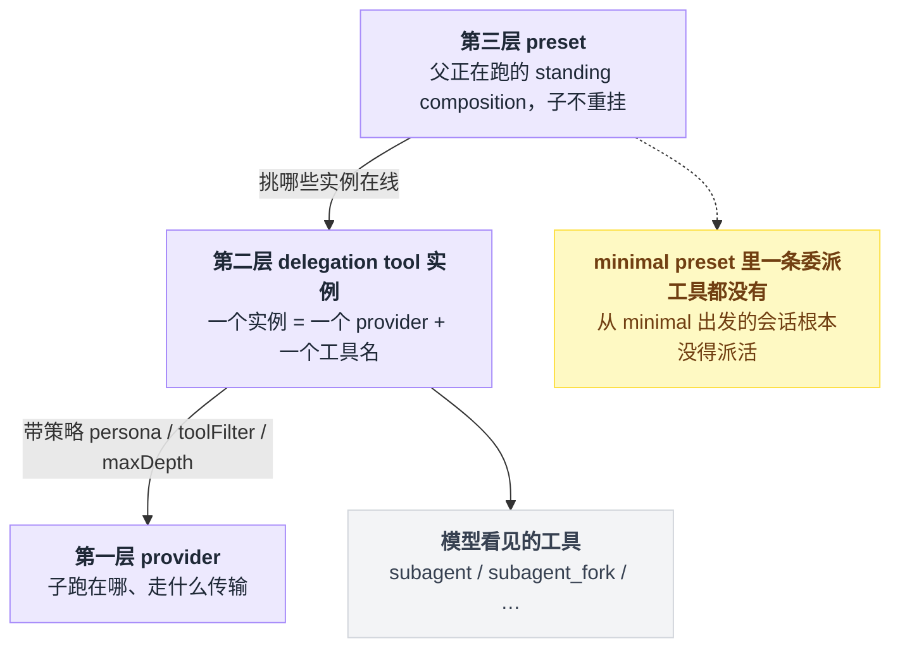
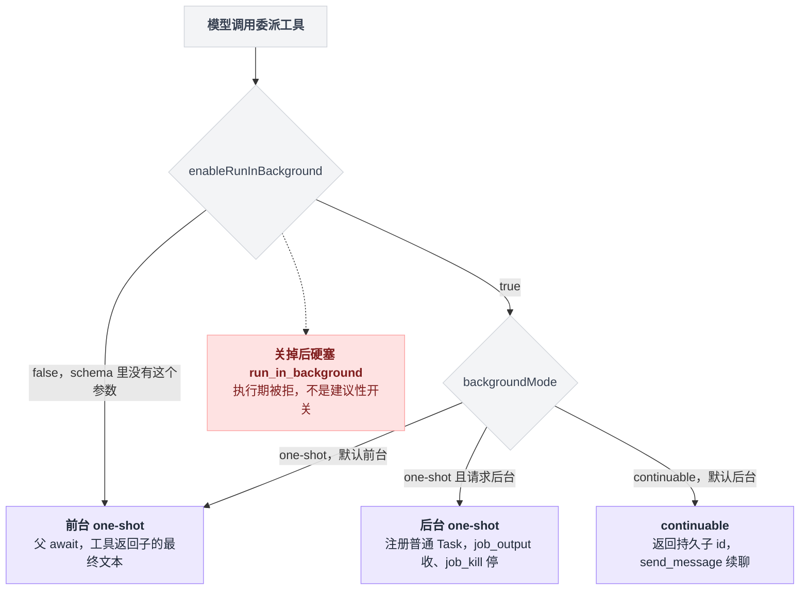
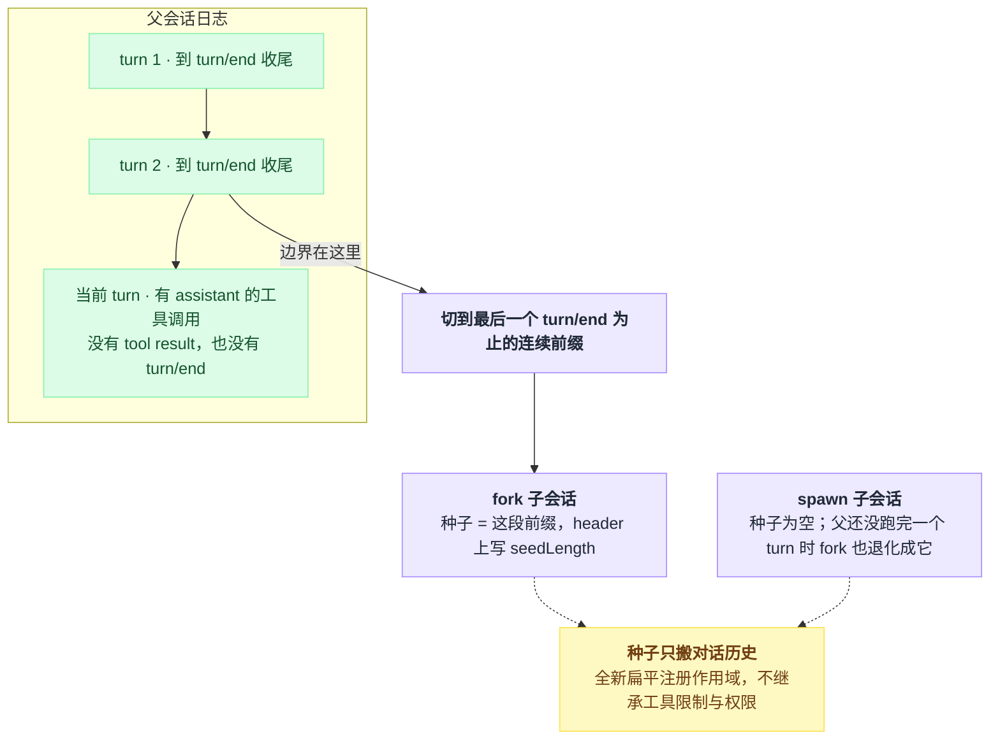
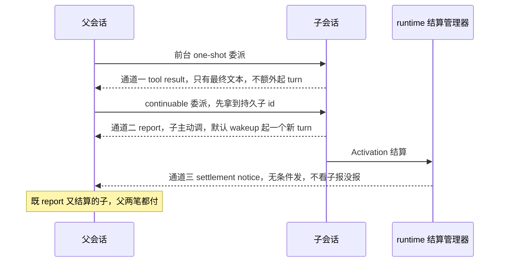
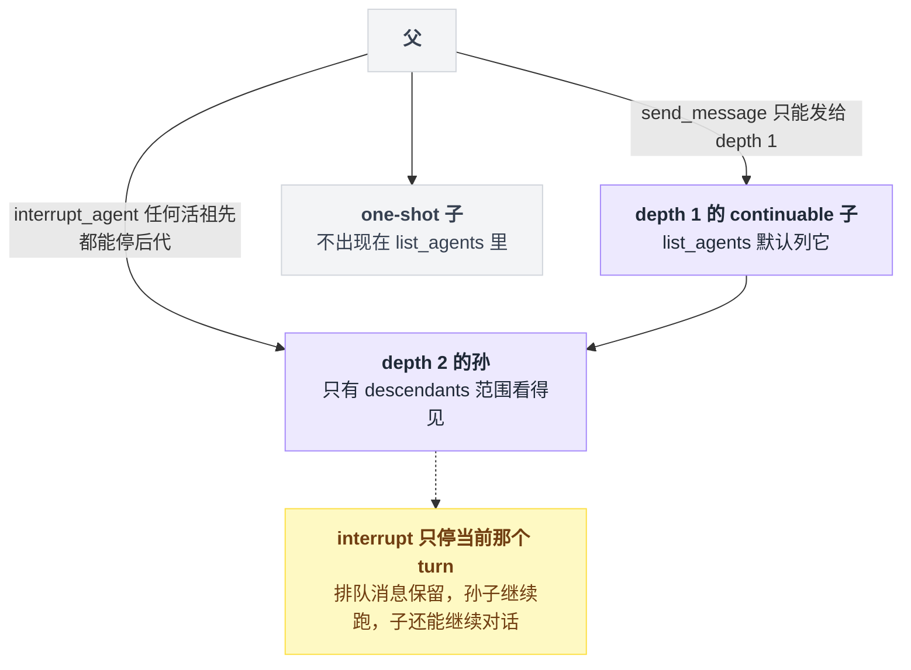
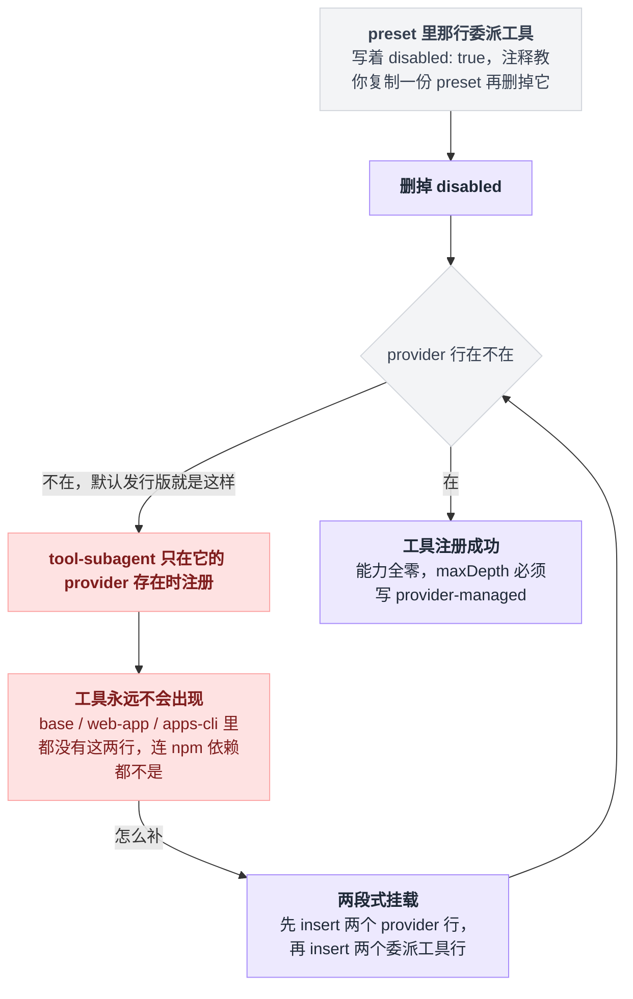
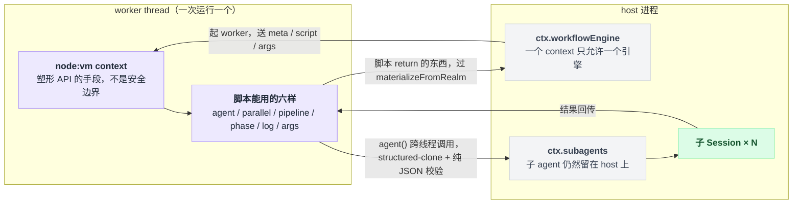
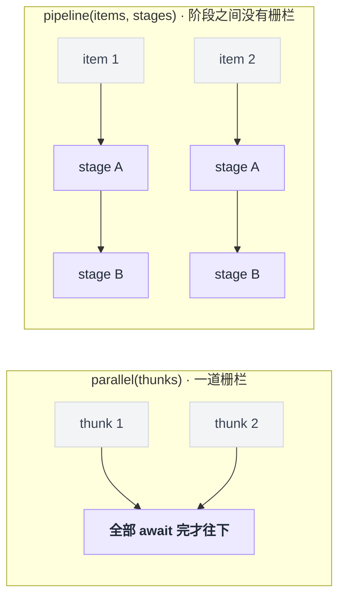
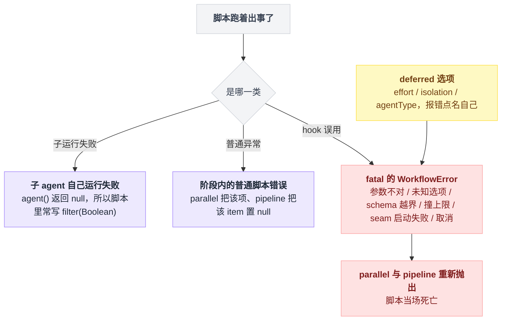

# 19 · 子 agent 与 workflow

> 基于 `deepseek-ai/deepseek-harness` v0.1.0-rc.5（commit `47f9438`），2026-08-14 核对。正文只讲机制；可照抄的代码统一收在文末[附录](#附录可以照抄的模板)，出处收在[脚注](#出处)，点角标可跳转。

最常见的误解是：派活给子 agent，就是再开一个一样的自己——同样的上下文、同样的工具、同样的权限，像多开一个浏览器标签页。

不是的。dsh 里的子 agent 是三层配置拼出来的产物，它跟父共享什么、不共享什么，每一样都有明确的答案，而且好几个答案跟直觉相反。更麻烦的是，有几处仓库自己都没对齐，我会点名：fork 的模式在文档和配置里说的不是一回事；两个"接外部产品"的 provider 在包 README 里说得像开箱可用，实际默认发行版连依赖都没装。

先从一个具体场景进门。

---

## 十五个文件要审一遍，你有两条路

假设你让 agent 审十五个文件。

它可以自己一个个读，代价是十五份文件内容全部堆进同一个会话的上下文，读到后面就要触发压缩（阈值由部署配置决定，见 [17 章](./17-压缩与长会话.md)）。

dsh 给了两条别的路：委派一个子 agent，或者让模型写一段 JavaScript 脚本，一口气调度几十个子 agent。

```
父 agent 的一条 assistant message
├── subagent(prompt)               → 起 1 个子 Session，一次委派
│                                     子的中间步骤留在子会话，父只拿最终答案
└── workflow(meta, script)         → 起 1 个 worker thread 跑你的脚本
                                      脚本里的 agent() × N → N 个子 Session
                                      父只拿脚本 return 的那个 JSON
```

怎么选，官方注入给模型的那段提示词说得比任何架构图都直白：workflow 工具"ONLY when the user explicitly asks for a workflow or for large multi-agent orchestration"，"For one or two delegations, prefer plain subagent calls"[^1]。

**一两个委派用 subagent，明确要"工作流/大规模编排"才用 workflow。** 两条路的差别摆成一张表[^2]：

| | 一次委派 | workflow 脚本 |
|---|---|---|
| 谁写调度逻辑 | 父模型，一轮一个决定 | 父模型一次写完整段脚本 |
| 中间结果落在哪 | 每次委派的结果都进父上下文 | 留在脚本变量里，父看不见 |
| 并发 | 一条 message 里发多个工具调用 | `parallel` / `pipeline`，引擎管并发闸门 |
| 能不能接着聊 | continuable 模式可以 | 不能，一次跑完就结束 |

---

## 一个子 agent 是三层拼出来的

如果你用过那种"一个 markdown 文件定义一个子 agent"的设计，先把它忘掉，dsh 里没有这个东西。

一个子 agent 的形态由三层决定，改哪一层的效果完全不同。三层从上往下的关系是：preset 挑出模型看得见哪些委派工具，每个工具实例绑一个 provider，provider 决定子跑在哪。



**第一层是 provider，决定这个子 agent 跑在哪、用什么传输。**

`ctx.subagents` 是按名字注册的**多实例**注册表——和只允许一个实现的 bash 执行器不同，多个 provider 可以同时在线[^3]。六个 provider 各自把子放在哪，逐个对过[^4]：

| provider 包 | 子 agent 跑在哪 | `inheritsParentContext` |
|---|---|---|
| `subagent-spawn-in-process` | 本进程，全新会话 | `false` |
| `subagent-fork-in-process` | 本进程，带父的已完成对话 | `true` |
| `subagent-acp` | 进程外，走 ACP | `false` |
| `subagent-dsh-sdk` | 进程外，走 TypeScript SDK | `false` |
| `subagent-codex` / `subagent-claude-code` | 外部真实产品进程 | `false` |

这里有个字段名很容易读成"继承"两个字的全部含义：`inheritsParentContext` **只描述"子看不看得见父的已完成对话"**，工具、服务、权限的继承跟它一点关系都没有[^5]。

**第二层是 delegation tool 实例，决定模型看见的那个工具叫什么、带什么策略。**

一个 `@deepseek-ai/dsh-tool-subagent` 实例 = 一个 provider + 一个模型可见的工具名。想要"另一个模型 / 另一套 persona / 另一份工具白名单"，办法是再加一个实例，而不是去改同一个实例的策略[^6]。

配置项与默认值全部定义在这个插件的 Schema 里，各字段的语义写在同文件的类型注释里[^7]：

| key | 默认 | 说明 |
|---|---|---|
| `provider` | 必填 | `ctx.subagents` 上的 provider 名 |
| `toolName` | `subagent` | 模型看到的名字，每个实例必须不同 |
| `enableRunInBackground` | `true` | 关掉后 schema 里没有这个参数 |
| `backgroundMode` | `one-shot` | `one-shot` 默认前台；`continuable` 默认后台并返回持久子 id |
| `agentOptions` | 省略 | 子的 `provider` / `model` / `maxTokens` |
| `persona` | 省略 | 只影响这个子，遮蔽部署 persona |
| `toolFilter` | 省略 | `allow` / `deny` |
| `maxDepth` | `3` | `0` = 禁止再委派；`'provider-managed'` = 不下发上限 |

表里有两格值得展开。

`enableRunInBackground` 关掉之后不只是参数从 schema 里消失，模型显式硬塞一个后台参数也会在执行期被拒[^8]——它不是一个建议性的开关。

`toolFilter` 过滤掉的工具是**既从 prompt 里消失也拒绝执行**，两头都堵死。

`enableRunInBackground` 和 `backgroundMode` 合起来决定一次委派落成哪种形态。这几种形态后面几节会反复出现，先记住名字就行：



**第三层是 preset，决定子 agent 看得见哪些工具。**

这一层最反直觉：子 agent **不会**重新挂载 preset，它是被绑到父正在跑的那份 **standing composition**（父这次会话实际跑着的那棵插件树）上的[^9]。

父在 `minimal` preset 下，子也就在 `minimal` 下，没有第二种可能。而 minimal 的配置文件全文 62 行，`subagent` 和 `workflow` 一个字都没有[^9]——从 minimal 出发的会话根本没有委派工具可用。

> 想知道这一点上 Pi / Codex / LangChain 各自怎么做，见 [五个 agent 系统源码解剖](../2026-08_五个agent系统源码解剖/00-总览与阅读指南.md)。

### 最小可用配置，以及它为什么在 web 下不生效

最小可用的形状照抄[附录 A](#a-最小-subagent-配置)：runtime、spawn provider、委派工具实例，三段就够。它抄自 headless 示例，原文的注释、fork 那条链、控制与上报两个插件都没抄进来，只留 spawn 一条路[^10]。

照抄进 web / CLI 形态就会发现它不起作用，这是本节最容易踩的坑。

web 形态的补丁配置把 base bundle 里全部六个委派与 workflow 相关插件设成禁用，改由 preset 提供；preset 花名册在同一份补丁里挂载，默认 preset 是 `standard`[^11]。

分工的原话是：**registry 和 provider 留在 host 层（进程单例，一个名字只能注册一次），preset 只挑"这个 agent 看见哪些委派工具"**——这段注释在 code preset 和 web 补丁里各写了一遍[^12]。

所以你要加自己的委派工具，改的是 preset 目录里的 agent 配置文件，不是 profile。

另有两个配置错误会在挂载期就响亮失败，不会拖到运行时[^13]：

| 配错了什么 | 后果 |
|---|---|
| 给一个没有 `depthLimit` 能力的 provider 配数字 `maxDepth` | 挂载期失败 |
| 给一个没有 `prepareContinuable` 的 provider 配 `backgroundMode: continuable` | 挂载期失败 |

第一条正是 codex / claude-code 那两行必须写 `maxDepth: provider-managed` 的原因。

---

## spawn 和 fork 只差一件事：种子

fork 与 spawn 共用同一个 run driver，唯一的行为差异是会话种子[^14]。

这条差异全落在一刀切在哪里：



有意思的是种子的边界怎么划。

父起子 agent 的那一刻，父自己的 turn 还开着：日志里有 assistant 的工具调用，但没有对应的 tool result，也没有 `turn/end`。直接把当前历史抄过去，子拿到的会是一个不平衡的非法会话。

所以 fork 取的是**到最后一个 `turn/end` 为止的连续前缀**。算法就一趟顺扫：沿父会话事件往下走，每见一次 `turn/end` 就把刀口往后挪；扫完从刀口截断，半截的当前 turn 被整段丢掉。截出来是空的——父还没跑完一个完整 turn——fork 的行为就等同 spawn[^14]。

种子只搬对话历史，别的什么都不搬。子拿到的是**全新的扁平注册作用域**，不继承父的工具限制，也不继承任何权限[^14]。

### 一处文档与配置对不上（以配置为准）

三处官方文字都说 fork 的委派工具在所有 shipped 组合里是 one-shot：fork 包 README 两处，外加工具目录里那句"`subagent_fork` stays `one-shot`"[^15]。专门为这件事写的 Agent Note 把"所有 shipped 组合"逐个点名，只有三个——base bundle、ACP 示例、headless 示例[^15]。

同一份 Note 在结论里给自己留了句话："约束只活在三个配置文件和一句代码注释里，不是一道 gate——将来某个 bundle 行或 profile patch 把 fork 设成 `continuable`，不会有任何东西响亮失败"[^15]。

它预告的漏洞已经发生了。把仓库里七处 fork 配置翻一遍[^16]：

| 配置文件 | fork 的模式 |
|---|---|
| base bundle | `one-shot` |
| headless 示例 | `one-shot` |
| ACP 示例 | `one-shot` |
| preset `standard` | **`continuable`** |
| preset `code` | **`continuable`** |
| preset `cordis` | **`continuable`** |
| preset `minimal` | 一条委派工具都没有 |

被点名的那三处确实是 one-shot，但**四个 shipped agent preset 里带委派工具的那三个，fork 全是 `continuable`**。而 web 形态用的正是 preset。

---

## 子会话就是一个普通 Session

本地 provider 在启动返回之前就**先发布一个普通的子 agent / 子 Session**，然后把这个 session id 当作这次委派运行的 id[^17]。它不是一条"运行记录"，就是会话本身。

这个选择带来四件很具体的事：header 多了几个字段、枚举靠 header、权限在委派那一刻钉死、深度穿得过持久化。

**header 上多了几个字段**，创建子会话时一次写全[^18]：

| 字段 | 值 |
|---|---|
| `cwd` | 继承父 header |
| `agentPreset` | 从父的**活作用域链**读，不是从父 header 读 |
| `parentSession` | 父 session id |
| `origin` | 固定 `'subagent'` |
| `delegationDepth` | 父深度 + 1，持久化且单调 |
| `seedLength` | 只在种子非空时才写 |

后两个字段有额外含义。`delegationDepth` 冷恢复时只能加不能减[^19]，递归预算是穿得过持久化的。`seedLength` 记录前多少条事件来自父，实际上只有 fork 会写它。

**枚举靠 header，而不是靠一张运行表。** 列孩子的办法是扫会话语料——活会话存储，外加可选的会话持久化——只认 header 上的两个条件：父会话 id 等于自己、来源是 subagent。全程不加载、不恢复任何 Agent，也不需要 query 服务[^20]。列整棵后代树的方法走同一套语料，普通会话和 one-shot 子仍然是可以穿过的中间节点[^20]。

**子的权限在委派那一刻就钉死。** runtime 快照父会话**显式**的沙箱覆盖，并在审批能力被组合进来时把子的审批策略钉成"从不审批"——不管父自己是什么策略。这些标着"来源：委派"的事件写进子自己的日志，位置在 fork 种子之后，所以新策略能盖过旧种子里的状态[^21]。

子同时会拿到一段固定的运行时上下文语句[^21]：需要更大权限时**不要重试**，把限制写进回复交给父处理。

**深度是持久的。** 数字 `maxDepth` 超了会得到确定的报错文本"Error: subagent depth \<attempted\> exceeds maxDepth \<max\>"[^22]。

---

## 结果怎么回到父会话：三条互不相干的通道

这是整章最容易糊涂的一节。三条通道彼此独立，可能同时发生，而且父每一条都要付 token。

| 通道 | 谁开口 | 起不起新 turn | 父付账 |
|---|---|---|---|
| 一 · 前台 tool result | 父自己 `await` 出来的 | 不额外起，它就是工具返回值 | 一笔 |
| 二 · `report` 工具 | 子主动调 | 默认 `wakeup` 起一个普通新 turn | 一笔 |
| 三 · settlement notice | runtime 无条件发 | 空闲父起一个 turn，忙父并进最近 step 边界 | 一笔 |

把三条摆在同一条时间线上，谁开口、谁付账就清楚了：



**第一条是前台 tool result，父自己 `await` 出来的。**

父看到的只有子的最终文本；子的停止原因不是 `completed` 时，这个返回会变成"Error: \<message\>"，残留文本附在停止原因后面。它不额外起 turn，因为它就是这次工具调用的返回值[^23]。

**第二条是 `report` 工具，子主动调的。** 父会看到"Background subagent \<child-id\> reported:"加上子的输出原文。

`report` 不是全局工具，而是随 continuable 装配注册的**子作用域**能力，只在 continuable 的进程内子里存在，root、one-shot 子和远程 provider 都看不到[^24]。

它**故意**穿透子的全局 `toolFilter`——白名单不能把唯一的回话通道删掉；真想要一个没有回话通道的子，办法是别装这个包[^24]。调用时不指定收件人，执行时的 agent 身份就是凭证，收件人由服务从子的持久 `parentSession` 推出来[^24]。父侧看到的那个框带着"子 agent 上报"的类别标记和发送方会话 id，作为溯源[^24]。

投递方式 `reportDelivery` 是部署策略，模型改不了。默认 `wakeup`，会起一个普通的新 turn，理由是：已经停下来的父没有别的理由回头看[^24]。`quiet` 则只注入不请求。

**第三条是 settlement notice，runtime 自己发的。**

Activation（一个 continuable 子在本进程里的一段常驻期，不是请求也不是结果[^25]）结算时，管理器**无条件**给父发一条账目，不看子有没有调过 `report`。原因很实际：最需要交代的那些收尾——撞上下文上限、模型失败、被取消、被拆——恰恰是子来不及自己说话的[^25]。

父看到的原文是"Background subagent \<child-id\> finished and will do no further work unless you send it more."，后面跟"Its closing message:"与收尾内容，没有收尾内容则是"It left no closing message."[^25]。

它的溯源类别是"子 agent 已结算"，**和子自己写的那个"子 agent 上报"是不同的 kind**，免得转录把 runtime 写的话记到子头上[^25]。空闲的父会为它起一个 turn，忙的父则被引导到最近的 step 边界。

于是就有了这条容易踩的账：一个既 `report` 又结算的 continuable 子，父要**同时**付两笔[^25]。而 `report` 默认还是 `wakeup`，嵌套子频繁上报会把模型开销放大——report 包的 README 自己把这条列为已知限制，并建议能接受"上报被延迟读取"的部署改用 `quiet`[^24]。

后台 one-shot 是第四种形态，但它不是新通道：它注册一个普通 Task，返回"started background subagent job \<id\>"，结果要用 `job_output` 收、用 `job_kill` 停[^26]。

---

## 三个控制工具，各自够得着的范围不一样

三个控制类工具由 `@deepseek-ai/dsh-tool-subagent-control` 注册一次，而不是每个委派工具各注册一份。根插件只注册 `send_message` 和 `interrupt_agent`，`list_agents` 在它单独可加载的子插件里[^27]。

三个工具各自能作用到谁，取决于目标在委派树上的位置：



| 工具 | 作用范围 | 边界 |
|---|---|---|
| `send_message` | 只有 depth-1 的 continuable 子 | 变成子的**下一个** FIFO turn；不能改写正在跑的 turn，也不返回子的回答，失败就意味着"没送到" |
| `interrupt_agent` | 任何记录在 Activation 血缘里的活祖先→后代 | 只停目标当前这个 turn；对已结束的目标是可接受的 no-op |
| `list_agents` | continuable 子；`descendants` 走整棵树 | 快照而非送达承诺，无分页无上限 |

`interrupt_agent` 的边界比名字看起来窄得多[^27]：排队消息原地保留，它起的孙子继续跑，子本身仍然可以继续对话。它的授权范围**故意**比 `send_message` 宽，理由是"停一个 turn 是幂等的，而且不投递任何内容"[^27]。

`list_agents` 的 `descendants` 范围会标注每一行的父 id 和深度。**one-shot 子不会出现在列表里**；只有 depth-1 的才是 `send_message` 的候选，更深的只能 `interrupt_agent`[^27]。

它返回的三个状态里 `ready` 最容易读错：它表示"只在存储里、可恢复"，**不是终态，也不是一个等着被收取的结果**[^27]。

整个列表是快照，不是送达承诺——`send_message` 自己会做权威检查并可能失败，`interrupt_agent` 自己做权威的活血缘检查，所以拿到过期结果也不会凭空授权[^27]。它没有分页也没有上限，一个长期存在、子很多的父，每次调用都要为整张表付 token[^27]。

---

## 把整轮交给外部真实进程：codex 与 claude-code（默认没装）

这两个 provider 不在 dsh 里跑模型，而是起真正的产品进程，把一整个任务扔进去，只把最终答案取回来。两边逐项对照[^28]：

| | `codex` | `claude-code` |
|---|---|---|
| 起什么 | codex 的 app-server 子进程走 stdio，一个 ephemeral thread、恰好一个 turn | 官方 Claude Agent SDK 的查询入口，一个原生 `claude` 进程 |
| 可选能力 | 全部不支持 | 全部不支持 |
| 配置/登录态从哪来 | 宿主机原生 codex 配置与认证 | 宿主机原生 user/project/local Claude 设置与账号态 |
| 无人值守下的审批 | 选一个非审批决定，优先取消；未知请求 fail closed | 提问式审批关闭，无任何交互回调 |
| 特殊停止原因映射 | 上下文超限 → `max-tokens` | 既不产生 `max-tokens` 也不产生 `refusal` |

现在说本节最要紧的一条：**这两个 provider 不在任何 shipped 组合里。**

这句话的后果要沿着注册链走一遍才看得清，它断在中间那一环：



三个 preset 确实各带一行禁用状态的委派工具，preset 注释也确实教你"复制一份 preset 再删掉禁用标记"[^29]。

但光删禁用标记不够。那两个 **provider 行**在 base bundle、web-app bundle、CLI 应用里都不存在，连 npm 依赖都不是——仓库里有一条专门断言它们缺席的测试[^30]。

而委派工具只在它的 provider 存在时才注册[^30]，provider 行缺了，那个工具就永远不会出现。两份包 README 里"shipped profiles load this provider once on the host"的说法与仓库配置对不上[^30]。

要真的用起来，仓库里唯一能找到的完整形状在 ACP 示例的一份补丁配置里：**先 insert 两个 provider 行，再 insert 两个委派工具行**。两个包各自 README 的挂载片段也是这个两段式，配置项只有 `env` 与 `disposeGraceMs` 两项[^31]。

装上之后，代价逐条是：

- **凭据不会自动流过去。** subprocess seam 会把 credential 形状的环境变量从子环境里剥掉，所以要给子用的 API key 必须显式写进 `env`；`PATH` / `HOME` 这类普通变量仍然继承[^32]。
- **能力全部为零。** 输出 schema、子 persona、工具过滤、harness 侧深度限制，都会被共享服务对这两个 provider 直接拒绝[^33]，所以 `maxDepth` 必须写 `provider-managed`。
- **只有最终文本。** 推理、中间消息、工具流量、stderr、工作区 diff 全部留在产品本地，父会话一个字也拿不到[^34]。
- **不可枚举、不可续。** 一次运行一个进程、一个 thread/query、一个 turn，没有续聊、没有 resume、没有池化[^35]；远程 provider 没有本地子 Session，因此也不进持久枚举[^35]。
- **宿主设置是权威的。** 项目级/用户级设置能改掉模型、工具和行为，provider 不提供过滤，也不提供密闭模式[^36]。
- **没有墙钟超时，也没有副作用回滚。** 长任务只能靠调用方取消，取消前改过的文件不会还原[^37]。

---

## workflow 不是更强的子 agent，是把调度逻辑整段交出去

`ctx.workflowEngine` 的形状和 `ctx.subagents` 不一样：它**一个 context 只允许一个引擎**，没有按名字的注册表，换引擎是换配置而不是并存[^38]。

当前唯一实现是 worker-thread 引擎[^38]，它的分布方式是**一次运行一个 worker thread，脚本的 vm context 在 worker 里，子 agent 仍然留在 host 上，通过一套类型化协议跨线程调用**[^38]。

拆线程的首要目的只有一个：同步的脚本循环不能堵住 harness 的事件循环，而一个无视取消的脚本可以连 worker 一起被 terminate。

脚本和子 agent 分居两侧，中间只有一套类型化协议：



**它不是安全沙箱。** node 的 vm 在这里是"塑形 API"的手段，逃逸出去的脚本能拿到宿主进程的权限[^39]。

它给的是有用的**收容**而非隔离：CPU 自旋不影响 host，终止 worker 是真的终点，worker 以空环境启动（除去未构建时的 loader 管线）所以环境变量里的凭据不会漏过去，跨线程消息走 structured-clone 并在脚本边界做纯 JSON 校验[^39]。

脚本里能用的全部东西就六样——`agent`、`parallel`、`pipeline`、`phase`、`log`、`args`，它们被作为数据属性写进 vm context[^40]。

`agent()` 跑一个子 agent 到结束。没有 schema 就返回最终文本，有 schema 就返回校验过的对象。子自己失败返回 `null`，所以脚本里过滤空值是常规动作；但选项用错是 fatal。

`parallel()` 接一组零参函数，并发跑并**全部**等完——它本质是一道栅栏，只在某一阶段真的需要全部前序结果时才该用。单个函数抛普通异常，那一项变 `null`；fatal 原样透传[^41]。

`pipeline()` 让每个条目独立走完所有阶段，**阶段之间没有栅栏**，条目之间不互相等；每个阶段拿到三样东西——前一阶段的产出、条目本体、阶段序号。普通异常会让那一个**条目**变成 `null` 并跳过它剩下的阶段，fatal 同样透传[^41]。

两个组合子的形状差别就在有没有那道栅栏：



`phase()` 是纯进度分组，**没有任何执行语义**，meta 里的 phases 只是一张标题词表；传非空字符串以外的东西是 fatal[^42]。`log()` 叙述一行，非字符串是 fatal[^42]。`args` 就是工具调用的参数，原样送进来。

这里的分界线要记清楚：`parallel` 与 `pipeline` 的 per-item `null` **只留给子运行失败和阶段内的普通脚本错误**。

hook 误用（参数不对、未知选项、schema 越界、撞到上限、seam 启动失败、取消）抛的是标了 fatal 的 WorkflowError，两个组合子会**重新抛出**而不是把它变成 `null`[^43]。判定用的是跨 realm 的 instanceof，脚本自己造的对象伪造不出 fatal[^43]。

引擎侧的闸门[^44]：

| key | 默认 | 含义 |
|---|---|---|
| `provider` | `spawn` | `agent()` 用哪个 host 侧 provider |
| `maxConcurrentAgents` | `0` | 并发上限，`0` = 按 CPU 并行度解析 |
| `maxTotalAgents` | `1000` | 单次运行的 `agent()` 总数 |
| `maxItemsPerCall` | `4096` | 一次 `parallel()` / `pipeline()` 接受的条目数 |
| `syncTimeoutMs` | `5000` | 脚本首个同步切片的 vm 超时 |
| `disposeGraceMs` | `5000` | 强制结算 / terminate 的宽限 |

脚本**看不见也换不掉** provider：子 agent 走哪个 provider、总数上限是多少，都是引擎级策略，普通 `workflow` 工具两者都不设[^44]。

---

## 跑一个最小 workflow

第一条路是在会话里让模型调用 `workflow` 工具——脚本你不写，模型写。前提是当前 preset 里有那两行：先挂 worker-thread 引擎并把 provider 指到 spawn，再挂 workflow 工具[^45]。

第二条路是自己驱动引擎，完整代码照抄[附录 B](#b-自己驱动引擎跑一个最小-workflow)。它改编自 worker-thread 引擎的端到端测试，插件清单、创建父 agent 和启动运行的调用形状都与原测试一致，三处改动在附录里逐条列了[^46]。

它需要 DeepSeek 的 API key 环境变量[^46]，原测试没有 key 时会自跳过，本教程**未实际运行过它**。

一个容易错的点：启动运行是**同步**返回运行句柄的，不要去 await 它[^47]。三件运行契约必须记住[^47]：

| 契约 | 说明 |
|---|---|
| `run.result` 永远不 reject | 脚本失败 resolve 成 `stopReason: 'error'`，取消在宽限内 resolve 成 `cancelled` |
| 每条路径都必须 `dispose()` | 等价于 cancel + 有界结算 + 子静默，卡死的脚本也不会把它挂住 |
| 返回值要过出关校验 | 函数、symbol、循环引用、稀疏数组、非有限数、嵌套 `undefined`、奇异原型一律拒绝 |

`schema` 那边也有子集限制：只接受**以对象为根**、且只用 `type` / `properties` / `required` / `additionalProperties` / `items` / `enum` / `const` / `oneOf` 的写法，`pattern`、`format`、数值边界都不行[^47]。

---

## isolation 为什么会把脚本直接打死

脚本里给 `agent()` 传一个 `isolation` 选项，得到的不是"被忽略"，是脚本**当场死亡**。

机制是四行代码凑出来的[^48]。runtime 认得的选项只有五个：label、phase、schema、provider、model；另有三个被单独记在"deferred"名单上：effort、isolation、agentType。选项里出现陌生 key 时分两种报错：在 deferred 名单上的，报"该选项是 deferred、本引擎不支持"；不在的，报"该选项无法识别"。两处抛的是同一种"不支持的选项"错误，都没有显式传 fatal 标志——而这种错误的 fatal 默认就是 true[^48]，所以都会杀掉脚本。

什么变成 `null`、什么当场杀掉脚本，分界线在这里：



为什么要这么狠？

因为 dsh 的 workflow 脚本契约刻意对齐了 Claude Code 的 dynamic workflows 词表[^49]，CC 那边有、这边没实现的选项，读者是真的会写出来的。

而这个仓库明令禁止"接受然后忽略"：一个拼错的选项如果只是变成一个 `null`，它就和"子 agent 运行失败"完全无法区分——这正是 `parallel` / `pipeline` 选择**重新抛出** fatal 而不是把该项置 `null` 的同一个理由[^49]。effort、isolation、agentType 与"嵌套 workflow""token budget"一起被列为 deferred，各自报错时都会点名自己[^49]。

顺带分清两个容易混的东西：workflow 脚本里没有 `isolation`，而 `ctx.codeRuntime`（[21 章](./21-CodeMode.md)的 Code Mode）确实有一个 `isolation` 描述符，取值只有 worker-thread、process、container 三种——但文档明写它**只是诊断标签，不构成安全承诺**[^50]。

---

## 一句话带走

把全章结论从头再推一遍，每一条都能从前面的某个画面推出来，推得动就是真懂了：

- 选路的分界线是**中间结果要不要进父上下文**：一次委派的结果笔笔进父会话，workflow 的中间结果留在脚本变量里、父只见 return 的 JSON——所以一两个委派用 subagent，明确要大规模编排才用 workflow；
- 子 agent 之所以没有"一个定义文件"，是因为它是**三层拼出来的**：provider 定跑在哪，tool 实例定叫什么、带什么策略，preset 定模型看得见哪些——而 preset 绑的是父正跑着的 standing composition，父在 minimal 下，子连委派工具都没有；
- fork 之所以不是"复制父"，是因为它和 spawn **只差一粒种子**：种子切在最后一个 `turn/end`，只搬对话历史，不搬工具限制也不搬权限，父没跑完一个 turn 时它干脆退化成 spawn；
- 子会话之所以能被枚举、能被钉权限，是因为它**就是一个普通 Session**：靠 header 认亲，靠委派来源的日志事件在委派那一刻钉死策略，深度穿得过持久化；
- 父的账单之所以难算，是因为**回报有三条互不相干的通道**：tool result、report、settlement notice 各付一笔，既 report 又结算的子要付两笔；
- codex / claude-code 之所以删了禁用标记还是不出现，是因为**工具只在它的 provider 存在时注册**，而那两个 provider 行连 npm 依赖都不是；
- workflow 脚本之所以敢跑模型写的代码，靠的是**收容而不是隔离**：vm 是塑形 API 的手段，把 worker 整个终止才是真的终点；
- 写错选项之所以当场打死脚本，是因为 fatal 和 `null` 必须分得开——**`null` 只留给子运行失败和普通脚本错误**，"接受然后忽略"在这个仓库是禁令。

判断标准可以简化成一句：中间结果你希望父看见吗？希望，就一次委派一个；不希望、而且路数固定，就写 workflow。

---

## 附录：可以照抄的模板

### A. 最小 subagent 配置

抄自 headless 示例的三段，原文的注释、fork 那条链、控制与上报两个插件都没抄进来，只留 spawn 一条路[^10]：

```yaml
# examples/headless-agent/cordis.yml:91-92, 94-97, 113-119
- id: subagent
  name: '@deepseek-ai/dsh-subagent'

- id: subagent-spawn-in-process
  name: '@deepseek-ai/dsh-subagent-spawn-in-process'
  config:
    providerName: spawn

- id: tool-subagent
  name: '@deepseek-ai/dsh-tool-subagent'
  config:
    provider: spawn
    toolName: subagent
    backgroundMode: continuable
    maxDepth: 1
```

### B. 自己驱动引擎跑一个最小 workflow

改编自 worker-thread 引擎的端到端测试，插件清单、`create` 形状、`start` 调用形状都与原测试一致[^46]。三处改动：

| 改动 | 为什么 |
|---|---|
| import 换成包名 | 原测试用相对路径引用源码 |
| `sessionId` 显式用 `SessionId()` 品牌构造器 | 创建参数里的会话 id 是品牌类型，裸字符串过不了类型检查[^46] |
| 第二个 `agent()` 的 prompt 与 schema 做了精简 | 原文还有一个 `confidence` 字段 |

```ts
// packages/workflow/workflow-worker-thread/tests/workflow-worker-thread.e2e.ts:31-60, 79-84
import { Context } from '@deepseek-ai/cordis'
import LlmRuntime from '@deepseek-ai/dsh-llm'
import SessionStore, { SessionId } from '@deepseek-ai/dsh-session'
import SystemPrompt from '@deepseek-ai/dsh-system-prompt'
import ToolRuntime from '@deepseek-ai/dsh-tools'
import AgentRegistry from '@deepseek-ai/dsh-agent'
import AgentLoop from '@deepseek-ai/dsh-agent-loop'
import * as LlmDeepSeek from '@deepseek-ai/dsh-llm-deepseek'
import SubagentRuntime from '@deepseek-ai/dsh-subagent'
import * as Spawn from '@deepseek-ai/dsh-subagent-spawn-in-process'
import WorkerThreadWorkflowEngine from '@deepseek-ai/dsh-workflow-worker-thread'

const ctx = new Context()
await ctx.plugin(LlmRuntime)
await ctx.plugin(SessionStore)
await ctx.plugin(SystemPrompt)
await ctx.plugin(ToolRuntime)
await ctx.plugin(AgentRegistry)
await ctx.plugin(AgentLoop, { agents: [] })
await ctx.plugin(LlmDeepSeek)
await ctx.plugin(SubagentRuntime)
await ctx.plugin(Spawn, { providerName: 'spawn' })
await ctx.plugin(WorkerThreadWorkflowEngine, { provider: 'spawn' })

const parent = await ctx.agents.create({
  sessionId: SessionId('wf-demo-session'),
  agentOptions: { provider: 'deepseek-official', model: 'deepseek-v4-flash' },
})

const run = ctx.workflowEngine.start({
  meta: {
    name: 'e2e-worker-arithmetic',
    description: 'two real children: one prose, one structured',
    phases: [{ title: 'Ask' }, { title: 'Judge' }],
  },
  script: `phase('Ask')
log('asking the prose child')
const prose = await agent('Reply with exactly one short sentence: what is 2 + 2?')
phase('Judge')
const judged = await agent(
  'Does this answer contain the number 4? ' + prose,
  { schema: { type: 'object', properties: { containsFour: { type: 'boolean' } }, required: ['containsFour'] } },
)
return { prose, containsFour: judged === null ? null : judged.containsFour }`,
  parent: parent.agent,
})

const result = await run.result
await run.dispose()
console.log(result.stopReason, result.agentsStarted, result.value)
```

期望输出是 `completed 2 { prose: '…', containsFour: true }`，原测试对这三项各有断言[^46]。

---

## 出处

[^1]: 注入给模型的选路提示词原文：`packages/workflow/tool-workflow/README.md:41`。
[^2]: 对照表出处：一条 message 里发多个工具调用做并发见 `packages/subagent/tool-subagent/README.md:32`；workflow 一次跑完就结束、不能续聊见 `docs/tool-catalog.md:1752`；两套实现分别在 `packages/subagent/` 与 `packages/workflow/` 目录下。
[^3]: `ctx.subagents` 是多实例注册表（对比单实现的 bash 执行器）：`docs/subsystems/subagent.md:5`。
[^4]: provider 表逐格出处（路径相对各自的包目录 `packages/subagent/<包名>/`）：spawn 的"本进程全新会话"在 `README.md:5`、标志位在 `src/index.ts:44`；fork 的"带父的已完成对话"在 `README.md:5`、标志位在 `src/index.ts:64`；acp 标志位在 `src/index.ts:149`；dsh-sdk 在 `src/index.ts:96`；codex 与 claude-code 分别在 `src/index.ts:50` 与 `:55`。包与角色的全表：`packages/subagent/README.md:9-19`。
[^5]: `inheritsParentContext` 只描述会话历史可见性、与工具/服务/权限继承无关：`docs/subsystems/subagent.md:408`。
[^6]: 一个实例 = 一个 provider + 一个工具名，加能力靠加实例：`packages/subagent/tool-subagent/README.md:82`。
[^7]: 配置 Schema：`packages/subagent/tool-subagent/src/index.ts:81-99`；各字段语义的类型注释在同文件 `:30-78`。
[^8]: 关掉后硬塞后台参数在执行期被拒：`packages/subagent/tool-subagent/src/index.ts:254-255`。
[^9]: 子通过 `composeFrom()` 绑到父的 standing composition、不重挂 preset：`packages/preset/agent-presets/README.md:35`；minimal preset 全文 62 行、无任何委派工具：`apps/cli/config/agent-presets/minimal/agent.cordis.yml`。
[^10]: 最小配置抄自 `examples/headless-agent/cordis.yml` 的三段：`:91-92`、`:94-97`、`:113-119`。
[^11]: web 补丁把 `tool-subagent-control`、`tool-subagent-list-agents`、`tool-subagent`、`tool-subagent-fork`、`workflow-worker-thread`、`tool-workflow` 六个插件全部设成 `disabled: true`：`packages/bundle/web-app/cordis.patch.yml:374-396`；preset roster 挂载与默认 preset `standard`：同文件 `:420-424`。
[^12]: "registry 和 provider 留在 host 层，preset 只挑工具"的注释原话：`apps/cli/config/agent-presets/code/agent.cordis.yml:166-170`；同一段话的另一处：`packages/bundle/web-app/cordis.patch.yml:367-372`。
[^13]: 两类配置错误在挂载期失败：`packages/subagent/tool-subagent/src/index.ts:285-296`。
[^14]: fork 与 spawn 共用 run driver、唯一差异是种子：`packages/subagent/subagent-fork-in-process/README.md:5`；种子边界算法（切到最后一个 turn/end、空种子退化成 spawn）：同文件 `:9-11`；种子只搬对话历史、全新扁平作用域不继承限制与权限：`:13`。
[^15]: 说 fork 是 one-shot 的三处：`packages/subagent/subagent-fork-in-process/README.md:42` 与 `:61`、`docs/tool-catalog.md:1505`；Agent Note 点名三个 shipped 组合：`.agents/notes/implemented/architecture/2026-08-10-fork-children-stay-one-shot.md:15`；"不是一道 gate"的自留话：同文件 `:49`。
[^16]: 七处 fork 配置的位置：base bundle `packages/bundle/base/cordis.patch.yml:329`、headless 示例 `examples/headless-agent/cordis.yml:129`、ACP 示例 `examples/acp-agent/cordis.yml:132`、preset standard `apps/cli/config/agent-presets/standard/agent.cordis.yml:198`、preset code 同目录 `code/agent.cordis.yml:199`、preset cordis 同目录 `cordis/agent.cordis.yml:186`；minimal 无委派工具（见[^9]）。
[^17]: 先发布普通子 Session、session id 即 `SubagentRun.id`：`packages/subagent/subagent/README.md:69`。
[^18]: header 字段一次写全：`packages/subagent/subagent/src/child-agent.ts:102-119`。逐字段：`cwd` 继承父 header 在 `:110`；`agentPreset` 从活作用域链读在 `:108`（理由在 `:91-93`）；`parentSession` 在 `:112`；`origin` 固定值在 `:115`；`delegationDepth` 父深度加一在 `:49`；`seedLength` 仅种子非空才写在 `:118`。
[^19]: `delegationDepth` 冷恢复只能加不能减：`packages/subagent/subagent/README.md:55`。
[^20]: `listChildren()` 的挑选条件：`packages/subagent/subagent/src/list-children.ts:141-142`；"不加载 Agent、不需要 query 服务"：`packages/subagent/subagent/README.md:25`；`listDescendants()` 与可穿过的中间节点：同文件 `:26`。
[^21]: `captureDelegatedPolicyOverrides(parent)` 快照沙箱覆盖、审批钉成 `'never'`、以 `source: 'delegation'` 事件写进子日志且位于种子之后：`packages/subagent/subagent/README.md:61`；子拿到的运行时上下文语句原文（别重试、把限制写进回复）：同文件 `:134`。
[^22]: 深度超限的报错文本：`packages/subagent/subagent-in-process-driver/README.md:89`；构造点：`packages/subagent/subagent/src/child-agent.ts:33`。
[^23]: 前台 tool result 只含最终文本、非 completed 变 Error 且附残留文本：`packages/subagent/tool-subagent/README.md:11` 与 `:54`。
[^24]: `report` 的细节都在 `packages/subagent/tool-subagent-report/README.md`：子作用域注册、只在 continuable 进程内子里存在在 `:5`；穿透 `toolFilter`、想禁就别装这个包在 `:11`；不指定收件人、`exec.agent` 当身份凭证、从持久 `parentSession` 推收件人在 `:7`；父侧溯源标记 `{ kind: 'subagent-report', senderSessionId }` 在 `:49`；`wakeup` 默认及其理由在 `:9`；"嵌套子频繁上报放大开销、建议改 `quiet`"的已知限制在 `:66`。
[^25]: settlement 的细节都在 `packages/subagent/subagent/README.md`：Activation 定义在 `:73`；无条件结算的理由、provenance `{ kind: 'subagent-settled', form: 'notice' }` 与 report 区分开在 `:81`；父看到的通知原文在 `:115`；既 report 又结算付两笔在 `:119`。
[^26]: 后台 one-shot 注册普通 Task、返回文案、用 `job_output` / `job_kill` 收停：`packages/subagent/tool-subagent/README.md:13`、`:40`；生成这句工具描述的代码：`packages/subagent/tool-subagent/src/index.ts:305`。
[^27]: 控制工具的出处：根插件只注册两个、`list_agents` 在子插件里见 `packages/subagent/tool-subagent-control/README.md:5`；one-shot 不进列表、depth-1 才能 `send_message`、`descendants` 标注父 id 与深度见 `:11`；快照非送达承诺与 `interrupt_agent` 的权威活血缘检查见 `:75`；无分页无上限、整张表付 token 见 `:65` 与 `:76`；`interrupt_agent` 授权比 `send_message` 宽的理由见 `packages/subagent/subagent/README.md:97`；工具目录页：`send_message` 在 `docs/tool-catalog.md:1556`、`interrupt_agent` 在 `:1513`、`ready` 状态语义与 `send_message` 的权威检查在 `:1534`。
[^28]: codex / claude-code 对照表出处：`packages/subagent/subagent-codex/README.md` 的 `:5`、`:13`、`:15`、`:19`、`:28`；`packages/subagent/subagent-claude-code/README.md` 的 `:5`、`:9`、`:11`、`:17`、`:19`、`:23`。
[^29]: 三个 preset 各带一行 `disabled: true` 的委派工具：code preset `apps/cli/config/agent-presets/code/agent.cordis.yml:204-220`、standard 在 `:203` / `:212`、cordis 在 `:191` / `:200`；"复制一份 preset 再删掉 disabled"的注释在 `:201-203`。
[^30]: 断言两个 provider 缺席的测试：`packages/bundle/base/tests/base.spec.ts:38-41`；tool-subagent 只在 provider 存在时注册：`packages/subagent/tool-subagent/README.md:9`；与配置对不上的 README 句子：codex `README.md:30`、claude-code `README.md:34`。
[^31]: 两段式挂载的完整形状：`examples/acp-agent/product-subagent-both.cordis.yml:9-27`；两个包 README 的挂载片段：`subagent-codex/README.md:32-47`、`subagent-claude-code/README.md:36-51`。
[^32]: 凭据环境变量被剥、须显式写进 `env`：`subagent-codex/README.md:28`；claude-code 同义在 `README.md:32`。
[^33]: 可选能力全被拒：`subagent-claude-code/README.md:97`、`subagent-codex/README.md:90`。
[^34]: 只有最终文本回来：`subagent-codex/README.md:89`、`subagent-claude-code/README.md:96`。
[^35]: 一次一个进程/thread/turn、无续聊无 resume 无池化：`subagent-codex/README.md:85`、`subagent-claude-code/README.md:91`；远程 provider 无本地子 Session、不进持久枚举：`docs/subsystems/subagent.md:404`。
[^36]: 宿主设置是权威的：`subagent-claude-code/README.md:92`。
[^37]: 无墙钟超时、无副作用回滚：`subagent-codex/README.md:91`、`subagent-claude-code/README.md:98`（各自 README 的最后一条）。
[^38]: 一个 context 只允许一个引擎：`docs/subsystems/workflow.md:5`；当前唯一实现是 worker-thread 引擎：同文件 `:7`；"一次一个 worker、vm 在 worker 里、子 agent 留在 host、类型化协议跨线程"：`packages/workflow/workflow-worker-thread/README.md:5`。
[^39]: 不是安全沙箱、vm 只是塑形 API：`packages/workflow/workflow-worker-thread/README.md:9`、`:13`、`:120`；收容四样（CPU 自旋、terminate、空环境、structured-clone + 纯 JSON 校验）：`:15-20`。
[^40]: 六样脚本 API 作为数据属性写进 vm context：`packages/workflow/workflow-worker-thread/src/runtime.ts:100-113`。
[^41]: `parallel` 的实现（栅栏、普通异常置 null、fatal 透传）：`packages/workflow/workflow-worker-thread/src/runtime.ts:413-424`；`pipeline` 的实现（无栅栏、逐条目走 stage、异常置 null 跳过剩余 stage）：同文件 `:443-457`。
[^42]: `phase` 无执行语义、`meta.phases` 只是标题词表：`docs/subsystems/workflow.md:41`；非字符串入参是 fatal：`packages/workflow/workflow-worker-thread/src/runtime.ts:470-477`；`log` 的校验：同文件 `:480-486`。
[^43]: fatal 与 null 的分界：`docs/subsystems/workflow.md:116`；两个组合子重新抛出 fatal 的实现：`packages/workflow/workflow-worker-thread/src/runtime.ts:421` 与 `:454`；跨 realm 的 fatal 判定函数：`packages/workflow/workflow/src/index.ts:146-148`。
[^44]: 引擎闸门表：`packages/workflow/workflow-worker-thread/README.md:77-84`；`subagentProvider` 与 `maxTotalAgents` 是引擎级策略、脚本不可见：同文件 `:86`。
[^45]: preset 里挂引擎与 workflow 工具的那两段：`apps/cli/config/agent-presets/code/agent.cordis.yml:222-228`。
[^46]: 示例改编自 `packages/workflow/workflow-worker-thread/tests/workflow-worker-thread.e2e.ts:31-60` 与 `:79-84`；对 `stopReason` / `agentsStarted` / `value` 三项的断言在 `:83-89`；`CreateAgentOptions.sessionId` 是品牌类型：`packages/core/session/src/types.ts:29`；需要 `DEEPSEEK_API_KEY`：`packages/llm/llm-deepseek/src/index.ts:45`。
[^47]: `start()` 同步返回 `WorkflowRun`：`packages/workflow/workflow/src/index.ts:168`；`dispose()` 的语义（cancel + 有界结算 + 子静默）：`docs/subsystems/workflow.md:95`；返回值过 `materializeFromRealm` 的拒收清单：`packages/workflow/workflow-worker-thread/README.md:53`；schema 子集限制：`docs/tool-catalog.md:1743`。
[^48]: isolation 打死脚本的四行：支持的选项名单在 `packages/workflow/workflow-worker-thread/src/runtime.ts:39`，deferred 名单在 `:41`，deferred 分支的报错在 `:371`，无法识别分支在 `:373`；`WorkflowError` 的 `fatal` 默认为 true：`packages/workflow/workflow/src/index.ts:137`。
[^49]: 对齐 Claude Code dynamic workflows 词表：`.agents/notes/implemented/feature/2026-07-05-dynamic-workflows.md:9`、`:17`；禁止"接受然后忽略"、fatal 与 null 必须可区分的理由：同文件 `:19`；deferred 名单（effort / isolation / agentType / 嵌套 workflow / token budget）与报错点名：`:62`。
[^50]: Code Mode 的 `isolation` 描述符只是诊断标签：`docs/subsystems/code-runtime.md:161`。
