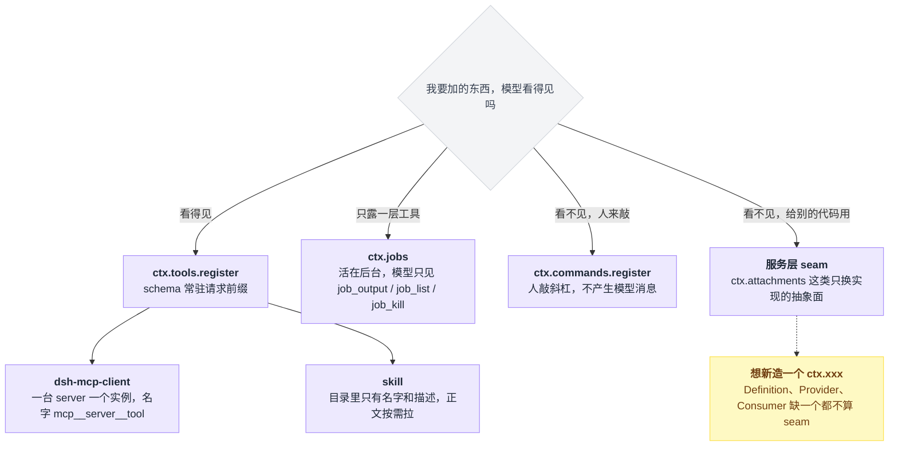
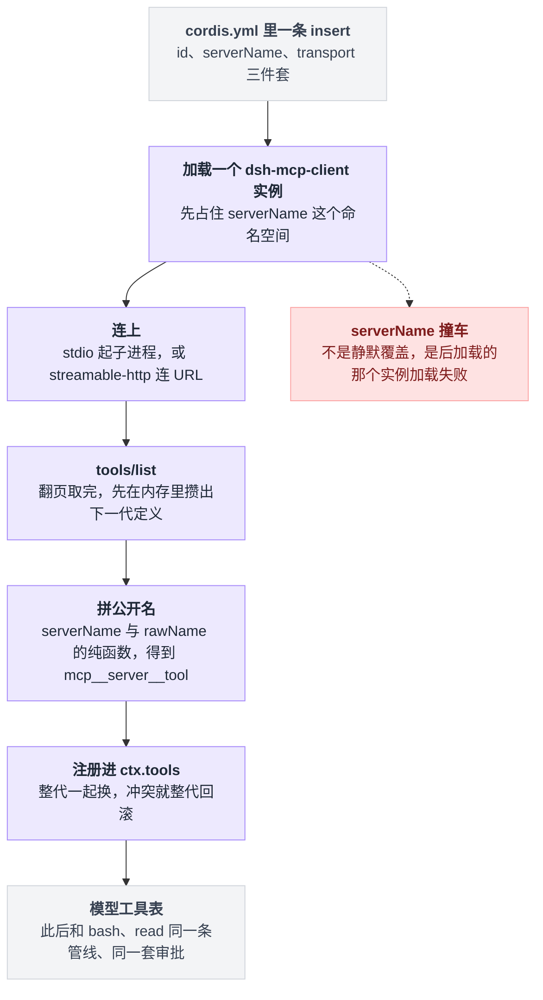
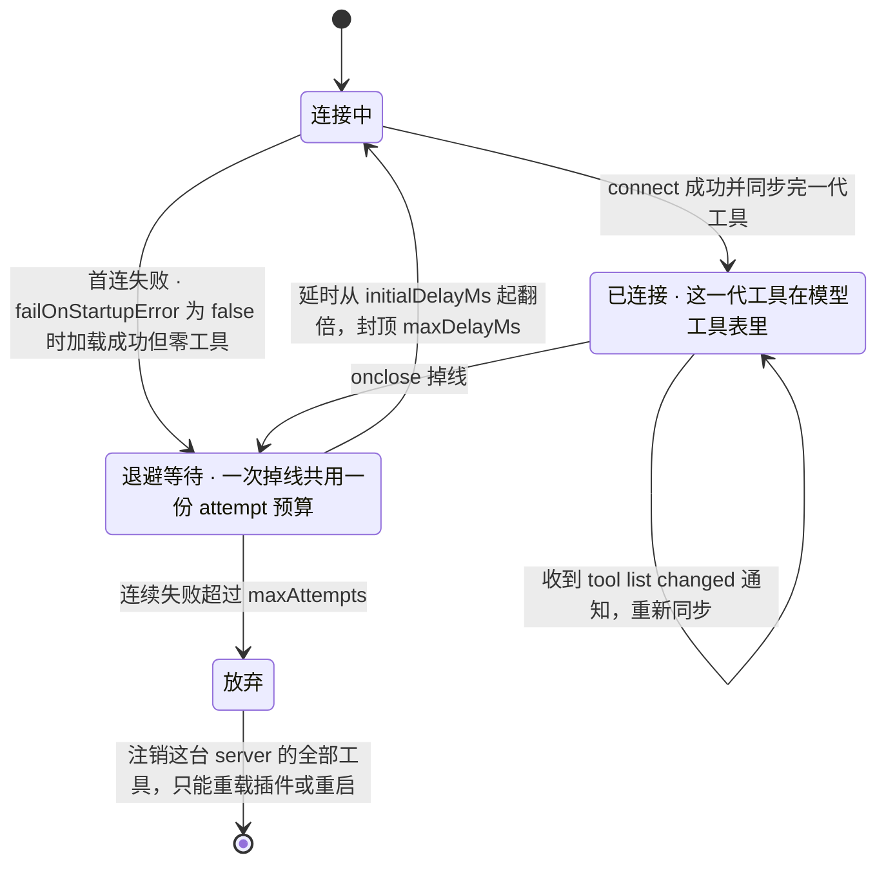
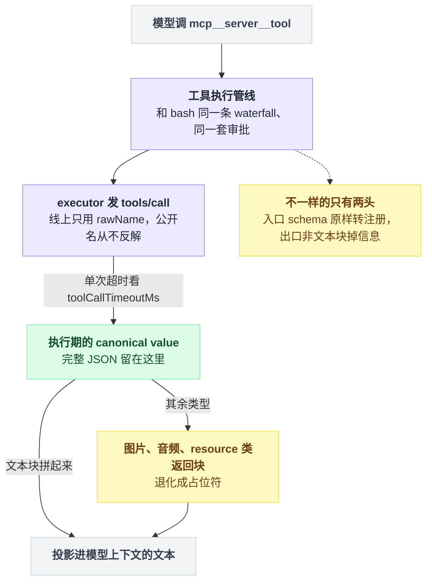
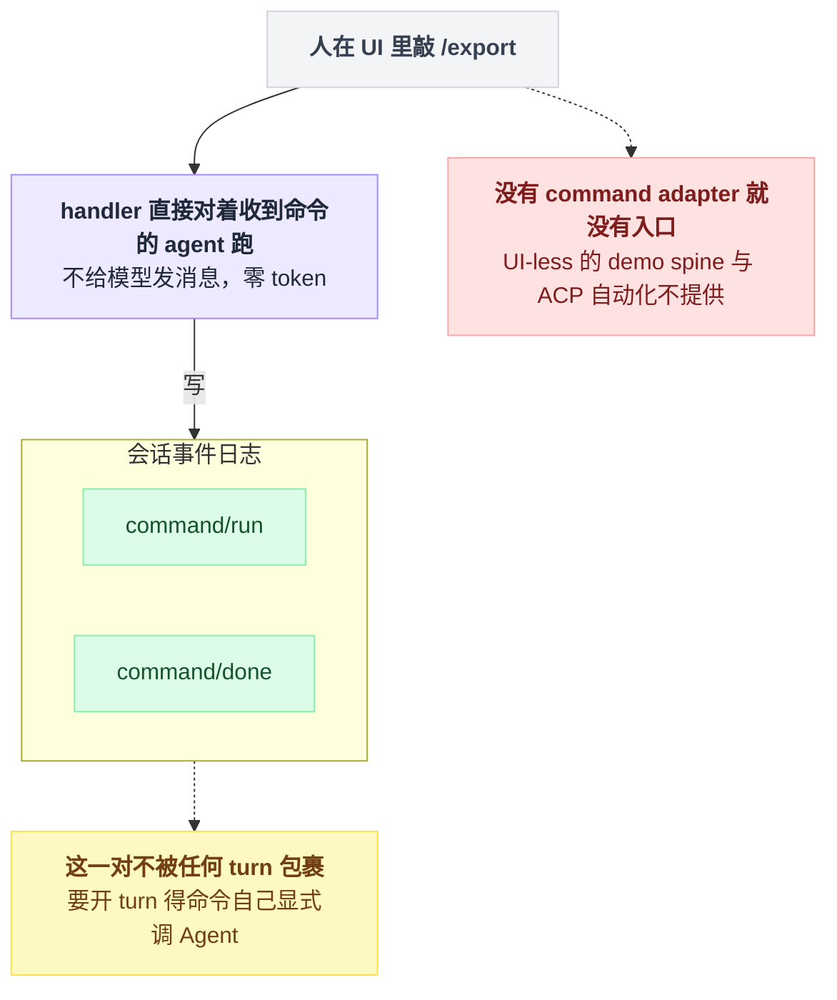
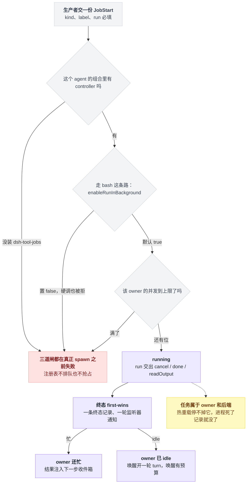
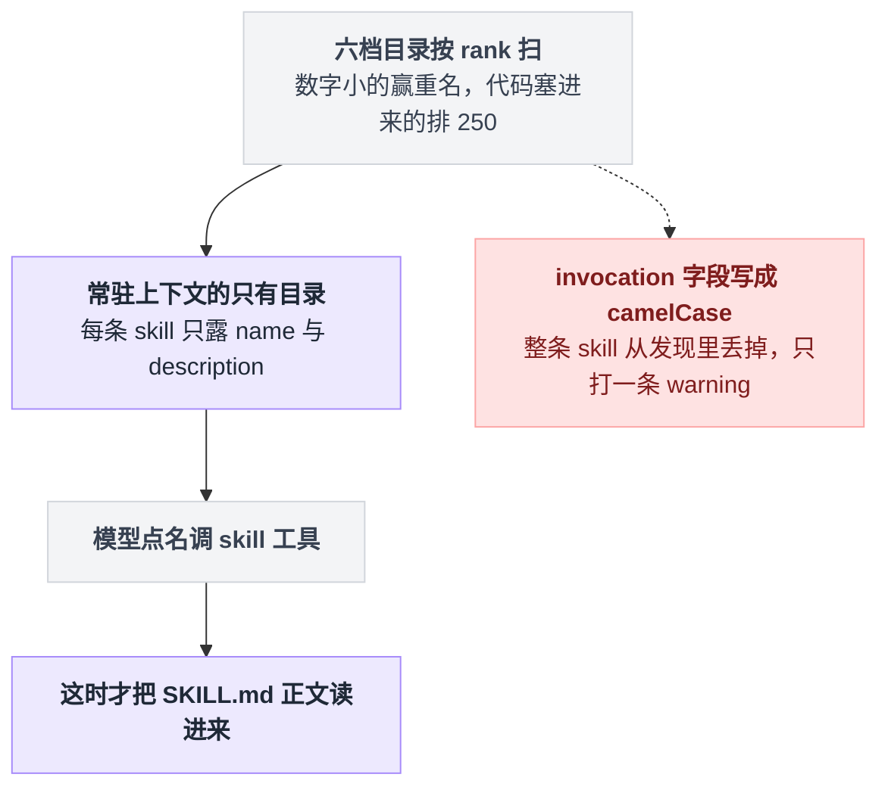
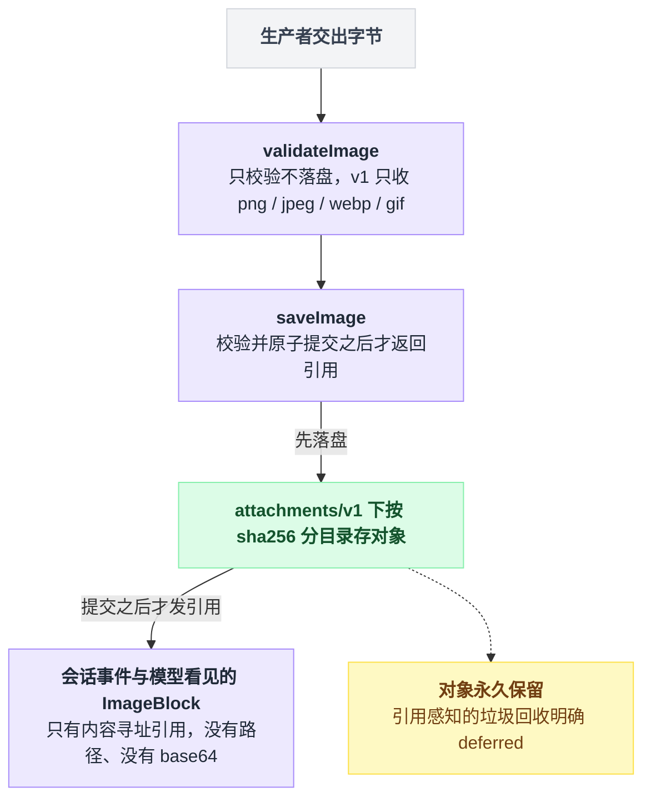

# 20 · MCP 与其它扩展点

> 基于 `deepseek-ai/deepseek-harness` v0.1.0-rc.5（commit `47f9438`），2026-08-14 核对。正文只讲机制；可照抄的配置和代码统一收在文末[附录](#附录可以照抄的模板)，出处收在[脚注](#出处)，点角标可跳转。

读完前面十几章，最容易形成的印象是：给 dsh 加能力，无非就是写个工具、挂个事件。

不是的。想加一条斜杠命令、想让编译任务在后台跑完再回来叫模型、想把公司内网那台 MCP server 的工具接进来——这三件事没有一件是工具，也没有一件是事件。每一件都有专属落点，挑错了不是白写，就是写完发现根本没人来调。

这些剩下的注册面一共六个：MCP、`ctx.commands`、`ctx.jobs`、skill、schedule、attachment。重头是 MCP——读完你应该能接一台 MCP server 上去，并且清楚它的边界，尤其是它**不能**做的那两件事。

---

## 选落点不看功能大小，只看"模型看得见吗"

选落点最容易走的弯路，是按功能给自己的需求分类——"这算定时功能还是后台功能"。这么问没有答案，因为 dsh 的注册面不是按功能切的。

真正有效的一问是：**我要加的东西，模型看得见吗。**

看得见就该往 `ctx.tools` 走；看不见就大概率是命令、是服务、是后台。按这一问劈开，落点只有三条去向：模型能点的、人能敲的、给别的代码用的。



dsh 官方自己维护着两张对照表：一张叫 "Where new behavior goes"，在架构文档里；另一张是 feature 到 mechanism 的映射，在扩展 cookbook 里[^1]。

下面这张是把它们按"教程读者真会问的问题"重排的版本，**本章负责的行加了粗**，各行的原始出处合并收在脚注里[^2]。

| 我想要的效果 | 注册到哪 | 模型看得见吗 |
|---|---|---|
| 模型能主动调用的新能力 | `ctx.tools` 的注册方法 | 是，schema 进提示词 |
| **人敲斜杠命令，不产生模型消息** | **`ctx.commands` 的注册方法** | **否** |
| **后台跑长任务，跑完通知模型** | **`ctx.jobs` 的启动方法** | 间接：`job_output` / `job_list` / `job_kill` |
| **一份"要用时才展开"的说明书** | **落一个 `SKILL.md` 文件；或注册一个 skill provider** | 只看见名字+描述，正文按需加载 |
| **定时提醒，到点开一轮新对话** | **装 `@deepseek-ai/dsh-schedule` 插件** | 是：`schedule_create` 等三个工具 |
| **图片二进制不写进会话日志** | **`ctx.attachments`（抽象 seam）** | 消息里只有内容寻址引用 |
| **接外部 MCP server 的工具** | **每个 server 一个 `dsh-mcp-client` 实例** | 是，名字是 `mcp__<server>__<tool>` |
| 拦截/否决一次工具调用 | `tools/*` waterfall（[13 章](./13-工具执行管线.md)） | 取决于你的决策 |
| 改系统提示词里的一段 | `ctx.systemPrompt`（[15 章](./15-系统提示词与上下文装配.md)） | 是 |
| 委派给子 agent | `ctx.subagents` 提供者注册表（[19 章](./19-子agent与workflow.md)） | 通过 `dsh-tool-subagent` |
| 接一个新模型厂商 | `ctx.llm` 上注册 adapter（[04 章](./04-接模型.md)） | 否 |
| 让模型自己写并运行插件 | `ctx.dynamicCordisRunner` | 间接：模型面工具在 `dsh-tool-cordis` |

看完表你可能会想：那我干脆新造一个 `ctx.xxx` 吧。官方对此有一把很硬的尺子：一个 **seam** 必须凑齐三个角色——Service Definition（接口）、Service Provider（实现）、Consumer（通常是模型能调的工具），**只有一个角色不算 seam**[^3]。

拿这条尺子量本章的东西：jobs、skill、attachment 都是标准三件套；schedule 故意**不**开放 service；commands 只有注册表，没有模型面。

---

## MCP：进了门的外来工具，不是外人

第一个直觉是：外部 server 的工具进来，总得走条特殊通道、受点特殊管制吧？

不是的。`@deepseek-ai/dsh-mcp-client` 连一台外部 MCP server，把它 `tools/list` 出来的工具逐个注册进 `ctx.tools`，模型看到的名字是 `mcp__<serverName>__<rawName>` 这个拼法[^4]。

注册完就到此为止了——之后它和 `bash`、`read` 走的是同一条工具执行管线，同一套 waterfall，同一套审批。所谓"一等公民"就是这个意思：**模型不知道它是外来的。**

从一条 YAML 到模型工具表，中间的环节是固定的，公开名要到倒数第二步才拼出来：



同步一代工具的过程用人话讲是这样：client 把 `tools/list` 翻页取完，先在内存里攒出下一代定义——每个工具的公开名只由 server 名和原始名这两个输入拼出来，schema 原样转注册；攒完整代一起换进 `ctx.tools`，不是逐个替换；换的过程中撞了名就整代回滚，要么全在，要么维持上一代。

从这里能读出一条不变量：**工具名不会因为连接顺序或某次重新同步而变**——它是那两个输入的纯函数。这条不变量是后面几个坑的根。

### 两段官方模板的缩进层级不一样，别抄混

要接多台 server 就在配置里放多条，一条一个 `id`、一个 `serverName`[^4]。两段官方模板都收在附录里：stdio 接法在[附录 A](#a-接一台-stdio-server)，HTTP 接法在[附录 B](#b-接一台-http-server)。

抄之前先对着看一眼——两段长得不一样，这不是笔误[^5]：

| | stdio 那段 | HTTP 那段 |
|---|---|---|
| 它是什么 | 完整的 patch 覆盖层（顶层就是一条 insert） | README 里写在插件列表中的裸条目 |
| 能直接 `--patch` 吗 | 能 | 不能 |
| 当覆盖层用要怎么改 | 不用改 | 自己套一层 insert 并整体右缩进四格 |

挂上去就一条命令，`web` 子命令配上可重复的 `--patch`，命令原文在附录 A 末尾[^6]。

想长期生效，把那段 insert 并进用户补丁文件——**是并进去，不是整个文件覆盖过去**，那里可能已经躺着别的用户补丁[^6]：

| 范围 | 补丁文件 |
|---|---|
| 单 profile | `$DSH_HOME/profiles/<name>/cordis.patch.yml` |
| 整机 | `$DSH_HOME/cordis.patch.yml` |

配置 schema 是一个按 `transport` 分支的 union[^7]：

| 字段 | 适用 | 默认 | 说明 |
|---|---|---|---|
| `serverName` | 两者 | 必填 | 工具名命名空间，正则 `^[A-Za-z0-9_-]{1,32}$` |
| `command` / `args` / `env` / `cwd` | stdio | 只有 `command` 必填 | `args` 直接传，不过 shell |
| `url` / `headers` | http | 只有 `url` 必填 | — |
| `toolCallTimeoutMs` | 两者 | `60000` | 单次工具调用超时 |
| `failOnStartupError` | 两者 | `false` | 为 `false` 时，连不上就"加载成功但零工具" |
| `reconnect.*` | 两者 | `enabled: true` / `initialDelayMs: 500` / `maxDelayMs: 30000` / `maxAttempts: 10` | 断线重连策略 |

`reconnect.*` 那一行背后是一台状态机。按源码里的 supervisor 读出来是这个形状——一次掉线共用一份 attempt 预算，用光了就把这台 server 的工具全注销：



顺带回应 [12 章](./12-写一个工具.md) 留的那个尾巴。那章说"除非你在桥接 MCP 这类外部 schema，否则一律用 `defineTool`"——MCP 就是那个例外的真身：server 给的是它自己的 JSON Schema，dsh 只能原样转注册，没有本地类型可推。

### 三处最容易栽跟头的地方

**第一，dsh 不会替你装 server。** 它只负责起进程或连 URL，不下载 server、不建数据库、不迁移数据[^8]。

还有一条更隐蔽的：stdio 子进程启动前，dsh 会主动抹掉名字像凭证的环境变量和所有 `DSH_*`，其它环境变量照常继承。所以你的 server 要哪个密钥，就显式写进 `config.env`，别指望它从当前 shell 里继承[^8]。

**第二，`serverName` 撞车不是静默覆盖，是后加载的那个实例直接加载失败**[^9]。

回想前面那条不变量：工具名是 server 名与原始名的纯函数[^9]，连接顺序、重新同步、别的 server 都不会让一个工具改名。要守住这条纯函数，撞车就必须在加载期就炸掉，否则模型历史里的工具名会失去稳定性。反过来说，改 `serverName` 等于把这台 server 的所有工具改名一遍。

**第三，只桥接了 Tools。** MCP 的 Resources 和 Prompts 没有消费方，明确 deferred[^10]。图片、音频、resource 类返回块在模型上下文里会退化成占位符，完整 JSON 只留在执行期的 canonical value 里[^10]。

要是你看中的那台 server 主打 Resources，现在接进来等于什么都没接。

所以一次 MCP 工具调用的往返，中间那段和原生工具完全一样，掉信息只掉在两头：



⚠️ 还有一处仓库内部打架，我没能判死：**断线到底自动不自动重连。**

client 包的 README 一边描述着指数退避的重连 supervisor、写明重连开关默认打开；example 那边的 README 却写着 "the current generic client does not auto-reconnect"。源码这边我确认了重连默认值确实是开、掉线钩子也确实会排一次重连，倾向于 example README 是旧文案，但没跑过验证[^11]。

### 反方向不存在：dsh 当不了 MCP server

这条值得单独说，因为很多人接完 client 的下一个念头就是"那能不能把 dsh 暴露给别的 agent 用"。

答案是不能。我在全仓库检索 MCP 官方 SDK 的引用（native、python、website、apps 几个子树都翻了），server 侧的那几个类——`McpServer` 和两种 server transport——**只出现在 mcp-client 自己的测试夹具里**，产品代码一处都没有；mcp 家族的包清单里也只有 client 一个包[^12]。

rc.5 里没有这个扩展点，别去翻配置项找了。要让外部程序驱动 dsh，走的是另一条路：ACP 或 JSON-RPC[^12]，见 [23 章](./23-headless与SDK.md)。

---

## `ctx.commands`：人敲的命令，模型从头到尾不知道

人在 UI 里敲 `/export`，这句话是不是也变成一条消息发给了模型？

没有。官方定义就一句话：handler "Execute against the receiving agent without sending the command to the model"[^13]。工具是给模型调的，命令是给人敲的，两条路一条都不搭[^14]：

| | 工具（`ctx.tools`） | 命令（`ctx.commands`） |
|---|---|---|
| 谁触发 | 模型 | 人在 UI 里敲 `/name` |
| 进模型历史吗 | 进 | **不进** |
| 花 token 吗 | schema 常驻请求前缀 | 零 |
| 会开一轮 turn 吗 | 在 turn 里 | 不会；命令自己可以显式调 `Agent` 再去开 |
| 留痕 | 工具调用与结果 | 日志里一对 `command/run` + `command/done`，不被任何 turn 包裹 |

把表里最后一行摊开：命令这条路从触发到留痕，**全程都在 turn 外面**。



最小完整插件是仓库里真实存在的会话日志导出命令，26 行全文照抄[附录 C](#c-最小斜杠命令插件)[^15]。

命令名要小写、不带斜杠[^16]。handler 拿到的 invocation 有四个字段[^16]：

| 字段 | 是什么 |
|---|---|
| `commandId` | 这次调用的标识 |
| `agent` | 收到命令的那个 agent |
| `rawInput` | 命令名之后的全部字节，含分隔空格 |
| `signal` | 取消信号 |

返回值只有两种 kind[^16]：

| kind | 携带什么 | 备注 |
|---|---|---|
| success | 可选的 `text`、可选的 `sourceEventSeq` | `sourceEventSeq` 只在 success 上可用，指向本会话里一条更早的非命令事件 |
| error | 必填的 `text` | — |

想加输入提示就补 `input.hint`，想让运行记录不重复载荷就关掉 `recordInput`——这两个字段的现成例子在反馈命令的源码里[^16]。

**坑在于注册了不等于有人分发。**

`@deepseek-ai/dsh-commands` 在 base bundle 里，Web 客户端会走它；但按官方 README 的说法，UI-less 的 demo spine 和 ACP 自动化不提供 command adapter[^17]。你在 headless 组合里注册的命令，没有入口，敲不到。

---

## `ctx.jobs`：不排队、不抢占，闸没过就当场失败

家族是三件套[^18]：

| 包 | 角色 |
|---|---|
| `dsh-jobs` | 定义抽象注册表 `ctx.jobs`（一个继承 Service 的抽象类） |
| `dsh-jobs-local` | 进程内实现 |
| `dsh-tool-jobs` | 模型面的 `job_output` / `job_list` / `job_kill` |

base bundle 里只有后两个各占一行；`dsh-jobs` 是纯定义包，由实现包 import，不单独挂载[^18]。

生产者要交的 JobStart 有五个字段：必填 `kind`、`label`、`run`，可选 `owner`、`outputLimitBytes`[^19]。真实调用点是 bash 工具把一条后台命令交给注册表的那一段，全文照抄[附录 D](#d-交一份-jobstart)[^19]。

`run` 交出来的三个钩子各有硬契约[^20]：

| 钩子 | 契约 |
|---|---|
| `cancel` | 必须同步、幂等，并最终让 `done` 落定 |
| `done` | **不许 reject**，reject 会被运行时转成 `failed` |
| `readOutput` | 有它表示这是流式任务、每次读走增量；没有则表示只有终态输出 |

### 三道闸都开在 spawn 之前

启动方法不是交了就跑。它先过三道闸，任何一道没过都是**当场失败**——注册表既不排队也不抢占，没有"等一会儿再跑"这回事。三道闸全开在真正 spawn 之前，跑完之后按 owner 忙不忙决定怎么叫模型：



**第一道是必须先有 controller。** `dsh-tool-jobs` 加载时会给注册表挂上一个 controller；某个 agent 的组合里没装它，启动就报 "background jobs unavailable: no job controller serves this agent (load @deepseek-ai/dsh-tool-jobs in its composition)"[^21]。tool-bash 自己还额外挡了一层，拿不到 jobs 服务时抛的是另一句 "background jobs unavailable: load @deepseek-ai/dsh-jobs and @deepseek-ai/dsh-tool-jobs"[^21]。

**第二道是部署方可以整个关掉后台 bash。** `enableRunInBackground` 默认打开，置 `false` 会移除 `run_in_background` 参数，并在执行期拒绝强行调用[^22]。

**第三道是每个 owner 的并发上限。** `maxConcurrentJobsPerOwner` 默认 10，只数该 owner 的 running 加 stopping，无主任务共用一个桶；满了直接失败，注册表不排队也不抢占[^23]。官方示例里有把上限压到 1 的写法——注意那两行嵌在 demo 插件自己的配置下面，是那个 demo 插件转给注册表的，不是直接写在 jobs-local 那一行上[^23]。

### 任务不属于启动它的工具

新任务种类要做 declaration merging，模板照抄[附录 E](#e-声明一个新任务种类)[^24]。

生命周期上有三条硬约束[^25]。

第一条：任务属于 owner 和后端、**不属于**启动它的工具 fiber，所以插件热重载不会停掉在跑的任务。

第二条：结算 first-wins，一条终态记录、一轮监听器通知。

第三条：**任务是进程内的**，harness 进程死了记录就没了，要跨重启得自己实现 seam。

至于完成通知怎么送到模型：owner 忙就注入下一步收件箱，idle 就唤醒开一轮 turn，唤醒有预算，`maxConsecutiveWakes` 默认 3[^26]。

---

## skill：常驻上下文的只有封面，正文要点名才进来

skill 最容易被误当成"预置提示词"——一堆说明书全塞进上下文备用。

不是的。skill 是**可选指令**，不是会话事件，而且它分两段：目录里只放名字加描述常驻上下文，正文只在模型点名调 `skill` 工具时才读进来[^27]。这个两段式就是它存在的全部理由——不这么切，几十份说明书全塞进提示词，前缀立刻爆。

四件套是 `dsh-skill`（定义）/ `dsh-skill-filesystem`（本地 provider）/ `dsh-skill-badge`（打包 provider）/ `dsh-tool-skill`（模型面工具）。其中第一、二、四个在 base bundle 默认开，`skill-badge` 那条带着 disabled 标记躺在旁边[^28]。

两段式的形状是：目录常驻，正文只有被点名时才进来。



### 重名谁赢：rank 数字小的

本地 provider 按 rank 扫，**rank 数字小的赢重名**[^29]。候选是各档目录扫出来的全部 skill，加上走代码塞进来的运行时 skill，全部按 rank 升序排；同名时先出现的——也就是 rank 小的——赢。

官方目录表一共六档[^30]：

| rank | source | 目录 |
|---|---|---|
| 100 | `project-dsh` | `<projectRoot>/.dsh/skills` |
| 200 | `project-agents` | `<projectRoot>/.agents/skills` |
| 300 | `custom` | 配置项 `customSkillDirs` |
| 400 | `user-dsh` | `<dshHome>/skills`（跳过 `.system` 子目录） |
| 500 | `user-agents` | `<agentsHome>/skills` |
| 600 | `bundled` | 配置了 `bundledSkillDir`，或 `includeDefaultRoots` 为真时取环境变量 `DSH_BUNDLED_SKILL_DIR` |

表里还漏了一档：走代码路径直接塞进来的运行时 skill 拿 250 的 rank[^30]。它没有目录，但参与同一套 rank 比较，所以排在两个 project 目录之后、`custom` 之前。

这里的 projectRoot 是最近的含 `.git` 的祖先目录，找不到就用当前 cwd[^30]。

### 写一个：description 是模型路由的唯一依据

目录形态是"目录名下放一个 `SKILL.md`"，或者扁平的单个 markdown 文件；**只认单层**，嵌套的递归发现是被刻意排除的[^31]。

名字必须 kebab-case。frontmatter 是开放 YAML 对象，provider 只认 `name`、`description`（必填）和 `whenToUse`、`metadata`、`disable-model-invocation`、`user-invocable`[^31]。

仓库里现成的例子照抄[附录 F](#f-一份合格的-skillmd)[^32]。

写 `description` 时回到两段式的画面：模型侧的会话目录里只有名字和描述[^27]，它是模型做路由决策的唯一依据。所以写"什么时候该用我"，不要写"我是什么"。

**这里有个 fail closed 的坑。** 那两个 invocation 字段必须写 kebab-case；写成 camelCase 或给了非布尔值，**整条 skill 从发现里丢掉**并打 warning，而不是忽略该字段[^33]。

设计上是故意的——宁可整条不见，也不能让一条本该禁用的 skill 因为字段写错而暴露。

另外 references、scripts、assets 这几个子目录下的资源文件改动不算目录变更，不会触发重新发现[^33]。

### 不想落盘就走代码

`ctx.skills` 上有两个入口：注册一个 provider 当数据源，或者直接塞一条运行时 skill[^34]。最小 provider 的核心就三处——一个带 name、list、get 三个成员的 provider 对象，一行 inject 声明，一次注册调用，全文在 skill-badge 的源码里[^34]。

---

## schedule：不是 cron，是会话里的一枚闹钟

先说默认状态：base / headless / web-app 三个 bundle 的补丁文件里都没有 `dsh-schedule` 行，它只作为依赖躺在 CLI 的包声明里[^35]。

装法是一个带两条插件条目的覆盖层，照抄[附录 G](#g-装上-schedule-的覆盖层)。`time-context` 并不是 schedule 的依赖，它只让模型能把"明天下午三点"按浏览器时区理解；schedule 自己永远只收显式时区[^35]。

装上后模型多三个工具 `schedule_create` / `schedule_list` / `schedule_delete`[^36]，规则三选一[^36]：

| 规则 | 是什么 | 约束 |
|---|---|---|
| `after_seconds` | 延时 | 正的 safe integer |
| `at` | 绝对时刻 | — |
| `every_seconds` | 固定频率 | **下限 300 秒 / 五分钟** |

标题里"不是 cron"不是修辞，是一串必须提前知道的硬边界[^37]：

- **没有 cron。** 协议里没有日历表达式、没有 Cron、没有重复的时区、没有跨记录的准入闸。
- **投递模式永远是 `session-local`**：原会话必须是活的，没有冷会话调度器、没有任何外部通知通道（官方明确列出：无浏览器/系统/邮件/短信通知）。
- **只对插件加载之后创建的 root agent 生效**：插件只听后来的 `agent/created`，"插件加载时已存在的 agent 和运行时子 agent 拿不到 Schedule"。
- 到点不打断当前 turn：等 agent 完全 idle 才排一次 followup，从不 steer。
- 投递是 **at-least-once**，不是 exactly-once：admission 之后、持久化 dispatch 之前崩溃，恢复后提醒内容可能重复一次。
- 时区不猜：`at` 要么是带 `Z` 或数字偏移的 RFC 3339 串，要么是日期、时间、时区三段分开给，且时区显式写 `UTC` 或 IANA 名。

这个包故意**不导出** service：入口文件只导出 name、inject、apply 三样，全文件没有一处继承 Service，所以根本没有 `ctx.schedule` 可以调[^38]。

状态全在会话事件日志的 `schedule/change` 里，定时器只是日志的一次投影[^39]——这和 [01 章](./01-数据住在哪循环靠什么转.md)那套"日志是唯一真相"是同一个套路。

所以"扩展 schedule"的正确姿势不是调它的 API，而是照着它自己写一个新的定时插件。

---

## attachment：字节先落盘，事件里只有引用

规则一句话：**先落盘，再写事件。**

生产者把校验过的字节交给 `ctx.attachments`，服务只在对象持久化之后才发出内容寻址引用；会话事件和模型可见的 `ImageBlock` 里只有这个引用和元数据，**没有** blob URL、临时路径、厂商 URL 或 base64[^40]。

落点在 DSH home 下一个带版本号的 attachments 目录，本地实现按 sha256 前缀分子目录存对象[^41]。

落到调用上是这个顺序，事件永远排在落盘之后：



服务的抽象面是三个方法加一个只读属性[^42]：

| 成员 | 做什么 |
|---|---|
| `validateImage` | 只校验，不落盘 |
| `saveImage` | 校验并原子提交后返回引用 |
| `readImage` | 校验完整性后返回字节 |
| `imageLimits` | 只读属性 |

v1 只收四种图片：`image/png` `image/jpeg` `image/webp` `image/gif`[^42]。

注意扩展点在**换后端**，不在"加附件类型"。`AttachmentStore` 是继承 Service 的抽象类，实现一个子类当插件加载即可占住 `ctx.attachments`；本地实现 `LocalAttachmentStore` 就是这么来的，base bundle 默认装它[^43]。

⚠️ 对象**永久保留**，引用感知的垃圾回收明确 deferred[^44]——因为 resume 和 fork 出来的会话可能共享同一个对象[^44]。长期跑的部署要自己盯着这个目录的体积。

---

## 装完 dsh，默认到底有什么

不改任何配置时的状态，各行在 base bundle 补丁文件里的位置收在脚注[^45]：

| 能力 | 默认 |
|---|---|
| `ctx.jobs`（jobs-local） | 开 |
| `dsh-tool-jobs`（`job_*` 工具 + controller） | 开 |
| `ctx.attachments`（attachment-local） | 开 |
| `ctx.skills` + 文件系统 provider + `skill` 工具 | 开 |
| `dsh-skill-badge` | **关**（disabled） |
| `ctx.commands` + `/feedback` | 开 |
| MCP client | **未装**，要 `--patch` |
| schedule | **未装**，要 `--patch` |

上面这些行都没有 `config:` 块，所以本章引过的那些默认值——单次工具调用超时六十秒、每个 owner 十个并发、连续唤醒三次、后台 bash 开启、断线重连开启——就是 shipped 组合的实际生效值。

---

## 把六个落点串回来

结论逐条从前面的画面重推一遍，推不出来的就回去补：

- 选落点之所以只问"模型看得见吗"，是因为注册面本来就是按**谁触发**切的，不是按功能切的——看得见走 `ctx.tools`（MCP、skill 的正文、job 的 `job_*`），看不见走 `ctx.commands` 或服务层；
- **接一台 MCP server 只需要一条 YAML，它的工具进来就是一等公民**——同一条管线、同一套审批，模型不知道它是外来的；代价是只有 Tools 能过桥，而且这条桥是单向的——dsh 当不了 MCP server；
- MCP 的 `serverName` 撞车之所以当场炸而不是覆盖，是因为工具名是 server 名与原始名的纯函数，名字的稳定性比加载成功更重要；
- 命令之所以零 token，是因为那条路从触发到留痕全程在 turn 外面——但没有 command adapter 的组合里，注册了也敲不到；
- job 之所以"闸没过就当场失败"，是因为注册表不排队不抢占；它属于 owner 和后端，热重载停不掉，进程一死记录就没了；
- skill 之所以省 token，是因为常驻的只有封面，正文要点名才进来——同一个 fail closed 的姿态也解释了为什么字段写错是整条消失；
- schedule 之所以不是 cron，是因为它只是会话日志的一次投影，`session-local`、at-least-once、没有 service 可调；
- attachment 之所以日志里干净，是因为字节先落盘、事件里只有内容寻址引用——代价是对象永久保留，体积得自己盯。

> 想知道这一点上 Pi / Codex / LangChain 怎么做，见 [五个 agent 系统源码解剖](../2026-08_五个agent系统源码解剖/00-总览与阅读指南.md)。

---

## 附录：可以照抄的模板

### A. 接一台 stdio server

完整的 patch 覆盖层，逐字来自官方 memory 示例，只去掉了文件开头两行注释[^5]：

```yaml
# examples/mcp-memory/memorix.cordis.yml:3-11
- insert:
    - id: memory-memorix
      name: '@deepseek-ai/dsh-mcp-client'
      config:
        serverName: memorix
        transport: stdio
        command: memorix
        args: [serve]
        cwd: !!js process.cwd()
```

挂上去就一条命令[^6]：

```sh
dsh web --patch "$PWD/examples/mcp-memory/memorix.cordis.yml"
```

### B. 接一台 HTTP server

README 里写在插件列表中的裸条目；当覆盖层用要自己套一层 insert 并整体右缩进四格[^5]：

```yaml
# packages/mcp/mcp-client/README.md:22-29
- id: mcp-web
  name: '@deepseek-ai/dsh-mcp-client'
  config:
    serverName: web
    transport: streamable-http
    url: http://localhost:3000/mcp
    headers:
      Authorization: !!js '`Bearer ${process.env.MCP_TOKEN}`'
```

### C. 最小斜杠命令插件

26 行全文，去掉了原注释[^15]：

```ts
// packages/session-query/session-log-export/src/index.ts:1-26
import type { Context } from '@deepseek-ai/cordis'
import type { CommandResult } from '@deepseek-ai/dsh-commands'

export const name = 'session-log-download'
export const inject = ['commands']

const REQUESTED: CommandResult = {
  kind: 'success',
  text: 'Session log download requested.',
}

export function apply(ctx: Context): void {
  ctx.effect(() => ctx.commands.register({
    name: 'export',
    description: 'Download this Session log as a ZIP archive',
    handler: invocation => Promise.resolve(invocation.rawInput.trim() === ''
      ? REQUESTED
      : { kind: 'error', text: 'The Web /export command does not accept a path.' }),
  }), 'session-log-download: command')
}
```

### D. 交一份 JobStart

bash 工具把一条后台命令交给注册表的真实调用点[^19]：

```ts
// packages/shell/tool-bash/src/index.ts:365-377
const id = jobs.start({
  kind: 'bash',
  label: args.command,
  ...exec.agent ? { owner: exec.agent } : {},
  run: () => {
    const proc = ctx.shell.start(ctx.shell.resolve(request))
    return {
      cancel: () => void proc.kill(),
      done: proc.done.then(() => processOutcome(proc)),
      readOutput: () => renderProcessRead(proc.readOutput(), proc.sandbox, escalationModes),
    }
  },
})
```

### E. 声明一个新任务种类

declaration merging，仓库里终端工具就是这么加的[^24]：

```ts
// packages/terminal/tool-terminal/src/index.ts:18-22
declare module '@deepseek-ai/dsh-jobs' {
  interface JobKindMap {
    'pty-send': 'pty-send'
  }
}
```

### F. 一份合格的 SKILL.md

仓库自用的 pre-push 检查 skill；description 与正文首段原文都很长，这里用 `…` 截断，不是原文全貌[^32]：

```markdown
<!-- .agents/skills/dsh-pre-push-checks/SKILL.md:1-8 -->
---
name: dsh-pre-push-checks
description: Use before pushing, force-pushing, marking ready for review, or claiming checks pass on a deepseek-harness branch, …
---

# DSH Pre-Push Checks

Use this skill to run relevant local evidence once before a `deepseek-harness` push. …
```

### G. 装上 schedule 的覆盖层

带两条插件条目[^35]：

```yaml
# examples/web-schedule/cordis.yml:4-9
- insert:
    - id: time-context
      name: '@deepseek-ai/dsh-time-context'

    - id: schedule
      name: '@deepseek-ai/dsh-schedule'
```

---

## 出处

[^1]: "Where new behavior goes"：`docs/architecture.md:108-127`；feature → mechanism map：`docs/cookbook/extension-cookbook.md:101-129`。
[^2]: 重排表各行出处：工具注册 `docs/architecture.md:111`；命令 `:115`；后台任务 `:116`；skill 两段式 `docs/subsystems/skills.md:231`；schedule 插件与三工具 `packages/schedule/schedule/README.md:5`、`:29`；attachment `docs/subsystems/attachment.md:5`；MCP 命名 `packages/mcp/mcp-client/README.md:5`；waterfall 拦截 `docs/architecture.md:119`；系统提示词段 `docs/cookbook/extension-cookbook.md:109`；子 agent `:120`；模型厂商 adapter `:128`；动态插件 `docs/subsystems/extensions.md:69`、`packages/extensions/cordis-host-runner/README.md:5`。
[^3]: seam 必须凑齐三个角色：`docs/architecture.md:100`。
[^4]: 逐个注册与 `mcp__<serverName>__<rawName>` 命名：`packages/mcp/mcp-client/README.md:5`；多台 server 各一条、各一个 id 和 serverName：`:9`。
[^5]: stdio 模板原文：`examples/mcp-memory/memorix.cordis.yml:3-11`；HTTP 模板原文：`packages/mcp/mcp-client/README.md:22-29`。
[^6]: 挂载命令：`examples/mcp-memory/README.md:28`；`web` 子命令与可重复的 `--patch <path>`：`apps/cli/src/args.ts:156`、`:163`；长期生效并进用户补丁文件（单 profile 或整机）：`examples/mcp-memory/README.md:33`。
[^7]: 配置 schema（按 transport 分支的 union）：`packages/mcp/mcp-client/src/index.ts:107-128`；serverName 正则在 `:37`；args 直接传不过 shell 在 `:61-62`；toolCallTimeoutMs 默认 60000 在 `:34`；failOnStartupError 默认 false 在 `:116`；reconnect 各默认值：`packages/mcp/mcp-client/src/connection.ts:40-45`。
[^8]: 不下载 server、不建数据库、不迁移数据：`examples/mcp-memory/README.md:11`；启动前抹掉凭证形环境变量与所有 `DSH_*`：`:13`。
[^9]: serverName 撞车即后加载实例加载失败：`packages/mcp/mcp-client/README.md:58`；工具名是 `(serverName, rawName)` 的纯函数：`:55`。
[^10]: Resources 与 Prompts 明确 deferred：`packages/mcp/mcp-client/README.md:111`；非文本返回块退化成占位符、完整 JSON 留在 canonical value：`:114`。
[^11]: 重连矛盾三方：supervisor 描述在 `packages/mcp/mcp-client/README.md:69`，`reconnect.enabled` 默认 true 写明在 `:48`；"does not auto-reconnect" 的旧文案在 `examples/mcp-memory/README.md:82`；源码侧 `packages/mcp/mcp-client/src/connection.ts:40-45` 的 RECONNECT_DEFAULTS、`:192` 的 scheduleReconnect、`:248` 的 onclose 钩子。
[^12]: server 侧 SDK 类只出现在测试夹具：`packages/mcp/mcp-client/tests/fixture-server.ts:8-9`、`packages/mcp/mcp-client/tests/mcp-client.e2e.ts:18-19`；包清单只有 mcp-client 一行：`packages/mcp/README.md:9`；外部驱动 dsh 的两条路：ACP 在 `packages/acp/acp`，JSON-RPC 示例在 `examples/jsonrpc-agent`。
[^13]: handler 的官方定义原话：`docs/subsystems/commands.md:41`。
[^14]: 工具与命令对照表出处：不进模型历史 `packages/interaction/commands/README.md:15`；零 token `:31`；命令可显式调 Agent 开 turn `:15`；日志一对 `command/run` + `command/done` 不被 turn 包裹 `docs/subsystems/commands.md:143-146`。
[^15]: 最小命令插件全文：`packages/session-query/session-log-export/src/index.ts:1-26`。
[^16]: 命令名小写不带斜杠：`packages/interaction/commands/README.md:13`；invocation 四字段：`docs/subsystems/commands.md:51-60`；返回值两种 kind：`:65-73`；`input.hint` 与 `recordInput` 的现成例子：`packages/feedback/command-feedback/src/index.ts:104-105`。
[^17]: dsh-commands 在 base bundle：`packages/bundle/base/cordis.patch.yml:250-251`；UI-less spine 与 ACP 自动化不提供 command adapter：`packages/interaction/commands/README.md:19`。
[^18]: 三件套：`packages/jobs/README.md:9-11`；抽象注册表（`abstract class JobRegistry extends Service`）：`packages/jobs/jobs/src/index.ts:62`；模型面三工具：`packages/jobs/tool-jobs/README.md:9-11`；base bundle 行：`packages/bundle/base/cordis.patch.yml:69-70`（jobs-local）、`:218-219`（tool-jobs）。
[^19]: JobStart 五字段：`docs/subsystems/jobs.md:34-57`；真实调用点：`packages/shell/tool-bash/src/index.ts:365-377`。
[^20]: 三个钩子的契约：`docs/subsystems/jobs.md:63-83`。
[^21]: attachController 调用：`packages/jobs/tool-jobs/src/index.ts:260`；no controller 报错原文：`packages/jobs/jobs-local/README.md:21`；tool-bash 的额外检查与另一句报错：`packages/shell/tool-bash/src/index.ts:356`。
[^22]: enableRunInBackground 默认 true：`packages/shell/tool-bash/src/index.ts:41`；执行期拒绝在 `:352`；README 侧说明：`packages/shell/tool-bash/README.md:37`。
[^23]: maxConcurrentJobsPerOwner 默认 10：`packages/jobs/jobs-local/src/index.ts:28`；只数 running + stopping、无主共桶：`docs/subsystems/jobs.md:157`；不排队不抢占：`packages/jobs/jobs-local/README.md:11`；压到 1 的演示（嵌在 dsh-acp-demo 的 config.tasks 下）：`examples/acp-agent/background-job-admission.cordis.yml:19-20`。
[^24]: 新任务种类的 declaration merging 模板：`packages/terminal/tool-terminal/src/index.ts:18-22`。
[^25]: 热重载不停任务：`packages/jobs/jobs-local/README.md:15`；结算 first-wins：`:19`；任务是进程内的：`:33`。
[^26]: 完成通知与唤醒预算：`packages/jobs/tool-jobs/README.md:23-25`、`:31-36`；maxConsecutiveWakes 默认 3 的源码：`packages/jobs/tool-jobs/src/index.ts:52`。
[^27]: skill 是可选指令、不是会话事件：`docs/subsystems/skills.md:5`；目录只露 name 与 description：`:231`；正文点名才加载：`:235`。
[^28]: 四件套清单：`docs/subsystems/skills.md:5`；base bundle 行：`packages/bundle/base/cordis.patch.yml:237`、`:240`、`:247`；skill-badge 带 `disabled: true`：`:243-245`。
[^29]: rank 小的赢重名：`packages/skill/skill/src/index.ts:75`，排序在 `:808`。
[^30]: 六档目录表：`docs/subsystems/skills.md:68-75`；前五档常量：`packages/skill/skill-filesystem/src/index.ts:36-40`；bundled 行在 `:258`，环境变量兜底在 `:171-172`；BUNDLED_SKILL_RANK = 600：`packages/skill/skill/src/index.ts:27`；RUNTIME_RANK = 250：`:24`；projectRoot 判定：`docs/subsystems/skills.md:77`。
[^31]: 只认单层、嵌套 `**/SKILL.md` 刻意排除：`docs/subsystems/skills.md:85`；单层规则与 frontmatter 认的字段：`packages/skill/skill-filesystem/README.md:55`。
[^32]: SKILL.md 真实示例：`.agents/skills/dsh-pre-push-checks/SKILL.md:1-8`。
[^33]: invocation 字段写错整条丢弃并打 warning：`packages/skill/skill-filesystem/README.md:57`；资源文件改动不触发重新发现：`:47`。
[^34]: registerProvider 与 register 两个入口：`docs/subsystems/skills.md:263`、`:274`；最小 provider 全文：`packages/skill/skill-badge/src/index.ts:36-60`（provider 对象 `:36-50`、inject 声明 `:55`、注册调用 `:59`）。
[^35]: dsh-schedule 只作为依赖：`apps/cli/package.json:68`；安装覆盖层：`examples/web-schedule/cordis.yml:4-9`；time-context 不是依赖：`packages/schedule/schedule/README.md:11`；跑起来的命令：`examples/web-schedule/README.md:8`。
[^36]: 三个工具：`packages/schedule/schedule/README.md:29`；规则三选一与 every 下限：`:5`、`docs/subsystems/schedule.md:94`。
[^37]: 硬边界逐条：没有 cron/日历表达式/跨记录准入闸：`docs/subsystems/schedule.md:94`；deliveryMode 类型定义：`:164-165`；无冷会话调度器、无外部通道：`:156`；无浏览器/系统/邮件/短信通知：`examples/web-schedule/README.md:19`；只对之后创建的 root agent 生效：`packages/schedule/schedule/README.md:9`；idle 才 followup、从不 steer：`docs/subsystems/schedule.md:184`；at-least-once：`:186`；时区显式规则：`packages/schedule/schedule/README.md:23`。
[^38]: 不导出 service：`packages/schedule/schedule/src/index.ts:33-35` 只有 name / inject / apply，全文件没有 `extends Service`。
[^39]: 状态在 `schedule/change` 事件：`packages/schedule/schedule/README.md:17`；定时器是日志的投影：`:5`。
[^40]: 先落盘再发引用、事件里没有 URL/路径/base64：`docs/subsystems/attachment.md:5`。
[^41]: 落点 `<DSH_HOME>/attachments/v1`：`docs/subsystems/attachment.md:7`；本地实现具体路径 `<DSH_HOME>/attachments/v1/objects/<sha256-prefix>/<sha256>`：`packages/attachment/attachment-local/README.md:5`。
[^42]: 抽象面三方法一属性：`docs/subsystems/attachment.md:88-112`；imageLimits 属性：`packages/attachment/attachment/src/index.ts:35`；v1 只收四种图片：`docs/subsystems/attachment.md:17`。
[^43]: AttachmentStore 抽象类：`packages/attachment/attachment/src/index.ts:29-32`；LocalAttachmentStore：`packages/attachment/attachment-local/src/index.ts:38`；base bundle 装它：`packages/bundle/base/cordis.patch.yml:106-107`。
[^44]: 永久保留、引用感知 GC 明确 deferred：`packages/attachment/attachment-local/README.md:19`；resume/fork 会话共享对象：`docs/subsystems/attachment.md:72`。
[^45]: 默认状态表各行在 `packages/bundle/base/cordis.patch.yml` 的位置：jobs-local `:69-70`；tool-jobs `:218-219`；attachment-local `:106-107`；skills 三件 `:237`、`:240`、`:247`；skill-badge disabled `:243-245`；commands 与 /feedback `:250`、`:253`。
