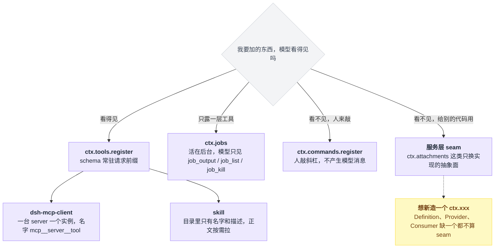
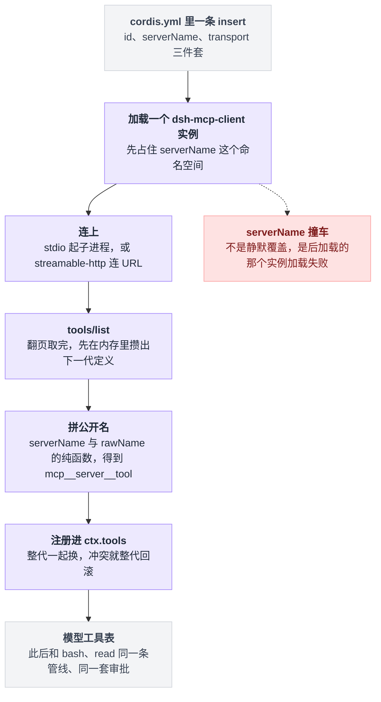
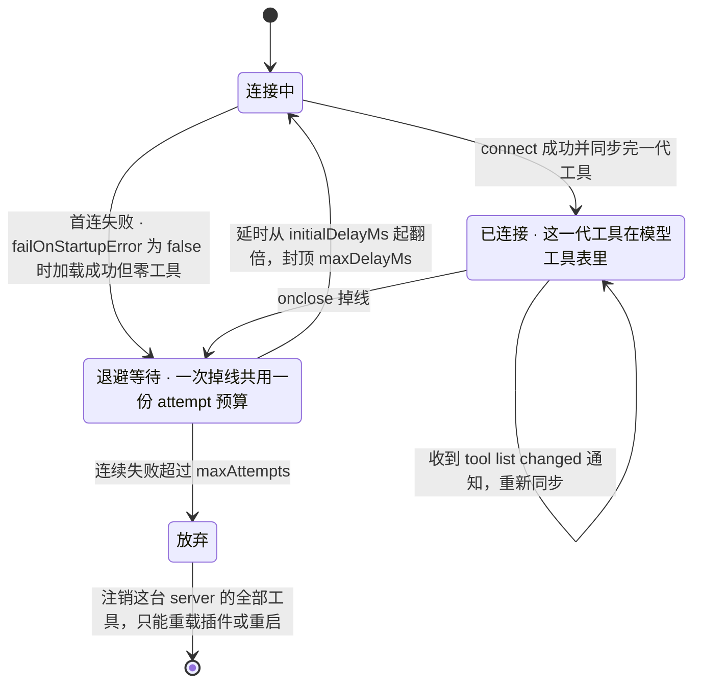
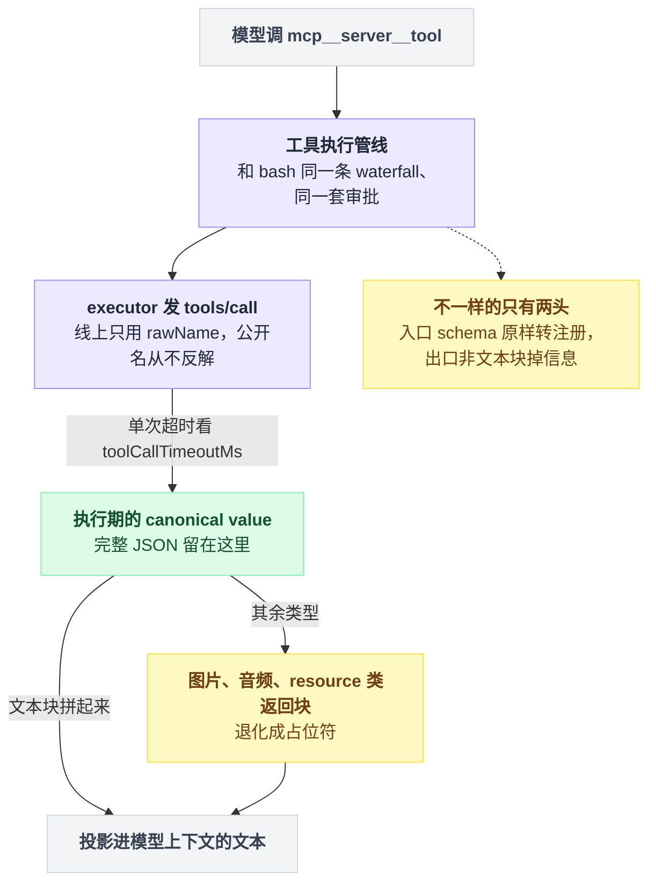
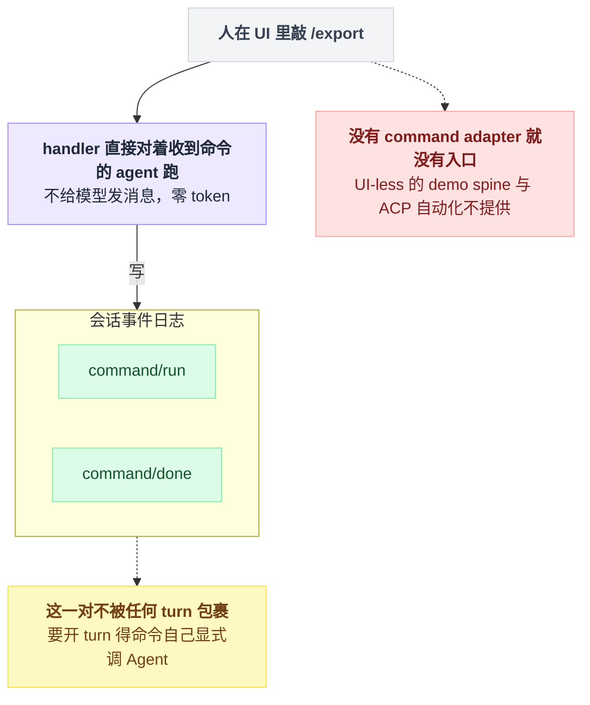
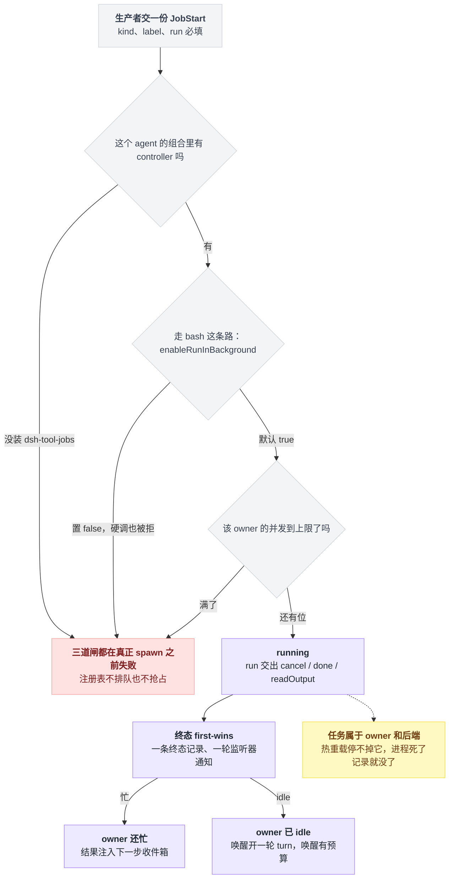
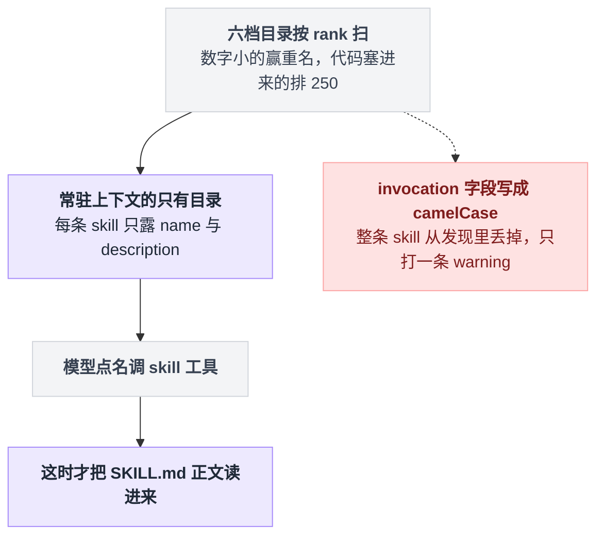
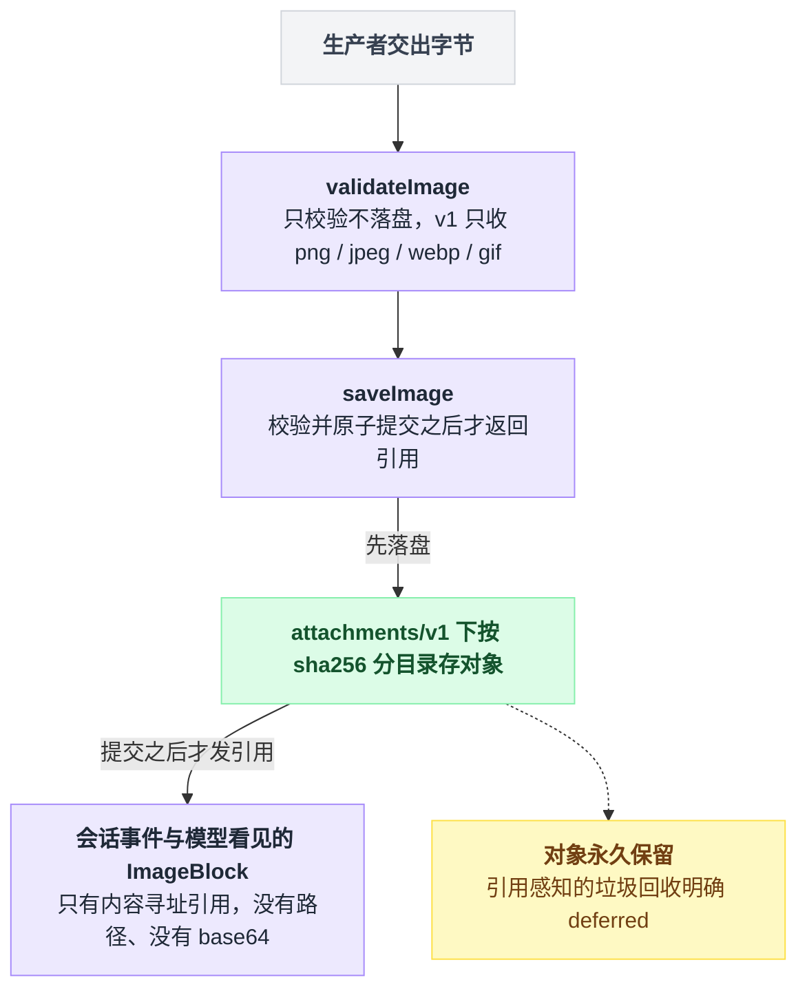

# 20 · MCP 与其它扩展点

> 基于 `deepseek-ai/deepseek-harness` v0.1.0-rc.5（commit `47f9438`），2026-08-14 核对。

前面十几章围着工具和事件打转，但 dsh 能挂东西的地方远不止这两处。

想加一条斜杠命令、想让编译任务在后台跑完再回来叫模型、想把公司内网那台 MCP server 的工具接进来——每一件都有专属落点，挑错了不是白写，就是写完发现根本没人来调。

这一章把"工具"和"事件"之外剩下的注册面一次讲完：MCP、`ctx.commands`、`ctx.jobs`、skill、schedule、attachment。重头是 MCP——读完你应该能接一台 MCP server 上去，并且清楚它的边界，尤其是它**不能**做的那两件事。

---

## 先想清楚"我要加的东西是给谁用的"

选落点最有效的一问不是"这算什么功能"，而是"模型看得见吗"。

看得见就该往 `ctx.tools` 走，看不见就大概率是命令、是服务、是后台。按这一问劈开，落点只有三条去向：模型能点的、人能敲的、给别的代码用的。



dsh 官方自己维护着两张对照表："Where new behavior goes" 和 "feature → mechanism map"，分别在 `docs/architecture.md:108`–`127` 和 `docs/cookbook/extension-cookbook.md:101`–`129`。

下面这张是把它们按"教程读者真会问的问题"重排的版本，**本章负责的行加了粗**。

| 我想要的效果 | 注册到哪 | 模型看得见吗 | 出处 |
|---|---|---|---|
| 模型能主动调用的新能力 | `ctx.tools.register()` | 是，schema 进提示词 | `docs/architecture.md:111` |
| **人敲斜杠命令，不产生模型消息** | **`ctx.commands.register()`** | **否** | `docs/architecture.md:115` |
| **后台跑长任务，跑完通知模型** | **`ctx.jobs.start()`** | 间接：`job_output` / `job_list` / `job_kill` | `docs/architecture.md:116` |
| **一份"要用时才展开"的说明书** | **落一个 `SKILL.md` 文件；或 `ctx.skills.registerProvider()`** | 只看见名字+描述，正文按需加载 | `docs/subsystems/skills.md:231` |
| **定时提醒，到点开一轮新对话** | **装 `@deepseek-ai/dsh-schedule` 插件** | 是：`schedule_create` 等三个工具 | `packages/schedule/schedule/README.md:5`、`:29` |
| **图片二进制不写进会话日志** | **`ctx.attachments`（抽象 seam）** | 消息里只有内容寻址引用 | `docs/subsystems/attachment.md:5` |
| **接外部 MCP server 的工具** | **每个 server 一个 `dsh-mcp-client` 实例** | 是，名字是 `mcp__<server>__<tool>` | `packages/mcp/mcp-client/README.md:5` |
| 拦截/否决一次工具调用 | `tools/*` waterfall（[13 章](./13-工具执行管线.md)） | 取决于你的决策 | `docs/architecture.md:119` |
| 改系统提示词里的一段 | `ctx.systemPrompt.section()`（[15 章](./15-系统提示词与上下文装配.md)） | 是 | `docs/cookbook/extension-cookbook.md:109` |
| 委派给子 agent | `ctx.subagents` 提供者注册表（[19 章](./19-子agent与workflow.md)） | 通过 `dsh-tool-subagent` | `docs/cookbook/extension-cookbook.md:120` |
| 接一个新模型厂商 | `ctx.llm` 上 `registerAdapter`（[04 章](./04-接模型.md)） | 否 | `docs/cookbook/extension-cookbook.md:128` |
| 让模型自己写并运行插件 | `ctx.dynamicCordisRunner` | 间接：模型面工具在 `dsh-tool-cordis` | `docs/subsystems/extensions.md:69`、`packages/extensions/cordis-host-runner/README.md:5` |

那么什么时候该新造一个 `ctx.xxx`？官方口径很硬：一个 **seam** 必须凑齐三个角色——Service Definition（接口）、Service Provider（实现）、Consumer（通常是模型能调的工具），只有一个角色不算 seam（`docs/architecture.md:100`）。

拿这条尺子量本章的东西：jobs、skill、attachment 都是标准三件套；schedule 故意**不**开放 service；commands 只有注册表，没有模型面。

---

## MCP：一台 server 一个插件实例，工具是一等公民

`@deepseek-ai/dsh-mcp-client` 连一台外部 MCP server，把它 `tools/list` 出来的工具逐个注册到 `ctx.tools`，模型看到的名字是 `mcp__<serverName>__<rawName>`（`packages/mcp/mcp-client/README.md:5`）。

注册完就到此为止了——之后它和 `bash`、`read` 走的是同一条工具执行管线，同一套 waterfall，同一套审批。所谓"一等公民"就是这个意思：模型不知道它是外来的。

从一条 YAML 到模型工具表，中间的环节是固定的，公开名要到倒数第二步才拼出来：



同步一代工具的骨架大致是这样：

```
攒下一代 = []
for 每一页 in tools/list（翻页取完）:
    for 每个原始工具 in 这一页:
        公开名 = "mcp__" + serverName + "__" + rawName    // 纯函数，只看这两个输入
        攒下一代.append(公开名, 原样转来的 schema)

整代一起换进 ctx.tools                                    // 不是逐个替换
若换的过程中撞名: 整代回滚                                 // 要么全在，要么维持上一代
```

一句话：**工具名不会因为连接顺序或某次重新同步而变**——这条不变量是后面几个坑的根。

### 配置字段以源码为准

要接多台 server 就在 `cordis.yml` 里放多条，一条一个 `id`、一个 `serverName`（`README.md:9`）。

stdio 模板（逐字来自 `examples/mcp-memory/memorix.cordis.yml:3`–`11`，只去掉了文件开头两行注释）：

```yaml
- insert:
    - id: memory-memorix
      name: '@deepseek-ai/dsh-mcp-client'
      config:
        serverName: memorix
        transport: stdio
        command: memorix
        args: [serve]
        cwd: !!js process.cwd()
```

HTTP 模板（逐字来自 `packages/mcp/mcp-client/README.md:22`–`29`）：

```yaml
- id: mcp-web
  name: '@deepseek-ai/dsh-mcp-client'
  config:
    serverName: web
    transport: streamable-http
    url: http://localhost:3000/mcp
    headers:
      Authorization: !!js '`Bearer ${process.env.MCP_TOKEN}`'
```

**这两段的缩进层级不一样，别照着抄混了。**

| | stdio 那段 | HTTP 那段 |
|---|---|---|
| 它是什么 | 完整的 patch 覆盖层（顶层 `- insert:`） | README 里写在 `cordis.yml` 插件列表中的裸条目 |
| 能直接 `--patch` 吗 | 能 | 不能 |
| 当覆盖层用要怎么改 | 不用改 | 自己套一层 `- insert:` 并整体右缩进四格 |

挂上去就一条命令：

```
dsh web --patch "$PWD/examples/mcp-memory/memorix.cordis.yml"
```

出处：`examples/mcp-memory/README.md:28`；`web` 子命令和可重复的 `--patch <path>` 都定义在 `apps/cli/src/args.ts:156`、`:163`。

想长期生效，把这段 `insert` 并进 `$DSH_HOME/profiles/<name>/cordis.patch.yml`（单 profile）或 `$DSH_HOME/cordis.patch.yml`（整机）——**是并进去，不是整个文件覆盖过去**，那里可能已经躺着别的用户补丁（`examples/mcp-memory/README.md:33`）。

Schema 定义在 `packages/mcp/mcp-client/src/index.ts:107`–`128`，是一个按 `transport` 分支的 union：

| 字段 | 适用 | 默认 | 说明 |
|---|---|---|---|
| `serverName` | 两者 | 必填 | 工具名命名空间，正则 `^[A-Za-z0-9_-]{1,32}$`（`src/index.ts:37`） |
| `command` / `args` / `env` / `cwd` | stdio | 只有 `command` 必填 | `args` 直接传，不过 shell（`src/index.ts:61`–`62`） |
| `url` / `headers` | http | 只有 `url` 必填 | — |
| `toolCallTimeoutMs` | 两者 | `60000`（`src/index.ts:34`） | 单次 `callTool` 超时 |
| `failOnStartupError` | 两者 | `false`（`src/index.ts:116`） | 为 `false` 时，连不上就"加载成功但零工具" |
| `reconnect.*` | 两者 | `enabled: true` / `initialDelayMs: 500` / `maxDelayMs: 30000` / `maxAttempts: 10`（`src/connection.ts:40`–`45`） | 断线重连策略 |

`reconnect.*` 那一行背后是一台状态机。按源码里的 supervisor 读出来是这个形状——一次掉线共用一份 attempt 预算，用光了就把这台 server 的工具全注销：



顺带回应 [12 章](./12-写一个工具.md) 留的那个尾巴。那章说"除非你在桥接 MCP 这类外部 schema，否则一律用 `defineTool`"——MCP 就是那个例外的真身：server 给的是它自己的 JSON Schema，dsh 只能原样转注册，没有本地类型可推。

### 三处最容易栽跟头的地方

**第一，dsh 不会替你装 server。** 它只负责起进程或连 URL，不下载 server、不建数据库、不迁移数据（`examples/mcp-memory/README.md:11`）。

还有一条更隐蔽的：stdio 子进程启动前，dsh 会主动抹掉名字像凭证的环境变量和所有 `DSH_*`，其它环境变量照常继承。所以你的 server 要哪个密钥，就显式写进 `config.env`，别指望它从当前 shell 里继承（`examples/mcp-memory/README.md:13`）。

**第二，`serverName` 撞车不是静默覆盖，是后加载的那个实例直接加载失败**（`packages/mcp/mcp-client/README.md:58`）。

这个设计是刻意的：工具名是 `(serverName, rawName)` 的纯函数（`README.md:55`），连接顺序、重新同步、别的 server 都不会让一个工具改名——所以撞车必须在加载期就炸掉，否则模型历史里的工具名会失去稳定性。反过来说，改 `serverName` 等于把这台 server 的所有工具改名一遍。

**第三，只桥接了 Tools。** MCP 的 Resources 和 Prompts 没有消费方，明确 deferred（`README.md:111`）。图片、音频、resource 类返回块在模型上下文里会退化成占位符，完整 JSON 只留在执行期的 canonical value 里（`README.md:114`）。

要是你看中的那台 server 主打 Resources，现在接进来等于什么都没接。

所以一次 MCP 工具调用的往返，中间那段和原生工具完全一样，掉信息只掉在两头：



⚠️ 还有一处仓库内部打架，我没能判死：**断线到底自动不自动重连。**

`packages/mcp/mcp-client/README.md:69` 描述了指数退避的重连 supervisor，`:48` 写明 `reconnect.enabled` 默认 `true`；而 `examples/mcp-memory/README.md:82` 写的是 "the current generic client does not auto-reconnect"。源码这边我确认了 `packages/mcp/mcp-client/src/connection.ts:40`–`45` 的 `RECONNECT_DEFAULTS.enabled = true`、`:192` 的 `scheduleReconnect()`、`:248` 的 `generation.onclose` 钩子，倾向于 example README 是旧文案，但没跑过验证。

### 反方向不存在：dsh 当不了 MCP server

这条值得单独说，因为很多人接完 client 的下一个念头就是"那能不能把 dsh 暴露给别的 agent 用"。

答案是不能。我在全仓库检索 `@modelcontextprotocol/sdk`（含 `native/`、`python/`、`website/`、`apps/`），server 侧的 `McpServer` / `StdioServerTransport` / `StreamableHTTPServerTransport` **只出现在 mcp-client 自己的测试夹具里**（`packages/mcp/mcp-client/tests/fixture-server.ts:8`–`9`、`tests/mcp-client.e2e.ts:18`–`19`），产品代码一处都没有；`packages/mcp/README.md:9` 的包清单里也只有 `mcp-client/` 一行。

rc.5 里没有这个扩展点，别去翻配置项找了。要让外部程序驱动 dsh，走的是另一条路：ACP（`packages/acp/acp`）或 JSON-RPC（`examples/jsonrpc-agent`），见 [23 章](./23-headless与SDK.md)。

---

## `ctx.commands`：给人敲的命令，一个 token 都不花

工具是给模型调的，命令是给人敲的。官方定义就一句话：`handler` "Execute against the receiving agent without sending the command to the model"（`docs/subsystems/commands.md:41`）。

| | 工具（`ctx.tools`） | 命令（`ctx.commands`） |
|---|---|---|
| 谁触发 | 模型 | 人在 UI 里敲 `/name` |
| 进模型历史吗 | 进 | **不进**（`packages/interaction/commands/README.md:15`） |
| 花 token 吗 | schema 常驻请求前缀 | 零（`README.md:31`） |
| 会开一轮 turn 吗 | 在 turn 里 | 不会；命令自己可以显式调 `Agent` 再去开（`README.md:15`） |
| 留痕 | 工具调用与结果 | 日志里一对 `command/run` + `command/done`，不被任何 turn 包裹（`docs/subsystems/commands.md:143`–`146`） |

把表里最后一行摊开：命令这条路从触发到留痕，全程都在 turn 外面。



最小完整插件长这样，是 `packages/session-query/session-log-export/src/index.ts:1`–`26` 的全文（26 行，去掉原注释）：

```ts
import type { Context } from '@deepseek-ai/cordis'
import type { CommandResult } from '@deepseek-ai/dsh-commands'

export const name = 'session-log-download'
export const inject = ['commands']

const REQUESTED: CommandResult = {
  kind: 'success',
  text: 'Session log download requested.',
}

export function apply(ctx: Context): void {
  ctx.effect(() => ctx.commands.register({
    name: 'export',
    description: 'Download this Session log as a ZIP archive',
    handler: invocation => Promise.resolve(invocation.rawInput.trim() === ''
      ? REQUESTED
      : { kind: 'error', text: 'The Web /export command does not accept a path.' }),
  }), 'session-log-download: command')
}
```

`name` 要小写、不带斜杠（`packages/interaction/commands/README.md:13`）。`handler` 拿到的 `invocation` 有四个字段：

| 字段 | 是什么 |
|---|---|
| `commandId` | 这次调用的标识 |
| `agent` | 收到命令的那个 agent |
| `rawInput` | 命令名之后的全部字节，含分隔空格 |
| `signal` | 取消信号 |

出处：`docs/subsystems/commands.md:51`–`60`。

返回值只有两种 kind（`:65`–`73`）：

| kind | 形状 | 备注 |
|---|---|---|
| success | `{kind:'success', text?, sourceEventSeq?}` | `sourceEventSeq` 只在 success 上可用，指向本会话里一条更早的非命令事件 |
| error | `{kind:'error', text}` | — |

想加输入提示就补 `input: { hint: '<text>' }`，想让 `command/run` 不重复记录载荷就 `recordInput: false`——这两个字段的现成例子在 `packages/feedback/command-feedback/src/index.ts:104`–`105`。

**坑在于注册了不等于有人分发。**

`@deepseek-ai/dsh-commands` 在 base bundle 里（`packages/bundle/base/cordis.patch.yml:250`–`251`），Web 客户端会走它；但按 `packages/interaction/commands/README.md:19` 的说法，UI-less 的 demo spine 和 ACP 自动化不提供 command adapter。你在 headless 组合里注册的命令，没有入口，敲不到。

---

## `ctx.jobs`：后台任务的准入与生命周期

家族是三件套（`packages/jobs/README.md:9`–`11`）：

| 包 | 角色 |
|---|---|
| `dsh-jobs` | 定义抽象注册表 `ctx.jobs`（`packages/jobs/jobs/src/index.ts:62` 的 `abstract class JobRegistry extends Service`） |
| `dsh-jobs-local` | 进程内实现 |
| `dsh-tool-jobs` | 模型面的 `job_output` / `job_list` / `job_kill`（`packages/jobs/tool-jobs/README.md:9`–`11`） |

base bundle 里只有后两个各占一行：`packages/bundle/base/cordis.patch.yml:69`–`70`（jobs-local）和 `:218`–`219`（tool-jobs）。`dsh-jobs` 是纯定义包，由实现包 import，不单独挂载。

生产者要交的 `JobStart` 有五个字段（`docs/subsystems/jobs.md:34`–`57`）：必填 `kind`、`label`、`run()`，可选 `owner`、`outputLimitBytes`。真实调用点在 `packages/shell/tool-bash/src/index.ts:365`–`377`：

```ts
const id = jobs.start({
  kind: 'bash',
  label: args.command,
  ...exec.agent ? { owner: exec.agent } : {},
  run: () => {
    const proc = ctx.shell.start(ctx.shell.resolve(request))
    return {
      cancel: () => void proc.kill(),
      done: proc.done.then(() => processOutcome(proc)),
      readOutput: () => renderProcessRead(proc.readOutput(), proc.sandbox, escalationModes),
    }
  },
})
```

`run()` 返回的三个钩子各有硬契约（`docs/subsystems/jobs.md:63`–`83`）：

| 钩子 | 契约 |
|---|---|
| `cancel()` | 必须同步、幂等，并最终让 `done` 落定 |
| `done` | **不许 reject**，reject 会被运行时转成 `failed` |
| `readOutput` | 有它表示这是流式任务、每次读走增量；没有则表示只有终态输出 |

### 三道准入闸

准入有三道，都在真正 spawn 之前 fail：

```
def start(job):
    if 这个 agent 的组合里没有 controller:      失败    // 没装 dsh-tool-jobs
    if 走 bash 这条路 且 enableRunInBackground 为 false:  失败    // 硬调也拒
    if 该 owner 的 running + stopping 已到上限:  失败    // 不排队、不抢占
    真正 spawn
```

注册表既不排队也不抢占——闸没过就是当场失败，不是"等一会儿再跑"。整条路串起来是这样，跑完之后按 owner 忙不忙决定怎么叫模型：



**第一道是必须先有 controller。** `dsh-tool-jobs` 加载时会调 `ctx.jobs.attachController('tool-jobs')`（`packages/jobs/tool-jobs/src/index.ts:260`）；某个 agent 的组合里没装它，`start()` 就报 `background jobs unavailable: no job controller serves this agent (load @deepseek-ai/dsh-tool-jobs in its composition)`（`packages/jobs/jobs-local/README.md:21`）。

tool-bash 自己还额外挡了一层，`ctx.get('jobs')` 为空时抛 `background jobs unavailable: load @deepseek-ai/dsh-jobs and @deepseek-ai/dsh-tool-jobs`（`packages/shell/tool-bash/src/index.ts:356`）。

**第二道是部署方可以整个关掉后台 bash。** `enableRunInBackground` 默认 `true`（`packages/shell/tool-bash/src/index.ts:41`），置 `false` 会移除 `run_in_background` 参数，并在执行期拒绝强行调用（`:352`，`packages/shell/tool-bash/README.md:37`）。

**第三道是每个 owner 的并发上限。** `maxConcurrentJobsPerOwner` 默认 `10`（`packages/jobs/jobs-local/src/index.ts:28`），只数该 owner 的 `running` + `stopping`，无主任务共用一个桶（`docs/subsystems/jobs.md:157`）。满了直接失败，注册表不排队也不抢占（`packages/jobs/jobs-local/README.md:11`）。

`examples/acp-agent/background-job-admission.cordis.yml:19`–`20` 演示了压到 1 的写法——注意那两行嵌在 `dsh-acp-demo` 的 `config.tasks` 下面，是那个 demo 插件转给注册表的，不是直接写在 jobs-local 那一行上。

### 生命周期上的三条硬约束

新任务种类要做 declaration merging，照抄 `packages/terminal/tool-terminal/src/index.ts:18`–`22`：

```ts
declare module '@deepseek-ai/dsh-jobs' {
  interface JobKindMap {
    'pty-send': 'pty-send'
  }
}
```

第一条：任务属于 owner 和后端、**不属于**启动它的工具 fiber，所以插件热重载不会停掉在跑的任务（`packages/jobs/jobs-local/README.md:15`）。

第二条：结算 first-wins，一条终态记录、一轮监听器通知（`:19`）。

第三条：**任务是进程内的**，harness 进程死了记录就没了，要跨重启得自己实现 seam（`:33`）。

至于完成通知怎么送到模型：owner 忙就注入下一步收件箱，idle 就唤醒开一轮 turn，唤醒有预算，`maxConsecutiveWakes` 默认 3（`packages/jobs/tool-jobs/README.md:23`–`25` 和 `:31`–`36`，源码默认值在 `packages/jobs/tool-jobs/src/index.ts:52`）。

---

## skill：模型的"按需说明书"

skill 是**可选指令**，不是会话事件（`docs/subsystems/skills.md:5`）。

它分两段：目录里只放 `name` + 描述常驻上下文，正文只在模型调 `skill({name})` 时才读进来（`docs/subsystems/skills.md:231`、`:235`）。这个两段式就是它存在的全部理由——不这么切，几十份说明书全塞进提示词，前缀立刻爆。

四件套是 `dsh-skill`（定义）/ `dsh-skill-filesystem`（本地 provider）/ `dsh-skill-badge`（打包 provider）/ `dsh-tool-skill`（模型面工具）（`docs/subsystems/skills.md:5`）。其中第一、二、四个在 base bundle 默认开（`packages/bundle/base/cordis.patch.yml:237`、`:240`、`:247`），`skill-badge` 那条带 `disabled: true`（`:243`–`245`）。

两段式的形状是：目录常驻，正文只有被点名时才进来。



### 从哪几个目录发现

本地 provider 按 rank 扫，**rank 数字小的赢重名**（`packages/skill/skill/src/index.ts:75`，排序在 `:808`）。

```
候选 = 各档目录扫出来的全部 skill + 代码塞进来的运行时 skill
按 rank 升序排
同名时: 先出现的（rank 小的）赢
```

官方目录表在 `docs/subsystems/skills.md:68`–`75`：

| rank | source | 目录 |
|---|---|---|
| 100 | `project-dsh` | `<projectRoot>/.dsh/skills` |
| 200 | `project-agents` | `<projectRoot>/.agents/skills` |
| 300 | `custom` | 配置项 `customSkillDirs` |
| 400 | `user-dsh` | `<dshHome>/skills`（跳过 `.system` 子目录） |
| 500 | `user-agents` | `<agentsHome>/skills` |
| 600 | `bundled` | 配置了 `bundledSkillDir`，或 `includeDefaultRoots` 为真时取环境变量 `DSH_BUNDLED_SKILL_DIR` |

前五行的常量在 `packages/skill/skill-filesystem/src/index.ts:36`–`40`，bundled 行在 `:258`，其环境变量兜底在 `:171`–`172`，`BUNDLED_SKILL_RANK = 600` 在 `packages/skill/skill/src/index.ts:27`。

表里还漏了一档：走下面代码路径 `ctx.skills.register()` 塞进来的 skill 拿 `RUNTIME_RANK = 250`（`packages/skill/skill/src/index.ts:24`）。它没有目录，但参与同一套 rank 比较，所以排在两个 project 目录之后、`custom` 之前。

这里的 `projectRoot` 是最近的含 `.git` 的祖先目录，找不到就用当前 cwd（`docs/subsystems/skills.md:77`）。

### 写一个

目录形态 `<name>/SKILL.md`，或扁平文件 `<name>.md`；**只认单层**，嵌套的 `**/SKILL.md` 递归发现是被刻意排除的（`docs/subsystems/skills.md:85`、`packages/skill/skill-filesystem/README.md:55`）。

名字必须 kebab-case。frontmatter 是开放 YAML 对象，provider 只认 `name`、`description`（必填）和 `whenToUse`、`metadata`、`disable-model-invocation`、`user-invocable`（`packages/skill/skill-filesystem/README.md:55`）。

仓库里现成的例子是 `.agents/skills/dsh-pre-push-checks/SKILL.md:1`–`8`，形状就是这样（`description` 与正文首段原文都很长，这里用 `…` 截断，不是原文全貌）：

```markdown
---
name: dsh-pre-push-checks
description: Use before pushing, force-pushing, marking ready for review, or claiming checks pass on a deepseek-harness branch, …
---

# DSH Pre-Push Checks

Use this skill to run relevant local evidence once before a `deepseek-harness` push. …
```

写 `description` 时记住它是模型做路由决策的唯一依据——模型侧的会话目录里只有 `name` 和 `description`（`docs/subsystems/skills.md:231`）。所以写"什么时候该用我"，不要写"我是什么"。

**这里有个 fail closed 的坑。** 那两个 invocation 字段必须写 kebab-case；写成 camelCase 或给了非布尔值，**整条 skill 从发现里丢掉**并打 warning，而不是忽略该字段（`packages/skill/skill-filesystem/README.md:57`）。

设计上是故意的——宁可整条不见，也不能让一条本该禁用的 skill 因为字段写错而暴露。

另外 `references/`、`scripts/`、`assets/` 下的资源文件改动不算目录变更，不会触发重新发现（`README.md:47`）。

### 不想落盘就走代码

`ctx.skills.registerProvider(create)` 注册一个数据源，`ctx.skills.register(skill)` 直接塞一条运行时 skill（`docs/subsystems/skills.md:263`、`:274`）。

最小 provider 全文见 `packages/skill/skill-badge/src/index.ts:36`–`60`，核心就三处——一个 `{ name, list, get }` 对象（`:36`–`50`），`export const inject = ['skills']`（`:55`），`ctx.skills.registerProvider(() => provider)`（`:59`）。

---

## schedule：会话内的定时提醒，默认不装

先说默认状态：base / headless / web-app 三个 bundle 的 `cordis.patch.yml` 里都没有 `dsh-schedule` 行，它只作为依赖躺在 `apps/cli/package.json:68`。

装法是一个带两条插件条目的覆盖层，`examples/web-schedule/cordis.yml:4`–`9`：

```yaml
- insert:
    - id: time-context
      name: '@deepseek-ai/dsh-time-context'

    - id: schedule
      name: '@deepseek-ai/dsh-schedule'
```

`time-context` 并不是 schedule 的依赖（`packages/schedule/schedule/README.md:11`），它只让模型能把"明天下午三点"按浏览器时区理解；schedule 自己永远只收显式时区。跑起来是 `dsh web --patch examples/web-schedule/cordis.yml`（`examples/web-schedule/README.md:8`）。

装上后模型多三个工具 `schedule_create` / `schedule_list` / `schedule_delete`（`packages/schedule/schedule/README.md:29`），规则三选一：

| 规则 | 是什么 | 约束 |
|---|---|---|
| `after_seconds` | 延时 | 正的 safe integer |
| `at` | 绝对时刻 | — |
| `every_seconds` | 固定频率 | **下限 300 秒 / 五分钟** |

出处：`README.md:5`、`docs/subsystems/schedule.md:94`。

边界必须提前知道，否则很容易把它当成 cron 用错地方：

- **没有 cron。** 协议里没有日历表达式、没有 Cron、没有重复的时区、没有跨记录的准入闸（`docs/subsystems/schedule.md:94`）。
- **`deliveryMode` 永远是 `session-local`**（类型定义见 `docs/subsystems/schedule.md:164`–`165`）：原会话必须是活的，没有冷会话调度器、没有任何外部通知通道（`:156`；`examples/web-schedule/README.md:19` 明确列出无浏览器/系统/邮件/短信通知）。
- **只对插件加载之后创建的 root agent 生效**：插件只听后来的 `agent/created`，"插件加载时已存在的 agent 和运行时子 agent 拿不到 Schedule"（`packages/schedule/schedule/README.md:9`）。
- 到点不打断当前 turn：等 agent 完全 idle 才排一次 `followup()`，从不 `steer()`（`docs/subsystems/schedule.md:184`）。
- 投递是 **at-least-once**，不是 exactly-once：admission 之后、持久化 dispatch 之前崩溃，恢复后提醒内容可能重复一次（`docs/subsystems/schedule.md:186`）。
- 时区不猜：`at` 要么是带 `Z` 或数字偏移的 RFC 3339 串，要么是 `{date, time, time_zone}` 且 `time_zone` 显式给 `UTC` 或 IANA 名（`packages/schedule/schedule/README.md:23`）。

这个包故意**不导出** service：`packages/schedule/schedule/src/index.ts:33`–`35` 只有 `name` / `inject` / `apply`，全文件没有 `extends Service`，所以根本没有 `ctx.schedule` 可以调。

状态全在会话事件日志的 `schedule/change` 里（`README.md:17`），定时器只是日志的一次投影（`README.md:5`）——这和 [01 章](./01-数据住在哪循环靠什么转.md)那套"日志是唯一真相"是同一个套路。

所以"扩展 schedule"的正确姿势不是调它的 API，而是照着它自己写一个新的定时插件。

---

## attachment：二进制不进日志

规则一句话：**先落盘，再写事件。**

生产者把校验过的字节交给 `ctx.attachments`，服务只在对象持久化之后才发出内容寻址引用；会话事件和模型可见的 `ImageBlock` 里只有这个引用和元数据，**没有** blob URL、临时路径、厂商 URL 或 base64（`docs/subsystems/attachment.md:5`）。

落点是 `<DSH_HOME>/attachments/v1`（`docs/subsystems/attachment.md:7`），本地实现的具体路径是 `<DSH_HOME>/attachments/v1/objects/<sha256-prefix>/<sha256>`（`packages/attachment/attachment-local/README.md:5`）。

落到调用上是这个顺序，事件永远排在落盘之后：



服务的抽象面是三个方法加一个只读属性（`docs/subsystems/attachment.md:88`–`112`，属性 `imageLimits` 在 `packages/attachment/attachment/src/index.ts:35`）：

| 成员 | 做什么 |
|---|---|
| `validateImage()` | 只校验，不落盘 |
| `saveImage()` | 校验并原子提交后返回引用 |
| `readImage()` | 校验完整性后返回字节 |
| `imageLimits` | 只读属性 |

v1 只收四种图片：`image/png` `image/jpeg` `image/webp` `image/gif`（`docs/subsystems/attachment.md:17`）。

注意扩展点在**换后端**，不在"加附件类型"。`AttachmentStore` 是 `extends Service` 的抽象类（`packages/attachment/attachment/src/index.ts:29`–`32`），实现一个子类当插件加载即可占住 `ctx.attachments`；`LocalAttachmentStore`（`packages/attachment/attachment-local/src/index.ts:38`）就是这么来的，base bundle 在 `packages/bundle/base/cordis.patch.yml:106`–`107` 装它。

⚠️ 对象**永久保留**，引用感知的垃圾回收明确 deferred（`packages/attachment/attachment-local/README.md:19`）——因为 resume 和 fork 出来的会话可能共享同一个对象（`docs/subsystems/attachment.md:72`）。长期跑的部署要自己盯着这个目录的体积。

---

## 装完 dsh，默认到底有什么

不改任何配置时的状态（依据 `packages/bundle/base/cordis.patch.yml`）：

| 能力 | 默认 | 行号 |
|---|---|---|
| `ctx.jobs`（jobs-local） | 开 | `:69`–`70` |
| `dsh-tool-jobs`（`job_*` 工具 + controller） | 开 | `:218`–`219` |
| `ctx.attachments`（attachment-local） | 开 | `:106`–`107` |
| `ctx.skills` + 文件系统 provider + `skill` 工具 | 开 | `:237`、`:240`、`:247` |
| `dsh-skill-badge` | **关**（`disabled: true`） | `:243`–`245` |
| `ctx.commands` + `/feedback` | 开 | `:250`、`:253` |
| MCP client | **未装**，要 `--patch` | — |
| schedule | **未装**，要 `--patch` | — |

上面这些行都没有 `config:` 块，所以本章引的默认值（`toolCallTimeoutMs: 60000`、`maxConcurrentJobsPerOwner: 10`、`maxConsecutiveWakes: 3`、`enableRunInBackground: true`、`reconnect.*`）就是 shipped 组合的实际生效值。

---

## 一句话带走

**接一台 MCP server 只需要一条 YAML，它的工具进来就是一等公民；代价是只有 Tools 能过桥，而且这条桥是单向的——dsh 当不了 MCP server。**

至于其它扩展点，选型问题永远先问"模型看得见吗"：看得见走 `ctx.tools`（MCP、skill 的正文、job 的 `job_*`），看不见走 `ctx.commands` 或服务层。

> 想知道这一点上 Pi / Codex / LangChain 怎么做，见 [五个 agent 系统源码解剖](../2026-08_五个agent系统源码解剖/00-总览与阅读指南.md)。

---
