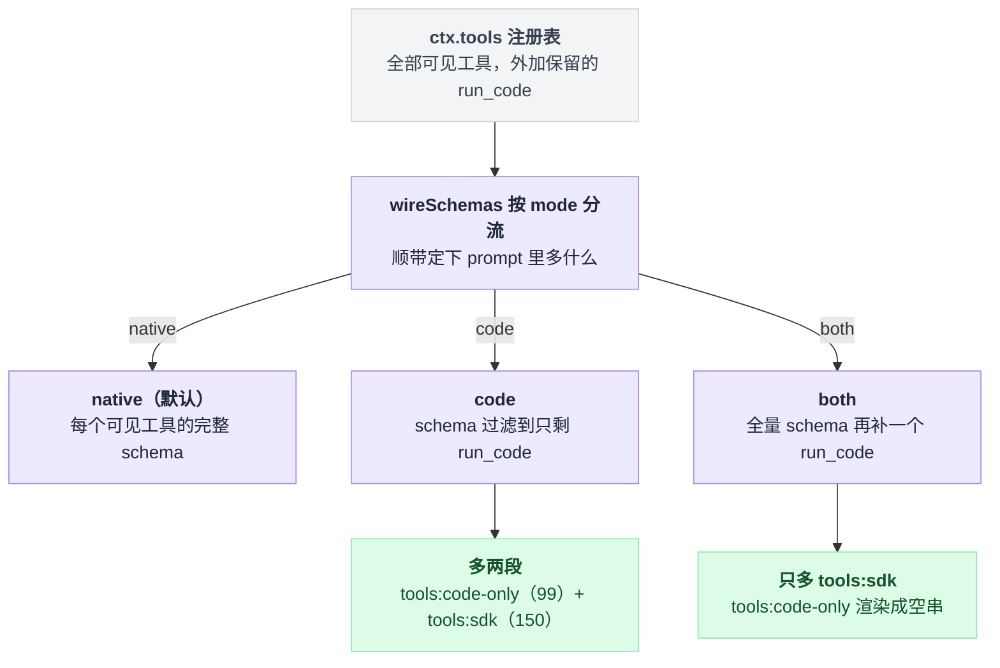
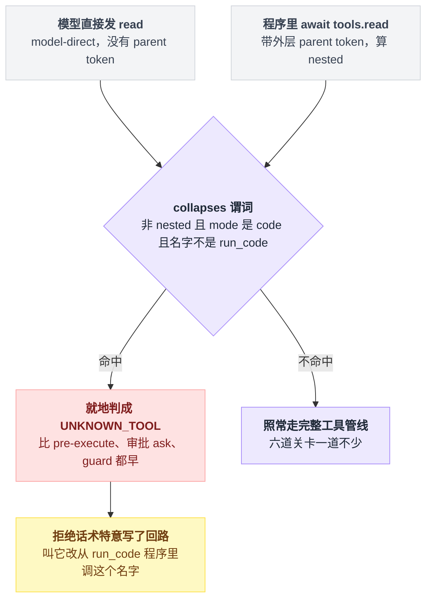
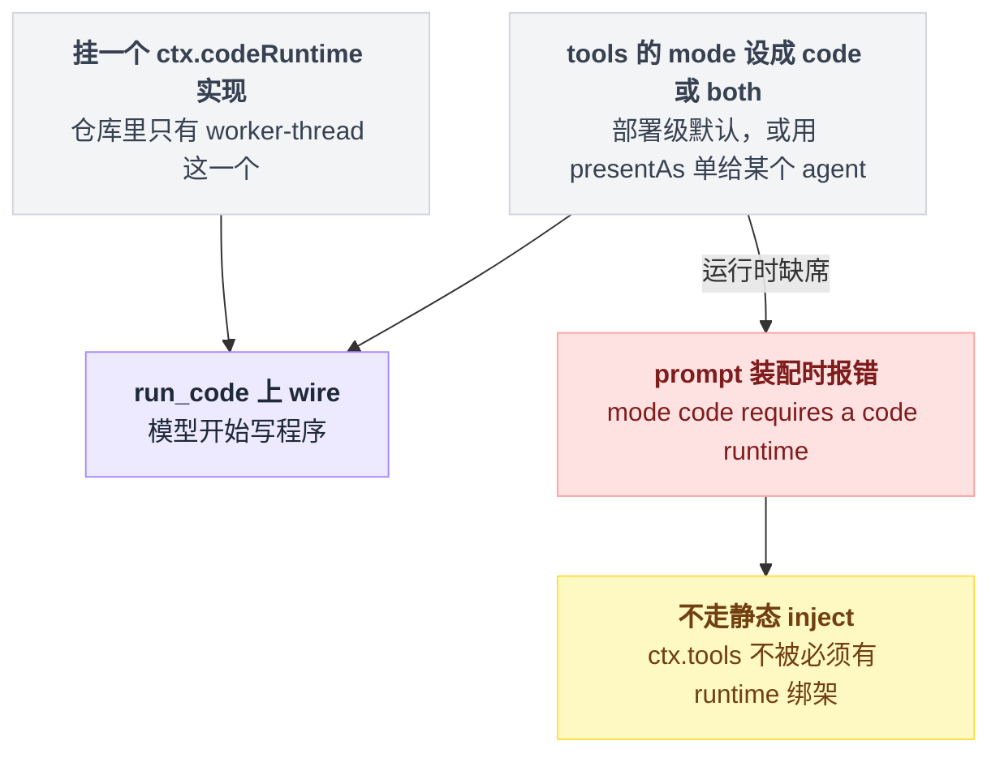
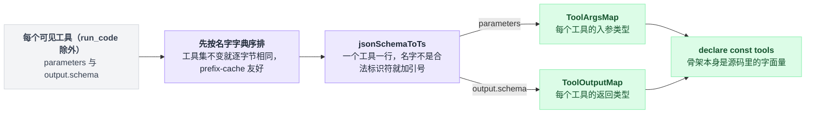
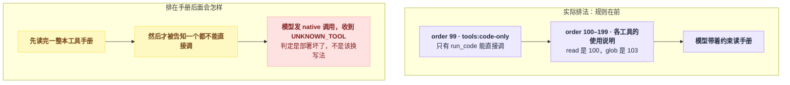
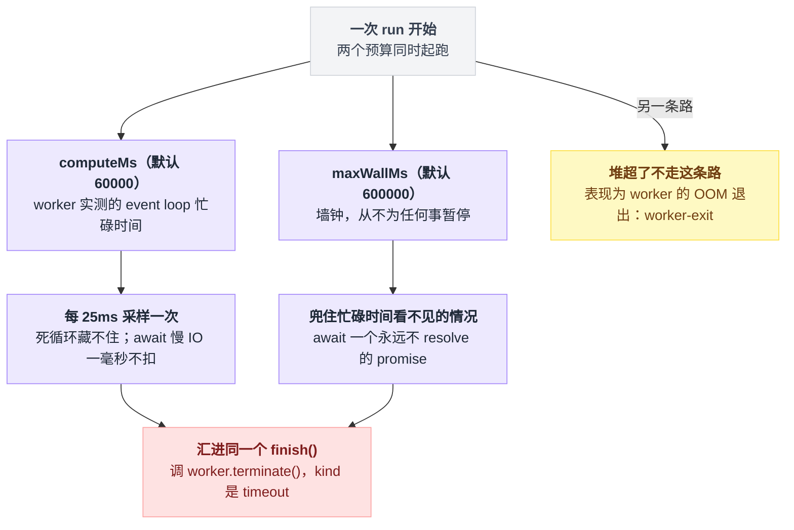
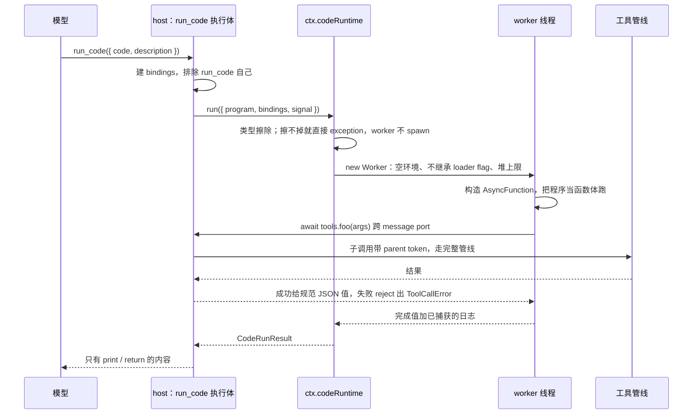
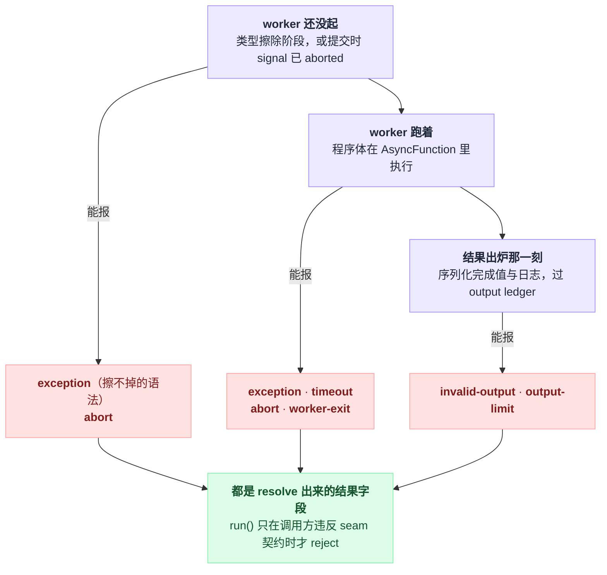

# 21 · Code Mode

> 基于 `deepseek-ai/deepseek-harness` v0.1.0-rc.5（commit `47f9438`），2026-08-14 核对。

前面二十章里，模型一直在做同一件事：报一个工具名，等结果回来，再报下一个。

这一章讲另一条路——模型不报工具名，它写一段程序，程序里 `await tools.glob(...)`、`await tools.read(...)`，跑完只把结论交回对话。dsh 管这条路叫 Code Mode，入口是一个叫 `run_code` 的保留工具。

你可能以为它的卖点是"少发几轮请求"。不是的——省下的大头根本不在来回次数上，在于那些中间结果从此不进模型上下文。开它也要付代价，本章最后有一张账。先看第一个画面。

---

## 三百次 read，只为换一个数字

你让 agent 统计 `**/*.ts` 里有多少行含 `TODO`。

默认的 native 模式下，模型一次只能发一个工具调用。`glob` 拿回三百个路径，然后是三百次 `read`，每次 read 的**整份文件内容**都作为 tool result 落进对话历史，最后模型自己数。

三百个来回，几十万 token，换一个整数。

code 模式下模型发的是一次 `run_code`，参数是一段程序：

```ts
const found = await tools.glob({ pattern: '**/*.ts' })
const files = await Promise.all(found.paths.map(path => tools.read({ file_path: path })))
const total = files.reduce((sum, file) => sum + file.lines.filter(line => line.text.includes('TODO')).length, 0)
console.log(`${found.paths.length} files, ${total} TODO lines`)
```

这段里的字段名不是我顺手编的，全是 dsh 生成给模型看的类型：

| 工具 | 入参 | 返回 |
|---|---|---|
| `glob` | `pattern`（必填）、`path`（可选） | `{ root: string, paths: string[] }` |
| `read` | `file_path`（必填）、`offset` / `limit` | `{ path, offset, lines: [{ number, text }], totalLines }` |

出处：`glob` 见 `packages/fs/tool-fs-search/src/glob.ts:317`–`:335`，`read` 见 `packages/fs/tool-fs/src/read.ts:79`–`:105`。

照抄之前得知道一条边界：`read` 一次最多返回 2000 行，这个 `READ_LIMIT` 既是默认值也是上限（`packages/fs/tool-fs/src/read.ts:16`），所以上面统计的其实是每个文件的前 2000 行。

真正的不变量只有一句，它就写在生成给模型的 SDK 指令里：**只有程序 `print` / `return` 出来的东西会回到对话**，中间那三百份文件内容一个字节都不进模型上下文（`packages/core/tools/src/ts-types.ts:257`）。

Code Mode 的全部卖点就是这一句：把"多轮工具调用"折叠成"一段程序加一个筛过的结果"。

---

## 三种模式，改的是模型手里那份工具清单

新问题来了：所谓"模式"，改的到底是什么东西？回答它要先立一个下文反复用到的词——**wire**，指这一轮请求真正发给模型 API 的那份工具列表。模型只能调它看得见的东西，wire 上没有的名字它连提都提不出来。

模式是工具注册表 `ctx.tools` 的一个配置项，类型在 `packages/core/tools/src/index.ts:651`，schema 和默认值在同文件 `:791`：

```ts
mode: z.union(['native', 'code', 'both'] as const).default('native'),
```

分流点只有一个函数，它同时决定两件事：这一轮往 wire 上放哪些 schema，以及 prompt 里多不多出那两段。



| | 模型 wire 上看到的工具 | prompt 里多出的段落 | 模型能直接调什么 |
|---|---|---|---|
| `native`（默认） | 每个可见工具的完整 schema | — | 所有可见工具 |
| `code` | **只有 `run_code`** | `tools:code-only`（order 99）+ `tools:sdk`（order 150） | **只有 `run_code`** |
| `both` | 所有工具 schema **加上** `run_code` | 只有 `tools:sdk`；`tools:code-only` 渲染成空串 | 全都能 |

两个 order 是常量：`COLLAPSE_SECTION_ORDER = 99`（`packages/core/tools/src/index.ts:51`）、`SDK_SECTION_ORDER = 150`（`packages/core/tools/src/code-mode.ts:23`）。

实现这张表的是 `wireSchemas()`（`packages/core/tools/src/index.ts:980`）：`code` 分支把 schema 列表 filter 到只剩 `run_code`（`:996`），`both` 分支返回全量再补一个 `run_code`（`:1000`）。

## `code` 不只是少给点 schema，它还收窄了执行面

这是我读源码时最没料到的一处。你可能以为 `code` 模式只是"prompt 里不写那些工具了"，模型要是硬发一个 `read` 调用，大不了照常执行。

不是的。判定长这样：

```
// 在 createExecution 阶段，比任何插件都早
if 不是 nested 且 mode 是 code 且 name 不是 run_code:
    就地判成 UNKNOWN_TOOL
    回一句“改从 run_code 程序里调这个名字”
    // pre-execute、审批 ask、guard 全都还没跑
else:
    照常走完整工具管线
```

也就是说，没有任何插件会看见这个注定失败的调用。折叠发生在 `packages/core/tools/src/index.ts:1364` 的 `createExecution` 阶段，判定点在 `:1381`，理由写在 `:1373`–`:1379` 的注释里，README 的同一句在 `packages/core/tools/README.md:120`。`UNKNOWN_TOOL` 这条路本身在 [13 章](./13-工具执行管线.md)讲过，这里只是提前触发它。

谓词就一行（`packages/core/tools/src/index.ts:1325`）：

```ts
return !nested && this.modeFor(scope) === 'code' && name !== RUN_CODE_NAME
```

`!nested` 是关键。程序内部发出的子调用带着外层执行的 `parent` token，不算 model-direct，所以照样能调所有工具——**收窄的只是模型直接说话的那一层**。

两条路进的是同一个判定，出的是两个结果：



拒绝信息特意写了回路（`packages/core/tools/src/index.ts:1441`）：

```
only `run_code` is callable directly — call `<name>` from inside a `run_code` program instead
```

之所以不能只回一句光秃秃的 `unknown tool`，是因为同一份 prompt 刚刚才声明过那个工具，模型读到"未知工具"会判定"这个部署坏了"，而不是"我该换个写法"（`packages/core/tools/src/index.ts:1432`–`:1435`）。

`both` 模式不加这条规则，因为 `both` 下 native 调用**确实**跑得通，写一条假规则比不写更糟（`packages/core/tools/src/index.ts:852`），渲染时的判断就一行三元表达式（`:861`）。

顺带一个很容易踩的坑：`code` 模式下 `systemPrompt.toolOrder` 里如果还留着 native 工具名，每次 prompt 装配都会直接失败——那些名字已经不在这个模式的 wire 校验集合里了。这是设计行为，不是 bug（`.agents/notes/implemented/feature/2026-06-15-code-mode.md:33`）。

---

## 怎么把它打开

要两样东西同时到位：一个非 native 的 `mode`，加一个挂上 `ctx.codeRuntime` 的运行时插件。少一样都不行。

少哪一样、什么时候炸，形状是这样：



**官方 bundle 已经帮你挂好了运行时。** `dsh-web-app` 和 `dsh-headless` 两个 bundle 的 patch 里都 insert 了 worker-thread 运行时，并且各留了一个环境变量开关：

```yaml
- id: tools
  config:
    mode: !!js process.env.DSH_TOOLS_MODE
```

出处：两处 insert 见 `packages/bundle/web-app/cordis.patch.yml:47`–`:49` 与 `packages/bundle/headless/cordis.patch.yml:22`–`:25`，开关见 `packages/bundle/web-app/cordis.patch.yml:35`–`:41`。

`dsh web` 是 `--profile web` 的别名子命令（`apps/cli/src/args.ts:156`），所以在 web / headless 这两个 profile 下最省事的开法就是一行：

```bash
DSH_TOOLS_MODE=code npx @deepseek-ai/dsh web
```

不设这个变量时值是 `undefined`，schema 兜回默认的 `native`。

但别把它写进长期脚本——源码注释明说这是 **TEMPORARY workaround**，等 Web UI 支持按会话选模式就会被移除（`packages/bundle/web-app/cordis.patch.yml:37`）。

**自己写 patch** 的话（比如家目录级的 `$DSH_HOME/cordis.patch.yml`，用户 patch 层的路径见 `docs/user/develop/basic/publish.md:118`）：

```yaml
- id: tools
  config:
    mode: code
    maxParallelSubCalls: 4

- insert:
    - id: code-runtime
      name: '@deepseek-ai/dsh-code-runtime-worker-thread'
      config:
        computeMs: 60000
        maxWallMs: 600000
        maxOutputBytes: 67108864
        maxOldGenerationSizeMb: 512
```

上面那四个字段就是 worker-thread 运行时的全部可调项，写的值即默认值（`packages/code-runtime/code-runtime-worker-thread/src/index.ts:239`–`:244`；README 干脆写了 "there are no other tunables"，`packages/code-runtime/code-runtime-worker-thread/README.md:19`）。

如果你的 profile 已经 insert 过 `code-runtime`——web 和 headless 都是——那就**只留 `- id: tools` 那一段**。`insert` 的语义是往配置里新增行，不是幂等覆盖（`docs/architecture.md:27`）。

还要留意 patch 层是整体替换语义：`- id: tools` 的 `config` 会**替换**上一层的 config，不是深合并（`docs/user/develop/basic/publish.md:123`），四层怎么叠见 [03 章](./03-配置的四层结构.md)。

**只想给某一个 agent 开** code 模式也行。`mode` 是部署级默认值，单个 agent 可以自己声明，走 `ctx.tools.presentAs(mode)`（`packages/core/tools/src/index.ts:946`），或者在 agent preset 里挂一行 `@deepseek-ai/dsh-agent-tool-presentation`（这行的 `mode` 字段必填、没有默认值，`packages/core/agent-tool-presentation/src/index.ts:50`–`:52`）。

解析规则是链上最近的 scope 胜出（`packages/core/tools/src/index.ts:900`），同一个 scope 只能声明一次，第二次直接抛错——"模型看到哪种形态"有两个答案是矛盾，不是覆盖（`packages/core/tools/src/index.ts:956`）。

这行插件有个值得学的小手法：它不把 `codeRuntime` 写进静态 `inject`，而是在 `apply` 里对非 native 模式做 `ctx.inject(['codeRuntime'], ...)`（`packages/core/agent-tool-presentation/src/index.ts:35`、`:69`）。这样部署里没挂运行时时，这条 row 停在 pending，由 `dsh-agent-presets` 点名报错，而不是拖到第一次请求才炸（`:67`–`:68`）。

**忘了挂运行时**会看到这个：

```
dsh-tools: mode "code" requires a code runtime — load a ctx.codeRuntime
implementation (e.g. @deepseek-ai/dsh-code-runtime-worker-thread) or set
tools mode to "native"
```

出处 `packages/core/tools/src/index.ts:1022`。注意它是在 prompt 装配时跑的，不是启动时——因为 `ctx.tools` 不能被"必须有 code runtime"绑架，同文件 `:1003`–`:1007` 的注释解释了为什么不走静态 inject。

---

## 模型在 code 模式下看到的三样东西

先给张地图：

| # | 是什么 | 出处 |
|---|---|---|
| 1 | `run_code` 工具本身 | `packages/core/tools/src/code-mode.ts:305`–`:311` |
| 2 | 一段固定的使用说明，section 名 `tools:sdk`，order 150 | `packages/core/tools/src/ts-types.ts:250`–`:259` |
| 3 | 现生成的类型声明 | `packages/core/tools/src/ts-types.ts:284`–`:291` |

**第一样是 `run_code` 工具本身。** 两个参数都必填：`code` 和 `description`。`description` 必填是因为 UI 拿它当这次调用的标题（`packages/core/tools/src/code-mode.ts:643`–`:649`）。

工具描述按运行时语言分派，TypeScript flavor 在 `packages/core/tools/src/code-mode.ts:46`，Python flavor 在 `:61`，选哪个是在 schema 投影那一刻现读 `ctx.codeRuntime.language` 决定的（`packages/core/tools/src/code-mode.ts:113`、`:659`）。

`run_code` 这个名字是保留的：不管配的哪种 mode，你都不能注册、遮蔽、restrict 或移除它（`packages/core/tools/README.md:16`）。生成后的完整 schema 在 `docs/tool-catalog.md:121`。

**第二样是一段固定的使用说明**，就四条要点：

| 要点 | TypeScript 版 | Python 版差异 |
|---|---|---|
| 怎么调 | `await tools.name(args)`；怪名字写成 `tools["my-tool"](args)`；参数必须是无损 JSON | 同 |
| 失败怎么办 | 失败的工具调用 reject 出 `ToolCallError`，带 `toolName` 和 `message`，可以 `try/catch` 之后继续 | 同 |
| 并发 | 独立只读调用可以放进 `Promise.all` 并发；会改状态的调用独占执行、按提交顺序 | `Promise.all` 换成 `asyncio.gather` |
| 什么会回来 | 只有 `print` / `return` 的内容会回来，中间结果永远不进对话 | `console.log` 换成 `print(...)` |

TypeScript 版原文在 `packages/core/tools/src/ts-types.ts:250`–`:259`，Python 版在 `packages/core/tools/src/py-types.ts:734`–`:743`。

Python 那版多一条 TypeScript 没有的警告：`TypedDict` 类**在运行期不存在**，只能用 plain `dict` 传参，写 `FooArgs(field=1)` 会 `NameError`（`packages/core/tools/src/py-types.ts:736`）。

**第三样是现生成的类型声明。** 固定骨架是源码里的字面量（`packages/core/tools/src/ts-types.ts:284`–`:291`）：

```ts
type JsonValue = null | boolean | number | string | JsonValue[] | { [key: string]: JsonValue }

type ToolName = keyof ToolOutputMap

declare class ToolCallError extends Error {
  readonly name: "ToolCallError";
  readonly toolName: ToolName;
}

declare const tools: {
  [K in ToolName]: (args: ToolArgsMap[K]) => Promise<ToolOutputMap[K]>;
}
```

骨架里那两个 Map 是现填的，原料就是每个工具自己声明的 schema：



`ToolArgsMap` 和 `ToolOutputMap` 的成员由 `jsonSchemaToTs` 从每个工具的 `parameters` 和 `output.schema` 现生成，一个工具一行，名字不是合法标识符就加引号，`run_code` 自己被排除在外。对应 `packages/core/tools/src/index.ts:1239`–`:1253`（取值）、`packages/core/tools/src/ts-types.ts:277`–`:280`（渲染）、`packages/core/tools/src/ts-types.ts:21`–`:24`（加引号）、`packages/core/tools/src/index.ts:1241`（排除自己）。

[12 章](./12-写一个工具.md)里说 `output.schema` 只在 Code Mode 下才有人读，指的就是这里——native 模式下它一辈子也不会被投影出去。

工具按名字**字典序**排，保证工具集不变时逐字节相同（`packages/core/tools/src/ts-types.ts:264`–`:268`、`:274`），官方把这条描述为 prefix-cache 友好（`packages/core/tools/README.md:122`）。

`code` 模式还会多出一段 `tools:code-only`（order 99），原文是（`packages/core/tools/src/index.ts:58`）：

> `run_code` is the only tool you can call directly — a tool call naming any other tool fails. Reach every tool the SDK declares below from inside the program.

它排在 99 而不是别的数字是有讲究的。每个工具插件都会注册自己那段"怎么用我"的说明，落在 order 100–199 这一带（`read` 是 100、`glob` 是 103）。规则要是排在它们后面，模型就得先读完一整本工具手册，然后才被告知"这些你一个都不能直接调"（`packages/core/tools/src/index.ts:843`–`:850`）。

两种排法下，模型的阅读顺序差在这里：



---

## 程序跑在哪：一个用完就死的 worker

`ctx.codeRuntime` 是个抽象 seam——dsh 把能力的接口定义和具体后端拆成两个包，接口包只说做什么，不说怎么做（`packages/code-runtime/code-runtime/src/index.ts:102`）。

接口只有三个成员：`run(request)`（`:134`）、`language`（`:111`）、`isolation`（`:119`）。仓库里唯一发布的后端是 `@deepseek-ai/dsh-code-runtime-worker-thread`，它报 `language = 'typescript'`、`isolation = 'worker-thread'`（`packages/code-runtime/code-runtime-worker-thread/src/index.ts:246`–`:247`）。

一次 `run()` 走这么四步：

```
run(request)
  ├─ 类型擦除（host 侧，node:module 的 stripTypeScriptTypes）
  ├─ new Worker(WORKER_PATH, { env: {}, execArgv: [], resourceLimits, stdout:true, stderr:true })
  ├─ worker 内：new AsyncFunction('tools', 'ToolCallError', 'console', "'use strict';\n" + code)
  └─ 每个 tools.xxx() 调用 → message port → host 侧回到工具管线
```

第一步就可能提前结束：擦不掉的语法（`enum`、namespace、纯语法错误）直接返回 `kind: 'exception'`，worker 根本不 spawn（`packages/code-runtime/code-runtime-worker-thread/src/index.ts:302`–`:308`）。

spawn 那行的三个参数分别是空环境、不继承 loader flag、堆上限（`:378`–`:393`）。

传进 AsyncFunction 的 `console` 不是 Node 全量 console，只是个五方法 shim，`log` / `info` / `warn` / `error` / `debug`（`packages/code-runtime/code-runtime-worker-thread/README.md:52`），构造点在 `packages/code-runtime/code-runtime-worker-thread/src/bootstrap.ts:406`–`:411`。

程序是作为 async function 的**函数体**执行的，这就是 top-level `await` 和 `return` 能用的原因。

### 隔离到底是什么级别

看到 worker、空环境、堆上限这一串词，最自然的推断是"这是个安全沙箱"。不是的，这一节最好一个字都别跳过。官方自己写得很直白（`packages/code-runtime/code-runtime-worker-thread/README.md:5`）：

> **Containment, not a security boundary**: trust posture is bash-equivalent by design

Agent Note 说得更细（`.agents/notes/implemented/feature/2026-06-15-code-mode.md:84`）：模型代码**可以够到 Node API**，权限跟 bash 工具相当；`worker.terminate()` 只结束线程，**不杀它 spawn 出去的 OS 进程**。

之所以敢这么设计，是因为这套 harness 本来就带 `dsh-bash-local`，那东西的环境权限更大（同一份 note 的 `:23`）。

所以别把 `isolation: 'worker-thread'` 当安全承诺读，这个字段自己的文档就写着（`packages/code-runtime/code-runtime/README.md:15`）：

> A label for deployments and diagnostics, **not a security claim**.

要硬边界得等 container 后端。`'process'` / `'container'` 目前只是声明过的取值，仓库里没有实现（`packages/code-runtime/code-runtime/README.md:37`）。

worker 实际给到的是这几样：独立 isolate、空环境（`env: {}`，比 spawned command 的洗环境规则还狠，`packages/code-runtime/code-runtime-worker-thread/README.md:30`）、堆上限，以及一个能杀死同步死循环的硬终止。

### 两个预算，各管各的

```
每 25ms 采样一次:
    busy = eventLoopUtilization() 测到的 worker 忙碌时间   // await 慢 IO 的时间不计进来
    if busy > computeMs:              finish('timeout', 'compute budget exhausted')
    if 墙钟 - 起跑 > maxWallMs:        finish('timeout', 'wall-clock ceiling reached')

finish(...) → worker.terminate()
```

`computeMs`（默认 60000）计的是 worker **实测**的 event loop 忙碌时间，靠 `eventLoopUtilization()` 每 25ms 采样一次。好处是死循环藏不住，副作用是等慢工具的程序**不计时**——你的程序 await 十分钟磁盘 IO，一毫秒都不扣。

`maxWallMs`（默认 600000）计的是墙钟，从不为任何事暂停。它兜的正是忙碌时间看不见的那种情况：await 一个永远不 resolve 的 promise，event loop 空闲得很，但这次 run 已经废了。

两个预算同时起跑，各自盯着一种看不见的东西，第三条路根本不归它们管：



两个到期分别在 `packages/code-runtime/code-runtime-worker-thread/src/index.ts:540`（消息是 `compute budget exhausted`）和 `:544`（`wall-clock ceiling reached`），最终都汇进同一个 `finish()`，由它调 `worker.terminate()`（`:424`、`:436`）。

25ms 这个采样间隔是内部常量、故意不做成配置，代价是 `computeMs` 到期最多晚一个采样周期（`packages/code-runtime/code-runtime-worker-thread/src/index.ts:57`–`:63`）。

`maxWallMs` 在加载时就检查不超过 `MAX_TIMER_DELAY_MS`（= `2147483647`，`packages/util/timeout/src/index.ts:25`），因为 `setTimeout` 会把更大的延迟直接压成 1ms，一个 25 天的上限反而会让 run 立刻超时（`packages/code-runtime/code-runtime-worker-thread/src/index.ts:264`–`:268`）。

堆溢出不走 timeout 这条路，它表现为 worker 的 OOM 退出，即 `kind: 'worker-exit'`（`packages/code-runtime/code-runtime-worker-thread/README.md:27`）。

### 一次 run 一个全新 worker，不做池化

这是明确的设计选择，不是没来得及优化：程序的世界随 worker 一起死，没有跨 run 状态可记，状态串味在结构上不可能发生，每次 run 都能只靠会话日志重建（`packages/code-runtime/code-runtime-worker-thread/README.md:23`）。

代价是每次 `run_code` 都要付一次 worker 冷启动。

持久 REPL kernel 被记为未来工作（`packages/code-runtime/code-runtime/README.md:36`），MVP 阶段明确拒绝，理由是跨调用状态对日志不可见（`packages/core/tools/README.md:198`）。

### Python 呢

注册表里确实有 Python 的 SDK renderer，任何报 `language: 'python'` 的运行时都能驱动它（`packages/core/tools/README.md:16`）。

但**仓库里没有 Python 后端包**——`packages/code-runtime/` 下只有 `code-runtime` 和 `code-runtime-worker-thread` 两个包，seam 的文档也写着 "only `'typescript'` has a published backend"（`packages/code-runtime/code-runtime/src/index.ts:109`）。

真挂上一个语言没有 renderer 的运行时，prompt 装配会大声失败（`packages/core/tools/src/index.ts:1024`–`:1026`）。

---

## 一次 `run_code` 内部到底发生了什么

```
模型发出 run_code({ code, description })
        │
        ├─ 建 bindings：遍历「调用方 agent 可见」的工具集，排除 run_code 自己
        │     functions = Object.create(null)
        │     bindings = [{ global: 'tools', functions,
        │                   errorClass: { name:'ToolCallError', memberNameProperty:'toolName' } }]
        │
        └─ runtime.run({ program, bindings, signal })
              │
              └─ 程序里每一次 await tools.foo(args)
                    ├─ args 做无损 JSON 快照
                    ├─ subCallId = `<外层callId>:code:<n>`
                    ├─ append  tool/code-dispatch-start
                    ├─ 走【完整】工具管线：pre-execute → guard → execute → post-execute → result
                    ├─ append  tool/code-dispatch
                    └─ 成功 → 返回规范 JSON 值；失败 → 程序里 reject 出 ToolCallError(toolName, message)
```

几处细节值得展开。

`functions` 用 `Object.create(null)` 建，是为了让名叫 `__proto__` 的工具也只是个普通 key。

参数快照要求无损 JSON，`undefined` / `BigInt` / 循环引用 / 稀疏数组 / `-0` 会让这一次调用被拒。`n` 按提交顺序编号。

`tool/code-dispatch-start` 只在真正开始时才写，排队里被放弃的调用不写；结算那条 `tool/code-dispatch` 带完整的 `content` 和 `isError`。

代码位置：bindings 构造在 `packages/core/tools/src/code-mode.ts:601`–`:620`（排除 `run_code` 在 `:607`），子调用 id 在 `:470`，两个日志事件分别在 `:535`（start）和 `:510`（settle），快照与管线的成文契约在 `packages/core/tools/README.md:123`。

失败那一环分两半：host 侧只把结果 reject 成一个带 message 的普通 Error（`packages/core/tools/src/code-mode.ts:589`–`:592`），worker 侧再把它实例化成程序可见的 `ToolCallError`（`packages/code-runtime/code-runtime-worker-thread/src/bootstrap.ts:246`–`:259`）。

把这棵树摊到四个参与方身上，能看清子调用是怎么跨出 worker 又跨回 host 的：



有三条性质值得单独记住。

**子调用不绕过任何策略。** 它走的是和 native 调用完全相同的管线，[13 章](./13-工具执行管线.md)讲的六道关卡、[18 章](./18-沙箱审批与权限.md)讲的审批与沙箱，在 `run_code` 程序里一条都不少。Code Mode 不是权限旁路。

**并发沿用 native 的调度契约。**

```
按提交顺序处理程序发出的子调用:
    if 这次调用声明了并发安全:
        丢进池子，最多重叠 maxParallelSubCalls 个   // 默认 10；设成 1 就退回严格串行
    else:
        清空池子 → 独占执行 → barrier 一直持到它的 post-execute 完成
```

默认值 10 在 `packages/core/tools/src/index.ts:792`，独占那段规矩写在 `packages/core/tools/src/code-mode.ts:343`–`:357` 的长注释里。

回头看开篇那个例子：`glob` 没声明并发安全所以独占，`read` 声明了 `isConcurrencySafe: () => true`（`packages/fs/tool-fs/src/read.ts:135`）所以那三百次能并发。

**结算讲纪律。** run 一旦结束——正常完成、超时、外层取消都算——bridge 会 abort 所有在飞的子调用并**排空队列之后才返回**，保证每一条 `tool/code-dispatch` 都落在这个还开着的 turn 里（`packages/core/tools/src/code-mode.ts:623`–`:629`）。

---

## 失败分成六类，去哪查

运行时把失败当作**结果里的一个字段**返回，而不是 reject。`run()` 只在调用方违反 seam 契约时才 reject（`packages/code-runtime/code-runtime/src/index.ts:96`–`:97`；README 举的例子是"disposed 之后再提交 run"，`packages/code-runtime/code-runtime/README.md:13`）。

六种 kind 定义在 `packages/code-runtime/code-runtime/src/types.ts:105`。这六个不是一条线上的深浅，是在三个不同位置报出来的：



| kind | 含义 | 常见触发 |
|---|---|---|
| `exception` | 程序抛了，或没通过解析 / 类型擦除 | 语法错误、写了 `enum` 或 namespace |
| `timeout` | 某个实现自己的预算到期，message 会说是哪个 | `compute budget exhausted` / `wall-clock ceiling reached` |
| `abort` | `CodeRunRequest.signal` 触发 | 用户取消、外层结算 |
| `worker-exit` | 执行基座自己死了且没结算 | 堆超了 `maxOldGenerationSizeMb` |
| `invalid-output` | `return` 的值不是无损 JSON | 返回了 `BigInt`、函数、循环引用 |
| `output-limit` | 日志 + 完成值 / 失败信息的序列化超了 `maxOutputBytes` | 打印了整个仓库 |

这六类是**正交结果**，类型注释的原话是：预算到期不是异常，abort 不是 timeout，基座猝死两者都不是（`packages/code-runtime/code-runtime/src/types.ts:92`–`:94`）。

模型侧看到的文本长这样：`Error: code run failed (<kind>): <message>`，后面按情况跟一段 `Captured output:` 和捕获到的行（`packages/core/tools/README.md:180`，拼装在 `packages/core/tools/src/code-mode.ts:631`–`:633`）。抛出点是 `CodeRunFailedError`，`code: 'CODE_RUN_FAILED'`（`packages/core/tools/src/code-mode.ts:139`–`:143`）。

排查 CodeMode 问题时最有用的一条是：**日志按发出顺序过 port，不用等程序结束。** console / stdout / stderr 的文本一产生就跨 port，所以一个被 kill 掉的程序**仍然能看到它已经打印的东西**（`packages/code-runtime/code-runtime-worker-thread/README.md:29`）。

但别把这理解成"能实时看日志"——seam 层的 `run()` 是一次性的，`logs` 只挂在 resolve 出来的 `CodeRunResult` 上，没有流式日志或进度 API（`packages/code-runtime/code-runtime/README.md:35`）。

子调用去哪查？`deriveMessages()` 不投影 `tool/code-dispatch*` 这两个事件，所以它们不进模型上下文，但**它们在会话日志里**，而且带的是 `tool/result` 那套 `content` + `isError` 词汇，UI 就用同一条渲染路径画子调用（`packages/core/tools/src/types.ts:41`–`:56`）。

一句话：模型只看见你 print 的那一行，你自己能翻出完整的三百次 read。

---

## 这笔账该怎么算

先泼一盆冷水：**Code Mode 不保证省 token。**

官方原话是，它拿"每个工具的 schema"换"生成的 SDK 文本加一个 transport schema"，从不承诺普遍降低（`packages/core/tools/README.md:170`）；`both` 模式更是两份都发，只多不少（`packages/core/tools/src/index.ts:1000`）。省 token 的真正来源是中间工具结果不进上下文——省的是**结果**，不是 schema（`packages/core/tools/src/ts-types.ts:257`）。

延迟这边是净支出：每次 `run_code` 多一次 worker 冷启动（没有池化，`packages/code-runtime/code-runtime-worker-thread/README.md:23`）加一次 host 侧类型擦除。

KV cache 这边还算体面：SDK 文本按字典序确定性生成，工具集不变就逐字节稳定，但改 mode 或改可见工具集会从第一个变化的 token 起全部失效（`packages/core/tools/README.md:174`）。

可审计性是一半一半。好的一面是每次子调用都有 `tool/code-dispatch-start` / `tool/code-dispatch` 一对事件，带完整参数与结果（`packages/core/tools/src/types.ts:11`–`:23`）。坏的一面是中间 binding 值**无法从会话回放重建**，而且没有字节上限，可能吃光进程或 worker 内存（`packages/core/tools/README.md:197`）。

剩下四条都是排查成本：

| 成本 | 具体表现 | 出处 |
|---|---|---|
| 错误定位多一层 | 工具报错先变成程序里的 `ToolCallError`，可能被模型自己的 `try/catch` 吞掉，最后只剩它 print 出来的东西 | `packages/code-runtime/code-runtime-worker-thread/src/bootstrap.ts:258`–`:259` |
| 副作用不回滚 | 程序中途失败时，已经发生的工具副作用不回滚 | `packages/core/tools/README.md:118` |
| 孤儿进程 | 程序 spawn 出去的 OS 进程在 `terminate()` 之后继续存活 | `packages/code-runtime/code-runtime-worker-thread/README.md:49` |
| `toolOrder` 那个坑 | `code` 下 `toolOrder` 里留着 native 名字会让每次装配失败 | `packages/core/tools/README.md:16` |

一个务实的判断。

**值得开**：工作负载里有大量"读一堆东西→只要一个汇总"的形状，批量搜索、跨文件统计、批量重命名都是；或者你已经在为 tool result 的体积做压缩。

**先别开**：多租户或不可信输入场景，隔离级别不够；工具副作用重、需要逐步审批的流程，模型会把一整串操作塞进一个程序，人类审的粒度直接变粗；对首 token 延迟敏感的交互场景。

**想两头要**：用 `both` 让模型自己挑，代价是 prompt 里两套都在；或者用 `presentAs` / agent preset 只给特定子 agent 开。

> 想知道这一点上 Pi / Codex / LangChain 怎么做，见 [五个 agent 系统源码解剖](../2026-08_五个agent系统源码解剖/00-总览与阅读指南.md)。

---

## 找个最小的场景跑一遍

仓库自带一个完整的 code 模式 overlay：`examples/acp-agent/code-mode.cordis.yml`，一共 28 行。核心就两处，把 app 的 `tools.mode` 设成 `code`（`:20`–`:21`），再 insert 运行时（`:26`–`:28`）：

```yaml
      - id: acp-agent
        name: '@deepseek-ai/dsh-acp-demo'
        config:
          tools:
            mode: code
      - insert:
          - id: code-runtime
            name: '@deepseek-ai/dsh-code-runtime-worker-thread'
```

这是节选。整个文件是一个 `cordis-plugin-include` patch，因为 config patch 是整体替换，所以 `provider` / `model` / `persona` 这些基础字段都得原样重述一遍——文件第 4–5 行的注释就是这么解释的。

跑它的命令在 `package.json:137`：

```bash
pnpm run demo:code-mode
```

它等价于 `node --import tsx packages/examples/acp-demo/src/bin.ts --config examples/acp-agent/code-mode.cordis.yml`（`scripts/demo-code-mode.mjs:9`–`:15`），需要 DeepSeek API key（同文件 `:1`）。

同目录还有 `both-mode.cordis.yml`（跟 code 版逐行 diff 只差注释和 `mode: both` 一行）和 `code-mode-workspace-context.cordis.yml`。

跑起来该看到什么：模型的第一条工具调用是 `run_code`；UI 上这一行的标题是模型自己写的 `description`，程序体作为 `rawInput` 挂在这次调用上（`packages/core/tools/src/code-mode.ts:645`–`:650`）；会话日志里能翻到每个 `tools.xxx()` 对应的 `tool/code-dispatch-start` / `tool/code-dispatch` 事件对；模型上下文里只有程序 print 和 return 的内容。

程序既没 print 也没 return 时，模型收到的是字面量 `(run_code completed with no output)`（`packages/core/tools/src/code-mode.ts:325`）。

---

## 把这几个画面串起来

**Code Mode 换掉的不是工具，是模型说话的粒度。** 这句结论现在应该能从前面的画面一条条重新推出来——推不出来的，回去重读那一节：

- 它为什么省 token？不是因为少发几轮请求，是因为**只有程序 print / return 的东西会回到对话**——三百份文件内容留在会话日志里给你查，不占模型一个 token；
- 模型为什么在 `code` 模式下连 `read` 都发不出去？因为 wire 上只剩 `run_code`，而且就算硬发，`createExecution` 在任何插件看见之前就把它判成 UNKNOWN_TOOL——收的是 wire 和执行面两层，不是一层；
- 它为什么不是权限旁路？因为程序里每次 `tools.xxx()` 都带着 parent token 走完整工具管线，六道关卡、审批、沙箱一条不少；
- `isolation: 'worker-thread'` 为什么不能当安全承诺读？因为它是 containment——模型代码够得到 Node API，信任姿态按 bash 等价设计，`terminate()` 也杀不掉程序 spawn 出去的 OS 进程；
- 它为什么不保证普遍省 token？因为拿工具 schema 换的是 SDK 文本，真正省下的是中间**结果**——工作负载不是"读一堆→只要一个汇总"的形状，这笔账就算不平。

代价始终是那三样：一次 worker 冷启动、一层多出来的错误包装，以及一个"containment, not a security boundary"级别的隔离。

---
