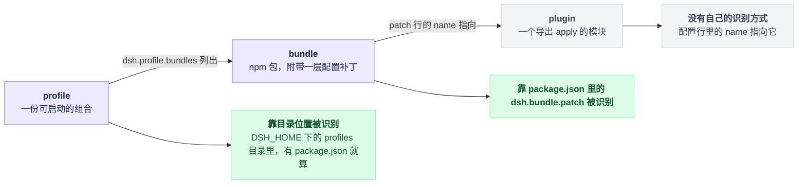
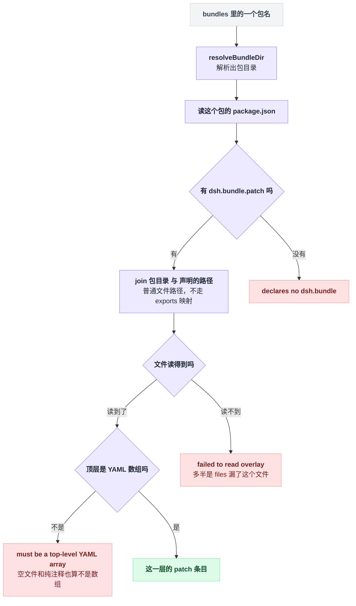
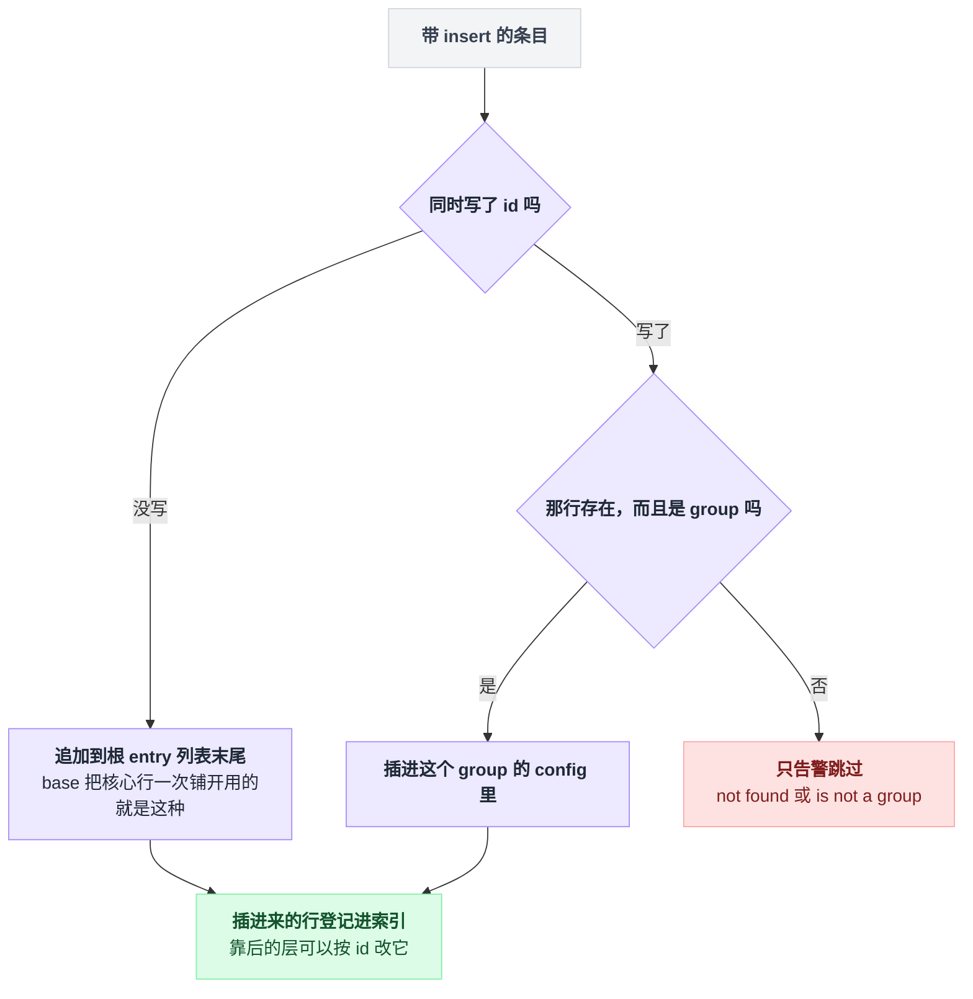
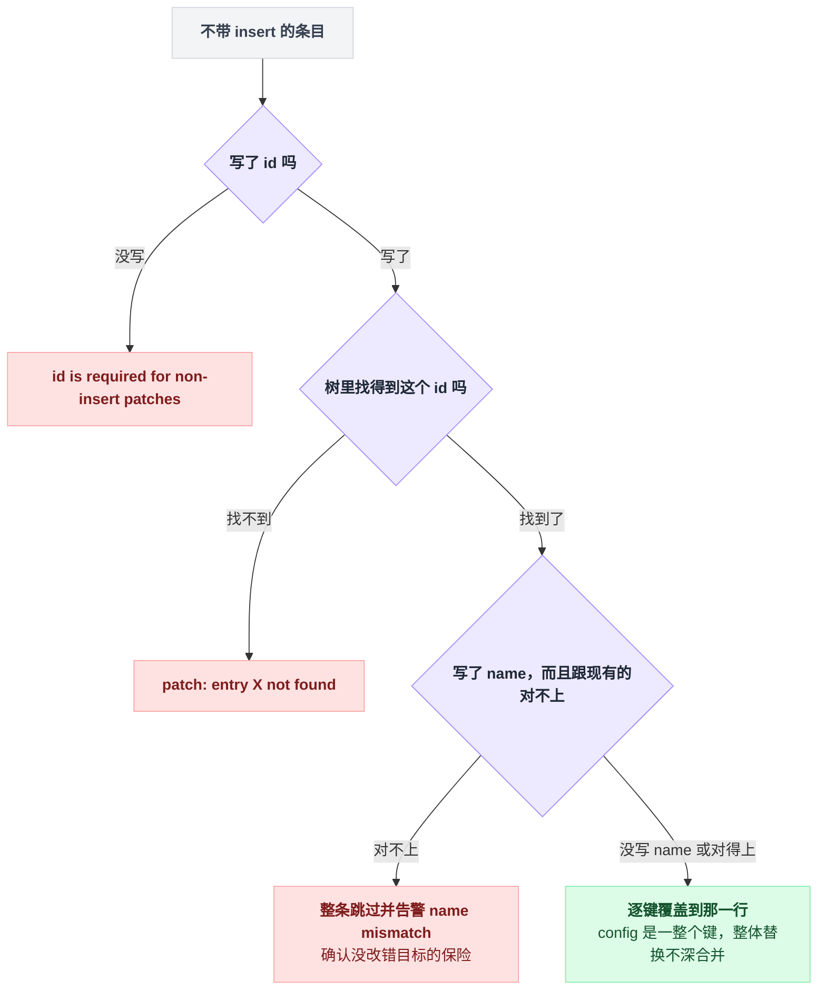
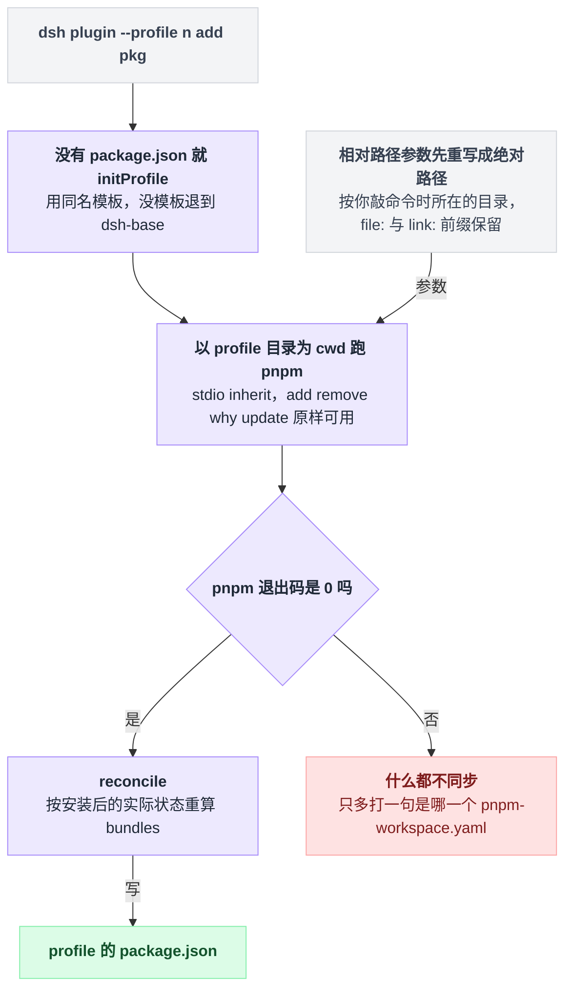
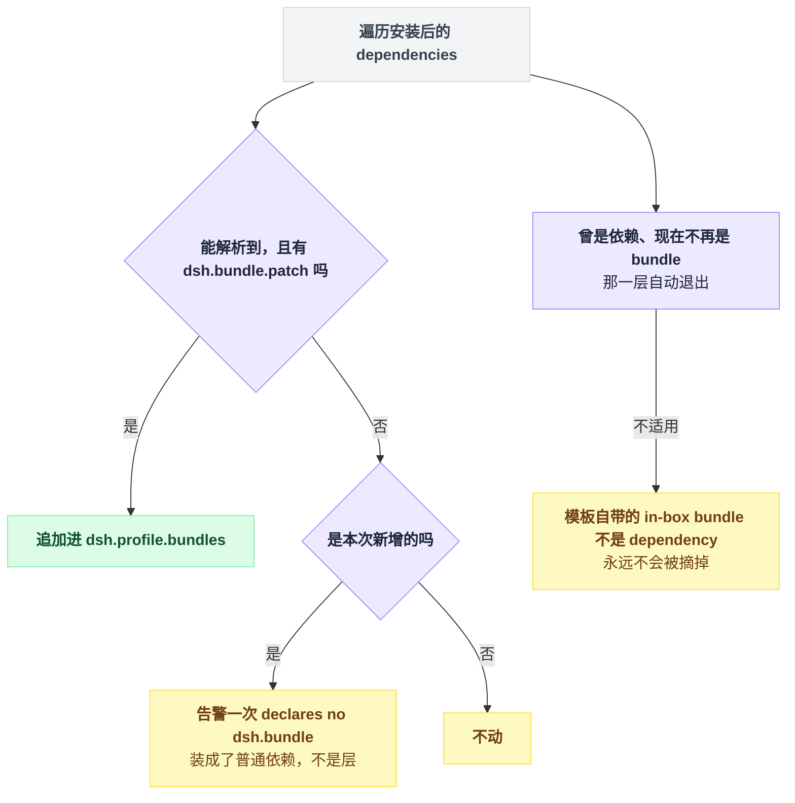
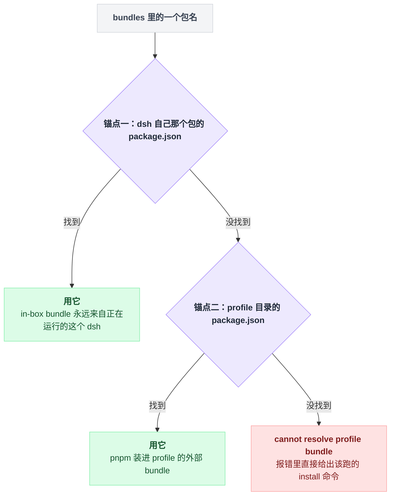

# 22 · 做一个 bundle 和 profile

> 基于 `deepseek-ai/deepseek-harness` v0.1.0-rc.5（commit `47f9438`），2026-08-14 核对。这是动手章：要敲的命令、预期输出和目录结构留在正文；成篇的模板收在文末[附录](#附录可以照抄的模板)，出处一律收在[脚注](#出处)，点角标可跳转。

到目前为止你写的插件只有你自己能跑。你可能觉得发布很简单：把那个 `.ts` 文件发给别人，再让对方照抄你那行挂载配置。

不是的。那行配置里写着一个**你硬盘上的绝对路径**，换台机器就断了。对方就算拿到文件，还得知道该放进哪个目录、改成什么路径——这不叫发布，叫口口相传。

这一章从头攒一个能发布的组合，把那个绝对路径消掉，让别人 `dsh plugin --profile <name> add` 一句话就装上。

配置的四层叠加（bundle → profile → home → `--patch`）在 [03 章](./03-配置的四层结构.md) 讲过原理，这里是它的实践面：怎么把自己塞进第一层。

---

## bundle 是你写的，profile 是用户启动的

动手之前先把三个最容易混的词钉死，后面每一节都建立在它们的分工上。

官方教程那句话说得很干脆：bundle 是你写的、profile 是用户启动的，**Nothing is both**[^1]。

三者的关系是一条指向链：profile 列出 bundle，bundle 的 patch 行指向 plugin；而它们各自被系统认出来的方式完全不同。



| | 是什么 | 靠什么被识别 | 住在哪 |
|---|---|---|---|
| **plugin** | 一个导出 `apply` 的模块 | 无（配置行里的 `name` 指向它） | 任意路径 / npm 包内 |
| **bundle** | 一个 npm 包，附带一层配置补丁 | `package.json` 里有 `dsh.bundle.patch` | npm / git / 本地目录 |
| **profile** | 一份可启动的组合 | 目录位置 + 目录里有 `package.json`；`dsh.profile.bundles` 决定它组合哪些 bundle | `$DSH_HOME/profiles/<name>/` |

这张表里最值得盯住的一格是"识别方式"那列：**bundle 的身份只系在 `dsh.bundle.patch` 一个字段上**[^2]。整章的所有机制——加载、安装、同步、报错——最后都能追回这一个字段。

profile 那一格的门槛比想象中低。profile 加载器只要求目录里有 `package.json`，`dsh` 段整个缺失也不报错，bundles 按空列表处理[^3]。手写一个 profile manifest 是完全可以的。

代码里这两份 manifest 是两个独立接口，挂在同一个 `dsh` 键下：bundle 那份只有一个字段——patch 文件的相对路径；profile 那份也只有一个字段——可选的 bundles 名单[^4]。

这里有个措辞上的微妙差异值得留意。源码注释写的是 "A manifest may declare both roles"，文档写的却是 "Nothing is both"。

两句话不矛盾——类型上允许，实践里不这么干。dsh 自带的三个 bundle 都只声明 bundle 一侧的身份，而仓库的 bundle 目录下确实也就 base、web-app、headless 三个包，没有第四个[^5]。

---

## 起点是一个绝对路径

最原始的形态是写一个 `.ts`，拿 `--patch` 挂进去。官方第一课就是这么开场的[^6]：

```yaml
- insert:
    - id: hello
      name: '/absolute/path/to/deepseek-harness/scratch-plugin/src/my-plugin.ts'
```

```sh
pnpm dsh web --patch ./scratch-plugin/cordis.yml
```

（`pnpm dsh` 是在仓库源码里的跑法，装好的 dsh 直接写 `dsh web --patch ...`。）

路径必须是绝对的，这条没得商量：patch 文件只贡献配置，不会改变 loader 解析模块路径的基准目录[^7]。

自己调试够用了，但没法给别人——对方还得知道你硬盘上的目录结构。往下一层走，为的就是消灭这个绝对路径。

---

## 三个文件换掉那个路径

怎么消？答案已经埋在第一节那张表里：bundle 靠 `dsh.bundle.patch` 被识别。所以一个 bundle 就是三个文件[^8]：

```
hello-plugin/
├── package.json
├── cordis.patch.yml
└── index.js
```

三个文件的完整内容照抄[附录 A](#a-hello-plugin-的三个文件)，逐字可用。

对照上一节：绝对路径没了，patch 行的 `name` 从一条硬盘路径换成了**包名**，剩下的交给 Node 的模块解析。就这么点事。

### `dsh.bundle.patch` 到底是怎么被读的

profile 加载器对 bundles 名单里的每个名字做四件事[^9]：

1. 解析出这个包的目录；
2. 读这个包的 `package.json`；
3. 取出 `dsh.bundle.patch` 声明——没有这一项，当场抛错；
4. 把声明的路径拼到包目录上，当作"必需 overlay"去解析。

链是直的，但沿途有三个地方会当场抛错。



这四步推出三个你迟早会撞上的事实。

**第一，`patch` 是相对包根目录的普通文件路径**，走的是文件系统拼接，**不走 `exports` 映射**。仓库自带 bundle 里那条把 patch 文件原样导出的 `exports` 条目跟 profile 加载没关系——2026-08-14 全仓 grep 过，没有任何代码 import 这个子路径。你的包不写这条导出照样能被加载[^10]。

**第二，`files` 里必须列上 `cordis.patch.yml`**（自带 bundle 就是这么写的）。漏了它，包能装上、`dsh.bundle.patch` 也还在，但读文件那步会抛 "dsh: failed to read overlay ..."[^11]。

这是典型的"本地目录能跑、发布装上就炸"，因为本地目录压根不经过 `files` 过滤。

**第三，读取用的是"必需版"**：文件读不到就抛；内容必须是**顶层 YAML 数组**，否则报 "overlay ... must be a top-level YAML array of loader patch entries"。空文件、或者只剩注释的文件，解析结果都不是数组，一样抛错。想让这层什么都不做，写 `[]`[^12]。

### 你的 patch 能干的两件事：插新行，改别人的行

补丁条目的具名字段就这些：`id` / `insert` / `name` / `config` / `group` / `disabled` / `inject` / `intercept` / `isolate`。

但它还带一条"什么键都收"的索引签名，别的键也写得进来，并且会被逐键写到目标行上。换句话说键名打错不会报错，只会静静地给那行加一个没人读的字段——查这种问题很费时间[^13]。

完整的处理规则一共六种写法，逐条的实现位置在脚注里[^14]：

| 写法 | 行为 |
|---|---|
| `- insert: [...]`（无 `id`） | 追加到根 entry 列表末尾 |
| `- id: X` + `insert:` | 插进 id 为 X 的 **group** 行；X 不存在或不是 group → 只告警跳过 |
| `- id: X` + 其它键 | 逐键覆盖到 X 行上（`config` 是一整个键，所以是整体替换） |
| `- id: X` 但树里没有 X | 告警 "patch: entry X not found"，跳过 |
| 没有 `id` 又没有 `insert` | 告警 "patch: id is required for non-insert patches" |
| `- id: X` + `name: Y`（Y ≠ 现有 name） | **整条跳过**并告警 name mismatch |

这张表其实是一棵判定树，分岔口就是有没有 `insert`。带 `insert` 的走这一支：



不带 `insert` 的走另一支，覆盖真正落下去之前要连过三道关卡：



最后一条是个好用的保险。写上 `name` 等于声明"我确认这行确实是那个插件才改"，改错目标时它会明说，而不是默默生效在一行你根本没想动的配置上。

`insert` 进来的行会被登记进索引[^15]，所以**同一条链上靠后的层可以按 id 修改前面层刚插入的行**。

`dsh-web-app` 覆盖 `dsh-base` 走的正是这条路：base 用一条 `insert` 把全部核心行铺开（整个文件只有这一个顶层条目），web-app 再按 id 逐行改——重写 system-prompt 那行的 persona、禁停 hmr 那行，真实写法照抄[附录 B](#b-按-id-改别人的行web-app-覆盖-base)；被顶掉的 base 原行里 persona 是空字符串[^16]。

覆盖时最容易踩的坑是 `config` **整体替换、不深合并**。你改别人一行，就得把这行需要的键全部重写一遍；只写你关心的那个键，其余键会被抹成默认值[^17]。

这条反过来对你同样成立——用户能在自己 profile 的 `cordis.patch.yml` 里覆盖你的行，不用碰你的包。所以选默认值时优先挑"用户大概率不会改"的那个，其余交给 schema。

### 如果你的 bundle 自带一条命令行

提供可运行 app 的 surface bundle（像 `dsh-headless` 那样）要多插一行 provider 插件。

现成样板就是 headless 自己的 startup 插件：它声明注入命令行参数服务，用 `@deepseek-ai/dsh-cmdline` 解析自己的 commander program，再把解析结果注册成一个服务[^18]。

需要这些 flag 的行 inject 这个服务，在 `!!js` 惰性表达式里读它（`!!js` 是 loader 的延迟求值标签，见 [09 章](./09-插件配置与Schema.md)）。两行插法照抄[附录 C](#c-surface-bundle-带命令行参数)[^19]。

之所以要绕这一圈，是因为启动器完全不认识 `--resume` 这类 flag。它只解析自己的旗标，遇到第一个不认识的 token 之后全部原样交给被启动的 profile[^20]。

**app 参数不是第四层 patch，它得靠服务传进来。**

---

## `dsh plugin` 其实是 pnpm 的转发器

你可能以为 `dsh plugin` 背后有一套自己的插件安装逻辑。没有——它连"安装"这件事都不做，装包的全程是 pnpm 的，dsh 只做初始化、转发、以及按结果决定要不要回写那张 bundles 表。

一条 `add` 命令的全程是这个形状：



`dsh plugin --profile <name> <args...>` 只做三步[^21]：profile 目录里还没有 `package.json`，先按同名模板初始化，没有同名模板就退到只含 dsh-base 的默认模板；然后以 profile 目录为工作目录，把剩下的参数原样交给 pnpm 跑；最后看退出码——为零才做 reconcile，非零一律不回写 bundles。

因为是原样转发，`add` / `remove` / `why` / `update` 这些 pnpm 动词都能直接用；pnpm 不在 PATH 上会直接退 127 并给提示[^22]。

reconcile 的口径是本节的柱子：**bundles 表按安装后的实际状态重算，不按命令行参数 diff。** 它遍历安装后的每个依赖：能解析到、并且声明了 `dsh.bundle.patch` 的，追加成一层；解析不出这个声明、又是本次新增的，告警一次——只是普通依赖，不是层。告警原文长这样[^23]：

```
dsh: warning: <pkg> declares no dsh.bundle — installed as a plain dependency, not a profile layer (a later update that gains one activates it automatically)
```

反过来，依赖被删了、或者新版本拿掉了 `dsh.bundle`，那一层自动退出。

从"看实际状态"这条口径能直接推出两个结论：`update` 到一个新增了 `dsh.bundle` 的版本会自动激活它（状态变了，重算就看见了）；而模板自带的 in-box bundle 不是 dependency，不在遍历范围里，永远不会被摘掉。

摊平就是一次遍历、三种落点，判据全在"这个包现在长什么样"上：



还有一处不显眼但少了就要出事的处理：相对路径参数会先按**你敲命令时所在的目录**重写成绝对路径[^24]。

没有这一步，`add .` 会因为工作目录已经是 profile 目录，把 profile 自己链接给自己。`file:` / `link:` 前缀则保留原样，因为 pnpm 对这两者的 link-vs-copy 语义不同。

---

## profile 目录里那几个文件，各归各管

跑完 `dsh plugin --profile demo add ./hello-plugin`[^25]，`$DSH_HOME/profiles/demo/` 里躺着初始化步骤写的三个文件，外加 pnpm 自己的 `node_modules/` 和 lockfile。`cordis.yml` 要等第一次启动或第一次 dump 才出现[^26]：

| 文件 | 谁写的 | 内容 |
|---|---|---|
| `package.json` | 初始化时建、`dsh plugin` 维护 | 依赖 + `dsh.profile.bundles` 顺序表 |
| `cordis.patch.yml` | 初始化写模板，之后归**你** | 用户层补丁，模板是三行说明注释加一个空数组 `[]` |
| `pnpm-workspace.yaml` | 初始化生成一次 | 单包 workspace、`nodeLinker: hoisted`、不自动装 peer |
| `cordis.yml` | 每次**启动或 dump** 时重写 | 三行说明注释加空数组 `[]` |

`package.json` 长这样[^27]：

```json
{
  "name": "dsh-profile-demo",
  "private": true,
  "dependencies": {
    "dsh-hello-plugin": "link:/path/to/hello-plugin"
  },
  "dsh": {
    "profile": {
      "bundles": ["@deepseek-ai/dsh-base", "dsh-hello-plugin"]
    }
  }
}
```

`cordis.yml` 值得单独说一句，因为它长得像"主配置文件"，很容易被当成该改的地方。

不是的。**它每次启动都被覆盖**成空列表，文件头上就写着 "Edit cordis.patch.yml, not this file"。在这个文件里写东西等于白写。

之所以还要在磁盘上留这么个空文件，是 loader 需要一个真实的 include root 来把 `baseUrl` 锚在 profile 目录；之所以每次重写，是 Loader 的 tree write-back 有可能把已经组合出来的行倒灌回文件，下次启动就会把每条 bundle insert 复制一遍[^28]。

初始化的三个文件都是"不存在才写"，重复跑是幂等的[^29]。

`web` 和 `headless` 两个名字有出厂模板、首次使用自动初始化；其它名字不存在时直接 fail loud[^30]：

```
dsh: profile "tui" does not exist; create it with 'dsh plugin --profile tui add <package>'
```

---

## 名字是怎么被找到的

profile 的 `bundles` 里既有你 pnpm 装进去的外部包，也有 `@deepseek-ai/dsh-base` 这种压根没装过的 in-box 包。同一张表里的名字，凭什么都能解析出来？答案分两层。

### bundle 名：先问安装目录，再问 profile 目录

bundle 目录解析器的循环体只有一件事值得看：按固定顺序试两个锚点——先是 dsh 自己那个包的 manifest 绝对路径（随安装位置而定），再是 profile 目录里的 manifest[^31]。

这个顺序就是契约：**in-box bundle（随 dsh 安装包一起发出去的那三个）永远来自"正在运行的这个 dsh"，不会被 profile 目录里的同名副本顶掉**。你写 bundle 时可以放心假定 `@deepseek-ai/dsh-base` 一定在，而且版本跟 dsh 对得上[^32]。

写成图就是一条两级回退链，先后顺序决定了谁赢：



两个锚点都落空时的报错会直接告诉你下一步跑什么[^33]，就是 `dsh plugin --profile <name> install`。

解析实现绕开了 Node 自带的模块解析调用，改成沿解析候选目录列表逐个找存在 manifest 的目录[^34]。好处落在你身上：你的包不必在 `exports` 里暴露自己的 `package.json`。

### `$DSH_HOME/profiles/node_modules`：一层扁平软链

profile 自己的 `node_modules` 由 pnpm 管，里面只有**外部**插件。

可 patch 行里还写着 `@deepseek-ai/dsh-tools` 这种 in-box 插件名（base 就是这么写的[^35]），pnpm 根本没装过它。它靠的是 Node 沿父目录上溯，走到兄弟目录 `profiles/node_modules`。

这个目录由一个"治愈"步骤维护，**每次启动都跑一遍**，幂等地补齐或重指软链。内容是"dsh app 可达依赖闭包里每个包一条软链，各自指向真实位置"；已消失的包留下的悬空链不清理，等同名包回来时再被重指[^36]。

三个设计细节解释了它为什么长这样[^37]。

走的是 **BFS 闭包**而不是直接依赖，因为外部插件的 peer 会点名 `dsh-compaction`、`dsh-invariants` 这类 Service Definition 包（只声明服务接口、实现另在别的包里），app 只能通过 Provider 包间接够到它们。

依赖表和 peer 依赖表都参与展开，因为 Service Definition 包永远是实现包的 peer、不是普通依赖。

软链只需要一层，被软链的包解析自己的依赖时是从**真实目录**出发的（Node 默认跟随软链）。

profile 那份 `pnpm-workspace.yaml` 里的几行也不是随手写的[^38]。`nodeLinker: hoisted` 让外部插件拿到扁平 `node_modules`，缺的 peer（cordis 那一票）就顺势落到这个 fallback 上，于是**所有插件共用安装目录里那一份 cordis 实例**，而不是各自复制一份。

复制一份意味着进程里有两个 cordis，`Service` 身份对不上号——源码注释只写到前半句，后半句是推论。

配套还有两条硬约束：profile 名字不许叫 `node_modules`；`profiles/node_modules` 里某个包的位置上如果是个真目录而不是软链，dsh 拒绝接管并报错[^39]。

---

## 从零到发布，完整走一遍

```
① 建包                mkdir hello-plugin && cd hello-plugin
② 三个文件            package.json（含 dsh.bundle.patch）/ cordis.patch.yml / index.js
③ 本地装              dsh plugin --profile demo add ./hello-plugin
④ 不启动先验          dsh --profile demo --dump-config
⑤ 启动                dsh --profile demo
⑥ 发布                pnpm publish   或   pnpm pack
⑦ 别人装              dsh plugin --profile demo add dsh-hello-plugin
```

第 ④ 步最省时间，建议养成习惯。

`--dump-config` 把 bundle 层、profile 层、home 层和 `--patch` 全部离线组合后打印，用的是与 boot **同一个**补丁应用函数，所以你看到的行组合就是实际会挂载的那份。

输出里每一段前面带 `# == <来源>` 注释，来源是 bundle 的包名，被后续层改过还会追加 ", patched by <层>"[^40]。

有两处它给不了你：`!!js` 表达式保持未求值，app 命令行参数解析出来的值也不在里面——dump 不跑 provider，而且直接拒绝携带 app 参数[^41]。

另外，打不中任何行的补丁走 stderr 告警，别只盯着 stdout。只想看 bundle 层就用 `--dump-default-config`[^42]。

第 ⑥ 步有三条路，代价不一样[^43]：

| 分发方式 | 用户命令 | 要不要构建授权 |
|---|---|---|
| npm（`lib/` 在 publish 时构建好） | `dsh plugin --profile demo add your-package` | 不要 |
| tarball（`pnpm pack`） | `dsh plugin --profile demo add ./hello-plugin-0.1.0.tgz` | 不要 |
| git | `dsh plugin --profile demo add github:you/hello-plugin` | **要** |

git 那条要单独说。它拉的是**源码不是产物**：没人跑你的 `build`，TypeScript 包会因为缺 `lib/` 直接加载失败。

两边各要做一件事——作者侧提供一个自足的 `prepare` 脚本，不能假设旁边有 monorepo checkout；用户侧在 profile 的 `pnpm-workspace.yaml` 里放行[^44]：

```yaml
allowBuilds:
  dsh-hello-plugin: true
```

首次 `add` 一定会失败，这是设计如此。参数里带 `github:` / `git+` / `.git` 时，dsh 会在 pnpm 自己的报错之后额外指出是**哪一个** `pnpm-workspace.yaml`[^45]，省掉一次找文件的功夫。

官方对这件事的定性没有绕弯子：这是**允许该包在你机器上、在 agent 沙箱之外执行代码**。只放行你信得过的源，并把版本钉到 commit（`github:you/hello-plugin#<sha>`），免得对方一次 push 就悄悄换掉正在跑的东西[^46]。

---

## 发布时的元数据：topic 与 README

给插件仓库打上 `dsh-plugin` 这个 **GitHub topic**[^47]。

注意是**仓库 topic**，不是 npm keyword——2026-08-14 数过，全仓 248 个 git 跟踪的 `package.json`（其中 workspace 包目录下的占 226 个）没有一个声明 `keywords`，文档里也没有 npm 侧的收录约定。

scoped 包要公开发布，得在 `publishConfig` 里把访问级别声明成 public，自带 bundle 都是这么写的[^48]。

README 这块有个可以蹭的现成结构。仓库对**自己的** workspace 包有一套强制模板：末尾必须是 "Model Experience"（下含 What the model sees / Token effect / KV Cache effect）接 "Known Limitations and Deferred Work"，由两个校验脚本把关[^49]。

这套模板只约束仓库内部包，对外部插件没有任何强制力。但它问的那几个问题——这个包让模型多看到什么、花多少 token、会不会打断 KV cache、有哪些已知缺口——恰好是别人装你插件前最想知道的，结构值得照抄。

还有一件文档没规定、但从上面的覆盖规则倒推出来的：把你插了哪些 id、覆盖了哪些 id、每行 config 有哪些字段写清楚。用户想改你的行就必须知道 id，不写等于逼人去翻你的 `cordis.patch.yml`。

> 想知道其它 agent 系统在插件分发这一点上怎么做，见 [五个 agent 系统源码解剖](../2026-08_五个agent系统源码解剖/00-总览与阅读指南.md)。

---

## 常见报错对照

每一行的实现位置在脚注里[^50]：

| 现象 | 原因 |
|---|---|
| `profile bundle "X" declares no dsh.bundle in its package.json` | 它被列进了 `bundles` 但不是 bundle |
| `cannot resolve profile bundle "X" from the dsh installation or <dir>` | 两个锚点都没找到；跑 `dsh plugin --profile <n> install` |
| `failed to read overlay <path>` | 声明了 `dsh.bundle.patch`，但包里没这个文件（多半是 `files` 漏了） |
| `warning: X declares no dsh.bundle — installed as a plain dependency` | 装成了普通库，没激活成层；不是错误 |
| `overlay <f> must be a top-level YAML array of loader patch entries` | patch 文件写成了 map，或空文件/纯注释（profile 与 home 自己的 `cordis.patch.yml` 走另一个入口，同一句里 `overlay` 变成 `patches`） |
| `<link> exists and is not a symlink; remove it so dsh can manage the installation fallback` | `profiles/node_modules/<pkg>` 被人手动建成了真目录 |
| `dsh: invalid profile name "node_modules"` | profile 名撞上了扁平 fallback 目录 |
| `error: plugin needs pnpm arguments to forward (e.g. add <package>)` | `dsh plugin --profile x` 后面什么都没写 |
| profile 里改了 `cordis.yml` 但毫无效果 | 它每次启动被重写成 `[]` |

有一处**文档与实现对不上**，照文档抄会直接被拒。发布文档里写的是 `dsh plugin add your-package`，但 plugin 子命令把 `--profile` 声明成了必填项，少了它 commander 直接拒掉[^51]。按实际语法写：`dsh plugin --profile <name> add <spec>`。

另有一条藏得比较深的自动改写，**只对名为 `headless` 的 profile 生效**[^52]。

如果它的 bundles 恰好是 base、web-app、headless 依次排列的历史三元组，profile 加载器会把它规整回出厂模板（base + headless）并**写回磁盘**。

任何其它列表——多一项、少一项、顺序不同——都被判定为用户自有，原样保留。

---

## 一句话带走

**bundle 是"包名 + 一层 patch"，profile 是"一份 bundles 顺序表"，`dsh plugin` 只是个把 pnpm 装出来的实际状态反向同步进这张表的转发器。**

这句话不用背，每一截都能从前面的画面重新推出来。自己试一遍，推不动就回去重读那一节：

- 从"识别方式"那张表推：bundle 的身份只系在 `dsh.bundle.patch` 一个字段上，所以三个文件（`package.json` / patch / 入口模块）就是一个完整 bundle，`--patch` 时代的绝对路径被包名顶掉了；
- 从加载链推：`patch` 是相对包根的普通文件路径、不走 `exports`，所以 `files` 必须带上它——漏了就是"本地能跑、发布装上就炸"；它又是必需 overlay，所以顶层必须是数组，什么都不想做就写 `[]`；
- 从覆盖的判定树推：`config` 整体替换不深合并，所以改别人的行要整行重写；同一条规则反过来保障了用户能整行覆盖你，不用碰你的包；
- 从转发器画面推：bundles 表按安装后的实际状态重算，所以 `update` 出来的新 bundle 自动激活、被删的层自动退出，而 in-box bundle 不是 dependency、永远不会被摘；
- 从两级锚点推：in-box bundle 永远来自正在运行的这个 dsh，所以你可以放心假定 `@deepseek-ai/dsh-base` 在、且版本对得上；
- 从"每次启动重写 `cordis.yml`"推：用户层想留下东西，只有 `cordis.patch.yml` 一个落点。

下一章讲 [headless 与 SDK](./23-headless与SDK.md)，那是本章 surface bundle 那一节的完整展开。

---

## 附录：可以照抄的模板

### A. hello-plugin 的三个文件

`package.json`，逐字如下[^8]：

```json
{
  "name": "dsh-hello-plugin",
  "version": "0.1.0",
  "type": "module",
  "main": "index.js",
  "files": ["index.js", "cordis.patch.yml"],
  "dsh": { "bundle": { "patch": "./cordis.patch.yml" } }
}
```

`index.js`：

```js
// docs/user/develop/basic/publish.md:48-54
export const name = 'hello-plugin'

export function apply() {
  console.log('[hello-plugin] plugin loaded!')
}
```

`cordis.patch.yml`：

```yaml
# docs/user/develop/basic/publish.md:58-62
- insert:
    - id: hello
      name: dsh-hello-plugin
```

### B. 按 id 改别人的行（web-app 覆盖 base）

```yaml
# packages/bundle/web-app/cordis.patch.yml:16-23
- id: system-prompt
  config:
    persona: >-
      You are a coding agent powered by the {{model}} model. Your working directory is {{cwd}}.

- id: hmr
  disabled: true
```

### C. surface bundle 带命令行参数

```yaml
# packages/bundle/headless/cordis.patch.yml:27-35（同一条 insert 里还有一行 code-runtime，此处略去）
- insert:
    - id: headless-startup
      name: '@deepseek-ai/dsh-headless/startup'

    - id: headless-runner
      name: '@deepseek-ai/dsh-headless'
      inject: [headlessStartup]
      config:
        task: !!js ctx.headlessStartup.task
```

---

## 出处

[^1]: "bundle 是你写的、profile 是用户启动的，Nothing is both"：`docs/user/develop/basic/publish.md:13-16`。
[^2]: bundle 的识别条件（manifest 里有 `dsh.bundle.patch`）：`apps/cli/src/plugin.ts:44`。
[^3]: `loadProfile` 只要求目录里有 package.json、`dsh` 段缺失按空列表处理：`packages/boot/app-boot/src/profile.ts:386-387`。
[^4]: 两份 manifest 接口（去掉 doc 注释后的等价签名：`DshBundleManifest { patch: string }`、`DshProfileManifest { bundles?: string[] }`，同挂 `DshManifestSection` 的 `dsh` 键下）：`packages/boot/app-boot/src/profile.ts:42-62`。
[^5]: "A manifest may declare both roles" 源码注释：`packages/boot/app-boot/src/profile.ts:53-56`；三个自带 bundle 只声明 `dsh.bundle`：`packages/bundle/base/package.json:36-40`、`web-app/package.json:41-45`、`headless/package.json:41-45`。
[^6]: 官方第一课的开场示例：`docs/user/develop/basic/index.md:50-54`；启动命令在 `:61`。
[^7]: patch 文件只贡献配置、不改 loader 解析模块路径的基准目录：`docs/user/develop/basic/index.md:56`。
[^8]: 三个文件的目录结构：`docs/user/develop/basic/publish.md:26-31`；package.json 全文在 `:35-43`，index.js 在 `:48-54`，cordis.patch.yml 在 `:58-62`。
[^9]: 四步链的实现：`packages/boot/app-boot/src/profile.ts:388-397`。
[^10]: 那条与 profile 加载无关的导出（`"./cordis.patch.yml": "./cordis.patch.yml"`）：`packages/bundle/base/package.json:25`。
[^11]: 自带 bundle 的 `files` 写法：`packages/bundle/base/package.json:29-34`；读不到文件时的抛错点：`packages/boot/app-boot/src/index.ts:303`。
[^12]: 必需版读取 `loadOverlayPatches`：`packages/boot/app-boot/src/index.ts:298-306`；顶层数组校验 `:329-331`；空数组的写法见 `packages/boot/app-boot/README.md:43`。
[^13]: 补丁条目的具名字段：`vendor/include/src/index.ts:145-156`；索引签名 `[key: string]: any` 在 `:155`；逐键写入在 `:121-124`。
[^14]: `applyEntryPatches` 全文：`vendor/include/src/index.ts:58-128`。表格逐行：无 id 的 insert 追加到末尾 `:93-95`；id + insert 插进 group `:80-92`；id + 其它键逐键覆盖 `:121-124`；id 找不到告警跳过 `:110-113`；无 id 无 insert 告警 `:105-107`；name 对不上整条跳过 `:116-119`。
[^15]: insert 进来的行登记进索引：`vendor/include/src/index.ts:101`。
[^16]: base 唯一的顶层 insert 条目：`packages/bundle/base/cordis.patch.yml:15-17`；web-app 的按 id 覆盖段（附录 B 的原文）：`packages/bundle/web-app/cordis.patch.yml:16-23`；被顶掉的 base 原行（`persona: ''`）：`packages/bundle/base/cordis.patch.yml:429-432`。
[^17]: `config` 整体替换、不深合并：`docs/user/develop/basic/publish.md:123-126`、`packages/boot/app-boot/README.md:60`。
[^18]: headless startup 的样板（注入 `cmdlineArgs`、`parseCmdline` 解析、`ctx.provide` 成服务）：`packages/bundle/headless/src/startup.ts:16`、`:56`、`:10`。
[^19]: 两行插法的原文：`packages/bundle/headless/cordis.patch.yml:22` 那条 insert 下的 `:27-35`；写法说明见 `docs/user/develop/basic/publish.md:130-151`。
[^20]: 启动器只解析自己的旗标、其余原样透传：`apps/cli/src/args.ts:8-11`、`apps/cli/reference/README.md:17`。
[^21]: 整段实现：`apps/cli/src/plugin.ts:120-158`。模板逻辑在 `:121-125`，两个模板常量在 `packages/boot/app-boot/src/profile.ts:114-117` 与 `:125`；转发那步在 `apps/cli/src/plugin.ts:129-133`；退出码判断在 `:143-144`。
[^22]: pnpm 动词直通：`apps/cli/src/args.ts:175`、`apps/cli/reference/README.md:43`；pnpm 不在 PATH 上退 127：`apps/cli/src/plugin.ts:136-138`。
[^23]: reconcile 整段：`apps/cli/src/plugin.ts:59-91`；告警文案 `:71-74`；退出逻辑 `:77-87`；update 自动激活 `apps/cli/src/plugin.ts:7-9`；in-box 不被摘 `:79-81`。
[^24]: 相对路径参数重写成绝对路径：`apps/cli/src/plugin.ts:104-112`；cwd 取自 `:129`。
[^25]: 安装命令示例：`docs/user/develop/basic/publish.md:80`。
[^26]: cordis.patch.yml 模板内容：`packages/boot/app-boot/src/profile.ts:127-131`；pnpm-workspace.yaml 内容（`packages: - .` / `nodeLinker: hoisted` / `autoInstallPeers: false`）：`:138-143`；cordis.yml 的两处重写点：`apps/cli/src/profile-boot.ts:101`、`apps/cli/src/dump-config.ts:31`。
[^27]: profile 的 package.json 示例全文：`docs/user/develop/basic/publish.md:85-101`。
[^28]: cordis.yml 每次启动被覆盖：`apps/cli/src/profile-boot.ts:98-103`；"Edit cordis.patch.yml, not this file" 提示在 `:60-64`；重写理由（tree write-back 倒灌）在 `:88-93`。
[^29]: `initProfile` 三个文件都是 `if (!existsSync)` 才写：`packages/boot/app-boot/src/profile.ts:152-168`。
[^30]: 出厂模板与 fail loud：`packages/boot/app-boot/src/profile.ts:376-384`。
[^31]: `resolveBundleDir` 的两锚点循环：`packages/boot/app-boot/src/profile.ts:347`；`installAnchor`（dsh 自己那个包的 package.json 绝对路径）取值：`apps/cli/src/profile-boot.ts:54`。
[^32]: in-box bundle 永远来自正在运行的 dsh：`packages/boot/app-boot/src/profile.ts:332-343`、`apps/cli/reference/README.md:11`；可以假定 dsh-base 在且版本对得上：`docs/user/develop/basic/publish.md:128`。
[^33]: 两锚点都落空时报错给出 install 命令：`packages/boot/app-boot/src/profile.ts:351-354`。
[^34]: 绕开 `require.resolve`、改遍历 `require.resolve.paths()` 找存在 package.json 的目录：`packages/boot/app-boot/src/profile.ts:322-330`。
[^35]: base 的 patch 里直接写 in-box 插件名：`packages/bundle/base/cordis.patch.yml:424-425`。
[^36]: `healProfilesModuleFallback` 每次启动都跑：`apps/cli/src/profile-boot.ts:99`；软链内容（可达闭包每包一条）：`packages/boot/app-boot/src/profile.ts:223-255`；悬空链不清理：`:217-219`。
[^37]: BFS 闭包的理由（Service Definition 包只能间接够到）：`packages/boot/app-boot/src/profile.ts:211-214`；dependencies 与 peerDependencies 都参与展开：`:239`；软链只需一层（Node 默认跟随软链）：`:215-217`。
[^38]: profile 的 pnpm-workspace.yaml 生成内容：`packages/boot/app-boot/src/profile.ts:133-143`。
[^39]: profile 名字不许叫 node_modules：`packages/boot/app-boot/src/profile.ts:105-109`；真目录拒绝接管：`:180-183`。
[^40]: dump 流程：`apps/cli/src/dump-config.ts:32-48`；与 boot 同一个 `applyEntryPatches`：`packages/boot/app-boot/src/index.ts:349-356`、`packages/boot/app-boot/src/profile.ts:413-420`；来源注释：`packages/boot/app-boot/src/index.ts:454`、`:462-464`，层标签取自 `apps/cli/src/dump-config.ts:33`；文档里的示例输出：`docs/user/develop/basic/publish.md:106`。
[^41]: dump 直接拒绝携带 app 参数：`apps/cli/src/args.ts:95-97`。
[^42]: `--dump-default-config`：`apps/cli/reference/README.md:39`。
[^43]: 三条分发路线与代价：`docs/user/develop/basic/publish.md:155-178`。
[^44]: git 分发两侧各要做的事（自足 prepare + allowBuilds 放行）：`docs/user/develop/basic/publish.md:161-171`。
[^45]: git 类参数失败后额外指出是哪一个 pnpm-workspace.yaml：`apps/cli/src/plugin.ts:149-155`。
[^46]: "允许该包在你机器上、在 agent 沙箱之外执行代码"的定性与钉 commit 建议：`docs/user/develop/basic/publish.md:173`。
[^47]: `dsh-plugin` topic 的约定：`README.md:40`、`CONTRIBUTING.md:15`。
[^48]: `publishConfig.access: public` 的自带 bundle 写法：`packages/bundle/base/package.json:5-7`。
[^49]: workspace 包 README 的强制模板：`docs/cookbook/adding-a-package.md:73-107`；校验脚本是 `scripts/verify-package-readme-model-experience.ts` 与 `scripts/verify-package-readme-limitations.ts`。
[^50]: 报错对照表逐行：declares no dsh.bundle `packages/boot/app-boot/src/profile.ts:391-394`；cannot resolve `:351-354`；failed to read overlay `packages/boot/app-boot/src/index.ts:303`；plain dependency 告警 `apps/cli/src/plugin.ts:71-74`；must be a top-level YAML array `packages/boot/app-boot/src/index.ts:329-331`；exists and is not a symlink `packages/boot/app-boot/src/profile.ts:180-183`；invalid profile name `:105-109`；needs pnpm arguments `apps/cli/src/args.ts:179`；cordis.yml 每次启动重写 `apps/cli/src/profile-boot.ts:98-103`。
[^51]: 文档里的写法：`docs/user/develop/basic/publish.md:177-178`；`--profile` 被声明成 requiredOption：`apps/cli/src/args.ts:173`。
[^52]: headless 历史三元组的规整与写回：`packages/boot/app-boot/src/profile.ts:119-122`、`:297-312`、`:385`。
