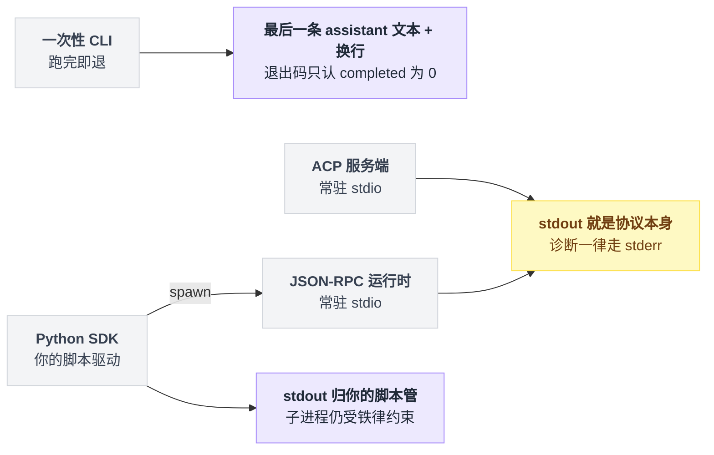
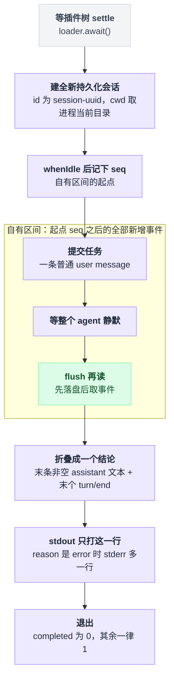
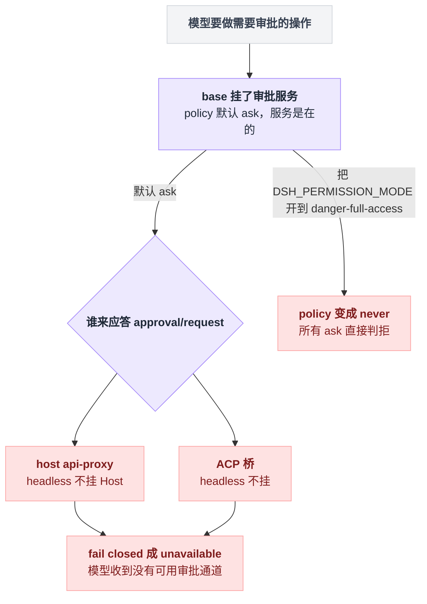
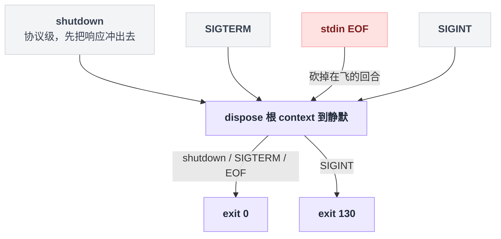
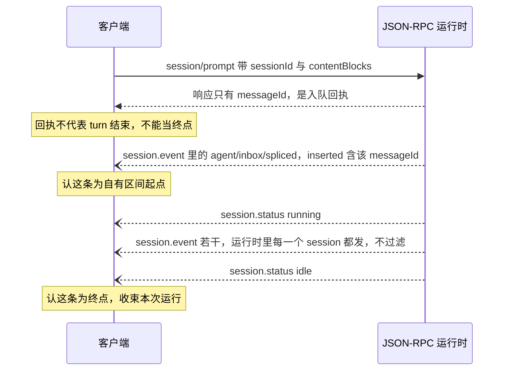
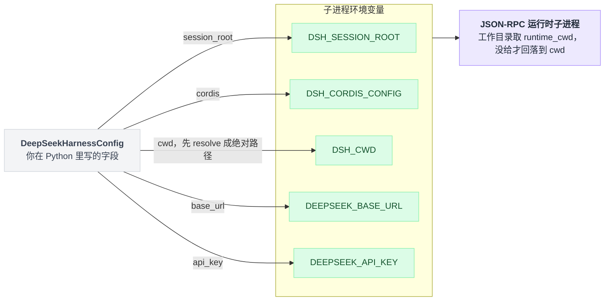
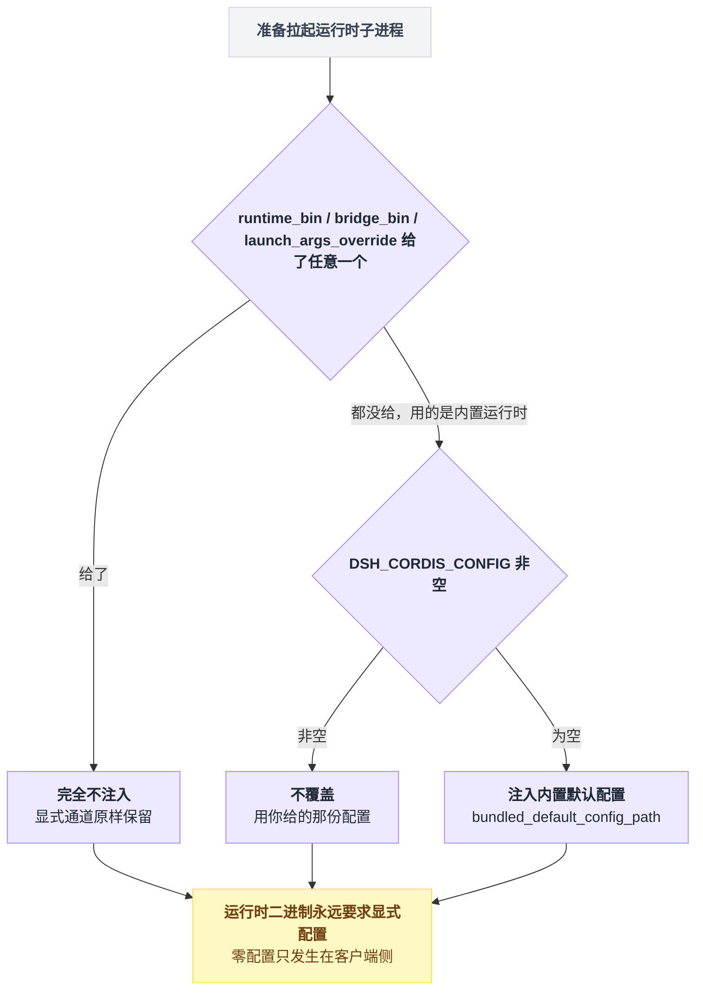

# 23 · headless 与 SDK

> 基于 `deepseek-ai/deepseek-harness` v0.1.0-rc.5（commit `47f9438`），2026-08-14 核对。正文只讲机制；成篇可照抄的代码统一收在文末[附录](#附录可以照抄的模板)，出处收在[脚注](#出处)，点角标可跳转。

假设你要把 dsh 接进一条 CI 流水线。那里没有浏览器，没人守在屏幕前点"同意"，作业成没成只能靠退出码判断。

最容易带进来的误解是：headless 就是"少开一个窗口的同一个 dsh"——权限照旧、输出照旧、审批弹窗只是没地方显示而已。

不是的。不挂 UI 改变的不只是画面。审批链条从定义上断了一半——headless 这条路上**没有人能回答审批请求**，这不是配置疏忽，是 bundle 的定义使然，下面会说清它的来龙去脉。输出也变了性质：你拿到的不是"对你这条 prompt 的回答"，而是另一种东西，这一点会在四条路里反复出现。

四条路是：一次性 CLI、JSON-RPC 运行时、Python SDK、ACP。外加把整棵插件树 `boot()` 进自己的 Node 程序，以及 `BENCHMARK.md` 认可的批量评测跑法。

## 四条路，先分清 stdout 归谁

| 路 | 入口 | 进程形态 | stdout 是什么 | 谁驱动回合 |
|---|---|---|---|---|
| 一次性 CLI | `dsh --profile headless "job"` | 跑完即退 | 最后一条 assistant 文本 + `\n` | dsh 自己 |
| JSON-RPC 运行时 | `dsh-jsonrpc-agent <cordis.yml>` | 常驻，stdio | **只有** JSON-RPC 帧 | 你的客户端 |
| Python SDK | `deepseek-harness-sdk` | 拉起上面那条运行时当子进程 | 由你的脚本决定 | 你的 Python 代码 |
| ACP | `dsh-acp-demo [--config …]` | 常驻，stdio | **只有** ACP JSON-RPC 帧 | 支持 ACP 的客户端 |

四条路的形状可以叠在一张里看：CLI 跑完就退，两条常驻服务把 stdout 整个让给协议，而 Python SDK 自己不说协议——它 spawn 的正是 JSON-RPC 那条运行时。



JSON-RPC 在这里就是"一行一条 JSON 消息"的远程调用约定：请求带 `id` 和 `method`，响应只带 `id`，通知只带 `method`[^1]。

两条服务端路有同一条铁律，**stdout 就是协议本身**。JSON-RPC 服务端的文档把话说死了：部署方不得组合 stdout logger，诊断走 stderr；ACP 那边的两份文档写的是同一句话[^2]。

这不是风格建议——插件树里混进一个往 stdout 打日志的插件，客户端的解析当场就碎，而**服务端插件不检查也不否决兄弟 logger**，两边都在"已知限制"里写明了这一点[^3]。

Python SDK 的 stdout 归你的脚本管，但它 spawn 的正是 JSON-RPC 那条运行时，铁律照样压在头上。

## 一次性 CLI：整场运行折叠成一行文本、一个退出码

最小命令就一行[^4]：

```sh
dsh --profile headless "run the tests"
```

从仓库源码跑要先装依赖、构建，然后从仓库根发起[^5]：

```sh
pnpm install && pnpm run build
pnpm dsh --profile headless "fix the failing test in this workspace"
```

凭据来自环境或仓库根那个 gitignored 的 `.env`：`DEEPSEEK_API_KEY`，可选 `DEEPSEEK_BASE_URL`。完整的四层优先级是"继承环境 → 家目录的凭据文件 → 调用目录 `.env` → 家目录 `.env`"[^6]，细节归 [04 章](./04-接模型.md)。

`headless` profile 首次使用会从内置模板自动初始化，层是 base + headless；调用目录就是默认 workspace 根[^7]。

### runner 有九步，值得停下的只有"记 seq"那一步

一句话：等插件树 settle → 建会话 → **记下 seq 起点** → 把任务丢进去 → 等静默 → flush 再读 → 折叠出结论 → 打印 → 退出。

记 seq 这个动作，相当于在监控录像带上掐一个时间码：从这一刻起新增的画面，全算"这一次的"。这个被时间码圈起来的段落，本章统一叫**自有区间**——后面每条路都会再遇到它。

主流程一共不到四十行，读起来没什么弯弯绕[^8]。



开机第一件事是等：等整棵插件树 settle——每一行插件要么加载完，要么明确失败——然后才去建 Agent[^8]。

接着通过 core registry 建一个全新的持久化会话，id 是 `session-` 前缀加一段 uuid，cwd 取进程当前目录[^8]。

真正的关键在第三步：先等到 agent 空闲，再记下会话事件流当前的序号。时间码就是在这里掐下的[^8]。

任务作为一条普通 user message 提交上去，然后等到整个 agent 静默，先刷盘落定再读，最后把从起点 seq 到此刻的全部新增事件折叠成一个结论[^8]。

折叠函数扫这段区间里的全部事件，逻辑简单到可以背下来，三条规则[^9]：

```
seen_start = false
for e in 区间内的事件:
    if e is turn/start:            seen_start = true    // 见到之前的一概不看
    if not seen_start:             continue
    if e is assistant 文本 且非空:  text   = e           // 后来的覆盖先前的
    if e is turn/end:              reason = e           // 同样后来覆盖先前
```

所以结论文本和结束原因都是"最后一条赢"。

剩下两步是输出：stdout 只打结论那一行，然后按结束原因决定退出码——completed 是 0，其余一律 1[^10]。

于是 CI 脚本关心的那几条行为契约就齐了[^11]：

| 场景 | 表现 |
|---|---|
| 正常完成 | 退出码 0，stdout 一行结论，stderr 一个字都不写 |
| 任何其它 reason | 退出码 1（`max-tokens` 也算 1） |
| `turn/end` 的 reason 是 `error` | stderr 多一行 `dsh: <code>: <message>` |
| 任务为空或全是空白 | usage error，runner 压根不会激活 |
| 任何情况 | 不开任何监听端口 |

另外这层 patch 关掉了 HMR 行，并把 persona 换成 coding agent 模板[^12]。退出码和信号语义在 [02 章](./02-五分钟跑起来.md)已经展开过，这里不重复。

### 验收题：stdout 打出的那行，一定是回答你的吗

监控录像的比喻能直接推出答案：录像里出现的不止你。掐了时间码之后，凡是新增进画面的都算区间内——有 steering（回合进行中插进去的用户输入）、注入上下文或后台活儿的时候，"区间里最后一条非空 assistant 文本"完全可能是回应别的东西的那句。

README 把这条列进了已知限制：runner 会等完 Agent 在这段区间里干的所有活儿，再打最后一条[^13]。

**结果永远是"区间的末条"，不是"对你这条 prompt 的回答"**——这是本章第一根柱子，后面 Python SDK 那边会换个壳再撞上它一次。

第二个坑在启动方式上。`ctx.appExit` 是 launcher 提供的，**不通过 `dsh` 启动器去 boot headless profile，会在激活期直接抛**[^14]。它具体从哪来，最后一节讲 `boot()` 时会交代。

顺带澄清一件容易认错的事：仓库里那个 headless-agent 示例目录**不是第二个产品入口**，它是 replay/real-model 的测试组合，其 JSONL 事件流是测试基建，不是受支持的 CLI 输出格式[^15]。

### 审批断的不是服务，是应答的人

headless bundle 的 README 开门见山，同样的话也写在 patch 文件的顶部注释里[^16]：

> It mounts no Host, HTTP server, Web runtime, or browser plugin.

四样东西一样不挂，直接后果是审批链条断了一半。

base bundle 确实挂了审批服务，policy 默认是 `ask`[^17]，所以服务在。缺的是**答复者**——全仓能应答审批请求的只有 host api-proxy 和 ACP 桥，headless 两个都没有。

于是每一次需要审批的操作都会 fail closed 成 `unavailable`，模型收到的是 "no approval channel is available"[^18]。

把这条断掉的链子摊开看：



这条链路的完整推导在 [13 章](./13-工具执行管线.md)和 [18 章](./18-沙箱审批与权限.md)，包括那个反直觉的坑：把 `DSH_PERMISSION_MODE` 开到 `danger-full-access` 反而让 policy 变成 `never`，所有 ask 直接判拒。

在 CI 里的实际含义就一句：**别指望模型能靠审批拿到额外权限，需要什么就在配置里事先给足**。

## JSON-RPC 运行时：回合的方向盘交到你手上

### 起进程只有两个通道，停进程却有四个门

bin 叫 `dsh-jsonrpc-agent`[^19]。配置发现只有两个通道，**env 赢**，而且**没有任何内建兜底**：

```sh
DSH_CORDIS_CONFIG=/abs/examples/jsonrpc-agent/cordis.yml dsh-jsonrpc-agent
dsh-jsonrpc-agent /abs/examples/jsonrpc-agent/cordis.yml
```

两个都没给出可用文件时，打一行 usage 到 stderr 然后以 1 退出[^20]。

仓库里没有对应的 npm script，从 checkout 起只能自己拼——装完依赖后用 tsx 直接跑源码入口，官方自己也是这么起它的[^21]：

```sh
node --import tsx packages/examples/jsonrpc-demo/src/bin.ts examples/jsonrpc-agent/cordis.yml
```

停止有四个入口，进门那一下和退出码各不相同[^22]：

| 入口 | 行为 | 退出码 |
|---|---|---|
| `shutdown`（协议级） | 先把响应冲出去，再 dispose 根 context | 0 |
| `SIGTERM` | dispose 到静默 | 0 |
| stdin EOF | dispose 到静默，但**砍掉在飞的回合** | 0 |
| `SIGINT` | dispose 到静默 | 130 |

四个入口最后都汇到同一个 dispose 上：



### 协议全貌：三个请求，四个通知

一帧 = 一行紧凑 JSON，换行结尾；带 `id` 和 `method` 是请求，只有 `id` 是响应，只有 `method` 是通知；坏 JSON 行被忽略[^1]。三个请求、四个通知，载荷逐条如下[^23]：

| 方向 | method | 载荷 |
|---|---|---|
| c→s | `initialize` | `{cwd, provider, model, maxTokens?}` → `{serverInfo:{name,version}}` |
| c→s | `session/prompt` | `{sessionId, contentBlocks}` → `{messageId}` |
| c→s | `shutdown` | 无参 → `{}` |
| s→c | `session.event` | `{sessionId, event}`，运行时里**每一个** session，不过滤 |
| s→c | `session.status` | `{sessionId, status: 'idle' \| 'running'}` |
| s→c | `subagent.started` | `{parentSessionId, childSessionId}` |
| s→c | `subagent.finished` | 仅进程内子 agent（远端 run 不上报） |

`serverInfo.name` 恒为 `deepseek-harness-sdk-runtime`，version 目前是 0.0.1 且客户端不校验[^24]。

客户端写出去的头两行长这样。先声明一句：**这是按代码拼的，不是抓包**——payload 形状、外层信封和"紧凑 JSON 加换行"的序列化方式都是从官方 Python 客户端源码里读出来的，session id 与 prompt 文本取自仓库快照场景[^25]：

```
{"jsonrpc":"2.0","id":"<uuid>","method":"initialize","params":{"cwd":"/abs/workspace","provider":"deepseek-official","model":"deepseek-v4-flash"}}
{"jsonrpc":"2.0","id":"<uuid>","method":"session/prompt","params":{"sessionId":"sdk-snapshot-text","contentBlocks":[{"type":"text","text":"Reply with exactly: SDK snapshot OK"}]}}
```

服务端回过来的头两行则是**逐字取自仓库快照**（`{{sessionId}}` 是快照占位符，session id 与 message id 都被归一化成了它）[^26]：

```
{"method":"session.event","params":{"sessionId":"{{sessionId}}","event":{"type":"agent/inbox/spliced","seq":0,"time":0,"data":{"target":"next-turn","start":0,"inserted":[{"content":[{"type":"text","text":"Reply with exactly: SDK snapshot OK"}],"source":{"kind":"user"},"role":"user","id":"{{sessionId}}"}]}}}}
{"method":"session.status","params":{"sessionId":"{{sessionId}}","status":"running"}}
```

### messageId 是挂号小票，不是诊断结果

写客户端之前最想问的问题是：`session/prompt` 的响应回来了，是不是就拿到结果了？

不是。**`session/prompt` 只返回入队回执。** `messageId` 标识排进 inbox 的那条 user message，**不**标识后面的某条 assistant 消息、某次 turn 结束或某个 prompt 结果[^27]。

它就是医院前台的挂号小票：只证明你排上了号，不证明医生看完了你。看没看完，得自己盯着叫号屏。这直接推出第二条语义——

**"一次运行"的区间边界得你自己定义。** 官方 Python 客户端的做法就两条规则[^28]：在通知流里等到那条"入队拼接"事件、且它的插入列表里含有自己拿到的那个 messageId，认它为自有区间的起点；此后第一次看到该 session 的状态通知变成 idle，认它为终点，收束本次运行。这跟 headless 掐时间码是同一个思路，只是这次掐码的人是你。这段来回摆开是这样：



第三条语义：**没有 cancel，也没有关单个 session 的方法。** 放弃一个回合 = 关掉运行时进程；SDK 创建的 agent 活到进程退出为止。也没有协议版本协商[^29]。

服务端插件本身只注入 agents 一个依赖：按 session id 取或建 agent；已注册的适配器优先，未被认领的 `deepseek-official` 会自动挂 `dsh-llm-deepseek`，其它未认领的 provider 直接让 `initialize` 失败[^30]。

TypeScript 侧还有个对称的客户端包 `@deepseek-ai/dsh-sdk-client`：`DeepSeekHarness` 是高层 owned-run API，`HarnessClient` 是低层协议客户端，最小用法、选项字段和结果字段都在它的文档与类型文件里[^31]。它**不做打包运行时发现**，启动命令和参数必须显式给[^31]。

## Python SDK：脚本归你，协议归子进程

### 装上，跑通官方例子

```sh
git clone https://github.com/deepseek-ai/deepseek-harness.git
cd deepseek-harness
python -m venv .venv
. .venv/bin/activate
python -m pip install deepseek-harness-sdk
```

装 `deepseek-harness-sdk` 会连带装同版本的运行时二进制平台 wheel，**目标机不需要 Node.js**。前置条件是 Python ≥ 3.10，Linux x64 / arm64 或 macOS 14+ arm64[^32]。

下面这段要在上面这个 checkout 根目录下跑，因为示例脚本和配置用的都是仓库相对路径[^33]：

```sh
export DEEPSEEK_API_KEY=sk-your-key-here

python examples/jsonrpc-agent/minimal.py \
  --workspace /absolute/path/to/workspace \
  --session-root /absolute/path/to/sessions \
  --session-id example-001 \
  "Inspect the repository and fix the failing tests."
```

这些 flag 逐条对应示例脚本开头的参数定义，那里另有 provider、model、max-tokens 三个可选项[^33]。模型不在官方端点时再补一行：

```sh
export DEEPSEEK_BASE_URL=http://127.0.0.1:8000/v1
```

### 在自己的程序里调

逐字来自官方教程[^34]：

```python
from pathlib import Path

from deepseek_harness import DeepSeekHarness

config = Path("examples/jsonrpc-agent/minimal.cordis.yml").resolve()
workspace = Path("/absolute/path/to/workspace").resolve()
sessions = Path("/absolute/path/to/sessions").resolve()

with DeepSeekHarness(
    provider="deepseek-official",
    model="deepseek-v4-flash",
    max_tokens=49_152,
    cwd=str(workspace),
    session_root=str(sessions),
    cordis=str(config),
) as harness:
    result = harness.run(
        "Inspect the repository and fix the failing tests.",
        session_id="example-001",
    )

print(result.final_response)
```

配置对象的全部字段里，有五个会被翻译成子进程的环境变量[^35]：

| 字段 | 环境变量 |
|---|---|
| `session_root` | `DSH_SESSION_ROOT` |
| `cordis` | `DSH_CORDIS_CONFIG` |
| `cwd`（先 resolve 成绝对路径） | `DSH_CWD` |
| `base_url` | `DEEPSEEK_BASE_URL` |
| `api_key` | `DEEPSEEK_API_KEY` |

翻译方向是单向的：高层字段进去，子进程的环境变量出来，运行时只认后者；`cwd` 和 `runtime_cwd` 在这张图上分成了两条线，一条给 agent 当 workspace，一条给子进程当工作目录。



跑完拿回的结果对象有六个字段：`session_id`、`final_response`、`finish_reason`、`events`、`notifications`、`session_root`[^36]。

这里就是前面预告过的"换壳陷阱"。关键语义写在 SDK 的 README 里：`final_response` 是**这段自有区间里最后一条已提交的 root session assistant 文本**，`finish_reason` 是区间里最后一个 turn 结束事件的 kind（README 举的例子是 completed / max-tokens / error），没有 turn 结束时为空[^37]。

两个字段描述的都是"区间"，不是"因果上属于这条 prompt 的输出"——跟 headless 的监控录像是同一卷带子，只是换了个放映机。

### 零配置是怎么变出来的

运行时二进制永远要求显式配置，所以"零配置"这件事完全发生在客户端侧。判定只有两道闸，两道都放行才轮得到注入：给了任何一个显式启动通道（自带运行时、自带桥、覆盖启动参数）就完全不注入；用内置运行时但环境里已经有配置路径的，也不覆盖；只有两道都空着，客户端才把内置默认配置塞进去[^38]。



这三个字段里有个不对称容易翻车：只有 `runtime_bin` 和 `launch_args_override` 是高层配置对象的字段，`bridge_bin` 只存在于低层配置——高层构造函数收到这个关键字会直接报错[^39]。

### 在 checkout 里跑未编译的 TypeScript 源码

有两条路[^40]。第一条是让 SDK 用 tsx 直接拉起仓库里的运行时源码入口：把启动参数整个覆盖成"node 加 tsx 再加运行时入口文件"，配置用运行时包导出的内置默认配置，凭据走环境变量——完整可照抄的形状收在[附录 A](#a-用-sdk-拉起未编译的运行时源码)。开发文档给的等价写法是直接用仓库里装好的 tsx 可执行文件，配上仓库根当工作目录[^40]。

这里务必分清两个字段：子进程的工作目录取 `runtime_cwd`，没给才回落到 `cwd`，而 `cwd` 是发给 agent 的 workspace[^41]。

另一条路是 `DSH_RUNTIME_MODE=node` 用已构建的 node carrier[^42]——自动解析**只会**找生产 exe，dev carrier 必须显式选，免得生产部署悄悄跑在源码构建上。

最后是 minimal 那份配置的代价：它挂的是 danger-full-access 模式，bash 和编辑器的绝对路径能改运行时进程可见的**任何**路径，只能在一次性 checkout 或容器里跑[^43]。

持久 PTY 需要 POSIX 终端，不支持 Windows。它给模型看的工具只有两个：owner 作用域的持久 `bash` 和 `str_replace_editor`[^44]。

## ACP：把 dsh 挂到别人下面

ACP = [Agent Client Protocol](https://agentclientprotocol.com)，dsh 这一侧是**只做自动化的服务端**：让程序化客户端创建全新 agent、发文本 prompt、收已提交的 assistant 文本、按策略回答一次性授权、取消工作。它明确**不是** UI 集成层——不暴露编辑器导航、转录回放、命令、模式、配置选择器、征询（elicitation）、reasoning、plan、标题、工具呈现[^45]。

两条 demo 命令都需要 `DEEPSEEK_API_KEY`，来自仓库根 `.env` 或环境变量[^46]：

```sh
pnpm run demo:acp
pnpm run demo:code-mode
```

前者展开就是用 tsx 跑 ACP demo 的源码入口、指向 acp-agent 那份配置；后者走一个小脚本，同一个 bin、同一套协议，配置换成 code-mode 那份（Code Mode 工具传输见 [21 章](./21-CodeMode.md)）[^46]。

bin 形态是 `dsh-acp-demo`，可用 `--config`（短写 `-c`）指配置，默认当前目录的 cordis.yml；`DSH_SNAPSHOT=replay` 会选同目录的快照配置[^47]。

方法这一侧的行为要点如下[^48]。

`initialize` 协商版本，只广告 baseline prompt——没有 image / audio / embedded context，也不广告 session、编辑器、终端、文件系统、MCP 能力。

`authenticate` 是 no-op，因为它没广告任何认证方式。

`session/new` 建一个全新 agent，`cwd` 必须是绝对路径，`additionalDirectories` 与 `mcpServers` **只接受空值**，非空直接拒。

`session/prompt` 把文本块拼起来（resource link 拍平成 `[resource_link name=… uri=…]` 文本），拒绝空输入与超出 baseline 的输入，每 session 只允许一个在飞请求，然后等整个 agent 静默。

`session/cancel` 只取消指定 agent 并把它挂起的 prompt 结算成 `cancelled`，未知 id 是 no-op。

`session/update` 为每条已提交 `assistant/message` 的非空文本块发一个 `agent_message_chunk`，**原始 delta 与非消息事件不发**。

`session/request_permission` 是桥接方发起的一次性 allow/reject，客户端可以自动应答。

插件 config 只有 `provider` 和 `model` 两项，都可选，但可运行的 ACP 组合要求两个都给[^48]。

坑有三处。

**`stopReason` 不承诺 prompt 级结果**：正常静默报 `end_turn`，显式取消 / 释放 / 被丢弃的准入报 `cancelled`，而 **token 上限结束也落成 `end_turn`**，模型错误则直接 reject 该 prompt[^49]。

**输出是已提交消息**，故意牺牲逐 token 延迟换干净结果，未提交的 provider chunk 和重试文本不会泄漏出来[^50]。

**沙箱按 session cwd 解析**：每个 `session/new` 自带绝对 cwd，`workspace-write` 就按该 session cwd 算，所以并发 session 可以各用各的项目根，`DSH_PERMISSION_MODE` 选 `workspace-write` 还是 `danger-full-access`；`workspace-write` 下模型要更大权限会触发一次性授权请求，**客户端不答或答不了就按拒绝处理**[^51]。

反向的"dsh 当 ACP 客户端去调别人"是另一个包，归 [19 章](./19-子agent与workflow.md)[^52]。

## 把 dsh 当库嵌进自己的程序：`boot()`

`@deepseek-ai/dsh-app-boot` 是所有 app bin 共用的启动胶水[^53]。核心函数收五个参数——bin 名、配置文件的绝对路径、可选的 patch 列表、可选的 prepare 钩子、可选的 bare 模块基准 URL——返回整棵树的根 context；签名原文收在[附录 B](#b-boot-的签名与最小宿主程序)[^54]。

最小可用的宿主程序就在仓库里——ACP demo 的 bin，一共 12 行有效代码，全文也在[附录 B](#b-boot-的签名与最小宿主程序)。它是个自执行 ESM 文件，用顶层 await，没有 main 函数[^55]。负责解析配置路径的那个辅助函数把相对路径变绝对，并在快照回放模式下把配置换成同目录的快照版[^56]。

JSON-RPC bin 的版本多了退出阶梯，同样可以照抄：boot 之后自己接 stdin 结束、SIGTERM、SIGINT 三个入口，各自把根 fiber dispose 干净再按对应退出码退出[^57]。

嵌进自己程序时有几件事得提前知道。

`boot()` 返回时整棵树已经 settle，而且已经跑过入口激活断言：有 entry 没 fiber，它会报出每个没解析成的插件名；有 entry 激活失败，它带着插件自己的原始 stack 抛；有 entry 一直 pending，它报这个 entry 没等到的 service[^58]。

失败时它会**先 dispose 掉半成品 context** 再抛带标签的错，两个标签分别是 "host preparation failed"（prepare 阶段）和 "plugin tree failed to load"（之后）[^59]。

prepare 钩子在任何 config-tree entry 挂载之前跑，用来提供 launcher 自己拥有的 context slot——前面欠的那个账在这里还上：headless 的 `ctx.appExit` 正是 `dsh` 启动器在这个钩子里提供出来的[^60]。

配置放在**别人的 Node 工程**里时要传 bare 模块基准 URL，让你自己安装的插件树保持权威；相对路径 specifier 永远相对配置目录。编译产物 bin 还需要 Loader 的一个可选 peer 依赖才能解析 bare 包名；外部调用方要么自己提供它，要么只用相对或 file 协议的 specifier，要么自带模块解析 hook[^61]。

另外两件小事：`installFailLoud` 把 boot 期与之后的未处理 rejection 变成一行 stderr 加退出码 1，可选的 release 钩子在两者之间被 await（供占用终端的界面还原终端），返回值是卸载函数；用户 patch 按 id 命中时**整体替换配置，不深合并**[^62]。做 bundle 和 profile 的完整故事在 [22 章](./22-做一个bundle和profile.md)。

## 评测：一个任务一个 workspace，不是洁癖是硬要求

`BENCHMARK.md` 正文只有一段两句[^63]：按 Python SDK 教程装 SDK、跑 jsonrpc-agent 的 minimal 变体，**独立的评测任务用独立的 workspace 和 session id**。

第二句为什么是硬要求？因为 session 不只是一段记录，它**拥有活着的 bash 进程**：复用同一个 harness 加同一个 session id，会连同那个 bash 的工作目录、导出变量和 shell 函数一起保留[^64]。任务 A 的 `cd` 和 `export` 会直接污染任务 B 的起点，评测结果就不再可比。

把示例脚本已有的 flag 拼成批量循环，可照抄[附录 C](#c-批量评测循环)。先声明：那段循环是我把仓库里真实存在的 flag 拼起来的，仓库本身没有这个脚本[^33]。

要在一个进程里跑，就每个任务开一个新的 `DeepSeekHarness`，或者至少每次换 session id——不传的话会自动生成一个带 uuid 的 session id[^65]。

想拿逐事件数据的话注意分工：结果对象的 `events` 只含 root session 的事件，`notifications` 才包含子 agent[^66]。

## 串起来自检一遍

每条结论都能从前面的画面重新推出来，推不出来就回去重读那一节：

- **CLI 打出的那行为什么可能不是回答你的？** 因为 runner 掐的是时间码：取"自有区间的末条非空 assistant 文本"，区间里混进 steering 或后台活儿，末条就未必是回你的那句。
- **SDK 的 `final_response` 为什么是同一个陷阱？** 因为它描述的同样是区间不是因果——同一卷录像带，换了个放映机。
- **headless 里模型要权限为什么只能事先给足？** 因为审批服务在、应答的人不在——host api-proxy 和 ACP 桥一个都没挂，每次审批 fail closed 成 `unavailable`；开 `danger-full-access` 反而把 policy 变成 `never`。
- **客户端为什么会被一行日志弄碎？** 因为 stdout 就是协议本身，而服务端插件不检查也不否决兄弟 logger——碎不碎全看你组树时守不守铁律。
- **`messageId` 为什么不能当终点？** 因为它是挂号小票，只证明排上了队；起点和终点都得你自己从通知流里认出来。
- **想中途放弃为什么只能杀进程？** 因为协议里没有 cancel，也没有关单个 session 的方法。
- **评测为什么必须一任务一 workspace？** 因为 session 拥有活着的 bash 进程，上一个任务的 `cd` 和 `export` 会原样留给下一个。

---

## 附录：可以照抄的模板

### A. 用 SDK 拉起未编译的运行时源码

完整形状来自仓库的手动冒烟测试[^40]：

```python
# python/sdk/tests/manual_sdk_agent_smoke.py:58-71
with DeepSeekHarness(
    model="sdk-smoke-model",
    cwd=str(repo_root / "python/sdk"),
    runtime_cwd=str(repo_root),
    session_root=str(session_root),
    cordis=str(bundled_default_config_path()),
    launch_args_override=("node", "--import", "tsx", str(runtime_entry)),
    env={
        "DEEPSEEK_BASE_URL": base_url,
        "DEEPSEEK_API_KEY": "sdk-smoke-key",
    },
    request_timeout_seconds=20,
    shutdown_timeout_seconds=2,
) as harness:
    ...
```

`runtime_entry` 指向仓库里 JSON-RPC demo 的源码入口 bin，`bundled_default_config_path` 从运行时包导入[^40]。开发文档给的等价写法[^40]：

```python
launch_args_override=("./node_modules/.bin/tsx", "packages/examples/jsonrpc-demo/src/bin.ts")
```

配上仓库根当工作目录。

### B. boot() 的签名与最小宿主程序

签名原文[^54]：

```ts
// packages/boot/app-boot/src/index.ts:757-763
export async function boot(
  binName: string,
  absoluteConfigPath: string,
  patches?: PatchOptions[],
  prepare?: (ctx: Context) => Promise<void> | void,
  bareModuleBaseUrl?: string,
): Promise<Context>
```

最小宿主程序，ACP demo 的 bin[^55]：

```ts
// packages/examples/acp-demo/src/bin.ts:13-29
import { parseArgs } from 'node:util'
import { boot, installFailLoud, loadEnv, resolveConfigPath } from '@deepseek-ai/dsh-app-boot'

const NAME = 'dsh-acp-demo'

installFailLoud(NAME)
const snapshotMode = process.env['DSH_SNAPSHOT']
if (snapshotMode !== 'replay') loadEnv(NAME)
const { values } = parseArgs({
  args: process.argv.slice(2),
  options: { config: { type: 'string', short: 'c' } },
  strict: true,
})
const ctx = await boot(NAME, resolveConfigPath(values.config ?? './cordis.yml', snapshotMode))
```

原文照抄，只略去了三行覆盖率工具的忽略指令，以及一段只在快照模式下挂的 stdin EOF 收尾[^55]。

### C. 批量评测循环

仓库本身没有这个脚本，是把示例脚本真实存在的 flag 拼起来的[^33]：

```sh
export DEEPSEEK_API_KEY=sk-your-key-here
while read -r id task; do
  ws="/tmp/bench/$id/workspace"
  mkdir -p "$ws" "/tmp/bench/$id/sessions"
  python examples/jsonrpc-agent/minimal.py \
    --workspace "$ws" \
    --session-root "/tmp/bench/$id/sessions" \
    --session-id "$id" \
    "$task"
done < tasks.tsv
```

`tasks.tsv` 每行是任务 id + 空白 + 任务文本。

---

## 出处

[^1]: 帧约定（一行一条紧凑 JSON、请求/响应/通知的判别、坏 JSON 行被忽略）：`packages/sdk/protocol/README.md:9`。
[^2]: stdout 铁律：`packages/sdk/server/README.md:17`（部署方不得组合 stdout logger，诊断走 stderr）；ACP 侧同样：`packages/acp/acp/README.md:11`、`examples/acp-agent/README.md:16`。
[^3]: 服务端插件不检查也不否决兄弟 logger，两边的"已知限制"：`packages/sdk/server/README.md:47`、`packages/examples/acp-demo/README.md:58`。
[^4]: 入口模式：`apps/cli/README.md:12`；逐字示例：`:25`。
[^5]: 源码构建步骤：`README.md:29-34`；从仓库根跑 headless 的命令：`examples/headless-agent/README.md:13`。
[^6]: 凭据来源（环境或仓库根 gitignored `.env`）：`examples/headless-agent/README.md:10-12`；四层优先级（继承环境 → `$DSH_HOME/.credentials.yaml` → 调用目录 `.env` → `$DSH_HOME/.env`）：`apps/cli/reference/README.md:76`。
[^7]: headless profile 首次使用自动初始化、层是 base + headless：`apps/cli/reference/README.md:13`；调用目录是默认 workspace 根：`apps/cli/README.md:16`。
[^8]: runner 主流程 `run()`：`packages/bundle/headless/src/index.ts` 第 96–134 行。等 loader settle 在 `:99`，建会话在 `:111-119`（id 在 `:112`、cwd 在 `:113`），whenIdle 后记 seq 在 `:120-121`，提交任务在 `:122-125`，等静默在 `:126`，flush 在 `:127`，折叠在 `:128`。
[^9]: 折叠函数 `summarize()`：`packages/bundle/headless/src/index.ts:61-82`，三条规则分别在 `:67-71`、`:72-78`、`:79`。
[^10]: stdout 只打结论一行：`packages/bundle/headless/src/index.ts:129`；reason 为 error 时 stderr 多一行在 `:130-132`；退出码只认 completed 为 0 在 `:133`。
[^11]: 行为契约表的出处：退出码 `packages/bundle/headless/src/index.ts:133`、stderr 错误行 `:130-132`；stderr 全静默与不开监听端口 `apps/cli/reference/README.md:30`；空任务是 usage error `packages/bundle/headless/src/startup.ts:53`、`packages/bundle/headless/README.md:7`。
[^12]: 关掉 HMR 行：`packages/bundle/headless/cordis.patch.yml:14-15`；persona 换成 coding agent 模板：`:7-10`。
[^13]: "runner 等完区间内全部活儿再打末条"的已知限制：`packages/bundle/headless/README.md:19`。
[^14]: 不经 `dsh` 启动器 boot 会在激活期抛：`packages/bundle/headless/src/index.ts:144-147`、`packages/bundle/headless/README.md:20`。
[^15]: headless-agent 示例目录是 replay/real-model 测试组合、JSONL 输出是测试基建：`examples/headless-agent/README.md:5`、`:18`。
[^16]: 引文出处：`packages/bundle/headless/README.md:5`；同样的话在 `packages/bundle/headless/cordis.patch.yml:2` 的顶部注释。
[^17]: base bundle 挂审批服务、policy 默认 ask：`packages/bundle/base/cordis.patch.yml:188-191`。
[^18]: 审批 fail closed 成 unavailable：`packages/interaction/user-approval/README.md:5`。
[^19]: bin 名声明：`packages/examples/jsonrpc-demo/package.json:16-18`。
[^20]: 两个配置通道都无可用文件时打 usage、exit 1：`packages/examples/jsonrpc-demo/README.md:9`、`packages/examples/jsonrpc-demo/src/runner.ts:25-36`（argv 约定在 `:26`）。
[^21]: tsx 直跑源码入口的启动方式：`package.json:139`、`python/sdk/tests/manual_sdk_agent_smoke.py:64`。
[^22]: 三个进程级停止入口：`packages/examples/jsonrpc-demo/src/runner.ts:51-53`、`packages/examples/jsonrpc-demo/README.md:15`；EOF 砍在飞回合、要有序收尾用 shutdown：`packages/examples/jsonrpc-demo/README.md:33`；shutdown 的三步顺序：`packages/sdk/server/README.md:21`。
[^23]: 方法总表：`packages/sdk/protocol/README.md:17-23`；字段逐条：`packages/sdk/protocol/src/types.ts:16-25`（initialize 入参）、`:28-31`（initialize 结果）、`:34-45`（prompt 入参与结果）、`:59-64`（status）、`:93-105`（两张 map）。
[^24]: serverInfo 的固定名字与不校验的版本号：`packages/sdk/protocol/README.md:25`、`:37`。
[^25]: 客户端帧的拼法依据：payload 形状 `python/sdk/src/deepseek_harness/client.py:125-131`（initialize，cwd 先 resolve 成绝对路径）与 `:146`（prompt），外层信封 `:248`，紧凑 JSON 加换行的序列化 `:303`；session id 与 prompt 文本取自 `examples/jsonrpc-agent/tests/sdk.snapshot.ts:86-88`。
[^26]: 服务端头两行的快照原文：`examples/jsonrpc-agent/tests/snapshots/text-turn/notifications.expected.jsonl:1-2`。
[^27]: messageId 只是入队回执：`packages/sdk/protocol/README.md:25`、`packages/sdk/server/README.md:25`、`:46`。
[^28]: 官方 Python 客户端的区间判定：起点（inbox 拼接事件的 inserted 含自己的 messageId）在 `python/sdk/src/deepseek_harness/api.py:186-196`，终点（等该 session 的 status 变 idle 的循环）在 `:154-174`。
[^29]: 没有 cancel、没有关单个 session：`packages/sdk/protocol/README.md:38`、`packages/sdk/server/README.md:45`；没有协议版本协商：`packages/sdk/protocol/README.md:37`。
[^30]: 服务端插件只 inject agents、按 sessionId 取或建 agent、provider 认领规则：`packages/sdk/server/README.md:9`、`:48`。
[^31]: TS 客户端两层 API：`packages/sdk/client/README.md:5`；最小用法 `:11-22`；不做打包运行时发现、launch 必须显式给 `:7`、`:46`；选项字段 `packages/sdk/client/src/types.ts:48-59`，RunResult `:62-71`。
[^32]: 连带安装 `deepseek-harness-runtime-bin` 平台 wheel、无需 Node.js：`python/sdk/README.md:16`、`docs/user/guide/python-sdk.md:19-27`；前置条件：`docs/user/guide/python-sdk.md:9-13`。
[^33]: minimal 示例的跑法：`docs/user/guide/python-sdk.md:33-48`；flag 定义（含 `--provider` / `--model` / `--max-tokens`）：`examples/jsonrpc-agent/minimal.py:19-25`；base URL 的补法：`docs/user/guide/python-sdk.md:31`、`:35`。
[^34]: 程序内调用示例原文：`docs/user/guide/python-sdk.md:56-79`。
[^35]: 配置对象全部字段：`python/sdk/src/deepseek_harness/api.py:22-35`；翻译成环境变量：`:64-72`，逐条为 session_root `:64-65`、cordis `:66-67`、cwd `:68`（resolve 成绝对路径在 `:60`）、base_url `:69-70`、api_key `:71-72`。
[^36]: RunResult 的六个字段：`python/sdk/src/deepseek_harness/api.py:39-45`。
[^37]: final_response 与 finish_reason 的区间语义：`python/sdk/README.md:45`。
[^38]: 运行时二进制永远要求显式配置：`python/sdk-runtime/README.md:29`；客户端侧两道闸的注入逻辑：`python/sdk/src/deepseek_harness/client.py:438-454`、`python/sdk/README.md:49`。
[^39]: runtime_bin 与 launch_args_override 是高层字段：`python/sdk/src/deepseek_harness/api.py:30-31`；bridge_bin 只在低层配置：`python/sdk/src/deepseek_harness/client.py:29`。
[^40]: 两条路：`python/development.md:43-44`；完整冒烟形状：`python/sdk/tests/manual_sdk_agent_smoke.py:58-71`，runtime_entry 指向 JSON-RPC demo 源码入口在 `:47`，bundled_default_config_path 的导入在 `:19`；tsx 可执行文件的等价写法：`python/development.md:44`。
[^41]: runtime_cwd 与 cwd 的分工：`python/sdk/src/deepseek_harness/api.py:61`、`:78`。
[^42]: node carrier 与只找生产 exe 的自动解析：`python/sdk-runtime/README.md:22`。
[^43]: minimal 配置挂 danger-full-access：`examples/jsonrpc-agent/minimal.cordis.yml:23-27`。
[^44]: 持久 PTY 不支持 Windows：`docs/user/guide/python-sdk.md:102`、`examples/jsonrpc-agent/README.md:38`；只有两个工具：`examples/jsonrpc-agent/README.md:35-36`。
[^45]: ACP 服务端的定位：`packages/acp/acp/README.md:5`；明确不做的 UI 集成清单：`:7`。
[^46]: demo 命令要 DEEPSEEK_API_KEY：`examples/acp-agent/README.md:8`；demo:acp 的展开：`package.json:139`；demo:code-mode 走的脚本：`scripts/demo-code-mode.mjs:9-15`。
[^47]: bin 形态、默认配置路径与快照模式：`packages/examples/acp-demo/README.md:45`。
[^48]: 方法行为要点：`packages/acp/acp/README.md:22-30`，resource link 的渲染另见 `:52`；插件 config 两项与可运行组合的要求：`:13-18`。
[^49]: stopReason 语义（token 上限也落 end_turn）：`packages/acp/acp/README.md:27`、`:40`。
[^50]: 只发已提交消息、不泄漏未提交 chunk 与重试文本：`packages/acp/acp/README.md:34`。
[^51]: 沙箱按 session cwd 解析、权限模式选择：`examples/acp-agent/README.md:22`；客户端不应答按拒绝处理：`:24`。
[^52]: dsh 当 ACP 客户端的包：`packages/acp/README.md:5`。
[^53]: app-boot 是所有 app bin 共用的启动胶水：`packages/boot/app-boot/README.md:5`。
[^54]: boot() 签名：`packages/boot/app-boot/src/index.ts:757-763`。
[^55]: ACP demo bin 的有效代码：`packages/examples/acp-demo/src/bin.ts:13-29`（`:18-20` 是覆盖率工具的忽略指令，`:30-34` 是只在快照模式下挂的 stdin EOF 收尾）。
[^56]: resolveConfigPath 的行为（相对转绝对、replay 换快照配置）：`packages/boot/app-boot/README.md:9`。
[^57]: JSON-RPC bin 的退出阶梯：`packages/examples/jsonrpc-demo/src/runner.ts:38-53`。
[^58]: 入口激活断言 assertEntriesActivated 的三种报错：`packages/boot/app-boot/src/index.ts:782-784`、`packages/boot/app-boot/README.md:26`。
[^59]: 失败先 dispose 半成品 context、两个错误标签：`packages/boot/app-boot/src/index.ts:767`、`:773`、`:786-801`。
[^60]: prepare 钩子的时机：`packages/boot/app-boot/src/index.ts:772`；headless 的 appExit 由 dsh 在钩子里 provideCmdline() 出来：`apps/cli/src/profile-boot.ts:248-259`、`packages/boot/cmdline/src/index.ts:68-72`。
[^61]: bareModuleBaseUrl 与相对 specifier 的解析规则、可选 peer `node-addon-require-builtin`：`packages/boot/app-boot/README.md:32`、`:57`。
[^62]: installFailLoud 与 release 钩子：`packages/boot/app-boot/README.md:12`；用户 patch 整体替换 config、不深合并：`:60`。
[^63]: BENCHMARK 正文：`BENCHMARK.md:3`。
[^64]: session 拥有活着的 bash 进程、复用会保留工作目录/导出变量/函数：`docs/user/guide/python-sdk.md:81`、`:100`。
[^65]: 不传 session_id 时自动生成 `session-<uuid4 十六进制>`：`python/sdk/src/deepseek_harness/api.py:113-115`。
[^66]: events 只含 root session、notifications 才含子 agent：`python/sdk/README.md:47`。
