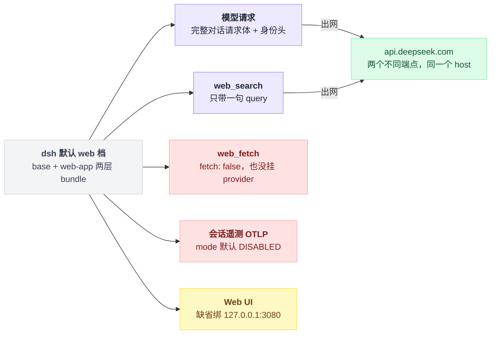
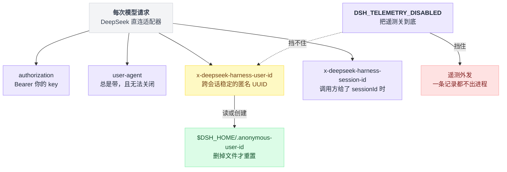
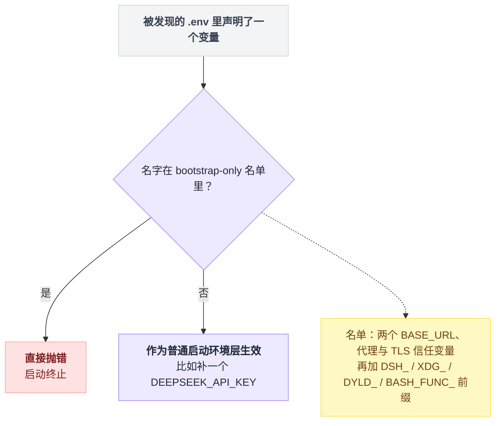
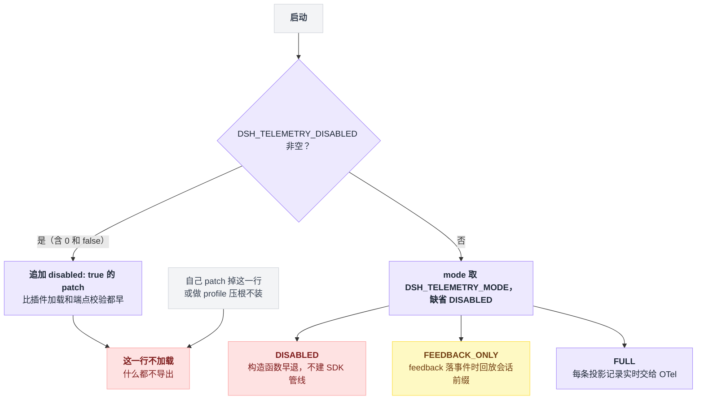
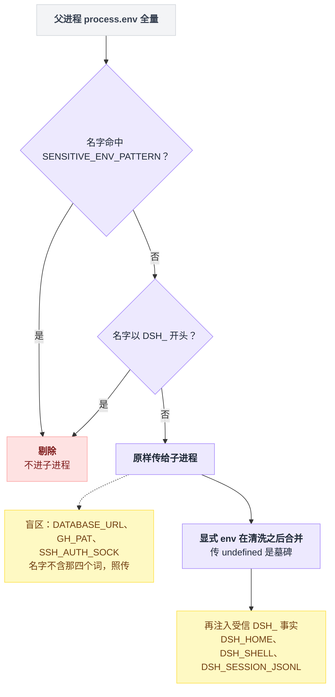

# 24 · 遥测与数据边界

> 基于 `deepseek-ai/deepseek-harness` v0.1.0-rc.5（commit `47f9438`），2026-08-14 核对。正文只讲机制；可照抄的配置和插件统一收在文末[附录](#附录可以照抄的模板)，出处一律放在文末[脚注](#出处)，点角标可跳转。

翻 dsh 的配置文件，会撞见一行明晃晃的端点：`harness-telemetry.deepseeksvc.com`。第一反应通常是：装上它就在往外传。

反过来的误解也同样常见：把遥测开关关到底，就以为一个字节都不会离开这台机器。

两个都不对。前者错在那一行是**挂载但禁用**的；后者错得更隐蔽——最大的出网通道根本不在遥测里，而且有一个标识**不受遥测开关控制**。

合规评审真正关心的只有一个问题：跑一次 dsh，哪些字节可能离开这台机器，哪些字节落到了磁盘上。这一章把这条边界从头到尾摸一遍，顺便说清默认状态下能关什么、关不掉什么、以及要在哪个位置挂脱敏。读完你应该能对着评审表逐行打勾，而不是回去猜。

先交代方法论：本仓库未安装依赖、未运行过任何命令，**下面每条结论都来自静态阅读源码与配置文件，没有抓包验证**。凡是「文档这么说、代码里没确认」的地方我都单独标出来了。

---

## 默认状态下只有两条路出网

一个带联网搜索、带 Web UI、还带遥测配置的 agent harness，出网通道听起来该有一大把。摊开数一遍，其实就这么几条：两条真出网、两条挂着但没启用、一条只绑在回环上。

先说「默认组合」指什么：`web` 档的两层 bundle，`@deepseek-ai/dsh-base` + `@deepseek-ai/dsh-web-app`。base 那层挂了 **78 个插件条目**；`headless` 档是 base + `@deepseek-ai/dsh-headless`，后者整份只有 35 行，没有任何出网行[^1]。



把每条通道的默认状态摊开是这样[^2]：

| 通道 | 默认状态 | 目标地址 | 传的内容 |
|---|---|---|---|
| 模型请求（DeepSeek 直连） | **开** | `https://api.deepseek.com/chat/completions` | 完整对话请求体 + `authorization` + 最多 4 个归因/身份头 |
| `web_search` 工具 | **开** | `https://api.deepseek.com/anthropic/v1/messages` | 见下方拆解 |
| `web_fetch` 工具 | **关**（`fetch: false`，且未挂任何 fetch provider） | — | — |
| 会话遥测（OTLP，即 OpenTelemetry 的传输协议） | **关**（`DISABLED`） | 默认端点明文写在配置里：`https://harness-telemetry.deepseeksvc.com/v1/logs` | 见后文 |
| Web UI 监听 | 本机回环 | 缺省 `127.0.0.1:3080` | — |
| 崩溃上报 | **不存在** | — | — |
| 版本更新检查 | **不存在** | — | — |
| MCP / hook 桥 / 外部 subagent 代理 | **未挂载** | — | — |

崩溃上报和更新检查的证法见「没有的东西」一节；MCP 那一行的依据是 base 的 78 个 id 里没有它们，web-app 那层也没有。

**默认能真出网的只有两条：模型请求和 `web_search`，目标都是 `api.deepseek.com`。**

Web UI 那行还有一条硬编码的安全闸。`--host` / `--port` 可以改绑定，但 `--host 0.0.0.0` 会被直接判为用法错误并拒绝启动，理由就写在报错文案里：「it would expose remote code execution to the network」[^3]。

### `web_search` 出去的只有那句 query

这条通道容易被误读成「联网搜索 = 把会话发出去」。

不是的。请求体的类型被写成定长元组，`messages` 恰好一条 user 消息，整份文件只有一处 `fetch()`。构造出来大致是这个形状[^4]：

```
body = {
  model:      'deepseek-v4-flash',      // 默认值
  max_tokens: 4096,                     // 默认值
  tools:      [ { type: 'web_search_20250305', name: 'web_search', max_uses } ],   // 固定一项
  messages:   [ { role: 'user', content: `Perform a web search for the query: ${query}` } ],
}
fetch(端点, body)                        // 整份文件唯一的一次 fetch
```

四个字段里只有一个装你的数据，就是 `messages` 里那句拼进去的 query。

凭据用的是同一个 `DEEPSEEK_API_KEY`，但端点不共用，源码注释明写「only the API key is shared」[^5]。

---

## 最大的一条出网通道，是模型请求本身

做合规评估最容易只盯着遥测那一行，然后漏掉最大的那条：每一次模型请求。你跟模型说的每句话、它读到的每个文件片段，本来就要整包发去 `api.deepseek.com`——这不是泄漏，是产品本身。要审的是跟着请求一起走的**身份头**。

DeepSeek 直连适配器每次都会发这些头[^6]：

| 头 | 值 | 何时带 |
|---|---|---|
| `authorization` | `Bearer <你的 key>` | 总是 |
| `user-agent` | `deepseek-harness/<version> (+https://github.com/deepseek-ai/deepseek-harness)` | 总是，且**无法关闭** |
| `x-deepseek-harness-user-id` | 匿名 UUID | 凭据解析成功后总是（先解析 key、再取 id）[^6] |
| `x-deepseek-harness-session-id` | 当前 `Session.id` | 调用方给了 `sessionId` 时 |
| `x-deepseek-harness-compact` | `1` | 这次请求是压缩用途时 |

`user-agent` 由归因头生成函数产出，它的 JSDoc 把话说死了：「omission cannot suppress attribution」。好在应用身份常量里只有产品名、版本、仓库 URL 三个字段，没夹带别的[^7]。

真正要留意的是 `x-deepseek-harness-user-id`：它是一个**跨会话稳定的匿名标识，而且不受遥测开关控制**。

设计说明写得很直白——「the first authorized provider request can create it even when `DSH_TELEMETRY_DISABLED` is set」，以及「SessionTelemetryBackend sharing controls only telemetry export and does not disable provider request identity」[^8]。

你把遥测关到底，这个 id 照发。**遥测开关管的只是遥测外发这一件事，管不住模型请求自带的身份头。**边界画出来是这样：



它的物理形态倒是很好处理[^9]：

| 问题 | 答案 |
|---|---|
| 文件在哪 | `$DSH_HOME/.anonymous-user-id`，缺省即 `~/.dsh/.anonymous-user-id` |
| 内容是什么 | 一行 UUID v4，用运行时的加密级随机数生成 |
| 会不会派生自机器信息 | **不会**，不从主机名、网络地址、git remote 或任何其它可识别来源派生 |
| 作用域 | harness home，不是机器；共用同一个 `$DSH_HOME` 的进程报同一个 id |
| 怎么重置 | 删掉文件，下次启动重新生成 |
| 运行中删掉呢 | 不影响本次，进程内有 memo |

顺带一句：如果你把 `baseURL` 指到自建网关，这两个头一样会发给网关——同一份设计说明写着「A configured gateway receives them.」[^8]

### 陌生仓库的 `.env` 改不动你的端点

上面两条通道的目标地址由 `DEEPSEEK_BASE_URL` 和 `DEEPSEEK_SEARCH_BASE_URL` 决定。那么最直接的攻击就浮出来了：clone 一个陌生仓库，里面塞一个 `.env`，把你的端点指到第三方——整个会话就送出去了。

dsh 显然想到了这一层，所以启动器把这两个变量连同一整排「网络可达性与信任」变量、再加上四个前缀，一起列进了 **bootstrap-only 名单**：这些名字只能来自继承的进程环境，任何被发现的 `.env` 声明了它们就直接抛错[^10]。

落到单个变量身上，判定只有两个出口：

```
BOOTSTRAP_ONLY = { DEEPSEEK_BASE_URL, DEEPSEEK_SEARCH_BASE_URL,
                   HTTP_PROXY, HTTPS_PROXY,
                   NODE_TLS_REJECT_UNAUTHORIZED, SSL_CERT_FILE }
BOOTSTRAP_PREFIX = [ 'DSH_', 'XDG_', 'DYLD_', 'BASH_FUNC_' ]

for name in 被发现的 .env 里声明的每个变量:
    if name in BOOTSTRAP_ONLY or name 以 BOOTSTRAP_PREFIX 之一开头:
        throw          // 直接抛错、启动终止，不是忽略也不是警告
    else:
        作为普通启动环境层生效     // 比如补一个 DEEPSEEK_API_KEY
```



于是那个攻击落空了：陌生仓库的 `.env` 既改不了你的模型端点，也打不开你的遥测——`DSH_TELEMETRY_MODE` 命中 `DSH_` 前缀。

---

## 遥测默认是关的，而且有三种关法

三种关法不是并列的三个选项，它们生效在不同的位置：一个在启动前就把这一行 patch 掉，一个在配置层给默认值，一个干脆不装这一行。



### 端点明文写死在 bundle 配置里

开头那个吓人的端点就在这儿，不用抓包也能看见它要往哪发：那一行插件配置的原文照录在[附录 A](#a-遥测行在-base-bundle-里的原文)，端点地址、gzip 压缩、攒批参数全部明文[^11]。

看到这一行挂在那儿别紧张，它是**挂载但禁用**。`DISABLED` 分支在构造函数里直接早退，provider 置空，OTel 的 provider / processor / exporter 一个都不建。README 的说法是「No coordinator, provider, processor, or exporter is constructed. No telemetry record leaves the process.」[^12]

那为什么不干脆删掉这一行？为了让 `/feedback` 还能告诉你「什么都没有共享」：「The shared dsh base keeps the backend row mounted so disabled feedback can still explain that nothing was shared.」[^13]

### 三种模式

三种取值的行为差异是[^14]：

| `mode` | 行为 |
|---|---|
| `DISABLED` | **默认**。不构造 SDK 管线，一条记录都不出进程 |
| `FEEDBACK_ONLY` | 平时什么都不交出去；`/feedback` 落下 `feedback/record` 事件时，回放**截至该事件（含）**、且尚未交接过的那一段会话日志 |
| `FULL` | 每条投影后的记录（会话事件的镜像）实时交给 OTel SDK |

「投影」在这里是个具体动作：协调器把会话事件转成一条 `SessionTelemetryRecord` 再交出去，转的过程中会丢掉重复的流式 chunk（下一节详述）。

默认值来自两处，任缺一处都还是 `DISABLED`——Schema 上 `mode` 字段的默认值指向一个常量，而那个常量本身就定义成 `DISABLED`[^15]。

写错值也不会被悄悄当成默认吞掉：走配置层由 Schema 的枚举校验挡下，绕开 Schema 直接构造则在解析模式那一步穷举失配、直接抛错[^15]。

### 两个环境变量，语义完全不同

两个开关的语义要分清[^16]：

| 开关 | 语义 |
|---|---|
| `DSH_TELEMETRY_MODE` | **正向同意**。不设 / 设空串都落回 `DISABLED`（或运算的短路） |
| `DSH_TELEMETRY_DISABLED` | **硬关**。任何非空值都算关，**包括 `'0'` 和 `'false'`** |

`'0'` 和 `'false'` 也算关，这个反直觉，但源码注释给了理由：「a privacy switch prefers off-by-mistake over on-by-mistake」[^16]。隐私开关宁可误关，不可误开。

硬关的实现是启动前给这一行追加一个 `disabled: true` 的 patch，比插件加载和端点校验都早；变量是空串、或者组合里压根没挂遥测这一行时，它什么都不做[^16]。

### 不想依赖环境变量，就自己 patch 掉这一行

`disabled` 是 patch 层的合法字段，加载器在初始化前就检查它并直接返回[^17]。所以在家目录的 patch 文件里写三行就够了，照抄[附录 B](#b-三行关掉遥测的家目录-patch)。

这与 launcher 自己生成的那个 patch 是同一形状、同一个 patch 栈——家目录层排在 profile 层之后、命令行 patch 之前；profile 自带的模板文件也把它列为合法用法之一：「id-targeted config overrides, disables, and insert lists」[^18]。

还想更彻底，就自己做 profile，压根不装这一行——判断要不要打 patch 的那个函数旁边就写着「A composition without the telemetry row exports nothing」[^19]。做 profile 的手艺见 [22 章](./22-做一个bundle和profile.md)。

### `--dump-config` 在这件事上会骗你

关完了想确认关没关上？查配置的标准手段是 `--dump-config`，但对遥测这一行，它给你的答案不可信，两个原因叠加[^20]。

一是它不求值 `!!js` 表达式，模块头就写着 "without booting or evaluating `!!js`"，所以你看到的是那行表达式的字面原文（见附录 A 里 `mode` 那行），不是解析结果。

二是 `DSH_TELEMETRY_DISABLED` 生成的 overlay 只在启动路径的组合函数里追加，dump 的图层列表里根本没有这一步。

运行期唯一的确认途径是 `/feedback` 的回执。它读挂载后端的 `sharing` 属性，输出三句之一[^21]：

```
Session sharing is disabled.
Session sharing is feedback-gated; recording feedback releases the session prefix for sharing.
Session sharing is enabled.
```

没挂遥测服务时是第四句：「Session sharing is not configured.」[^21]

但这个查法本身带副作用，用之前想清楚。

`/feedback` 必须带文本（「Usage: /feedback <text>」，空输入直接返回用法错误、不落事件）。带了文本就会往会话日志里追加一条 `feedback/record`——而在 `FEEDBACK_ONLY` 模式下，这一条恰恰就是触发上传的那个动作。回执里还会连带打印当前的匿名 user id[^21]。

---

## 一旦打开，传出去的是会话事件全文

「遥测」这个词容易让人以为传的是些计数器、耗时之类的运维指标。dsh 的遥测不是那个东西——同一条会话事件走两路：一路直接落盘，一路投影成记录再外发，脱敏只挂在后一路上。

```
for 每条会话事件 e:
    append(session.jsonl.zstd, e)          // 一路：全文落盘，从不被改写

    if mode == DISABLED: continue          // 另一路：投影 → 脱敏 → 外发
    if e 是 assistant/chunk 且这个 (turn, step) 已经出过第一条: continue
    if e 属于 resume/fork 继承来的历史前缀: continue

    rec = {
      channel, time, severity,
      attributes: { session.id, event.type, event.seq, ... },
      body: structuredClone(e.data),       // 全量深拷贝，不裁任何字段
    }
    rec = waterfall('session-telemetry/record', rec, () => rec)   // 缺省一条规则都不带
    if mode == FULL:          实时交给 OTel exporter
    if mode == FEEDBACK_ONLY: 攒着，等 feedback/record 事件再回放这一段
```



```mermaid
flowchart TD
    EV["<b>会话事件 append</b><br/>user/message、tool/call、request/header"]
    LOG["<b>session.jsonl.zstd</b><br/>全文落盘，从不被改写"]
    PRJ["<b>投影</b><br/>每个 turn 加 step 只留第一条 chunk"]
    REC["<b>SessionTelemetryRecord</b><br/>body 是 event.data 的完整深拷贝"]
    RD["<b>waterfall session-telemetry/record</b><br/>base 一条规则都不带，next 原样返回"]
    OUT["<b>OTel exporter</b><br/>harness-telemetry.deepseeksvc.com/v1/logs"]
    N1["脱敏只改外发副本<br/>canonical 日志不受影响"]
    N2["监听器抛异常等于这条被扣下<br/>fail-closed，不打断 agent loop"]

    EV -- "写" --> LOG
    EV -- "镜像" --> PRJ
    PRJ --> REC --> RD --> OUT
    RD -.-> N1
    RD -.-> N2
    N1 -.-> LOG

    classDef main fill:#ede9fe,stroke:#a78bfa,color:#1f2937
    classDef data fill:#dcfce7,stroke:#86efac,color:#14532d
    classDef entry fill:#f3f4f6,stroke:#d1d5db,color:#374151
    classDef danger fill:#fee2e2,stroke:#fca5a5,color:#7f1d1d
    classDef note fill:#fef9c3,stroke:#fde047,color:#713f12
    class EV entry
    class PRJ,REC,OUT main
    class LOG data
    class RD,N1 note
    class N2 danger
```

一条记录的结构是这样的[^22]：

| 字段 | 内容 |
|---|---|
| `channel` | `ledger`（会话日志镜像）或 `ops`（运维信号） |
| `time` | epoch 毫秒 |
| `severity` | `info` / `warn` / `error` |
| `attributes` | 仅身份：`session.id`、`event.type`、`event.seq`，加上 header 里有的 `session.cwd`、`session.parent_id`、`session.seed_length` |
| `body` | **会话事件 `data` 的完整深拷贝** |

关键在 `body`。它是对事件 `data` 的一次全量深拷贝，没有任何字段裁剪[^23]。也就是说下面这些会原样离开进程[^24]：

- `user/message` 的 `content` 全文
- `tool/call` 的 `arguments` —— 「the raw `arguments` JSON string exactly as the model produced it (unparsed)」
- `request/header` 里的 `system`（**渲染后的完整系统提示词**）与 `tools`（**完整工具 schema**）
- 工具结果（命令输出、文件内容）、todo 文本、压缩摘要、hook 的 `stderrSummary`、feedback 文本，以及 `session.cwd` 这个本地路径

这份清单不是我推的，包 README 直接列在那儿。Resource 上还会额外挂一次 `user.id`，就是前面那个匿名 UUID[^25]。

**被裁掉的只有两类。** 一是流式 chunk，每个 `(turn, step)` 只发第一条 `assistant/chunk`，其余丢弃——所以 `seq` 出现空洞是正常现象，不是丢包信号。二是 resume / fork 继承来的历史前缀，它在上一个进程或父会话的流里已经出过，不重发[^26]。

**结构性不会出现的**是 provider API key：适配器的 key 是构造参数、不是会话事件，因此结构上不进日志，也就不进遥测[^25]。

### 一条脱敏规则都不带，这是明写的缺省

脱敏点是一个 waterfall（洋葱式中间件事件，机制见 [11 章](./11-waterfall专章.md)）。seam（本仓库术语，指「只声明契约、由某个后端实现」的那一层）自己一条规则都不带：协调器把记录交给这个事件时，最内层的兜底回调就是「把记录原样返回」——没人挂规则，出去的就是进来的[^27]。

README 的「Known Limitations」把后果写死了：「with no `sessionTelemetry/record` listener mounted, records leave the process exactly as captured, **including any credentials embedded in file contents or command output**」[^28]。

CLI 参考手册是同一口径：「The shipped base has no telemetry redaction rule, so explicitly enabled exports can contain message text, tool arguments and results, and workspace paths」[^28]。

所以要脱敏就得自己挂。仓库里有个真实可读的形状——e2e fixture 里那个全文 29 行的抹除插件，[10 章](./10-事件系统.md)讲 capability 域事件时已经拆过它的挂法。[附录 C](#c-一个完整的遥测脱敏插件)给了一份改了正则与占位符的完整版，连挂载配置一起，直接照着改就能用[^29]。挂载方式和其它本地插件没有区别，见 [06 章](./06-你的第一个插件.md)。

有三点语义得记住，都写在 seam 声明的 JSDoc 里[^30]：

| 语义 | 说明 |
|---|---|
| fail-closed | 监听器**抛异常等于那条记录被扣下**，而且不会打断 agent loop |
| 只改副本 | 脱敏只作用于**外发副本**，canonical 会话日志**从不被改写** |
| 规则取当时那套 | `FEEDBACK_ONLY` 是在 feedback 触发回放时才跑规则，用的是**当时挂着的**那套 |

### 事件名有个坑，照 README 抄会监听不到

源码里的声明是 `session-telemetry/record`，协调器派发时用的也是它；而两个 README 正文里写的是 `sessionTelemetry/record`[^31]。

这两份 README 明显被批量改名污染过。同样的痕迹还有 instrumentation scope 名被写成 `@deepseek-ai/dsh-session-sessionTelemetry-otel`，以及把日志文案写成「session sessionTelemetry is DISABLED」（真值以源码里的常量为准）[^31]。

**这两份 README 里凡是标识符，一律以源码为准。**

---

## 会话日志：路径公开、内容全量、没有脱敏

网络这条边界看完了，回头看磁盘——这边比网络那边松得多。

默认落盘路径是 `~/.dsh/sessions`：bundle 配置里那一行把根目录解析到 harness home 之下，而 harness home 就是 `$DSH_HOME`、缺省 `~/.dsh`[^32]。目录结构长这样[^32]：

```
~/.dsh/sessions/
  --<归一化后的 cwd>--/        # 或 _no-cwd/
    <编码后的 session id>/
      session.jsonl.zstd        # 默认：zstd 压缩
      session.jsonl             # 仅当 compression: 'none'
```

逐个问题过一遍[^33]：

| 问题 | 答案 |
|---|---|
| 存的是什么 | 首行是 `SessionHeader`（含可选的 `cwd`），其后每行一条 `SessionEvent` **JSON 原文**（或打包后的 chunk 行） |
| 含 prompt 全文吗 | 含。`user/message.content`、`request/header.system` 全都在 |
| 含工具参数吗 | 含。`tool/call.arguments` 是模型产出的原始 JSON 字符串 |
| 有脱敏吗 | **没有**。脱敏 waterfall 只在遥测外发路径上；「the canonical session log is never rewritten」 |
| 能直接 grep 吗 | 默认不能：zstd 压缩 + chunk 打包（`packChunks` 默认 `true`，`compression` 默认 `'zstd'`） |
| 会被覆盖吗 | 已 flush 的事件不重写，append-only，写入 `fsync`。唯一例外是崩溃恢复：末尾那个**不完整**的帧会被截断并重新编码 |

默认组合里还有几个落盘点，一并列出[^34]：

| 内容 | 位置 | 关键事实 |
|---|---|---|
| API key 文档 | `$DSH_HOME/.credentials.yaml` | 写入 `0600`、目录 `0700`；读到 group/other 位就**抛错**，报错文案让你 `chmod 600` 后重来 |
| 超长工具输出（spill） | 缺省是 OS 临时目录下一个 `0700` 私有目录 | 文件以 `0600` 独占创建（已存在就报错）；入库阈值 `maxInlineBytes: 50000` |
| 全文检索索引 | **默认不落盘**：`path: ':memory:'` + `openAt: never` | 搜索调用直接失败返回 `SESSION_QUERY_SEARCH_DISABLED` |
| Web 端 storage | `~/.dsh/storages` | — |
| 匿名 id | `$DSH_HOME/.anonymous-user-id` | — |

凭据的解析顺序是「继承环境 → `$DSH_HOME/.credentials.yaml` → 调用目录的 `.env` → `$DSH_HOME/.env`」，且**托管文档不会被灌进 `process.env`**，两个 `.env` 则是普通的启动环境层[^35]。

这里要和前面那份 bootstrap-only 名单叠着看：`.env` 能补一个 `DEEPSEEK_API_KEY`，但补不了 `DEEPSEEK_BASE_URL`。

运行日志方面没什么可查的——三个 bundle（base / web-app / headless）的补丁配置里没有任何 logger 行，全仓一把 grep 下去零输出[^36]，默认不落盘。

会话日志本身怎么读、怎么 fork，见 [16 章](./16-会话日志与分叉.md)。

---

## 子进程只挡四个词，剩下的照传

模型跑的每条 bash 命令都会继承一份环境变量。你可能指望 harness 在这儿做了精细的白名单——没有。所有 harness 子进程（bash / pwsh / 后台任务 / node-pty）共用的清洗定义就一个正则加一个前缀：名字命中 KEY / PASSWORD / SECRET / TOKEN 四个词之一（大小写不敏感）就剔除，名字以 `DSH_` 开头（统一转大写比较）也剔除，其余全部照传[^37]。归纳成四条：

| 规则 | 说明 |
|---|---|
| 名字命中 `/KEY\|PASSWORD\|SECRET\|TOKEN/i` → 剔除 | `DEEPSEEK_API_KEY`、`AWS_SECRET_ACCESS_KEY`、`GITHUB_TOKEN`、`NPM_CONFIG_.../:_authToken`（含 `Token`）都命中 |
| 名字以 `DSH_` 开头（大小写不敏感）→ 剔除 | 防止 harness 身份隐式泄漏；Windows 环境名大小写不敏感所以统一 upper 比较 |
| 其余全部保留 | `PATH`、`HOME`、locale、**代理变量**都留着，子进程 CLI 才能正常跑 |
| 显式 `env` 在清洗**之后**合并 | 想放行某个 key 就显式传；传 `undefined` 是墓碑，删掉一个普通变量 |

合并逻辑在 spawn 那一层，Windows 分支还额外做大小写归一去重[^38]。

把这两道判定和它后面的两步接起来，一个变量的命运是这样定的：

```
child_env = scrubbedParentEnv()                  // 两道剔除：四个词 + DSH_ 前缀
child_env = { ...child_env, ...显式传入的 env }   // 清洗之后才合并；undefined = 墓碑

child_env += { DSH_HOME, DSH_SHELL: '1' }        // 反向注入的受信事实
if 是 agent 调用:                child_env += { DSH_SESSION_ID }
if 持久化 seam 能定位到 JSONL:    child_env += { DSH_SESSION_JSONL: '<绝对路径>' }
```



那组受信事实的定义是：模型发起的 shell 调用会被塞进 `DSH_HOME`、`DSH_SHELL=1`，agent 调用另加 `DSH_SESSION_ID`，以及当持久化 seam 能定位到 JSONL 时的 `DSH_SESSION_JSONL`（值是绝对路径）[^39]。

换句话说，**模型跑的每条命令都知道你的会话日志在哪**。README 明说这是位置提示、不是授权凭证，但做威胁建模时它是一条真实的信息通路（权限那一层怎么兜，见 [18 章](./18-沙箱审批与权限.md)）。

最容易踩的是把这个正则当白名单用。它是启发式，源码注释自己就这么称呼：「One heuristic for every in-repo spawner」[^37]。

只要名字不含那四个词就原样传给子进程——拿正则逐个试过去，`DATABASE_URL`（连接串里带口令）、`GH_PAT`、`SSH_AUTH_SOCK`（等于把 ssh-agent 转发给了子进程）全都漏过去。要挡住某个变量，只能在启动 dsh 前就不让它进 `process.env`。

---

## 没有的东西：崩溃上报、更新检查、第三方分析 SDK

「没有」比「有」难证明——不能翻一遍没看见就下结论。这里的证法是拿关键词把全仓扫穿。在 2026-08-14 的 HEAD 上跑这四条（第一条的 `-w` 必须带，否则 `-i` 会把 `isEntry` 当成 `sentry` 匹配上）：

```bash
grep -rniIwE "sentry|bugsnag|posthog|amplitude|mixpanel|google-analytics" --exclude-dir=.git .
grep -rn "registry.npmjs.org\|checkForUpdate\|latestVersion" --include="*.ts" packages/ apps/
grep -rn "DSH_TELEMETRY" packages/sdk/ python/
grep -rniI "fonts.googleapis\|cdn.jsdelivr\|unpkg.com\|cdnjs\|gstatic" --exclude-dir=.git .
```

| grep | 命中 | 说明 |
|---|---|---|
| 第一条（分析 SDK） | 正好 2 条 | 同一篇 Agent Note 的中英两版[^40]，内容是拿 Sentry 的 MCP 工具名 `search_issues` 举例讨论命名冲突，没有任何代码或依赖 |
| 第二条（更新检查） | 零命中 | — |
| 第三条（SDK 侧遥测） | 零命中 | — |
| 第四条（CDN / 外部字体） | 只命中开发期工具配置里的一个 `$schema` 字段[^41] | 不参与运行 |

于是可以说：

- **没有崩溃上报**。进程崩了不会有任何东西发出去。`agent/error` 只有在遥测处于 `FULL`（即 `live` 捕获模式）时才作为 ops 记录外发，`on-demand` 模式压根不注册这个中继[^42]；默认状态下它只是本地一条日志。
- **没有版本更新检查**，启动不联网查新版本。
- **唯一的第三方遥测 SDK 是 OpenTelemetry JS**，6 个包：`@opentelemetry/api`、`api-logs`、`exporter-logs-otlp-http`、`otlp-exporter-base`、`resources`、`sdk-logs`[^43]，且 `DISABLED` 下连对象都不构造。
- **前端没有任何 CDN / 外部字体引用**（第四条 grep）。
- `@anthropic-ai/claude-agent-sdk` 只被 `packages/subagent/subagent-claude-code` 依赖，全仓唯一，而该包不在任何 bundle 的 id 列表里——不挂就不会有它的网络行为。

还有一条历史包袱要澄清，不然你读设计文档会被绕进去。

文档里提到过第二条遥测通路「dsh-sdk launcher feed」，但同一篇 note 后文写明「before the launcher and its proposal were deleted by the SDK project toolchain removal」，删除本身另有记录[^44]。

rc.5 里第三条 grep 零命中。**这条通路在本版本已不存在**，只是那篇 note 的正文没跟着改。

---

## 合规核对表

直接抄给评审，每行都能自查：

| # | 问题 | rc.5 的答案 | 怎么复核 |
|---|---|---|---|
| 1 | 默认有几条出网通道 | 2 条：模型请求、`web_search`（同一个 host `api.deepseek.com`，两个不同端点） | 适配器与搜索 provider 的请求发出点[^2] |
| 2 | 遥测默认开还是关 | **关**（`DISABLED`） | 模式常量与 Schema 默认值[^14][^15] |
| 3 | 遥测端点是什么、写在哪 | `https://harness-telemetry.deepseeksvc.com/v1/logs`，明文写在 bundle 配置里 | 附录 A 那行配置[^11] |
| 4 | 怎么彻底关掉 | 设任意非空 `DSH_TELEMETRY_DISABLED`；或 patch `disabled: true`；或不装这一行 | 启动器的 patch 函数[^16] |
| 5 | 开了之后传什么 | 会话事件 `data` 全量：prompt 全文、工具参数与结果、系统提示词、工具 schema、`cwd` | 包 README 的明细清单[^25] |
| 6 | API key 会被上传吗 | 不会，结构上不进会话日志 | 同一份 README[^25] |
| 7 | 有内置脱敏吗 | **没有**，一条规则都不带，要自己挂 waterfall | README 的 Known Limitations[^28] |
| 8 | 有不受遥测开关控制的标识吗 | **有**：`x-deepseek-harness-user-id` + `x-deepseek-harness-session-id` | 设计说明原话[^8] |
| 9 | 那个匿名 id 怎么重置 | 删 `$DSH_HOME/.anonymous-user-id` | id 模块的路径与重置语义[^9] |
| 10 | 会话日志存哪 | `~/.dsh/sessions/--<cwd>--/<id>/session.jsonl.zstd` | bundle 配置与持久化 README[^32] |
| 11 | 日志有脱敏吗 | **没有**；已 flush 的内容 append-only 不改写（崩溃恢复截断尾部残帧除外） | seam JSDoc 与持久化 README[^30][^33] |
| 12 | 日志里有 prompt 全文和工具参数吗 | **都有** | 持久化事件目录[^24] |
| 13 | 会话内容会被建索引吗 | 默认不会（`:memory:` + `openAt: never`） | bundle 配置那几行[^34] |
| 14 | 凭据文件权限 | `0600` / 目录 `0700`，权限过宽直接抛错 | 凭据模块[^34] |
| 15 | 子进程会继承 API key 吗 | 名字含 KEY/PASSWORD/SECRET/TOKEN 与 `DSH_*` 一律剔除；其余照传（`DATABASE_URL`、`GH_PAT`、`SSH_AUTH_SOCK` 会漏） | 清洗正则[^37] |
| 16 | 有崩溃上报吗 | **没有** | 上一节的四条 grep |
| 17 | 有更新检查吗 | **没有** | 同上 |
| 18 | Web UI 对外暴露吗 | 缺省绑 `127.0.0.1:3080`；`--host` 可改，但 `0.0.0.0` 被硬拒 | 绑定配置与启动检查[^2][^3] |
| 19 | 能从 `--dump-config` 读出遥测状态吗 | **不能**（`!!js` 不求值 + overlay 不进 dump），运行期用 `/feedback` 看（会写一条事件） | dump 模块头与图层列表[^20] |
| 20 | 产品里有没有开关遥测的引导界面 | 没有。`grep -rni "telemetry" docs/user/` 零命中；设计说明也写明「the product still presents no prompt about enabling upload」 | 那篇设计说明[^44] |
| 21 | 陌生项目的 `.env` 能改端点/开遥测吗 | 不能，两类名字都在 bootstrap-only 名单里，`.env` 声明即抛错 | 启动器的名单判定[^10] |

---

## 把整条边界串起来

回到开头那两个误解，现在应该能自己拆了：

- 配置里那行 `harness-telemetry.deepseeksvc.com` 不代表在上传，因为它**挂载但禁用**——`DISABLED` 分支早退，OTel 管线一个对象都不建，留着这行只是为了 `/feedback` 能回答「什么都没有共享」；
- 关掉遥测也不代表零外发，因为**最大的通道是模型请求本身**——身份头跟着每次请求走，`x-deepseek-harness-user-id` 明写着不受 `DSH_TELEMETRY_DISABLED` 控制，想重置只能删文件；
- 真开了遥测，出去的不是运维指标，是**会话事件 `data` 的完整深拷贝**——缺省一条脱敏规则都不带，要挂就挂 `session-telemetry/record` 这个 waterfall，名字别照 README 抄；
- 磁盘上的边界比网络上更松：**会话日志明文全量落盘、永不脱敏**，收紧的只有凭据文件那把 `0600` 的锁；
- 子进程那道闸是**启发式，不是白名单**——四个词加一个 `DSH_` 前缀，`DATABASE_URL`、`GH_PAT`、`SSH_AUTH_SOCK` 都照传；
- 剩下的是一串「没有」：没有崩溃上报、没有更新检查、没有分析 SDK、没有 CDN 引用——这不是宣传语，是四条 grep 的命中数。

压成一句话：**默认状态下 dsh 只往 `api.deepseek.com` 发东西，遥测是关的；但真正的数据边界不在遥测开关上，而在「模型请求本身带走一切」「会话日志明文全量落盘且永不脱敏」「子进程环境只挡四个关键词」这三处。**

---

## 附录：可以照抄的模板

### A. 遥测行在 base bundle 里的原文

端点、压缩、攒批参数全部明文，`mode` 那行就是 `--dump-config` 只会给你看字面原文的 `!!js` 表达式[^11]：

```yaml
# packages/bundle/base/cordis.patch.yml:148-161（原文缩进四格，在 base 的 insert 列表内）
- id: session-telemetry-otel
  name: '@deepseek-ai/dsh-session-telemetry-otel'
  config:
    mode: !!js process.env.DSH_TELEMETRY_MODE || 'DISABLED'
    shutdownTimeoutMillis: 3000
    exporter:
      url: !!js process.env.DSH_TELEMETRY_OTLP_URL ?? 'https://harness-telemetry.deepseeksvc.com/v1/logs'
      compression: gzip
      timeoutMillis: 1000
    processor:
      scheduledDelayMillis: 10000
      maxQueueSize: 2048
      maxExportBatchSize: 2048
      exportTimeoutMillis: 1500
```

### B. 三行关掉遥测的家目录 patch

不依赖环境变量的关法，与 launcher 生成的 patch 同一形状[^17]：

```yaml
# $DSH_HOME/cordis.patch.yml
- id: session-telemetry-otel
  disabled: true
```

### C. 一个完整的遥测脱敏插件

改编自仓库里的 e2e fixture，换了正则与占位符[^29]：

```ts
// 改编自 examples/headless-agent/tests/fixtures/telemetry-redact-rule.ts
import type { Context } from '@deepseek-ai/cordis'

const SECRET = /sk-[A-Za-z0-9]{16,}/g

function scrub(value: unknown): unknown {
  if (typeof value === 'string') return value.replace(SECRET, '[REDACTED]')
  if (Array.isArray(value)) return value.map(scrub)
  if (value !== null && typeof value === 'object') {
    return Object.fromEntries(Object.entries(value).map(([key, entry]) => [key, scrub(entry)]))
  }
  return value
}

export const name = 'telemetry-redact-rule'

export function apply(ctx: Context): void {
  ctx.on('session-telemetry/record', (_record, next) => {
    const record = next()
    return { ...record, body: scrub(record.body) }
  })
}
```

挂载方式和其它本地插件一样，配置里一行：

```yaml
- id: telemetry-redact-rule
  name: './telemetry-redact-rule.ts'
```

---

## 出处

[^1]: 档位组合：web 档在 `packages/boot/app-boot/src/profile.ts:115`，headless 档在 `:116`。78 这个数字来自 `grep -c "  - id:" packages/bundle/base/cordis.patch.yml`；35 行是 `@deepseek-ai/dsh-headless` 的 patch 文件全长。
[^2]: 通道总表各行的依据：模型请求在 `packages/llm/llm-deepseek/src/index.ts:104` 与 `adapter.ts:301`（请求发出点）；`web_search` 在 `packages/web/web-search-deepseek/src/provider.ts:35`（端点）与 `:204`（发出点）；`web_fetch` 关闭在 `packages/bundle/base/cordis.patch.yml:414-418`，未挂 fetch provider 在 `:399-401`；遥测行在 `:148-161`；Web UI 绑定在 `packages/bundle/web-app/cordis.patch.yml:119-120`。
[^3]: `--host 0.0.0.0` 的硬拒：`packages/bundle/web-app/src/startup.ts:48-49`（报错文案）、`:69-71`（判定）。
[^4]: `web_search` 请求体：元组类型与单条 user 消息 `packages/web/web-search-deepseek/src/provider.ts:62-77`，构造处 `:205-213`，`fetch()` 在 `:222`；`model` 默认值 `:38`、`max_tokens` 默认值 `:44`、`tools` 固定项 `:212`、user 文本 `:210`。
[^5]: key 共用、端点不共用：`packages/bundle/base/cordis.patch.yml:409-412`；「only the API key is shared」注释在 `provider.ts:29-33`。
[^6]: 身份头列表：`packages/llm/llm-deepseek/src/adapter.ts:283-295`；先解析 key、再取 id 的顺序在 `adapter.ts:221-222`。
[^7]: `attributionHeaders()` 的 JSDoc「omission cannot suppress attribution」：`packages/llm/llm/src/attribution.ts:61`；`APP_IDENTITY` 只有产品名、版本、仓库 URL 三个字段：`:40-44`。
[^8]: 设计说明 `.agents/notes/implemented/feature/2026-08-11-deepseek-request-user-id-header.md`：遥测关掉也会创建 id 在 `:17`，「does not disable provider request identity」与「A configured gateway receives them.」在 `:19`。
[^9]: 匿名 id 模块 `packages/identity/anonymous-user-id/src/index.ts`：重置语义在 `:9`，路径在 `:29`、`:69`，随机来源与「不派生」在 `:4-7`、`:75`（`crypto.randomUUID()`），作用域在 `:7-8`，进程内 memo 在 `:11-14`。
[^10]: bootstrap-only 名单：`DEEPSEEK_BASE_URL` 在 `packages/llm/llm-deepseek/src/index.ts:107`，`DEEPSEEK_SEARCH_BASE_URL` 在 `packages/web/web-search-deepseek/src/index.ts:82`；代理与 TLS 那一排在 `packages/boot/app-boot/src/index.ts:108-113`，四个前缀在 `:117`，名单判定与抛错在 `:93-114`（连同名单常量合起来即 `:93-117`）、`:125-128`、`:130-138`。
[^11]: 遥测行原文：`packages/bundle/base/cordis.patch.yml:148-161`，端点 URL 那一行是 `:154`。附录 A 即此段照录。
[^12]: `DISABLED` 早退、`provider` 置为 `undefined`：`packages/session/session-telemetry-otel/src/index.ts:160-168`；「No telemetry record leaves the process.」在该包 `README.md:26`。
[^13]: 保留这一行的理由：`.agents/notes/implemented/feature/2026-08-10-telemetry-default-off.md:13`。
[^14]: 三种模式：`DISABLED` 在 `packages/session/session-telemetry-otel/src/index.ts:51`、`:160-168`；`FEEDBACK_ONLY` 在 `:243-252` 与 `packages/session/session-telemetry/src/coordinator.ts:138-149`；`FULL` 在 `:237-241`。
[^15]: 默认值两处：Schema 上 `mode` 的默认值在 `packages/session/session-telemetry-otel/src/index.ts:120-121`，常量 `DEFAULT_TELEMETRY_MODE = SessionTelemetryMode.DISABLED` 在 `:51`；枚举校验在 `:121`，绕开 Schema 时 `resolveMode()` → `assertNever()` 抛错在 `:57-73`。
[^16]: 两个开关：`DSH_TELEMETRY_MODE` 的取值行在 `packages/bundle/base/cordis.patch.yml:151`；`resolveTelemetryPatch()`（空串或没挂这一行就返回 undefined，否则返回 `disabled: true` 的 patch）在 `apps/cli/src/profile-boot.ts:80-83`；「a privacy switch prefers off-by-mistake over on-by-mistake」注释在 `:70-72`。
[^17]: `disabled` 是 patch 层合法字段（`disabled?: boolean | null`）：`vendor/include/src/index.ts:145-156`；加载器初始化前检查并直接返回：`vendor/loader/src/config/entry.ts:104-107`、`:126`。
[^18]: patch 栈的层序（家目录层在 profile 层之后、`--patch` 之前）：`apps/cli/src/profile-boot.ts:122-128`、`:147`；profile 模板列出的合法用法：`packages/boot/app-boot/src/profile.ts:127-130`。
[^19]: 「A composition without the telemetry row exports nothing」：`apps/cli/src/profile-boot.ts:72-73`（`hasRow` 分支旁）。
[^20]: `--dump-config` 定义在 `apps/cli/src/args.ts:133`；「without booting or evaluating `!!js`」在 `apps/cli/src/dump-config.ts:2-6`；`DSH_TELEMETRY_DISABLED` 的 overlay 只在 `composeProfile()` 里追加：`apps/cli/src/profile-boot.ts:168-169`；`runDumpConfig()` 的图层列表：`apps/cli/src/dump-config.ts:32-49`。
[^21]: `/feedback` 模块 `packages/feedback/command-feedback/src/index.ts`：读 `sharing` 属性在 `:49-53`、`:92-96`，三句回执在 `:27-38`，第四句在 `:50-52`，用法错误（空输入不落事件）在 `:18`、`:88-90`，落 `feedback/record` 事件在 `:72-76`，回执打印匿名 user id 在 `:95`。
[^22]: 记录结构 `SessionTelemetryRecord`：`packages/session/session-telemetry/src/index.ts:64-87`。
[^23]: `body` 是 `structuredClone(event.data)`、无字段裁剪：`packages/session/session-telemetry/src/coordinator.ts:199`，上下文 `:191-202`。
[^24]: 原样外发内容的依据：`user/message.content` 全文在 `docs/persistence-catalog.md:928`（语义说明 `:924-927`）；`tool/call.arguments` 原文引文在 `:732-733`（字段在 `:736`）；`request/header` 的 `system` 与 `tools` 在 `packages/core/session/src/types.ts:206-209` 与 `docs/persistence-catalog.md:557`。
[^25]: 包 README 的明细清单与「API key 结构上不进日志」同在 `packages/session/session-telemetry-otel/README.md:38`；Resource 上挂 `user.id` 在 `packages/session/session-telemetry-otel/src/index.ts:197-205`（具体在 `:204`）。
[^26]: 只发第一条 chunk（`seq` 空洞正常）：`packages/session/session-telemetry/README.md:31`；resume / fork 前缀不重发：同一份 README `:27`。
[^27]: `redact()` 的实现就是派发 waterfall、兜底回调原样返回记录：`packages/session/session-telemetry/src/coordinator.ts:213-215`。
[^28]: 「Known Limitations」原话在 `packages/session/session-telemetry/README.md:48`；CLI 参考手册同一口径在 `apps/cli/reference/README.md:78`。
[^29]: fixture 原文 `examples/headless-agent/tests/fixtures/telemetry-redact-rule.ts`（全文 29 行）；fixture 自己的挂载在同目录 `session-telemetry-otel.cordis.yml:16-17`（`name: './telemetry-redact-rule.ts'`）。
[^30]: 三条语义写在 seam 声明的 JSDoc `packages/session/session-telemetry/src/index.ts:25-43`：只改副本、canonical 日志不改写在 `:37-38`；回放时用当时那套规则在 `:36-37` 与 `coordinator.ts:130-132`。
[^31]: 事件名以源码为准：声明 `session-telemetry/record` 在 `packages/session/session-telemetry/src/index.ts:43`，派发在 `coordinator.ts:214`；README 写错成 `sessionTelemetry/record` 的位置：`packages/session/session-telemetry/README.md:23`、`:35`、`:48` 与 `packages/session/session-telemetry-otel/README.md:38`；scope 名污染在 `README.md:5`，日志文案污染在 `:26`（真值见 `src/index.ts:53`）。
[^32]: 落盘路径：`packages/bundle/base/cordis.patch.yml:98-101`（`root` 那行是 `:101`，值为 `!!js dshHomePath('sessions')`）；`dshHomePath` 解析 `$DSH_HOME` → `~/.dsh` 在 `packages/util/home-paths/src/index.ts:12`、`:87-100`；目录结构在 `packages/session/session-persistence-jsonl/README.md:9-15`。
[^33]: 日志问答表各行：存什么在 `packages/session/session-persistence-jsonl/README.md:17-18`；prompt 全文在 `docs/persistence-catalog.md:928` 与 `packages/core/session/src/types.ts:206`；工具参数在 `docs/persistence-catalog.md:736`；「never rewritten」在 `packages/session/session-telemetry/src/index.ts:37-38`；压缩与打包默认值在 `packages/session/session-persistence-jsonl/README.md:5`、`:27-28`；append-only 在 `:44`、崩溃恢复截断在 `:45`（核对表引作 `:44-45`）。
[^34]: 其它落盘点：凭据文件 `packages/credentials/credentials-local/src/index.ts:52`（写入权限）、`:394`、权限过宽抛错 `:117-120`；spill `packages/spill/spill-local/README.md:11`、`:13` 与阈值配置 `packages/bundle/base/cordis.patch.yml:349-352`；全文检索索引 `:117-121`、搜索禁用返回值 `:109-116`；Web 端 storage `packages/bundle/web-app/cordis.patch.yml:54-57`；匿名 id `packages/identity/anonymous-user-id/src/index.ts:29`。
[^35]: 凭据解析顺序与「托管文档不进 `process.env`」：`apps/cli/reference/README.md:76`。
[^36]: `grep -rn "logger" packages/bundle/*/cordis.patch.yml` 无输出，退出码 1。
[^37]: 子进程清洗：`SENSITIVE_ENV_PATTERN = /KEY|PASSWORD|SECRET|TOKEN/i` 在 `packages/subprocess/subprocess/src/index.ts:44`，`scrubbedParentEnv()` 在 `:60-66`，「One heuristic for every in-repo spawner」注释在 `:37-43`；`DSH_ENV_PREFIX` 就是字符串 `'DSH_'`：`packages/subprocess/subprocess/src/types.ts:13`。
[^38]: 显式 `env` 的合并逻辑（Windows 分支大小写归一去重）：`packages/subprocess/subprocess-local/src/spawn.ts:37-47`。
[^39]: 受信事实的注入：`packages/shell/shell-env/README.md:20`。
[^40]: 命中的两条：`.agents/notes/implemented/feature/2026-07-07-mcp-client-plugin.md:178` 与 `.zh.md:178`。
[^41]: 第四条 grep 唯一命中：`knip.json:2` 的 `$schema`。
[^42]: `agent/error` 只在 `live` 捕获模式外发、`on-demand` 不注册中继：`packages/session/session-telemetry/README.md:19`。
[^43]: OpenTelemetry JS 的 6 个包：`THIRD_PARTY_NOTICES.md:42-47`。
[^44]: 「dsh-sdk launcher feed」见 `.agents/notes/implemented/feature/2026-08-10-telemetry-default-off.md:9`、`:13`；「before the launcher and its proposal were deleted…」在 `:15`；「the product still presents no prompt about enabling upload」在 `:17`；删除记录在 `.agents/notes/implemented/simplification/2026-08-11-remove-sdk-project-toolchain.md`。
