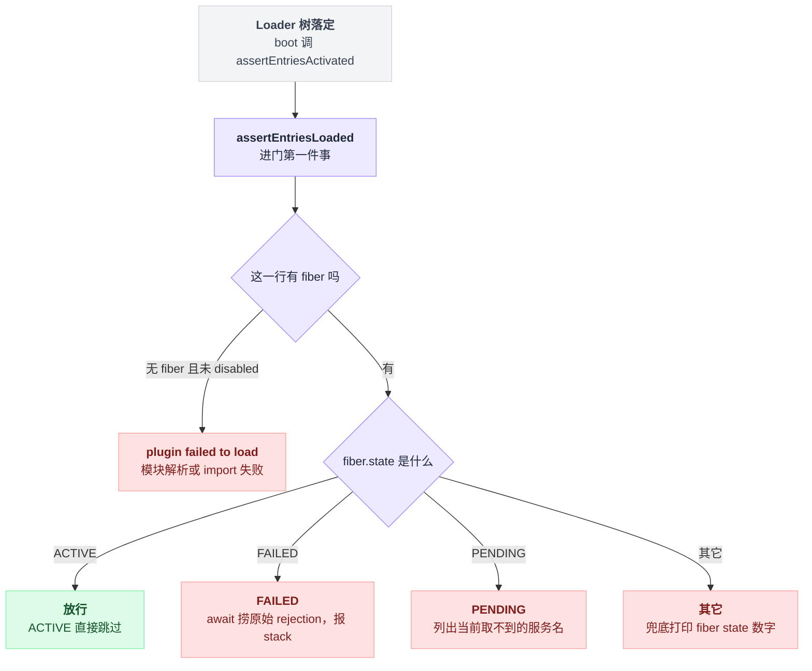
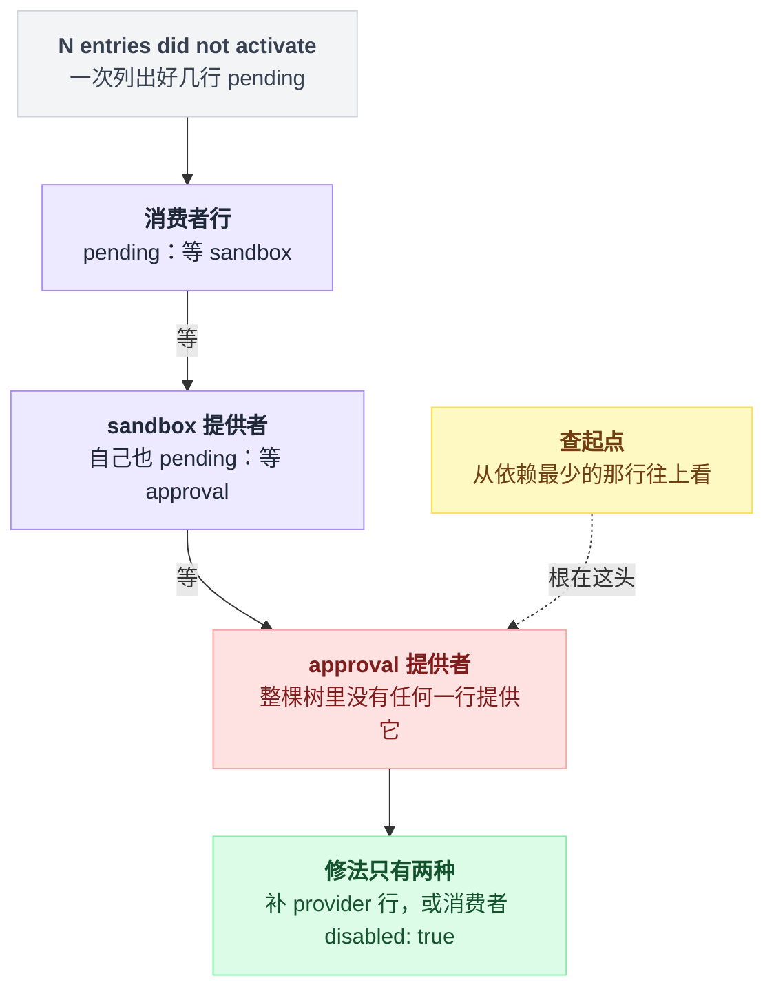
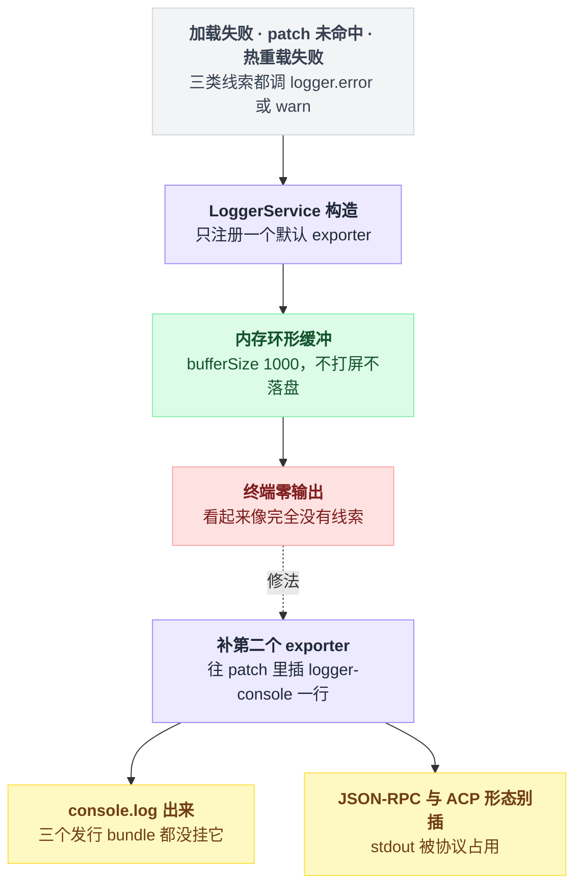
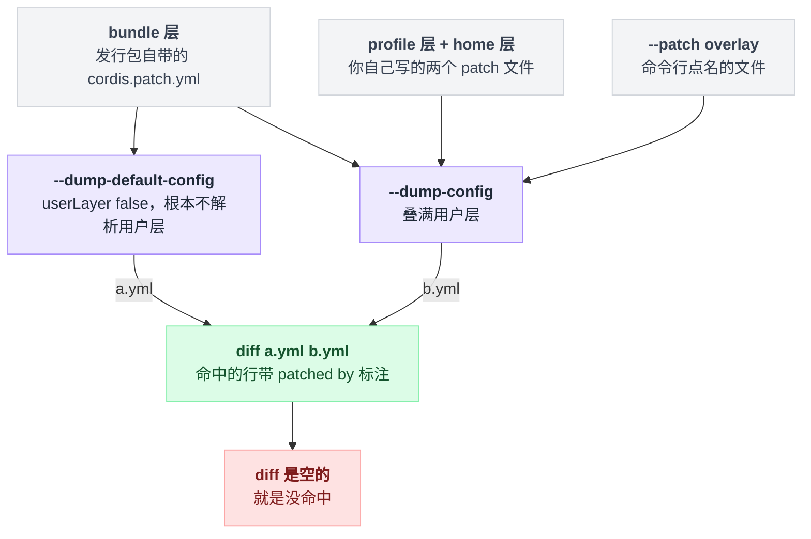
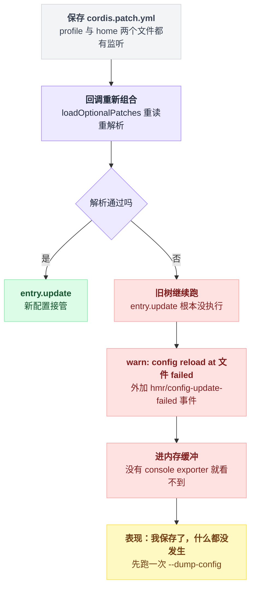
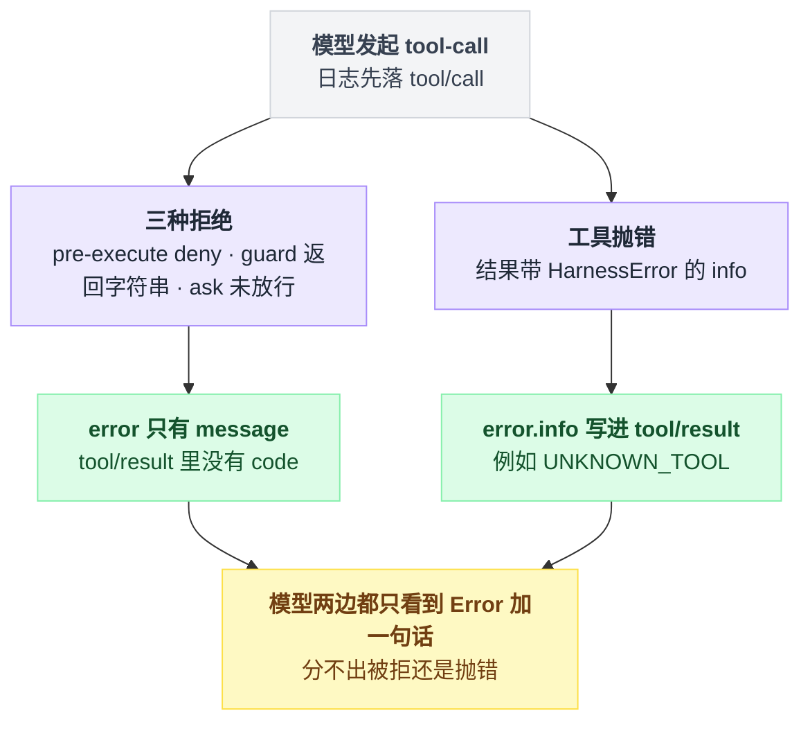
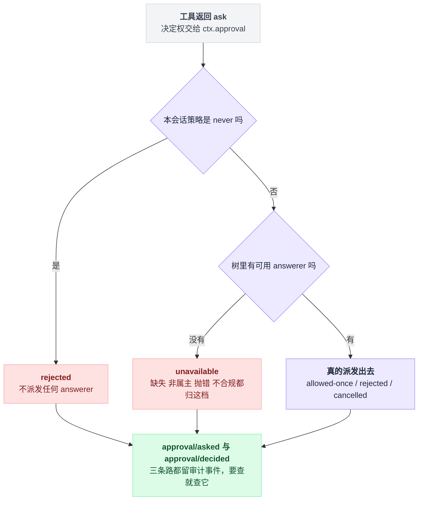

# 25 · 调试手册与常见坑

> 基于 `deepseek-ai/deepseek-harness` v0.1.0-rc.5（commit `47f9438`），2026-08-14 核对。本章是排障手册：排查命令和报错原文都留在正文里，可照抄的配置收在文末[附录](#附录可以照抄的模板)，出处一律放在文末[脚注](#出处)，点角标可跳转。

前面二十四章是顺着读的，这一章不是。你多半是带着一个具体症状翻过来的：进程一起来就退了、某个工具凭空消失了、patch 改了保存了却像没保存过、审批弹窗死活不出来。

动手之前，先拆一个几乎所有症状共用的误解：**"终端上没有报错，说明系统没报错。"**

不是的。dsh 出厂时没有挂 console 日志导出器，所有错误和警告日志都写进一个内存环形缓冲，你在终端上一个字都看不到。很多"完全没有线索"的故障，其实线索早就打出来了，只是没人把它接到 stdout。**先把日志接出来，再开始排查**——这件事在第 3 节，卡住的时候优先去看那一节。

本章其余部分按"症状落在启动 / 配置 / 运行哪一段"组织，每条给报错原文、发生位置、以及怎么自己确认一遍。

---

## 1. 先分诊：症状落在哪一段

dsh 一次启动的形状是这样的[^1]：

```
argv 解析 ──► 组 profile 补丁栈 ──► boot() ──► 挂 patch 文件监听 ──► 跑会话
  args.ts        composeProfile        app-boot        watchUserPatches
                 (bundle→profile→        │
                  home→--patch)          ├─ mountRootInclude  挂 cordis:include
                                         ├─ loader.await()    等整棵树落定
                                         └─ assertEntriesActivated  ← 断言在这
```

| 症状 | 落在哪段 | 看第几节 |
|---|---|---|
| 进程直接退出，stderr 一行 `dsh: …` | 启动 | 2 |
| 起来了但某个功能整块不在（工具没了 / 命令不存在） | 配置 | 4 |
| 改了 `cordis.patch.yml` 没反应，进程也没报错 | 配置（热重载失败） | 4.5 |
| 什么日志都看不到 | 全局（默认无 exporter） | 3 |
| 模型说工具被拒 / 审批弹不出来 | 运行 | 5 |
| 浏览器白屏 | 运行（Web 前端） | 5.4 |

---

## 2. 启动就挂：两道断言在查两件不同的事

启动失败的 stderr 有两种形状：一种说 `plugin(s) failed to load`，另一种说 `N entries did not activate`。它们来自同一次调用——boot 流程在 Loader 树落定后调激活断言（`assertEntriesActivated`），而它进门第一件事就是调加载断言（`assertEntriesLoaded`）——但两条报错查的是两件完全不同的事[^2]。

分清它们，要先分清两个词。你写在 `cordis.yml` / `cordis.patch.yml` 里的一行配置，有个名字叫 **entry**；Loader 按这一行真正挂起来的插件实例，带自己的状态机与服务表，叫 **fiber**。fiber 的构造见 [05 章](./05-Cordis是什么.md)，pending 的完整故事在 [07 章](./07-Service能力从哪来.md)。

**"一行 entry 没长出 fiber"和"fiber 长出来了但没转到 ACTIVE"，是两类完全不同的故障。** 两道断言串成一条判定线：加载断言先把所有 entry 过一遍，凡是启用着却没长出 fiber 的直接记进"没长出来"的名单；这一关过了，激活断言再逐个看 fiber 的状态——ACTIVE 跳过，FAILED 把私有的 rejection 捞出来记下堆栈，PENDING 记下"还在等哪些服务"，其余状态打个数字兜底——坏账非空就汇总抛出[^2]。



### 2.1 有 entry，却没长出 fiber

判据只有一条：这一行是启用的，却没有 fiber——合法的"无 fiber"只有显式写了 `disabled: true` 一种[^3]。

报错原文：

```
dsh: plugin(s) failed to load: @deepseek-ai/dsh-tool-bash, ./my-plugin.ts; Cordis startup failed because these plugin(s) could not be resolved (see the error(s) logged above)
```

它列的是你写在 patch 里的那个 `name` 字段[^3]。**这一条等价于模块解析/import 失败**：包名拼错、包没装进 profile、相对路径写错、TS 源没编译。

末尾那句 "see the error(s) logged above" 是一句善意的谎言——第 3 节会讲为什么"上面"很可能一片空白。

### 2.2 fiber 长出来了，但没转到 ACTIVE

激活断言先复用上一条，然后逐个 entry 看 fiber 状态。Cordis 的 fiber 有六态：`PENDING(0) / LOADING(1) / ACTIVE(2) / FAILED(3) / DISPOSED(4) / UNLOADING(5)`。断言对它们的处理是分档的[^4]：

| fiber 状态 | 断言怎么处理 | 你看到什么 |
|---|---|---|
| `ACTIVE`(2) | 跳过 | — |
| `FAILED`(3) | 等它结束，把私有 rejection 捞出来 | `<name>: <原始 Error.stack>` |
| `PENDING`(0) | 列出 inject 声明里当前取不到的服务名 | `<name>: pending (waiting for services: a, b)` |
| 其它 | 兜底，打印数字 | `<name>: fiber state 5` |

汇总后抛：

```
dsh: 2 entries did not activate
@deepseek-ai/dsh-tool-fs: pending (waiting for service: fs)
./my-plugin.ts: Error: config.token is required
    at apply (/Users/x/plugins/my-plugin.ts:12:11)
```

只有一条时文案会变成单数形式：`1 entry`、`waiting for service:`[^4]。

### 2.3 pending 那串服务名怎么读

算法只有一步：把这个插件 inject 声明里的服务名逐个拿去问上下文，答不上来的就是"没人提供的"，全部列进括号里[^5]。

所以 `pending (waiting for services: sandbox, approval)` 的意思很朴素：这个插件声明了自己要 sandbox 和 approval 两个服务，但整棵树里没有任何一行提供它们。

修法只有两种，把提供者那一行补进 patch，或者把这个消费者行 `disabled: true`。

最容易在这里绕进去的是级联：提供者其实在树里，但**它自己也 pending**，于是一串插件全 pending，报错一次列出好几行。别从上往下看，从依赖最少的那条往上查，那才是根。

级联的形状是一条单向的等待链，报错把链上每一环都列了一遍，但真正缺东西的只有链尾那一环：



### 2.4 import 失败的两个经典成因

**第一个：`export default` 会把 inject 吃掉。**

Loader 归一化模块的规则是：只要模块里存在 default 导出，实际拿到的插件就是它——name、inject、Config 这些兄弟具名导出全被丢在门外[^6]。

插件于是在一个空 inject 的 fiber 里跑，第一次用属性方式读服务就抛 `cannot get property "agents" without inject`。这是事故 0001 的根因一[^6]。

规则记死：**namespace 插件与 `export default` 互斥，二选一。**

**第二个：可选服务不能用属性读。**

属性读走的是只向祖先走的 fiber walk，跨 shadow 边界会一路走到 root 然后抛错；`ctx.get` 才是与拓扑无关的查找[^7]。

所以：**没写进 inject 的服务，一律用 `ctx.get` 拿。**

### 2.5 挂载之后才炸的，有 fail-loud 兜着

前两条断言只能看到"挂载这一刻"的状态。插件挂载完成之后才 reject 的游离异步工作归 fail-loud 机制管：它挂上 `unhandledRejection`，把这类失败变成一行 stderr，然后以退出码 1 收场[^8]：

```
dsh: fatal load failure: <stack>
```

退出前它会先等一个 release 钩子跑完——CLI 传进来的钩子是"dispose 整棵树"——上限 2000 毫秒。目的是让占着终端的 surface 把 raw mode 还回来再死。

这里的设计口径写得很明确：**卡住的 disposer 只会推迟退出，不会取消退出**。已经被上面那条断言报告过的 rejection 会被跳过，不重复报[^8]。

---

## 3. 你看不见的日志：默认没有 console exporter

这是整章最容易把人卡住的一条，也是开头那个误解的机制根源。直觉里错误日志天生就该出现在终端——但"日志被打出来"和"日志被送到你眼前"是两个独立的环节，dsh 只做了前一个。

Cordis 的 LoggerService 构造时只注册**一个**默认 exporter，而它不是 stdout：它拿到每条日志只做一件事，塞进自己的内存环形缓冲，容量一千条[^9]。

打个比方：这是一台行车记录仪，一直在录，但只录进卡里，没人给它接屏幕。从"唯一的出口通向一块内存"能直接推出两个结论：终端零输出不代表零日志；只要补上第二个出口，全部日志立刻可见。

全仓（不含测试）只有两处注册 exporter：上面这个内存缓冲，和 console 导出插件 `@deepseek-ai/cordis-plugin-logger-console`[^10]。

而三个发行 bundle（`base` / `headless` / `web-app`）**都没有挂它**——我在全仓的 YAML 配置（lock 文件除外）里 grep 这个插件名，只命中一处测试 fixture[^11]。

后果是一串"我明明该看到警告"的场景全部静默[^12]：

| 你以为会看到的 | 实际走的通道 |
|---|---|
| 加载断言让你看的 "error(s) logged above" | 插件加载/卸载失败路径一律走 logger 的 error 通道，全进内存缓冲 |
| patch 命中不到 id 的警告 | loader 名下的 warn，同一块缓冲 |
| 热重载失败的 `config reload at %C failed` | 同上，走 logger |

这条因果链上没有任何一步是坏的：日志确实打了，只是唯一的出口通向一块内存，而终端不在那条路上。



把它接出来的办法是往 `$DSH_HOME/cordis.patch.yml` 里插一段 insert，照抄[附录 A](#a-把-console-logger-接出来的-patch-段)——insert 的写法和 logger-console 的字段取值都抄自仓库里的真实文件[^13]。

级别是数字，越大越啰嗦，但这个枚举的顺序违反直觉：`ERROR=0 / INFO=1 / WARN=2 / DEBUG=3`，WARN 比 INFO 大[^14]。

可用字段共六个：`colors` / `maxLength` / `levels` / `showDiff` / `showTime` / `label`；另有一份把它挂进 `cordis.yml` 顶层的官方示例[^15]。

> ⚠️ 有两类形态千万别插这一行：JSON-RPC 和 ACP 两个示例的配置里明确写了 **stdout 被 JSON-RPC 占用，不要加 console logger**[^16]。

---

## 4. 配了没生效：patch 到底命中没有

[09 章](./09-插件配置与Schema.md)末尾那份"我配了但没生效，按这个顺序查"是四种静默失败的清单，先按那个排一遍。本节补的是它背后的工具和机制：怎么把合成结果打出来看，以及 patch 自己会在哪些地方悄悄失手。

### 4.1 用 dump 看合成结果，别猜

```sh
dsh --profile web --dump-default-config
dsh --profile web --dump-config
dsh --profile web --patch ./extra.yml --dump-config
```

| 命令 | 吃进哪些层 |
|---|---|
| `--dump-default-config` | 只合成 bundle 层 |
| `--dump-config` | 再叠上 profile 与 home 两个用户层 |
| `--patch X --dump-config` | 把 `--patch` overlay 也算进去 |

两条参数限制：`--dump-default-config` 不接受 `--patch`，写了直接报参数错；任何 dump 都不接受传给 app 的参数[^17]。

两者真正的差别在 `--dump-default-config` 把用户层开关直接关死，**根本不去解析** `cordis.patch.yml`。这让它成为"用户层写坏了"时的救命诊断——用户层已经炸到 boot 不起来，它照样能打出 bundle 层长什么样[^18]。

渲染 dump 用的是 include 本体的那套解析器与补丁算法，所以 dump 出来的东西**等于 boot 会挂的东西**。每段连续同源的行前面会打一条注释：

```yaml
# == @deepseek-ai/dsh-base, patched by /Users/x/.dsh/profiles/web/cordis.patch.yml
- id: tool-bash
  name: '@deepseek-ai/dsh-tool-bash'
  disabled: !!js process.platform === 'win32'
```

这三行是 base bundle 补丁文件里的真实内容。`!!js` 表达式在 dump 里**原样打印、不求值**——实现是直接用同一套解析器往回序列化[^19]。

两条 dump 吃进去的层不一样，正是这个差别让它们可以互为对照：一条只吃 bundle 层，另一条吃满用户层，中间的差就是你的 patch 干的事。



于是有了本章最实用的一个动作：

```sh
dsh --profile web --dump-default-config > a.yml
dsh --profile web --dump-config > b.yml
diff a.yml b.yml
```

你的 patch 该改的行会出现在 diff 里，还带上 `patched by <你的文件>` 标注。diff 是空的，就是没命中。

### 4.2 命中不到 id 只是一条警告

补丁匹配失败**不是错误，是跳过加警告**。补丁算法里一共五条警告文本[^20]：

| 警告 | 触发条件 |
|---|---|
| `patch: entry %C not found` | 目标 id 不在合成树里 |
| `patch: id is required for non-insert patches` | 非 insert 补丁没写 `id` |
| `patch: name mismatch for %C (expected %C, got %C), skipping` | 写了 `name` 但与目标行的 `name` 不一致 |
| `patch insert: entry %C not found` | `insert` 指定的父 id 不存在 |
| `patch insert: entry %C is not a group` | 父行不是 group |

同一条消息在两条路径下长得不一样，这点值得留意。

dump 路径下它带层标签打到 stderr，`%C` 占位符被替换成带引号的值[^21]：

```
dsh: [/Users/x/.dsh/profiles/web/cordis.patch.yml] patch: entry "tool-bash" not found
```

真实 boot 路径下，同样的消息走 loader 名下的 warn，也就是第 3 节那个内存缓冲，而且 `%C` 在真实 logger 里只做着色、不加引号[^22]。

结论：**想看命中情况就用 `--dump-config`，别指望启动输出。**

### 4.3 patch 是整块替换，不是深合并

写 patch 时最自然的心智模型是"往原配置里合并几个字段"。不是的——补丁的写入是一层浅赋值：除了 `id` 以外，你写的每个 key 都原样顶掉目标行上的同名 key[^23]。

`config` 就是普通的一个 key，所以**你写的 `config` 整块顶掉原来的 `config`**。这不是往抽屉里放东西，是把整个抽屉换掉：没写的字段不是"保留"，是"没了"——连原来抽屉里那些看不见的东西也一起没了。

app-boot 的 README 把这条列成已知限制，CLI 参考也重申了一遍[^24]。

"看不见的东西一起没了"落到实处，就是本项目最贵的坑：这条单独看不算致命，跟 `!!js` 组合起来才要命。CLI 参数的优先级依赖行内保留的表达式——比如 web 端口那行的 config 里存着一个运行时表达式，先读命令行传进来的端口、读不到才退回默认值 3080；用户 patch 把整个 `config` 换成字面量，就把这个运行时读取删掉了，**`--port` 从此失效**[^25]。改端口的时候请把你要保留的字段一并重述。

顺带记住 `!!js` 的合法位置只有两个：**插件 `config` 和 entry 的 `disabled`**，其它 entry 元数据一律字面量。`disabled` 上的表达式如今会被求值，仓库还有一道守门脚本会把写错位置的表达式报成 `!!js is not interpolated here`[^26]。

事故 0002 就是把 `disabled` 上的 `!!js` 当成"条件启用"用，而**当时** `disabled` 还没被插值（今天已经插值了，见上一条脚注），整个文件系统工具栈被一个恒真的表达式对象永久禁用[^27]。

### 4.4 空的 patch 文件会抛错，不会被忽略

可选层加载函数（`loadOptionalPatches`）的语义精确到只有一条豁免：**文件不存在等于没有这一层**，其它一切失败都 fail loud。空文件或只有注释的文件解析出来不是数组，于是撞上[^28]：

```
dsh: patches /Users/x/.dsh/cordis.patch.yml must be a top-level YAML array of loader patch entries
```

想临时停用这一层，写 `[]`，别清空文件[^28]。

同一个函数还会因为条目不是 mapping 抛 `dsh: patches entry 3 in <file> must be a mapping (a loader patch entry)`，序号从 1 起。

`--patch` 指定的 overlay 走的是另一个函数（`loadOverlayPatches`）：**文件不存在也抛**，因为那是你亲口点的名[^28]。

### 4.5 改了文件却毫无反应

每次 profile 启动都会给 `profiles/<name>/cordis.patch.yml` 和 `$DSH_HOME/cordis.patch.yml` 两个文件挂监听；树里没有 HMR 服务时，还会先自己补一个只监听配置的实例[^29]。

保存之后的分岔只有两条，而失败那条把所有痕迹都留在了你看不见的地方：



关键在失败时的行为：重新组合失败，**旧树继续跑**。

README 的原话是 a rejected read, parse, or Loader candidate leaves the last good tree running；代码上是可选层加载先抛、entry 的更新根本没执行[^30]。

系统只 warn 一条并广播事件[^31]：

```
config reload at /Users/x/.dsh/cordis.patch.yml failed
```

外加一个带文件名和错误对象的 `hmr/config-update-failed` parallel 事件[^31]。

而因为默认没有 console exporter，这条 warn 你看不到——**表现就是"我保存了，什么都没发生"**。先跑一次 `--dump-config`，解析层的错会在那里直接抛出来。

---

## 5. 跑起来之后：被拒、没弹窗、找日志、白屏

### 5.1 被拒和抛错，模型那头长得一模一样

拒绝有三个来源：pre-execute 拦截点给出 deny 的裁决、guard 钩子返回一个字符串、以及裁决是 ask 但审批没放行[^32]。

模型那头看到的是 `Error: <message>`——抛错和被拒是同一个形状，模型分不出来[^33]。

你该看的是会话日志里的 `tool/result` 事件，配对的调用事件是 `tool/call`[^34]。但这里有个细节会让人扑空——`error` 是**可选**字段，写不写 `code` 取决于结果里带不带 HarnessError 的 info：带，就把错误的名字和 code 一起写进去（例如 `UNKNOWN_TOOL`）；不带，`error` 里就只有一句 message——三种"拒绝"都落这一档[^35]。

**所以被拒的调用在日志里没有 code，只有消息内容里那句 `Error: <reason>`。** 带 code 的是抛错类失败，例如工具不存在时的 `UNKNOWN_TOOL`。方向跟直觉相反：被系统主动拦下的那类反而"裸奔"，自己炸的那类才有编号[^35]。

两条路在模型那头长得一模一样，在会话日志里却差一个字段——有没有 `code`，就是判断这次失败是被拦下的还是自己炸的唯一线索：



Code Mode 下还多一种拒法，而且是最容易误判的一种：纯 code 模式（不含 both）下模型直接点名 `run_code` 以外的工具，会在 pre-execute 拦截点之前就被判成 `UNKNOWN_TOOL`，于是**没有任何拦截器或审批会看到这次调用**[^36]。你在拦截点里加的日志一条都不会打。

完整机制见 [21 章](./21-CodeMode.md)，管线各闸门的高频坑在 [13 章](./13-工具执行管线.md)。

### 5.2 审批没弹窗，多半不是 UI 的错

弹窗没出来，第一反应是去查 UI。先别——审批结果是封闭且 fail-closed 的四态：`allowed-once / rejected / cancelled / unavailable`。**缺失、非属主、抛错、不合规的 answerer 一律归为 `unavailable`，而不是放行**[^37]。

tools 侧对 approval 是机会式注入（用 `ctx.get` 拿，没有静态 inject 声明），所以没挂审批的部署会保持 "ask → deny" 的降级，注册表照常活着[^38]。

一次 ask 要走到 UI 前得先过两道岔口，两条岔路都通向"不弹窗且拒绝"，而且都不会在界面上留任何痕迹：



所以"没弹窗"通常压根不是 UI 问题，而是两种情况之一：树里根本没有 answerer（走 `unavailable`，直接拒），或者本会话策略是 `never`（直接 `rejected`，不派发任何 answerer）[^37]。

要查就查 `approval/asked` / `approval/decided` 这对审计事件[^37]，详见 [18 章](./18-沙箱审批与权限.md)。

### 5.3 会话日志在哪

发行的 base bundle 把 JSONL 后端的根目录配成 `~/.dsh/sessions`，配置值本身是个 `!!js` 表达式，从 dsh 家目录推出来[^39]。落盘布局是三层[^40]：

```
~/.dsh/sessions/
  --<归一化的-cwd>--/
    <encoded-id>/
      session.jsonl.zstd
      session.jsonl
```

中间那层是可读的项目目录，没有 cwd 时是 `_no-cwd/`；最里面默认写压缩的 `session.jsonl.zstd`，只有把压缩配置设成 none 才会出现裸的 `session.jsonl`[^40]。

`~/.dsh` 本身的解析规则是"显式配置 > `$DSH_HOME` > `~/.dsh`"[^41]。

找具体某个会话的日志有两条路[^42]：

| 路子 | 怎么用 | 注意 |
|---|---|---|
| 环境变量 | 模型的 shell 调用环境里直接有 `DSH_SESSION_JSONL`，值就是绝对路径 | 只是位置提示，首次 flush 前文件可能还不存在 |
| Web 导出 | `/export` 斜杠命令，或 Session Header 上的 `Session log` 按钮，下载整个 ZIP | — |

日志本身怎么读、怎么 fork 在 [16 章](./16-会话日志与分叉.md)。

### 5.4 Web 白屏 / 改了没生效

浏览器抛 `client-modules: window.__DSH_BOOT__ is missing or not an object`[^43] 意味着一件事：你打开的**不是完整的 host**。

裸跑 web 应用的 Vite 会返 HTTP 200 但没有这份 boot manifest，事故 0003 整场就栽在"HTTP 200 ≠ 应用就绪"上；现在 web 应用的独立 Vite serve 模式会在配置期直接拒绝[^44]。

启动页本身是个被低估的诊断面：它按真实 fiber 状态逐行投影 `pending / loading / active / failed / disposed / unloading`，刻意手写、不 value-import 任何插件包，就是为了插件挂掉时它还能显示[^45]。插件树炸了的时候，浏览器里那一页往往比终端更有信息量。

生产形态需要先 `pnpm run build`。启动器不检查新鲜度，**旧的 bundle 会安静地继续跑老前端代码**[^46]——"我明明改了"的第二个来源就在这里。

---

## 6. 护栏是选装件：`dsh-invariants` 出厂一个都不挂

运行时诊断这个包组（runtime-diagnostics）下目前只有一个包：invariants。

它是个**注册表服务**（`ctx.invariants`），本体不含任何产品检查、不 import 任何产品包；每个 workspace 包各自发布一个 `./invariant` 伴生插件，用自己的完整 npm 包名注册[^47]。

它检查的是"事件流与可变数据的关系"，**不是**"某个方法在不在"——后者属于类型、加载和单测的事。当前有可执行检查的伴生包在它的 README 里列了一张表，覆盖 session 闭包与 call/result 轨迹、agent 状态迁移、inbox FIFO、流语法、工具管线阶段与结果冻结、压缩与 hook 配对、沙箱模式词表、审批 asked/decided 配对等[^47]。

违规抛 `InvariantError`：继承自标准 Error，code 固定是 `INVARIANT`，带上违规的包名，消息前缀固定[^48]：

```
invariant violated by "@deepseek-ai/dsh-session": <具体消息>
```

但**发行的 dsh 配置树一个都不挂**——服务和任何 `./invariant` 伴生包都不挂。这是明写的决定，并且有构建后的 config-dump 测试守着；我对全仓 YAML 配置 grep 过 invariant，也确实没有配置行命中[^49]。

要用就自己组合：服务加上你想检查的伴生插件。配置支持 `enabled` / `package_allowlist` / `package_blocklist`，过滤条目是**大小写敏感的正则源**，不加锚点就是非锚定匹配，空白、无效或重复的条目会让服务启动直接失败；README 里有组合示例。三条限制照抄它自己的 Known Limitations：请求重建只覆盖 loop 显式标记过的请求；**live-only 的伴生包无法重建自己 reload 之前就开始的操作**；正则过滤器在服务生命周期内固定，改了得重载插件[^50]。

另有一条不需要配置的自省路子：`cordis_inspect` 工具能对当前进程出只读报告，包括服务、所有活着的插件 fiber、已注册工具、本会话的动态包、api 与 events 引用。它需要 `ctx.dynamic`（`@deepseek-ai/dsh-cordis-host-runner`）才会激活，且信任等级等同 bash 访问[^51]。

---

## 7. 报错速查表

前缀 `dsh:` 来自 binName。

| 错误信息 | 原因 | 怎么修 |
|---|---|---|
| `plugin(s) failed to load: <names>; Cordis startup failed…` | 模块解析失败：包没装、名字拼错、相对路径不对 | `--dump-config` 确认 `name` 字段；profile 里 `dsh plugin --profile <n> add <pkg>` |
| `N entries did not activate` + `pending (waiting for services: …)` | 声明的 inject 服务无人提供 | 补 provider 行，或把消费者 `disabled: true` |
| `N entries did not activate` + 一段原始 stack | 插件 apply 自己抛了 | 按 stack 定位；常见是 config 校验 |
| `cannot get property "X" without inject` | 没写进 inject 却用属性读；或 `export default` 吃掉了 namespace | 改用 `ctx.get`；删掉 `export default` |
| `cannot get required service "X" in inactive context` | 服务在这一层 fiber 的 inject 里，但它的 store 是空的：fiber 尚未激活或已在拆卸[^52] | 检查生命周期/effect 顺序，别在 dispose 途中再读服务 |
| `host preparation failed: …` | boot 的 prepare 钩子在任何配置行挂载**之前**就炸了[^53] | 宿主准备逻辑的问题，不是插件树 |
| `plugin tree failed to load: …` | 配置树挂载失败；末尾会追加最深层 cause 的 stack[^54] | 看追加的那段 stack |
| `fatal load failure: <stack>` | 挂载完成后才 reject 的游离异步工作 | 在插件里给异步工作接错误处理 |
| `patches <file> must be a top-level YAML array of loader patch entries` | patch 文件空 / 只有注释 / 顶层不是数组 | 写 `[]` 来停用该层 |
| `patches entry N in <file> must be a mapping (a loader patch entry)` | 数组里某项不是 mapping | 修那一项 |
| `failed to read overlay <file>: …` | `--patch` 点名的文件读不到 | 路径写对；overlay 缺失不降级 |
| `patch: entry "<id>" not found` | 补丁目标 id 不在合成树里 | `--dump-config` 查真实 id |
| `patch: name mismatch for "<id>" (expected …, got …), skipping` | 补丁里写的 `name` 与目标行不符 | 删掉 `name`，或抄成一致 |
| `patch insert: entry "<id>" is not a group` | 往非 group 行里 insert | 换目标，或去掉 `id` 直接 append 到顶层[^55] |
| `profile "<name>" does not exist; create it with 'dsh plugin --profile <name> add <package>'` | 非模板 profile 未初始化（`web`/`headless` 会自动建）[^56] | 照提示跑 |
| `cannot resolve profile bundle "<pkg>" …` | bundle 在安装目录和 profile 目录都找不到[^57] | `dsh plugin --profile <n> install` |
| `profile bundle "<pkg>" declares no dsh.bundle in its package.json` | 把普通包写进了 `dsh.profile.bundles`[^58] | 该包要声明 `"dsh":{"bundle":{"patch":"./cordis.patch.yml"}}` |
| `<file> sets "<NAME>", which only the launching environment may set` | `.env` 里写了 bootstrap-only 变量（`PATH`/`DSH_*`/`HTTP_PROXY` 等）[^59] | 改成 export |
| `client-modules: window.__DSH_BOOT__ is missing or not an object` | 打开的是裸 Vite，不是完整 host | 用 `dsh web`；生产形态先 `pnpm run build` |
| `MISSING_CREDENTIAL` / `UNKNOWN_MODEL` | 密钥未存 / 模型未配 | 供应商指南里有完整清单[^60] |
| `SANDBOX_UNAVAILABLE`（子进程明明跑了） | 见事故 0004：把内核的良性提示行当成 launcher 失败 | 已修；老版本上先看子进程真实退出码 |
| `invariant violated by "<pkg>": …` | 运行时不变量被破坏 | 按包名找对应 `./invariant` 伴生包的检查项 |
| `INACTIVE_EFFECT` | 在已 dispose 的 fiber 上注册 effect | 别在异步等待之后才注册；抛错点就是那道活性检查[^61] |
| 编辑 patch 无反应、无报错 | 热重载解析失败，旧树继续跑 | 跑 `--dump-config`；或挂 console logger 看 `config reload at … failed` |

压缩失败的六个失败码是另一套，在 [17 章](./17-压缩与长会话.md)。

---

## 8. 四篇事故复盘，各能学到什么

四篇复盘都有中文版，文件位置都在脚注里。值得单独读的原因是它们写的不是"某处写错了"，而是"为什么所有防线都没拦住"。

**0001，ACP 的 `export default` 吃掉了 inject**[^62]。178 个单测全绿、100% 行覆盖，真实编辑器一连就崩。

带走两条硬规则——namespace 插件不许 `export default`，可选服务用 `ctx.get`——外加一条更值钱的方法论：**手工构造插件的测试无法验证插件怎么被加载**[^62]。

**0002，`!!js` 让文件系统工具永久禁用**[^63]。表达式对象恒真，工具栈在所有模式下都是关的；更糟的是快照刷新把 `UNKNOWN_TOOL` 收成了"期望输出"。

两句话：**语法能通过不等于那个位置会求值**；快照刷新是产物生成，不是正确性评审[^63]。

**0003，Web agent 验证了一台替身服务器**[^64]。改了 GUI 源码，却在另一个端口上验收，HTTP 200 一路掩盖了白屏。

HTTP 就绪、构建成功、boot manifest 是**三件不同的事**；验收必须点名 origin 并从外部观察[^64]。

**0004，Landlock 的良性提示被当成致命失败**[^65]。共享前缀加上任意非零退出码等于误判沙箱不可用，连 ripgrep 无匹配的 exit 1 也中招。

**共享前缀不是协议**，进程归因要多条独立证据合取；适配器不能把下层的结构化错误替换成自己的泛化分类[^65]。

配套的防御模式清单把这些教训压成了可执行规则，写生命周期、并发、子进程、拆卸代码之前先读它[^66]：

- 正交结果各报各的；
- 双向遵守公开契约；
- 异步状态不是同步状态；
- dispose 必须到达静止，而不只是发出请求；
- 派发器里兜住回调异常。

---

## 一句话带走

把全章倒着串一遍，每条都能从前面的画面重新推出来：

- 排障第一步不是读源码，是挂上 console logger、跑一遍 `--dump-config`——因为唯一的默认 exporter 是那台没接屏幕的行车记录仪，日志全录进了内存（第 3 节）；
- 启动失败先问两个问题：这一行长出 fiber 了吗，长出来的转到什么状态了——因为两道断言就是按这个顺序串的（第 2 节）；
- "配了没生效"不要猜，diff 两份 dump——因为 patch 不命中只是一条 warn，而这条 warn 也进了内存（4.1、4.2）；
- 改 patch 时把要保留的字段一并重述——因为写入是换整个抽屉，原来抽屉里的 `!!js` 表达式会被你的字面量一起顶掉（4.3）；
- 热重载失败后旧树继续安静地跑——所以"保存了没反应"要先怀疑解析失败，而不是怀疑监听没挂（4.5）;
- 模型说工具被拒时，去 `tool/result` 里看有没有 `code`——被拒的没有 code，自己炸的才有（5.1）；
- 审批没弹窗先查 `approval/asked` / `approval/decided`——fail-closed 的四态里，"不弹窗"多半是 `unavailable` 或 `never`，两条路都不经过 UI（5.2）；
- HTTP 200 不等于应用就绪——白屏验收要看 boot manifest 在不在，不是看端口通不通（5.4）。

一句话压缩：**dsh 的报错基本都是准确的，问题在于你未必看得见它们**——把系统本来就想告诉你的话接出来，排查就成功了一半。

---

## 附录：可以照抄的模板

### A. 把 console logger 接出来的 patch 段

写进 `$DSH_HOME/cordis.patch.yml`（JSON-RPC / ACP 形态别用，见第 3 节末尾的警告）[^13]：

```yaml
# insert 写法出自 packages/bundle/base/cordis.patch.yml:15-22
# 字段与取值抄自 examples/headless-agent/tests/fixtures/session-telemetry-otel.cordis.yml:5-11
- insert:
    - id: logger-console
      name: '@deepseek-ai/cordis-plugin-logger-console'
      config:
        colors: false
        levels:
          default: 3
```

---

## 出处

[^1]: 启动链路：argv 解析入口在 `apps/cli/src/bin.ts:27-49`；composeProfile、boot、挂 patch 监听到断言的整段在 `apps/cli/src/profile-boot.ts:207-299`。
[^2]: boot 调 `assertEntriesActivated` 的调用点：`packages/boot/app-boot/src/index.ts:784`；它进门第一件事调 `assertEntriesLoaded`：`index.ts:693`。后文脚注里不带目录的 `index.ts` 都指这个文件。
[^3]: "没长出 fiber"的判据（fiber 为空且未 disabled）在 `index.ts:658-664`，报错模板（列 `entry.options.name`）在 `index.ts:662`。
[^4]: 状态分档在 `index.ts:692-725`，抛出点在 `index.ts:723`，单数分支在 `:712`、`:722`；六态枚举在 `vendor/cordis/src/fiber.ts:147-154`。
[^5]: pending 服务名的算法（逐个拿 inject 的键去 `ctx.get`，取不到的就列出来）在 `index.ts:711`。
[^6]: 归一化函数 `unwrapExports` 之后的抛错点在 `vendor/cordis/src/reflect.ts:144`；复盘在 `docs/postmortem/0001-acp-default-export-drops-inject.md:39-54`。
[^7]: 属性读的 fiber walk 在 `vendor/cordis/src/reflect.ts:156-166`；复盘在 `docs/postmortem/0001-acp-default-export-drops-inject.md:56-87`、`:111`。
[^8]: `installFailLoud` 在 `index.ts:609-649`，超时常量 `FAIL_LOUD_RELEASE_TIMEOUT_MS = 2000` 在 `index.ts:578`，"推迟退出、不取消退出"的口径写在 `index.ts:574-577`，已报告 rejection 的去重在 `index.ts:616`；CLI 传的 release 钩子（dispose 整棵树）在 `apps/cli/src/profile-boot.ts:223-225`。
[^9]: 默认 exporter 的注册（`export` 回调只往 `self.buffer` 里 push）在 `vendor/cordis/src/logger.ts:213-221`，容量 `bufferSize = 1000` 在 `:195`。
[^10]: logger-console 的 exporter 注册在 `vendor/logger-console/src/shared.ts:57`，真正 `console.log` 在 `:68-71`。
[^11]: 全仓 `*.yml`/`*.yaml`（除 `pnpm-lock.yaml`）grep `logger-console` 唯一命中：`examples/headless-agent/tests/fixtures/session-telemetry-otel.cordis.yml:5-6`。
[^12]: 三条静默通道：插件加载/卸载失败走 `ctx.logger.error` 在 `vendor/cordis/src/fiber.ts:126`、`:661`、`:684`；patch 未命中的 warn（`ctx.root.logger?.('loader').warn`）在 `vendor/include/src/index.ts:269`；热重载失败的 warn 在 `vendor/hmr/src/index.ts:309-310`。
[^13]: `- insert:` 加行内 `id`/`name`/`config` 的写法来自 `packages/bundle/base/cordis.patch.yml:15-22`；logger-console 的字段与取值抄自 `examples/headless-agent/tests/fixtures/session-telemetry-otel.cordis.yml:5-11`。
[^14]: 级别枚举 ERROR=0 / INFO=1 / WARN=2 / DEBUG=3：`vendor/cordis/src/logger.ts:22-27`。
[^15]: 六个可用字段列在 `vendor/logger-console/README.md:27-32`，类型定义在 `vendor/logger-console/src/shared.ts:17-24`；挂进 `cordis.yml` 顶层的官方示例在 `docs/cordis-tutorial/06-composition-and-hmr.md:29-40`。
[^16]: "stdout 被 JSON-RPC 占用，不要加 console logger"：`examples/jsonrpc-agent/cordis.yml:2`、`examples/acp-agent/cordis.yml:4`。
[^17]: 三条 dump 命令的语义见 `apps/cli/reference/README.md:32-39`；`--dump-default-config` 拒收 `--patch` 在 `apps/cli/src/args.ts:99-101`，dump 不接受 app 参数在 `args.ts:95-97`。
[^18]: `--dump-default-config` 传 `userLayer: false`：`apps/cli/src/dump-config.ts:31-49`、`packages/boot/app-boot/src/profile.ts:366-368`、`:399-401`。
[^19]: `renderConfigDump` 复用 include 的 `entryListSchema` / `applyEntryPatches` 在 `index.ts:379-441`，来源注释在 `index.ts:452-464`，`!!js` 原样打印不求值（同一套 schema 做 `yaml.dump`）在 `index.ts:355-356`、`:455`；示例那三行的原文在 `packages/bundle/base/cordis.patch.yml:210-212`。
[^20]: "匹配失败是跳过加警告"在 `vendor/include/src/index.ts:52`；五条警告文本依次在 `:112`（not found）、`:106`（id required）、`:117`（name mismatch）、`:84`（insert not found）、`:88`（not a group）。
[^21]: dump 路径的层标签与 `%C` 的 `JSON.stringify` 替换在 `packages/boot/app-boot/src/index.ts:413-431`。
[^22]: boot 路径走 loader 名下的 warn 在 `vendor/include/src/index.ts:268-269`；`%C` 在真实 logger 里只做着色在 `vendor/cordis/src/logger.ts:58-60`。
[^23]: 浅赋值循环（跳过 `id`，其余 key 逐个顶掉）在 `vendor/include/src/index.ts:121-124`。
[^24]: 已知限制条目在 `packages/boot/app-boot/README.md:60`，正文在 `:43`；CLI 参考的重申在 `apps/cli/reference/README.md:9`。
[^25]: web 端口那行的原文是 `port: !!js ctx.webStartup.port ?? 3080`，`--port` 因整块替换失效的说明在 `apps/cli/reference/README.md:19`。
[^26]: `!!js` 合法位置只有插件 `config` 和 entry 的 `disabled`：`AGENTS.md:96`、`docs/cordis-primer.md:38`；`disabled` 的表达式求值在 `vendor/loader/src/config/entry.ts:101-107`；守门脚本的报错在 `scripts/verify-cordis-config.ts:437`。
[^27]: 事故 0002 复盘：`docs/postmortem/0002-js-expression-disabled-filesystem-tools.md:13-15`、`:32`。
[^28]: "文件不存在等于没有这一层"的豁免语义在 `packages/boot/app-boot/src/index.ts:278-287`，顶层数组断言在 `index.ts:329-331`，mapping 断言在 `index.ts:332-335`，overlay 缺失也抛在 `index.ts:298-306`；"写 `[]` 停用该层"在 `packages/boot/app-boot/README.md:43`。
[^29]: 两个 patch 文件的监听在 `apps/cli/src/profile-boot.ts:285-294`；没有 HMR 服务时自建只监听配置的实例在 `:279-284`。
[^30]: "last good tree running"的 README 原话在 `packages/boot/app-boot/README.md:45`（`hmr/config-update-failed` 事件也在同处描述）；`loadOptionalPatches` 先抛、`entry.update` 未执行在 `index.ts:241-254`。
[^31]: warn 一条加广播事件在 `vendor/hmr/src/index.ts:309-312`。
[^32]: 三种拒绝来源（pre-execute 返回 deny、guard 返回字符串、ask 未放行）：`packages/core/tools/README.md:49`、`:51`、`:57`。
[^33]: 抛错与被拒同形状在 `packages/core/tools/README.md:180`；拒绝结果的构造在 `packages/core/tools/src/index.ts:1489-1498`。
[^34]: `tool/call` 与 `tool/result` 的配对声明在 `packages/core/session/src/types.ts:279`。
[^35]: `error?: { name, code }` 的可选声明在 `packages/core/session/src/types.ts:291-297`，写入条件（有 info 才写 code）在 `packages/core/agent-loop/src/tool-calls.ts:284`，三种拒绝只产生 `error: { message }` 在 `packages/core/tools/src/index.ts:1493-1497`，`UNKNOWN_TOOL` 的映射在 `packages/core/tools/src/index.ts:1436-1443`、`:1870-1878`。
[^36]: Code Mode 下点名其它工具在 pre-execute 之前就判 `UNKNOWN_TOOL`：`packages/core/tools/README.md:120`。
[^37]: `ApprovalOutcome` 四态与 fail-closed 归档在 `docs/subsystems/approval.md:21`、`:28`；`never` 策略直接 rejected、不派发 answerer 在 `:33`；`approval/asked` / `approval/decided` 审计事件在 `:11`。
[^38]: tools 对 approval 的机会式注入与 "ask → deny" 降级：`packages/core/tools/README.md:31`。
[^39]: base bundle 的 sessions 根目录配置（值为 `!!js dshHomePath('sessions')`）：`packages/bundle/base/cordis.patch.yml:98-101`。
[^40]: 三层落盘布局与压缩默认值：`packages/session/session-persistence-jsonl/README.md:9-14`。
[^41]: `~/.dsh` 的解析优先级：`packages/util/home-paths/README.md:9`。
[^42]: `DSH_SESSION_JSONL` 环境变量在 `packages/shell/shell-env/README.md:20`；`/export` 与 `Session log` 按钮在 `packages/session-query/session-log-export/README.md:5`、`:11`。
[^43]: 报错抛出点：`packages/client/modules/src/client/manifest.ts:110`。
[^44]: 事故 0003 复盘 `docs/postmortem/0003-web-agent-gui-feedback-loop.md:28`、`:36`；独立 Vite serve 配置期拒绝在 `:44`。
[^45]: 启动页按 fiber 状态投影在 `packages/client/web/src/loader-status.ts:31-41`，刻意手写、不 value-import 的说明在 `:6-11`。
[^46]: 生产形态先 build 在 `apps/cli/reference/README.md:64`；启动器不检查新鲜度、旧 bundle 继续跑在 `:84`。
[^47]: 注册表服务与 `./invariant` 伴生插件的约定在 `packages/runtime-diagnostics/invariants/README.md:5`；"检查事件流与可变数据的关系、不查方法在不在"在 `README.md:31`；有可执行检查的伴生包清单在 `README.md:37-46`。
[^48]: `InvariantError`（`extends Error`、稳定 `code: 'INVARIANT'`、带 `packageName`）在 `packages/runtime-diagnostics/invariants/src/index.ts:50-65`，消息前缀在 `:62`。
[^49]: 发行配置不挂 invariants 的决定与 config-dump 测试：`.agents/notes/implemented/simplification/2026-08-03-omit-invariants-from-shipped-config.md:13`、`:17`。
[^50]: 配置字段与正则条目的规则在 `packages/runtime-diagnostics/invariants/README.md:10-19`，组合示例在 `README.md:54-67`，三条 Known Limitations 在 `README.md:83-85`。
[^51]: `cordis_inspect` 的报告内容在 `packages/extensions/tool-cordis/README.md:11`，依赖 `ctx.dynamic` 才激活在 `README.md:5`，信任等级等同 bash 在 `README.md:23`。
[^52]: 抛错点在 `vendor/cordis/src/reflect.ts:159-161`；store 的装配与清空在 `vendor/cordis/src/fiber.ts:647`、`:687`。
[^53]: prepare 钩子在配置行挂载之前执行：`index.ts:767-772`。
[^54]: 追加最深层 cause 的 stack：`index.ts:797-800`。
[^55]: 去掉 `id` 直接 append 到顶层的分支：`vendor/include/src/index.ts:93-95`。
[^56]: 非模板 profile 未初始化的报错：`packages/boot/app-boot/src/profile.ts:379-381`。
[^57]: bundle 解析失败的报错：`packages/boot/app-boot/src/profile.ts:351-354`。
[^58]: 普通包缺 `dsh.bundle` 声明的报错：`packages/boot/app-boot/src/profile.ts:391-393`。
[^59]: bootstrap-only 变量的拦截在 `index.ts:157-161`，名单在 `:93-117`。
[^60]: 凭证与模型报错的完整清单：`docs/user/guide/providers.md:88-94`。
[^61]: `assertActive` 的抛错点：`vendor/cordis/src/fiber.ts:351-354`。
[^62]: 事故 0001 中文版 `docs/postmortem/0001-acp-default-export-drops-inject.zh.md`；"全绿仍崩"在 `:13`，方法论（手工构造插件的测试无法验证加载方式）在 `:93-98`。
[^63]: 事故 0002 中文版 `docs/postmortem/0002-js-expression-disabled-filesystem-tools.zh.md`；恒真表达式与快照刷新收错在 `:19`、`:34`，两句教训在 `:45-46`。
[^64]: 事故 0003 中文版 `docs/postmortem/0003-web-agent-gui-feedback-loop.zh.md`；替身服务器与 HTTP 200 掩盖白屏在 `:28-29`，"三件不同的事、点名 origin 从外部观察"在 `:51`。
[^65]: 事故 0004 中文版 `docs/postmortem/0004-landlock-partial-notice-misclassified-child-failures.zh.md`；共享前缀加非零退出码的误判在 `:15`，教训在 `:52-54`。
[^66]: `docs/defensive-patterns.md`："先读它"的定位在 `:5`，五条规则依次在 `:9`（正交结果各报各的）、`:13`（双向遵守公开契约）、`:17`（异步状态不是同步状态）、`:21`（dispose 到达静止）、`:25`（派发器里兜住回调异常）。
