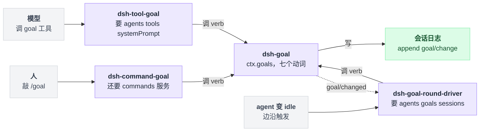
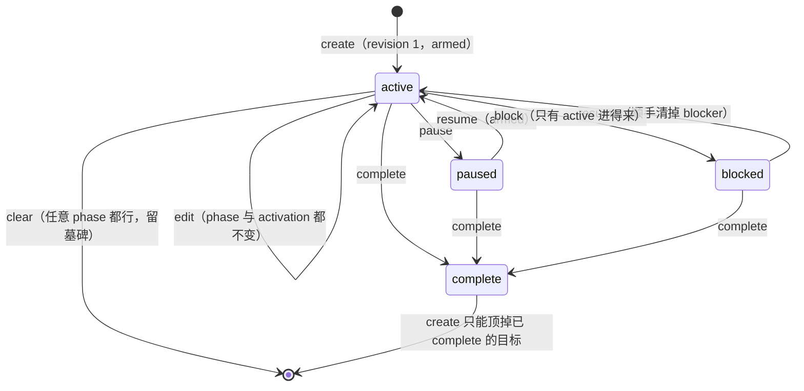
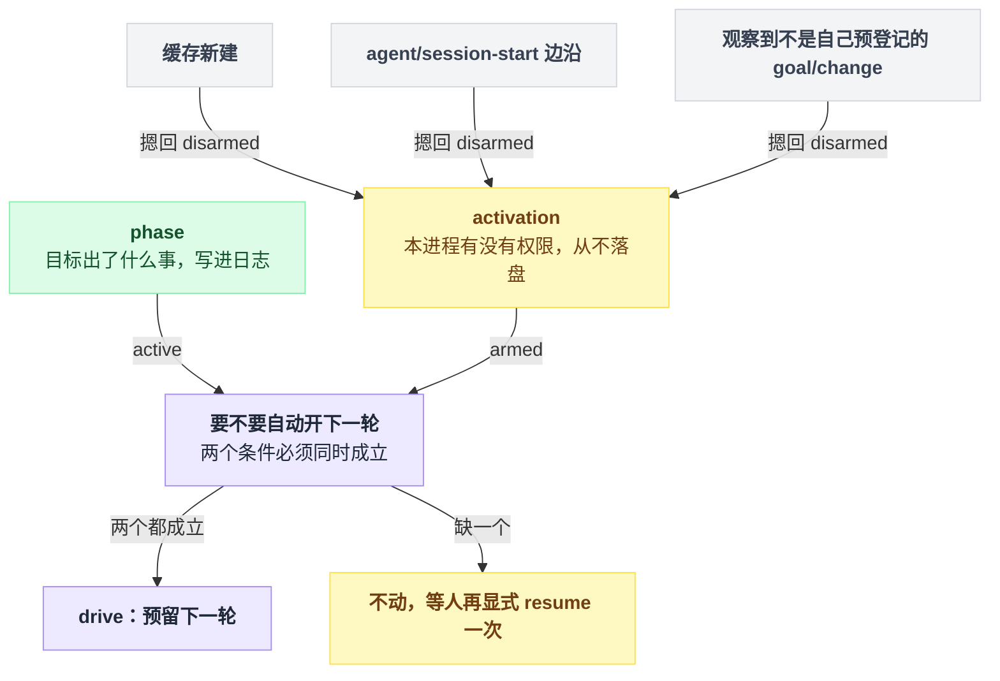
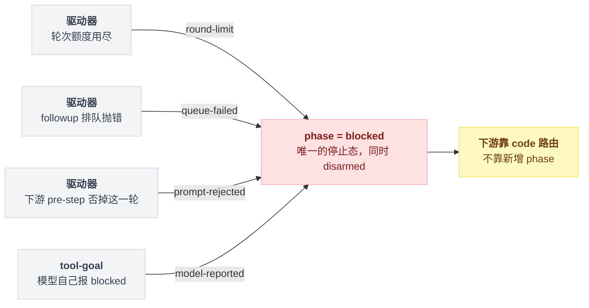
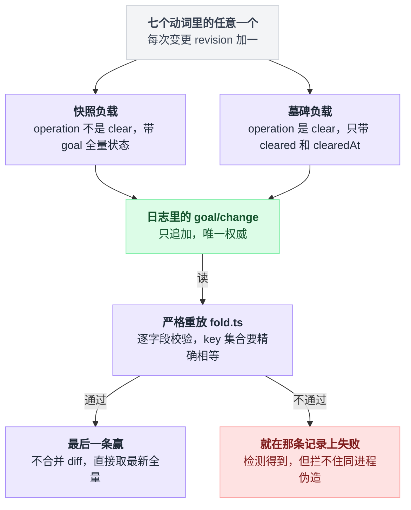
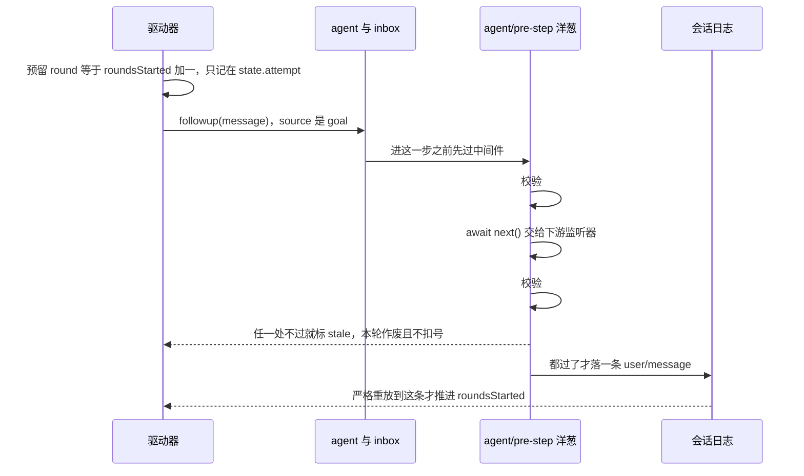

# 26 · Goal 模式

> 基于 `deepseek-ai/deepseek-harness` v0.1.0-rc.5（commit `47f9438`），2026-08-14 核对。

你让 agent"把这个模块的测试补齐"。它改了两个文件、跑了一次 `pytest`、输出一段总结，然后停下来。

你说"继续"，它就继续；你不说，它就一直停在那儿等你。

问题不在模型不够努力，在于 harness 的默认节奏是**一次人类输入 = 一个 turn**。turn 结束，agent 回到 idle，没有人再推它。

这一章讲 dsh 对这件事的第一个答案：goal。它是"续跑"这一族里最完整的样本——怎么判断目标达成没有、达成不了时怎么体面地停、状态存在哪儿、并发改动怎么不打架。读懂它，后面 [27 章](./27-RalphLoop.md)的 Ralph 和 [28 章](./28-自己写一个续跑插件.md)自己动手就都有参照系了。

---

## agent 停下来那一刻，你有两种补法

一种是每轮开一个全新的 agent，只把一份结构化报告交给下一轮——那是 Ralph。

另一种是**留在同一个会话里**：上下文、工具结果、之前的对话全都还在，只是有个驱动器在 agent 空闲时自动塞进去下一条提示。dsh 把后者叫 **goal**。

驱动器的 Agent Note 把层级定死了：

```
Goal
 └─ Goal Round        一次外层策略迭代
     └─ Turn          一个 goal round 落成「一个」goal 来源的 turn
         └─ Step      一个 turn 里可以有任意多个 step
```

层级出自 `.agents/notes/implemented/feature/2026-07-19-same-session-goal-round-driver.md:17`；turn / step / round 三个词的官方定义在 `docs/glossary.md:37-39`。

有一条容易被忽略但很重要：同一会话里普通的人类 turn **不算** goal round，也不消耗额度（`docs/glossary.md:26`）。你在中途插一句"顺便看看 CI"，这句话不会吃掉目标的轮次预算。

---

## 四个包，谁也不管谁

```
                 ┌──────────────────────────────┐
   人 ──/goal──► │ command-goal    （人的命令）  │──┐
                 └──────────────────────────────┘  │
                 ┌──────────────────────────────┐  │  调用 verb
   模型 ─工具──► │ tool-goal  （模型可调的工具） │──┼──────────►┌──────────────┐
                 └──────────────────────────────┘  │           │ goal         │
                 ┌──────────────────────────────┐  │           │ ctx.goals    │
   agent 空闲 ──►│ goal-round-driver （轮次驱动）│──┘           │ 事件源状态机 │
                 └──────────────────────────────┘               └──────┬───────┘
                              ▲                                        │
                              └────── goal/changed（emit 通知）─────────┘
                                                                       │
                                                       append goal/change
                                                                       ▼
                                                            会话日志（唯一权威）
```

| 包 | 角色 | ctx key | 出处 |
|---|---|---|---|
| `dsh-goal` | 目标状态与生命周期 | `ctx.goals` | `packages/goal/README.md:9` |
| `dsh-goal-round-driver` | 同会话轮次续跑 | — | `packages/goal/README.md:10` |
| `dsh-tool-goal` | 模型可调用的目标工具 | — | `packages/goal/README.md:11` |
| `dsh-command-goal` | 人用的 `/goal` 命令 | — | `packages/goal/README.md:12` |

拆成四个不是洁癖。`goal` 只管"目标现在是什么状态"，它明确**不决定什么时候续跑**（`packages/goal/goal/README.md:54`）；驱动器只管调度，连 `maxGoalRounds` 都不复制一份（理由后面说）；工具和命令是两个互不知道对方存在的消费者。

四个里任何一个都可以单独不挂，剩下的照样能跑。

把依赖方向摊平了看是这个形状：三个消费者各从自己的入口进来，都只落到 `ctx.goals` 这一个服务上，服务再往日志里写；只有驱动器反过来还订阅了 `goal/changed`。



---

## 目标"出了什么事"和"这个进程能不能动它"是两件事

这是整章最容易读错的地方，我建议慢一点看。

一句话地图：目标身上挂着两个维度，一个叫 `phase`、写进日志、跟着会话走；另一个叫 `activation`、只活在进程内存里、从不落盘。要自动开下一轮，**两个必须同时成立**。

### 四个持久 phase

```ts
type GoalPhase = 'active' | 'paused' | 'blocked' | 'complete'
```

定义在 `packages/goal/goal/src/types.ts:44`。七个动词改这台机器（`packages/goal/goal/src/domain.ts:14-21`），每个动词的前置条件和结果都能逐条对到源码：

| 动词 | 允许的前置 phase | 结果 phase | activation | 源码 |
|---|---|---|---|---|
| `create` | 无当前目标，或当前目标已 `complete` | `active`（revision 1） | **armed** | `index.ts:251-267` |
| `edit` | 任意（要有当前目标；不改 phase） | 不变 | **不变** | `index.ts:276-290` |
| `pause` | `active` | `paused` | disarmed | `index.ts:298-301` |
| `resume` | `active` / `paused` / `blocked` | `active` | **armed** | `index.ts:310-328` |
| `complete` | `active` / `paused` / `blocked` | `complete` | disarmed | `index.ts:336-346` |
| `block` | 仅 `active` | `blocked` | disarmed | `index.ts:355-368` |
| `clear` | 有当前目标 | 无（墓碑） | disarmed | `index.ts:376-390` |

这七个动词把四个 phase 串成的机器长这样，箭头上是动词：



以上都在 `packages/goal/goal/src/index.ts`。有四个判定光看图看不出来，单独列一下：

| 判定 | 行为 | 源码 |
|---|---|---|
| `create` 撞上未完成的目标 | 直接报 `GOAL_ALREADY_EXISTS`；想换目标要么 `clear` 要么 `resume`，不许覆盖 | `index.ts:255-257` |
| `resume` 会拒绝两种情况 | 一是"已经 active 而且 armed"这种冗余操作，二是额度已经用尽的目标 | `index.ts:318-320`、`:321-326` |
| `edit` 保留 blocker 原因和 activation | blocker 靠 `...current` 展开原样带过去，activation 靠把 `cache.activation` 原值传下去 | `index.ts:284`、`:289` |
| `resume` 反过来会把 blocker 清掉 | 新快照由 `withPhase()` 重建，压根不带 `blockedReason` | `index.ts:450-458` |

### active 不等于可以自动跑

```ts
type GoalActivation = 'armed' | 'disarmed'
```

这行在 `packages/goal/goal/src/types.ts:71`。`phase` 回答"这个目标出了什么事"，`activation` 回答"**这个进程**现在有没有权限再开一轮"（`docs/subsystems/goal.md:21`）。

关键在于 **activation 从不落盘**（`packages/goal/goal/src/types.ts:81-82`）。整台机器写成伪代码是这样：

```
activation = 'disarmed'                        // 缓存新建时的初值

on create / resume:                  activation = 'armed'
on pause / complete / block / clear: activation = 'disarmed'
on edit:                             activation 不变

on agent/session-start 边沿:          activation = 'disarmed'
on 观察到一条 goal/change:
    if 这条不是本进程这次变更预登记的那一条:
        activation = 'disarmed'

// 每个 idle 边沿上问一次
if goal.phase == 'active' and activation == 'armed':
    预留下一轮
else:
    不动，等人再显式 resume 一次
```

也就是说，它被摁回 `disarmed` 的时机一共三处：

| 时机 | 出处 |
|---|---|
| 缓存新建时一律 disarmed | `index.ts:428` |
| 每一次 `agent/session-start` 边沿再 disarm 一次 | `index.ts:198-200` |
| 每观察到一条 `goal/change` 事件也回落 disarmed，除非它正好是本进程这次变更预登记的那一条 | `index.ts:437-447` |

两个维度是这么合起来判的——一个从日志里读出来，一个只活在进程内，而且有三处边沿专门把后者摁回去：



于是 resume 一个旧会话、fork 一个会话、或者换掉驱动器插件，目标、phase、revision、已跑轮数全都在，但**它不会自己动**。

要动，必须有人再显式 `resume` 一次——那次 resume 会写一条新 revision，是模型和人都看得见的授权边沿。

`disarm()` 是整套 API 里唯一的例外方法（`packages/goal/goal/src/index.ts:236`）：

```ts
disarm(agent: Agent): GoalView | undefined {
  this.assertLive(agent)
  const cache = this.cache(agent.session)
  this.sync(agent.session, cache)
  cache.activation = 'disarmed'
  return this.view(cache)
}
```

它**不写事件、不涨 revision、不发 `goal/changed`**（`packages/goal/goal/README.md:20`）。理由很干净："我这个进程不再自动干活"根本不是关于目标的事实，是关于本进程的事实——写进日志反而污染重放。

驱动器里 `disarm(state)` 有 12 个调用点，前三行是最典型的三处：

| 调用点 | 行号 |
|---|---|
| 加载到已有 agent 上 | `goal-round-driver/src/index.ts:418-421` |
| 持久化 flush 失败时 | `:146-150` |
| 卸载前 | `:425-443` |
| `agent/error` | `:248` |
| 驱动任务自身抛错 | `:222`、`:228`、`:238` |
| `turn/end` 报 `max-tokens` | `:319` |

### 为什么 blocked 只有一个

provider 限额、配置预算、执行错误、需要人来拍板——这四类完全可以做成四个 phase。

dsh 故意合成一个：`blocked` 带一个策略自选的 `code` 加一段给人看的 `message`（`packages/goal/goal/src/types.ts:50-56`），`code` 必须是 lower-kebab-case，正则在 `index.ts:172`。

好处是生命周期不膨胀，任何"被挡住了"都落到同一个停止态，路由靠 code 而不是靠新增状态（`packages/goal/goal/README.md:22`）。当前仓库里真实产生的 code 只有四个：

| code | 谁写的 | 出处 |
|---|---|---|
| `round-limit` | 驱动器发现额度用尽 | `goal-round-driver/src/index.ts:167-170` |
| `queue-failed` | `followup()` 排队失败 | `goal-round-driver/src/index.ts:199-202` |
| `prompt-rejected` | 下游 pre-step 监听器否掉了这一轮 | `goal-round-driver/src/index.ts:393-396` |
| `model-reported` | 模型自己调 `update_goal action=blocked` | `tool-goal/src/index.ts:309-311` |

三个出自驱动器、一个出自工具层，四条路汇进同一个停止态，区分留给 `code`：



---

## 谁也别想拿旧 revision 改状态

一个会话里可能同时有人在敲 `/goal pause`、模型在调 `update_goal`、驱动器在预留下一轮。三方都能改同一个目标，所以每次改都得先亮身份。

```ts
interface GoalRef {
  readonly id: GoalId
  readonly revision: number
}
```

`GoalRef` 在 `packages/goal/goal/src/types.ts:19`，是一道 compare-and-set 栅栏。除 `create`、`disarm` 和只读的 `get` 之外，每个 verb 都要传 `ref`，服务端逐字段比对当前值（`packages/goal/goal/src/index.ts:401`）：

```ts
private expectCurrent(cache: GoalCache, ref: GoalRef): GoalSnapshot {
  const current = cache.state.goal
  if (current === undefined) throw new GoalError('no current goal', 'GOAL_NOT_FOUND')
  if (ref.id !== current.id || ref.revision !== current.revision) {
    throw new GoalError(..., 'GOAL_STALE_REVISION')
  }
  return current
}
```

拿旧 revision 来改，直接拒。这就是为什么模型的系统提示词硬性要求"先 `get_goal` 再 `update_goal`，把 id 和 revision 原样抄过去"（`tool-goal/src/index.ts:116-117`）。

另有一道身份检查：服务只认注册表里那个**一模一样的 live Agent 对象**，id 相同但对象不同也拒（`index.ts:414-418`）。

### 每次变更都追加一条带完整快照的事件

`goal/change` 是 goal 域自己的会话事件（`packages/goal/goal/src/domain.ts:61-68`），负载是两种之一：

| 形状 | 负载 | 出处 |
|---|---|---|
| 完整快照 | `{ kind, version, operation, goal, roundsStarted, createdAt, updatedAt }` | `domain.ts:24-32` |
| 墓碑（`clear` 写的） | `{ kind, version, operation: 'clear', cleared: GoalRef, clearedAt }`，其中 `cleared.revision` 是被清目标的 revision 加一（`index.ts:380`） | `domain.ts:35-41` |

注意第一种不是 diff，是**变更后的全量状态**。

全量快照让重放变成"最后一条赢"，也让 `clear` 这种"删除"仍然带着 revision 留在历史里。清掉的是**指针**，不是记录。

写进去的是两种形状，读出来的却是同一条规则——谁最后写的谁说了算：



严格重放（`packages/goal/goal/src/fold.ts`）不是走过场，它一共卡这么几道：

| 检查 | 出处 |
|---|---|
| `decodeGoalChange()` 逐字段校验，且要求 key 集合**精确相等** | `fold.ts:104-106`、`:156-159` |
| `create` 必须是全新 id 加 revision 1 加 phase active 加 rounds 0 | `fold.ts:289-295` |
| 同一条变更里 `updatedAt` 不许早于 `createdAt` | `fold.ts:162` |
| 相邻两次变更之间 `updatedAt` 不许倒退 | `fold.ts:209-213` |
| 写入侧的钳制：时钟回拨时新 `updatedAt` 取 `max(now, 上次)` | `index.ts:507-512` |

说"日志是唯一权威"是有具体所指的：目标状态完全不依赖 inbox 摆放、claim、admission 或 discard（`packages/goal/goal/README.md:24`）。持久化、resume、fork 天然继承 goal 记录，不需要第二个数据库（`packages/goal/goal/README.md:57`），session header 的字段清单里也确实没有任何 goal 相关项（`packages/session/session-persistence-jsonl/README.md:17`）。

代价 README 自己写着：同进程内任何能直接拿到 `Session` 的插件都能伪造 `goal/change`，严格重放只能**检测**到不一致并在那条记录上失败，做不到插件隔离（`packages/goal/goal/README.md:58`）。

---

## 一次 goal round 从预留到落盘

驱动器（`packages/goal/goal-round-driver/src/index.ts`）没有任何配置项，只有一行 `inject = ['agents', 'goals', 'sessions']`（`:19`）。

它在 agent 变 idle（`:259-277`）、目标变更（`:278-282`）这些边沿上请求一次 `drive()`，并用一个 per-agent 的串行队列合并触发（`:207-241`）。

```
agent → idle
  │
  ├─ readyToDrive?  fiber ACTIVE ∧ 未 stopping ∧ agent 仍是注册表里那个 ∧ status==='idle'
  │                 ∧ 没有竞争排队的其它消息            ……… :103-109
  │
  ├─ 有待落盘的 goal 变更 → await ctx.sessions.flush(session)   ……… :142-146
  │        └─ flush 失败 → 打日志 + disarm，本轮结束          ……… :146-150
  │        └─ flush 成功 → 重新校验一遍所有条件               ……… :153
  │
  ├─ goal 必须 phase==='active' ∧ activation==='armed'         ……… :165
  ├─ roundsStarted >= maxGoalRounds → block(round-limit)，结束  ……… :166-172
  │
  ├─ 预留 round = roundsStarted + 1，连同 {goalId, revision} 和渲染好的
  │  完整 prompt 一起记在进程内 state.attempt                   ……… :174-190
  │
  ├─ agent.followup(message)  source = { kind:'goal', goalId, revision, round }
  │        └─ 抛错 → block(queue-failed)                        ……… :192-204
  │
  ▼
agent/pre-step（waterfall = 洋葱中间件，见 [11 章](./11-waterfall专章.md)；声明在
                packages/core/agent/src/runtime-types.ts:229-231）
  │
  ├─ 校验 #1（进 next() 之前）  validReservation：fiber 活着 ∧ attempt.phase==='claimed'
  │     ∧ !attempt.stale ∧ 内容与 source 深比对相同 ∧ 当前目标 id/revision 一致
  │     ∧ phase active ∧ armed ∧ round === roundsStarted + 1     ……… :333-347
  │     └─ 不过 → 标 stale、把别人的消息放回 inbox、返回 reject   ……… :362-371
  │
  ├─ await next()   ← 下游所有监听器
  │
  ├─ 下游 reject → 清掉预留 + block(prompt-rejected)              ……… :388-398
  ├─ 校验 #2（拿到 decision 之后，再跑一次同一个 validReservation）……… :400-412
  │
  ▼
真正进入 step → 落一条 user/message 事件
  │
  └─ 严格重放此时才推进 roundsStarted                            ……… fold.ts:321-331
```

图里的 `fiber` 是这个插件所在的 Cordis 生命周期单元，概念见 [05 章](./05-Cordis是什么.md)。

**前后各校验一次**看着啰嗦，其实防的是一个很实际的场景：下游某个 async 监听器在 `await` 期间把目标 pause 或 edit 掉了，旧 prompt 却照样进去（`.agents/notes/implemented/feature/2026-07-19-same-session-goal-round-driver.md:25`）。

**只有真正落成 `user/message` 的那一轮才扣号。** 被判 stale 的预留不消耗轮次号（`packages/goal/goal-round-driver/README.md:24`），因为轮次计数完全由 `fold.ts:321-331` 从日志里数出来——进程内的那个预留根本不是事实。这一条和第 01 章"日志是唯一真相"是同一件事在 goal 域的具体落法。

把扣号这件事按时间轴摆开更清楚：预留只是驱动器进程内的一个念头，前后两道校验都过、`user/message` 真的落了盘，重放才把轮次数往上推一格。



**外来消息永远优先**，实践中主要就是人类消息。任何进入 `nextTurn` 且不等于本次预留的消息，都会把 `competingQueued` 置真，并把处于 queued 的预留标成 stale（`:284-291`）；混批里的自动 prompt 会被否掉，等下一个 checkpoint 再重新预留。

被取消的轮次不会被偷偷重启。下一次 idle 边沿上，驱动器看到有 queued / claimed / cancelled 的 attempt 而目标仍是 active + armed，就把目标 `pause` 掉（`:263-274`）；pause 也失败才退化成 disarm。

装了 `dsh-goal-round-driver/invariant` 这个伴生插件的部署还有一道独立防线（它 inject `invariants`，`goal-round-driver/src/invariant.ts:15`、`:82-83`）：候选事件进入日志**之前**，用同一个纯函数重新渲染一遍该轮 prompt 并做深比对（`isDeepStrictEqual`），不一致就 fail（`invariant.ts:46-58`）。

伪造的 goal round 进不了日志——但没装这个伴生插件就没有这道检查。

---

## 额度：三个值，三个主人

| 值 | 默认 | 归谁 | 出处 |
|---|---|---|---|
| `defaultMaxGoalRounds` | `256` | `dsh-goal` 的部署配置 | `packages/goal/goal/src/index.ts:186-188` |
| `maxGoalRounds` | 建目标时解析并写死进快照 | **目标自己**（每个目标一份） | `types.ts:66-67`、`index.ts:158-163` |
| `blockedAfterConsecutiveRounds` | `3` | `dsh-tool-goal` | `packages/goal/tool-goal/src/index.ts:32-34` |

第二行的"写死进快照"是关键，写成伪代码：

```
create(objective, 请求级 maxGoalRounds?):
    快照.maxGoalRounds = 请求级 maxGoalRounds ?? 部署配置的 defaultMaxGoalRounds
    // 提交前就物化，此后这个目标只认自己快照里那个数
```

所以改配置只影响**之后**新建的目标，已有目标要靠 `edit` 改（`edit` 能替换 `maxGoalRounds`）。出处：物化在 `index.ts:252`、`index.ts:161`，`edit` 的替换在 `index.ts:287`。

驱动器故意一个都不复制。README 把理由写得很直白：`maxGoalRounds` 属于目标定义，模型侧的 blocked 阈值属于 `dsh-tool-goal`，在驱动器里再存一份"可能产生互相分叉的策略"（`packages/goal/goal-round-driver/README.md:20`）。

这是本章最值得抄走的一条判断——**一个可调值只能有一个所有者**。

额度只数轮次。token、钱、墙上时间、provider 配额都不在它管辖内（`packages/goal/goal/README.md:55`）。

---

## 模型那边看到什么

模型手上是三个工具：`get_goal()` / `create_goal(objective, max_goal_rounds?)` / `update_goal(goal_id, revision, action, ...)`，分别注册在 `packages/goal/tool-goal/src/index.ts:195`、`:207`、`:234`。`update_goal` 的 action 是 `edit | pause | resume | complete | blocked`（`:43`）。

权限有三条硬的，都在 `packages/goal/tool-goal/src/authority.ts`：

| 要求 | 管哪些动作 | 出处 |
|---|---|---|
| 调用者必须是注册表里那个 live agent、状态 `running`、且是当前 initiator，还得有一个打开的 turn | 全部 | `authority.ts:50-63` |
| 本 turn 里有一条 `source.kind === 'user'` 的消息，且 agent 是 runtime root；子 agent 直接不合格 | `create` / `edit` / `pause` / `resume` | `authority.ts:70-74`、`:90-93` |
| 额外接受一种授权：本 turn 就是当前目标那一轮，id / revision / round 三项全等 | `complete` / `blocked` | `authority.ts:77-83`、`:101-108` |

这里最容易误解的是那个 `{ kind: 'user' }`。它是**宿主标记（host attestation），不是身份证明**——检查函数只看本 turn 里有没有这么一条消息，不看是谁产生的（`authority.ts:72-73`）。

仓库自己把这条边界写在注释和 README 里：非人类生产者必须自己传 source，否则就等于白捡了人类授权（`authority.ts:66-68`、`packages/goal/tool-goal/README.md:23`）。驱动器自己就老实传了 `{ kind: 'goal', ... }`（`goal-round-driver/src/index.ts:178`）。

自主轮次里报 `blocked` 还有一道机械下限：

```
report_blocked():
    if 授权来自 goal round and roundsStarted < blockedAfterConsecutiveRounds:
        throw GOAL_TOOL_BLOCK_THRESHOLD
    // 人直接下令时这个分支根本不进
```

也就是这道下限只在授权来自 goal round 时生效，人直接下令不受限制（`tool-goal/src/index.ts:299-306`，只在 goal round 授权下生效见 `:299`）。

### `<goal_round>` 提示长什么样

驱动器每轮塞进去的就是这一块（`packages/goal/goal-round-driver/src/prompt.ts:12-26`）：

```
<goal_round>
Objective: "把这个模块的测试补齐"
Round: 3/256

Continue working toward the objective in this same session. Treat the current workspace,
tool results, and durable session state as authoritative; inspect them instead of assuming
earlier narration is still current. Make concrete progress and verify the result. Before
claiming completion, gather evidence that the whole objective is achieved, read the current
goal, and mark it complete. If work remains, leave the goal active for the next round. Follow
the configured goal-tool policy before reporting a blocker.
</goal_round>
```

正文那一大段在源码里是字符串拼接出的**一整行、不含换行**（`prompt.ts:18-23`），上面按拼接边界折行只是为了在页面上读得下去，模型看到的是一整段。

objective 用 `JSON.stringify` 包起来（`prompt.ts:16`），所以多行文本或者带尖括号的目标不会把这个框架撑破。

另有一段固定策略提示注册到系统提示词的 `order: 114` 处（`tool-goal/src/index.ts:189-193`），配置的阈值会插值进去（`:113-123`）。

---

## 上手

### 启用

用官方 `dsh` 的话什么都不用做。base bundle 已经默认挂好了四个条目：`goal`、`goal-round-driver`、`command-goal`（`packages/bundle/base/cordis.patch.yml:256-263`）和 `tool-goal`（`:374-375`），全部不带 config，也就是 `defaultMaxGoalRounds: 256` 加 `blockedAfterConsecutiveRounds: 3`。

Web 形态多绕了一道。`packages/bundle/web-app/cordis.patch.yml:345-346` 把 base 那行 `tool-goal` 整个 `disabled: true`，因为它被下放到了 agent preset——`code` / `standard` / `cordis` 三个 preset 各自重新挂了一行（`apps/cli/config/agent-presets/code/agent.cordis.yml:104-105`、`standard/agent.cordis.yml:97-98`、`cordis/agent.cordis.yml:85-86`）。

goal 服务、驱动器和 `/goal` 命令仍然留在 host plane，同文件 `:336-343` 的注释解释了原因。所以 Web 下模型照样看得到 goal 工具，只是**哪个 preset 给不给**变成了 preset 自己的选择。

自己组一个 app 时，最小三个插件来自驱动器 README（`packages/goal/goal-round-driver/README.md:9-18` 原文）：

```yaml
- id: goal
  name: '@deepseek-ai/dsh-goal'

- id: tool-goal
  name: '@deepseek-ai/dsh-tool-goal'

- id: goal-round-driver
  name: '@deepseek-ai/dsh-goal-round-driver'
```

前提是这个 app 已经提供了它们 inject 的服务：驱动器要 `agents` / `goals` / `sessions`（`goal-round-driver/src/index.ts:19`），tool-goal 要 `agents` / `goals` / `tools` / `systemPrompt`（`tool-goal/src/index.ts:23`）。要让人能用 `/goal`，再加 `commands` 加 `command-goal`（`packages/goal/command-goal/README.md:26-33`）。

想改默认额度：

```yaml
- id: goal
  name: '@deepseek-ai/dsh-goal'
  config:
    defaultMaxGoalRounds: 11
```

形状抄自真实的测试组合 `examples/headless-agent/tests/fixtures/goal-domain/cordis.yml:12-15`。

顺带一提，`examples/headless-agent/goal.cordis.yml:1-11` 是一个**故意只挂 goal + tool-goal、不挂驱动器**的真实示例：模型能建目标、能读状态，但没有任何自动轮次。这正好对应 tool-goal README 的一条限制——没有驱动器，自主 complete / blocked 那条路是休眠的（`packages/goal/tool-goal/README.md:79`）。

### 用命令跑起来

`/goal` 的完整语法在 `packages/goal/command-goal/README.md:9-16`，解析逻辑在 `command-goal/src/index.ts:33-43`：

| 输入 | 行为 |
|---|---|
| `/goal` | 显示当前状态与可用命令 |
| `/goal <目标>` | 建目标并 arm |
| `/goal edit <新目标>` | 改目标，不改 phase 和 activation |
| `/goal edit`（不带目标） | 报错，不建目标（`index.ts:40`、`:119-120`） |
| `/goal pause` / `/goal resume` / `/goal clear` | 对应 verb |

最容易踩的是这个：控制词只有在**独占整条输入**时才是控制词。写成伪代码就一目了然：

```
剩下的串 = 去掉 "/goal " 之后的整串
if 剩下的串 为空:                              显示状态与可用命令
if 剩下的串 恰好等于 pause / resume / clear:    执行对应 verb
if 剩下的串 恰好等于 edit:                      报错，不建目标
if 剩下的串 以 edit 开头且后面还有内容:          改目标
否则:                                          把整串当成新目标 create + arm
```

所以 `/goal pause after verification` 会建一个叫"pause after verification"的目标，不会暂停任何东西（`index.ts:34-40`）。

命令返回的文本由 `command-goal/src/index.ts:81-93` 拼出，形状是：

```
Goal created
Status: active
Objective: 把这个模块的测试补齐
Rounds: 0/256
Activation: armed

Commands: /goal edit <objective>, /goal pause, /goal clear
```

blocked 时会在 `Status:` 下面多一行 `Blocker: <code>: <message>`（`index.ts:80`）。

这条命令**不触发模型 turn**（`packages/goal/command-goal/README.md:5`），上面这段呈现文本也**不进日志**，但变更本身照样以 `goal/change` 落盘（`:43`）。

建完之后 agent 一空闲，驱动器就会开第一轮，`Rounds:` 那一栏会随着每次 `user/message` 落盘往上走。

Web 端另有一条 GoalBar。据包 README（`packages/client/ui-goal/README.md:5`，未逐行读 UI 源码），它是 `conversation.input.dock` 里的第二张卡（order 10），数据走 `useProjection('goal')`，只提供 edit / pause / resume / clear 四个动作——**建目标仍然只能走 `/goal` 命令**。

### 在日志里看 `goal/change`

会话日志默认落在 `~/.dsh/sessions`，布局是 `<root>/--<归一化 cwd>--/<编码后的 session id>/session.jsonl.zstd`。出处：默认根目录见 `packages/bundle/base/cordis.patch.yml:98-101`（`root: !!js dshHomePath('sessions')`），`~/.dsh` 这个缺省值见 `packages/util/home-paths/src/index.ts:12`，布局见 `packages/session/session-persistence-jsonl/README.md:9-15`。

默认是 zstd 压缩，直接 `grep` 是看不见的。要用行式文本读，得先把持久化配成 `compression: 'none'`（`packages/session/session-persistence-jsonl/README.md:28`、`:74`）——这跟 [16 章](./16-会话日志与分叉.md)讲的是同一个日志。

找的是 `type` 为 `goal/change` 的行，负载就是前面说的那两种形状之一。轮次则记在 `user/message` 事件的 `source` 上：`{ kind: 'goal', goalId, revision, round }`（`packages/goal/goal/src/domain.ts:46-53`）。

### 写一个插件

想监听目标变化，用 `goal/changed`。它是 emit 模式（五种派发模式见 [10 章](./10-事件系统.md)），按 agent 做 scope 过滤，监听器抛错会被容纳（`packages/goal/goal/src/domain.ts:104-115`）：

```ts
import type { Context } from '@deepseek-ai/cordis'
import type {} from '@deepseek-ai/dsh-goal'

export const name = 'goal-watch'
export const inject = ['goals']

export function apply(ctx: Context): void {
  ctx.on('goal/changed', ({ agent, change }) => {
    ctx.logger.info(`${agent.id}: ${change.operation} -> rev ${change.ref.revision}`)
  })
}
```

那行 `import type {} from '@deepseek-ai/dsh-goal'` 不是装饰。`ctx.goals` 和 `goal/changed` 都是靠该包的 declaration merging 挂上去的，不引它就没有类型。

载荷里的 `agent` 由发射端注入（`packages/core/agent/src/dispatch.ts:118`），`change.goal` 在 `clear` 时缺席（`domain.ts:84-90`）。这个监听写法在仓库测试里有真身：`packages/goal/goal-round-driver/tests/goal-round-driver.spec.ts:271`。

主动建目标的最小插件，改编自仓库里真实的测试夹具 `examples/headless-agent/tests/fixtures/goal-domain/seed-goal.ts:3-19`：

```ts
import type { Context } from '@deepseek-ai/cordis'
import type {} from '@deepseek-ai/dsh-goal'

export const name = 'seed-goal'
export const inject = ['goals']

export function apply(ctx: Context): void {
  ctx.on('agent/pre-step', ({ agent }, next) => {
    if (ctx.goals.get(agent) === undefined) {
      ctx.goals.create(agent, {
        objective: 'Prove the composed goal survives in the session log',
        maxGoalRounds: 7,
      })
    }
    return next()
  })
}
```

注意这个插件绕过了模型工具那层的人类授权检查——`requireDirectHuman` 只管 `tool-goal`（`packages/goal/tool-goal/src/authority.ts:90-93`），服务本身只检查 live agent（`goal/src/index.ts:414-418`）。

同进程插件是被信任的，这是明写的边界（`packages/goal/goal/README.md:58`）。

---

## 边界与坑

- **卸载竞态**：Cordis 卸载是异步的。已经被 inbox 接受的那一轮可能开跑并**真的扣掉**轮次号；teardown 会取消请求、disarm、等待静默，但不会假装那次 admission 没发生过（`packages/goal/goal-round-driver/README.md:62`）。
- **没有自动重试**：provider 抖动、持久化失败一律不自动重试，要人后续授权 resume（`packages/goal/goal-round-driver/README.md:64`）。源码里对应的动作只有两条：`turn/end` 的 `max-tokens` 直接 disarm，`aborted` 视 attempt 状态标 cancelled 或 disarm（`goal-round-driver/src/index.ts:317-326`）。
- **一个会话只有一个当前目标**，没有并行目标、没有独立的 goal 数据库；替换或 clear 之后历史仍在日志里（`packages/goal/goal/README.md:57`）。
- **没有独立评判者**：记录 `complete` / `blocked` 的那个调用者就是权威，模型说完成就是完成（`packages/goal/goal/README.md:56`）。
- **`GOAL_CHANGE_VERSION = 1` 没有兼容承诺**，也没有迁移路径（`packages/goal/goal/src/runtime.ts:8`、`.agents/notes/implemented/feature/2026-07-19-persisted-same-session-goal-domain.md:63`）。
- **提示词注册与工具过滤是两件事**：某个 scope 可能把工具藏了，却仍然保留那段 goal 策略提示（`packages/goal/tool-goal/README.md:80`）。
- **headless / ACP / JSON-RPC 适配器不消费 `ctx.commands`**，`/goal` 在那些形态下不可用（`packages/goal/command-goal/README.md:58`）。

---

## goal 和 Ralph 怎么选

| | goal | Ralph |
|---|---|---|
| 会话 | 同一个，全部上下文保留 | 每轮开新 agent，无父对话、无上轮会话 |
| 跨轮传递 | 整段会话历史 | 只有一份有界的结构化报告 |
| 记忆载体 | 会话日志 | 共享工作区 |
| 出处 | `packages/goal/goal-round-driver/README.md:61` | `docs/glossary.md:43-44`、`docs/tool-catalog.md:1186` |

两边都把边界写死了。术语表说 Ralph 是"面向不可变目标的前台全新 agent 工作流"，**不是**同会话目标（`docs/glossary.md:43`）；驱动器 README 反过来声明自己"故意不 spawn 新 agent、不 fork 会话前缀、不实现 Ralph 式独立尝试"（`packages/goal/goal-round-driver/README.md:61`）。

判据其实很简单：**上下文是资产就用 goal，上下文是包袱就用 Ralph。** [27 章](./27-RalphLoop.md)讲后者。

---

## 一句话带走

**goal 把"要不要再跑一轮"拆成了两个必须同时成立的条件：日志里那个持久的 `phase`，和从不落盘的进程内 `activation`。**

前者让 resume 和 fork 天然继承目标，后者保证换个进程接手时它绝不自作主张。想自己写一个续跑插件，这两位就是最该先设计的东西——[28 章](./28-自己写一个续跑插件.md)会照着这个骨架走一遍。

> 想知道这一点上 Pi / Codex / LangChain 怎么做，见 [五个 agent 系统源码解剖](../2026-08_五个agent系统源码解剖/00-总览与阅读指南.md)。

---
