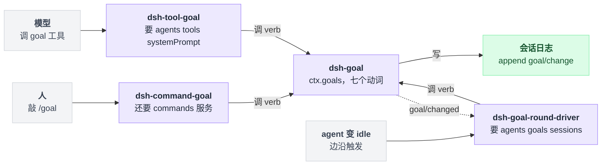
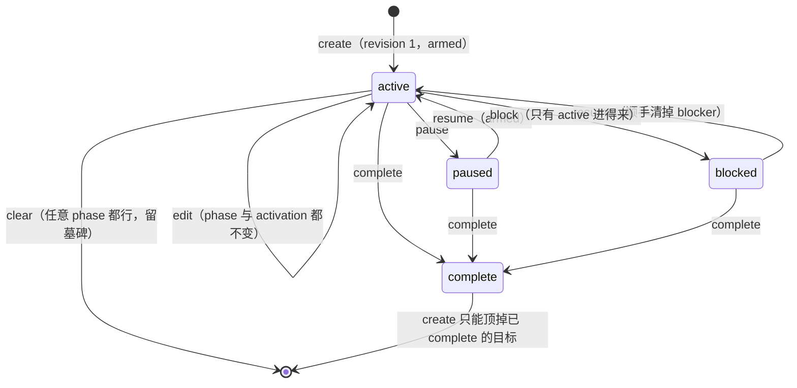
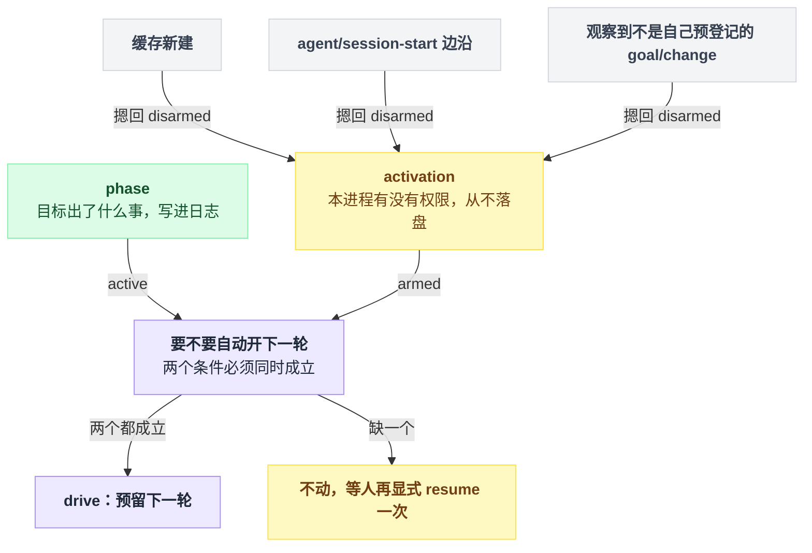
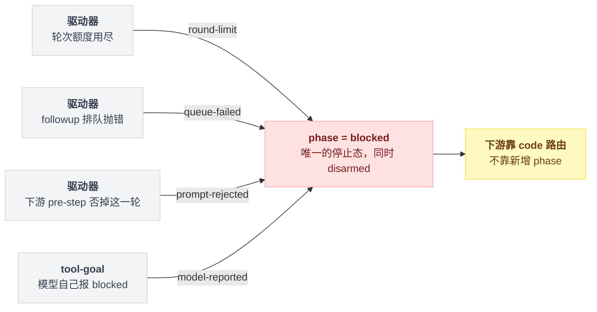
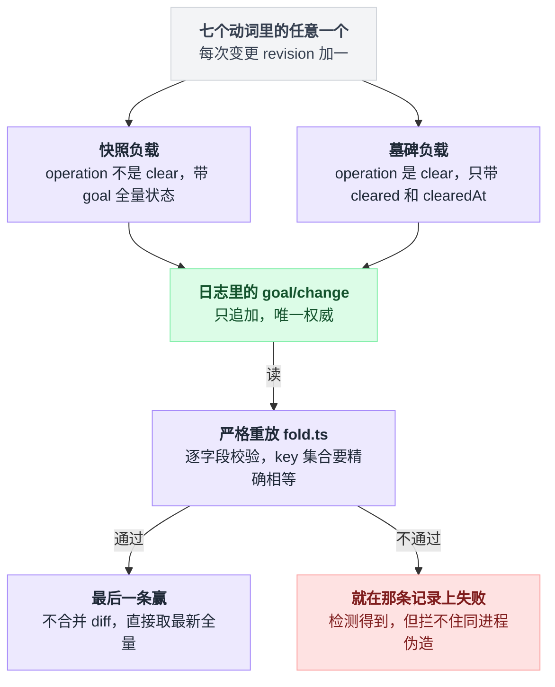
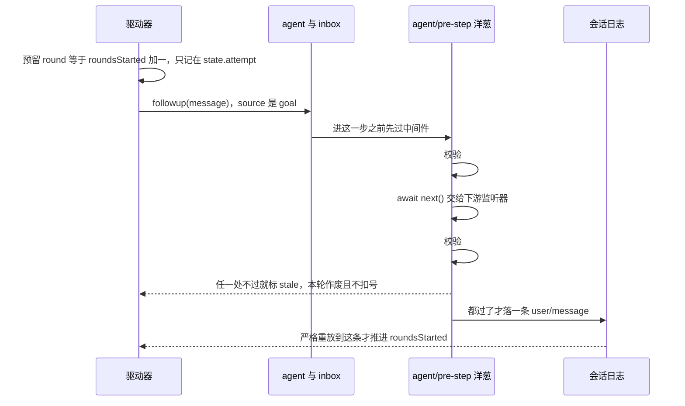

# 26 · Goal 模式

> 基于 `deepseek-ai/deepseek-harness` v0.1.0-rc.5（commit `47f9438`），2026-08-14 核对。正文只讲机制；可照抄的代码统一收在文末[附录](#附录可以照抄的模板)，出处收在[脚注](#出处)，点角标可跳转。

你让 agent"把这个模块的测试补齐"。它改了两个文件、跑了一次 `pytest`、输出一段总结，然后停下来。

你说"继续"，它就继续；你不说，它就一直停在那儿等你。

第一反应往往是"模型不够主动"。不是的。问题出在 harness 的默认节奏上：**一次人类输入 = 一个 turn**。turn 结束，agent 回到 idle，没有人再推它——它不是不想干，是没人给下一脚油门。

这一章讲 dsh 对这件事的第一个答案：goal。它是"续跑"这一族里最完整的样本——怎么判断目标达成没有、达成不了时怎么体面地停、状态存在哪儿、并发改动怎么不打架。读懂它，后面 [27 章](./27-RalphLoop.md)的 Ralph 和 [28 章](./28-自己写一个续跑插件.md)自己动手就都有参照系了。

---

## agent 停下来那一刻，你有两种补法

一种是每轮开一个全新的 agent，只把一份结构化报告交给下一轮——那是 Ralph。

另一种是**留在同一个会话里**：上下文、工具结果、之前的对话全都还在，只是有个驱动器在 agent 空闲时自动塞进去下一条提示。dsh 把后者叫 **goal**。

驱动器的 Agent Note 把层级定死了[^1]：

```
Goal
 └─ Goal Round        一次外层策略迭代
     └─ Turn          一个 goal round 落成「一个」goal 来源的 turn
         └─ Step      一个 turn 里可以有任意多个 step
```

从这张层级图能直接推出一条容易被忽略的结论：goal round 数的是"goal 来源的 turn"，那么**同一会话里普通的人类 turn 就不算 goal round，也不消耗额度**[^2]。你在中途插一句"顺便看看 CI"，这句话不会吃掉目标的轮次预算。

---

## 四个包，谁也不管谁

"一个功能一个插件"的直觉在这里会猜错——goal 不是一个包，是四个[^3]：

| 包 | 角色 | ctx key |
|---|---|---|
| `dsh-goal` | 目标状态与生命周期 | `ctx.goals` |
| `dsh-goal-round-driver` | 同会话轮次续跑 | — |
| `dsh-tool-goal` | 模型可调用的目标工具 | — |
| `dsh-command-goal` | 人用的 `/goal` 命令 | — |

拆成四个不是洁癖。`goal` 只管"目标现在是什么状态"，它明确**不决定什么时候续跑**[^4]；驱动器只管调度，连轮次上限都不复制一份（理由后面说）；工具和命令是两个互不知道对方存在的消费者。

**四个里任何一个都可以单独不挂，剩下的照样能跑。**

把依赖方向摊平了看是这个形状：三个消费者各从自己的入口进来，都只落到 `ctx.goals` 这一个服务上，服务再往日志里写；只有驱动器反过来还订阅了 `goal/changed`。



---

## 目标"出了什么事"和"这个进程能不能动它"是两件事

这是整章最容易读错的地方，我建议慢一点看。

先立一个几乎人人都会有的预期：resume 一个旧会话，看到目标还是 `active`，那它应该接着自动跑吧？

不会。因为目标身上挂着两个维度：一个叫 `phase`、写进日志、跟着会话走；另一个叫 `activation`、只活在进程内存里、从不落盘。**要自动开下一轮，两个必须同时成立。** resume 回来的进程手里只有前者。

### 四个持久 phase

phase 一共四个值：`active`、`paused`、`blocked`、`complete`[^5]。改这台机器的动词一共七个，每个动词的前置条件和结果都能逐条对到源码[^6]：

| 动词 | 允许的前置 phase | 结果 phase | activation |
|---|---|---|---|
| `create` | 无当前目标，或当前目标已 `complete` | `active`（revision 1） | **armed** |
| `edit` | 任意（要有当前目标；不改 phase） | 不变 | **不变** |
| `pause` | `active` | `paused` | disarmed |
| `resume` | `active` / `paused` / `blocked` | `active` | **armed** |
| `complete` | `active` / `paused` / `blocked` | `complete` | disarmed |
| `block` | 仅 `active` | `blocked` | disarmed |
| `clear` | 有当前目标 | 无（墓碑） | disarmed |

这七个动词把四个 phase 串成的机器长这样，箭头上是动词：



有四个判定光看图看不出来，单独列一下[^7]：

| 判定 | 行为 |
|---|---|
| `create` 撞上未完成的目标 | 直接报 `GOAL_ALREADY_EXISTS`；想换目标要么 `clear` 要么 `resume`，不许覆盖 |
| `resume` 会拒绝两种情况 | 一是"已经 active 而且 armed"这种冗余操作，二是额度已经用尽的目标 |
| `edit` 保留 blocker 原因和 activation | blocker 和内存开关都原样带过去，一个字段都不动 |
| `resume` 反过来会把 blocker 清掉 | 新快照整个重建，压根不带被挡的原因 |

### active 不等于可以自动跑

activation 只有两个值：armed（上膛）和 disarmed（收枪）。`phase` 回答"这个目标出了什么事"，`activation` 回答"**这个进程**现在有没有权限再开一轮"。关键在于 **activation 从不落盘**[^8]。

它的走法其实已经写在上面那张动词表的最后一列里：建目标和 resume 会上膛，pause、complete、block、clear 都收枪，edit 什么都不碰。除此之外，还有三处边沿会把它**摁回 disarmed**，全都是"这个进程对目标的了解可能过期了"的信号[^9]：

| 时机 | 含义 |
|---|---|
| 缓存新建时一律 disarmed | 刚接手，什么都别自作主张 |
| 每一次 `agent/session-start` 边沿再 disarm 一次 | 会话重新开始，旧授权作废 |
| 观察到一条 `goal/change`，且它不是本进程这次变更预登记的那一条 | 别人动过目标了，我的了解过期了 |

然后在每个 idle 边沿上问一次：phase 是 active、开关是 armed，两个都成立才预留下一轮；缺一个就不动，等人再显式 resume 一次。



现在开头那个预期的答案自己浮出来了：resume 一个旧会话、fork 一个会话、或者换掉驱动器插件，目标、phase、revision、已跑轮数全都在，但**它不会自己动**。

要动，必须有人再显式 `resume` 一次——那次 resume 会写一条新 revision，是模型和人都看得见的授权边沿。

收枪的方法 `disarm` 是整套 API 里唯一的例外：它先确认调用者还是注册表里活着的那个 agent、把缓存和日志同步一遍，然后只拨一下内存里的开关，交回一份只读视图——**不写事件、不涨 revision、不发通知**[^10]。理由很干净："我这个进程不再自动干活"根本不是关于目标的事实，是关于本进程的事实——写进日志反而污染重放。

驱动器里这个方法有 12 个调用点，最典型的三处是：加载到已有 agent 上、持久化刷盘失败时、卸载前；此外 agent 报错、驱动任务自身抛错、turn 结束时报超 token，也都会先收枪[^11]。

### 为什么 blocked 只有一个

provider 限额、配置预算、执行错误、需要人来拍板——这四类完全可以做成四个 phase。

dsh 故意合成一个：`blocked` 带一个策略自选的 code 加一段给人看的 message，code 必须是 lower-kebab-case，有正则把关[^12]。

好处是生命周期不膨胀，任何"被挡住了"都落到同一个停止态，路由靠 code 而不是靠新增状态。当前仓库里真实产生的 code 只有四个[^13]：

| code | 谁写的 |
|---|---|
| `round-limit` | 驱动器发现额度用尽 |
| `queue-failed` | 续跑消息排队失败 |
| `prompt-rejected` | 下游 pre-step 监听器否掉了这一轮 |
| `model-reported` | 模型自己调工具报 blocked |

三个出自驱动器、一个出自工具层，四条路汇进同一个停止态，区分留给 code：



---

## 谁也别想拿旧 revision 改状态

你可能以为一个会话里只有模型在动目标。数一数其实是三方：人在敲 `/goal pause`、模型在调 `update_goal`、驱动器在预留下一轮——三方都能改同一个目标，所以每次改都得先亮身份。

所谓亮身份，是一张只有两个字段的名片：目标的 id，加上你上次见到它时的 revision 号[^14]。这张名片叫 `GoalRef`，是一道 compare-and-set 栅栏：除了 `create`、`disarm` 和只读的 `get` 之外，每个动词都要交名片，服务端把当前目标翻出来逐字段比对——没有当前目标报 `GOAL_NOT_FOUND`，id 或 revision 有一个对不上就抛 `GOAL_STALE_REVISION`[^15]。

**拿旧 revision 来改，直接拒。** 这就是为什么模型的系统提示词硬性要求"先 `get_goal` 再 `update_goal`，把 id 和 revision 原样抄过去"[^16]。

另有一道身份检查：服务只认注册表里那个**一模一样的 live Agent 对象**，id 相同但对象不同也拒[^17]。

### 每次变更都追加一条带完整快照的事件

`goal/change` 是 goal 域自己的会话事件，负载是两种之一[^18]：

| 形状 | 负载 |
|---|---|
| 完整快照 | 操作名，加变更后的目标全量状态、已跑轮数、两个时间戳 |
| 墓碑（`clear` 写的） | 操作名 clear，加被清目标的名片和清除时间；名片上的 revision 是被清目标的 revision 加一 |

注意第一种不是 diff，是**变更后的全量状态**。

全量快照让重放变成"最后一条赢"，也让 `clear` 这种"删除"仍然带着 revision 留在历史里。清掉的是**指针**，不是记录。

写进去的是两种形状，读出来的却是同一条规则——谁最后写的谁说了算：



严格重放不是走过场，它一共卡这么几道[^19]：

- 每条记录逐字段校验，且要求 key 集合**精确相等**——多一个字段少一个字段都不行；
- `create` 必须是全新 id、revision 1、phase active、已跑轮数 0；
- 同一条变更里更新时间不许早于创建时间；
- 相邻两次变更之间更新时间不许倒退；
- 写入侧还有一道钳制：时钟回拨时，新的更新时间取"现在"和"上次"里较大的那个。

说"日志是唯一权威"是有具体所指的：目标状态完全不依赖 inbox 摆放、claim、admission 或 discard；持久化、resume、fork 天然继承 goal 记录，不需要第二个数据库，session header 的字段清单里也确实没有任何 goal 相关项[^20]。

代价 README 自己写着：同进程内任何能直接拿到 `Session` 的插件都能伪造那条变更事件，严格重放只能**检测**到不一致并在那条记录上失败，做不到插件隔离[^21]。

---

## 一次 goal round 从预留到落盘

驱动器没有任何配置项，只声明自己需要三个服务：agent 注册表、goal 服务、会话持久化[^22]。

它在 agent 变 idle、目标变更这些边沿上请求一次驱动，并用一个 per-agent 的串行队列合并触发[^23]。前半段（预留）的每一步坐标见脚注[^24]，后半段（pre-step 洋葱里的两道校验，waterfall 模式见 [11 章](./11-waterfall专章.md)）见脚注[^25]：

```
agent → idle
  │
  ├─ readyToDrive?  fiber ACTIVE ∧ 未 stopping ∧ agent 仍是注册表里那个
  │                 ∧ status 是 idle ∧ 没有竞争排队的其它消息
  │
  ├─ 有待落盘的 goal 变更 → 先等一次刷盘
  │        └─ 刷盘失败 → 打日志 + disarm，本轮结束
  │        └─ 刷盘成功 → 重新校验一遍所有条件
  │
  ├─ goal 必须 phase 为 active ∧ activation 为 armed
  ├─ 已跑轮数 ≥ 上限 → block(round-limit)，结束
  │
  ├─ 预留 round = 已跑轮数 + 1，连同目标 id、revision 和渲染好的
  │  完整 prompt 一起记在进程内的 attempt 上
  │
  ├─ followup 排队，来源标记为 goal（带目标 id、revision、round）
  │        └─ 抛错 → block(queue-failed)
  │
  ▼
agent/pre-step（waterfall = 洋葱中间件）
  │
  ├─ 校验 #1（进下一层之前）  validReservation：fiber 活着 ∧ 预留处于 claimed
  │     ∧ 预留未过期 ∧ 消息内容与来源深比对相同 ∧ 当前目标 id/revision 一致
  │     ∧ phase active ∧ armed ∧ round === 已跑轮数 + 1
  │     └─ 不过 → 标 stale、把别人的消息放回 inbox、返回 reject
  │
  ├─ 交给下游所有监听器
  │
  ├─ 下游 reject → 清掉预留 + block(prompt-rejected)
  ├─ 校验 #2（拿到结论之后，再跑一次同一个 validReservation）
  │
  ▼
真正进入 step → 落一条 user/message 事件
  │
  └─ 严格重放此时才推进已跑轮数
```

图里的 `fiber` 是这个插件所在的 Cordis 生命周期单元，概念见 [05 章](./05-Cordis是什么.md)。

**前后各校验一次**看着啰嗦，其实防的是一个很实际的场景：下游某个 async 监听器在等待期间把目标 pause 或 edit 掉了，旧 prompt 却照样进去[^26]。

**只有真正落成 `user/message` 的那一轮才扣号。** 被判 stale 的预留不消耗轮次号[^27]，因为轮次计数完全由严格重放从日志里数出来——进程内的那个预留根本不是事实。这一条和第 01 章"日志是唯一真相"是同一件事在 goal 域的具体落法。

把扣号这件事按时间轴摆开更清楚：预留只是驱动器进程内的一个念头，前后两道校验都过、`user/message` 真的落了盘，重放才把轮次数往上推一格。



**外来消息永远优先**，实践中主要就是人类消息。任何进入下一轮且不等于本次预留的消息，都会被记为"有竞争"，并把还在排队的预留标成 stale；混批里的自动 prompt 会被否掉，等下一个 checkpoint 再重新预留[^28]。

被取消的轮次不会被偷偷重启。下一次 idle 边沿上，驱动器看到有排队中、已认领或已取消的 attempt 而目标仍是 active 加 armed，就把目标 `pause` 掉；pause 也失败才退化成收枪[^28]。

装了 `dsh-goal-round-driver/invariant` 这个伴生插件的部署还有一道独立防线：候选事件进入日志**之前**，用同一个纯函数重新渲染一遍该轮 prompt 并做深比对，不一致就 fail[^29]。

伪造的 goal round 进不了日志——但没装这个伴生插件就没有这道检查。

---

## 额度：三个值，三个主人

| 值 | 默认 | 归谁 |
|---|---|---|
| `defaultMaxGoalRounds` | `256` | `dsh-goal` 的部署配置 |
| `maxGoalRounds` | 建目标时解析并写死进快照 | **目标自己**（每个目标一份） |
| `blockedAfterConsecutiveRounds` | `3` | `dsh-tool-goal` |

三个值各有各的主人[^30]。第二行的"写死进快照"是关键：建目标那一刻就把上限物化——请求里带了就用请求的，没带就用部署配置的默认值；提交之后，这个目标只认自己快照里那个数[^31]。

所以改配置只影响**之后**新建的目标，已有目标要靠 `edit` 改（`edit` 能替换上限）[^31]。

驱动器故意一个都不复制。README 把理由写得很直白：轮次上限属于目标定义，模型侧的 blocked 阈值属于工具层，在驱动器里再存一份"可能产生互相分叉的策略"[^32]。

这是本章最值得抄走的一条判断——**一个可调值只能有一个所有者**。

额度只数轮次。token、钱、墙上时间、provider 配额都不在它管辖内[^33]。

---

## 模型那边看到什么

模型手上是三个工具：`get_goal` 读当前状态，`create_goal` 建目标（可以顺带指定轮次上限），`update_goal` 改目标；改目标的 action 一共五种：edit、pause、resume、complete、blocked[^34]。

权限有三条硬的[^35]：

| 要求 | 管哪些动作 |
|---|---|
| 调用者必须是注册表里那个 live agent、状态 `running`、且是当前 initiator，还得有一个打开的 turn | 全部 |
| 本 turn 里有一条来源标记为 user 的消息，且 agent 是 runtime root；子 agent 直接不合格 | `create` / `edit` / `pause` / `resume` |
| 额外接受一种授权：本 turn 就是当前目标那一轮，id / revision / round 三项全等 | `complete` / `blocked` |

这里最容易误解的是那个"来源标记为 user"。它是**宿主标记（host attestation），不是身份证明**——检查函数只看本 turn 里有没有这么一条消息，不看是谁产生的[^36]。

仓库自己把这条边界写在注释和 README 里：非人类生产者必须自己传真实来源，否则就等于白捡了人类授权。驱动器自己就老实标了 goal 来源[^36]。

自主轮次里报 blocked 还有一道机械下限：授权来自 goal round、且已跑轮数还没到阈值时，直接抛 `GOAL_TOOL_BLOCK_THRESHOLD` 拒绝；人直接下令时这个分支根本不进，不受限制[^37]。

### `<goal_round>` 提示长什么样

驱动器每轮塞进去的就是这一块[^38]：

```
<goal_round>
Objective: "把这个模块的测试补齐"
Round: 3/256

Continue working toward the objective in this same session. Treat the current workspace,
tool results, and durable session state as authoritative; inspect them instead of assuming
earlier narration is still current. Make concrete progress and verify the result. Before
claiming completion, gather evidence that the whole objective is achieved, read the current
goal, and mark it complete. If work remains, leave the goal active for the next round. Follow
the configured goal-tool policy before reporting a blocker.
</goal_round>
```

正文那一大段在源码里是字符串拼接出的**一整行、不含换行**，上面按拼接边界折行只是为了在页面上读得下去，模型看到的是一整段[^38]。

objective 会先做一次 JSON 序列化再嵌进去[^38]，所以多行文本或者带尖括号的目标不会把这个框架撑破。

另有一段固定策略提示注册到系统提示词的第 114 号顺位，配置的阈值会插值进去[^39]。

---

## 上手

### 官方 dsh 里你什么都不用装

base bundle 已经默认挂好了四个条目：goal 服务、驱动器、命令包和工具包，全部不带 config，也就是默认额度 256 加 blocked 阈值 3[^40]。

Web 形态多绕了一道：它把 base 里的工具包整个禁用，下放到了 agent preset——`code` / `standard` / `cordis` 三个 preset 各自重新挂了一行。goal 服务、驱动器和 `/goal` 命令仍然留在 host plane，配置文件的注释里解释了原因。所以 Web 下模型照样看得到 goal 工具，只是**哪个 preset 给不给**变成了 preset 自己的选择[^41]。

自己组一个 app 时，最小组合是三个插件，照抄[附录 A](#a-最小可跑的组合配置)。前提是这个 app 已经提供了它们注入的服务：驱动器要 agent 注册表、goal 服务、会话持久化，工具包还要工具注册表和系统提示词服务；要让人能用 `/goal`，再加命令服务和命令包[^42]。

想改默认额度，也照抄附录 A 的第二段——形状抄自真实的测试组合。仓库里还有一个**故意只挂服务和工具、不挂驱动器**的真实示例：模型能建目标、能读状态，但没有任何自动轮次。这正好对应工具包 README 的一条限制——没有驱动器，自主 complete / blocked 那条路是休眠的[^43]。

### 控制词必须独占整条输入

`/goal` 的完整语法和解析逻辑都在命令包里[^44]：

| 输入 | 行为 |
|---|---|
| `/goal` | 显示当前状态与可用命令 |
| `/goal <目标>` | 建目标并 arm |
| `/goal edit <新目标>` | 改目标，不改 phase 和 activation |
| `/goal edit`（不带目标） | 报错，不建目标 |
| `/goal pause` / `/goal resume` / `/goal clear` | 对应动词 |

小节标题就是这里最容易踩的坑。解析只看去掉命令头之后剩下的整串：为空就显示状态；恰好等于三个控制词之一才执行对应动词；恰好等于光杆 edit 报错；以 edit 开头且后面还有内容才是改目标；**其余一切整串都当成新目标建掉**[^44]。

所以 `/goal pause after verification` 会建一个叫"pause after verification"的目标，不会暂停任何东西。

命令返回的文本形状是[^45]：

```
Goal created
Status: active
Objective: 把这个模块的测试补齐
Rounds: 0/256
Activation: armed

Commands: /goal edit <objective>, /goal pause, /goal clear
```

blocked 时会在 `Status:` 下面多一行 `Blocker: <code>: <message>`[^45]。

这条命令**不触发模型 turn**，上面这段呈现文本也**不进日志**，但变更本身照样以 `goal/change` 落盘[^45]。

建完之后 agent 一空闲，驱动器就会开第一轮，`Rounds:` 那一栏会随着每次 `user/message` 落盘往上走。

Web 端另有一条 GoalBar。据包 README（未逐行读 UI 源码），它是输入区 dock 里的第二张卡，数据走 goal 投影，只提供 edit / pause / resume / clear 四个动作——**建目标仍然只能走 `/goal` 命令**[^46]。

### 去日志里亲眼看一条 `goal/change`

会话日志默认落在这个位置[^47]：

```
~/.dsh/sessions/--<归一化 cwd>--/<编码后的 session id>/session.jsonl.zstd
```

默认是 zstd 压缩，直接 `grep` 是看不见的。要用行式文本读，得先把持久化的压缩选项配成 none[^48]——这跟 [16 章](./16-会话日志与分叉.md)讲的是同一个日志。

找的是 `type` 为 `goal/change` 的行，负载就是前面说的那两种形状之一。轮次则记在 `user/message` 事件的来源标记上：goal 来源，带目标 id、revision 和轮次号[^49]。

### 写一个插件：同进程代码是被信任的

想监听目标变化，用 `goal/changed`。它是 emit 模式（五种派发模式见 [10 章](./10-事件系统.md)），按 agent 做 scope 过滤，监听器抛错会被容纳[^50]。完整写法照抄[附录 B](#b-监听目标变化的插件)。

附录里那行空导入不是装饰：`ctx.goals` 和这个事件都是靠该包的 declaration merging 挂上去的，不引它就没有类型。载荷里的 agent 由发射端注入，`clear` 时载荷里没有目标本体；这个监听写法在仓库测试里有真身[^50]。

主动建目标的最小插件照抄[附录 C](#c-主动建目标的插件)，改编自仓库里真实的测试夹具[^51]。注意它绕过了模型工具那层的人类授权检查——那道检查只管工具包，服务本身只检查 live agent。

同进程插件是被信任的，这是明写的边界[^51]。

---

## 边界与坑

- **卸载竞态**：Cordis 卸载是异步的。已经被 inbox 接受的那一轮可能开跑并**真的扣掉**轮次号；teardown 会取消请求、disarm、等待静默，但不会假装那次 admission 没发生过[^52]。
- **没有自动重试**：provider 抖动、持久化失败一律不自动重试，要人后续授权 resume。源码里对应的动作只有两条：turn 结束报超 token 直接收枪，中止则视 attempt 状态标取消或收枪[^53]。
- **一个会话只有一个当前目标**，没有并行目标、没有独立的 goal 数据库；替换或 clear 之后历史仍在日志里[^54]。
- **没有独立评判者**：记录 `complete` / `blocked` 的那个调用者就是权威，模型说完成就是完成[^54]。
- **变更事件的版本号钉死在 1**，没有兼容承诺，也没有迁移路径[^55]。
- **提示词注册与工具过滤是两件事**：某个 scope 可能把工具藏了，却仍然保留那段 goal 策略提示[^56]。
- **headless / ACP / JSON-RPC 适配器不消费命令服务**，`/goal` 在那些形态下不可用[^57]。

---

## goal 和 Ralph 怎么选

两条路线的差别一张表说完[^58]：

| | goal | Ralph |
|---|---|---|
| 会话 | 同一个，全部上下文保留 | 每轮开新 agent，无父对话、无上轮会话 |
| 跨轮传递 | 整段会话历史 | 只有一份有界的结构化报告 |
| 记忆载体 | 会话日志 | 共享工作区 |

两边都把边界写死了。术语表说 Ralph 是"面向不可变目标的前台全新 agent 工作流"，**不是**同会话目标；驱动器 README 反过来声明自己"故意不 spawn 新 agent、不 fork 会话前缀、不实现 Ralph 式独立尝试"[^58]。

判据其实很简单：**上下文是资产就用 goal，上下文是包袱就用 Ralph。** [27 章](./27-RalphLoop.md)讲后者。

---

## 一句话带走

**goal 把"要不要再跑一轮"拆成了两个必须同时成立的条件：日志里那个持久的 `phase`，和从不落盘的进程内 `activation`。**

拿这一句当线头，把全章的结论逐条重新推一遍，推得出来才算真懂了：

- 日志是唯一权威，phase、revision、已跑轮数全是重放从 `goal/change` 和 `user/message` 里数出来的——所以 resume、fork 天然继承目标，不需要第二个数据库；
- activation 从不落盘，缓存新建、session-start、别人写的变更三处边沿都把它摁回 disarmed——所以换个进程接手时目标绝不自作主张，要动必须有人再显式 resume 一次；
- 三方（人、模型、驱动器）都能改同一个目标，靠 revision 这道 compare-and-set 栅栏排队——所以旧 revision 直接拒，系统提示词才要求先 `get_goal` 再改；
- 预留只是驱动器进程内的一个念头，落成 `user/message` 才是事实——所以外来消息永远优先、stale 的预留不扣额度；
- 一切"被挡住"都汇进唯一的 blocked，区分交给 code——所以生命周期不膨胀；
- 轮次上限写死进目标快照、blocked 阈值归工具包、驱动器一个都不复制——**一个可调值只能有一个所有者**。

想自己写一个续跑插件，phase 和 activation 这两位就是最该先设计的东西——[28 章](./28-自己写一个续跑插件.md)会照着这个骨架走一遍。

> 想知道这一点上 Pi / Codex / LangChain 怎么做，见 [五个 agent 系统源码解剖](../2026-08_五个agent系统源码解剖/00-总览与阅读指南.md)。

---

## 附录：可以照抄的模板

### A. 最小可跑的组合配置

最小三个插件，原文出自驱动器 README[^42]：

```yaml
# packages/goal/goal-round-driver/README.md:9-18
- id: goal
  name: '@deepseek-ai/dsh-goal'

- id: tool-goal
  name: '@deepseek-ai/dsh-tool-goal'

- id: goal-round-driver
  name: '@deepseek-ai/dsh-goal-round-driver'
```

想改默认额度，形状抄自真实的测试组合[^43]：

```yaml
# examples/headless-agent/tests/fixtures/goal-domain/cordis.yml:12-15
- id: goal
  name: '@deepseek-ai/dsh-goal'
  config:
    defaultMaxGoalRounds: 11
```

### B. 监听目标变化的插件

监听 `goal/changed`，写法在仓库测试里有真身[^50]：

```ts
// 真身：packages/goal/goal-round-driver/tests/goal-round-driver.spec.ts:271
import type { Context } from '@deepseek-ai/cordis'
import type {} from '@deepseek-ai/dsh-goal'

export const name = 'goal-watch'
export const inject = ['goals']

export function apply(ctx: Context): void {
  ctx.on('goal/changed', ({ agent, change }) => {
    ctx.logger.info(`${agent.id}: ${change.operation} -> rev ${change.ref.revision}`)
  })
}
```

### C. 主动建目标的插件

改编自仓库里真实的测试夹具[^51]：

```ts
// 改编自 examples/headless-agent/tests/fixtures/goal-domain/seed-goal.ts:3-19
import type { Context } from '@deepseek-ai/cordis'
import type {} from '@deepseek-ai/dsh-goal'

export const name = 'seed-goal'
export const inject = ['goals']

export function apply(ctx: Context): void {
  ctx.on('agent/pre-step', ({ agent }, next) => {
    if (ctx.goals.get(agent) === undefined) {
      ctx.goals.create(agent, {
        objective: 'Prove the composed goal survives in the session log',
        maxGoalRounds: 7,
      })
    }
    return next()
  })
}
```

---

## 出处

[^1]: 层级定义出自驱动器的 Agent Note：`.agents/notes/implemented/feature/2026-07-19-same-session-goal-round-driver.md:17`；turn / step / round 三个词的官方定义：`docs/glossary.md:37-39`。
[^2]: 普通人类 turn 不算 goal round、不消耗额度：`docs/glossary.md:26`。
[^3]: 四个包与 ctx key 的一览：`packages/goal/README.md:9`（dsh-goal）、`:10`（goal-round-driver）、`:11`（tool-goal）、`:12`（command-goal）。
[^4]: goal 服务明确不决定什么时候续跑：`packages/goal/goal/README.md:54`。
[^5]: 四个 phase 的类型定义：`packages/goal/goal/src/types.ts:44`。
[^6]: 七个动词的清单：`packages/goal/goal/src/domain.ts:14-21`；各动词实现（均在 `packages/goal/goal/src/index.ts`）：create `:251-267`、edit `:276-290`、pause `:298-301`、resume `:310-328`、complete `:336-346`、block `:355-368`、clear `:376-390`。
[^7]: 四个判定（均在 `packages/goal/goal/src/index.ts`）：create 撞上未完成目标报错 `:255-257`；resume 拒绝冗余操作 `:318-320`、拒绝额度用尽 `:321-326`；edit 用 `...current` 展开原样带过 blocker `:284`、把 `cache.activation` 原值传下去 `:289`；resume 的新快照由 `withPhase()` 重建、不带 `blockedReason` `:450-458`。
[^8]: activation 的类型定义：`packages/goal/goal/src/types.ts:71`；"phase 答目标出了什么事、activation 答本进程有没有权限"：`docs/subsystems/goal.md:21`；从不落盘：`types.ts:81-82`。
[^9]: 三处摁回 disarmed（均在 `packages/goal/goal/src/index.ts`）：缓存新建 `:428`、每次 `agent/session-start` 边沿 `:198-200`、观察到非本进程预登记的 goal/change `:437-447`。
[^10]: `disarm()` 的实现（assertLive、同步缓存、只改内存开关、返回只读视图）：`packages/goal/goal/src/index.ts:236`；不写事件、不涨 revision、不发通知：`packages/goal/goal/README.md:20`。
[^11]: disarm 的典型调用点（均在 `packages/goal/goal-round-driver/src/index.ts`）：加载到已有 agent 上 `:418-421`、持久化 flush 失败 `:146-150`、卸载前 `:425-443`、agent/error `:248`、驱动任务自身抛错 `:222`、`:228`、`:238`、turn/end 报 max-tokens `:319`。
[^12]: blocked 负载（code + message）的形状：`packages/goal/goal/src/types.ts:50-56`；lower-kebab-case 正则：`packages/goal/goal/src/index.ts:172`；"路由靠 code 不靠新增状态"：`packages/goal/goal/README.md:22`。
[^13]: 四个 code 的产地：round-limit `packages/goal/goal-round-driver/src/index.ts:167-170`、queue-failed（`followup()` 排队失败）`:199-202`、prompt-rejected `:393-396`、model-reported（模型调 `update_goal action=blocked`）`packages/goal/tool-goal/src/index.ts:309-311`。
[^14]: `GoalRef`（id + revision）的定义：`packages/goal/goal/src/types.ts:19`。
[^15]: 逐字段比对的 `expectCurrent()`：`packages/goal/goal/src/index.ts:401`；无当前目标抛 `GOAL_NOT_FOUND`，id 或 revision 不符抛 `GOAL_STALE_REVISION`。
[^16]: 系统提示词要求先 get 再 update、原样抄 id 和 revision：`packages/goal/tool-goal/src/index.ts:116-117`。
[^17]: 只认注册表里同一个 live Agent 对象：`packages/goal/goal/src/index.ts:414-418`。
[^18]: `goal/change` 的事件声明：`packages/goal/goal/src/domain.ts:61-68`；快照负载 `{ kind, version, operation, goal, roundsStarted, createdAt, updatedAt }`：`domain.ts:24-32`；墓碑负载 `{ kind, version, operation: 'clear', cleared, clearedAt }`：`domain.ts:35-41`；`cleared.revision` 是被清目标的 revision 加一：`packages/goal/goal/src/index.ts:380`。
[^19]: 严格重放的检查（均在 `packages/goal/goal/src/fold.ts`）：`decodeGoalChange()` 逐字段校验、key 集合精确相等 `:104-106`、`:156-159`；create 的初始形状 `:289-295`；updatedAt 不早于 createdAt `:162`；相邻变更不倒退 `:209-213`；写入侧时钟回拨钳制（取 `max(now, 上次)`）在 `packages/goal/goal/src/index.ts:507-512`。
[^20]: 不依赖 inbox / claim / admission / discard：`packages/goal/goal/README.md:24`；不需要第二个数据库：`:57`；session header 无 goal 字段：`packages/session/session-persistence-jsonl/README.md:17`。
[^21]: 同进程伪造只能检测、做不到插件隔离：`packages/goal/goal/README.md:58`。
[^22]: 驱动器无配置、只有一行 `inject = ['agents', 'goals', 'sessions']`：`packages/goal/goal-round-driver/src/index.ts:19`。
[^23]: 触发边沿与队列（均在 `packages/goal/goal-round-driver/src/index.ts`）：idle 边沿 `:259-277`、目标变更 `:278-282`、per-agent 串行队列合并 `:207-241`。
[^24]: 预留段各步坐标（均在 `packages/goal/goal-round-driver/src/index.ts`）：readyToDrive 判定 `:103-109`；待落盘变更先 `ctx.sessions.flush` `:142-146`；flush 失败打日志加 disarm `:146-150`；成功后重新校验 `:153`；active 且 armed 才继续 `:165`；额度用尽 block `:166-172`；预留 attempt（round、goalId、revision、完整 prompt）`:174-190`；followup 排队与抛错处理 `:192-204`。
[^25]: pre-step 段坐标：`agent/pre-step` 的 waterfall 声明在 `packages/core/agent/src/runtime-types.ts:229-231`；校验 #1 `packages/goal/goal-round-driver/src/index.ts:333-347`，不过则标 stale 并放回消息 `:362-371`；下游 reject 后 block `:388-398`；校验 #2 `:400-412`；严格重放此时才推进 roundsStarted：`packages/goal/goal/src/fold.ts:321-331`。
[^26]: 双校验防的场景：`.agents/notes/implemented/feature/2026-07-19-same-session-goal-round-driver.md:25`。
[^27]: stale 预留不消耗轮次号：`packages/goal/goal-round-driver/README.md:24`。
[^28]: 外来消息置 `competingQueued`、排队预留标 stale：`packages/goal/goal-round-driver/src/index.ts:284-291`；被取消轮次在下一个 idle 边沿转 pause、失败退化成 disarm：`:263-274`。
[^29]: 伴生插件：inject `invariants` 在 `packages/goal/goal-round-driver/src/invariant.ts:15`、挂接 `:82-83`；重新渲染加 `isDeepStrictEqual` 深比对 `:46-58`。
[^30]: 三个值：defaultMaxGoalRounds 默认 256 `packages/goal/goal/src/index.ts:186-188`；maxGoalRounds 属于目标快照 `packages/goal/goal/src/types.ts:66-67`、解析 `packages/goal/goal/src/index.ts:158-163`；blockedAfterConsecutiveRounds 默认 3 `packages/goal/tool-goal/src/index.ts:32-34`。
[^31]: 上限的物化：`packages/goal/goal/src/index.ts:252`、`index.ts:161`；edit 替换 maxGoalRounds：`index.ts:287`。
[^32]: 驱动器不复制任何额度值的理由：`packages/goal/goal-round-driver/README.md:20`。
[^33]: 额度只数轮次：`packages/goal/goal/README.md:55`。
[^34]: 三个工具的注册：`packages/goal/tool-goal/src/index.ts:195`（get_goal）、`:207`（create_goal）、`:234`（update_goal）；action 枚举 `:43`。
[^35]: 三条权限（均在 `packages/goal/tool-goal/src/authority.ts`）：live / running / initiator / 打开的 turn `:50-63`；直接人类授权（`source.kind === 'user'` 且 runtime root）`:70-74`、`:90-93`；goal-round 授权三项全等 `:77-83`、`:101-108`。
[^36]: 宿主标记不看是谁产生的：`authority.ts:72-73`；非人类生产者必须自己传 source：`:66-68`、`packages/goal/tool-goal/README.md:23`；驱动器自报 `{ kind: 'goal', ... }`：`packages/goal/goal-round-driver/src/index.ts:178`。
[^37]: blocked 的机械下限：`packages/goal/tool-goal/src/index.ts:299-306`；只在 goal round 授权下生效见 `:299`。
[^38]: `<goal_round>` 模板：`packages/goal/goal-round-driver/src/prompt.ts:12-26`；正文拼成一整行、不含换行 `:18-23`；objective 经 `JSON.stringify` 包起来 `:16`。
[^39]: 固定策略提示注册在系统提示词 order 114：`packages/goal/tool-goal/src/index.ts:189-193`；阈值插值 `:113-123`。
[^40]: base bundle 的挂载：goal、goal-round-driver、command-goal 在 `packages/bundle/base/cordis.patch.yml:256-263`，tool-goal 在 `:374-375`。
[^41]: Web 形态：`packages/bundle/web-app/cordis.patch.yml:345-346` 把 base 的 tool-goal 整个 `disabled: true`；三个 preset 各自重挂 `apps/cli/config/agent-presets/code/agent.cordis.yml:104-105`、`standard/agent.cordis.yml:97-98`、`cordis/agent.cordis.yml:85-86`；host plane 保留三件套的理由在同文件 `:336-343` 的注释。
[^42]: 最小组合原文：`packages/goal/goal-round-driver/README.md:9-18`；驱动器 inject：`goal-round-driver/src/index.ts:19`；tool-goal inject（agents / goals / tools / systemPrompt）：`packages/goal/tool-goal/src/index.ts:23`；command-goal 的前提：`packages/goal/command-goal/README.md:26-33`。
[^43]: 改额度的形状：`examples/headless-agent/tests/fixtures/goal-domain/cordis.yml:12-15`；只挂 goal + tool-goal、不挂驱动器的示例：`examples/headless-agent/goal.cordis.yml:1-11`；没有驱动器时自主 complete / blocked 休眠：`packages/goal/tool-goal/README.md:79`。
[^44]: `/goal` 完整语法：`packages/goal/command-goal/README.md:9-16`；解析逻辑：`packages/goal/command-goal/src/index.ts:33-43`；整串当新目标的坑：`index.ts:34-40`；光杆 edit 报错不建目标：`index.ts:40`、`:119-120`。
[^45]: 返回文本的拼装：`command-goal/src/index.ts:81-93`；blocked 多一行 Blocker：`index.ts:80`；不触发模型 turn：`packages/goal/command-goal/README.md:5`；呈现文本不进日志、变更照样落盘：`:43`。
[^46]: GoalBar：`packages/client/ui-goal/README.md:5`——`conversation.input.dock` 里的第二张卡（order 10），数据走 `useProjection('goal')`；未逐行读 UI 源码。
[^47]: 日志位置：默认根目录（`root: !!js dshHomePath('sessions')`）见 `packages/bundle/base/cordis.patch.yml:98-101`；`~/.dsh` 缺省值见 `packages/util/home-paths/src/index.ts:12`；目录布局见 `packages/session/session-persistence-jsonl/README.md:9-15`。
[^48]: 把压缩配成 `compression: 'none'`：`packages/session/session-persistence-jsonl/README.md:28`、`:74`。
[^49]: goal 来源标记 `{ kind: 'goal', goalId, revision, round }` 的形状：`packages/goal/goal/src/domain.ts:46-53`。
[^50]: `goal/changed` 的声明、scope 过滤与容错：`packages/goal/goal/src/domain.ts:104-115`；agent 由发射端注入：`packages/core/agent/src/dispatch.ts:118`；clear 时 `change.goal` 缺席：`domain.ts:84-90`；监听写法真身：`packages/goal/goal-round-driver/tests/goal-round-driver.spec.ts:271`。
[^51]: seed 插件改编自 `examples/headless-agent/tests/fixtures/goal-domain/seed-goal.ts:3-19`；`requireDirectHuman` 只管 tool-goal：`packages/goal/tool-goal/src/authority.ts:90-93`；服务本身只检查 live agent：`goal/src/index.ts:414-418`；同进程插件被信任的边界：`packages/goal/goal/README.md:58`。
[^52]: 卸载竞态：`packages/goal/goal-round-driver/README.md:62`。
[^53]: 不自动重试：`packages/goal/goal-round-driver/README.md:64`；`turn/end` 的 max-tokens 直接 disarm、aborted 视 attempt 状态标 cancelled 或 disarm：`packages/goal/goal-round-driver/src/index.ts:317-326`。
[^54]: 单目标、历史仍在日志里：`packages/goal/goal/README.md:57`；无独立评判者：`:56`。
[^55]: `GOAL_CHANGE_VERSION = 1`：`packages/goal/goal/src/runtime.ts:8`；无兼容承诺与迁移路径：`.agents/notes/implemented/feature/2026-07-19-persisted-same-session-goal-domain.md:63`。
[^56]: 提示词注册与工具过滤是两件事：`packages/goal/tool-goal/README.md:80`。
[^57]: headless / ACP / JSON-RPC 不消费 `ctx.commands`：`packages/goal/command-goal/README.md:58`。
[^58]: 对照表出处：goal 侧 `packages/goal/goal-round-driver/README.md:61`；Ralph 侧 `docs/glossary.md:43-44`、`docs/tool-catalog.md:1186`；术语表定义在 `docs/glossary.md:43`；驱动器的自我声明同在 `packages/goal/goal-round-driver/README.md:61`。
