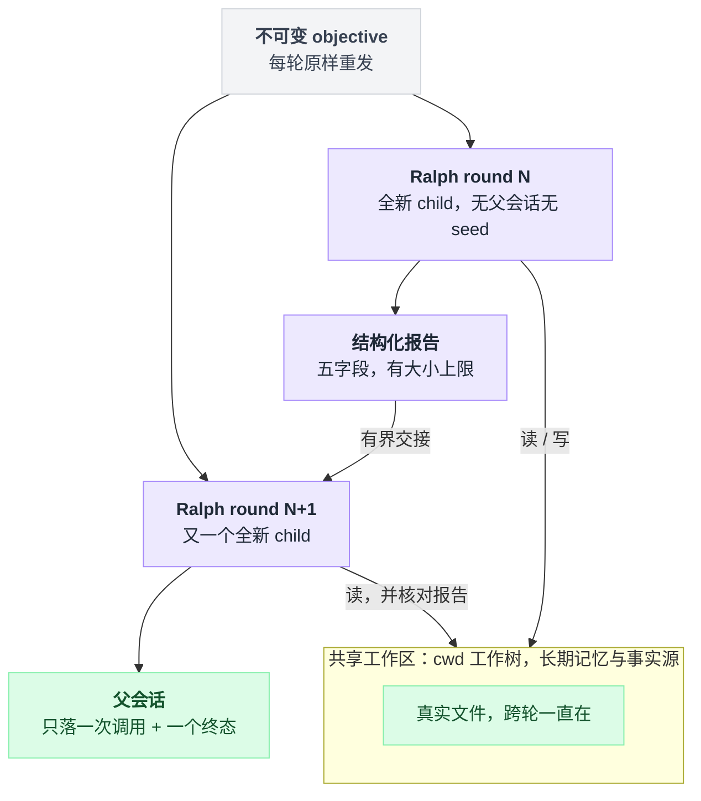
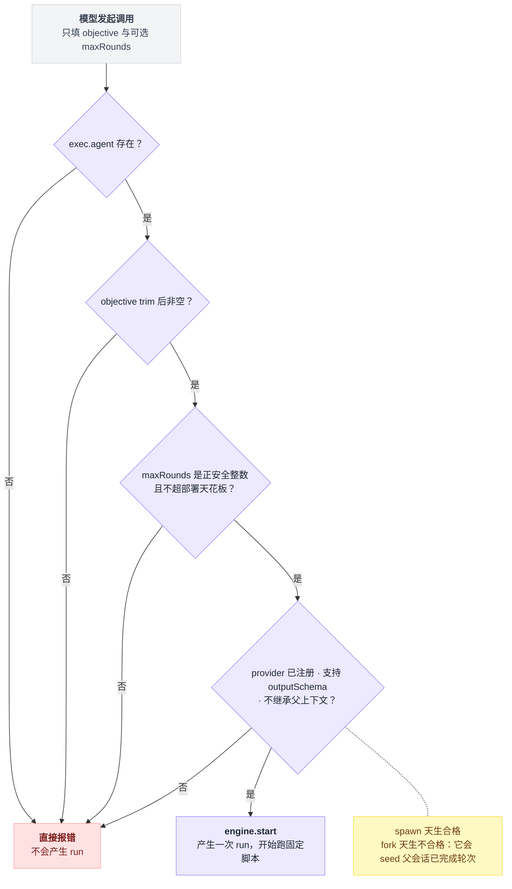
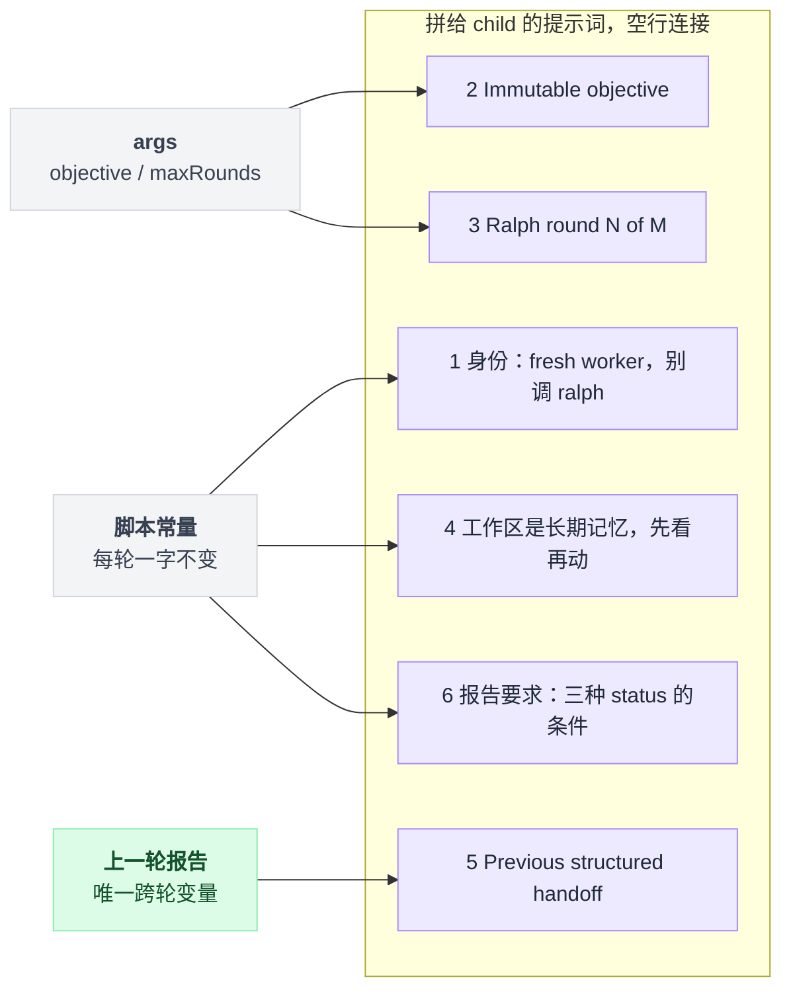
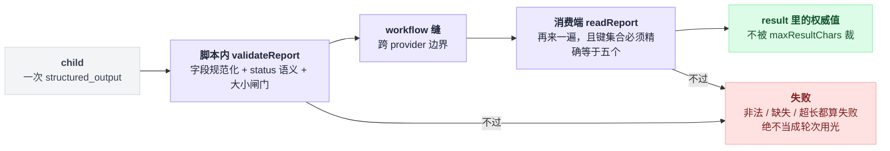
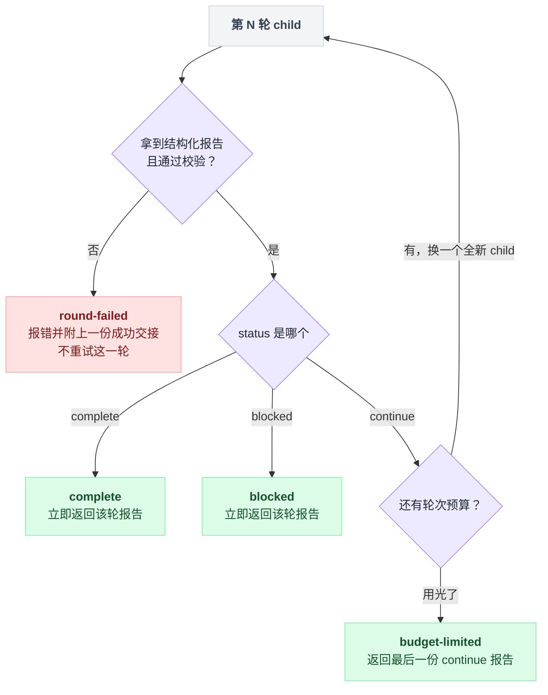
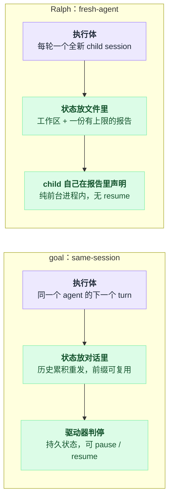

# 27 · Ralph Loop

> 基于 `deepseek-ai/deepseek-harness` v0.1.0-rc.5（commit `47f9438`），2026-08-14 核对。

长任务跑到几十轮开始劈叉的时候，第一反应往往是：模型记性不够，得想办法让它记住更多。

不是的。真实病灶常常正好相反——模型**记得太多了**。几十轮之后它开始"记得"一些从没发生过的事：早期一次失败的尝试、一段被推翻的设计、一句自己安慰自己的"已修复"。这些不是凭空幻觉，是上下文在累积：所有中间推理都还留在同一条对话里，错误进去之后会被一遍遍重新发给模型（直到压缩把它盖掉），每一轮还要把这段前缀再付一次钱。

[26 章](./26-Goal模式.md)的 goal 选择留在这条对话里，靠驱动器不断塞下一条提示。Ralph 选了相反的那条路：**每一轮换一个全新的 child。**

换新 child 之后，跨轮还剩什么？只剩三样——不可变的目标、共享工作区（`cwd` 下的真实文件），以及上一轮留下的一份有大小上限的结构化交接报告。这就是本章第一根柱子：**工作区是长期记忆，对话不是。**

一轮接一轮的形状是这样：目标每轮原样重发，工作区被反复读写并一直留着，而 child 本身用完即弃，只有一份有界报告能跨过轮次边界。



这个形状有个很贴的比喻：工作区是工地，child 是换班的施工队。工地一直在那儿，一班干完人就走，下一班带着同一张施工图（objective）进场，手里只有上一班留的一张字数有限的交接单。这个比喻能直接推出本章好几个结论：上一班说的胡话随下班消失（错误不传染）；新班组每次都得重新巡一遍场（每轮重付"读工作区"的钱）；交接单可能写错，但工地本身不会说谎（所以要拿工作区去核对报告）。后面每一条都会在源码里验到。

这一章讲 dsh 自带的 `ralph` 工具怎么把这件事做出来。读的时候不妨一直带着一个问题：同样是"朝一个目标反复推进"，为什么 goal 和 Ralph 在"什么时候继续、什么时候停、状态放哪"上会分岔得这么远。最后一节专门算这笔账。

## 先把三个词钉死：loop、round、handoff

上面那张图里出现了三种东西：整个循环、每一轮的 child、跨轮的那份报告。官方术语表给它们各起了名字，`docs/glossary.md:43-45` 的定义值得原样抄一遍，因为后面所有讨论都以它为准：

| 术语 | 定义 |
|---|---|
| Ralph loop | 一次**前台**的 fresh-agent workflow run，朝一个不可变目标推进 |
| Ralph round | loop 里的**一个全新 child session**，不带父会话也不带此前 child 的 seed |
| Ralph handoff | 从上一个 continue 轮传给下一轮的**规范化、有上限**的结构化报告 |

同一段还把它**不是**什么写清楚了：不是 same-session goal，不是 agent-loop 的一个模式，不是调度器，也不是通用 workflow 脚本的一个特性（`docs/glossary.md:43`）。

至于"Ralph loop"这个名字在社区里的出处，**仓库里查不到**——`docs/`、`website/`、包 README、Agent Note 里都没有溯源。所以本章只讲 dsh 这一份实现。

## 它是一个普通插件，不是内核里的一个模式

读到"每轮换新 child"这种深改执行方式的机制，很容易默认它动了内核。恰恰没有——这是本章最值得记住的架构判断：**Ralph 是一条策略，不是一台机器。** `tool-ralph` 是 `packages/workflow/` 下一个独立包，注入四个服务就干活（`packages/workflow/tool-ralph/src/index.ts:19-20`）：

```
ralph 工具（模型可见）
   │  inject: ['tools', 'workflowEngine', 'subagents', 'systemPrompt']
   ├── ctx.tools         注册 ralph 这个工具 + 输出 schema + 渲染
   ├── ctx.systemPrompt  注册一段 order 116 的路由指引
   ├── ctx.workflowEngine 起一次 run，执行内置的固定脚本
   │        └── 脚本里的 agent() ──> ctx.subagents ──> spawn provider ──> 一个全新 child
   └── ctx.subagents     调用前当场校验 provider 能力
```

workflow 引擎与 subagent 的通用机制在 [19 章](./19-子agent与workflow.md)，本章只讲 Ralph 这条策略。

用 capability seam（能力缝：一个服务接口 + 可替换的实现，[07 章](./07-Service能力从哪来.md)）的语言说，`ctx.workflowEngine` 这条缝上，`tool-workflow`（模型自己写脚本）和 `tool-ralph`（脚本写死）是**两个并列的 Consumer**；`ctx.subagents` 的 Consumer 列表里也有 `tool-ralph`，注明"要求一条 fresh 的结构化输出路由"。出处：`docs/capability-seams.md:465` 与 `docs/capability-seams.md:458`。

为什么不做进内核？总的理由一句话：把 Ralph 行为塞进 `dsh-agent-loop`、goal driver 或者公开的 workflow 脚本语言，等于**把一条策略焊死在跟它无关的执行机器上**。

Agent Note 把四条被否掉的方案逐条写了：

| 被否的方案 | 为什么否 |
|---|---|
| 放进 same-session goal driver | goal 的轮次故意保留同一条对话，而 Ralph 的定义性质恰恰是每轮换新上下文；两者一合，goal 的生命周期和 child 编排就再也分不开了 |
| 给通用 `workflow` 工具加一个 `fresh` 开关 | 模型可写的脚本 API 要保持通用、provider 中立；Ralph 的固定报告协议与停止策略应该有一个可评审的消费者 |
| 用 `subagent_fork` 换取重放方便 | 理由最硬：继承来的已完成轮次是隐式的、只会变大的交接状态，直接违反 fresh-context 契约 |
| 从工具里直接调 subagent 缝 | workflow 引擎已经拥有前台编排、结构化 child、取消传播、worker 终止、事件和静默 dispose，复用它是在演示插件组合，而不是造第二个 loop runtime |

出处：`.agents/notes/implemented/feature/2026-07-19-fresh-agent-ralph-workflow-tool.md:11`，被否方案在该文件 53-56 行。

代价很实在：`tool-ralph` 自己不拥有任何独立事件流，所以它的 invariant 伴生插件（每个包各自注册的运行时不变量校验器，[25 章](./25-调试手册与常见坑.md)）是空的——run 和 child 的生命周期由 workflow / subagent 的 owner 去校验（`packages/workflow/tool-ralph/src/invariant.ts:18-21`）。这个包薄到几乎只剩策略。

## 模型只能填两个字段

那模型发起一次 Ralph loop 时，能控制多少东西？答案少得惊人。`ralph({ objective, maxRounds? })` 就是全部调用面：

| 参数 | 必填 | 含义 |
|---|---|---|
| `objective` | 是 | 每一轮 fresh child 共用的不可变完成目标 |
| `maxRounds` | 否 | 正安全整数轮次上限，被部署天花板压住 |

出处：`packages/workflow/tool-ralph/src/index.ts:415-425`，生成的 schema 见 `docs/tool-catalog.md:1188-1205`。

provider 选择、报告 schema、交接上限、脚本本体、编排行为，**全部是部署方拥有的，不出现在调用 schema 里**（`packages/workflow/tool-ralph/README.md:62`）。调用是同步等整轮跑完的：工具 `execute` 里 `await run.result`（`:461`）。

起跑前有四道前置检查，串成一条，任何一道不过就直接报错，**不会产生 run**：

| # | 检查什么 | 不过会怎样 | 出处 |
|---|---|---|---|
| 1 | `exec.agent` 必须存在 | Ralph 需要一个调用方 agent 当所有 child 的 parent | `:438-441` |
| 2 | `objective` trim 后必须非空 | 空目标直接打回 | `:442-443` |
| 3 | `maxRounds` 是正安全整数且 `≤` 部署天花板 | `1.5`、`0`、`NaN`、超天花板全打回 | `:208-217`、`:444`，单测 `packages/workflow/tool-ralph/tests/tool-ralph.spec.ts:303-305` |
| 4 | provider 三连：**已注册** → **支持结构化输出（`capabilities.outputSchema`）** → **`inheritsParentContext === false`** | 三条各报各的错 | `:220-232` |

四道闸门都落在 `engine.start()` 之前，所以失败时连 run 都没有：



第四道的三条错误信息各有各的话，单测逐条钉住：`is not registered` / `does not support structured output` / `inherits parent context`（`packages/workflow/tool-ralph/tests/tool-ralph.spec.ts:311-324`）。

第四道里藏着一个值得停一下的判断题：直觉上 `fork` 更省事——child 直接带着父会话的记忆开工，还不用重新交代背景。但恰恰因此它**天生不合格**（`packages/subagent/subagent-fork-in-process/src/index.ts:64`）：它会把父会话已完成轮次 seed 给 child，而那正是 Ralph 存在的意义要消灭的东西。`spawn` 才天生合格（`packages/subagent/subagent-spawn-in-process/src/index.ts:42,44`）。

还有个容易被当成低效的细节：**每次调用都重查 provider**，而不是在 `apply()` 时查一次。理由是 provider 注册是 effect 作用域的，插件生命周期和 HMR（热重载，[08 章](./08-effect与生命周期.md)）都可能让它变（`packages/workflow/tool-ralph/README.md:34`）。

### 路由是脚本看不见的那一半

固定脚本看不到也改不了自己走哪条 provider——路由是工具在 `WorkflowStartRequest` 里填好的，头两行就是（`packages/workflow/tool-ralph/src/index.ts:447-455`）：

| 字段 | 值 | 作用 |
|---|---|---|
| `subagentProvider` | `resolved.subagentProvider` | 这一次 run 里每个 `agent()` 调用都走它 |
| `maxTotalAgents` | 本次解析出的 `maxRounds` | 让固定循环的轮次预算和引擎的"跑飞 child"兜底对齐 |
| `args` | `{ objective, maxRounds, maxHandoffChars }` | 脚本只拿到数据 |
| `parent` | `exec.agent` | 每个 child 归属调用方，继承 cwd 与血缘 |
| `signal` | `exec.signal` | 取消通道 |

另外两个字段 `script` / `meta` 是固定脚本本体与它的身份块。

`subagentProvider` 与 `maxTotalAgents` 是 seam 上的可选项（`packages/workflow/workflow/src/runtime-types.ts:26-29`），worker-thread 引擎在**发布 run 之前同步**解析它们：

- provider 名必须规范化且已注册，否则抛 `INVALID_ARGUMENT` / `AGENT_START`（`packages/workflow/workflow-worker-thread/src/index.ts:77-89`，调用点在 `:146-147`）
- `maxTotalAgents` 必须是正安全整数且不得超过引擎自己的部署天花板（默认 1000），否则 `INVALID_ARGUMENT`（同文件 `92-104`、`118`）

普通 `workflow` 工具这两个字段都不填，所以它的行为和 provider 策略一点没变（`packages/workflow/workflow-worker-thread/README.md:86`）。

单测把这份 start request 整个钉住了：`meta.name === 'ralph-loop'`、`args` 三件套、`subagentProvider: 'fresh'`、`maxTotalAgents: 4`、`parent` 是调用方本人（`packages/workflow/tool-ralph/tests/tool-ralph.spec.ts:149-155`）。

## 每个 child 到底收到什么

新班组进场，手里到底有几张纸？固定脚本每轮拼一段提示词，六段，用空行连接（`packages/workflow/tool-ralph/src/index.ts:155-162`）：

1. 身份：你是前台 Ralph loop 里的一个 fresh worker，**没有父会话、没有此前 child 的会话**；不要调用 `ralph` 工具，这一轮你就是它的 worker
2. `Immutable objective:` + trim 后的目标原文
3. `Ralph round: <round> of <maxRounds>.`
4. 共享工作区及其当前工作树是**长期记忆和事实源**：动手前先看，保住已有成果，做具体的、在范围内的活儿，改了就验证；把上一轮报告只当作有界交接，**要拿工作区去核对它**
5. `Previous structured handoff:` + 上一轮报告的 JSON，第一轮是 `(none — this is the first round)`
6. 报告要求：`continue` 必须带至少一条 nextSteps；`complete` 只在有具体证据且没有 nextSteps 时用；`blocked` 只在没有人类介入或外部状态变化就无法推进时用；`blocker` 除 blocked 外必须为空

第四段就是工地比喻里"交接单可能写错，工地不会说谎"的官方版本——它明写着报告只是有界交接，事实以工作树为准。六段里有一半是脚本常量、每轮一字不差，真正随轮次变的只有轮号和上一轮那份报告：



child 自己的 system prompt 照常由它那棵插件树装配（[15 章](./15-系统提示词与上下文装配.md)），但**父会话的内容一个字都不进来**。

这一条不是口头承诺，有落盘证据。shipped headless 回放快照跑完后逐条检查磁盘上的会话日志，一共三份：一份 parent（`delegationDepth: 0`），两份 child（`delegationDepth: 1`，`parentSession` 都是 parent 的 id，`cwd` 与 parent 相同，**`seedLength`**——会话被预置的历史长度，[16 章](./16-会话日志与分叉.md)——**都是 `undefined`**，两个 id 互不相同）。

内容上：child 1 的首条 `user/message` 含 `Ralph round: 1 of 2.` 和 `(none — this is the first round)`、**不含** `ROUND_ONE_HANDOFF`；child 2 含 `Ralph round: 2 of 2.` 和 `ROUND_ONE_HANDOFF`；两个 child 的 prompt 都含 `objective` 原文，**都不含人类那句原话**。出处 `examples/headless-agent/tests/headless.snapshot.ts:729-772`。

真实栈的集成测试用同一组断言再验一遍，并额外断言 child 的请求里既没有父会话 prompt 标记也没有父会话历史标记（`packages/workflow/tool-ralph/tests/integration.spec.ts:95-113`）。

child 侧唯一多出来的东西是结构化输出捕获契约：回放快照断言每个 child 的工具调用**只有一次** `structured_output`（`examples/headless-agent/tests/headless.snapshot.ts:768-772`；该工具名定义在 `packages/subagent/subagent-in-process-driver/src/structured.ts:19`）。

## 交接报告是一张不许撕的交接单

`agent()` 的 `schema` 参数就写在脚本顶部，五个字段全部 `required`、`additionalProperties: false`（`packages/workflow/tool-ralph/src/index.ts:91-102`，传入点 `:166`）：

| 字段 | 类型 | 要求 |
|---|---|---|
| `status` | enum | `continue` / `complete` / `blocked` |
| `summary` | string | 非空且**已规范化**（`value === value.trim()`） |
| `evidence` | string[] | 每项都非空且已规范化 |
| `nextSteps` | string[] | 同上 |
| `blocker` | string | 已规范化（可以是空串） |

三种状态各自还有语义约束：

| status | 必须有 | 必须没有 |
|---|---|---|
| `continue` | 至少一条 `nextSteps` | `blocker` 必须是空串 |
| `complete` | 至少一条 `evidence` | `nextSteps` 为空、`blocker` 为空串 |
| `blocked` | 一条具体的 `blocker` | — |

然后是大小闸门。整段校验合起来是这样：

```
validate(report):
    检查五个字段的类型与规范化（summary 非空、数组每项非空且 trim 过）

    if status == continue:  nextSteps 至少一条，且 blocker 必须是空串
    if status == complete:  evidence 至少一条，nextSteps 必须空，blocker 必须空串
    if status == blocked:   blocker 必须是一条具体内容

    if JSON.stringify(report).length > args.maxHandoffChars:
        抛错                                  // 不截断，直接整个失败
```

语义约束在 `:125-143`，大小闸门在 `:144-147`。

同一套规则会被跑两遍。一遍在 workflow 脚本里，也就是上面这些；另一遍在工具消费端跨过 workflow 缝之后重新解码（`readReport()`，`:247-280`）。消费端还额外要求键集合精确等于 `blocker,evidence,nextSteps,status,summary`，多一个键都算 malformed。

源码把这一遍写成"跨 provider 边界的防御性解码"（`:246`），README 则把"脚本内 + 消费端各校验一次"直接定为契约（`packages/workflow/tool-ralph/README.md:11`）。单测把 18 种畸形终值逐个跑了一遍（`packages/workflow/tool-ralph/tests/tool-ralph.spec.ts:333-366`）。

一份报告从 child 手里到工具返回值，要过两道内容一样的关，中间隔着 provider 边界；任何一道不过，都是整个 workflow 失败：



这里有一道验收题：报告超长，为什么是让整个 workflow 失败，而不是截断留个尾巴？截断听起来明明更宽容。

想象把交接单撕掉后半张：留下来的前半张**仍然长得像一张完整的交接单**，下一班照着它开工，却不知道被撕掉的正是关键的证据或 next steps。Agent Note 的原话就是这个意思：截断可能刚好切掉状态证据或 next steps，而剩下的东西看起来仍然像一份权威交接；生产者必须在配额内产出一份合法报告（`.agents/notes/implemented/feature/2026-07-19-fresh-agent-ralph-workflow-tool.md:57`）。

同一条逻辑贯穿到底——报告非法、缺失、超长都是**失败**，绝不会被误当成"轮次用光"（`packages/workflow/tool-ralph/README.md:11`）。

## 停不停，是 child 自己在报告里说的

谁来决定循环继续还是收工？不是脚本，不是引擎——**是每一轮 child 自己在报告里声明的，脚本只负责照做。** 固定脚本的主循环写出来就这么长：

```
last_handoff = none
for round in 1..maxRounds:
    report = agent(拼好的六段提示词, schema, label="Ralph round <round>")

    if report is null:                  // child 失败，还没轮到校验
        return round-failed(last_handoff)   // 不重试这一轮

    validate(report)                    // 不过就整个 workflow 失败

    if report.status == complete:  return complete(report)
    if report.status == blocked:   return blocked(report)

    last_handoff = report               // continue，带着它进下一轮

return budget-limited(last_handoff)     // 循环走完，最后一份还是 continue
```

三个成功出口（`:172-176`）：

| 终态 | 触发 | `report` 是哪一份 |
|---|---|---|
| `complete` | 某轮报 `complete`，立即返回 | 该轮报告 |
| `blocked` | 某轮报 `blocked`，立即返回 | 该轮报告 |
| `budget-limited` | 最后一轮仍是 `continue`，循环走完 | 最后一份 `continue` 报告 |

把这三个出口和后面那节的 `round-failed` 摆在一起看，一轮结束后的分岔一共只有四条，其中只有 `continue` 会回到循环里：



工具的返回信封只有三个字段（`:379-383`）：`{ runId: string, agentsStarted: integer, result: json }`。其中 `agentsStarted` 来自引擎结算值 `settled.agentsStarted`（`:466-470`）——正常结算时它是脚本侧计数，被强制终止时退化为宿主观测值（`packages/workflow/workflow/src/types.ts:80-86`）。

渲染文本走的是另一条路（`:361-376`，挂在工具的 `output.render` 上 `:432-435`），三句话的措辞是刻意的：

- `Ralph worker reported completion after N rounds.`
- `Ralph worker reported a blocker after N rounds.`
- `Ralph reached its N rounds limit; the worker reported work remaining.`

"**worker reported**"是设计要求，不是行文习惯。这几个字是本章的靶心：完成和阻塞都是 worker 的自我声明，不是独立认证——**dsh 里没有任何独立评估者去判定目标是否真的完成**，这一项被明确列为已推迟工作（`packages/workflow/tool-ralph/README.md:13,88`）。

`maxResultChars` **只裁这段渲染文本**，包含信封和截断标记 `\n… [truncated]` 在内，不动 `result` 里那份已校验的权威值，也不动跨轮交接（`:351-358`，README 第 13 行）。

单测钉得很死：`maxResultChars: 160` 时文本长度**恰好** 160 且以 `… [truncated]` 结尾；上限比标记本身（14 字符）还短、比如给 `5` 时，输出就是 `'\n… [t'`（`tests/tool-ralph.spec.ts:206-208`、同文件 `218`）。

父会话里最终落下的是什么？shipped headless 快照的 `tool/result` 事件原文（`examples/headless-agent/tests/snapshots/ralph-loop/stream-json.expected.jsonl:16`）：

```
Ralph worker reported completion after 2 rounds.
Final report:
{
  "status": "complete",
  "summary": "The Ralph snapshot objective is complete.",
  "evidence": [
    "Two fresh rounds completed through the shipped app."
  ],
  "nextSteps": [],
  "blocker": ""
}
```

中间轮次的 child 消息、中间报告，**一条都不进父对话**（`packages/workflow/tool-ralph/README.md:76`）。

## 失败与取消：没有一种半成品算成功

普通 child 失败——模型跑到 token 上限，或者 child 正常结束但状态不是 completed——在 workflow 语言里映射成 `agent()` 返回 `null`（`packages/workflow/workflow/README.md:43`）。

固定脚本在校验报告**之前**就拦下它，返回 `round-failed` 和最后一次成功交接（`packages/workflow/tool-ralph/src/index.ts:168-170`），工具再把它变成一个错误结果（`:465`，渲染见 `:386-392`；真实栈复现见 `tests/integration.spec.ts:126-129,146-148`）。

第 1 轮就挂是 `Ralph round 1 child failed before producing a structured report.` 加一句 `No previous handoff was available.`；第 N 轮挂则是同样的抬头，后面接 `Last successful handoff:` 和上一份报告。**Ralph 不重试那一轮**（README 第 15 行）。

致命失败与取消永远不算成功，`stopReasonError()` 三行判完（`:336-349`）：

```
if stopReason == completed:  继续解码终值
if stopReason == cancelled:  报 "Ralph workflow was cancelled (<reason>)"
if stopReason == error:      报 "Ralph workflow failed: <error>"
```

provider 启动、传输、worker、workflow 层的致命故障仍然是普通 workflow 错误，而且**可能在固定脚本来得及返回交接之前就结算**（README 第 15 行）。

取消走两条通道，是刻意的冗余（`:454-458`）：

```
start 请求里带上 signal = exec.signal              // 通道一：交给引擎
exec.signal.addEventListener('abort', () =>       // 通道二：自己桥接
    run.cancel('parent step aborted'))

if exec.signal.aborted:                            // 补查一次
    run.cancel('parent step aborted')
```

那句补查不是多余的：如果 abort 恰好落在 `start()` 执行期间，上面那个监听器不会再触发，只能靠这一次兜住。README 说这么写是为了"实现独立性"，不依赖某个引擎一定接 signal（第 19 行）。

两个单测分别覆盖飞行中取消和 start 期间取消，都断言 `engine.cancels === ['parent step aborted']` 且 `disposed === 1`（`tests/tool-ralph.spec.ts:269-297`）。至于"调用之前信号就已经 abort"，根本到不了 `execute`：工具运行时先返回 `TOOL_ABORTED_BEFORE_DISPATCH`（同文件 `277-281`）。

`finally` 里无条件 `await run.dispose()`（`:471-474`）。这不是礼貌，是必需：run 是 holder 拥有的，持有者必须在每条路径上 dispose（`packages/workflow/workflow/README.md:15`）。

worker-thread 引擎的 `dispose()` 幂等，会取消 run、在 `disposeGraceMs`（默认 5000ms）内等结果与 child 静默、然后无条件终止 worker 并做一次幸存者清扫（`packages/workflow/workflow-worker-thread/README.md:65,84`）。所以一次被取消的父步骤会**等到引擎有界终止、child 静默之后才返回**——它不会立刻甩手就走。

## 它装在哪、怎么发起、怎么逐轮看

四个部署参数（`packages/workflow/tool-ralph/src/index.ts:35-40`，目录版见 `docs/config-catalog.md:2520-2538`）：

| Key | 默认 | 含义 |
|---|---|---|
| `subagentProvider` | `spawn` | 每一轮用的 fresh 结构化输出 provider |
| `maxRounds` | `256` | 一次 run 的默认轮次上限，**同时是**调用方 `maxRounds` 的天花板 |
| `maxHandoffChars` | `16384` | 单份报告序列化后的字符上限 |
| `maxResultChars` | `16384` | 成功时父侧渲染文本的字符上限（含截断标记） |

这四个值在插件 `apply()` 时就规范化并校验，**包括绕过 Loader schema 直接调用 apply 的情况**（`resolveConfig()`，`:187-205`；单测 `tests/tool-ralph.spec.ts:326-331`）。

它已经装在这些地方：

| 位置 | 配置 | 出处 |
|---|---|---|
| base bundle | `subagentProvider: spawn`、`maxRounds: 64` | `packages/bundle/base/cordis.patch.yml:378-382` |
| `standard` agent preset | 与 base 相同 | `apps/cli/config/agent-presets/standard/agent.cordis.yml:229-233` |
| `code` / `cordis` agent preset | 与 standard 一模一样 | `code` 的 `230-234`、`cordis` 的 `217-221` |
| `minimal` agent preset | 不装 | — |
| web-app 层 | 一行 `disabled: true` | `packages/bundle/web-app/cordis.patch.yml:398-399` |
| 两个 example | 不带 config，走全部默认值 | `examples/headless-agent/cordis.yml:145-146`、`examples/acp-agent/cordis.yml:147-148` |

web-app 那一行是 host plane 关掉，由 agent preset 决定自己的 agent 看得见哪些委派工具（同文件 `372` 的说明）。

`apps/web/tests/shipped-composition.e2e.ts:35-59` 是出厂 Web 组合"模型可见工具清单"的断言表，`ralph` 在第 `47` 行（断言在 `:91`），所以默认组合里模型是**看得见**它的。

改配置按 [03 章](./03-配置的四层结构.md)的 patch 规则加一行。注意 **patch 会整块替换目标行的 `config`**，所以这一行拥有的每个 key 都得重写一遍（`packages/bundle/web-app/cordis.patch.yml:5-6`）：

```yaml
- id: tool-ralph
  config:
    subagentProvider: spawn
    maxRounds: 16
    maxHandoffChars: 16384
    maxResultChars: 16384
```

想彻底关掉就 `- id: tool-ralph` + `disabled: true`，形状同 `packages/bundle/web-app/cordis.patch.yml:398-399`。

### 怎么发起一次

模型被明确要求：**只在直接的人类明确要求 Ralph loop 或 fresh-agent 迭代时才调用它**（system prompt section `tool:ralph`，order 116，`packages/workflow/tool-ralph/src/index.ts:407-411`）。所以你得把话说明白。

shipped 快照里的那句人话长这样（`examples/headless-agent/tests/snapshots/ralph-loop/input.json:5`）：

```
Run a two-round fresh-agent Ralph loop to prove the shipped headless integration.
```

模型据此发出的调用，落在快照的 `tool/call` 事件里（`.../stream-json.expected.jsonl:15`）：

```json
{"objective":"Prove two fresh Ralph rounds through the shipped headless app.","maxRounds":2}
```

读包 README 时注意一处笔误：`packages/workflow/tool-ralph/README.md:47` 抄录这段指引时把结尾写成了 `workflowEngine`，源码 `:410` 里是 `workflows`——以源码为准。

### 怎么逐轮跟踪

运行时看 `workflow/*` 事件。它们是只读的，只带 `WorkflowRunInfo`（id + meta），拿不到 run 控制权（`packages/workflow/workflow/README.md:23`）。

Ralph 只用一个 phase，叫 `Fresh-agent rounds`（`packages/workflow/tool-ralph/src/index.ts:83,152`），每轮的 `agent()` 带 `label: 'Ralph round <N>'`（`:164`）。

下面这个监听插件改编自集成测试的写法（`packages/workflow/tool-ralph/tests/integration.spec.ts:78-83,251`），事件签名见 `packages/workflow/workflow/src/index.ts:51,68,79`，payload 字段见 `packages/workflow/workflow/src/types.ts:98-116`。存成 `plugins/ralph-tracer.ts`：

```ts
import type { Context } from '@deepseek-ai/cordis'
import type {} from '@deepseek-ai/dsh-workflow'

export const name = 'ralph-tracer'

export function apply(ctx: Context): void {
  ctx.on('workflow/phase', (run, title) => {
    ctx.logger.info(`${run.meta.name} phase: ${title}`)
  })
  ctx.on('workflow/agent-start', (run, agent) => {
    ctx.logger.info(`${run.id} #${agent.seq} ${agent.label} -> ${agent.childId}`)
  })
  ctx.on('workflow/agent-end', (run, agent) => {
    ctx.logger.info(`${run.id} #${agent.seq} ${agent.outcome}`)
  })
}
```

那个空的 `import type {}` 不是笔误，它只为把 `@deepseek-ai/dsh-workflow` 的事件声明合并进 `Context`，仓库自己也这么写（`packages/workflow/tool-ralph/src/index.ts:17`）。`ctx.logger` 是 Cordis 自带服务，不用 inject（`vendor/cordis/src/context.ts:28`）。

挂载就在 `cordis.yml` 里加一行，本地插件用相对路径引用（形状同 `examples/acp-agent/child-question.cordis.yml:13-14`）：

```yaml
- id: ralph-tracer
  name: './plugins/ralph-tracer.ts'
```

一次 2 轮的 run 应当打出 1 行 phase，外加 2 对 agent-start / agent-end。

事后就翻会话日志（[16 章](./16-会话日志与分叉.md)）。判据是快照测试用的那套（`examples/headless-agent/tests/headless.snapshot.ts:734-763`）：`header.parentSession` 等于父会话 id 的就是 Ralph child，`delegationDepth` 为 1，`cwd` 与父一致，`seedLength` 缺席；每个 child 的首条 `user/message` 里能直接读到 `Ralph round: N of M.` 和上一轮交接。

## Ralph 还是 goal：分岔点只有一个

两者都是"朝一个目标反复推进"，真正的分岔点只有一个：**上下文往哪儿放。** 这一个选择往下决定了成本曲线、错误传染、可观测性、能不能 resume。

一边把状态存进对话、由驱动器判停，另一边把状态存进文件、由干活的 child 自己在报告里声明停不停：



逐维度对下来，每一行都是"上下文放哪"这一个选择的推论——包括开头工地比喻推出的那三条（错误不传染、每轮重付读工作区的钱、拿工作区核对报告）：

| 维度 | goal（same-session） | Ralph |
|---|---|---|
| 每轮的执行体 | 同一个 agent 的**下一个 turn**（一块 `<goal_round>` 用户消息，`packages/goal/goal-round-driver/README.md:48`） | 一个**全新的 child session** |
| 上下文 | 累积：保留的轮次一直重发，直到压缩盖掉（同上 `:52`） | 归零：只有目标 + 工作区 + 一份 ≤ `maxHandoffChars`（默认 16384 字符）的报告 |
| 错误传染 | 会：错误推理留在同一条对话里 | 不会：上一轮的胡话随 child 一起消失（tool-ralph README 第 90 行） |
| 跨轮记忆 | 整条会话历史 | **工作区**是唯一长期记忆，报告只是补充（`docs/glossary.md:45`） |
| KV cache（复用已发过的请求前缀，省钱省延迟） | 追加式，前缀可复用（goal-round-driver README 第 56 行） | 每个 child 一份**独立**请求缓存（tool-ralph README 第 84 行） |
| token 成本 | 前缀重发，随轮次线性变贵 | 每轮重付一遍"读工作区"的钱，但不重付历史（tool-ralph README 第 80 行） |
| 持久性 | 目标是持久状态，有 pause / resume 动词，会话 resume / fork 后仍在（`packages/goal/goal/README.md:20,28`） | **纯前台、进程内**：无 job id、无后台收集、无 resume（tool-ralph README 第 89 行，Agent Note 第 70 行） |
| 可观测性 | 都在同一条会话里，直接读 | 父会话只留一次调用 + 一个终态；细节在 child 会话和 `workflow/*` 事件里 |
| 终态权威 | 模型侧策略判定证据是否充分（goal-round-driver README 第 60 行） | 同样是自我声明，**没有独立评估者**（tool-ralph README 第 88 行） |
| 预算 | 轮次上限（不是资源预算，同上第 63 行） | 只有轮次数；token / 金额 / 时长预算都推迟（tool-ralph README 第 93 行） |

落到选型上：

- 任务需要积累判断、要跟人来回确认、中途会被追加新要求 → 选 goal
- 任务能被"读工作区 → 干一小块 → 验证 → 写报告"完整描述，且每一步的成果都落在文件里 → 选 Ralph
- 已经吃过"模型记得自己没做过的事"的亏 → 选 Ralph
- 需要暂停、恢复、后台跑、重启后接着跑 → 两个都不选：Ralph 是前台限定，goal 那套 resume 也不是后台调度
- 只是要有界委派或扇出 → 用普通 subagent 或 `workflow` 就够了，这也是 system prompt 里写给模型的路由建议（`packages/workflow/tool-ralph/src/index.ts:410`）

最后一条是踩坑重灾区：**Ralph 的成功不等于目标达成**。返回值里那句 "worker reported" 是字面意思——完成与阻塞都是干活的那个 child 自己说的，dsh 没有任何一方去核实（README 第 88 行）。要认证就得自己在外面加一层评估，而那正是被推迟的工作。

## 把整章串起来

回到开头那条工地：能不能把全章结论一条条重新推出来，是检验自己真懂了的办法。

- 从"每轮换全新 child"推出：上一轮的胡话随 child 一起消失，错误不传染；代价是每个 child 一份独立的请求缓存、每轮重付一遍"读工作区"的钱——这正是它和 goal 在成本曲线上的分岔。
- 从"工作区是长期记忆，对话不是"推出：报告只是有界交接单，可能写错，工地不会说谎，所以提示词第四段明写着要拿工作区去核对它。
- 从"交接单是一张不许撕的单子"推出：超长不截断、直接整个失败——因为撕掉一半的交接单看起来仍像完整的；也因此报告非法、缺失、超长统统算失败，绝不被误当成"轮次用光"。
- 从"fork 会 seed 父会话已完成轮次"推出：它天生过不了 provider 闸门——继承来的记忆正是 Ralph 要消灭的东西。
- 从"worker reported 是字面意思"推出：Ralph 的成功不等于目标达成，dsh 没有独立评估者，要认证得自己在外面加一层。
- 从"它只是一个普通插件"推出：内核一行没改，Ralph 全部行为都是 workflow + subagent 两条缝上的一个消费者拼出来的。

一句话版本：**goal 把状态留在对话里，Ralph 把状态留在文件里；前者靠上下文续跑，后者靠一份有上限的报告续跑。** 停止判据也跟着分岔：goal 由驱动器在同一条会话里判，Ralph 由每一轮 child 自己在报告里声明 `continue` / `complete` / `blocked`，脚本只负责照做。

[28 章](./28-自己写一个续跑插件.md)自己写续跑插件时，"状态放哪、谁判停"就是你要先想清楚的那两个选择。想知道 Pi / Codex / LangChain 在同一道题上怎么选，见[五个 agent 系统源码解剖](../2026-08_五个agent系统源码解剖/00-总览与阅读指南.md)。
