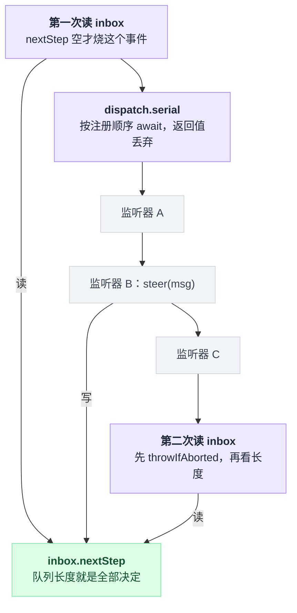
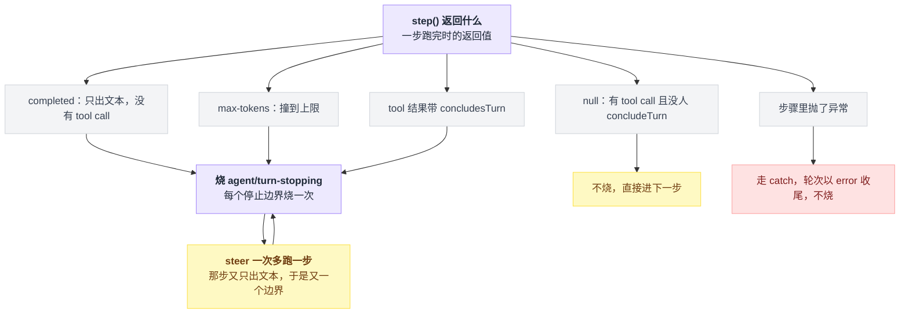
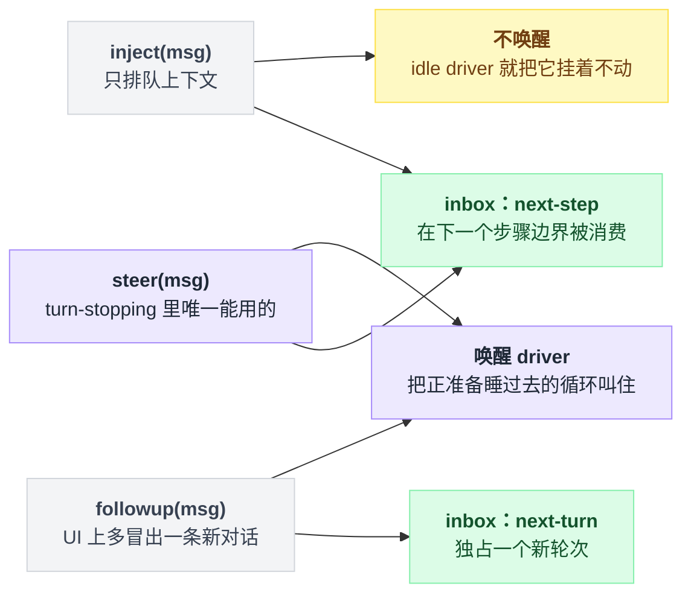
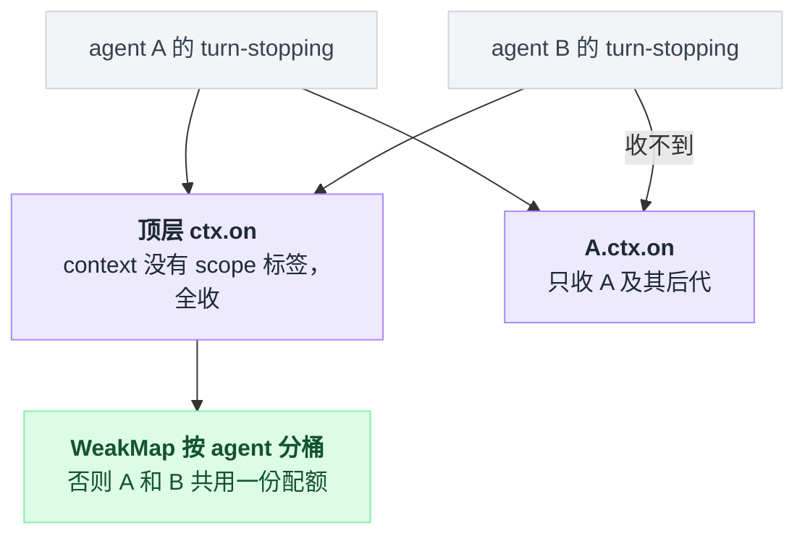
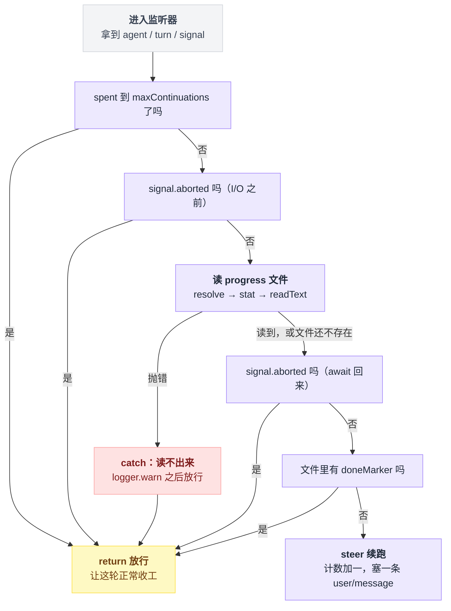
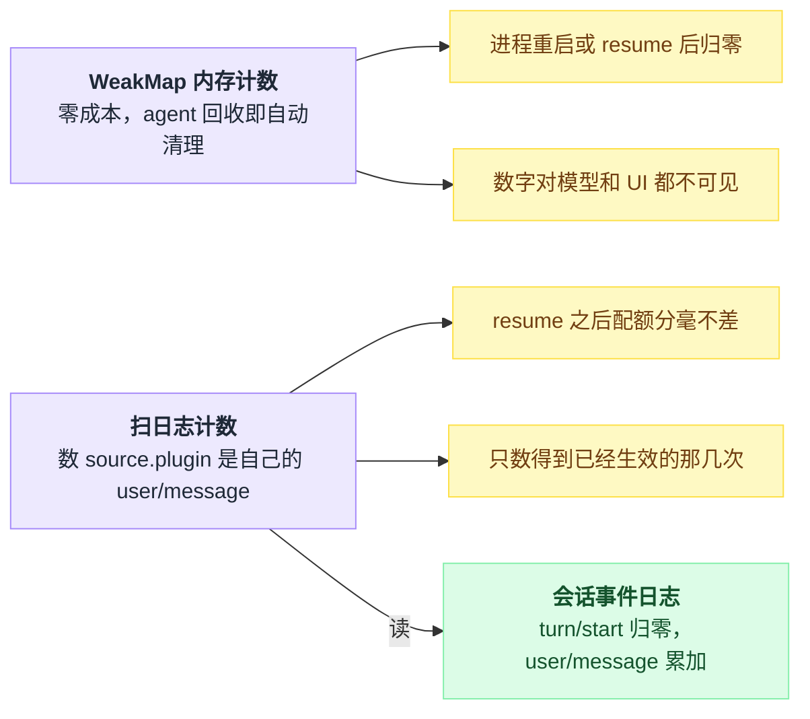
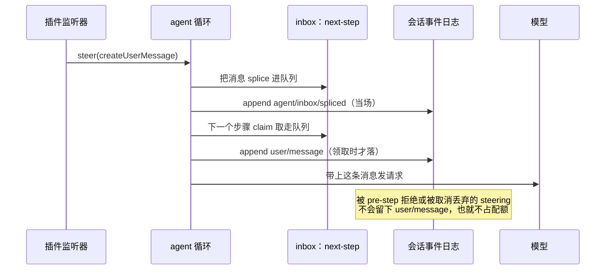

# 28 · 自己写一个续跑插件

> 基于 `deepseek-ai/deepseek-harness` v0.1.0-rc.5（commit `47f9438`），2026-08-14 核对。

前两章拆的是两个内置样本：[26 章](./26-Goal模式.md)的 goal 用状态机管一个长目标，[27 章](./27-RalphLoop.md)的 ralph 每轮换一个全新子 agent。

这一章两个都不用，从零写一个插件——六十行，干一件事：在 agent"自以为干完了"的那一刻把它拦下来，接着干。

写这个插件会逼你搞清四件在别处容易含糊过去的事：

- `agent/turn-stopping` 为什么不是拦截器
- `steer` / `followup` / `inject` 三个口子分别通向哪
- `ctx.fs` 到底有哪些方法（比你以为的少）
- 续跑的计数应该活在进程内存里还是落进会话日志

最后还得给它装刹车——没有刹车的续跑插件就是一台按次收费的永动机。

---

## 你不是在否决关闭，你是在往 inbox 里塞东西

[11 章](./11-waterfall专章.md)讲的 waterfall 是这么个模型：监听器拿到 `next()`，不调用就短路。很多人第一反应会把 `agent/turn-stopping` 也当成这一类，然后去找"返回 false 就别停"的写法。

找不到的，它压根不是那种事件。

循环里那一行是：

```ts
await this.dispatch.serial('agent/turn-stopping', { turn, signal })
```

`serial` 只是按注册顺序 await 每个监听器，没有 `next()` 可传，返回值也被这行 `await` 整个丢掉。出处：`vendor/cordis/src/events.ts:204-210`、`packages/core/agent-loop/src/agent.ts:296`。

那"要不要再跑一步"到底谁说了算？事件声明上方那段注释就是官方契约，逐字抄在这里（`packages/core/agent/src/runtime-types.ts:261-271`）：

> The turn is about to close: the model owes no response (no live tool calls, no fresh steering). Awaited before the boundary commits — a listener that objects steers (`agent.steer(...)`) and the machine re-reads its inbox: fresh steering runs another step, none closes the turn. Data decides, so listener order cannot change the outcome.

"Data decides" 落到代码上，就是 dispatch 前后各查一次 inbox（`agent.ts:295-299`）：

```
  步骤跑完 → nextStep 空？ ──否──→ 直接再跑一步（事件根本不烧）
                  │是
     dispatch.serial('agent/turn-stopping')  ← 你的监听器在这里 steer()
                  │ 然后 signal.throwIfAborted()
        nextStep 还是空？ ──是──→ break，关闭轮次
                  │否 → 再跑一步
```

所以这个事件给你的不是否决权，是一个窗口期：在这段时间里往 inbox 塞一条 steering，循环再看一眼 inbox，有货就继续。

把上面那张控制流翻成数据流会更清楚：有话语权的只有 inbox，监听器往里写、循环在事件前后各读一次，所以监听器谁先谁后都不改变结果。



这里有个坑，踩上了很难查。`serial` 的语义是 bail：

```
for listener in listeners:
    result = await listener(payload)
    if result 非 null 且 非 false 且 非 undefined:
        return result            // 提前 return，后面注册的监听器一个都不跑
```

事件声明的返回类型写的是 `Promise<void> | void`，可 TypeScript 允许把"返回 boolean 的函数"赋给"返回 void 的函数类型"。你顺手写个 `return true` 表示"我处理过了"，编译器不拦、循环不理，**唯一的实际后果是把别人注册的监听器静默吃掉**。

只写 `return`，别写 `return 值`。bail 判定见 `isBailed`（`vendor/cordis/src/events.ts:13`）。

---

## 它按停止边界烧，不按轮次烧

payload 就三个字段：`agent` / `turn` / `signal`（`runtime-types.ts:278`）。

触发条件比想象中窄，看 `step()` 的返回值就清楚：

| `step()` 返回什么 | 什么情况下 | 烧不烧 | 行号 |
|---|---|---|---|
| `{ kind: 'completed' }` | 模型只出文本、没有 tool call | 烧 | `agent.ts:394` |
| `{ kind: 'max-tokens' }` | 撞到 max tokens | 烧 | `agent.ts:391` |
| 非 null | tool 结果带了 `concludesTurn` | 烧 | `agent.ts:399` |
| `null` | 有 tool call 且没人调用 `concludeTurn` | 不烧，直接进下一步 | `agent.ts:399` |
| 抛异常 | 步骤里出错 | 走 catch，轮次以 error 收尾，不烧 | — |

五种收尾各走各的路，只有三种通向这个事件，而且 steer 之后还会绕回来：



关键在于**它是每个停止边界烧一次，不是每轮烧一次**。你 steer 一次，多跑一步，那一步又只出文本没有 tool call，于是又是一个停止边界，又烧一次。

没有上限的插件不是"多跑一步"，是无限循环，而且每一圈都是一次真实的模型请求。

---

## steer / followup / inject：塞哪个口子

三个方法的实现只差一个参数（`agent.ts:122-132`）：

| 方法 | 落到哪个 inbox | 唤醒 driver | 声明处语义（`runtime-types.ts`） |
|---|---|---|---|
| `steer(msg)` | `next-step` | 是 | Submit steering for the nearest step：空闲则开一轮，运行中则在下一个步骤边界被消费（`:126-133`） |
| `followup(msg)` | `next-turn` | 是 | Queue an ordinary follow-up turn：独占一个新轮次（`:119-124`） |
| `inject(msg)` | `next-step` | **否** | 只排队上下文、不唤醒；可能错过已领完批次的那次请求（`:135-143`） |

拆开看，三个方法就是两个 inbox 配一个唤醒开关的三种组合：



turn-stopping 里只能用 `steer`。`followup` 会另开一个轮次，UI 上就是"又冒出一条新对话"；`inject` 虽然也落 `next-step`，但它的契约明写着 idle driver 会把它挂着不动，语义对不上——我们要的恰恰是"把一个正准备睡过去的循环叫住"。

`steer` 也不是万无一失，两个代价都写在它自己的注释里（`runtime-types.ts:129-131`）：被 `agent/pre-step` 拒绝的步骤，会把 steering 原样停在 inbox 里等下一次唤醒；取消或 dispose 则可能直接丢弃 pending steering。

**`steer()` 返回不等于"模型一定看到了"**，后面第三条防线和计数方案都跟这句话有关。

---

## 顶层注册的监听器会收到每一个 agent

签名里那个 `this: Scoped<Agent>` 不是装饰。agent 构造时就把自己当 scope key 建好了事件 carrier（实现是 `agentCarrier(agent) = scopeTarget(agent, agent)`）。

准入规则在 `scopeTarget` 里，三句话就能背下来：

```
注册在没有 scope 标签的 context 上        → 全收
注册在某个 agent 的 scope（或其祖先 scope）→ 只收该 agent 及其后代
标签比 dispatch key 更"低"                → 收不到
```

因为事件只沿 scope 链往上走，不往下走。出处：`agent.ts:86`、`packages/core/agent/src/dispatch.ts:94-96`、`packages/core/scope/src/index.ts:170-183`，"全收"那条是 `index.ts:176`。

生成的路由表把这条路由写死了（`packages/core/scope/src/scoped-events.generated.ts:22`）：

```ts
'agent/turn-stopping': args => (args[0] as Record<string, unknown>)['agent'],
```

实践含义直接决定下一节的代码怎么写：本章插件用顶层 `ctx.on`，所以它会收到**每一个** agent 的 turn-stopping，包括[子 agent](./19-子agent与workflow.md)派生出来的那些。

计数因此必须**按 agent 分桶**（`WeakMap` 就是干这个的），否则父 agent 和它派生的子 agent 共用一个配额，谁先烧完谁倒霉。

谁能收到谁，取决于注册时那个 ctx 有没有 scope 标签：



只想管住某一个 agent，就在 `agent/created` 里改用 `agent.ctx.on(...)` 注册。那个 ctx 来自 agent 自己的 scope（`agent.ts:94`），注释写明是 agent-scoped、随 disposal 回滚（`runtime-types.ts:75-76`）。

---

## 完整插件

放在 dsh 仓库 checkout 的 `scratch-plugin/src/keep-going.ts`——官方第一个插件教程就是这么起步的（`docs/user/develop/basic/index.md:9-13`）。

```ts
import type { Context } from '@deepseek-ai/cordis'
import z from '@deepseek-ai/schemastery'
import type { Agent } from '@deepseek-ai/dsh-agent'
import type {} from '@deepseek-ai/dsh-fs'
import { createUserMessage, errorChain } from '@deepseek-ai/dsh-llm'

export const name = 'keep-going'

export const inject = ['agents', 'fs']

export interface Config {
  maxContinuations: number
  progressFile: string
  doneMarker: string
}

export const Config: z<Config> = z.object({
  maxContinuations: z.number().step(1).min(1).default(3),
  progressFile: z.string().default('PROGRESS.md'),
  doneMarker: z.string().default('ALL DONE'),
})

export function apply(ctx: Context, config: Config): void {
  const spentByAgent = new WeakMap<Agent, { turn: number; count: number }>()

  async function progressText(agent: Agent, signal: AbortSignal): Promise<string | undefined> {
    const cwd = agent.session.header.cwd
    if (cwd === undefined) throw new Error(`agent "${agent.id}" has no workspace cwd`)
    const target = await ctx.fs.resolve(config.progressFile, { cwd, signal })
    const info = await ctx.fs.stat(target, signal)
    if (info === undefined || info.type !== 'file') return undefined
    return await ctx.fs.readText(target, signal)
  }

  ctx.on('agent/turn-stopping', async ({ agent, turn, signal }) => {
    const previous = spentByAgent.get(agent)
    const spent = previous !== undefined && previous.turn === turn ? previous.count : 0
    if (spent >= config.maxContinuations) return
    if (signal.aborted) return

    let progress: string | undefined
    try {
      progress = await progressText(agent, signal)
    } catch (error: unknown) {
      ctx.logger.warn(`${name}: cannot read ${config.progressFile}: ${errorChain(error)}`)
      return
    }
    if (signal.aborted) return
    if (progress !== undefined && progress.includes(config.doneMarker)) return

    const round = spent + 1
    spentByAgent.set(agent, { turn, count: round })
    agent.steer(createUserMessage({
      content: [{
        type: 'text',
        text: [
          `Automatic continuation ${round} of ${config.maxContinuations} for turn ${turn}.`,
          `You are not finished. Re-read ${config.progressFile} in the workspace, pick the next unfinished item, complete it now, and record what you finished back into that file.`,
          `When everything is done, write the exact line "${config.doneMarker}" into ${config.progressFile}; that line is the only thing that stops this continuation.`,
        ].join('\n'),
      }],
      source: { kind: 'plugin', plugin: name },
    }))
  })
}
```

每个 API 都有出处，不是拍脑袋写的：

| 写法 | 照的是哪里 |
|---|---|
| `name` / `inject` / `Config` 三件套 | `packages/context/time-context/src/index.ts:20-38` |
| `apply` 的签名 | 同一文件的 `:145` |
| `z.number().step(1).min(1).default(...)` | `packages/attachment/attachment-local/src/index.ts:41` |
| `createUserMessage({ content, source })` | 真实调用现场 `packages/schedule/schedule/src/runtime.ts:271-274` |
| `source: { kind: 'plugin'; plugin: string }` 的类型定义 | `packages/llm/llm/src/message.ts:102` |
| `ctx.logger.warn` | `packages/goal/goal-round-driver/src/index.ts:122` |
| `errorChain` | 由 `@deepseek-ai/dsh-llm` 导出（`packages/llm/llm/src/index.ts:36` 转出 `packages/llm/llm/src/error.ts:114`） |

那行看着莫名其妙的 `import type {} from '@deepseek-ai/dsh-fs'` 不能删：`ctx.fs` 是模块增强挂上去的，不 import 这个包，TypeScript 就不认识它。仓库自己的文件工具也是这么写的（`packages/fs/tool-fs/src/read.ts:10`）。

---

## 三条防线，各防各的翻车

| 防线 | 代码 | 不写会怎样 |
|---|---|---|
| 次数上限 | `if (spent >= config.maxContinuations) return` | 模型每答完一次就被叫醒一次，无限循环烧 token |
| 取消信号 | `if (signal.aborted) return`（两处） | 用户已点停止、你还在塞消息 |
| 完成标记 | 读 progress 文件命中 `doneMarker` 就 return | 任务其实做完了，插件还在逼它接着干 |

三条是"或"关系：任一命中就放行，让这轮正常收工。

串起来就是监听器体内的实际走法，`signal.aborted` 分别出现在那次 I/O 的两侧：

```
if 已用次数 >= maxContinuations:  return          // 放行
if signal.aborted:                return          // 放行
try:
    progress = 读 progress 文件                    // resolve → stat → readText
except:
    logger.warn(...); return                      // 读不出来也放行
if signal.aborted:                return          // await 回来再查一次
if progress 里有 doneMarker:      return          // 放行
计数加一; steer(一条 user/message)                // 只有走到这里才续跑
```



取消信号那条要查**两次**——做 I/O 之前一次、`await` 回来之后一次，因为读文件期间用户完全可能按下取消。真塞晚了也是白塞：循环在 dispatch 之后立刻 `signal.throwIfAborted()`（`agent.ts:297`）。

完成标记那条防的是最难看的一种失败。任务其实做完了，插件还在推它"接着干"，模型没有活可干又不能不回话，只能原地打转、把做过的事换个说法再说一遍。

还有一条隐性防线是那个 `try/catch`。读文件失败——权限、二进制、沙箱拒绝、超大文件，错误码表见 `packages/fs/fs/src/types.ts:175-188`——我们选择**放行**而不是续跑：看不清完成标记时宁可早收工。何况监听器抛异常有真实代价，往下第八节会算这笔账。

---

## `ctx.fs` 的方法比你以为的少

`FileSystem` 是抽象服务类，签名都在 `packages/fs/fs/src/index.ts`：

| 方法 | 签名 | 行号 |
|---|---|---|
| `resolve` | `(path: string, opts?: { cwd?: string; signal?: AbortSignal }) => Promise<FsTarget>` | `:116` |
| `stat` | `(target: FsTarget, signal?: AbortSignal) => Promise<FsInfo \| undefined>` | `:152` |
| `readText` | `(target: FsTarget, signal?: AbortSignal) => Promise<string>` | `:176` |

没有 `readOrEmpty`，没有 `exists`，没有 `readFile(path)`。想要"读不到就当空"，只能自己拼 `resolve → stat → readText`，就是上面那个 `progressText`：

```
cwd = agent.session.header.cwd          // 没有就抛
target = resolve(progressFile, { cwd }) // 文件不存在也不会报错
info   = stat(target)
if info 是 undefined 或不是 file: return undefined   // 唯一的存在性判据
return readText(target)
```

拼的时候有两个地方会栽跟头。

**文件不存在时 `resolve` 不报错。** 本地后端会 realpath 最近的存在祖先目录、再把缺失的后缀接回去（`packages/fs/fs-local/src/fsio.ts:161-168`），图的是路径 key 在文件创建前后保持稳定。所以"文件还没被创建"只能靠 `stat` 返回 `undefined` 判断（契约见 `packages/fs/fs/src/index.ts:147-152`），别拿 `try { readText } catch` 当存在性检查。

**`cwd` 得自己给。** 相对路径按 `opts.cwd` 解析，正确的 cwd 是这个会话自己的工作区 `agent.session.header.cwd`（`packages/core/session/src/types.ts:72-73`），内置文件工具就是这么取的（`packages/fs/tool-fs/src/session-cwd.ts:23-27`）。

不给的话后端退回自己的默认 cwd——web profile 里 `ctx.fs` 由 `dsh-fs-sandbox` 提供，默认 `process.cwd()`（`packages/bundle/base/cordis.patch.yml:441-444`）——多工作区场景下你会读到隔壁项目的文件。

至于为什么完成标记要用工作区文件、而不是插件内存里一个 flag：因为它必须由**模型自己**写得进去。模型手里有 write / edit 工具，写的是工作区；插件的内存对它既不可见也不可写。ralph 是同一条思路，README 里那句话说得更直白——the workspace is long-term memory（`packages/workflow/tool-ralph/README.md:11`）。

---

## 监听器抛异常会把这一轮染红，但循环还活着

这件事有专门的回归测试兜底，名字就很直白（`packages/core/agent-loop/tests/contract-regressions.spec.ts:345`）：

```
it('a throwing agent/turn-stopping listener ends the turn with an error, loop survives')
```

它断言两件事。一是最后那条 `turn/end` 的 reason 变成 `{ kind: 'error', error: { message: 'broken continuation plugin', code: 'UNKNOWN' } }`（`:360-362`）；二是紧接着再 send 一次仍然正常跑完、`agent.status` 回到 `idle`（`:365-368`）。对应的实现是 `turn()` 的 catch 把任意异常压成 `{ kind: 'error', error: { message: errorChain(error), code: 'UNKNOWN' } }`（`agent.ts:309-314`）。

翻译成人话：你的 bug 不会搞挂 harness，但会把用户这一轮本来正常的结束染成一个红色错误。第五节那个 `try/catch` 因此是必需品，不是洁癖。

反过来，本章插件的"官方样例"也在测试里，`agent/turn-stopping can steer another step (/loop pattern)`（`packages/core/agent-loop/tests/loop.spec.ts:766`）：监听器在步数不足 3 时 steer，最后断言总共跑了 3 步、发了 3 次请求（`:777-786`），用的 source 正是 `{ kind: 'plugin', plugin: 'loop-test' }`。写法和本章几乎一模一样。

---

## 续跑提示里少一样，模型就瞎猜一样

模型在续跑那一步看到的只有你塞的这条消息，前因后果全靠它自己从历史里捞。有四样东西缺一不可：

| 塞进去的东西 | 少了会怎样 |
|---|---|
| 当前第几次 / 上限几次 | 它判断不了还剩多少预算，可能开一个注定做不完的坑 |
| progress 文件路径 | 它要么猜文件名，要么凭记忆回答 |
| 完成标记的精确字面量 | 判定是 `includes(doneMarker)` 的字符串匹配、不是语义理解，模型写"任务已全部完成"是不算数的 |
| "把做完的记回文件" | 下一次续跑没有可读的状态，等于每轮从头开始 |

这条消息在会话日志里的形态是一条 `user/message`，`source.kind === 'plugin'`，由循环在步骤领取它时 append（`agent.ts:283`）。这带来三层后果。

模型在下一次请求里确实看得见。

UI 转录会标成插件来源——`time-context` 也靠同一个特征找自己写过的消息（`packages/context/time-context/src/index.ts:86-95`）。

以及它**必须能被无损 JSON 序列化**：`steer()` 走的 `Inbox.mutate` 会把这次变更落成 `session.append('agent/inbox/spliced', ...)`（`packages/core/agent/src/inbox.ts:186`），塞个 `bigint` 会当场抛（同一条路径上的测试见 `packages/core/agent-loop/tests/loop.spec.ts:753-755`）。老实用纯字符串。

---

## 计数放内存还是落日志

`WeakMap<Agent, { turn, count }>` 完全活在进程里。好处是零成本，agent 被回收时自动清理。

代价也很明确：**进程重启或 resume 会话后计数归零**。一个已经烧掉 3 次续跑的会话被 resume 回来，配额又是满血。而且这个数字对模型和 UI 都不可见。

内置的 goal 驱动器站在另一个极端：`roundsStarted` 不是内存变量，而是**从会话日志重算**出来的。`foldGoal()` 顺序重放事件（`packages/goal/goal/src/fold.ts:339-349`），每遇到一条带 goal 来源的 `user/message` 就把 `roundsStarted` 推进到那个 round，并且严格要求它正好等于 `state.roundsStarted + 1`（`fold.ts:321-331`）；驱动器发新一轮前先比 `goal.roundsStarted >= goal.maxGoalRounds`（`packages/goal/goal-round-driver/src/index.ts:166`）。

日志即事实源，resume 之后配额分毫不差——代价是你得设计一套自己的持久事件和折叠规则。

中间路线是：不发明新事件，直接数**自己写过的消息**。上一节说了，那些消息本来就在日志里，而且带着 `source.plugin === name` 这个天然指纹，`time-context` 用的就是同一个识别方式：

```ts
function continuationsInTurn(agent: Agent, turn: number): number {
  let count = 0
  for (const event of agent.session.events) {
    if (event.type === 'turn/start' && event.data.turn === turn) count = 0
    if (event.type === 'user/message'
      && event.data.source.kind === 'plugin'
      && event.data.source.plugin === name) count += 1
  }
  return count
}
```

把第五节的 `spentByAgent` 换成它即可。出处：`turn/start` 的 payload 形状见 `agent.ts:255`，扫日志找自己插件来源的写法见 `packages/context/time-context/src/index.ts:73-95`。

两个版本的取舍摆在一起是这样：



有个时序必须知道：`steer()` 当场落的是 `agent/inbox/spliced`，`user/message` 要等**步骤真的领取**了才落（`agent.ts:283`）。

所以这个函数数到的是"已经生效的续跑次数"，那些被 pre-step 拒绝、或被取消丢弃的 steering 不占配额，也确实数不到——正好是我们想要的语义。

同一条 steering 在日志里留下两条痕迹，中间隔着一次领取：



---

## 挂上去跑

`scratch-plugin/cordis.yml`，路径必须写绝对的（`docs/user/develop/basic/index.md:48-56`）：

```yaml
- insert:
    - id: keep-going
      name: '/absolute/path/to/deepseek-harness/scratch-plugin/src/keep-going.ts'
      config:
        maxContinuations: 3
        progressFile: 'PROGRESS.md'
        doneMarker: 'ALL DONE'
```

```sh
pnpm dsh web --patch ./scratch-plugin/cordis.yml --dump-config   # 先干跑，在输出里搜 keep-going
pnpm dsh web --patch ./scratch-plugin/cordis.yml
```

`--patch <path>` 可重复，overlay 合成在 profile 层之后；`--dump-config` 打印合成后的 web profile 树然后退出。出处：`apps/cli/src/args.ts:163`（实现在 `apps/cli/src/profile-boot.ts:148-151`）与 `apps/cli/src/args.ts:164`。`- insert:` 这个 patch 形态的解析有测试兜底（`packages/boot/app-boot/tests/user-patches.spec.ts:54-65`）。

验证脚本很简单：工作区放一个写了三条待办的 `PROGRESS.md`，让 agent"做第一条"。它答完第一条本该收工，你应该看到它被自动推着做第二条、第三条；把 `ALL DONE` 写进文件，下一个停止边界就不再续跑。

---

## 这个插件危险在哪

**烧钱。** 每次续跑等于一次完整模型请求。`maxContinuations: 3` 意味着用户问一句，最多变成 4 次请求。把上限调到两位数之前先算账。

**原地打转。** 被强行唤醒的模型如果找不到"下一件事"，最常见的行为是把做过的事换个说法再说一遍，顺手在 progress 文件里追加一条假进展。于是完成标记永远等不到，一路撞到上限为止。

这件事的结论有点反直觉：**上限是唯一能保证终止的东西，完成标记只是优化。**

**对所有 agent 生效。** 顶层 `ctx.on` 会收到子 agent 的 turn-stopping。一个 ralph 子 agent 被你又续三次，账单是乘法。要上生产就换 `agent.ctx.on`，或者按 `agent.session.header.origin === 'subagent'` 过滤掉子会话（`packages/core/session/src/types.ts:85`）。

**它绕过了 goal 的所有闸门。** goal 有 phase / blocked / disarm 一整套状态机，本章这六十行一个都没有。

---

## 三种长程推进方案怎么选

| | 26 章 goal | 27 章 ralph | 本章 keep-going |
|---|---|---|---|
| 状态存在哪 | 会话日志（`goal/change` + 带 goal 来源的 `user/message`，`fold.ts:313-331` 重算） | 工作区文件 + 每轮结构化 handoff（`tool-ralph/README.md:11`） | 进程内 `WeakMap`（可改成扫日志） |
| 上下文累不累积 | 累积（同一个会话一路长下去） | 不累积（每轮全新子 agent，不继承父会话） | 累积（同一个会话） |
| 谁决定停 | goal 状态机：`roundsStarted >= maxGoalRounds`，或模型把 goal 标成 complete / blocked | 子 agent 报 `status: complete \| blocked`，或撞 `maxRounds` | 三条防线：次数上限 / `signal.aborted` / progress 文件里的完成标记 |
| 崩溃或 resume 后 | 能恢复：日志重放即得 `roundsStarted` | 这次 run 作废（前台工具调用，取消即错误），但工作区产物还在，可以重新发起 | WeakMap 版归零；落日志版能恢复 |
| 适合什么 | 需要完整上下文连续性的长任务 | 上下文必然爆掉的重复性长任务 | 给现成会话补一层轻量的"别急着收工"策略 |

三者不互斥，但**别叠加**：goal 驱动器和本章插件都在往同一个 inbox 里塞东西，叠起来的行为没人验证过。

两条内置路线的完整用法见 [26 章](./26-Goal模式.md)与 [27 章](./27-RalphLoop.md)；派发模式本身回头看 [10 章](./10-事件系统.md)与 [11 章](./11-waterfall专章.md)。

---

## 一句话带走

**续跑不是拦住循环，是在它准备关门的那一瞬间往 inbox 里放一件新活；循环重新数了一遍队列，发现不空，于是继续。**

这也是全系列的收尾：你能用六十行做到内置 goal 和 ralph 要一整个包才做到的事，是因为 dsh 把"要不要继续"这个判断彻底外包给了一个队列的长度——[01 章](./01-数据住在哪循环靠什么转.md)第一节讲的那件事，到这里终于能用上了。

---

## 本章未确认

- ⚠️ 本章代码没有真正运行过（仓库未装依赖，只读核对）。API 名称、签名、行号在 2026-08-14 逐个开源码核对过，但"挂上去确实会自动续跑"这个端到端结果未验证。
- ⚠️ 用 npm 安装的 `@deepseek-ai/dsh` 跑一个散装 `.ts` 插件时，`@deepseek-ai/dsh-llm` / `@deepseek-ai/dsh-agent` / `@deepseek-ai/dsh-fs` / `@deepseek-ai/schemastery` 这几个 import 能否被解析，我没有验证。官方教程的起点明写是 repository checkout + run-from-source（`docs/user/develop/basic/index.md:5`），本章按同一前提写。
- ⚠️ `ctx.logger` 没写进 `inject`——这是照抄 `goal-round-driver`：它 `inject` 的是 `['agents','goals','sessions']`（`packages/goal/goal-round-driver/src/index.ts:19`），却直接用 `ctx.logger.warn`。我没找到"logger 一定在 root 就绪"的显式声明，只有这条既有先例。
- ⚠️ "别同时开 goal 驱动器和本章插件"，是从两者都往同一个 inbox 写这一事实推出来的判断，仓库里没有相关测试或文档背书。
