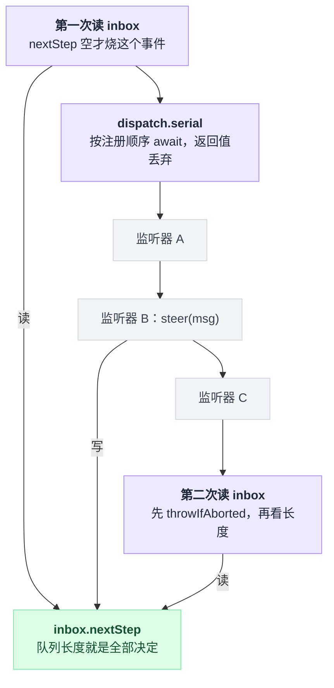
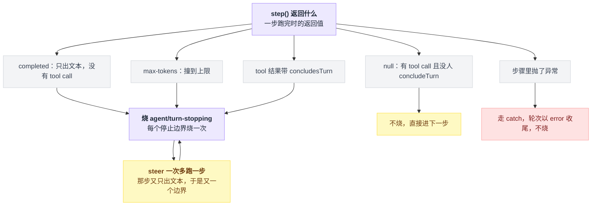
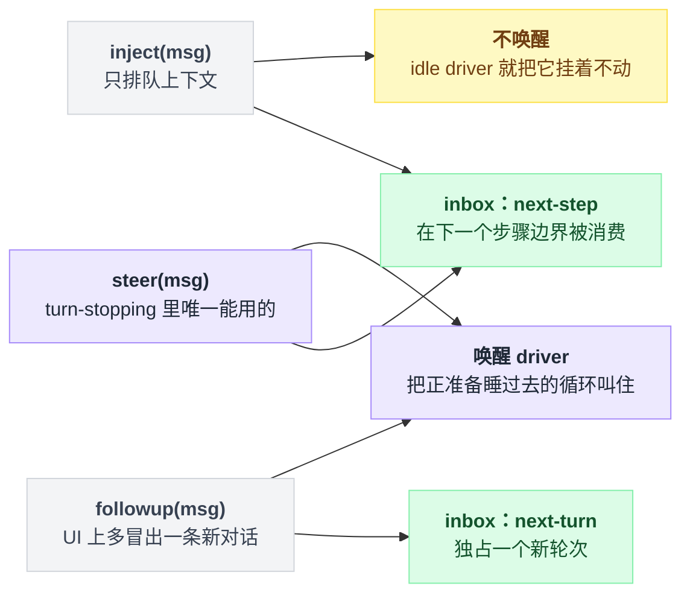
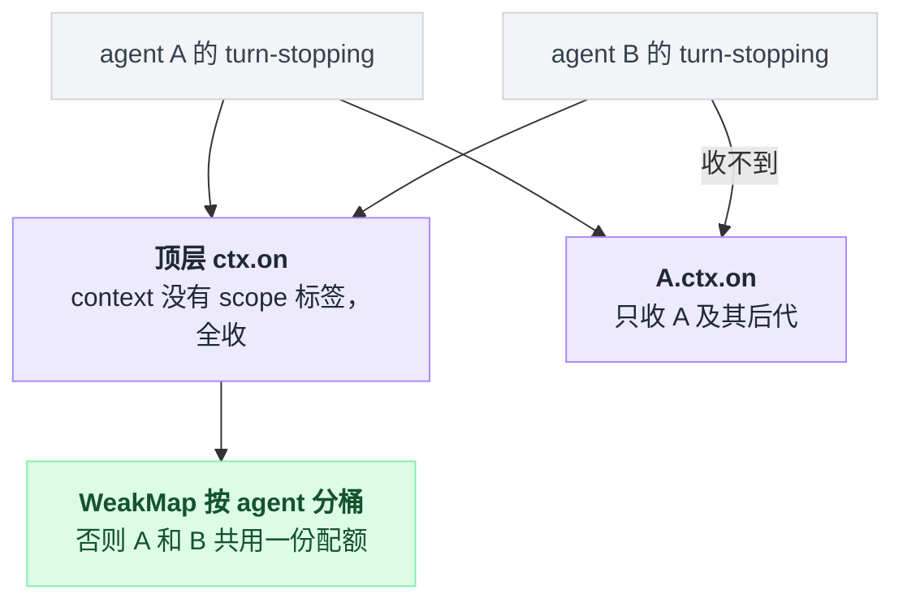
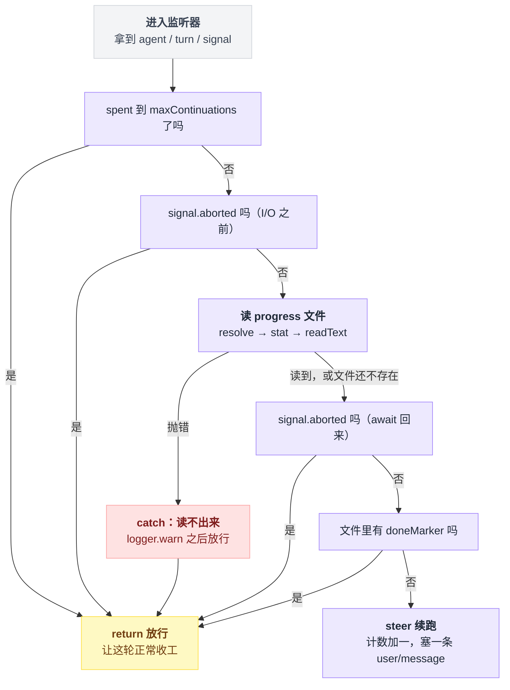
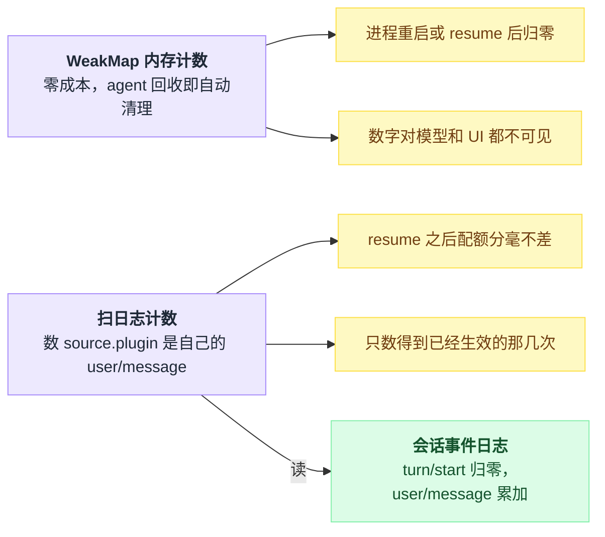
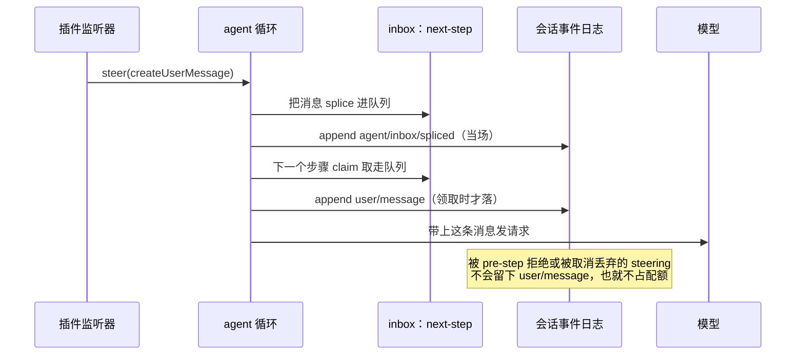

# 28 · 自己写一个续跑插件

> 基于 `deepseek-ai/deepseek-harness` v0.1.0-rc.5（commit `47f9438`），2026-08-14 核对。正文只讲机制和动手步骤；可照抄的完整代码统一收在文末[附录](#附录可以照抄的模板)，出处一律放在文末[脚注](#出处)里，点角标可跳转。

agent 答完一句就收工了，可活明明没干完。你想在它"自以为干完了"的那一刻把它拦下来，接着干。

这一章从零写一个插件干这件事，六十行。前两章拆的两个内置样本这里一个都不用——[26 章](./26-Goal模式.md)的 goal 用状态机管一个长目标，[27 章](./27-RalphLoop.md)的 ralph 每轮换一个全新子 agent，本章走的是第三条路。

写的过程会逼你搞清四件在别处容易含糊过去的事：`agent/turn-stopping` 为什么不是拦截器、`steer` / `followup` / `inject` 三个口子分别通向哪、`ctx.fs` 到底有哪些方法（比你以为的少）、续跑的计数应该活在进程内存里还是落进会话日志。

最后还得给它装刹车——没有刹车的续跑插件就是一台按次收费的永动机。

---

## 你不是在否决关闭，你是在往 inbox 里塞东西

[11 章](./11-waterfall专章.md)讲的 waterfall 是这么个模型：监听器拿到下一棒，不交出去就短路。很多人第一反应会把 `agent/turn-stopping` 也当成这一类，然后去找"返回 false 就别停"的写法。

找不到的，它压根不是那种事件。

循环在关轮之前只干一件事：按 serial 模式把这个事件派发出去，然后等它回来。serial 只是按注册顺序逐个等每个监听器跑完，没有下一棒可传，监听器的返回值也被那次等待整个丢掉[^1]。

那"要不要再跑一步"到底谁说了算？事件声明上方那段注释就是官方契约，逐字抄在这里[^2]：

> The turn is about to close: the model owes no response (no live tool calls, no fresh steering). Awaited before the boundary commits — a listener that objects steers (`agent.steer(...)`) and the machine re-reads its inbox: fresh steering runs another step, none closes the turn. Data decides, so listener order cannot change the outcome.

"Data decides" 落到代码上，就是派发前后各查一次 inbox[^3]：

```
  步骤跑完 → nextStep 空？ ──否──→ 直接再跑一步（事件根本不烧）
                  │是
     dispatch.serial('agent/turn-stopping')  ← 你的监听器在这里 steer()
                  │ 然后 signal.throwIfAborted()
        nextStep 还是空？ ──是──→ break，关闭轮次
                  │否 → 再跑一步
```

所以这个事件给你的不是否决权，是一个窗口期：在这段时间里往 inbox 塞一条 steering，循环再看一眼 inbox，有货就继续。

把上面那张控制流翻成数据流会更清楚：有话语权的只有 inbox，监听器往里写、循环在事件前后各读一次，所以监听器谁先谁后都不改变结果。



这里有个坑，踩上了很难查。serial 的语义是 bail：按顺序一个个问过去，谁返回了非空、非假、也不是 undefined 的东西，整次派发就当场拿着这个值收工——后面注册的监听器一个都不跑[^4]。

事件声明说监听器不该返回任何东西，可 TypeScript 允许把"返回布尔值的函数"赋给"返回 void 的函数类型"。你顺手返回一个 true 表示"我处理过了"，编译器不拦、循环不理，**唯一的实际后果是把别人注册的监听器静默吃掉**。

想说"我没意见"，就什么都别返回。

---

## 它按停止边界烧，不按轮次烧

载荷就三样：哪个 agent、第几轮、取消信号[^5]。

触发条件比想象中窄，看一步跑完时返回了什么就清楚[^6]：

| 一步跑完时 | 什么情况下 | 烧不烧 |
|---|---|---|
| 答完了（completed） | 模型只出文本、没有 tool call | 烧 |
| 撞上限（max-tokens） | 撞到 max tokens | 烧 |
| 有人宣布收轮 | tool 结果带了"本轮到此为止"的标记 | 烧 |
| 什么都没返回 | 有 tool call 且没人宣布收轮 | 不烧，直接进下一步 |
| 抛异常 | 步骤里出错 | 走 catch，轮次以 error 收尾，不烧 |

五种收尾各走各的路，只有三种通向这个事件，而且 steer 之后还会绕回来：



关键在于**它是每个停止边界烧一次，不是每轮烧一次**。你 steer 一次，多跑一步，那一步又只出文本没有 tool call，于是又是一个停止边界，又烧一次。

没有上限的插件不是"多跑一步"，是无限循环，而且每一圈都是一次真实的模型请求。

---

## steer / followup / inject：塞哪个口子

三个方法的实现只差一个参数[^7]：

| 方法 | 落到哪个 inbox | 唤醒 driver | 声明处语义 |
|---|---|---|---|
| `steer` | `next-step` | 是 | Submit steering for the nearest step：空闲则开一轮，运行中则在下一个步骤边界被消费 |
| `followup` | `next-turn` | 是 | Queue an ordinary follow-up turn：独占一个新轮次 |
| `inject` | `next-step` | **否** | 只排队上下文、不唤醒；可能错过已领完批次的那次请求 |

拆开看，三个方法就是两个 inbox 配一个唤醒开关的三种组合：



turn-stopping 里只能用 `steer`。`followup` 会另开一个轮次，UI 上就是"又冒出一条新对话"；`inject` 虽然也落 `next-step`，但它的契约明写着 idle driver 会把它挂着不动，语义对不上——我们要的恰恰是"把一个正准备睡过去的循环叫住"。

`steer` 也不是万无一失，两个代价都写在它自己的注释里[^8]：被 `agent/pre-step` 拒绝的步骤，会把 steering 原样停在 inbox 里等下一次唤醒；取消或 dispose 则可能直接丢弃 pending steering。

**steer 返回不等于"模型一定看到了"**，后面第三条防线和计数方案都跟这句话有关。

---

## 顶层注册的监听器会收到每一个 agent

事件签名把监听器的 this 绑在带作用域的 agent 上，这不是装饰：agent 构造时就把自己当路由 key 建好了事件载体。准入规则三句话就能背下来[^9]：

1. 注册在没有作用域标签的环境上——全收。普通插件都是这种。
2. 注册在某个 agent 的作用域（或其祖先的作用域）上——只收该 agent 及其后代。
3. 标签比这次派发的路由 key 更"低"——收不到。

因为事件只沿作用域链往上走，不往下走。生成的路由表把这条路由写死了：载荷第一个参数身上的 agent 字段就是路由 key[^10]。

实践含义直接决定下一节的代码怎么写：本章插件用顶层注册，所以它会收到**每一个** agent 的 turn-stopping，包括[子 agent](./19-子agent与workflow.md)派生出来的那些。

计数因此必须**按 agent 分桶**（一张以 agent 为 key 的 `WeakMap` 就是干这个的），否则父 agent 和它派生的子 agent 共用一个配额，谁先烧完谁倒霉。

谁能收到谁，取决于注册时那个 ctx 有没有 scope 标签：



只想管住某一个 agent，就在 `agent/created` 里改用那个 agent 自己的 ctx 注册。那个 ctx 来自 agent 自己的作用域，注释写明是 agent-scoped、随 disposal 回滚[^11]。

---

## 六十行写完整个插件

完整插件全文照抄[附录 A](#a-完整插件全文)。文件放在 dsh 仓库 checkout 里单独开的一个草稿插件目录下——官方第一个插件教程就是这么起步的[^12]，具体路径写在后面的挂载配置里。这一节逐块讲它为什么长这样。

**头部三件套：名字、注入、配置。** 插件导出自己的名字、要注入的两个服务（agent 管理和文件系统），以及配置 schema。配置就三个旋钮：续跑上限（默认 3）、进度文件名（默认 PROGRESS.md）、完成标记（默认 ALL DONE）。上限用"步进 1、最小 1"的整数校验钉死，不许配出 0 或小数。

**一张按 agent 分桶的弱引用表。** key 是 agent 本身，值是"哪一轮、已续几次"。上一节说了为什么必须分桶；用弱引用是让 agent 被回收时这条记录自动消失。

**一个读进度文件的小函数。** 从会话头拿工作区目录（没有就抛），把进度文件名解析成目标，问一次文件信息——拿不到信息或者不是文件，就当"还没有进度文件"返回空；否则读出文本。为什么要这么绕，第七节专门讲。

**监听器本体。** 先过三条防线（下一节展开），全部没拦住才计数加一、塞一条续跑消息进 inbox。消息的措辞有讲究，第九节展开。

插件里的每一个写法都不是拍脑袋写的，全部照抄自仓库里的现成代码——三件套的形状、schema 链式校验、造用户消息的调用现场、消息来源的类型定义、日志告警、错误链工具，逐条出处见脚注[^13]。

还有一行看着莫名其妙的东西不能删：附录里有一条"只导入类型、实际什么都不导入"的空导入。`ctx.fs` 是模块增强挂上去的，不导入那个包，TypeScript 就不认识它。仓库自己的文件工具也是这么写的[^14]。

---

## 三条防线，各防各的翻车

| 防线 | 怎么做 | 不写会怎样 |
|---|---|---|
| 次数上限 | 本轮已续次数到了上限就直接返回 | 模型每答完一次就被叫醒一次，无限循环烧 token |
| 取消信号 | 发现已取消就直接返回（查两次） | 用户已点停止、你还在塞消息 |
| 完成标记 | 进度文件里出现完成标记就直接返回 | 任务其实做完了，插件还在逼它接着干 |

三条是"或"关系：任一命中就放行，让这轮正常收工。全部没拦住，才计数加一、steer 一条续跑消息。取消信号分别查在那次文件 I/O 的两侧：



取消信号那条要查**两次**——做 I/O 之前一次、等文件读回来之后一次，因为读文件期间用户完全可能按下取消。真塞晚了也是白塞：循环在派发之后立刻检查取消信号并抛出[^15]。

完成标记那条防的是最难看的一种失败。任务其实做完了，插件还在推它"接着干"，模型没有活可干又不能不回话，只能原地打转、把做过的事换个说法再说一遍。

还有一条隐性防线是包住文件读取的那个 try/catch。读文件失败——权限、二进制、沙箱拒绝、超大文件，错误码有一整张表[^16]——我们选择**放行**而不是续跑：看不清完成标记时宁可早收工。何况监听器抛异常有真实代价，往下第八节会算这笔账。

---

## `ctx.fs` 的方法比你以为的少

文件系统是抽象服务类，本章用到的只有三个方法[^17]：

- `resolve`：把一个路径解析成目标对象，可以带上"相对谁解析"的目录和取消信号；
- `stat`：拿目标的文件信息，**拿不到就返回 undefined**，不抛错；
- `readText`：把目标读成字符串。

没有"读不到就当空"，没有"存在吗"，也没有一步到位的按路径读文本。想要"读不到就当空"，只能自己把三个方法串起来，就是上一节那个读进度文件的小函数：先解析路径，再问信息——信息拿不到或者不是文件，就当文件还不存在；确认是文件才真读。

拼的时候有两个地方会栽跟头。

**文件不存在时 `resolve` 不报错。** 本地后端会找到最近的真实存在的祖先目录、再把缺失的后缀接回去，图的是路径 key 在文件创建前后保持稳定。所以"文件还没被创建"只能靠 `stat` 返回 undefined 判断——这是契约里写明的唯一存在性判据，别拿"读一下、抛错就当不存在"当检查[^18]。

**解析目录得自己给。** 相对路径按你传进去的目录解析，正确的目录是这个会话自己的工作区（就在会话头上），内置文件工具就是这么取的[^19]。不给的话后端退回自己的默认目录——web profile 里 `ctx.fs` 由沙箱实现提供，默认是进程当前目录[^20]——多工作区场景下你会读到隔壁项目的文件。

至于为什么完成标记要用工作区文件、而不是插件内存里一个 flag：因为它必须由**模型自己**写得进去。模型手里有 write / edit 工具，写的是工作区；插件的内存对它既不可见也不可写。ralph 是同一条思路，README 里那句话说得更直白——the workspace is long-term memory[^21]。

---

## 监听器抛异常会把这一轮染红，但循环还活着

这件事有专门的回归测试兜底，名字就很直白："a throwing agent/turn-stopping listener ends the turn with an error, loop survives"[^22]。

它断言两件事。一是最后那条收轮事件的收尾原因变成一个错误：错误消息就是监听器抛的那句话，错误码一律压成 UNKNOWN；二是紧接着再发一条消息仍然正常跑完、agent 状态回到 idle。对应的实现是轮次函数的 catch 把任意异常压成这种错误收尾[^22]。

翻译成人话：你的 bug 不会搞挂 harness，但会把用户这一轮本来正常的结束染成一个红色错误。第五节那个 try/catch 因此是必需品，不是洁癖。

反过来，本章插件的"官方样例"也在测试里，名字叫 "agent/turn-stopping can steer another step (/loop pattern)"：监听器在步数不足 3 时 steer，最后断言总共跑了 3 步、发了 3 次请求，消息来源用的正是插件来源标记，写法和本章几乎一模一样[^23]。

---

## 续跑提示里少一样，模型就瞎猜一样

模型在续跑那一步看到的只有你塞的这条消息，前因后果全靠它自己从历史里捞。有四样东西缺一不可：

| 塞进去的东西 | 少了会怎样 |
|---|---|
| 当前第几次 / 上限几次 | 它判断不了还剩多少预算，可能开一个注定做不完的坑 |
| progress 文件路径 | 它要么猜文件名，要么凭记忆回答 |
| 完成标记的精确字面量 | 判定是字符串包含匹配、不是语义理解，模型写"任务已全部完成"是不算数的 |
| "把做完的记回文件" | 下一次续跑没有可读的状态，等于每轮从头开始 |

这条消息在会话日志里的形态是一条用户消息，来源字段标着是哪个插件写的，由循环在步骤领取它时落进日志[^24]。这带来三层后果。

模型在下一次请求里确实看得见。

UI 转录会标成插件来源——time-context 也靠同一个特征找自己写过的消息[^25]。

以及它**必须能被无损 JSON 序列化**：steer 落日志走的是一条 inbox 拼接事件，塞个 `bigint` 会当场抛——同一条路径上有测试钉着[^26]。老实用纯字符串。

---

## 计数放内存还是落日志

那张按 agent 分桶的弱引用表完全活在进程里。好处是零成本，agent 被回收时自动清理。

代价也很明确：**进程重启或 resume 会话后计数归零**。一个已经烧掉 3 次续跑的会话被 resume 回来，配额又是满血。而且这个数字对模型和 UI 都不可见。

内置的 goal 驱动器站在另一个极端：已开轮数不是内存变量，而是**从会话日志重算**出来的。折叠函数顺序重放事件，每遇到一条带 goal 来源的用户消息就把轮数推进到那个 round，并且严格要求一格都不许跳；驱动器发新一轮之前，先拿重算出来的轮数比上限[^27]。

日志即事实源，resume 之后配额分毫不差——代价是你得设计一套自己的持久事件和折叠规则。

中间路线是：不发明新事件，直接数**自己写过的消息**。上一节说了，那些消息本来就在日志里，而且带着"来源插件是我"这个天然指纹，time-context 用的就是同一个识别方式。替换函数全文照抄[附录 B](#b-扫日志计数的替换函数)：从头走一遍会话事件，遇到本轮的开轮事件就清零，遇到来源是自己插件的用户消息就加一[^28]。

两个版本的取舍摆在一起是这样：



有个时序必须知道：steer 当场落的是那条 inbox 拼接事件，用户消息要等**步骤真的领取**了才落[^24]。

所以这个函数数到的是"已经生效的续跑次数"，那些被 pre-step 拒绝、或被取消丢弃的 steering 不占配额，也确实数不到——正好是我们想要的语义。

同一条 steering 在日志里留下两条痕迹，中间隔着一次领取：



---

## 挂上去跑

挂载用一份补丁配置，插件路径必须写绝对的——官方教程原话[^29]：

```yaml
- insert:
    - id: keep-going
      name: '/absolute/path/to/deepseek-harness/scratch-plugin/src/keep-going.ts'
      config:
        maxContinuations: 3
        progressFile: 'PROGRESS.md'
        doneMarker: 'ALL DONE'
```

```sh
pnpm dsh web --patch ./scratch-plugin/cordis.yml --dump-config   # 先干跑，在输出里搜 keep-going
pnpm dsh web --patch ./scratch-plugin/cordis.yml
```

`--patch` 可重复，overlay 合成在 profile 层之后；`--dump-config` 打印合成后的 web profile 树然后退出。`- insert:` 这个 patch 形态的解析有测试兜底[^30]。

验证脚本很简单：工作区放一个写了三条待办的 PROGRESS.md，让 agent"做第一条"。它答完第一条本该收工，你应该看到它被自动推着做第二条、第三条；把 ALL DONE 写进文件，下一个停止边界就不再续跑。

---

## 这个插件危险在哪

**烧钱。** 每次续跑等于一次完整模型请求。上限设成默认的 3，意味着用户问一句，最多变成 4 次请求。把上限调到两位数之前先算账。

**原地打转。** 被强行唤醒的模型如果找不到"下一件事"，最常见的行为是把做过的事换个说法再说一遍，顺手在 progress 文件里追加一条假进展。于是完成标记永远等不到，一路撞到上限为止。

这件事的结论有点反直觉：**上限是唯一能保证终止的东西，完成标记只是优化。**

**对所有 agent 生效。** 顶层注册会收到子 agent 的 turn-stopping。一个 ralph 子 agent 被你又续三次，账单是乘法。要上生产就改在单个 agent 自己的 ctx 上注册，或者按会话头上的来源字段把子会话过滤掉[^31]。

**它绕过了 goal 的所有闸门。** goal 有 phase / blocked / disarm 一整套状态机，本章这六十行一个都没有。

---

## 三种长程推进方案怎么选

三条路线的对照如下，goal 与 ralph 两格的出处见脚注[^32]：

| | 26 章 goal | 27 章 ralph | 本章 keep-going |
|---|---|---|---|
| 状态存在哪 | 会话日志（goal 变更事件 + 带 goal 来源的用户消息，重放重算） | 工作区文件 + 每轮结构化 handoff | 进程内 `WeakMap`（可改成扫日志） |
| 上下文累不累积 | 累积（同一个会话一路长下去） | 不累积（每轮全新子 agent，不继承父会话） | 累积（同一个会话） |
| 谁决定停 | goal 状态机：已开轮数到上限，或模型把 goal 标成 complete / blocked | 子 agent 报 complete 或 blocked，或撞轮数上限 | 三条防线：次数上限 / 取消信号 / progress 文件里的完成标记 |
| 崩溃或 resume 后 | 能恢复：日志重放即得已开轮数 | 这次 run 作废（前台工具调用，取消即错误），但工作区产物还在，可以重新发起 | WeakMap 版归零；落日志版能恢复 |
| 适合什么 | 需要完整上下文连续性的长任务 | 上下文必然爆掉的重复性长任务 | 给现成会话补一层轻量的"别急着收工"策略 |

三者不互斥，但**别叠加**：goal 驱动器和本章插件都在往同一个 inbox 里塞东西，叠起来的行为没人验证过。

两条内置路线的完整用法见 [26 章](./26-Goal模式.md)与 [27 章](./27-RalphLoop.md)；派发模式本身回头看 [10 章](./10-事件系统.md)与 [11 章](./11-waterfall专章.md)。

---

## 一句话带走

**续跑不是拦住循环，是在它准备关门的那一瞬间往 inbox 里放一件新活；循环重新数了一遍队列，发现不空，于是继续。**

把全章的结论从各节重新推一遍，能一条条推出来才算真懂了：

- 续跑之所以可能，是因为 turn-stopping 给的是**窗口期不是否决权**——data decides，循环在事件前后各读一次 inbox，监听器的顺序和返回值都改变不了结果；
- 上限之所以是必需品，是因为事件**按停止边界烧**——steer 一次多跑一步，那步又是一个边界，又烧一次，没有上限就是无限循环；
- 之所以只能用 `steer`，是因为三个口子里只有它**既落 `next-step` 又唤醒 driver**——followup 另开轮次，inject 叫不醒人；
- 之所以要 `WeakMap` 按 agent 分桶，是因为顶层注册**收到每一个 agent** 的事件，包括子 agent 的；
- 完成标记之所以放工作区文件而不是内存 flag，是因为那是**模型唯一写得进去的地方**；
- 那个 try/catch 之所以是必需品而不是洁癖，是因为监听器抛异常会**把这一轮染成红色错误**——虽然循环还活着。

这也是全系列的收尾：你能用六十行做到内置 goal 和 ralph 要一整个包才做到的事，是因为 dsh 把"要不要继续"这个判断彻底外包给了一个队列的长度——[01 章](./01-数据住在哪循环靠什么转.md)第一节讲的那件事，到这里终于能用上了。

---

## 附录：可以照抄的模板

### A. 完整插件全文

放在 dsh 仓库 checkout 的 `scratch-plugin/src/keep-going.ts`，六十行，每个 API 的写法都照抄自仓库现成代码[^13]：

```ts
import type { Context } from '@deepseek-ai/cordis'
import z from '@deepseek-ai/schemastery'
import type { Agent } from '@deepseek-ai/dsh-agent'
import type {} from '@deepseek-ai/dsh-fs'
import { createUserMessage, errorChain } from '@deepseek-ai/dsh-llm'

export const name = 'keep-going'

export const inject = ['agents', 'fs']

export interface Config {
  maxContinuations: number
  progressFile: string
  doneMarker: string
}

export const Config: z<Config> = z.object({
  maxContinuations: z.number().step(1).min(1).default(3),
  progressFile: z.string().default('PROGRESS.md'),
  doneMarker: z.string().default('ALL DONE'),
})

export function apply(ctx: Context, config: Config): void {
  const spentByAgent = new WeakMap<Agent, { turn: number; count: number }>()

  async function progressText(agent: Agent, signal: AbortSignal): Promise<string | undefined> {
    const cwd = agent.session.header.cwd
    if (cwd === undefined) throw new Error(`agent "${agent.id}" has no workspace cwd`)
    const target = await ctx.fs.resolve(config.progressFile, { cwd, signal })
    const info = await ctx.fs.stat(target, signal)
    if (info === undefined || info.type !== 'file') return undefined
    return await ctx.fs.readText(target, signal)
  }

  ctx.on('agent/turn-stopping', async ({ agent, turn, signal }) => {
    const previous = spentByAgent.get(agent)
    const spent = previous !== undefined && previous.turn === turn ? previous.count : 0
    if (spent >= config.maxContinuations) return
    if (signal.aborted) return

    let progress: string | undefined
    try {
      progress = await progressText(agent, signal)
    } catch (error: unknown) {
      ctx.logger.warn(`${name}: cannot read ${config.progressFile}: ${errorChain(error)}`)
      return
    }
    if (signal.aborted) return
    if (progress !== undefined && progress.includes(config.doneMarker)) return

    const round = spent + 1
    spentByAgent.set(agent, { turn, count: round })
    agent.steer(createUserMessage({
      content: [{
        type: 'text',
        text: [
          `Automatic continuation ${round} of ${config.maxContinuations} for turn ${turn}.`,
          `You are not finished. Re-read ${config.progressFile} in the workspace, pick the next unfinished item, complete it now, and record what you finished back into that file.`,
          `When everything is done, write the exact line "${config.doneMarker}" into ${config.progressFile}; that line is the only thing that stops this continuation.`,
        ].join('\n'),
      }],
      source: { kind: 'plugin', plugin: name },
    }))
  })
}
```

### B. 扫日志计数的替换函数

把附录 A 里的 `spentByAgent` 那张表换成它即可，识别方式与 time-context 相同[^28]：

```ts
function continuationsInTurn(agent: Agent, turn: number): number {
  let count = 0
  for (const event of agent.session.events) {
    if (event.type === 'turn/start' && event.data.turn === turn) count = 0
    if (event.type === 'user/message'
      && event.data.source.kind === 'plugin'
      && event.data.source.plugin === name) count += 1
  }
  return count
}
```

---

## 出处

[^1]: 关轮前按 serial 派发 `agent/turn-stopping` 的那一行：`packages/core/agent-loop/src/agent.ts:296`；serial 的实现（按注册顺序 await 每个监听器、没有 next 可传、返回值被 await 丢弃）：`vendor/cordis/src/events.ts:204-210`。
[^2]: 事件声明上方的契约注释原文：`packages/core/agent/src/runtime-types.ts:261-271`。
[^3]: dispatch 前后各查一次 inbox 的循环代码：`packages/core/agent-loop/src/agent.ts:295-299`。
[^4]: bail 判定函数 `isBailed`：`vendor/cordis/src/events.ts:13`，判据即"非 null、非 false、非 undefined 就算表态"。
[^5]: 载荷三个字段（agent / turn / signal）的声明：`packages/core/agent/src/runtime-types.ts:278`。
[^6]: 五种收尾的实现位置：completed（只出文本）`packages/core/agent-loop/src/agent.ts:394`、max-tokens `:391`、tool 结果带 concludesTurn 与返回 null 直接进下一步都在 `:399`。
[^7]: 三个方法的实现只差一个参数：`packages/core/agent-loop/src/agent.ts:122-132`；声明处语义：steer `packages/core/agent/src/runtime-types.ts:126-133`、followup `:119-124`、inject `:135-143`。
[^8]: steer 的两个代价（pre-step 拒绝则 steering 停在 inbox 等下一次唤醒；取消或 dispose 可能丢弃 pending steering）：`packages/core/agent/src/runtime-types.ts:129-131`。
[^9]: agent 构造时建事件载体（`agentCarrier(agent) = scopeTarget(agent, agent)`）：`packages/core/agent-loop/src/agent.ts:86`；dispatch 侧带载体派发：`packages/core/agent/src/dispatch.ts:94-96`；准入规则 `scopeTarget`：`packages/core/scope/src/index.ts:170-183`，"无标签全收"那条在 `:176`。
[^10]: 生成的路由表：`packages/core/scope/src/scoped-events.generated.ts:22`，原文 `'agent/turn-stopping': args => (args[0] as Record<string, unknown>)['agent']`。
[^11]: agent 自己的 ctx 来自 agent 自己的 scope：`packages/core/agent-loop/src/agent.ts:94`；"agent-scoped、随 disposal 回滚"的注释：`packages/core/agent/src/runtime-types.ts:75-76`。
[^12]: 官方第一个插件教程从 scratch-plugin 目录起步：`docs/user/develop/basic/index.md:9-13`。
[^13]: 插件里各写法的出处：`name` / `inject` / `Config` 三件套照 `packages/context/time-context/src/index.ts:20-38`，apply 签名照同文件 `:145`；`z.number().step(1).min(1).default(...)` 链式校验照 `packages/attachment/attachment-local/src/index.ts:41`；`createUserMessage({ content, source })` 的真实调用现场在 `packages/schedule/schedule/src/runtime.ts:271-274`；plugin 来源的类型定义（kind 为 plugin、带插件名）在 `packages/llm/llm/src/message.ts:102`；`ctx.logger.warn` 照 `packages/goal/goal-round-driver/src/index.ts:122`；`errorChain` 由 dsh-llm 导出（`packages/llm/llm/src/index.ts:36` 转出 `packages/llm/llm/src/error.ts:114`）。
[^14]: 空导入的仓库同款写法：`packages/fs/tool-fs/src/read.ts:10`。
[^15]: 循环在 dispatch 之后立刻 `signal.throwIfAborted()`：`packages/core/agent-loop/src/agent.ts:297`。
[^16]: 读文件的错误码表（权限、二进制、沙箱拒绝、超大文件等）：`packages/fs/fs/src/types.ts:175-188`。
[^17]: 三个方法的签名：`resolve` 在 `packages/fs/fs/src/index.ts:116`（入参 path 加可选的 cwd / signal，返回目标对象）、`stat` 在 `:152`（返回文件信息或 undefined）、`readText` 在 `:176`（返回字符串）。
[^18]: 文件不存在时 resolve 不报错的实现（realpath 最近存在的祖先目录、再把缺失后缀接回去）：`packages/fs/fs-local/src/fsio.ts:161-168`；"stat 返回 undefined 是唯一存在性判据"的契约：`packages/fs/fs/src/index.ts:147-152`。
[^19]: 会话自己的工作区目录字段：`packages/core/session/src/types.ts:72-73`；内置文件工具取会话 cwd 的写法：`packages/fs/tool-fs/src/session-cwd.ts:23-27`。
[^20]: web profile 里 `ctx.fs` 由 dsh-fs-sandbox 提供、默认 `process.cwd()`：`packages/bundle/base/cordis.patch.yml:441-444`。
[^21]: "the workspace is long-term memory"：`packages/workflow/tool-ralph/README.md:11`。
[^22]: 回归测试名：`packages/core/agent-loop/tests/contract-regressions.spec.ts:345`；两个断言：turn/end 的 reason 变成 `{ kind: 'error', error: { message: 'broken continuation plugin', code: 'UNKNOWN' } }` 在 `:360-362`，再 send 一次仍正常、状态回 idle 在 `:365-368`；对应实现（turn() 的 catch 把任意异常压成 code UNKNOWN 的 error 收尾）：`packages/core/agent-loop/src/agent.ts:309-314`。
[^23]: 官方样例测试：`packages/core/agent-loop/tests/loop.spec.ts:766`，断言 3 步 3 请求在 `:777-786`，用的 source 正是 `{ kind: 'plugin', plugin: 'loop-test' }`。
[^24]: 循环在步骤领取消息时才 append user/message：`packages/core/agent-loop/src/agent.ts:283`。
[^25]: time-context 靠 plugin 来源找自己写过的消息：`packages/context/time-context/src/index.ts:86-95`。
[^26]: steer 走 `Inbox.mutate` 落 `agent/inbox/spliced` 事件：`packages/core/agent/src/inbox.ts:186`；塞 `bigint` 当场抛的测试：`packages/core/agent-loop/tests/loop.spec.ts:753-755`。
[^27]: `foldGoal()` 顺序重放事件：`packages/goal/goal/src/fold.ts:339-349`；每遇到带 goal 来源的用户消息推进 roundsStarted、且严格要求等于上一值加一：`fold.ts:321-331`；驱动器发新一轮前先比 `roundsStarted >= maxGoalRounds`：`packages/goal/goal-round-driver/src/index.ts:166`。
[^28]: `turn/start` 的 payload 形状：`packages/core/agent-loop/src/agent.ts:255`；扫日志找自己插件来源消息的写法：`packages/context/time-context/src/index.ts:73-95`。
[^29]: 挂载配置与"路径必须写绝对的"：`docs/user/develop/basic/index.md:48-56`。
[^30]: `--patch` 的声明在 `apps/cli/src/args.ts:163`（实现在 `apps/cli/src/profile-boot.ts:148-151`），`--dump-config` 在 `apps/cli/src/args.ts:164`；`- insert:` patch 形态的解析测试：`packages/boot/app-boot/tests/user-patches.spec.ts:54-65`。
[^31]: 会话头上的来源字段（origin 为 subagent 即子会话）：`packages/core/session/src/types.ts:85`。
[^32]: 对照表出处：goal 的状态从日志重算（goal/change 加带 goal 来源的 user/message）：`packages/goal/goal/src/fold.ts:313-331`；ralph 的工作区即长期记忆：`packages/workflow/tool-ralph/README.md:11`。
