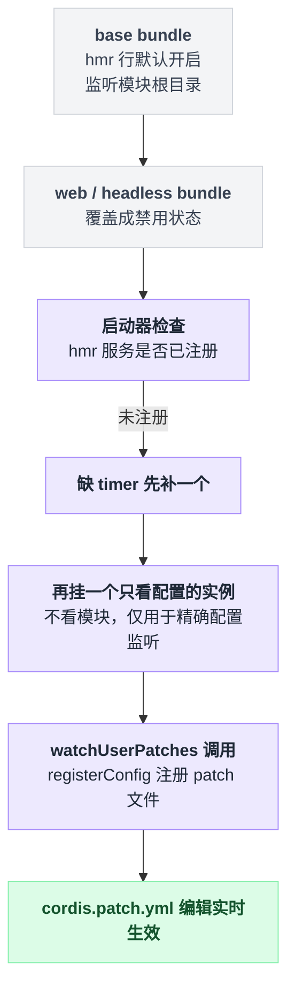

# hmr

> `@deepseek-ai/cordis-plugin-hmr` · bundle：`base`（web / headless 两个 bundle 把它关掉） · 配置树 id：`hmr` · v0.1.0-rc.5（commit `47f9438`）2026-08-14 核对。出处收在文末脚注，可照抄的配置收在文末附录。

**一句话**：监听源文件与配置文件，只重载受影响的那几个 loader 插件条目；碰到框架层文件就整进程退出重来。

这是个 vendored 包，上游是 `@cordisjs/plugin-hmr`[^1]。

**它不是原样拷贝**——本地改动日志里至少有五条落在这个包上：

- 删掉 i18n 的 YAML locale 导入，源码里也留了痕迹[^2]
- 新增 `registerConfig`，用来做精确配置监听[^3]
- 主 watcher 打开了 `ignoreInitial`，抑制初始扫描[^4]
- loader 惰性配置解析的联动改造[^5]
- 重新生成 `package.json` 时，给 `esbuild` 补上了直接开发依赖[^6]

版本号还有一处对不上：`vendor/hmr/package.json` 里写的是 `1.0.16`，而清单表格那一行记的是 `1.0.15`[^7]。

## 它在树上长什么样

```yaml
- id: hmr
  name: '@deepseek-ai/cordis-plugin-hmr'
  config:
    root: ['.']
```

这是 base bundle 里的写法[^8]。往上两层各自把这一行按下去：

| bundle 层 | 这一行的状态 |
|---|---|
| `base` | 开启，`root: ['.']` |
| `web-app` | `disabled: true` |
| `headless` | `disabled: true` |

两处关闭各自留了注释：web 那行写着 Web 的 reload 生命周期还没测过；headless 那行写着模块重载关掉，但用户 patch 层仍由启动器兜底保活[^9]。

**所以默认 `dsh --profile web` 跑起来，这一行是关的。**

## 它注册了什么

| 类型 | 名字 | 说明 |
|---|---|---|
| service | `ctx.hmr` | `class Hmr extends Service`[^10] |
| inject | `loader`、`timer` | 类上声明的注入清单[^11] |
| 事件派发 | `hmr/change`（**emit**） | 变更文件既不属于插件重载也不属于配置重载时，广播这个文件的 URL[^12] |
| 事件派发 | `hmr/reload`（**emit**） | 一批插件条目重载完成后，广播一张插件到重载结果的映射[^13] |
| 事件派发 | `hmr/config-update-failed`（**parallel**） | 配置刷新失败时派发[^14] |
| 公开方法 | `ctx.hmr.registerConfig` | 传文件名和一个刷新回调，监听模块根目录之外的一个精确配置路径，返回一个异步 disposer[^15] |

它**不监听**任何 Cordis 事件，只发。三个事件没有一个是 waterfall——没人能拦它、改它的结果。它也不注册工具、prompt 段、命令。

一次文件变更具体走哪条路，判断顺序是外部依赖优先、配置其次、插件模块兜底：


## 配置项

Schema 定义在源码里[^16]。

| 字段 | 类型 | 默认值 | 作用 |
|---|---|---|---|
| `base` | `string` | 无（可选） | 相对 `ctx.baseUrl` 解析出的基准目录[^17] |
| `root` | `string[]` | `['.']`（bundle 里显式写成这样） | chokidar 监听根；空数组等于只做配置监听，不看模块[^18] |
| `ignored` | `string[]` | `['**/node_modules', '**/.*', 'cache', 'data']` | picomatch 模式，同时排除监听与重载分析[^19] |
| `debounce` | `number`（ms） | `100` | 合并一批变更再处理[^20] |

表里这四个字段不是全部：`Config` 接口继承了 chokidar 的选项类型，整个 config 对象会被原样展开进底层 watcher 的构造调用[^21]。

能这么干是因为校验这一环没卡住多余的键——schemastery 的 object 解析在非 strict 模式下，会把没声明过的键原样合并回结果，而 cordis 走的正是非 strict 的校验路径[^22]。所以你在这一行多写的 chokidar 选项，确实能传到底层。

## 模型看得见什么

什么都看不见。README 没有 Model Experience 小节，源码不注册工具、不写 prompt、不产生 session 记录；诊断全部走 `ctx.logger`[^23]。

## 什么时候你会想换掉它 / 怎么换

它已经被换掉一半了，这是本篇最该记住的事。

默认 web / headless 树把 `hmr` 行关掉之后，启动器在启动后自己补一个回来[^24]：

```
if ctx.get('hmr') === undefined:              // 两层 bundle 已经把它按下去了
    if 缺 timer:  先补一个 timer
    ctx.loader.create({
        name: '@deepseek-ai/cordis-plugin-hmr',
        config: { root: [] },                 // 空数组 = 只看配置，不看模块
    })
```

补回来的是个阉割版：`root` 传的是空数组，意味着它**只看配置、不看模块**。缺的 [timer](./cordis-plugin-timer.md) 由启动器先补上[^25]。

这个实例的唯一用途是给 `watchUserPatches` 调用 `ctx.hmr.registerConfig`，让 `cordis.patch.yml` 的编辑实时生效[^26]。缺服务时它直接抛错，而不是静默跳过[^27]。

两层 bundle 关掉、启动器又补回一个阉割版实例，整条链路是这样的：



想在自己的 profile 里把模块热重载打开，照抄[附录 A](#a-在自己的-profile-里打开模块热重载)。前提是进程能拿到 Node 内部 module loader（见下）。

## 坑与边界

以下来自 README 的 Requirements 加上读源码所得[^28]。

**需要能拿到 Node 内部 module loader。** 有两条获取路径：`--expose-internals` 启动标志，或 `node-addon-require-builtin` 原生插件[^29]。两条路都不通，才会在构造函数里抛错，说缺 `--expose-internals`[^30]。

这里有个坑：错误文案只提了标志那条，别据此以为必须加这个标志——它只是两条路径之一。包文档的原话说的是：加载器没有可用的内部 module loader 时才会抛这个错[^31]。

**框架层文件一改就整进程重启。** 变更 URL 落在 externals（CLI worker 入口的依赖树）里时，直接调用 `loader.exit`[^32]。

**两个 watcher 的 `ignoreInitial` 是反着设的。** 模块 watcher 打开了 `ignoreInitial`，源码注释解释过原因：初始扫描会重放 boot 刚消费过的文件，和还在飞的 include apply 撞在一起，就成了拆卸死锁。`registerConfig` 反过来关掉了 `ignoreInitial`，因为注册时已经存在的用户 patch 必须先 apply 一次[^33]。

**重载失败会回滚**，而且是两段各回各的：

```
try:   重新 import 模块
catch: 恢复 ESM loadCache 与 CJS require.cache

try:   重新注册插件
catch: 连旧插件一起复原
```

回滚路径只写日志，不抛[^34]。

**依赖分析跳过 `node:` 内建与 `/node_modules/`**[^35]，所以改依赖包的代码不会触发局部重载。

**配置刷新是按 key 串行 + dirty 位的**，刷新过程中再来的变更只置脏，循环重跑：

```
标记这个 key 为 dirty
while key 还是 dirty:
    清掉 dirty 位
    try:   刷新这个 key 的配置
    catch: 写日志 + 派发 hmr/config-update-failed（咽掉，不打断后续）
```

实现在源码里[^36]。

**i18n 被删了**[^37]，配置项在 UI 里没有本地化描述。

---

## 附录：可以照抄的模板

### A. 在自己的 profile 里打开模块热重载

```yaml
- id: hmr
  disabled: false
  config:
    root: ['packages']
    debounce: 100
```

---

## 出处

[^1]: `vendor/README.md:22`。
[^2]: 改动日志：`vendor/README.md:33`；代码里的残留见 `vendor/hmr/src/index.ts:571`。
[^3]: `vendor/README.md:41`。
[^4]: `vendor/README.md:44`。
[^5]: `vendor/README.md:47`。
[^6]: `vendor/README.md:34`。
[^7]: 版本号见 `vendor/hmr/package.json:4`，写的是 `1.0.16`；vendor 清单表格里这一行记的是 `1.0.15`。
[^8]: `packages/bundle/base/cordis.patch.yml:19`。
[^9]: 三行状态依次见 `packages/bundle/base/cordis.patch.yml:19`、`packages/bundle/web-app/cordis.patch.yml:22`、`packages/bundle/headless/cordis.patch.yml:14`；两条注释就写在 web-app 与 headless 各自那一行旁边。
[^10]: `vendor/hmr/src/index.ts:86`（类声明）、`:119`（`super(ctx, 'hmr')`）。
[^11]: `static inject = ['loader', 'timer']`：`vendor/hmr/src/index.ts:87`；`package.json` 里也声明了 `services.required` 含 `timer`：`vendor/hmr/package.json:34`。
[^12]: `vendor/hmr/src/index.ts:270`。
[^13]: `vendor/hmr/src/index.ts:547`。
[^14]: 声明处标了 `@mode parallel`：`vendor/hmr/src/index.ts:27`；派发点是 `await this.ctx.parallel(...)`：`:312`。
[^15]: `vendor/hmr/src/index.ts:134`。
[^16]: `vendor/hmr/src/index.ts:560`。
[^17]: `vendor/hmr/src/index.ts:124`。
[^18]: `vendor/hmr/src/index.ts:277`。
[^19]: `vendor/hmr/src/index.ts:563`、`:215`。
[^20]: `vendor/hmr/src/index.ts:569`、`:242`。
[^21]: 继承 `ChokidarOptions`：`vendor/hmr/src/index.ts:553`；展开进 `watch()`：`:229` 与 `:143`。
[^22]: 非 strict 模式下把未声明的键合并回结果：`vendor/schemastery/src/index.ts:761`；cordis 走非 strict 校验：`vendor/cordis/src/fiber.ts:53`、`vendor/schemastery/src/index.ts:282`。
[^23]: `vendor/hmr/src/index.ts:210`、`:519`；`vendor/hmr/src/error.ts:11` 用 `@babel/code-frame` 打代码帧。
[^24]: `apps/cli/src/profile-boot.ts:279`。
[^25]: 缺 timer 先补一个：`apps/cli/src/profile-boot.ts:280`；创建调用：`:283`。
[^26]: `packages/boot/app-boot/src/index.ts:241`。
[^27]: `packages/boot/app-boot/src/index.ts:238`。
[^28]: `vendor/hmr/README.md:16`。
[^29]: `vendor/loader/src/internal.ts:110`、`:116`。
[^30]: 抛错原文 `'--expose-internals is required for HMR service'`：`vendor/hmr/src/index.ts:121`。
[^31]: 原文 "The package throws if the loader service has no internal module loader available."：`vendor/hmr/README.md:20`。
[^32]: `loader.exit` 调用：`vendor/hmr/src/index.ts:260`；externals 采集点：`:220`。
[^33]: 模块 watcher：`vendor/hmr/src/index.ts:239`；`registerConfig`：`:147`。
[^34]: 两段 try/catch 依次在 `vendor/hmr/src/index.ts:482`（定义）、`:499`（调用）与 `:534`；行号均在这个文件里，回滚路径只写日志、不抛。
[^35]: `vendor/hmr/src/index.ts:41`、`:351`。
[^36]: `vendor/hmr/src/index.ts:297`。
[^37]: `vendor/hmr/src/index.ts:571`。
