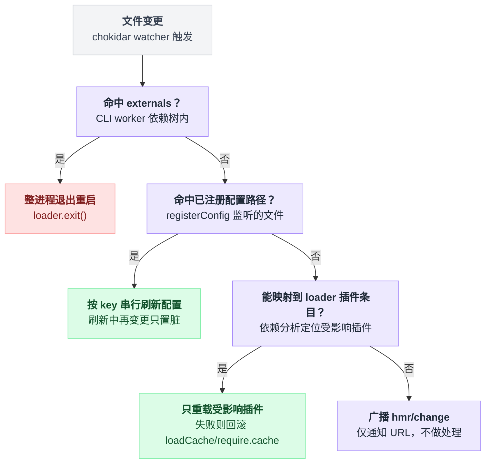
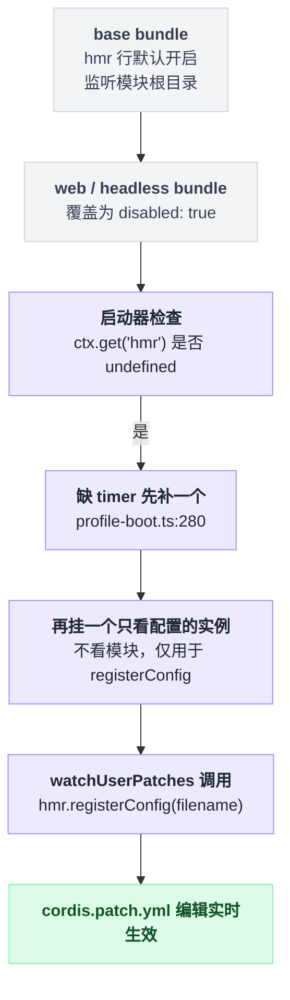

# hmr

> `@deepseek-ai/cordis-plugin-hmr` · bundle：`base`（web / headless 两个 bundle 把它关掉） · 配置树 id：`hmr` · v0.1.0-rc.5（commit `47f9438`）2026-08-14 核对

**一句话**：监听源文件与配置文件，只重载受影响的那几个 loader 插件条目；碰到框架层文件就整进程退出重来。

这是个 vendored 包，上游是 `@cordisjs/plugin-hmr`（`vendor/README.md:22`）。版本号有一处对不上：`vendor/hmr/package.json:4` 写的是 `1.0.16`，而清单表格那一行记的是 `1.0.15`。

**它不是原样拷贝**——本地改动日志里至少有五条落在这个包上：

| 本地改动 | 出处 |
|---|---|
| 删掉 i18n 的 YAML locale 导入 | `vendor/README.md:33`，源码留了痕 `vendor/hmr/src/index.ts:571` |
| `registerConfig()` 精确配置监听 | `vendor/README.md:41` |
| 主 watcher 的 `ignoreInitial: true` 初始扫描抑制 | `vendor/README.md:44` |
| Loader 惰性配置解析的联动改造 | `vendor/README.md:47` |
| 重新生成 `package.json` 时补的 `esbuild` 直接开发依赖 | `vendor/README.md:34` |

## 它在树上长什么样

`packages/bundle/base/cordis.patch.yml:19`：

```yaml
    - id: hmr
      name: '@deepseek-ai/cordis-plugin-hmr'
      config:
        root: ['.']
```

然后两个上层 bundle 都把它按下去：

| bundle 层 | 这一行的状态 | 出处 |
|---|---|---|
| `base` | 开启，`root: ['.']` | `packages/bundle/base/cordis.patch.yml:19` |
| `web-app` | `disabled: true` | `packages/bundle/web-app/cordis.patch.yml:22` |
| `headless` | `disabled: true` | `packages/bundle/headless/cordis.patch.yml:14` |

两处关闭各自留了注释：web 那行写着 Web 的 reload 生命周期还没测过；headless 那行写着模块重载关掉，但用户 patch 层仍由启动器兜底保活。

**所以默认 `dsh --profile web` 跑起来，这一行是关的。**

## 它注册了什么

| 类型 | 名字 | 说明 |
|---|---|---|
| service | `ctx.hmr` | `class Hmr extends Service`（`vendor/hmr/src/index.ts:86`），`super(ctx, 'hmr')`（`:119`） |
| inject | `loader`、`timer` | `static inject = ['loader', 'timer']`（`vendor/hmr/src/index.ts:87`）；`package.json` 里也声明了 `services.required` 含 `timer`（`vendor/hmr/package.json:34`） |
| 事件派发 | `hmr/change`（**emit**） | 变更文件既不属于插件重载也不属于配置重载时广播 URL（`vendor/hmr/src/index.ts:270`） |
| 事件派发 | `hmr/reload`（**emit**） | 一批插件条目重载完成后广播 `Map<Plugin, Reload>`（`vendor/hmr/src/index.ts:547`） |
| 事件派发 | `hmr/config-update-failed`（**parallel**） | 声明处标了 `@mode parallel`（`vendor/hmr/src/index.ts:27`），派发点是 `await this.ctx.parallel(...)`（`vendor/hmr/src/index.ts:312`） |
| 公开方法 | `ctx.hmr.registerConfig(filename, refresh)` | 监听模块根目录之外的一个精确配置路径，返回异步 disposer（`vendor/hmr/src/index.ts:134`） |

它**不监听**任何 Cordis 事件，只发。三个事件没有一个是 waterfall——没人能拦它、改它的结果。它也不注册工具、prompt 段、命令。

一次文件变更具体走哪条路，判断顺序是外部依赖优先、配置其次、插件模块兜底：



## 配置项

Schema 在 `vendor/hmr/src/index.ts:560`：

| 字段 | 类型 | 默认值 | 作用 |
|---|---|---|---|
| `base` | `string` | 无（可选） | 相对 `ctx.baseUrl` 解析出的基准目录（`vendor/hmr/src/index.ts:124`） |
| `root` | `string[]` | `['.']`（bundle 里显式写成 `['.']`） | chokidar 监听根；空数组 = 只做配置监听，不看模块（`vendor/hmr/src/index.ts:277`） |
| `ignored` | `string[]` | `['**/node_modules', '**/.*', 'cache', 'data']` | picomatch 模式，同时排除监听与重载分析（`vendor/hmr/src/index.ts:563`、`:215`） |
| `debounce` | `number`（ms） | `100` | 合并一批变更再处理（`vendor/hmr/src/index.ts:569`、`:242`） |

表里这四个字段不是全部：`Config` 接口继承 `ChokidarOptions`，整个 config 对象会被展开进 `watch()`。

能这么干是因为校验这一环没卡住多余的键——schemastery 的 object 解析在非 strict 模式下把未声明的键合并回结果，而 cordis 走的正是非 strict 的 `~standard.validate`。所以你在这一行多写的 chokidar 选项确实能传到底层。

对应 `vendor/hmr/src/index.ts:553`（继承 `ChokidarOptions`）、`:229` 与 `:143`（展开进 `watch()`）、`vendor/schemastery/src/index.ts:761`（非 strict 合并未声明键）、`vendor/cordis/src/fiber.ts:53` 与 `vendor/schemastery/src/index.ts:282`（走非 strict 校验）。

## 模型看得见什么

什么都看不见。README 没有 Model Experience 小节，源码不注册工具、不写 prompt、不产生 session 记录；诊断全部走 `ctx.logger`（`vendor/hmr/src/index.ts:210`、`:519`、`vendor/hmr/src/error.ts:11` 用 `@babel/code-frame` 打代码帧）。

## 什么时候你会想换掉它 / 怎么换

它已经被换掉一半了，这是本篇最该记住的事。

默认 web / headless 树把 `hmr` 行关掉之后，`apps/cli/src/profile-boot.ts:279` 在启动后自己补一个回来：

```
if ctx.get('hmr') === undefined:              // 两层 bundle 已经把它按下去了
    if 缺 timer:  先补一个 timer               // profile-boot.ts:280
    ctx.loader.create({
        name: '@deepseek-ai/cordis-plugin-hmr',
        config: { root: [] },                 // 空数组 = 只看配置，不看模块
    })                                        // profile-boot.ts:283
```

补回来的是个阉割版：`root: []` 意味着它**只看配置、不看模块**。缺的 [timer](./cordis-plugin-timer.md) 由 `apps/cli/src/profile-boot.ts:280` 先补上。

这个实例的唯一用途是 `watchUserPatches` → `hmr.registerConfig(filename, ...)`（`packages/boot/app-boot/src/index.ts:241`），让 `cordis.patch.yml` 的编辑实时生效。缺服务时它直接抛错而不是静默跳过（`packages/boot/app-boot/src/index.ts:238`）。

两层 bundle 关掉、启动器又补回一个阉割版实例，整条链路是这样的：



想在自己的 profile 里把模块热重载打开，就在自己的 patch 层重新开这一行并给出模块根：

```yaml
- id: hmr
  disabled: false
  config:
    root: ['packages']
    debounce: 100
```

前提是进程能拿到 Node 内部 module loader（见下）。

## 坑与边界

以下来自 README 的 Requirements（`vendor/hmr/README.md:16`）加上读源码所得。

**需要能拿到 Node 内部 module loader。** 有两条获取路径：`--expose-internals` 启动标志，或 `node-addon-require-builtin` 原生插件（`vendor/loader/src/internal.ts:110`、`:116`）。两条都不通才会在构造函数里抛 `'--expose-internals is required for HMR service'`（`vendor/hmr/src/index.ts:121`）。

这里有个坑：错误文案只提了标志那条，别据此以为必须加标志。README 的原话是 “The package throws if the loader service has no internal module loader available.”（`vendor/hmr/README.md:20`）

**框架层文件一改就整进程重启。** 变更 URL 落在 externals（CLI worker 入口的依赖树）里时直接 `loader.exit()`（`vendor/hmr/src/index.ts:260`、externals 采集点 `:220`）。

**两个 watcher 的 `ignoreInitial` 是反着设的。** 模块 watcher 用 `ignoreInitial: true`，源码注释解释过原因：初始扫描重放 boot 刚消费过的文件，会和还在飞的 include apply 撞成拆卸死锁。而 `registerConfig` 反过来用 `ignoreInitial: false`，因为注册时已存在的用户 patch 必须先 apply 一次。对应 `vendor/hmr/src/index.ts:239`（模块 watcher）与 `:147`（registerConfig）。

**重载失败会回滚**，而且是两段各回各的：

```
try:   重新 import 模块
catch: 恢复 ESM loadCache 与 CJS require.cache        // :482 定义、:499 调用

try:   重新注册插件
catch: 连旧插件一起复原                                // :534
```

回滚路径只写日志，不抛。行号均在 `vendor/hmr/src/index.ts`。

**依赖分析跳过 `node:` 内建与 `/node_modules/`**（`vendor/hmr/src/index.ts:41`、`:351`），所以改依赖包的代码不会触发局部重载。

**配置刷新是按 key 串行 + dirty 位的**，刷新过程中再来的变更只置脏，循环重跑：

```
标记这个 key 为 dirty
while key 还是 dirty:
    清掉 dirty 位
    try:   刷新这个 key 的配置
    catch: 写日志 + parallel('hmr/config-update-failed')   // 咽掉，不打断后续
```

实现在 `vendor/hmr/src/index.ts:297`。

**i18n 被删了**（`vendor/hmr/src/index.ts:571`），配置项在 UI 里没有本地化描述。
