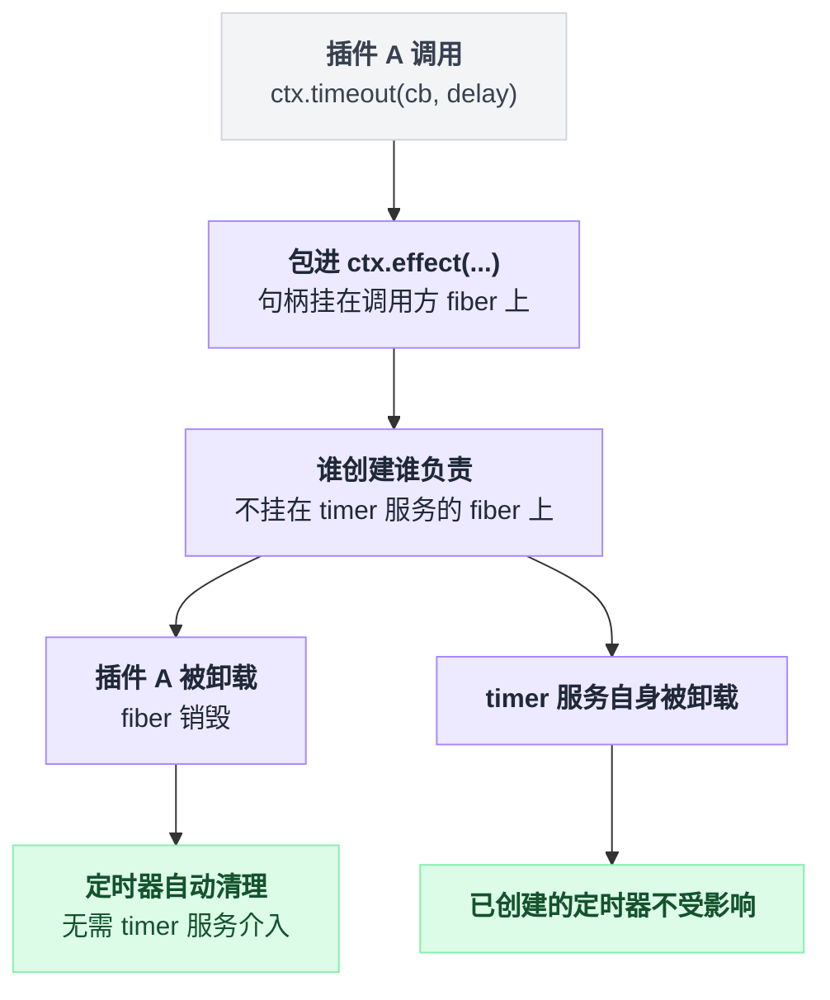

# timer

> `@deepseek-ai/cordis-plugin-timer` · bundle：`base` · 配置树 id：`timer` · v0.1.0-rc.5（commit `47f9438`）2026-08-14 核对

**一句话**：把 `setTimeout` / `setInterval` 换成挂在当前 fiber 上的可回收版本，插件卸载时它创建的定时器自动被清掉。

这是 vendored 包，不是 dsh 自己写的：上游 `@cordisjs/plugin-timer`，整份源码拷进 `vendor/timer/`。按 vendor 的本地改动日志，落到这个包头上的全是通用项——`@deepseek-ai` 改作用域（含 `src/index.ts` 里的 import 说明符，`vendor/README.md:5`、`:49`）、重新生成 `package.json`（`vendor/README.md:34`）与 `tsconfig.json`（`:35`）——没有一条是针对 timer 的行为改动。另：`vendor/timer/package.json:4` 写的是 `1.1.3`，而 vendor 清单表格里这一行记的是 `1.1.2`（`vendor/README.md:21`）。

## 它在树上长什么样

`packages/bundle/base/cordis.patch.yml:16`：

```yaml
    - id: timer
      name: '@deepseek-ai/cordis-plugin-timer'
```

没有 `inject`，没有 `config`——它是 base 那条 insert 的第一行，也不依赖任何服务（行序本身不带加载语义，激活由服务可用性驱动，`packages/bundle/base/cordis.patch.yml:12`）。`web-app` 与 `headless` 两个 bundle 都没有覆盖这一行，所以三个 profile 拿到的都是同一份。

## 它注册了什么

| 类型 | 名字 | 说明 |
|---|---|---|
| service | `ctx.timer` | `TimerService`，`super(ctx, 'timer')`（`vendor/timer/src/index.ts:14`） |
| mixin | `ctx.timeout` `ctx.interval` `ctx.throttle` `ctx.debounce` `ctx.setTimeout` `ctx.setInterval` | `ctx.mixin('timer', [...])`（`vendor/timer/src/index.ts:15`）把六个动词直接挂到每个 context 上 |

没有事件监听、没有工具、没有 prompt 段、没有命令。

六个动词的实际行为（README 的 API 表在 `vendor/timer/README.md:26`）：

| API | 行为 | 源码 |
|---|---|---|
| `ctx.timeout(cb, delay)` | 跑一次，返回 disposer；回调执行前先自我 dispose | `vendor/timer/src/index.ts:35` |
| `ctx.timeout(delay)` | 返回 promise；**fiber 被销毁时它 reject** | `vendor/timer/src/index.ts:44`、`:49` |
| `ctx.interval(cb, delay)` | 反复跑，返回 disposer | `vendor/timer/src/index.ts:63` |
| `ctx.interval(delay)` | 返回 async iterator，每 tick yield 一次；销毁时 `next()` reject | `vendor/timer/src/index.ts:70`、`:77` |
| `ctx.throttle(cb, delay, noTrailing?)` | 节流函数，带 `.dispose()` | `vendor/timer/src/index.ts:121` |
| `ctx.debounce(cb, delay)` | 防抖函数，带 `.dispose()` | `vendor/timer/src/index.ts:139` |

关键机制只有一条：每个定时器都包在 `this.ctx.effect(...)` 里（例如 `vendor/timer/src/index.ts:35`、`:63`、`:108`），所以 handle 注册在**调用方的 fiber** 上，而不是 timer 服务自己的 fiber 上——谁创建谁负责，卸载谁清谁的。



## 配置项

无配置项。源码里没有 `Config` 导出，行为完全由调用点的参数决定。

## 模型看得见什么

没有 Model Experience 小节，源码也不产生任何模型可见文本：它不注册工具、不注册 prompt 段、不写 session。

两条间接路径值得知道：

- `@deepseek-ai/dsh-tool-cordis` 的 API 目录里有一条 `key: 'timer'` 的条目（`packages/extensions/tool-cordis/src/api-catalog.ts:1801`），模型用 `cordis_inspect_*` 查服务时会读到 `ctx.timer` 的方法签名。但 tool-cordis **不在** base / web-app / headless 三个 bundle 里，默认树上没有它。
- 默认 web 树里有 `cordis-host-runner`（`packages/bundle/web-app/cordis.patch.yml:102`）。它的沙箱 guard 把六个 timer 动词列成 `TIMER_VERBS`（`packages/extensions/cordis-host-runner/src/guard.ts:637`），模型写的动态包只有在自己声明 `inject: ['timer']` 时才读得到这些动词，否则 `denyRead('timer')`（`packages/extensions/cordis-host-runner/src/guard.ts:762`）。

## 什么时候你会想换掉它 / 怎么换

基本不换。它是 [hmr](./cordis-plugin-hmr.md) 的硬依赖：`static inject = ['loader', 'timer']`（`vendor/hmr/src/index.ts:87`），hmr 用 `this.ctx.debounce()` 合并文件变更（`vendor/hmr/src/index.ts:242`）。真要关掉：

```yaml
- id: timer
  disabled: true
```

后果是 hmr 永远停在 pending（缺服务不会报错，只是不激活），配置热重载随之失效。启动器还有一层兜底：`apps/cli/src/profile-boot.ts:280` 发现 `ctx.get('timer') === undefined` 时会自己 `loader.create` 一个 timer 出来。

浏览器侧不用这个包——client runner 自带一份同名同 mixin 的实现（`packages/extensions/cordis-client-runner/src/client/timer.ts:33`），改 host 这行不影响前端。

## 坑与边界

上游 README 没有 Known Limitations 小节。读源码得到的：

- **`ctx.timeout(delay)` 的 promise 在 fiber 销毁时是 reject，不是 resolve**（`vendor/timer/src/index.ts:49`，`new Error('Context has been disposed')`）。README 只说 “Return a promise that resolves after `delay`”（`vendor/timer/README.md:29`），没提这一路。await 它的地方必须有 catch，否则插件卸载会甩出未处理拒绝。`ctx.interval(delay)` 的迭代器同理（`vendor/timer/src/index.ts:77`）。
- **`throttle` 的第三个参数 `noTrailing` 被直接当作 `_schedule` 的 `isDisposed` 初值传进去**（实参位置 `vendor/timer/src/index.ts:135`，对 `:106` 的签名）。传 `true` 的效果是尾部调用一律不排队——能用，但这是形参复用，不是显式实现的语义。
- `setTimeout` / `setInterval` 两个别名标了 `@deprecated`（`vendor/timer/src/index.ts:18`、`:23`），新代码用 `timeout` / `interval`。
- 它只包 `setTimeout` / `setInterval`，没有 `unref`、没有虚拟时钟、没有 drift 补偿；测试里想快进时间得靠外部 fake timers。
