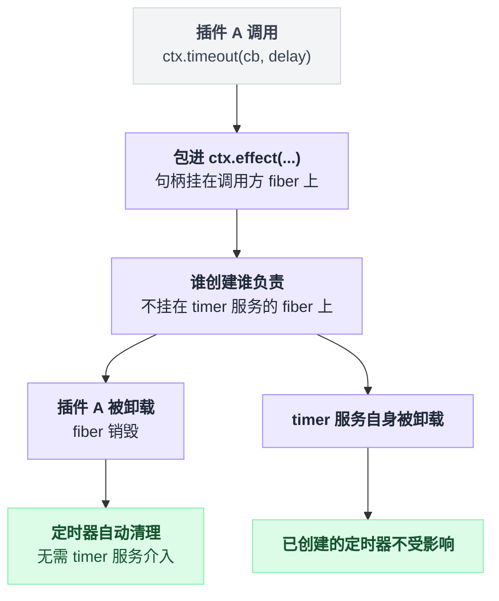

# timer

> `@deepseek-ai/cordis-plugin-timer` · bundle：`base` · 配置树 id：`timer` · v0.1.0-rc.5（commit `47f9438`）2026-08-14 核对。出处收在文末脚注，可照抄的配置收在文末附录。

**一句话**：把 `setTimeout` / `setInterval` 换成挂在当前 fiber 上的可回收版本，插件卸载时它创建的定时器自动被清掉。

这是 vendored 包，不是 dsh 自己写的。上游是 `@cordisjs/plugin-timer`，整份源码拷进了 `vendor/timer/`。

按 vendor 的本地改动日志，落到这个包头上的全是通用项：改作用域到 `@deepseek-ai`（含相关的 import 写法）、重新生成 package.json 与 tsconfig.json，没有一条是针对 timer 的行为改动[^1]。

有一处对不上账值得记一笔：vendor/timer 自己的 package.json 里写的版本号是 `1.1.3`，而 vendor 清单表格里这一行记的是 `1.1.2`[^2]。

## 它在树上长什么样

配置树里，它是 base 那条 insert 的第一行[^3]：

```yaml
- id: timer
  name: '@deepseek-ai/cordis-plugin-timer'
```

没有 `inject`，没有 `config`。它不依赖任何服务——行序本身不带加载语义，激活由服务可用性驱动[^4]。

`web-app` 与 `headless` 两个 bundle 都没有覆盖这一行，所以三个 profile 拿到的都是同一份。

## 它注册了什么

它挂了一个 service、六个 mixin 动词[^5]：

| 类型 | 名字 | 说明 |
|---|---|---|
| service | `ctx.timer` | `TimerService`，以 `timer` 为标识注册 |
| mixin | `ctx.timeout` `ctx.interval` `ctx.throttle` `ctx.debounce` `ctx.setTimeout` `ctx.setInterval` | 六个动词直接挂到每个 context 上 |

没有事件监听、没有工具、没有 prompt 段、没有命令。

六个动词的实际行为，README 的 API 表列了六条[^6]，对应的实现位置收在脚注里[^7]：

| API | 调用方式 | 行为 |
|---|---|---|
| `ctx.timeout` | 传回调和延迟 | 跑一次，返回 disposer；回调执行前先自我 dispose |
| `ctx.timeout` | 只传延迟 | 返回 promise；**fiber 被销毁时它 reject** |
| `ctx.interval` | 传回调和延迟 | 反复跑，返回 disposer |
| `ctx.interval` | 只传延迟 | 返回 async iterator，每 tick yield 一次；销毁时 `next()` reject |
| `ctx.throttle` | 传回调、延迟，外加可选的第三参数 `noTrailing` | 节流函数，带 `.dispose()` |
| `ctx.debounce` | 传回调和延迟 | 防抖函数，带 `.dispose()` |

关键机制只有一条，写成伪代码就是：

```
// timer 服务内部，每个动词都长这样
function timeout(cb, delay):
    return this.ctx.effect(() => {          // ctx = 调用方的 context
        h = 原生 setTimeout(...)
        return () => clearTimeout(h)        // fiber 销毁时被调用
    })
```

它靠 effect 机制，把 handle 注册在**调用方的 fiber** 上，而不是 timer 服务自己的 fiber 上——谁创建谁负责，卸载谁清谁的[^8]。



## 配置项

无配置项。源码里没有 `Config` 导出，行为完全由调用点的参数决定。

## 模型看得见什么

没有 Model Experience 小节，源码也不产生任何模型可见文本：它不注册工具、不注册 prompt 段、不写 session。

两条间接路径值得知道。

一是 `@deepseek-ai/dsh-tool-cordis` 的 API 目录里有一条以 `timer` 为 key 的条目，模型用 `cordis_inspect_*` 查服务时会读到 `ctx.timer` 的方法签名[^9]。但 tool-cordis **不在** base / web-app / headless 三个 bundle 里，默认树上没有它。

二是默认 web 树里有 `cordis-host-runner`[^10]。它的沙箱 guard 把六个 timer 动词列成一张清单，判定逻辑是：

```
if 动态包.inject 里声明了 'timer':
    放行 TIMER_VERBS 这六个动词
else:
    denyRead('timer')
```

也就是说，模型写的动态包只有在自己声明 inject 里包含 `timer` 时才读得到这些动词[^11]。

## 什么时候你会想换掉它 / 怎么换

基本不换。它是 [hmr](./cordis-plugin-hmr.md) 的硬依赖：hmr 的 inject 列表里写着 `loader` 和 `timer`，靠 debounce 机制合并文件变更[^12]。

真要关掉，照抄[附录 A](#a-禁用-timer-服务)。后果是 hmr 永远停在 pending——缺服务不会报错，只是不激活——配置热重载随之失效。

不过启动器还有一层兜底：发现 timer 服务还没挂上时，会自己创建一个出来[^13]。

浏览器侧不用这个包。client runner 自带一份同名同 mixin 的实现，改 host 这行不影响前端[^14]。

## 坑与边界

上游 README 没有 Known Limitations 小节。下面几条是读源码得到的。

**`ctx.timeout` 只传延迟参数时，返回的 promise 在 fiber 销毁时是 reject，不是 resolve**，抛出的错误说 context 已经销毁[^15]。README 只说这个 promise 会在延迟后 resolve[^16]，没提这一路。await 它的地方必须有 catch，否则插件卸载会甩出未处理拒绝。`ctx.interval` 只传延迟参数时的迭代器同理[^17]。

**`throttle` 的第三个参数 `noTrailing` 被直接当作 `_schedule` 的 `isDisposed` 初值传进去。** 签名和实参对不上[^18]：

```
// 签名
_schedule(cb, delay, isDisposed)

// 实际调用
_schedule(cb, delay, noTrailing)     // 第三个形参被复用了
```

传 `true` 的效果是尾部调用一律不排队——能用，但这是形参复用，不是显式实现的语义。

`setTimeout` / `setInterval` 两个别名标了 `@deprecated`，新代码用 `timeout` / `interval`[^19]。

它只包 `setTimeout` / `setInterval`，没有 `unref`、没有虚拟时钟、没有 drift 补偿；测试里想快进时间得靠外部 fake timers。

---

## 附录：可以照抄的模板

### A. 禁用 timer 服务

```yaml
- id: timer
  disabled: true
```

---

## 出处

[^1]: 本地改动日志四条坐标依次是 `vendor/README.md:5`（改作用域）、`:49`（`src/index.ts` 里的 import 说明符）、`:34`（package.json 重新生成）、`:35`（tsconfig.json 重新生成）。
[^2]: `vendor/timer/package.json:4` 写的版本号是 `1.1.3`；vendor 清单表格里这一行记的是 `1.1.2`，见 `vendor/README.md:21`。
[^3]: `packages/bundle/base/cordis.patch.yml:16`。
[^4]: `packages/bundle/base/cordis.patch.yml:12`。
[^5]: service 注册 `super(ctx, 'timer')`：`vendor/timer/src/index.ts:14`；mixin 注册 `ctx.mixin('timer', [...])`：同文件 `:15`。
[^6]: `vendor/timer/README.md:26`。
[^7]: `ctx.timeout(cb, delay)` 在 `vendor/timer/src/index.ts:35`；`ctx.timeout(delay)` 的 promise 重载在 `:44`、reject 行为在 `:49`；`ctx.interval(cb, delay)` 在 `:63`；`ctx.interval(delay)` 的 async iterator 重载在 `:70`、reject 行为在 `:77`；`ctx.throttle` 在 `:121`；`ctx.debounce` 在 `:139`。
[^8]: 三处 `this.ctx.effect(...)` 调用点：`vendor/timer/src/index.ts:35`、`:63`、`:108`。
[^9]: `packages/extensions/tool-cordis/src/api-catalog.ts:1801`。
[^10]: `packages/bundle/web-app/cordis.patch.yml:102`。
[^11]: `TIMER_VERBS` 定义：`packages/extensions/cordis-host-runner/src/guard.ts:637`；`denyRead('timer')` 调用：同文件 `:762`。
[^12]: `static inject = ['loader', 'timer']`：`vendor/hmr/src/index.ts:87`；`this.ctx.debounce()` 合并文件变更：同文件 `:242`。
[^13]: `apps/cli/src/profile-boot.ts:280`，判断条件是 `ctx.get('timer') === undefined`，命中后调用 `loader.create` 补一个 timer。
[^14]: `packages/extensions/cordis-client-runner/src/client/timer.ts:33`。
[^15]: `vendor/timer/src/index.ts:49`，抛出的是 `new Error('Context has been disposed')`。
[^16]: `vendor/timer/README.md:29`，原文："Return a promise that resolves after `delay`"。
[^17]: `vendor/timer/src/index.ts:77`。
[^18]: 实参位置：`vendor/timer/src/index.ts:135`；对应签名：同文件 `:106`。
[^19]: `setTimeout` 标 `@deprecated`：`vendor/timer/src/index.ts:18`；`setInterval` 同样标注：同文件 `:23`。
