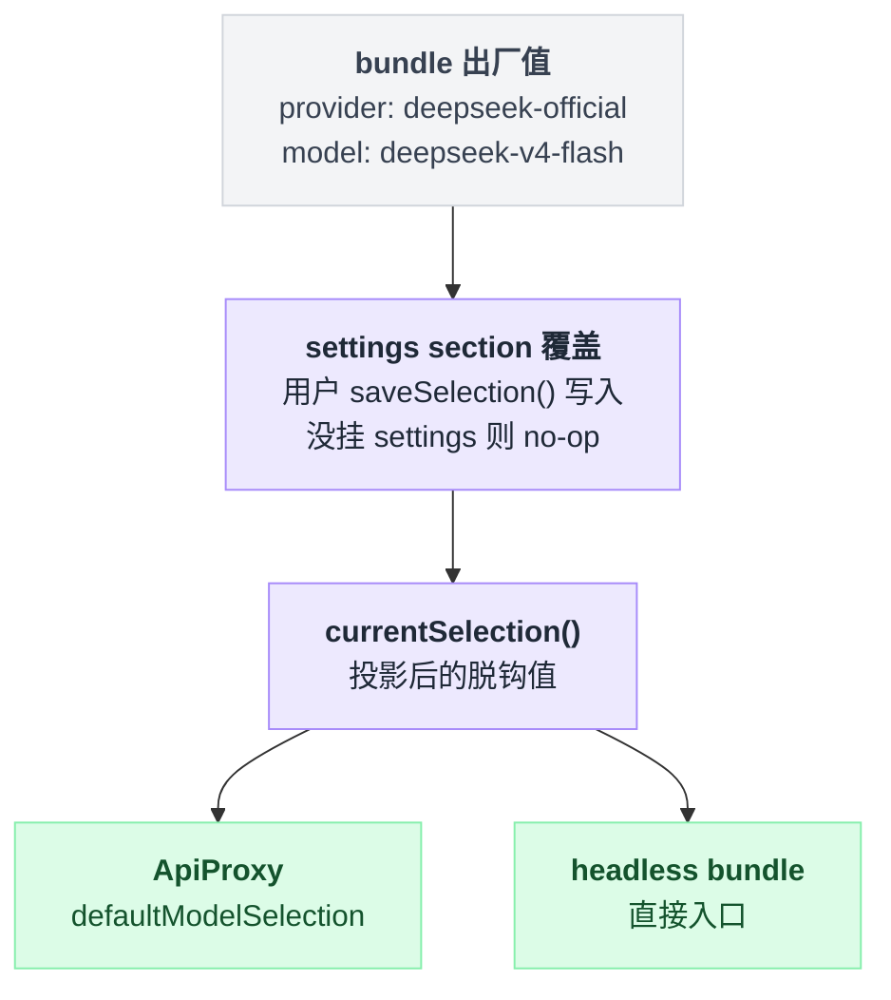

# agent-default-model

> `@deepseek-ai/dsh-agent-default-model` · bundle：`base` · 配置树 id：`agent-default-model` · v0.1.0-rc.5（commit `47f9438`）2026-08-14 核对

**一句话**：回答「新建一个没有会话级模型选择的 Agent 时用哪个 provider/model」——一个与传输层无关的进程级默认值，出厂指向 [llm-deepseek](./dsh-llm-deepseek.md) 的 `deepseek-official` 路由。

## 它在树上长什么样

```yaml
    # The transport-independent default for Agents created by entry points.
    # Settings may supply a saved selection; consumers read it at creation time.
    - id: agent-default-model
      name: '@deepseek-ai/dsh-agent-default-model'
      config:
        provider: deepseek-official
        model: deepseek-v4-flash
```

`packages/bundle/base/cordis.patch.yml:61-67`。**没有 `inject`**——它对 settings 服务是可选依赖，用 `ctx.get('settings')?.` 取（`packages/core/agent-default-model/src/index.ts:99`），所以没挂 settings 也能跑。

## 它注册了什么

| 类型 | 名字 | 说明 |
|---|---|---|
| service | `ctx.agentDefaultModel`（`AgentDefaultModelConfig`） | 类在 `src/index.ts:64`，`super(ctx, 'agentDefaultModel')` 在 `:73` |
| settings section | 命名空间 `agent-default-model` | `installSettingsSection(...)`，`src/index.ts:76-81`；composition 的那一行是 base，用户层叠在上面 |

不监听事件、不注册工具 / prompt 段 / 命令。同包还发布了一个**故意为空**的 `./invariant` companion（`src/invariant.ts:21-22`），因为「settings 注册已经在 `currentSelection()` 能观察到之前校验过每一个可变值」，空 installer 是把这个「没有不变式」在组合的不变式集合里写明白。

服务只有两个方法（`README.md:9-10`）：

- `ctx.agentDefaultModel.currentSelection()` — 返回一个脱钩的 `{ provider, model, reasoningEffort? }`。
- `ctx.agentDefaultModel.saveSelection(selection)` — 保存完整的用户选择；没挂 settings 时是 no-op，composition 的值继续生效。

已知消费者：ApiProxy 把这两个方法直接接到 `defaultModelSelection` / `saveDefaultModelSelection` 上（`packages/host/apiproxy/src/index.ts:99-100`），headless bundle 也读它（`packages/bundle/headless/src/index.ts:28,101`）。也就是 `dsh --profile headless` 这种直接入口和 Host 型入口**读的是同一个服务**，而不是各自维护一份 provider/model 默认值。

## 配置项

| 字段 | 类型 | 默认值 | 作用 |
|---|---|---|---|
| `provider` | string（required） | bundle 给的是 `deepseek-official` | 已注册的 provider 路由 |
| `model` | string（required） | bundle 给的是 `deepseek-v4-flash` | provider 自己的 model id |

schema 在 `src/index.ts:65-68`，两个字段都是 `required`。

**`reasoningEffort` 属于 settings section 而刻意不属于 plugin config**（`README.md:7`、`src/index.ts:41-46` 的 `Config` 只有两个字段）：一次完整的保存选择需要能在下一个模型没有努力档时**清空**它，而 composition 里的值会被重新继承回来。settings 的 section schema 因此是三个字段：`provider` / `model` / 可选 `reasoningEffort`（`src/index.ts:34-38`）。

合成关系：composition 那一行是 section 的 base，挂了 settings 服务时用户选择叠在上面，改动在**下一次** `currentSelection()` 读取时可见——因为每个消费者都走 `currentSelection()`，所以 `onChange` 是空的，没有注册级事实需要重建（`src/index.ts:78-80`）。

值从哪来、最终被谁读到，是同一条链路：



## 模型看得见什么

Model Experience 原文（`README.md:14-16`）：

> Indirectly, through the provider/model selection supplied to an entry point; request assembly and adapters own the model-visible request.

KV Cache effect（`README.md:18-20`）：改默认值只影响**之后**从它解析的 Agent；请求日志里已经写明选择的既有会话保持原选择，所以这个服务不会让它已建立的前缀失效。

## 什么时候你会想换掉它 / 怎么换

换插件基本没必要，换**值**很常见：

- **临时/单机改**：写 `$DSH_HOME/settings.yaml` 的 `agent-default-model:` section（Web 的 Models 页保存默认选择时走的就是 `saveSelection()`），不用重启。
- **部署级改**：在 profile 的 `cordis.patch.yml` 里按 id 覆盖这一行的 `config`。注意 patch 是**整份替换**目标行的 `config` 而不是合并进去（`packages/bundle/base/cordis.patch.yml:6-7`，另见 `packages/boot/app-boot/README.md:43`），所以 `provider` 和 `model` 要一起写全。
- **切到 pi-ai 的路由**：把 `provider` 改成你在 [llm-pi-ai](./dsh-llm-pi-ai.md) 的 `providers` 里定义的那个 key（比如 `openai`），`model` 改成该路由服务的 model id。

它**不校验目录成员**（`README.md:12`）：一条 provider 路由可以服务未在 catalog 里列出的模型，所以真正打开模型请求的那个消费者负责给出可用性诊断。反过来说，把 `provider` 写成一条不存在的路由，插件装载时不会报错，报错发生在第一次真的发请求的时候（[llm](./dsh-llm.md) 抛 `NO_ADAPTER`，`packages/llm/llm/src/index.ts:818`）。

## 坑与边界

`README.md:22-25` 的 Known Limitations and Deferred Work：

- **服务只持有一个进程级默认值**；每会话的选择仍然是入口点的责任。
- **没挂 settings 服务时 `saveSelection()` 无法为后续 Agent 留住选择**（它是 no-op）。

读源码补充：`currentSelection()` 返回的是投影后的**脱钩**值（`selection()`，`src/index.ts:49-57`），`reasoningEffort` 在这一步被包成 `ReasoningEffortId` brand——那是 [llm](./dsh-llm.md) 定义的不透明 adapter 私有标识（类型在 `packages/llm/llm/src/brand.ts:55`，构造器在 `:62`，不做任何校验），dsh 核心不枚举它的取值，能不能用由那条路由的 adapter 说了算。

## 未确认

- ⚠️ 出厂默认 `deepseek-v4-flash` 在你的部署里能不能真的跑通，取决于 llm-deepseek 的 catalog 与你的账号；本服务不做任何校验。
