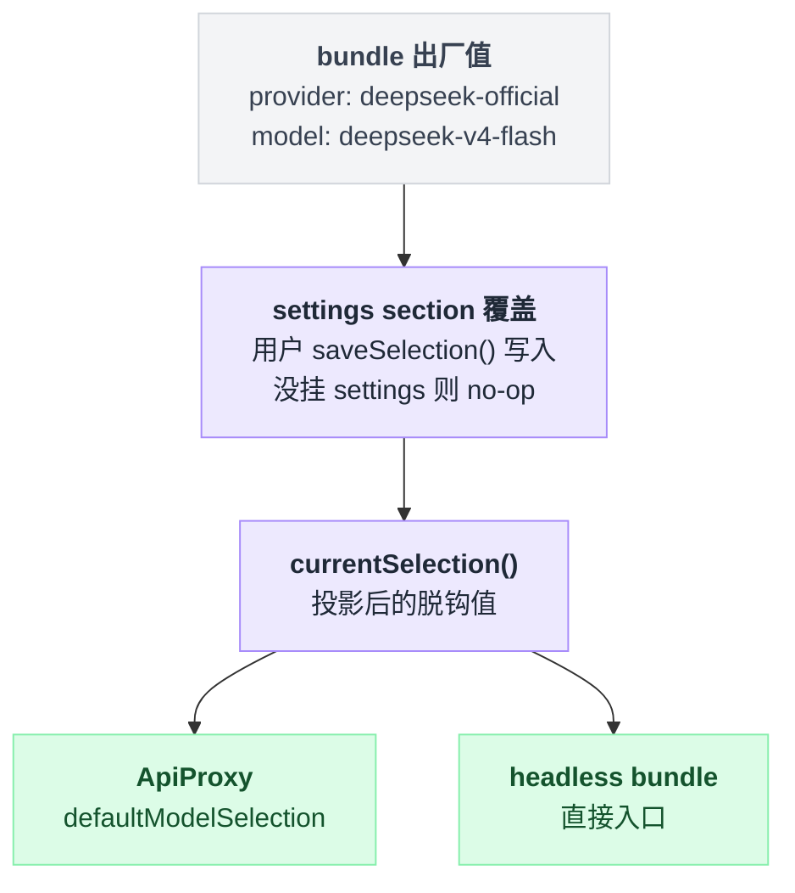

# agent-default-model

> `@deepseek-ai/dsh-agent-default-model` · bundle：`base` · 配置树 id：`agent-default-model` · v0.1.0-rc.5（commit `47f9438`）2026-08-14 核对；出处收在文末脚注。

**一句话**：回答「新建一个没有会话级模型选择的 Agent 时用哪个 provider/model」——一个与传输层无关的进程级默认值，出厂指向 [llm-deepseek](./dsh-llm-deepseek.md) 的 `deepseek-official` 路由。

## 它在树上长什么样

```yaml
    # The transport-independent default for Agents created by entry points.
    # Settings may supply a saved selection; consumers read it at creation time.
    - id: agent-default-model
      name: '@deepseek-ai/dsh-agent-default-model'
      config:
        provider: deepseek-official
        model: deepseek-v4-flash
```

这一行**没有 `inject`**[^1]。

它对 settings 服务是可选依赖：取值那步用的是"拿不到就跳过"的问号写法，不强求这个服务一定挂载[^2]。所以没挂 settings 也照样能跑，只是保存能力会退化（后面会讲）。

## 它注册了什么

| 类型 | 名字 | 说明 |
|---|---|---|
| service | `ctx.agentDefaultModel`（`AgentDefaultModelConfig`） | 类的定义与注册[^3] |
| settings section | 命名空间 `agent-default-model` | `installSettingsSection(...)` 注册[^4]；composition 的那一行是 base，用户层叠在上面 |

不监听事件、不注册工具 / prompt 段 / 命令。

同包还发布了一个**故意为空**的 `./invariant` companion[^5]。理由是「settings 注册已经在 `currentSelection()` 能观察到之前校验过每一个可变值」——空 installer 不是偷懒，是把「这里没有不变式」这件事，在组合的不变式集合里写明白。

服务只有两个方法[^6]：

- `ctx.agentDefaultModel.currentSelection()` — 返回一个脱钩的 `{ provider, model, reasoningEffort? }`。
- `ctx.agentDefaultModel.saveSelection(selection)` — 保存完整的用户选择；没挂 settings 时是 no-op，composition 的值继续生效。

已知消费者有两个。ApiProxy 把这两个方法直接接到 `defaultModelSelection` / `saveDefaultModelSelection` 上[^7]，headless bundle 也读它[^8]。

也就是说，`dsh --profile headless` 这种直接入口和 Host 型入口**读的是同一个服务**，而不是各自维护一份 provider/model 默认值。

## 配置项

| 字段 | 类型 | 默认值 | 作用 |
|---|---|---|---|
| `provider` | string（required） | bundle 给的是 `deepseek-official` | 已注册的 provider 路由 |
| `model` | string（required） | bundle 给的是 `deepseek-v4-flash` | provider 自己的 model id |

schema 定义两个字段都是 `required`[^9]。

### 为什么 `reasoningEffort` 不在这张表里

**它属于 settings section 而刻意不属于 plugin config**。plugin 的 `Config` 只有上面两个字段，settings 的 section schema 却是三个：`provider` / `model` / 可选 `reasoningEffort`[^10]。

原因是「一次完整的保存选择」必须能**清空**这个字段——下一个模型可能压根没有努力档。而如果它待在 composition 里，清掉之后值会被重新继承回来，等于清不掉。

### 合成与生效时机

composition 那一行是 section 的 base，挂了 settings 服务时用户选择叠在上面，改动在**下一次** `currentSelection()` 读取时可见：

```
默认值 = composition 那一行的 { provider, model }
if 挂了 settings:
    默认值 = 默认值 叠加 settings section 里的用户选择   // 可含 reasoningEffort
返回 脱钩副本(默认值)                                    // 每次调用现算，不缓存
```

因为每个消费者都走 `currentSelection()` 现读，所以 `onChange` 是空的——没有任何注册级事实需要在改动时重建[^11]。

值从哪来、最终被谁读到，是同一条链路：



## 模型看得见什么

Model Experience 原文[^12]：

> Indirectly, through the provider/model selection supplied to an entry point; request assembly and adapters own the model-visible request.

KV Cache effect[^13]：改默认值只影响**之后**从它解析的 Agent；请求日志里已经写明选择的既有会话保持原选择，所以这个服务不会让它已建立的前缀失效。

## 什么时候你会想换掉它 / 怎么换

换插件基本没必要，换**值**很常见，三种改法：

| 场景 | 怎么改 | 注意 |
|---|---|---|
| 临时 / 单机 | 写 `$DSH_HOME/settings.yaml` 的 `agent-default-model:` section | 不用重启；Web 的 Models 页保存默认选择时走的就是 `saveSelection()` |
| 部署级 | 在 profile 的 `cordis.patch.yml` 里按 id 覆盖这一行的 `config` | patch 是**整份替换**[^14]目标行的 `config` 而不是合并进去，所以 `provider` 和 `model` 要一起写全 |
| 切到 pi-ai 的路由 | `provider` 改成你在 [llm-pi-ai](./dsh-llm-pi-ai.md) 的 `providers` 里定义的那个 key（比如 `openai`） | `model` 同时改成该路由服务的 model id |

### 写错了 provider 不会当场炸

它**不校验目录成员**[^15]：一条 provider 路由可以服务未在 catalog 里列出的模型，所以真正打开模型请求的那个消费者才负责给出可用性诊断。

反过来说就是个坑——把 `provider` 写成一条不存在的路由，插件装载时一声不吭：

```
装载阶段:  只记下 { provider, model } 两个字符串，不查任何目录  // 静悄悄通过
第一次真发请求:  找不到这条路由对应的 adapter → 抛 NO_ADAPTER
```

报错发生在第一次真的发请求的时候，由 [llm](./dsh-llm.md) 抛 `NO_ADAPTER`[^16]。

## 坑与边界

Known Limitations and Deferred Work 列了两条[^17]：

- **服务只持有一个进程级默认值**；每会话的选择仍然是入口点的责任。
- **没挂 settings 服务时 `saveSelection()` 无法为后续 Agent 留住选择**（它是 no-op）。

读源码补充一条：`currentSelection()` 返回的是投影后的**脱钩**值[^18]，`reasoningEffort` 在这一步被包成 `ReasoningEffortId` brand。

那是 [llm](./dsh-llm.md) 定义的不透明 adapter 私有标识，构造器不做任何校验[^19]。dsh 核心不枚举它的取值——能不能用，由那条路由的 adapter 说了算。

## 出处

[^1]: composition 那一行（无 `inject`）：`packages/bundle/base/cordis.patch.yml:61-67`。
[^2]: 对 settings 服务的可选依赖写法（`ctx.get('settings')?.`）：`packages/core/agent-default-model/src/index.ts:99`。
[^3]: service 类的定义与注册：`src/index.ts:64`（类），`:73`（`super(ctx, 'agentDefaultModel')`）。
[^4]: `installSettingsSection(...)` 调用点：`src/index.ts:76-81`。
[^5]: 空 invariant companion：`src/invariant.ts:21-22`。
[^6]: 两个方法的列举：`README.md:9-10`。
[^7]: ApiProxy 接线：`packages/host/apiproxy/src/index.ts:99-100`。
[^8]: headless bundle 读取点：`packages/bundle/headless/src/index.ts:28,101`。
[^9]: plugin Config schema：`src/index.ts:65-68`。
[^10]: `README.md:7`；plugin `Config` 的两个字段：`src/index.ts:41-46`；settings section 的三个字段：`src/index.ts:34-38`。
[^11]: 空 `onChange`：`src/index.ts:78-80`。
[^12]: Model Experience 原文：`README.md:14-16`。
[^13]: KV Cache effect 原文：`README.md:18-20`。
[^14]: 「整份替换」语义：`packages/bundle/base/cordis.patch.yml:6-7`，另见 `packages/boot/app-boot/README.md:43`。
[^15]: 不校验目录成员：`README.md:12`。
[^16]: `NO_ADAPTER` 抛出点：`packages/llm/llm/src/index.ts:818`。
[^17]: Known Limitations and Deferred Work：`README.md:22-25`。
[^18]: 投影函数 `selection()`：`src/index.ts:49-57`。
[^19]: `ReasoningEffortId` 类型与构造器：`packages/llm/llm/src/brand.ts:55`（类型），`:62`（构造器）。
