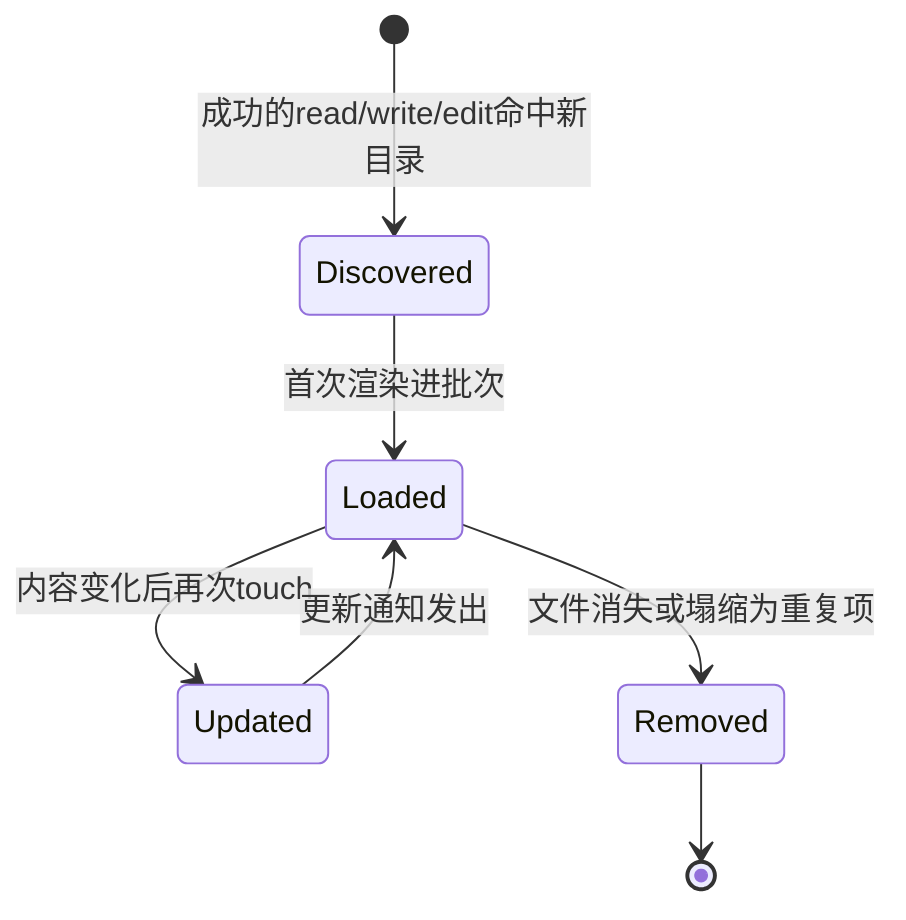

# agent-instructions

> `@deepseek-ai/dsh-agent-instructions` · bundle：`base` · 配置树 id：`agent-instructions` · v0.1.0-rc.5（commit `47f9438`）2026-08-14 核对

**一句话**：按 session 加载 `AGENTS.md` 兼容文件——先把"用户全局 + 项目"的基线指令注入持久历史，之后跟着成功的文件系统工具调用发现更深目录的嵌套文件，并在变更/消失时补发通知。

## 它在树上长什么样

base bundle 里就是一行带一个配置：

```yaml
- id: agent-instructions
  name: '@deepseek-ai/dsh-agent-instructions'
  config:
    maxBytes: 65536
```

web profile 不一样，顶层这一行被明确关掉：

```yaml
- id: agent-instructions
  disabled: true
```

关掉不等于不用，它被下放进 preset 的子组合里，配置值不变：

| preset | 挂了它吗 | 出处 |
|---|---|---|
| `standard` | 挂了 | `apps/cli/config/agent-presets/standard/agent.cordis.yml:30` |
| `code` | 挂了 | 同名文件 `:37` |
| `cordis` | 挂了 | 同名文件 `:31` |
| `minimal` | 没挂 | — |

也就是说，web 下"哪个 agent 读 AGENTS.md"是 preset 决定的，不是全局开关。

出处：base 那一行见 `packages/bundle/base/cordis.patch.yml:232`，web 的关闭见 `packages/bundle/web-app/cordis.patch.yml:401`。

YAML 里没有 `inject`。包也**没有** `static inject`：它通过 `ctx.get('fs')` 取可选的 `ctx.fs`（`src/index.ts:116`）。README 把用意说明了（`README.md:13`）：

```text
The plugin does not statically inject `fs`, so providerless product trees still boot and instruction loading becomes a no-op until a provider is present.
```

## 它注册了什么

不提供任何 service，不注册工具、不注册 prompt 段——`src/index.ts` 全文只有一个 `export function apply`（`:80`）。它整个就是三个监听器：

| 类型 | 名字 | 说明 |
|---|---|---|
| 事件监听（**waterfall**） | `agent/pre-step` | `src/index.ts:322`。先 `await next()` 拿到下游决定，再把 workspace context 折进最终批次 |
| 事件监听（emit） | `tools/result` | `src/index.ts:350`。只认成功的第一方 `read` / `write` / `edit`（`src/index.ts:70`），从 `file_path` 参数取路径（`:75`–`:76`） |
| 事件监听（emit） | `session/event` | `src/index.ts:305`。跟踪 `step/start` / `step/end` / `turn/end`（`:306`、`:310`、`:314`），把 step 内产生的 touch 攒到 `step/end` 之后再投影 |
| 可选伴生 | `@deepseek-ai/dsh-agent-instructions/invariant` | 包 exports 里的独立入口（`package.json`），base bundle 没挂 |

三个里只有 waterfall 那个值得停下来看，另两个基本是"收集事件、攒起来、到点投影"的模板。

waterfall 的处理讲究在于：基线指令并不是抢着插进去的，而是等下游先定，再看有没有位置塞。

```
on agent/pre-step (waterfall):
    decision = await next()               // 先让下游把这一步定下来
    if decision 是 reject:
        基线留在 next-step inbox，等下次唤醒再说
    elif 这是第一个 step 且批次为空:
        同上，也留着不发
    else:
        移除 pending 副本
        把消息插在"最后一条被 claim 的消息之后"
```

于是最终一批消息的顺序固定成这样：直接 prompt 在前、基线在中、[agent-loop](./dsh-agent-loop.md) 追加的 runtime context 在后。

对应 `src/index.ts:326`–`:347`（整段处理）、`:333`（第一个 step 批次为空）、`:339`（移除 pending 副本）、`:345`–`:346`（插入位置）。


`tools/result` 那条则是个很窄的漏斗，绝大多数工具调用都被它挡在外面：

```
on tools/result(call):
    if call.tool 不在 {read, write, edit} 里:  return   // 且必须是第一方的这三个
    if call 没成功:                             return
    把 call 参数里的 file_path 攒进本 step 的 touch 集合
```

## 配置项

| 字段 | 类型 | 默认值 | 作用 |
|---|---|---|---|
| `maxBytes` | `number` | **必填**（`z.number().required()`，`src/config.ts:42`；bundle 给 `65536`） | 一次渲染（基线或动态批）的 UTF-8 字节上限；非正或非有限值直接关掉加载 |
| `maxSourceBytes` | `number`（正整数） | `1048576`（1 MiB） | 单个指令文件读取上限，超了直接忽略该文件 |
| `dshHome` | `string` | `$DSH_HOME`，否则 `~/.dsh` | 用户全局 `AGENTS.md` 所在目录 |
| `projectRootMarkers` | `string[]` | `['.git']` | 从 session cwd 向上找项目根的标志目录项 |
| `instructionFileCandidates` | `string[]` | `['AGENTS.md', 'CLAUDE.md']` | 每个目录的基础候选，按序全部加载 |
| `localInstructionFileCandidates` | `string[]` | `['AGENTS.local.md', 'CLAUDE.local.md']` | 本地覆盖层，排在基础文件之后；空数组即禁用 |

两个候选列表不是照单全收，中间还有过滤和去重：

```
for dir in 要加载的目录:
    候选 = instructionFileCandidates + localInstructionFileCandidates   // 本地覆盖层排在后面
    for name in 候选:
        if name 是空串 / '.' / '..' / 含 '/' 或 '\':   丢掉，必须是同目录文件名
        if 文件超过 maxSourceBytes:                    忽略这个文件
        if 去掉首尾空白后与同目录中更早的候选逐字节相同: 塌缩到最早那个，不再渲染一遍
```

最后一条的实际效果是：内容重复的 `CLAUDE.md` 不会和 `AGENTS.md` 各渲染一遍。

对应 `src/config.ts`：默认值 `:11`–`:14`、schema `:39`–`:46`、被过滤掉的三个保留段 `RESERVED_PATH_SEGMENTS = 空串、'.'、'..'` 在 `:15`、过滤逻辑在 `:119`–`:123`。

`maxBytes` 被设计成必填，README 的理由是"让每个部署显式做出自己的 prompt 预算选择"（`README.md:70`）。

## 模型看得见什么

这个插件产出的**全部**是模型可见文本，且它自己拥有完整的 `<system-reminder>` 框（`README.md:47`）。基线模板长这样（`README.md:91`–`:101`）：

```markdown
<system-reminder>
The following workspace instructions may be relevant to your work. Use them as guidance when applicable. More specific instructions take precedence over broader ones. They do not override system, developer, or direct user instructions.

Instructions from: ~/.dsh/AGENTS.md

<user-global-instructions>

Instructions from: AGENTS.md

<project-instructions>
</system-reminder>
```

一份指令文件在会话里经历的状态迁移，全部由成功的 fs 工具调用驱动：



迁移到哪一格，模型收到的文本就不一样：

| 情形 | 发出的文本 |
|---|---|
| 新发现更深目录的文件 | `Additional instructions from: <path>` |
| 同一文件内容改了 | `Updated instructions from: <path>` |
| 文件消失，或变成同目录内更早候选的重复项 | `Instructions removed: <path>`，完整块见下 |

移除通知的完整样子（`README.md:147`–`:151`）：

```markdown
<system-reminder>
Instructions removed: packages/app/AGENTS.md

The previously loaded instructions from this file no longer apply.
</system-reminder>
```

指令内容里出现的字面 `</system-reminder>` 会被转义，仓库里的文本关不掉这个框（`README.md:45`）。

模型可见文本中**没有**隐藏状态标记：状态放在消息的 `agent-instructions` 结构化 source 里，形如 `{ action, scope, path, digest? }`，再加上基线的 `baselineIdentity`（`README.md:51`）。

token 上也没有反复开销：基线只追加一次并一直留到 compaction，新增内容都是 append-only，不打断已有 KV cache（`README.md:106`、`:136`）。

## 什么时候你会想换掉它 / 怎么换

- **调预算**：patch `maxBytes`；想彻底关掉加载，给它一个非正数，或者 `disabled: true`。
- **换文件名约定**：改 `instructionFileCandidates`；比如只认 `AGENTS.md` 就写 `['AGENTS.md']`。
- **想按 agent 决定谁读指令**：照 web profile 的做法——顶层关掉，挂进 preset 组合。
- 没有替代 provider 的概念，它不提供服务，别的插件也不依赖它。

## 坑与边界

以下来自 `README.md:164`–`:169`：

- **发现依赖结构化 fs 工具，不认 shell 导航**——`bash` 里 `cd` 到子目录不会触发嵌套指令发现，因为每次 bash 调用都是新 shell，解析任意 shell 语法不可靠。
- **刷新是 touch 驱动的**——没有文件监听器；外部改动要等下一次成功的 `read`/`write`/`edit`、resume 时的基线对账、或者某次 pre-step 恢复被 compaction 遮蔽的基线。
- **候选语义刻意做小**——小写文件名、`.claude/rules/`、`@path` 导入都不解释；用户全局 `$DSH_HOME` 那一层还没有 local 覆盖层。
- **同目录去重是按内容的**——只有去掉首尾空白后逐字节相同才塌缩；已经漂移的真实副本会和 `AGENTS.md` 一起完整加载。
- **符号链接会被跟随，跨越信任边界**——候选文件最后一段是符号链接时会解析并加载目标内容，克隆来的仓库能借此把仓外文件当作低权限 workspace 指引暴露出来（它永远不覆盖 system / developer / 直接用户指令）。加载不可信仓库时应当用文件系统策略网关或 OS 沙箱约束 `ctx.fs`。
- **内容是被截断的，不是被摘要的**——超预算的宽泛文件整份丢弃、最具体的那份可能被截断，插件绝不叫模型去压缩指令散文。
