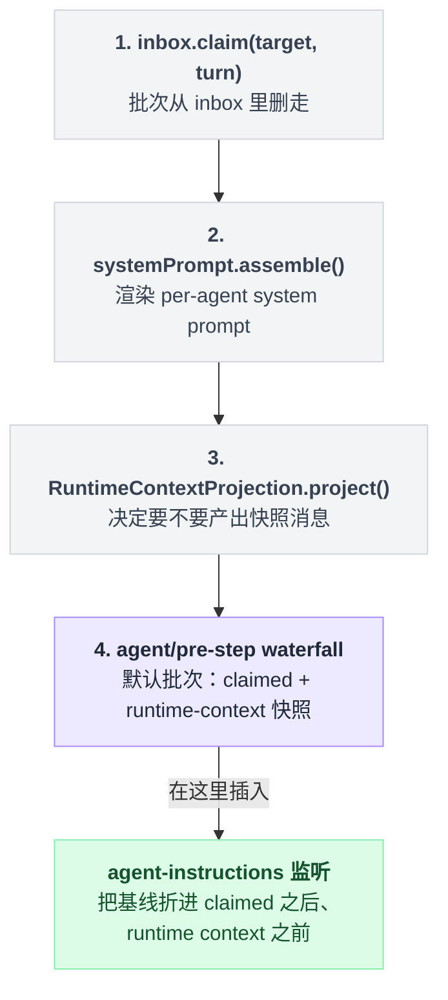

# agent-loop

> `@deepseek-ai/dsh-agent-loop` · bundle：`base` · 配置树 id：`agent-loop` · v0.1.0-rc.5（commit `47f9438`）2026-08-14 核对

**一句话**：整个 harness 里**唯一**含具体循环逻辑的包——它实现 [agent](./dsh-agent.md) 定义的 `Agent` 接口，驱动 session/turn/step 生命周期，并把自己注册成 `ctx.agents` 的工厂。

这不是自谦，README 自己就是这么写的（`packages/core/agent-loop/README.md:7`）：

```text
This is the only package in the harness that contains concrete loop logic. Everything else is an abstract service or a plugin against extension points — new behavior goes into plugins, not here.
```

换句话说，别的包都是抽象服务或者挂在扩展点上的插件，只有这里有真正的 while 循环。

## 它在树上长什么样

`packages/bundle/base/cordis.patch.yml:436`：

```yaml
- id: agent-loop
  name: '@deepseek-ai/dsh-agent-loop'
  config:
    agents: []
```

base 层刻意留空——启动时不创建任何 agent。

真要在启动时拉起 agent，是 raw overlay 的活；Web 则按客户端请求创建 session。`web-app` 和 `headless` 都没有覆盖这一行。

另一半依赖不在 YAML 里，是包自己声明的硬依赖（`src/index.ts:297`）：

```ts
static inject = ['agents', 'sessions', 'llm', 'tools', 'systemPrompt']
```

五个全是接口服务，缺一个这一行就不激活。`docs/config-catalog.md` 的 `Requires:` 行列的也是这五个。

## 它注册了什么

| 类型 | 名字 | 说明 |
|---|---|---|
| service | `ctx.agentLoop`（`AgentLoop`） | `src/index.ts:296`、`:320` |
| 工厂 | `ctx.agents.setFactory(this)` | `src/index.ts:350`；此后 `ctx.agents.create()` / `resume()` 才可用 |
| prompt 变量 | `provider`、`model`、`cwd` | `src/index.ts:351`–`:353`，值取自 `agent.options` 与 `agent.session.header.cwd` |
| settings 段 | `agent-loop`（只含 `maxParallelToolCalls`） | `src/index.ts:236`、`:250`、`:335`；Web 设置页标签是 "Parallel tool calls"（`packages/client/ui-settings-plugins/src/client/locales.ts:42`） |
| 事件派发（emit） | `agent/inbox/inserted`、`agent/inbox/discarded`、`agent/inbox/claimed`、`agent/status`、`agent/error` | `src/agent.ts:88`–`:90`、`:109`、`:206` |
| 事件派发（emit） | `agent/session-start` | `src/index.ts:567`，走 `emitAgentEvent()` |
| 事件派发（**waterfall**） | `agent/pre-step`、`agent/request`、`agent/request-error` | `src/agent.ts:234`、`:438`、`:355` |
| 事件派发（serial） | `agent/turn-stopping` | `src/agent.ts:296` |
| 事件声明（emit） | `agent-loop/config-start-failed` | 本包自己声明的一条，`src/index.ts:183` |

注意最后一条和前面几条的性质不同：除 `agent-loop/config-start-failed` 外，上面这些事件都由 [agent](./dsh-agent.md) 声明，本包只负责派发（`docs/event-producer-consumer.md:14`–`:23`）。

### 一个 step 的真实顺序

顺序里唯一反直觉的是第一步——**先把批次从 inbox 里删走，再去组装 prompt**：

```
step(target, turn):
    批次 = inbox.claim(target, turn)                          // 1. 先删走
    prompt = systemPrompt.assemble(assembleContextFor(this, signal))  // 2. 再组装
    快照 = RuntimeContextProjection.project()                  // 3. 可能产出，也可能不产出
    批次 = waterfall('agent/pre-step', [claimed, 快照])        // 4. 默认值就是这两段
```

也就是说，`agent/pre-step` 拿到的那个"默认值"，是 `claimed` 后面接一条 runtime-context 快照。出处：整段 `src/agent.ts:225`–`:243`，其中 claim 在 `:229`、assemble 在 `:230`、project 在 `:232`–`:233`、waterfall 在 `:234`、默认值在 `:236`–`:239`。



这个顺序顺便解释了另一个包的怪癖：[agent-instructions](./dsh-agent-instructions.md) 之所以能把自己的消息稳定折在"claimed 批次之后、runtime context 之前"，是因为它就是在这条 waterfall 里改上面那个默认批次。

runtime-context 快照有个容易看岔的细节：它的 source 署名写死成 `@deepseek-ai/dsh-system-prompt`（`src/runtime-context.ts:12`），并不署 agent-loop 自己。清空时发的是一条固定文案 `Current runtime context: none. Earlier runtime-context snapshots no longer apply.`（`src/runtime-context.ts:13`）。

## 配置项

| 字段 | 类型 | 默认值 | 作用 |
|---|---|---|---|
| `maxParallelToolCalls` | `number`（整数 ≥ 1） | `10`（`src/constants.ts:6`，schema `src/index.ts:301`） | 每个 agent 每个 step 的 parallel-safe 调用滚动池上限；`1` 即串行 |
| `agents` | 数组 | `[]`（schema `src/index.ts:310`，bundle 也写了 `[]`） | 插件启动时创建/恢复的 agent |
| `agents[].id` | `string` | 必填（`z.string().required()`，`src/index.ts:303`） | 稳定标签，也是新 session id 的前缀 |
| `agents[].provider` / `.model` | `string` | 无 | 模型调用两者都必须有，否则 `agent/request` 得补上 |
| `agents[].maxTokens` | `number`（正整数） | 无 | 每次会话请求的输出 token 上限，记进 request header |
| `agents[].sessionId` | `SessionId` | 无 | 固定身份；首次创建，重挂时若已有持久化则恢复其历史（`src/index.ts:358`–`:359`） |
| `agents[].resumeSessionId` | `SessionId` | 无 | 恢复既有持久化 session，与 `sessionId` 互斥（`src/index.ts:283`） |
| `agents[].cwd` | `string` | 无 | 只对新建 session 生效 |

三个 session 身份字段合起来是这么一棵决策树：

```
if 写了 resumeSessionId:   恢复那个已持久化的 session      // 与 sessionId 互斥，同写报错
elif 写了 sessionId:       有持久化就恢复历史，没有就按这个 id 新建
else:                      每次启动都新建 `${id}-session-<uuid>`
```

`maxParallelToolCalls` 是 `agent-loop` settings 段的**全部**内容：用户层改它能在不重启的情况下影响下一组工具调用，而非正整数的值在写入时就被拒（`README.md:52`，实现见 `src/index.ts:339`）。

`agents` 则故意不进 settings——它在服务启动时被消费一次，存进去只会看起来像生效了（`src/index.ts:240`–`:243`）。

## 模型看得见什么

`Model Experience` 说：每个 step 发出的是渲染后的 per-agent system prompt、可见工具 schema、以及该 session 的派生消息；循环只提供 `provider`/`model`/`cwd` 三个变量值，`but no additional fixed prose`（`README.md:91`）。

唯一由它产生的模型可见文本，是取消之后的补洞：

| | |
|---|---|
| 触发 | 工具调用被取消、还没派发出去 |
| 重放时错误码 | `ABORTED_BEFORE_DISPATCH` |
| 结果文本 | `Error: tool call aborted before dispatch` |
| 写入方式 | append-only，不破坏已有 KV cache 条目 |

出处：错误码与文本见 `README.md:119`，append-only 与 KV cache 见 `README.md:127`。

## 什么时候你会想换掉它 / 怎么换

- **调并发**：patch `maxParallelToolCalls`，或直接在 harness home 下的 `settings.yaml`（`$DSH_HOME/settings.yaml`，默认路径见 `packages/settings/settings-file/README.md:11`）的 `agent-loop:` 段里改（热生效）。
- **启动即拉起 agent**：往 `agents` 里塞一行；headless/raw overlay 是典型场景。
- **整个换掉循环**：README 的立场是"新行为进插件，不进这里"。真要换，实现 `Agent` 接口后用 `ctx.agents.register()` 注册，并把这一行 `disabled: true`——但注意 `ctx.agents.create()`/`resume()` 会因为没有工厂而 reject，Web 那套按需建 session 的流程就断了。

## 坑与边界

来自 `README.md:131`–`:134`：

- **分类是一元的**——安全性取决于和兄弟调用/资源比较的工具必须保持 exclusive。
- **config 标签默认每次都是新的**——不写 `sessionId` 时每次启动都生成 `${id}-session-<uuid>`；要"有就恢复没有就新建"必须给显式稳定的 `sessionId`。
- **config 建的 agent 没有 per-agent persona 字段，也没有 setup 钩子**——只能用部署 persona；按 agent 的 persona/工具组合只有走 `ctx.agents.create()` / `resume()` 的编程接口。
- **没有内建 turn 预算**——工具调用或 steering 会一直延续当前 turn，想给失控 turn 兜底得从 `agent/turn-stopping` 之类的扩展点主动 cancel。

读源码还能补两条 README 没写的：`provider`/`model` 缺失时抛的是明文错误 `agent "<id>" has no provider/model: set AgentOptions.provider and AgentOptions.model or supply both via the agent/request waterfall`（`src/agent.ts:444`）；同一份 config 里两个 agent 用同一个精确 session 身份，会在加载期直接抛错（`src/index.ts:289`）。
