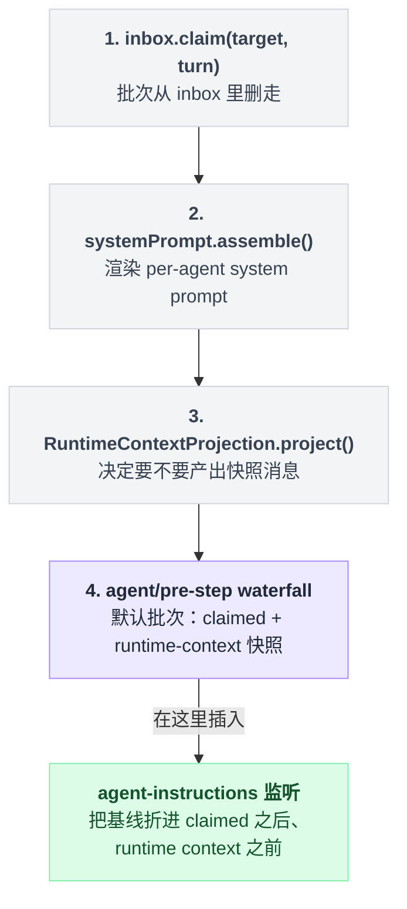

# agent-loop

> `@deepseek-ai/dsh-agent-loop` · bundle `base` · 配置树 id `agent-loop` · v0.1.0-rc.5（commit `47f9438`），2026-08-14 核对。正文只讲机制；可照抄的代码统一收在文末[附录](#附录可以照抄的模板)，出处收在[脚注](#出处)。

光看名字容易猜错：agent-loop 好像只是众多包里普通的一个，跟别的一样挂在某个扩展点上等着被调用。

不是的。翻遍整个 harness，只有这一个包写着真正的 while 循环——其余每个包要么是抽象服务，要么是插在扩展点上的插件，新行为该进插件，不该进这里。这不是自谦的说法，包自己的 README 原话就是这么写的[^1]。它实现了 [agent](./dsh-agent.md) 定义的 `Agent` 接口，驱动 session/turn/step 三层生命周期，并把自己注册成 `ctx.agents` 的工厂。

## base 层为什么故意留空一个 agents 数组

配置树上，agent-loop 那条 patch 只有两行有实际内容：包名，和一个空数组[^2]。

**base 层启动时不创建任何 agent**——这是刻意的设计，不是漏配。真要在启动就拉起 agent，是 raw overlay 的活；Web 则按客户端请求创建 session。`web-app` 和 `headless` 两个 bundle 都没有覆盖这一行。

另一半依赖不写在 YAML 里，是包自己声明的硬依赖：五个接口服务的名字——`agents`、`sessions`、`llm`、`tools`、`systemPrompt`——一次性列在代码里，缺一个这一整包就不激活[^3]。`docs/config-catalog.md` 的 `Requires` 一行列的也是这五个。

## 它往 ctx 上挂了什么

一个装着循环逻辑的包，会不会把大量状态私藏在自己内部？不会——**能被 agent-loop 影响的东西全部通过 ctx 挂出来**，别人挂载、监听、复用的接口都在这张清单上：

| 类型 | 名字 | 说明 |
|---|---|---|
| service | `ctx.agentLoop`（`AgentLoop`） | 服务本体[^4] |
| 工厂 | `ctx.agents.setFactory` | 挂上之后 `ctx.agents.create` / `resume` 才可用[^5] |
| prompt 变量 | `provider`、`model`、`cwd` | 值取自 `agent.options` 与 `agent.session.header.cwd`[^6] |
| settings 段 | `agent-loop`（只含 `maxParallelToolCalls`） | Web 设置页标签是 "Parallel tool calls"[^7] |
| 事件派发（emit） | `agent/inbox/inserted`、`agent/inbox/discarded`、`agent/inbox/claimed`、`agent/status`、`agent/error` | [^8] |
| 事件派发（emit） | `agent/session-start` | 走 `emitAgentEvent`[^9] |
| 事件派发（waterfall） | `agent/pre-step`、`agent/request`、`agent/request-error` | [^10] |
| 事件派发（serial） | `agent/turn-stopping` | [^11] |
| 事件声明（emit） | `agent-loop/config-start-failed` | 本包自己声明的唯一一条[^12] |

最后一行和前面几行的性质不同：除了 `agent-loop/config-start-failed`，表里的每个事件都是 [agent](./dsh-agent.md) 声明的，本包只负责派发[^13]。

## 一个 step 的真实顺序：先删，再建

新一步开始时，直觉会以为要先拼好发给模型的 prompt，再去 inbox 里把消息取出来对齐。

顺序是反的。真实执行时：

1. 先把这个 turn 该处理的批次从 inbox 里整批删走——这一步叫 `claim`；
2. 再渲染这个 agent 的 system prompt——内部会先调用 `assembleContextFor(this, signal)` 拼好上下文，这一步叫 `assemble`；
3. 决定要不要产出一条 runtime-context 快照，可能有，也可能没有——这一步叫 `project`；
4. 把 claimed 批次（可能带着快照）交给 `agent/pre-step` 这条 waterfall——**它的默认值就是这两段拼起来**。

也就是说，`agent/pre-step` 拿到的"默认值"，是 claimed 批次后面接一条 runtime-context 快照[^14]。



这个顺序顺便解释了另一个包的怪癖：[agent-instructions](./dsh-agent-instructions.md) 之所以能把自己的消息稳定折在"claimed 批次之后、runtime context 之前"，是因为它就是在这条 waterfall 里改上面那个默认批次。

runtime-context 快照还有个容易看岔的细节：它的 source 署名写死成 `@deepseek-ai/dsh-system-prompt`，并不署 agent-loop 自己；清空时发的是一条固定文案，原文是 "Current runtime context: none. Earlier runtime-context snapshots no longer apply."[^15]

## 配置项拼成的一棵决策树

| 字段 | 类型 | 默认值 | 作用 |
|---|---|---|---|
| `maxParallelToolCalls` | `number`（整数 ≥ 1） | `10` | 每个 agent 每个 step 的 parallel-safe 调用滚动池上限；`1` 即串行[^16] |
| `agents` | 数组 | `[]` | 插件启动时创建/恢复的 agent[^17] |
| `agents[].id` | `string` | 必填 | 稳定标签，也是新 session id 的前缀[^18] |
| `agents[].provider` / `.model` | `string` | 无 | 模型调用两者都必须有，否则 `agent/request` 得补上 |
| `agents[].maxTokens` | `number`（正整数） | 无 | 每次会话请求的输出 token 上限，记进 request header |
| `agents[].sessionId` | `SessionId` | 无 | 固定身份；首次创建，重挂时若已有持久化则恢复其历史[^19] |
| `agents[].resumeSessionId` | `SessionId` | 无 | 恢复既有持久化 session，与 `sessionId` 互斥[^20] |
| `agents[].cwd` | `string` | 无 | 只对新建 session 生效 |

三个 session 身份字段合起来是一棵决策树：

```text
写了 resumeSessionId   → 恢复那个已持久化的 session（与 sessionId 互斥，同写报错）
写了 sessionId         → 有持久化就恢复历史，没有就按这个 id 新建
都没写                 → 每次启动都新建 `${id}-session-<uuid>`
```

**这张表里真正"活"的只有 `maxParallelToolCalls` 一个字段。** 它是 `agent-loop` settings 段的全部内容：用户层改它能在不重启的情况下影响下一组工具调用，非正整数的值在写入时就被拒[^21]。`agents` 则故意不进 settings——它在服务启动时被消费一次，存进去只会看起来像生效了[^22]。

## 模型看得见什么：循环本身几乎不说话

按理说，管着整个循环的包应该会往上下文里塞不少自己的提示语。

不是的。`Model Experience` 文档说得很干脆：每个 step 发出的是渲染后的 per-agent system prompt、可见工具 schema、以及该 session 的派生消息；循环只提供 `provider`、`model`、`cwd` 三个变量值，原文的说法是 "but no additional fixed prose"[^23]。

**唯一由它自己产生的模型可见文本，只有取消之后的这一句补洞**：

| | |
|---|---|
| 触发 | 工具调用被取消、还没派发出去 |
| 重放时错误码 | `ABORTED_BEFORE_DISPATCH` |
| 结果文本 | `Error: tool call aborted before dispatch` |
| 写入方式 | append-only，不破坏已有 KV cache 条目[^24] |

## 什么时候你会想换掉它，怎么换

- **调并发**：patch `maxParallelToolCalls`，或直接在 harness home 下的 `settings.yaml`（`$DSH_HOME/settings.yaml`）的 `agent-loop:` 段里改，热生效，默认路径见脚注[^25]。
- **启动即拉起 agent**：往 `agents` 里塞一行，模板照抄[附录 A](#a-给-base-层塞一个-agent)；headless / raw overlay 是典型场景。
- **整个换掉循环**：README 的立场是"新行为进插件，不进这里"。真要换，实现 `Agent` 接口后用 `ctx.agents.register` 注册，并把这一行 `disabled: true`——但要注意 `ctx.agents.create` / `resume` 会因为没有工厂而 reject，Web 那套按需建 session 的流程就断了。

## 坑与边界：README 写了四条，源码还能补两条

来自 README 的四条[^26]：

- **分类是一元的**——安全性取决于和兄弟调用/资源比较的工具必须保持 exclusive。
- **config 标签默认每次都是新的**——不写 `sessionId` 时每次启动都生成 `${id}-session-<uuid>`；要"有就恢复没有就新建"必须给显式稳定的 `sessionId`。
- **config 建的 agent 没有 per-agent persona 字段，也没有 setup 钩子**——只能用部署 persona；按 agent 的 persona/工具组合只有走 `ctx.agents.create` / `resume` 的编程接口。
- **没有内建 turn 预算**——工具调用或 steering 会一直延续当前 turn，想给失控 turn 兜底得从 `agent/turn-stopping` 之类的扩展点主动 cancel。

读源码还能补两条 README 没写的：`provider`/`model` 缺失时抛的是明文错误，原文是 `agent "<id>" has no provider/model: set AgentOptions.provider and AgentOptions.model or supply both via the agent/request waterfall`[^27]；同一份 config 里两个 agent 用同一个精确 session 身份，会在加载期直接抛错[^28]。

## 把这一章串起来

- **base 层故意留空**——agents 数组为空不是漏配，是把"何时拉起 agent"这个决定让给了 raw overlay 或 Web 的按需创建；
- **先删后建**——`agent/pre-step` 拿到的默认值早就把 claimed 批次和 runtime-context 快照拼好了，这也是 agent-instructions 能稳定插队的原因；
- **循环本身几乎不说话**——除了取消补洞那一句固定文案，模型看到的每个字都来自 system prompt 或工具 schema，不是这个包自己写的；
- **settings 里真正活的字段只有一个**——`maxParallelToolCalls` 热改即生效，`agents` 只在启动那一刻被读一次，改了也不会有反应。

选它当循环，选的其实是"新行为不进这里"这条边界——想加能力，先看是不是该走插件，而不是改这个包。

## 附录：可以照抄的模板

### A. 给 base 层塞一个 agent

base 层这条 patch 的真实内容，`agents` 数组留空即代表启动时不拉起任何 agent；把[配置项](#配置项拼成的一棵决策树)表里的字段填进这个数组，就是启动即建 agent 的写法[^2]：

```yaml
# packages/bundle/base/cordis.patch.yml:436
- id: agent-loop
  name: '@deepseek-ai/dsh-agent-loop'
  config:
    agents: []
```

## 出处

[^1]: 原文："This is the only package in the harness that contains concrete loop logic. Everything else is an abstract service or a plugin against extension points — new behavior goes into plugins, not here."：`packages/core/agent-loop/README.md:7`。
[^2]: `packages/bundle/base/cordis.patch.yml:436`。
[^3]: 硬依赖声明 `static inject = ['agents', 'sessions', 'llm', 'tools', 'systemPrompt']`：`src/index.ts:297`。
[^4]: `src/index.ts:296`、`:320`。
[^5]: `src/index.ts:350`。
[^6]: `src/index.ts:351`–`:353`。
[^7]: settings 段声明与生效点：`src/index.ts:236`、`:250`、`:335`；Web 端标签文案：`packages/client/ui-settings-plugins/src/client/locales.ts:42`。
[^8]: `src/agent.ts:88`–`:90`、`:109`、`:206`。
[^9]: `src/index.ts:567`，走 `emitAgentEvent`。
[^10]: `src/agent.ts:234`、`:438`、`:355`。
[^11]: `src/agent.ts:296`。
[^12]: `src/index.ts:183`。
[^13]: `docs/event-producer-consumer.md:14`–`:23`。
[^14]: 整段实现：`src/agent.ts:225`–`:243`，其中 claim 在 `:229`、assemble 在 `:230`、project 在 `:232`–`:233`、waterfall 在 `:234`、默认值在 `:236`–`:239`。
[^15]: source 署名写死处：`src/runtime-context.ts:12`；清空文案：`:13`。
[^16]: 默认值 `10`：`src/constants.ts:6`；schema：`src/index.ts:301`。
[^17]: schema：`src/index.ts:310`；bundle 里也写了 `[]`（见附录 A）。
[^18]: `z.string().required()`：`src/index.ts:303`。
[^19]: `src/index.ts:358`–`:359`。
[^20]: 与 `sessionId` 互斥的校验：`src/index.ts:283`。
[^21]: `README.md:52`；实现：`src/index.ts:339`。
[^22]: `src/index.ts:240`–`:243`。
[^23]: `README.md:91`。
[^24]: 错误码与结果文本：`README.md:119`；append-only 与 KV cache：`:127`。
[^25]: 默认路径：`packages/settings/settings-file/README.md:11`。
[^26]: `README.md:131`–`:134`。
[^27]: `src/agent.ts:444`。
[^28]: `src/index.ts:289`。
