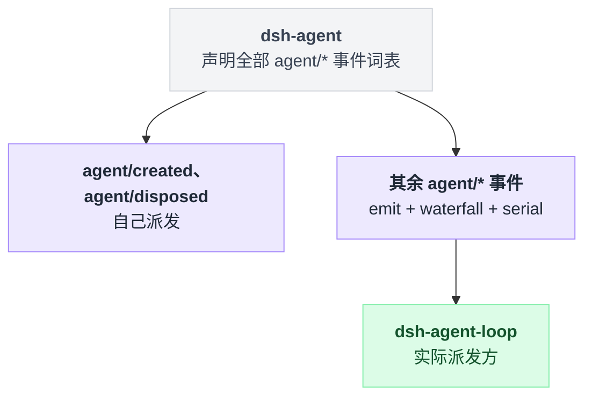

# agent

> `@deepseek-ai/dsh-agent` · bundle：`base` · 配置树 id：`agent` · v0.1.0-rc.5（commit `47f9438`）2026-08-14 核对。出处收在文末脚注。

**一句话**：Agent 句柄接口、注册表、进程内 initiator scope 和整套 `agent/*` 事件词表；它自己一行循环逻辑都没有，所以具体循环（[agent-loop](./dsh-agent-loop.md)）是可换的。

README 首段原文[^1]：

```text
Every plugin (UI, hooks, orchestrators) programs against the `Agent` handle defined here — it has zero loop dependency, so the loop is swappable.
```

这个包最容易读错的地方是它的角色：它把话全说了，事一件没干。词表在这里、拦截点在这里、注册表在这里，真正派发事件、真正跑 step 的是 agent-loop。下面几节基本都在反复确认这一条边界。

## 它在树上长什么样

```yaml
- id: agent
  name: '@deepseek-ai/dsh-agent'
```

无 `config`、无 `inject`——包里既没有 `static inject` 也没有 `export const inject`[^2]。

它是被别人 inject 的那一端：agent-loop 的 `static inject` 第一项就是 `agents`[^3]。

`web-app` 与 `headless` 两个 bundle 都没有覆盖这一行。

## 它注册了什么

一共七样，坐标收在脚注里[^4]：

| 类型 | 名字 | 说明 |
|---|---|---|
| service | `ctx.agents`（`AgentRegistry`） | 注册与获取的入口 |
| accessor | `ctx.agent` | 默认 `undefined`，每个 `Agent.ctx` 用自有属性遮蔽 |
| typert lookup + host context | `agent`（wire 字段 `agentId`，按 `SessionId` 解析） | — |
| 事件声明（emit） | `agent/created` `agent/disposed` `agent/status` `agent/inbox/inserted` `agent/inbox/claimed` `agent/inbox/discarded` `agent/session-start` `agent/error` | — |
| 事件声明（waterfall） | `agent/pre-step` `agent/request` `agent/request-error` | — |
| 事件声明（serial） | `agent/turn-stopping` | — |
| 自身监听（waterfall） | `system-prompt/assemble` + `agent/request` | `installModelSelection()` 装在单个 agent 的 scope 上 |

**声明 ≠ 派发**：本包只自己派发 `agent/created` 与 `agent/disposed`，其余 `agent/*` 全部由 agent-loop 派发[^5]。



三个 waterfall 是整台机器的拦截点，同样声明在这里、派发在 agent-loop[^6]：

- `agent/pre-step`：可以 reject 掉一个 step，也可以替换进入该 step 的消息批次。[agent-instructions](./dsh-agent-instructions.md) 就是靠它把 workspace 指令折进首个 batch 的。
- `agent/request`：`await next()` 拿到机器本来要用的 config，返回替换值即改路由。当前唯一监听方是本包自己。
- `agent/request-error`：不调 `next()` 直接返回 `{ kind: 'retry' }` 就是接管恢复；`dsh-llm-retry` 走的是这条。

后两条的写法差别，用示意代码看更省事：

```
// 改路由：先让机器算出它本来要用的 config，再替换
on('agent/request', async next => {
    const config = await next()          // 拿到默认值
    return { ...config, model: '别的' }   // 返回值即生效值
})

// 接管恢复：根本不调 next()，直接给出裁决
on('agent/request-error', async next => {
    return { kind: 'retry' }             // llm-retry 走的就是这条
})
```

`agent/turn-stopping` 是 serial，不是 waterfall——尽管 README 那段以「大多数拦截点是协作式 waterfall」开头，把它列进了同一段落里[^7]。

监听者反对的方式不是返回值，而是 `agent.steer(...)`：

```
// turn 快关了：模型不欠回复（没有在跑的工具调用，没有新的 steering）
await emit('agent/turn-stopping')        // 所有监听器跑完才提交边界

// 监听器想反对，就往 inbox 里塞东西
//     agent.steer(...)

// 机器重读 inbox
if (inbox 有新的 steering) 再走一步
else                       关掉这个 turn

// 决定权在数据，不在监听器顺序 —— 谁先跑谁后跑结果一样
```

源码注释原文[^8]：

```text
The turn is about to close: the model owes no response (no live tool calls, no fresh steering). Awaited before the boundary commits — a listener that objects steers (`agent.steer(...)`) and the machine re-reads its inbox: fresh steering runs another step, none closes the turn. Data decides, so listener order cannot change the outcome.
```

### `ctx.agents` 的面

分五组，坐标收在脚注里[^9]：

| 分组 | 方法 |
|---|---|
| 注册表 | `register(agent)` `get(id)` `list()` `roots()` `isOwnedBy(id, owner)`；进阶的 `enter(agent, owner)` / `announce(agent)` 分离插入与广播 |
| 工厂 | `setFactory(factory)`（第二次注册抛错）、`create(options)`、`resume(options)`——实现者是 agent-loop |
| initiator scope | `currentInitiator()` `requireInitiator()` `withInitiator(agent, op)` `withoutInitiator(op)` |
| 装配 | `agentEvents(ctx, agent)`、`assembleContextFor(agent)`、`installModelSelection(agentCtx, selection)` |
| 日志回读 | `foldConsumedWork(events)`：回答"日志消费掉的那份工作最后怎么样了" |

返回的 `AgentHandle` 只有两样：一个 `agent` 字段，和一个返回 promise 的 `dispose()` 方法。

disposer 是**消费者能力**——只拿到注册表条目的旁观者拆不掉这个 agent[^10]。

## 配置项

无配置项：配置总表里没有本包的条目[^11]。它的行为完全由调用方决定：谁 register、谁 setFactory、谁开 initiator 边界。

可选伴生插件 `@deepseek-ai/dsh-agent/invariant` 监听 `agent/status` 查重复转换，并注册进 `ctx.invariants`，base bundle 没有挂它[^12]。

## 模型看得见什么

README 的 Model Experience 一节明确两句[^13]：`this interface contributes no fixed prose itself`、`The package adds zero tokens itself`。

它只是把 `send`/`steer`/`inject` 的内容喂进 session；被接受的内容成为保留历史或重复的 session prefix，被拦下的内容不产生任何 request token。

KV Cache 方面：接受的历史与 steering 是 append-only；agent scope 内的注册（prompt 段、工具定义、request 监听器）不变时前缀稳定，setup 或 reload 改动它们则从第一个受影响的 token 起失效[^14]。

## 什么时候你会想换掉它 / 怎么换

基本不换——它是接口层，`ctx.agents` 被一大票插件硬 inject：agent-loop、llm-retry、goal、tool-skill、acp 等[^15]。

真要换循环实现，README 给的路子是：

```text
Replace the loop by implementing `Agent` and registering via `ctx.agents.register()`.
```

即保留本包，替掉 [agent-loop](./dsh-agent-loop.md)[^16]。

## 坑与边界

来自 README 的 Known Limitations[^17]：

- **initiator scope 是进程内的**——worker、子进程、HTTP、持久队列、重启之后必须显式重新落实身份。
- **ambient 身份可能比存活期长**——读到 initiator 不等于那个 agent 还活着，做生命周期敏感的事前仍要查 `agent.status`。
- **delegation 之外没有 agent 间通道**——共享状态、流式子输出、后台/轮询语义都在当前同步的 `ctx.subagents` 接缝之外。
- **`agent/session-start` 无法 gate 启动**——它是同步、不可否决的通知；必须在发布前跑完的异步组合要放进工厂的 `setup(agentCtx)` 事务里。
- **`cancel()` 默认清空 inbox**——`cancel(cause, { keepInbox: true })` 才只中止当前 turn；目前没有"只停 step 保住 turn"的 API。
- **一条 `UserMessage` 只带一个 `MessageSource`**——多个插件合并到同一次工具调用上的贡献会塌缩成一个来源。
- **`SessionStartSource` 预留了 `'clear'`/`'compact'` 但没有发射方**——当前只会出现 `'startup'`/`'resume'`。

读源码补充一条 README 没写的：`agent/created` 的监听器有两种失败模式，长得像但后果完全不同。

```
// 同步抛错 —— 否决发布
on('agent/created', () => { throw err })      // 这个 agent 不会被发布出去

// 返回的 Promise 拒绝 —— 只被上报
on('agent/created', async () => { throw err }) // 发布照常，错误进日志
```

写创建期监听器时要当心：想拦住发布就必须同步抛，写成 `async` 拦不住[^18]。

---

## 出处

[^1]: `packages/core/agent/README.md:5`。
[^2]: 配置树条目：`packages/bundle/base/cordis.patch.yml:58`。
[^3]: `static inject` 第一项为 `agents`：`packages/core/agent-loop/src/index.ts:297`。
[^4]: service `ctx.agents`：`src/index.ts:256`、`:267`；accessor `ctx.agent`：`src/index.ts:288`；typert lookup + host context：`src/index.ts:268`–`:281`；事件声明（emit）八个：`src/runtime-types.ts:159/168/178/186/197/205/217/290`；事件声明（waterfall）三个：`src/runtime-types.ts:231/244/260`；事件声明（serial）：`src/runtime-types.ts:278`；自身监听（waterfall）：`src/model-selection.ts:40`、`:54`。
[^5]: `agent/created` 自派：`docs/event-producer-consumer.md:12`；`agent/disposed` 自派：`:13`。
[^6]: 三个 waterfall 声明在本包、派发在 agent-loop：`docs/event-producer-consumer.md:18`–`:20`；当前唯一监听 `agent/request` 的是本包自己：`:19`；`dsh-llm-retry` 接管 `agent/request-error`：`:20`。
[^7]: `@mode serial` 声明：`src/runtime-types.ts:276`；README 原句 "Most interception points are cooperative waterfalls." 及其归类段落：`README.md:53`。
[^8]: `src/runtime-types.ts:262`–`:266`。
[^9]: 注册表：`README.md:19`–`:24`；工厂：`:41`–`:43`；initiator scope：`:30`–`:33`；装配：`:15`；日志回读：`:61`。
[^10]: disposer 是消费者能力：`README.md:45`。
[^11]: `docs/config-catalog.md` 未收录本包条目。
[^12]: 监听 `agent/status` 查重复转换：`src/invariant.ts:17`–`:23`；注册进 `ctx.invariants`：`:32`。
[^13]: `this interface contributes no fixed prose itself`：`README.md:89`；`The package adds zero tokens itself`：`:107`。
[^14]: append-only 与前缀失效条件：`README.md:97`、`:111`。
[^15]: agent-loop：`packages/core/agent-loop/src/index.ts:297`；llm-retry：`packages/llm/llm-retry/src/index.ts:21`；goal：`packages/goal/goal/src/index.ts:184`；tool-skill：`packages/skill/tool-skill/src/index.ts:25`；acp：`packages/acp/acp/src/index.ts:44`。
[^16]: `README.md:79`。
[^17]: `README.md:115`–`:121`。
[^18]: 两种失败模式的行为差异：`src/runtime-types.ts:152`–`:154`。
