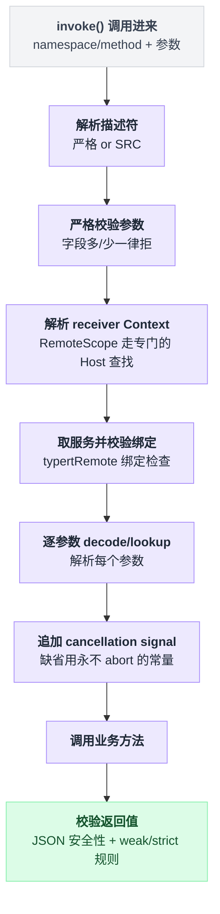

# typert-gateway

> `@deepseek-ai/dsh-api-gateway` · bundle：`base` · 配置树 id：`typert-gateway` · v0.1.0-rc.5（commit `47f9438`）2026-08-14 核对。出处收在文末脚注，可照抄代码收在附录。

**一句话**：把一次「命名空间/方法名」调用落到活着的 Cordis 服务方法上——解析描述符、校验参数、把 id 换成 Host 对象、调用、再校验返回值；传输、相关性、信封全归 `connection` 层。

包名里带着"gateway"三个字，容易让人以为它是个双向枢纽——浏览器发请求进来、Host 处理完发回去，一进一出全归它管。不是的。`base` 这一行装的只是其中一半。

## 画面一：它只装了一半，另一半在浏览器那头

README 首句把话挑明了[^1]：

> Two-sided Typert RPC endpoint for Host and Client Cordis environments. The Host entry provides `ctx.typertGateway`, while `@deepseek-ai/dsh-api-gateway/client` provides `ctx.remote`

**`base` 这一行是 Host 那一半**：它提供 `ctx.typertGateway`。另一半 `ctx.remote` 是浏览器侧入口，靠一条元数据声明自己是"客户端"，真正的装配动作发生在浏览器端 remotes 包调用挂载方法的那一刻[^2]。

这份笔记只跟 Host 这一半打交道。

## 画面二：挂树只用两行，没有配置，也没有硬连 `connection`

它是怎么长在依赖树上的？答案很朴素：`base` 的挂树配置里就两行，一个 id 一个 `name`，没有 `inject` 字段，也没有 `config` 字段[^3]（照抄见[附录 A](#a-在-bundle-树上挂上这个插件)）。

配置目录文档把它归进"无配置插件"这一类，同时注明它依赖 `typert`——这条依赖不是猜出来的，是源码里一行注入声明写死的[^4]。

注意它**没有**注入 `connection`。这不是遗漏，是设计：`connection` 对它而言是一份运行期的软依赖，有没有全看当时的环境。`web` 那棵树里单独挂着 `connection` 和 `api-remotes` 两行[^5]；没挂 `connection` 的环境里会发生什么，留到"什么时候你会想换掉它"那节再讲。

## 它注册了什么

| 类型 | 名字 | 干什么 |
|---|---|---|
| service | `ctx.typertGateway` | 继承自 Cordis 的 Service 基类，构造时把自己挂到这个名字上[^6] |
| 事件监听 | `internal/service` | 只做一件事：清掉 SRC 端点认领缓存 `srcClaims`[^7] |
| RPC 拦截器 | `connection` 的 `/api` 通道 | 在共享通道兜底之前，先拦下自己认领的端点[^8] |

没有工具、没有 prompt 段、没有命令——它不跟模型打交道，"模型看得见什么"那节会再确认一遍。

第二行值得多说一句：这条监听没有标注派发模式，按 Cordis 的规则，没标注就是 `emit`——不是 waterfall，只通知，不参与任何决策，也拦不住谁[^7]。

第三行只在 `connection` 服务活着的时候才装得上；装上之后，它拦下自己认领的端点，认领不到的落回 API Proxy 兜底[^8]。

## 画面三：一条端点归不归它管，三选一，命中即认领

拦截器装上之后，第一件事是回答一个问题：这条端点归不归我管。

```
matches(endpoint):
    段 = 按 '/' 切开 endpoint
    if 段数 != 2 或 任一段为空:                  return false   // 形状先卡掉

    if typert.local.get(endpoint) 有严格描述符:  return true    // 三选一，命中即认领
    if hasSeen(endpoint):                        return true
    if endpoint 落在 SRC 标记扫描出的集合里:      return true

    return false                                                // 落回 API Proxy
```

三个条件是并列的，任一成立就认领：本地登记着严格描述符、这个端点之前已经见过、或者它落在 SRC 标记扫描出的集合里[^9]。三条都不中，直接放弃，交给 API Proxy。

## 一次 invoke 走过的九步，任何一步失败都直接短路

一句话：解析描述符 → 校参数 → 解析 receiver → 取服务 → 解参数 → 补 signal → 调用 → 校返回值。

1. 解析描述符（严格或 SRC）
2. 严格校验参数——多一个字段、少一个非可省字段都拒
3. 解析 receiver Context，`@RemoteScope` 走专门的 Host 查找
4. 取服务并校验绑定
5. 逐参数 decode / lookup 解析
6. 有 cancellation 时把 signal 追加在业务参数之后，缺 signal 时用一个永不 abort 的常量
7. 调用
8. 校验返回值



中间任何一步失败都直接短路，不会带着半截状态往下走[^10]。

## 配置项：没有

行为不靠配置文件调，靠三样活的东西：`ctx.typert` 里当下的描述符与提供者、当前真的活着的 Cordis 服务、以及这次 `connection` 在不在。

## 模型看得见什么：不可见

README 的 Model Experience 一节说得直接[^11]：

> None, as the package dispatches application calls and registers no prompt, tool, or session event.

KV Cache 那一栏也写得干脆[^12]：

> No direct effect; invoked business Services own any model-visible result.

源码核对下来跟这两句话一致——它服务的是浏览器 UI 的 RPC，不是模型的工具调用。前面"没有工具、没有 prompt 段"说的就是这件事。

## 什么时候你会想换掉它，又该怎么换

**CLI / headless 场景本来就只用了它的一半。** 那类 profile 没有 `connection` 服务，负责装拦截器的那段注入回调永远不会执行，`/api` 拦截器根本装不上，只剩同一个进程内部直接调用 `ctx.typertGateway.invoke()`。这不需要你改任何配置——画面二埋的那个伏笔，到这里兑现。

**想换错误映射或鉴权** → 换不了，那些逻辑在 `connection` 层，不在这个包里。信任级别是写死在这行代码里的常量，`connection` 会在 HTTP 桥之前统一做信任校验[^13]。

**想换 lookup 解析策略**（比如禁掉冷会话自动恢复）→ 去 [typert](./dsh-typert-registry.md) 的 `lookups.configure(key, resolver)`，不要动这个包。解析器可以携带一个已有的 RPC 错误码原样透传出去[^14]。

**想让端点更严格** → 让包产出严格产物并由 [typert-loader](./dsh-typert-loader.md) 注册；SRC 只是从源码跑时的开发兜底，不是长期方案。

## 源码读完才看得出的坑

README 的 Known Limitations 列了七条[^15]：

| 限制 | 具体表现 |
|---|---|
| 错误细节被压平 | `connection` 适配器把普通派发失败与业务异常一律压成 RPC 的 `internal` 错误且 details 为空，结构化的 `TypertGatewayError` 分类只有同进程调用方看得到 |
| SRC 参数形态 | 只支持无解构、无默认值、无 rest 的唯一标识符参数 |
| SRC 校验深度 | 只校验 JSON 安全性，从不推断可选字段 |
| Client face | 只能挂严格 contribution |
| 方法形态 | 只支持一元方法，增量 Session 数据走另一套流式协议 |
| lookup 粒度 | 策略按 key 配置，单个参数或端点无法单独选择 live-only |
| 事件转发 | 转发事件到 `$on` 不做投影或脱敏，也不在重连后重放 |

### 错误码有 17 个，过了边界只剩 3 种

错误码本身有 17 个[^16]，但过了 RPC 边界，浏览器能看到的只剩三种形态。

| 边界外形态 | 触发条件 |
|---|---|
| `cancelled` | 业务在 signal abort 后抛错 |
| `TypertLookupFailure` | 原样透传 |
| `internal`（details 为空） | 其余一律 |


排查时该看 Host 日志——浏览器拿到的码已经被压平，看不出原因[^17]。

### 严格定义撤销后不会退化成 SRC

已经见过的端点一旦撤销严格定义，会直接抛 `definition-unavailable` 拒绝，而不是悄悄退回宽松的 SRC 校验[^18]。README 的说法是：撤销一个已观测到的严格定义会失败，而不是放松校验。热卸载一个包，不会顺带放松安全线。

### SRC 靠函数签名的字符串形式抠参数名，这里藏着一个连锁反应

SRC 没有类型信息可用，只能把函数转成字符串去抠参数名[^19]，所以只接受唯一标识符形参——解构、默认值、rest、重名，一律抛 `signature-invalid`[^19]。

容易看漏的连锁反应在这：非 lookup 参数在传输时用的字段名，**就是**这个形参名本身[^20]。所以压缩或转译工具改了参数名，不会在注册这一步触发拒绝——注册时签名照样合法——而是让调用方传来的 `args` 对不上号，等到真正调用时才抛 `arguments-invalid`。报错的地方和真正出问题的地方隔了一层，排查时容易被绕进去。

同一个端点被两个活着的服务同时导出，会抛 `ambiguous-endpoint`[^21]。

### 返回值也要过 JSON 安全检查

非有限数、循环引用、稀疏数组、带 symbol 属性的对象、非 plain 原型的对象，全部判 `result-invalid`[^22]。业务方法如果直接返回一个类实例，会在这道边界上炸掉，而不是被悄悄序列化成什么都不像的东西。

### `undefined` 的规则不对称

```
if 返回值 is undefined:
    if 描述符是 weak:    当成 void，直接返回
    if 描述符是 strict:  必须是声明过的结果，否则拒
```

宽松描述符对 `undefined` 睁一只眼闭一只眼，严格描述符不给这个通融[^23]。

每次调用都会重新解析描述符、重新拿一次服务，不缓存业务对象——这是热重载安全要付的代价，也是它明确的设计意图[^24]。

## 把这一章串起来

- **它只是两半里的一半**——`base` 装的是 Host 端 `ctx.typertGateway`，浏览器端 `ctx.remote` 由 client 包另行装配，这是画面一立住的第一条；
- **没注入 `connection` 是故意留的软依赖**——画面二埋的伏笔，兑现在"什么时候你会想换掉它"：CLI/headless 环境里拦截器那段代码根本执行不到，什么都不用改；
- **认领端点靠三选一，不是靠猜**——本地严格描述符、之前见过、SRC 扫描命中，三条并列，一条都不中就交给 API Proxy；
- **invoke 九步里任何一步失败都直接短路**——不会带着半截状态往下传，这也是为什么返回值最后还要单独过一道 JSON 安全检查；
- **它对模型不可见**——README 的两句原话和源码核对一致，这个包服务的是浏览器 UI，不是工具调用；
- **17 种错误码过了边界只剩 3 种**——排查问题该看 Host 日志，浏览器端的 `internal` 已经把细节压平了；
- **严格定义撤销不会退化成宽松校验**——热卸载一个包不会悄悄放松安全线；
- **wire 字段名就是形参名这条最容易绕进去**——报错指向调用参数，真凶其实是被压缩工具重命名过的形参。

想换错误映射、鉴权、lookup 策略，记住它们分别归谁管：前两个在 `connection` 层换不了，第三个去 typert 那边配置——这个包本身，能调的只有它产出的端点严不严格。

---

## 附录：可以照抄的模板

### A. 在 bundle 树上挂上这个插件

```yaml
# packages/bundle/base/cordis.patch.yml:36
    - id: typert-gateway
      name: '@deepseek-ai/dsh-api-gateway'
```

没有 `inject`，也没有 `config`。

---

## 出处

[^1]: README 首句：`packages/api/gateway/README.md:5`。
[^2]: `dsh.client` 元数据声明：`packages/api/gateway/package.json:36`；浏览器端 `$mount()` 装配点：`packages/api/remotes/src/client/index.ts:111`。
[^3]: 挂树的两行：`packages/bundle/base/cordis.patch.yml:36`。
[^4]: `docs/config-catalog.md:3029` 把它列进无配置插件并注明 requires typert；这条 requires 来自 `static inject = ['typert']`（`packages/api/gateway/src/index.ts:91`）。
[^5]: web 树里的 connection、api-remotes 两行：`packages/bundle/web-app/cordis.patch.yml:156`、`:165`。
[^6]: `TypertGatewayService extends Service`，构造时 `super(ctx, 'typertGateway')`：`packages/api/gateway/src/index.ts:90`、`:100`。
[^7]: `internal/service` 监听清缓存：`packages/api/gateway/src/index.ts:101`。该事件无 `@mode` 标注即 emit：`vendor/cordis/src/events.ts:341`，派发点：`vendor/cordis/src/reflect.ts:333`。
[^8]: RPC 拦截器装配：`ctx.inject(['connection'], ...)` 里调用 `connection.rpc.intercept`，`authority` 传 `'trusted-host'`：`packages/api/gateway/src/index.ts:104`–`:110`。`intercept` 在共享 `/api` 通道 fallback 之前拦截自己认领的端点：`packages/client/connection/src/rpc.ts:40`、`:47`；认领不到的落回 API Proxy：`docs/api-gateway.md:123`。
[^9]: `matches()` 实现：`packages/api/gateway/src/index.ts:114`；后两条判定分别在 `:117`、`:122`。
[^10]: `invoke()` 本体：`packages/api/gateway/src/index.ts:145`；严格校验参数（`assertExactArguments`）`:148`、`:586`；receiver 解析 `:359`，Host 查找（`contexts.getHost`）`:366`；服务与绑定校验 `:158`、`:495`；参数解析 `:407`；cancellation `:161`，常量 signal `:41`；返回值校验 `:183`。
[^11]: Model Experience 原文：`packages/api/gateway/README.md:29`。
[^12]: KV Cache effect 原文：`packages/api/gateway/README.md:33`。
[^13]: 信任级别常量：`packages/api/gateway/src/index.ts:109`；connection 在 HTTP 桥之前统一信任校验：`docs/api-gateway.md:123`。
[^14]: lookup 解析器配置入口见 [typert](./dsh-typert-registry.md)；携带已有 RPC 错误码原样透传：`packages/api/gateway/README.md:13`，源码 `packages/api/gateway/src/index.ts:478`。
[^15]: Known Limitations：`packages/api/gateway/README.md:35`。
[^16]: 错误码共 17 个：`docs/subsystems/typert.md:158`。
[^17]: 三种边界外形态：`cancelled` `packages/api/gateway/src/index.ts:176`、`:472`；`TypertLookupFailure` 原样透传 `:478`；`internal` 且 details 为空 `:481`。
[^18]: `hasSeen` 命中抛 `definition-unavailable`：`packages/api/gateway/src/index.ts:227`；README 原话见 `packages/api/gateway/README.md:11`。
[^19]: 靠 `Function.prototype.toString()` 抠参数名，只接受唯一标识符形参：`packages/api/gateway/src/index.ts:562`；解构/默认值/rest/重名一律抛 `signature-invalid`：`:578`。
[^20]: wire 字段名即形参名：`:300`；改名导致调用方参数对不上，落到 `arguments-invalid`：`:611`。
[^21]: 同一端点两个活服务导出抛 `ambiguous-endpoint`：`:256`。
[^22]: 返回值 JSON 安全检查：`packages/api/gateway/src/index.ts:640`。
[^23]: `undefined` 不对称规则实现：`packages/api/gateway/src/index.ts:182`。
[^24]: 每次调用重新解析、不缓存业务对象：`docs/api-gateway.md:125`。
