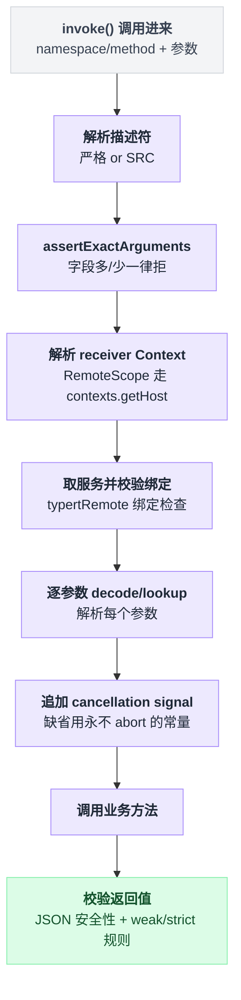
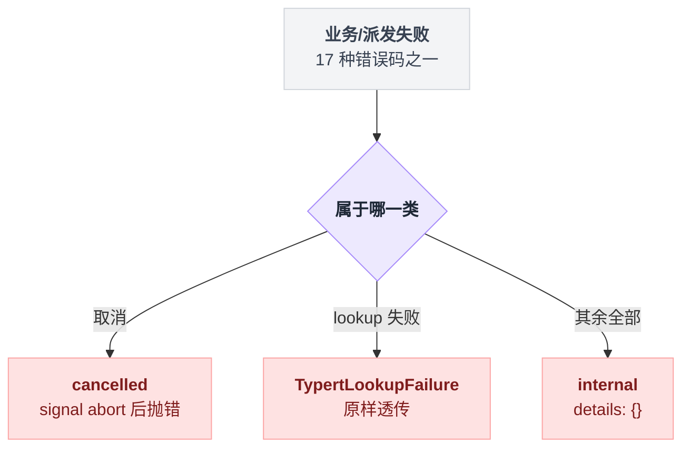

# typert-gateway

> `@deepseek-ai/dsh-api-gateway` · bundle：`base` · 配置树 id：`typert-gateway` · v0.1.0-rc.5（commit `47f9438`）2026-08-14 核对

**一句话**：把一次 `<namespace>/<method>` 调用落到活着的 Cordis 服务方法上——解析描述符、校验参数、把 id 换成 Host 对象、调用、再校验返回值；传输、相关性、信封全归 Connection。

这个包是两半的。README 首句写得很清楚：

> Two-sided Typert RPC endpoint for Host and Client Cordis environments. The Host entry provides `ctx.typertGateway`, while `@deepseek-ai/dsh-api-gateway/client` provides `ctx.remote`

**base 这一行装的是 Host 那一半**。另一半 `ctx.remote` 是浏览器侧入口，由 `dsh.client` 元数据声明，contribution 由 api-remotes 的 client 面调 `$mount()` 装配。

出处：README 首句见 `packages/api/gateway/README.md:5`；`dsh.client` 元数据见 `packages/api/gateway/package.json:36`；`$mount()` 装配见 `packages/api/remotes/src/client/index.ts:111`。

## 它在树上长什么样

`packages/bundle/base/cordis.patch.yml:36`：

```yaml
    - id: typert-gateway
      name: '@deepseek-ai/dsh-api-gateway'
```

两行，没有 `inject`，也没有 `config`。`docs/config-catalog.md:3029` 把它列在无配置插件里，并注明 `requires typert`——这个 requires 来自 `static inject = ['typert']`（`packages/api/gateway/src/index.ts:91`）。

注意它**没有**注入 `connection`。那是运行期的软依赖，下面会讲这个设计带来什么。web 树里的 `connection` / `api-remotes` 两行在 `packages/bundle/web-app/cordis.patch.yml:156`、`:165`。

## 它注册了什么

| 类型 | 名字 | 说明 |
|---|---|---|
| service | `ctx.typertGateway` | `TypertGatewayService extends Service`，`super(ctx, 'typertGateway')`（`packages/api/gateway/src/index.ts:90`、`:100`） |
| 事件监听 | `internal/service`（**emit**） | 只做一件事：清掉 SRC 端点认领缓存 `srcClaims`（`packages/api/gateway/src/index.ts:101`）。cordis 里该事件无 `@mode` 标注即 emit（`vendor/cordis/src/events.ts:341`），派发点 `vendor/cordis/src/reflect.ts:333`——**不是 waterfall，不参与任何决策** |
| RPC 拦截器 | Connection `/api` 通道 | `ctx.inject(['connection'], ...)` 里调 `connection.rpc.intercept('/api', matches, handler, { authority: 'trusted-host' })`（`packages/api/gateway/src/index.ts:104`–`:110`）。`intercept` 的语义是在共享 `/api` 通道的 fallback 之前拦下自己认领的端点（`packages/client/connection/src/rpc.ts:40`、`:47`），认领不到的落回 API Proxy（`docs/api-gateway.md:123`） |

没有工具、没有 prompt 段、没有命令。

### 什么样的端点算"我的"

拦截器要先回答一个问题：这条端点归不归我管。

```
matches(endpoint):
    段 = 按 '/' 切开 endpoint
    if 段数 != 2 或 任一段为空:                  return false   // 形状先卡掉

    if typert.local.get(endpoint) 有严格描述符:  return true    // 三选一，命中即认领
    if hasSeen(endpoint):                        return true
    if endpoint 落在 SRC 标记扫描出的集合里:      return true

    return false                                                // 落回 API Proxy
```

三个条件是并列的，任一成立就认领。实现在 `packages/api/gateway/src/index.ts:114`，后两条的判定分别在 `:117`、`:122`。

### 一次 invoke 走过的九步

一句话：解析描述符 → 校参数 → 解析 receiver → 取服务 → 解参数 → 补 signal → 调用 → 校返回值。中间任何一步失败都直接短路，不会带着半截状态往下走。

1. 解析描述符（严格或 SRC）
2. `assertExactArguments`——多一个字段、少一个非可省字段都拒
3. 解析 receiver Context，`@RemoteScope` 走 `contexts.getHost`
4. 取服务并校验 `typertRemote` 绑定
5. 逐参数 decode / lookup 解析
6. 有 `cancellation` 时把 signal 追加在业务参数之后，缺 signal 时用一个永不 abort 的常量
7. 调用
8. 校验返回值

出处：`invoke()` 本体 `packages/api/gateway/src/index.ts:145`；`assertExactArguments` `:148`、`:586`；receiver 解析 `:359`、`getHost` `:366`；服务与绑定校验 `:158`、`:495`；参数解析 `:407`；cancellation `:161`、常量 signal `:41`；返回值校验 `:183`。



## 配置项

无配置项。

行为由三样东西决定：`ctx.typert` 里的描述符与提供者、当前活着的 Cordis 服务、以及 `connection` 是否存在。

## 模型看得见什么

README 的 Model Experience（`packages/api/gateway/README.md:29`）：

> None, as the package dispatches application calls and registers no prompt, tool, or session event.

KV Cache effect：“No direct effect; invoked business Services own any model-visible result.”（`packages/api/gateway/README.md:33`）

源码核对一致——它服务的是浏览器 UI 的 RPC，不是模型的工具调用。

## 什么时候你会想换掉它 / 怎么换

**CLI / headless 场景本来就只用了它的一半。** 那些 profile 没有 `connection` 服务，`ctx.inject(['connection'], ...)` 的回调永不执行，`/api` 拦截器不装，只剩同进程直调 `ctx.typertGateway.invoke()`。你无需为此改配置。

**想换错误映射或鉴权** → 换不了，那些在 Connection 层。`authority: 'trusted-host'` 是这行代码写死的常量（`packages/api/gateway/src/index.ts:109`），Connection 在 HTTP 桥之前做统一信任校验（`docs/api-gateway.md:123`）。

**想换 lookup 解析策略**（比如禁掉冷会话自动恢复）→ 去 [typert](./dsh-typert-registry.md) 的 `lookups.configure(key, resolver)`，不要动 Gateway。解析器可以用 `TypertLookupFailure` 携带一个已有的 RPC 错误码原样透传（`packages/api/gateway/README.md:13`、源码 `packages/api/gateway/src/index.ts:478`）。

**想让端点更严格** → 让包产出严格产物，由 [typert-loader](./dsh-typert-loader.md) 注册；SRC 只是从源码跑时的开发兜底。

## 坑与边界

README 的 Known Limitations（`packages/api/gateway/README.md:35`）要点：

| 限制 | 具体表现 |
|---|---|
| 错误细节被压平 | Connection 适配器把普通派发失败与业务异常一律压成 RPC `internal` 且 details 为空，结构化的 `TypertGatewayError` 分类只有同进程调用方看得到 |
| SRC 参数形态 | 只支持无解构、无默认值、无 rest 的唯一标识符参数 |
| SRC 校验深度 | 只校验 JSON 安全性，从不推断可选字段 |
| Client face | 只能挂严格 contribution |
| 方法形态 | 只支持一元方法，增量 Session 数据走另一套流式协议 |
| lookup 粒度 | 策略按 key 配置，单个参数或端点无法单独选择 live-only |
| 事件转发 | 转发事件到 `$on` 不做投影或脱敏，也不在重连后重放 |

读源码补充：

**错误码有 17 个**（`docs/subsystems/typert.md:158`），但过了 RPC 边界只剩三种形态：

| 边界外形态 | 触发条件 | 行号 |
|---|---|---|
| `cancelled` | 业务在 signal abort 后抛错 | `packages/api/gateway/src/index.ts:176`、`:472` |
| `TypertLookupFailure` | 原样透传 | `:478` |
| `internal`，`details: {}` | 其余一律 | `:481` |

排查时看 host 日志，别看浏览器拿到的码。



**严格定义撤销后不会退化成 SRC。** `hasSeen` 命中就抛 `definition-unavailable`（`packages/api/gateway/src/index.ts:227`），README 的说法是 “Withdrawing an observed strict definition fails instead of weakening validation.”（`packages/api/gateway/README.md:11`）。热卸载一个包不会悄悄放松校验。

**SRC 靠 `Function.prototype.toString()` 抠参数名**（`packages/api/gateway/src/index.ts:562`）：只接受唯一标识符形参，解构、默认值、rest、重名一律抛 `signature-invalid`（`:578`）。

这里有个连锁反应容易看漏：非 lookup 参数的 wire 字段名**就是**形参名（`:300`），所以压缩/转译改名不会触发 `signature-invalid`，而是让调用方的 `args` 对不上，落到 `arguments-invalid`（`:611`）。报错码指向的地方和真凶隔了一层。

同一端点被两个活服务导出则抛 `ambiguous-endpoint`（`:256`）。

**返回值也要过 JSON 安全检查**：非有限数、循环引用、稀疏数组、带 symbol 属性的对象、非 plain 原型对象全部判 `result-invalid`（`packages/api/gateway/src/index.ts:640`）。业务方法返回一个类实例会在边界上炸，而不是被静默序列化。

**`undefined` 的规则不对称**：

```
if 返回值 is undefined:
    if 描述符是 weak:    当成 void，直接返回
    if 描述符是 strict:  必须是声明过的结果，否则拒
```

实现在 `packages/api/gateway/src/index.ts:182`。

每次调用都重新解析描述符与服务，不缓存业务对象（`docs/api-gateway.md:125`）——这是热重载安全的代价，也是它的设计意图。
