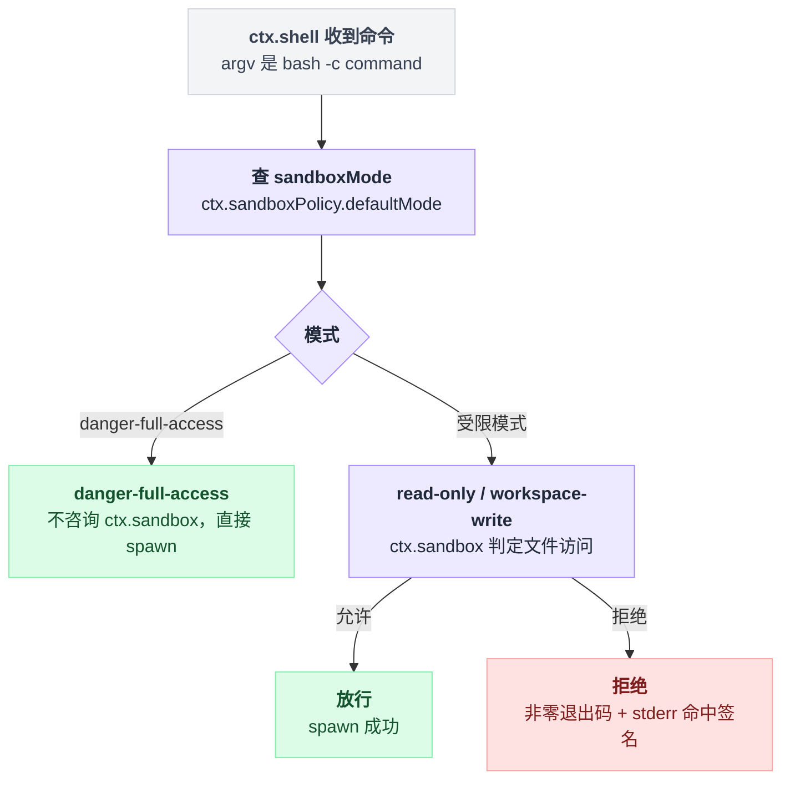

# bash-sandbox

> `@deepseek-ai/dsh-bash-sandbox` · bundle：`base` · 配置树 id：`bash-sandbox` · v0.1.0-rc.5（commit `47f9438`）2026-08-14 核对，出处收在文末脚注。

**一句话**：默认组合里 `ctx.shell` 的真正提供者——它继承本地 bash 执行器的全部进程机制，把每条命令拼成的 `bash -c` argv 交给 `ctx.sandbox` 包一层限制再 spawn，并把「用了哪个模式、有没有被拒、限制是否完整」当作结果事实盖回去。

## 它在树上长什么样

```yaml
- id: bash-sandbox
  name: '@deepseek-ai/dsh-bash-sandbox'
  disabled: !!js process.platform === 'win32'
  config:
    timeoutMs: 60000
```

有个地方第一眼容易读错：配置树 id 是 `bash-sandbox`，但它注册的服务名是 `ctx.shell`。[^1]

也就是说，这一行**就是**默认组合里 `ctx.shell` 的实现，不存在「先挂 bash-local 再叠沙箱」的写法。README 原文说得很直白："Load it **instead of** `@deepseek-ai/dsh-bash-local`"[^2]。

注入清单写在类上[^3]：

```
static override inject = ['subprocess', 'sandbox', 'sandboxPolicy']
```

这三个依赖在 base 里各有提供者：`subprocess` 来自 [subprocess-local](./dsh-subprocess-local.md)，`sandbox` 来自 `@deepseek-ai/dsh-sandbox-local`，`sandboxPolicy` 来自 `@deepseek-ai/dsh-sandbox-policy`[^4]。

## 它注册了什么

| 类型 | 名字 | 说明 |
|---|---|---|
| service | `ctx.shell` | 由基类 `ShellExecutor` 以 `'shell'` 为服务名调用父类完成注册[^5]；一个 context 只允许一个实现，挂第二个会抛[^6] |
| 事件监听 | 无 | 它是接缝实现，不监听任何事件；升权审批发生在工具层 |

覆写的方法有五个：`sandboxMode` getter[^7]（返回 `ctx.sandboxPolicy.defaultMode`，工具层据此决定要不要公开升权字段）、`resolve()`[^8]（把完整 per-call policy 盖到 spec 上）、`run()`、`start()`、`onProcessDone()`。

## 配置项

它**没有自己的配置**：`Config` 类型直接复用 `@deepseek-ai/dsh-bash-local` 的定义[^9]，逐字继承下面这些字段[^10]：

| 字段 | 类型 | 默认值 | 作用 |
|---|---|---|---|
| `cwd` | string | 无（回落 `process.cwd()`） | 命令默认工作目录 |
| `timeoutMs` | number | `120000`（base 覆写为 `60000`） | 前台默认超时 |
| `maxTimeoutMs` | number | `600000` | 逐调用超时覆写的上限 |
| `maxOutputBytes` | number | `64000` | 每条流的内存输出上限，溢出转 spill 文件 |
| `maxSpillBytes` | number | `64 * 1024 * 1024` | 每条流的 spill 文件上限，超过则只保留内存尾部 |
| `graceMs` | number | `3000` | SIGTERM→SIGKILL 的升级宽限，不得超过 `MAX_TIMER_DELAY_MS` |

**沙箱模式与 workspace root 不在这里**，它们归 `ctx.sandboxPolicy`[^11]。base 里 `sandbox-policy` 那一行把 mode 默认成 `workspace-write`（可被环境变量 `DSH_PERMISSION_MODE` 覆盖），workspaceRoot 默认成进程当前目录[^12]。

## 三档模式的文件效果

| Mode | File effects |
|---|---|
| `read-only` | 任何位置都不可写；`/dev` 里只有 `/dev/null` 可写，所以 `>/dev/null` 照常工作 |
| `workspace-write` | 只能写 `workspaceRoot` + `/tmp`（bwrap 下是临时的，Landlock 下是宿主 `/tmp`，Seatbelt 下是 `/private/tmp` 加每用户 temp 目录） |
| `danger-full-access` | 完全不限制，**根本不咨询 provider**；前台结果带上沙箱事实字段（`mode` 与 `denied`，`denied` 为 `false`），后台句柄不带沙箱事实 |

这张表出自 README[^13]，它把 `read-only` 标为 default——那是包自身文档的口径；**base bundle 实际默认是 `workspace-write`**，见上一节的 `sandbox-policy` 行。

代码里的分岔很浅，`danger-full-access` 是 `run()` / `start()` 的第一个分支，直接走 `super`[^14]：

```
if mode == 'danger-full-access':
    return super.run(argv)        // 连 ctx.sandbox 都不碰
else:
    argv = ctx.sandbox 包一层(argv, mode)
    spawn(argv)
```

一条命令从进来到落地按模式分岔：



## 模型看得见什么

这个包**不注册任何工具或 prompt 段**，全部经 [tool-bash](./dsh-tool-bash.md) 间接可见。

因为它报告了一个会限制的 `sandboxMode`，`bash` schema 上才长出 `sandbox_permissions`（枚举 `workspace-write` | `danger-full-access`）与 `justification`[^15]。

结果尾部会精确追加哪一行，取决于出了什么事[^16]：

| 情况 | 追加的文本 |
|---|---|
| 被拒 | `[sandbox: file access denied under <mode> mode]` |
| 升权可用 | 在上一条之后再追加 `[sandbox: escalation available — retry this exact command once with sandbox_permissions (the narrowest wider mode that suffices) + justification; the approval prompt asks the user]` |
| 后台 runner 失败 | `[sandbox: the sandbox runner itself failed under <mode> mode — the command did not run; this is a sandbox problem, not a command failure]` |

受限模式下无可用 runner 时抛 `SANDBOX_UNAVAILABLE`[^17]。

## 什么时候你会想换掉它 / 怎么换

- **要彻底不限制**：不建议改这一行，而是把 `sandbox-policy` 的 `mode` 设成 `danger-full-access`（或设环境变量 `DSH_PERMISSION_MODE`），此时 provider 根本不被调用。
- **要裸执行器**：把这一行的 `name` 换成 `@deepseek-ai/dsh-bash-local`。工具层会发现 `ctx.shell.sandboxMode` 为 undefined，自动不公开升权字段——不需要换工具插件。
- **要换限制后端**（bwrap / Landlock / Seatbelt 的选择）：那是 `ctx.sandbox` provider 的配置（base 里的 `sandbox` 行，字段如 `runnerCommand`[^18]），不是这个包的。

## 坑与边界

**只管文件效果。** 网络与进程可见性完全不受限，这套模式词汇不假装自己是通用安全沙箱[^19]。

**「被拒绝」不是后端告诉它的，是它从失败命令的 stderr 里猜出来的。** 判据只有两条：

```
denied = (退出码 != 0) and (stderr 大小写不敏感命中后端签名)
```

靠签名做可移植推断的代价是双向的：一个恰好匹配签名的应用错误会被误判为拒绝，而被截断、丢掉了那行拒绝信息的输出则会被漏判[^20]。

**后台 runner 失败没有即时错误通道。** 它记在已结算进程上，等调用方 `job_output` 才浮现；只有同步抛出、且能指认 runner 路径的 `SubprocessRuntime` 错误才会让 `start()` 立即失败[^21]。

**runner 归因写得非常保守**，任何一条不满足就退回普通命令启动失败语义[^22]：

| 条件 | 要求 |
|---|---|
| 错误码 | 必须是 `ENOENT` 或 `EACCES` |
| 调用方 workdir | 必须自己独立可用 |
| 有 `error.path` 时 | path 必须精确等于 provider argv[0]，且 `syscall` 是 `spawn` 或 `spawn <runner>` |
| 无 `error.path` 时 | `syscall` 必须精确等于 `spawn <runner>` |

**`danger-full-access` 是刻意绕开 `ctx.sandbox` 的。** 它是「明确的不限制模式」，不是「更宽的沙箱档位」[^23]。

## 相关

[tool-bash](./dsh-tool-bash.md) 是它唯一的模型侧消费者，也是升权审批的持有者——本包 deny-only，从不自己谈判权限[^24]。

进程组、输出收集、spill、凭据擦洗全部来自 [subprocess-local](./dsh-subprocess-local.md)；Windows 那侧的孪生体是 [pwsh-sandbox](./dsh-pwsh-sandbox.md)。

---

## 出处

[^1]: 配置树上这一行：`packages/bundle/base/cordis.patch.yml:178-182`。
[^2]: README "instead of" 原文：`README.md:5`。
[^3]: inject 清单定义：`packages/shell/bash-sandbox/src/index.ts:45`。
[^4]: 三个提供者依次登记于 `cordis.patch.yml:163-164`、`169-170`、`172-176`。
[^5]: `super(ctx, 'shell')` 注册调用：`packages/shell/shell/src/index.ts:67`。
[^6]: 单实现限制的报错位置：`docs/subsystems/shell.md:235`。
[^7]: `sandboxMode` getter 实现：`src/index.ts:71, 75-77`。
[^8]: `resolve()` 实现：`src/index.ts:84-86`。
[^9]: `Config` 类型别名定义：`src/index.ts:35`。
[^10]: 字段定义与默认值来源：`packages/shell/bash-local/src/index.ts:105-112`（`DEFAULT_GRACE_MS` 在 35 行、`DEFAULT_MAX_SPILL_BYTES` 在 38 行、`graceMs` 上界校验在 90-92 行）。
[^11]: `ctx.sandboxPolicy` 归属定义：`src/index.ts:29-34`。
[^12]: base 里 `sandbox-policy` 该行配置：`cordis.patch.yml:172-176`。
[^13]: 三档模式文件效果表：`README.md:11-15`。
[^14]: 模式分岔逻辑实现：`src/index.ts:91-94, 119`。
[^15]: schema 扩展说明：`README.md:45`。
[^16]: 三条追加文本出自 `README.md:59`；前两条的构造函数在 `packages/sandbox/sandbox/src/escalation.ts:71-73, 84-86`。
[^17]: `SANDBOX_UNAVAILABLE` 抛出位置：`src/index.ts:103, 111`；错误码常量定义：`packages/sandbox/sandbox/src/index.ts:124`。
[^18]: 配置目录条目：`docs/config-catalog.md:1466`。
[^19]: README 边界声明：`README.md:85`。
[^20]: README 边界声明：`README.md:86`；判据实现：`src/helpers.ts:67-69, 112-116`。
[^21]: README 说明：`README.md:87`；实现：`src/index.ts:129-133`。
[^22]: 归因判据实现：`packages/shell/bash-sandbox/src/helpers.ts:39-53`；README 对应说明：`README.md:20`。
[^23]: README 说明：`README.md:88`。
[^24]: README 说明：`README.md:25`。
