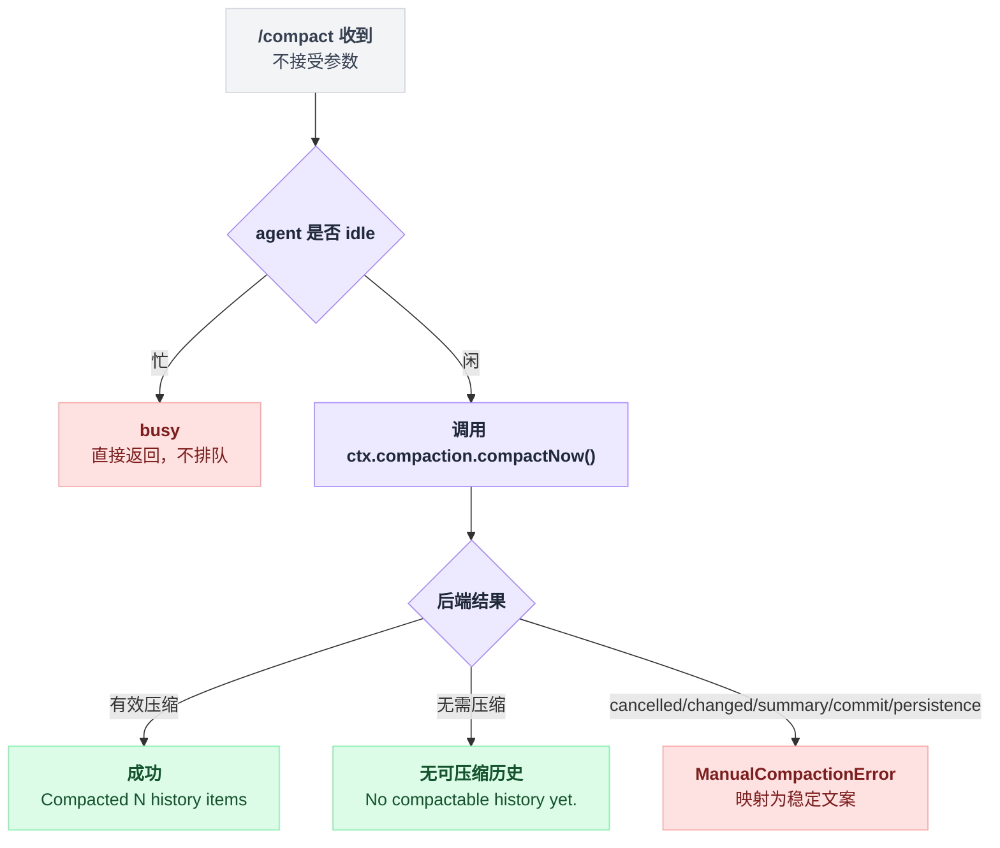

# command-compact

> `@deepseek-ai/dsh-command-compact` · bundle：`base` · 配置树 id：`command-compact` · v0.1.0-rc.5（commit `47f9438`）2026-08-14 核对

> ⚠️ **本篇未通过对抗式引用核验**：起草已完成，但逐条打开源码比对行号/字段名/英文引文的那一遍因会话额度耗尽未执行。文中 `path:line` 与配置字段请以源码为准，核验后本行会被移除。

**一句话**：把 `/compact` 这个人类命令接到 `ctx.compaction.compactNow()` 上——在自动阈值之下也强制做一次有用的压缩，不占用一次模型 turn。

## 它在树上长什么样

```yaml
    # Human `/compact`: one useful reduction below the automatic threshold. Backend
    # independent, so it follows whichever compaction service this leaf mounts.
    - id: command-compact
      name: '@deepseek-ai/dsh-command-compact'
```

四行，没有 `config`——这个插件根本不导出 `Config`。

web profile 里它是关掉的：`disabled: true`。

出处：树上这段见 `packages/bundle/base/cordis.patch.yml:287-290`；web profile 的开关见 `packages/bundle/web-app/cordis.patch.yml:361-362`。

## 它注册了什么

| 类型 | 名字 | 说明 |
|---|---|---|
| 命令 | `compact` | `ctx.commands.register({ name: 'compact', description: 'Compact older conversation history', handler })` |
| inject | `commands`、`compaction` | `export const inject = ['commands', 'compaction']` |
| 会话事件 | `command/run` / `command/done` | 由命令执行器写入的 log-only 配对，都不进模型历史；成功时 `command/done.sourceEventSeq` 指向本次事务的 `compaction/summary` |

出处：命令注册见 `packages/compaction/command-compact/src/index.ts:100-104`，inject 见同文件 `:11`。

**没有 service、没有事件监听、没有工具、没有 prompt 段。**

它注册的只有一条命令。所以只有组合了命令适配器的界面才用得上它；纯自动化界面这边一片空白，只剩自动压缩。

## 配置项

无配置项。行为完全由两件事决定：

1. 它注入的那个压缩后端的策略——base 里是 [compaction-basic](./dsh-compaction-basic.md)；
2. 命令本身不接受任何参数。

## 命令契约

从收到 `/compact` 到给出结果，中间是一道 idle 门加一次后端结果映射：



写成伪代码就是三层过滤，一层比一层深：

```
handler(参数):
    if 参数非空:                    // 连后端都不碰
        return "Usage: /compact (no arguments)"
    if agent 不 idle:               // 不排队，当场回绝
        return busy 文案
    结果 = ctx.compaction.compactNow(agent, signal)
    if 结果是有效压缩:  return "Compacted N history items (~M tokens)."
    if 无可压缩历史:    return "No compactable history yet."
    if 结果是 ManualCompactionError:  return 按 code 查表得到的固定文案
    // 其余的实现失败不翻译，直接让 dispatch 失败
```

三种输入对应三种结果：

| 输入 | 结果 |
|---|---|
| `/compact` | 压缩一段平衡的较早历史，成功后报告替换掉的条目数与估算 token：`Compacted N history items (~M tokens).` |
| `/compact`（无可压缩历史） | `No compactable history yet.`，不写 marker、不改 surface |
| `/compact <任何参数>` | `Usage: /compact (no arguments)`，压根不调后端 |

预期内的 `ManualCompactionError` 会被翻译成稳定的直接错误文案：

| code | 直接结果 |
|---|---|
| `busy` | `Compaction is unavailable because this process has an active compaction, or the agent is not idle.` |
| `cancelled` | `Compaction cancelled.` |
| `changed` | `The history selected for compaction changed before it could be replaced. The conversation is unchanged; the attempt is recorded in the session log.` |
| `summary` | `Compaction could not produce a useful summary. The conversation is unchanged; the attempt is recorded in the session log.` |
| `commit` | `Compaction did not finish cleanly; some session history may have changed. Inspect the current session state before retrying.` |
| `persistence` | `Compaction finished, but the session could not be saved.` |

这些 code 不是命令自己编的，是后端的区域事务分类产生的。非预期的实现失败则不做翻译，直接让 dispatch 失败。

出处：文案映射见 `packages/compaction/command-compact/src/index.ts:23-55`；code 的产地见 `packages/compaction/compaction-basic/src/region.ts:256-277`、`:244-250`。

## 模型看得见什么

斜杠输入和直接结果**都不进模型请求**。

模型唯一感知到的是压缩本身：一次被接受的 `/compact` 会在一个独立的 `compaction/* { turn: null }` 括号里，用后端的 user-role 检查点替换掉较早的一段。

命令生命周期本身不加任何模型 token；摘要调用是后端的一次辅助请求。

## 什么时候你会想换掉它 / 怎么换

- **不想让人手动压缩**：`disabled: true`，自动压缩不受影响。
- **换后端**：不需要动这一行。它只依赖 `compactNow(agent, signal)`，README 明说 "The command is backend-independent"，挂哪个 `ctx.compaction` 实现它就跟哪个。
- **想要按范围压缩**：命令层面没有，显式范围只有程序化的 `compactRegion()` 路径。

想改的其实往往是压缩策略本身——那是 [compaction-basic](./dsh-compaction-basic.md) 的 `config`，不是这一行。

## 坑与边界

- **只在 idle 时可用**：有 turn 或已被接受的唤醒 prompt 抢在前面时返回 `busy`，命令本身不排队。
- **不接受任何参数**：这是为了在各种命令适配器之间保持行为稳定。
- **只有命令适配器能调**：没有 `ctx.commands` 的界面只能靠自动压力压缩。

busy 判定是进程内的，而且它会挑 marker 的新旧：

```
for marker in 活的未配对 marker:
    if marker 比最新的 session/end-seed 更老:
        continue        // 上一个生命周期留下的陈旧证据，不挡
    return busy
```

见 `packages/compaction/compaction-basic/src/region.ts:288-296`。

取消始终优先。后端仍会走完必需的 close/flush 清理，命令内部结算为 `Compaction cancelled.`，而命令执行器带着取消错误停止等待。插件销毁时的顺序也是先注销 `/compact`，再排空已经开始的 handler（`packages/compaction/command-compact/src/index.ts:96-105`）。

压缩期间提交的 prompt 仍按普通 FIFO 接受，但要等压缩的显式持久化检查点和 admission 释放之后才开始。
