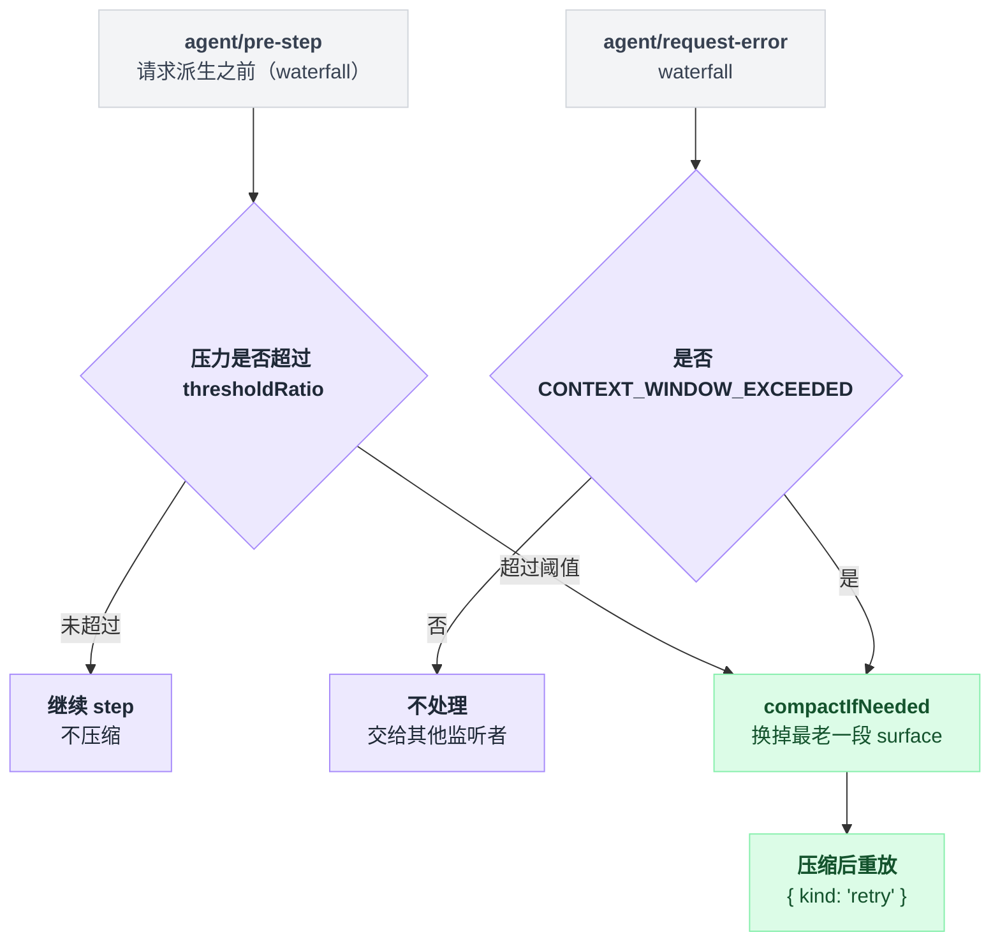
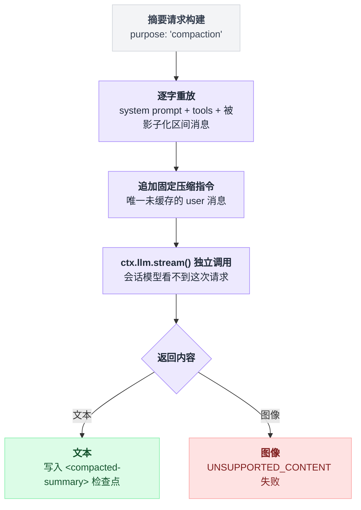

# compaction-basic

> `@deepseek-ai/dsh-compaction-basic` · bundle：`base` · 配置树 id：`compaction-basic` · v0.1.0-rc.5（commit `47f9438`）2026-08-14 核对。出处收在文末脚注。

> ⚠️ **本篇未通过对抗式引用核验**：起草已完成，但逐条打开源码比对行号/字段名/英文引文的那一遍因会话额度耗尽未执行。文中 `path:line` 与配置字段请以源码为准，核验后本行会被移除。

**一句话**：dsh 默认的压缩后端——它是 `ctx.compaction` 这个 capability seam 的 Service Provider，用 `ctx.tokenMeter` 在每个 step 边界测压，超过阈值就把最老的一段 surface 换成一条带 `<compacted-summary>` 框的检查点消息。

整条链路只有三个动作：**测压 → 超阈值就压 → 把最老那段换成检查点消息**。下面每一节都是在补这三步的细节。

## 它在树上长什么样

```yaml
    - id: compaction-basic
      name: '@deepseek-ai/dsh-compaction-basic'
```

整行没有 `config`，所以后面配置表里的字段全部走默认值；也没有显式 `inject`，依赖靠类上的 `static inject` 声明——`llm`、`tokenMeter`、`sessions` 三个 service[^1]。

web profile 把它关掉了：

```yaml
- id: compaction-basic
  disabled: true
```

上面那段注释解释了原因："The token METER stays on the host plane; only the compaction backend that reads it moves."——token-meter 留在 host 平面，压缩后端下沉到按 session 的 preset 平面[^2]。

## 它注册了什么

| 类型 | 名字 | 说明 |
|---|---|---|
| service | `ctx.compaction` | 由抽象基类 `CompactionEngine` 的构造函数完成注册；本包提供 `compactIfNeeded` / `compactRegion` / `compactNow` 三个实现[^3] |
| 可选依赖 | `toolResultPruner` | 软引用 [tool-result-pruner](./dsh-compaction-tool-result-pruner.md)，取不到就跳过剪枝[^4] |
| 事件监听 | `agent/pre-step`（**waterfall**） | 在请求派生之前做压力检查，可以在这里先落地压缩再让 step 继续[^5] |
| 事件监听 | `agent/request-error`（**waterfall**） | 只认 `CONTEXT_WINDOW_EXCEEDED`，压缩成功后返回一个 retry 信号把这次请求重放[^6] |
| 事件监听 | `agent/status`（emit） | agent 转 `idle` 时清掉 overflow 重试计数[^7] |
| 事件监听 | `session/event`（emit） | 见到 `assistant/message` 就重置 overflow 序列[^8] |
| 会话事件 | `compaction/start` / `compaction/summary` / `compaction/end` | 三个都是 log-only，不进 surface；替换本身挂在一条带 `surfaceOp: { op: 'replace' }` 的 `user/message` 上[^9] |

没有注册工具，也没有 prompt 段。

上面四个监听只在 `auto: true`（默认）时安装，装完之后它们的分工是这样的：

```
on agent/pre-step (waterfall):              # 请求派生之前
    if 压力 超过 floor(routedContextWindow × thresholdRatio):
        compactIfNeeded()                   # 先把压缩落地，再让 step 继续

on agent/request-error (waterfall):
    if error 是 CONTEXT_WINDOW_EXCEEDED:
        压缩
        return { kind: 'retry' }            # 把这次请求原样重放
    else:
        不处理                              # 交给别的监听者

on agent/status:
    if status == idle:      overflow 重试计数清零

on session/event:
    if e 是 assistant/message:  重置 overflow 序列
```

两个 waterfall 监听各自守着一条触发路径，压力检查在请求前，溢出恢复在请求后；两条路径最后都汇到同一个压缩动作上[^10]。



## 配置项

| 字段 | 类型 | 默认值 | 作用 |
|---|---|---|---|
| `thresholdRatio` | number | `0.8` | 在 `routedContextWindow` × `thresholdRatio` 取整（向下）之处触发压缩 |
| `retainRatio` | number | `0.16` | 逐字保留的近期 surface 预算占窗口比例；与 `retainTokens` 互斥 |
| `retainTokens` | number | 无 | 绝对近期预算，必须低于解析出的阈值 |
| `summarizationProvider` | string | `''` | 与 `summarizationModel` 成对设置；空值表示回落到最近一次落库的请求目标，再回落到 `AgentOptions` |
| `summarizationModel` | string | `''` | 同上 |
| `maxTokens` | number | `8192` | 摘要调用的生成上限，可能包含 reasoning token |
| `compactionRetries` | number | `1` | 首次之外的额外尝试次数，压力仍高于阈值时继续 |
| `maxOverflowRetries` | number | `1` | canonical 溢出后的最大重试；`0` 只禁用恢复 |
| `modelPolicies` | array | `[]` | 精确 `{ provider, model, ...partialPolicy }` 覆盖，匹配不依赖 `listModels` |
| `auto` | boolean | `true` | 是否注册 step 压力与溢出恢复监听 |

有四种写法会直接让插件加载失败，不是运行期才报：未知键、重复目标、互斥的两种保留写法同时出现、以及合并后 `retainRatio` 不低于 `thresholdRatio`[^11]。

## 模型看得见什么

压缩成功后，下一次请求里被替换的那一段长这样：

```
检查点前言
（空行）
<compacted-summary>
摘要
</compacted-summary>
```

前言原文：

```markdown
This is an automatically generated checkpoint condensing an earlier span of the conversation to free up context. Treat the captured context as established background and build on it without restating it. Continue the task directly from the messages that follow, without acknowledging this checkpoint.
```

摘要是怎么来的？一次独立的 `ctx.llm.stream` 调用，`purpose` 字段是 `compaction`[^12]。这次私有请求里"重放什么、新增什么、只收什么"是三件不同的事：

| 这次私有请求 | 内容 |
|---|---|
| 逐字重放 | 对话自己的 system prompt、tools、被影子化区间的消息 |
| 末尾追加 | 一条固定的压缩指令 user 消息 |
| 只收 | 文本；图像输出会以 `UNSUPPORTED_CONTENT` 失败，而不是被悄悄丢掉[^13] |

为什么要逐字重放而不是只发要压的那段？README 的 KV Cache effect 一节说明这样做是为了复用 provider 的热前缀缓存，只有那条指令和输出是未缓存的。

会话模型永远看不到这次私有请求，只有返回的**文本**进检查点。



## 什么时候你会想换掉它 / 怎么换

四档改法，从只动一行配置到整包替换：

| 你想要的 | 做法 |
|---|---|
| 只想调策略 | patch 那一行加 `config` |
| 只想手动压缩 | `auto: false` |
| 换摘要方式 | 子类覆盖 `summarize()` |
| 整包换掉 | 另写 `CompactionEngine` 子类 |

**只想调策略**：例如给小窗口模型单独降阈值。

```yaml
- id: compaction-basic
  config:
    thresholdRatio: 0.8
    retainRatio: 0.16
    modelPolicies:
      - provider: local
        model: small-context
        thresholdRatio: 0.7
        retainTokens: 2048
```

**只想手动压缩**：`auto: false`，自动监听全部不注册，只留 [command-compact](./dsh-command-compact.md) 的 `/compact` 和程序化调用。

**换摘要方式**：`summarize()` 是唯一的子类钩子，模板摘要或远程摘要写个子类覆盖它即可，压力、保留、收敛校验仍走 `ctx.tokenMeter`[^14]。

**整包换掉**：写一个别的 `CompactionEngine` 子类注册 `ctx.compaction`，`/compact` 是后端无关的，会自动跟着新后端走。

## 坑与边界

计量走的是固定启发式：拿不到可复用的 provider usage 时退化成字符数加结构开销，不是精确 tokenize。

溢出分类由 adapter 维护，provider 的措辞变了就可能识别不出来；两个 DeepSeek adapter 目前把已知的上下文超限错误归一到 `CONTEXT_WINDOW_EXCEEDED`。

有三类东西是治不了的——不可分割单元和 envelope 本身超限：恢复不能压缩 system/tools/前缀，不能拆开一个不可分割的非工具节点，也修不了剩余部分仍然超窗的工具单元。

`compactRegion` 需要一个 open turn，会话全关时手动调用会抛 "no open turn"。

摘要失败时保留最新的持久 surface：在任何替换落地之前，自动路径只 warn 并带着超预算的完整历史继续；`maxTokens` 截断（可能被隐藏的 reasoning token 吃掉）同样按此处理。

最后一条最容易读反：**低于压力线的 step 根本不剪枝**。pruner 不是"顺手每步清一清"，它只在压力或溢出已经合格之后才跑[^15]：

```
if 压力 < 阈值:
    return                      # step 直接过去，pruner 一次都不跑

...压缩 / 溢出恢复走完...

pruner = ctx.get('toolResultPruner')
if pruner: 剪枝                 # 软引用，取不到就跳过
```

## 出处

[^1]: 树上这一行：`packages/bundle/base/cordis.patch.yml:284-285`。`static inject = ['llm', 'tokenMeter', 'sessions']` 声明：`packages/compaction/compaction-basic/src/index.ts:104`。
[^2]: `packages/bundle/web-app/cordis.patch.yml:358-359`（disabled 那两行）、`:351-352`（英文注释）。
[^3]: `super(ctx, 'compaction')` 完成注册：`packages/compaction/compaction/src/index.ts:98`。
[^4]: `ctx.get('toolResultPruner')` 软查：`packages/compaction/compaction-basic/src/index.ts:281`。
[^5]: `packages/compaction/compaction-basic/src/index.ts:147`；派发模式见 `docs/event-producer-consumer.md:18`。
[^6]: `packages/compaction/compaction-basic/src/index.ts:179`、`:222`；派发模式见 `docs/event-producer-consumer.md:20`。
[^7]: `packages/compaction/compaction-basic/src/index.ts:167`。
[^8]: `packages/compaction/compaction-basic/src/index.ts:173`。
[^9]: `docs/subsystems/compaction.md:11-19`。
[^10]: 安装条件：`packages/compaction/compaction-basic/src/index.ts:129`；四个监听分别挂在 `:147`（pre-step）、`:179`/`:222`（request-error）、`:167`（status）、`:173`（session/event）。
[^11]: 默认值与加载失败校验出处：`packages/compaction/compaction-basic/src/config.ts:20`、`:23`、`:86-95`。
[^12]: 独立调用与 purpose：`packages/compaction/compaction-basic/src/summarizer.ts:161`。
[^13]: 图像失败：`packages/compaction/compaction-basic/src/summarizer.ts:220-221`。
[^14]: 钩子位置：`packages/compaction/compaction-basic/src/index.ts:236`。
[^15]: 阈值检查处：`packages/compaction/compaction-basic/src/index.ts:308`。
