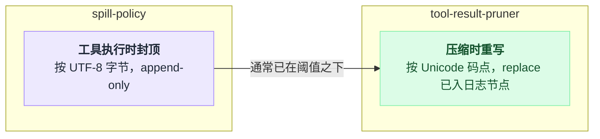

# compaction-tool-result-pruner

> `@deepseek-ai/dsh-compaction-tool-result-pruner` · bundle：`base` · 配置树 id：`tool-result-pruner` · v0.1.0-rc.5（commit `47f9438`）2026-08-14 核对

> ⚠️ **本篇未通过对抗式引用核验**：起草已完成，但逐条打开源码比对行号/字段名/英文引文的那一遍因会话额度耗尽未执行。文中 `path:line` 与配置字段请以源码为准，核验后本行会被移除。

**一句话**：不调模型的确定性剪枝服务——把 surface 上超预算的 `tool/result` 节点重写成「头部 + 固定省略标记 + 尾部」，原始事件仍完整留在 append-only 会话日志里。

## 它在树上长什么样

```yaml
    # Compacts oversized tool results before the broader conversation compactor
    # runs, preserving the model-visible result within the configured budget.
    - id: tool-result-pruner
      name: '@deepseek-ai/dsh-compaction-tool-result-pruner'
      config:
        thresholdChars: 8192
        headChars: 4096
        tailChars: 1024
```

`packages/bundle/base/cordis.patch.yml:358-365`。这三个值和代码里的 `DEFAULTS` 完全一致（`packages/compaction/compaction-tool-result-pruner/src/config.ts:10-14`），bundle 只是把它们写明。

web profile 里同样被关掉：`packages/bundle/web-app/cordis.patch.yml:364-365`。

注意它在 base 里的位置（第 360 行）**排在 `compaction-basic`（第 284 行）后面**，但这不影响可用性：[compaction-basic](./dsh-compaction-basic.md) 是运行时用 `ctx.get('toolResultPruner')` 软查的，不是 `inject`。

## 它注册了什么

| 类型 | 名字 | 说明 |
|---|---|---|
| service | `ctx.toolResultPruner` | `super(ctx, 'toolResultPruner')`（`packages/compaction/compaction-tool-result-pruner/src/index.ts:59`），Context 声明合并在 `:32-36` |
| inject | `tokenMeter` | `static inject = ['tokenMeter']`（`packages/compaction/compaction-tool-result-pruner/src/index.ts:47`），用来给被影子化的节点定价 |
| 会话事件 | `compaction/prune` | log-only 的影子定价事件，紧跟其后同步追加替换用的 `tool/result`（`packages/compaction/compaction-tool-result-pruner/src/index.ts:162-173`；事件定义 `packages/compaction/compaction/src/types.ts:81-88`） |

**没有事件监听、没有工具、没有 prompt 段。** 它是纯被动服务：自己不会主动跑，只有 compaction-basic 在压力或溢出合格之后调用 `pruneSession(session)` 才动。

服务 API 三个方法：`pruneSession(session)` 扫一次当前 surface 的稳定快照；`measureContent(blocks)` 数 `text` 块的 Unicode 码点；`pruneContent(blocks)` 返回有界替换，已在阈值内则返回 `null`。

## 配置项

| 字段 | 类型 | 默认值 | 作用 |
|---|---|---|---|
| `thresholdChars` | number | `8192` | 合并文本超过这么多 Unicode 码点才剪 |
| `headChars` | number | `4096` | 保留的前导码点数 |
| `tailChars` | number | `1024` | 保留的尾部码点数 |

全部是整数，阈值为正、头尾非负；`headChars + marker + tailChars` 必须不超过 `thresholdChars`，否则构造期直接抛错（`packages/compaction/compaction-tool-result-pruner/src/config.ts:55-63`）。未知键同样在插件构造期失败。这条约束保证了「剪完一定更小、且第二遍不会再剪」。

## 模型看得见什么

被剪的工具结果在后续请求里变成保留头部 + 固定标记 + 保留尾部。标记是硬编码的：

```text
\n\n[... tool result middle pruned ...]\n\n
```

（`packages/compaction/compaction-tool-result-pruner/src/config.ts:7`。）非文本块按原相对位置保留，模型不会看到原文的第二份副本。剪枝本身**不产生任何模型调用**；compaction-basic 重新计量后如果压力已经降到线下，就直接跳过摘要（`packages/compaction/compaction-basic/src/index.ts:310-312`）。

KV cache 方面：替换一条更早的结果会从第一个改变的 token 起让复用失效，剪过的前缀在路由、envelope 和更早历史不变时仍可复用。

## 什么时候你会想换掉它 / 怎么换

- **想少剪一点**：调大 `thresholdChars`（同时保证头尾加标记仍装得下）。
- **想彻底关掉**：`disabled: true`。compaction-basic 会通过 `ctx.get()` 拿到 `undefined` 并跳过整个 model-free 通道，只剩摘要压缩，两个包各自独立可组合。
- **换实现**：这是一个普通 cordis service，写一个同名服务的替代 provider 即可（同一 context 内一个服务只能有一个实现）。
- 它和 [spill-policy](./dsh-spill-policy.md) 治的是同一类症状但层次不同：spill-policy 在**工具执行时**按 UTF-8 字节封顶模型可见结果（append-only）；本插件在**压缩时**按 Unicode 码点重写**已经进了日志的** surface 节点（replace）。两者都开时，先被 spill 截断的结果通常已在 `maxInlineBytes` 之下，不会再触发这里的阈值：



## 坑与边界

- **字符预算不是 token 预算**：各家 token 密度不同，判断剪枝有没有真正缓解压力仍以 `ctx.tokenMeter` 为准。
- **剪枝是语法性的**：只留头尾，不理解中间哪几行语义上更重要。
- **可能切断字形簇**：按码点切保护了代理对，但不做本地化的 grapheme 分段。
- `pruneSession` 在 session 拒绝某次替换时**同步抛出**，本轮更早提交的替换仍然是持久的（`packages/compaction/compaction-tool-result-pruner/src/index.ts:136` 的文档注释）。compaction-basic 把这种「剪枝已落地但后续摘要失败」的情况当作有效的重试凭据（`packages/compaction/compaction-basic/src/index.ts:201-208`）。
