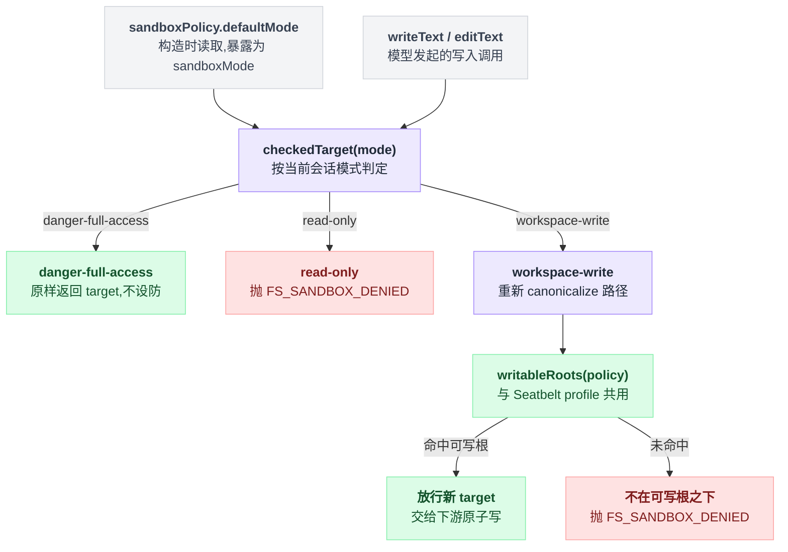

# fs-sandbox

> `@deepseek-ai/dsh-fs-sandbox` · bundle：`base` · 配置树 id：`fs-sandbox` · v0.1.0-rc.5（commit `47f9438`）2026-08-14 核对

**一句话**：会拦截的 `ctx.fs` 实现——它继承 `LocalFileSystem` 的全部文本存储机制，只在 `writeText` / `editText` 上加一道按调用解析的模式围栏；读永远放行，因为每种模式都允许读。

## 它在树上长什么样

`packages/bundle/base/cordis.patch.yml:441-444`：

```yaml
# The sandboxed filesystem provider. `cwd` defaults to `process.cwd()`; an
# overlay can pin another workspace.
- id: fs-sandbox
  name: '@deepseek-ai/dsh-fs-sandbox'
```

没有 `config`（`cwd` 与 `diffBasisMaxBytes` 全取 fs-local 的默认值），行内也没有 `inject`；依赖写在类上：`static inject = ['sandboxPolicy']`（`packages/fs/fs-sandbox/src/index.ts:60`）。三个 bundle 里只有 base 有这一行，web-app 与 headless 都没有覆盖它。

它与 base 里的 `sandbox-policy` 行配套（`packages/bundle/base/cordis.patch.yml:172-176`：`mode` 取 `DSH_PERMISSION_MODE`、环境变量未设时落到 `'workspace-write'`；`workspaceRoot` 取 `process.cwd()`）。**装它而不是 `dsh-fs-local`，再配一个 `ctx.sandboxPolicy`，整个替换就完成了**——模型侧工具一行不用改。

## 它注册了什么

| 类型 | 名字 | 说明 |
|---|---|---|
| service | `ctx.fs` | `SandboxedFileSystem extends LocalFileSystem`（`src/index.ts:59`） |
| 覆写方法 | `writeText` | 先过围栏再委托继承的原子写；**policy 不再往下传**，围栏只在本层（`src/index.ts:84-92`） |
| 覆写方法 | `editText` | 同上（`src/index.ts:105-113`） |
| 覆写属性 | `sandboxMode` | 暴露部署默认模式（构造时从 `ctx.sandboxPolicy.defaultMode` 取，`src/index.ts:65`）；这是工具层判断"要不要广告升级参数"的能力事实（`src/index.ts:69-71`） |

没有事件监听，没有工具，没有 prompt 段。它与 [fs-observation-policy](./dsh-fs-observation-policy.md) 正交：一个管"能不能写到这个位置"，一个管"读过没读过"，两者叠加生效。

围栏本体在 `checkedTarget`（`src/index.ts:126-148`）。一次写调用从模式来源到最终放行/拒绝的路径画出来是这样：



| 模式 | 行为 |
|---|---|
| `danger-full-access` | 原样返回 target，不设防 |
| `read-only` | 一切变更抛 `FS_SANDBOX_DENIED`，消息 `cannot write "<path>": file access denied under read-only mode` |
| `workspace-write` | **当场重新 canonicalize**，要求落在某个可写根之下，并把这个新鲜 target 交给下游变更；不满足则抛同样 code、消息 `… under workspace-write mode` |

可写根来自 `writableRoots(policy)`：`workspace-write` 时是 workspace 根加 `/tmp` 加 `os.tmpdir()` 去重后的规范化列表（`packages/sandbox/sandbox/src/roots.ts:52-55`）——**与 Seatbelt profile 用的是同一个函数**，所以 fs 围栏和 bash runner 不会漂移。包含判定 `isPathUnder` 先走词法快路径，再退回基于 inode 身份的祖先回退，认得 Windows 长名/8.3 名这类别名等价根（`packages/fs/fs-sandbox/src/containment.ts:58-76`）。

## 配置项

配置就是 fs-local 的配置原样照搬：`export type Config = LocalConfig`（`src/index.ts:49`）。

| 字段 | 类型 | 默认值 | 作用 |
|---|---|---|---|
| `cwd` | string | `process.cwd()` | 相对路径解析基准，**不是**围栏边界（`packages/fs/fs-local/src/index.ts:42-43`、`:66`、`:59-62`） |
| `diffBasisMaxBytes` | number | `10485760`（10 MiB） | 覆写场景可选 contextual diff 基准的每侧字节上限（`packages/fs/fs-local/src/index.ts:48`、`:52`） |

沙箱默认值（模式 + `workspace-write` 的兜底根）**不在这里**——每次调用由 `ctx.sandboxPolicy` 按 session 解析（`src/index.ts:43-48`、`:127`）。

## 模型看得见什么

它自己不产生模型可见文本。README 的 Model Experience 一节说得很明确：策略持有方贡献能力中立的 `sandbox:policy` 上下文；间接地，[tool-fs](./dsh-tool-fs.md) 把本后端抛出的 `FS_SANDBOX_DENIED` 渲染成 `[sandbox: file access denied under <mode> mode]` marker 加同轮升级提示。

拒绝之所以是结构化 `FsError` 而不是靠 stderr 文本推断（bash 的内核拒绝要那么干），是因为进程内围栏清楚知道自己拒了什么。

[tool-str-replace-editor](./dsh-tool-str-replace-editor.md) 走的是同一条路：它的 `MutationPolicy` 在 `ctx.fs.sandboxMode !== undefined` 时必须拿到 `ctx.sandboxPolicy`，否则装载即报错。

## 什么时候你会想换掉它 / 怎么换

想要完全不设防的本地文件系统（比如某个 preset 内部自建 realm），用 `fs-local` 顶替。minimal preset 就是这么做的：开一个 `isolate: { fs: true }` 的 group，在里面挂裸 `fs-local` 遮蔽 host 的这一份（`apps/cli/config/agent-presets/minimal/agent.cordis.yml:48-57`）。

```yaml
- id: fs-sandbox
  name: '@deepseek-ai/dsh-fs-local'
```

要改的是**这一行的 name**，不要另外再插一行 `fs-local`——两个 provider 会重复注册 `ctx.fs` 并让加载失败（`packages/bundle/base/README.md:7`）。

想换工作区根，不要改这里的 `cwd`（那只是解析默认值），要改 `sandbox-policy` 行的 `workspaceRoot`。想把文件状态挪到远端执行世界，换 `@deepseek-ai/dsh-fs-e2b`（`packages/fs/README.md:11`）。

## 坑与边界

- **这是策略围栏，不是内核边界**：检查发生在受信代码里、针对模型可控的路径。resolve 到 syscall 之间的残余 TOCTOU 被"临写前重新 canonicalize"收窄但没有消除，敌意宿主进程不在威胁模型内。不可信**代码**的内核级隔离仍归 `ctx.shell`（`dsh-bash-sandbox`）。
- **围栏与 runner 的一致性靠单一来源**：可写集合来自 `writableRoots`，与 Seatbelt profile 共享；哪天有个 runner profile 自己另定义可写集，两边就会漂移。
- **`ctx.sandboxPolicy` 是硬依赖**：README 的说法是"没有它组合进来，本后端不会限制任何东西"（`README.md:45`）；源码更强一层——`static inject = ['sandboxPolicy']` 加构造函数直接读 `ctx.sandboxPolicy.defaultMode`（`src/index.ts:60`、`:65`），缺了它这个插件根本不会 apply，`ctx.fs` 也就没人注册。
- 读源码另注：`checkedTarget` 返回的是**重新解析出来的** target，变更用的就是它，避免"检查这个、写那个"的错位（`src/index.ts:136-147`）。
