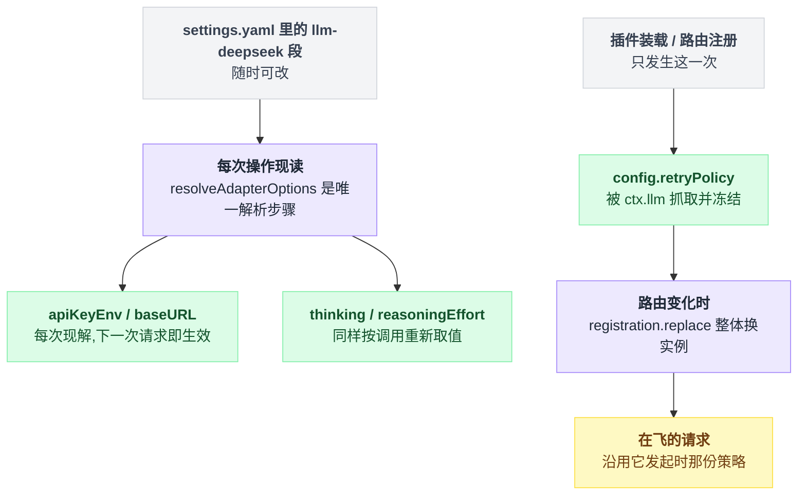
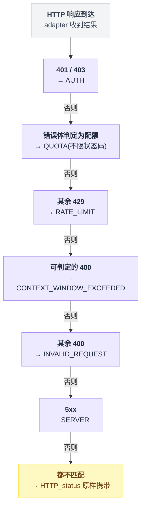

# llm-deepseek

> `@deepseek-ai/dsh-llm-deepseek` · bundle：`base` · 配置树 id：`llm-deepseek` · v0.1.0-rc.5（commit `47f9438`）2026-08-14 核对

**一句话**：原生 DeepSeek adapter，用裸 `fetch` + `eventsource-parser` 解 SSE，独占 `deepseek-official` 这一条 provider 路由——也就是 [agent-default-model](./dsh-agent-default-model.md) 出厂默认指向的那一条。

## 它在树上长什么样

```yaml
    # The native DeepSeek adapter. No key or endpoint is inlined: both resolve per
    # request from the `llm-deepseek:` settings section over this entry, with the
    # key coming from the credential store below. Thinking defaults are a deployment
    # choice.
    - id: llm-deepseek
      name: '@deepseek-ai/dsh-llm-deepseek'
```

`packages/bundle/base/cordis.patch.yml:446-451`，正好是 base bundle 的最后一行（全文 451 行）。**不带 config**，所以下面表格里的默认值就是它实际跑的值。源码级 `inject = ['llm']`（`packages/llm/llm-deepseek/src/index.ts:42`），依赖 [llm](./dsh-llm.md) 提供的 `ctx.llm`。

## 它注册了什么

| 类型 | 名字 | 说明 |
|---|---|---|
| adapter 路由 | `deepseek-official` | `ctx.llm.registerAdapter([PROVIDER], adapter)`，`src/index.ts:256`。路由名故意跟 pi-ai catalog 里的 `deepseek` 区分开，好让一套 composition 同时挂两条 DeepSeek 通路（`README.md:7`） |
| configurable provider 目录项 | provider `deepseek-official`，`displayName: 'DeepSeek'`，`settingsNs: llm-deepseek`，`settingsPath: []` | `src/index.ts:251-253`。整个 section 就是 profile，所以 path 是空 |
| settings section | 命名空间 `llm-deepseek`，schema 就是它自己的 `Config` | `installSettingsSection(...)`，`src/index.ts:270-275` |

**不监听任何事件**（`src/` 下没有一处 `ctx.on`），也不注册工具 / prompt 段 / 命令。它是 [llm](./dsh-llm.md) 的 provider，不是拦截者。

## 配置项

schema 在 `src/index.ts:91-101`，字段注释在 `:62-81`：

| 字段 | 类型 | 默认值 | 作用 |
|---|---|---|---|
| `apiKeyEnv` | string（role `credential-ref`） | `DEEPSEEK_API_KEY` | 凭据**引用**（环境变量名），每次请求现解；配置里永远不放明文 key |
| `baseURL` | string | 无 | 省略时依次退到 `$DEEPSEEK_BASE_URL`（只认可信环境层）、再到 `https://api.deepseek.com`（`:104-107`） |
| `thinking` | `enabled` \| `disabled` | 无（provider 默认 enabled） | 部署级思考锁；`disabled` 时只发布 `off` |
| `reasoningEffort` | `off` \| `high` \| `max` | 省略 ⇒ `high` | 部署默认努力档；`high`/`max` 序列化成官方顶层 `reasoning_effort`，`off` 改发 `thinking.type: disabled` |
| `maxTokens` | number ≥ 1 | `256000` | 每请求输出上限，属于 adapter 默认值，显式请求值优先 |
| `defaultContextWindow` | 正整数 | `1000000` | 精确模型没有自带容量时的兜底上下文 |
| `models` | 数组 | `deepseek-v4-flash` / `deepseek-v4-pro`，各 1,000,000 上下文 | **建议性**目录，给选择器看；未列出的 model id 照样直通 |
| `streamIdleTimeoutMs` | number（正有限，≤ 定时器上限） | `300000` | 单次 provider 读的空闲上限，不计消费者思考时间 |
| `retryPolicy` | `RetryPolicyConfig` | 省略 ⇒ normal 默认 | 注册时被 `ctx.llm` 抓取冻结，由 [llm-retry](./dsh-llm-retry.md) 执行 |

常量出处：`DEFAULT_STREAM_IDLE_TIMEOUT_MS = 300_000`、`DEFAULT_CONTEXT_WINDOW = 1_000_000`、`DEFAULT_MAX_TOKENS = 256_000`，全在 `src/adapter.ts:89-93`。

**连接事实不在装载时冻结**：`resolveAdapterOptions` 是唯一的解析步骤，adapter 通过 thunk **每次操作重读一遍**（`src/index.ts:200-223`）。settings 文档里的 `llm-deepseek:` section 覆盖 bundle 那一行，改完下一次请求生效，不用重启；正在流的那次请求保留它开始时的事实。一份通过 schema 但违反 schema 之外边界的快照（重复 catalog id、坏的 thinking/effort 组合）会**保留上一份好配置**并打日志（`src/index.ts:212-221`），而 bundle 自己的 entry config 出错则直接装载失败（`README.md:54`）。

唯一在注册时被捕获的事实是 retry policy，所以它变了要原地 `registration.replace([PROVIDER])`——同一个 adapter 实例、一个同步段，避免中间出现空路由集被观察者看到（`src/index.ts:258-268`）。这两条时间线（每次调用现读 vs 注册那一刻冻结）拆开看更清楚：



## 模型看得见什么

README 的 Model Experience 分请求/响应两半（`README.md:79-107`）。请求侧：所选模型收到 harness system prompt、消息历史、工具 schema、stop 序列和 call config，**adapter 自己不加任何 prompt 文字**。关键的一条是 reasoning 回传规则（`README.md:72`）：

> **Reasoning passback rule**: on assistant turns that carried tool calls, `reasoning_content` is serialized back in history (required by the API in thinking mode); on tool-call-free turns it is dropped (ignored anyway — saves tokens).

KV cache：未变的前缀可复用，adapter 在 usage 里回报（`cacheReadTokens` 取 `prompt_cache_hit_tokens` / `prompt_tokens_details.cached_tokens`，DeepSeek 不报 cache-write）。换模型或换路由等于换 cache 域。

另外两个模型看不见但会出现在 HTTP 头上的东西：`x-deepseek-harness-user-id`（匿名稳定 id）和 `x-deepseek-harness-session-id`（携带 `GenerateOptions.sessionId` 时），加上 compaction 请求专有的 `x-deepseek-harness-compact: 1`（`README.md:63-65`）。

## 什么时候你会想换掉它 / 怎么换

- **只想换 endpoint / key**：别动 composition，写 `$DSH_HOME/settings.yaml` 的 `llm-deepseek:` section（Web 的 Models 页写的就是它），热生效。
- **想接 OpenAI 兼容网关或别家模型**：不要改这个包，用 [llm-pi-ai](./dsh-llm-pi-ai.md)——它默认休眠，加一段 `llm-pi-ai:` profiles 就活。两者可以并存，因为路由名 `deepseek-official` 与 `deepseek` 不撞。
- **想改重试**：在这一行的 `config.retryPolicy` 上写，执行者是 [llm-retry](./dsh-llm-retry.md)；`retryPolicy` 写到 llm-retry 那一行上会被它显式拒绝。
- **想彻底摘掉**：patch 层**不能删行**，只能按 id 覆盖 config 或 insert（`packages/boot/app-boot/README.md:43`）。正确写法是在 profile 的 `cordis.patch.yml` 里把这一行停掉：

```yaml
- id: llm-deepseek
  disabled: true
```

`disabled` 是 patch 的合法字段（`vendor/include/src/index.ts:151`），被停掉的 entry 不会 mount（`vendor/loader/src/config/entry.ts:126`）。此时 `ctx.llm` 仍在，只是没有 `deepseek-official` 路由——agent-default-model 的出厂默认就指向了一条不存在的路由。

## 坑与边界

`README.md:109-114` 的 Known Limitations and Deferred Work：

- **settings 里的 `models` 列表是整份替换**：settings 层按字段合并，数组算一个字段。
- **`tool_choice` 没有映射**（MVP 裁掉，与 pi-ai 双胞胎共享这个缺口）。
- **用裸 `fetch` 而不是 `@cordisjs/plugin-http`**：没有共享的代理/拦截配置（`TODO(http)`）。
- **序列化把 user 与 tool-result 内容压平成文本块**：插件新增的块类型被跳过，空的工具输出以字面量 `(no output)` 过线。

读源码补充：HTTP 错误码映射是**稳定可路由**的，不要去 parse 文案（`src/adapter.ts:138-149`）——判定顺序是一条链，命中就停：



`AUTH` 排最先，`QUOTA` 不看状态码、比 429 分支还靠前判——这两条容易被直觉的"先看状态码"顺序带偏。传输层失败是 `TRANSPORT`（链上 `cause` 保留原始 DNS/TLS/ECONNREFUSED，`src/adapter.ts:258`），协议违规是 `STREAM_CLOSED`（`src/sse.ts:39`）/ `MALFORMED_RESPONSE`（`src/translate.ts:124`），`stop` 却一个内容块都没开的退化完成是 `EMPTY_RESPONSE`（`src/translate.ts:113`，默认策略会重试）。key 解析不到是 `MISSING_CREDENTIAL` 且路由仍然注册、目录仍可浏览（`src/index.ts:241-245`）——首次上手就是「先浏览模型、再存 key、再提问」，中间不用重启（`README.md:55`）。

## 未确认

- ⚠️ 默认 catalog 里的 `deepseek-v4-flash` / `deepseek-v4-pro` 和 1,000,000 上下文是本 commit 写死的出厂值（`src/index.ts:49-52`）；线上 API 实际是否提供这两个 id、容量是否一致，我没有联网核对。
