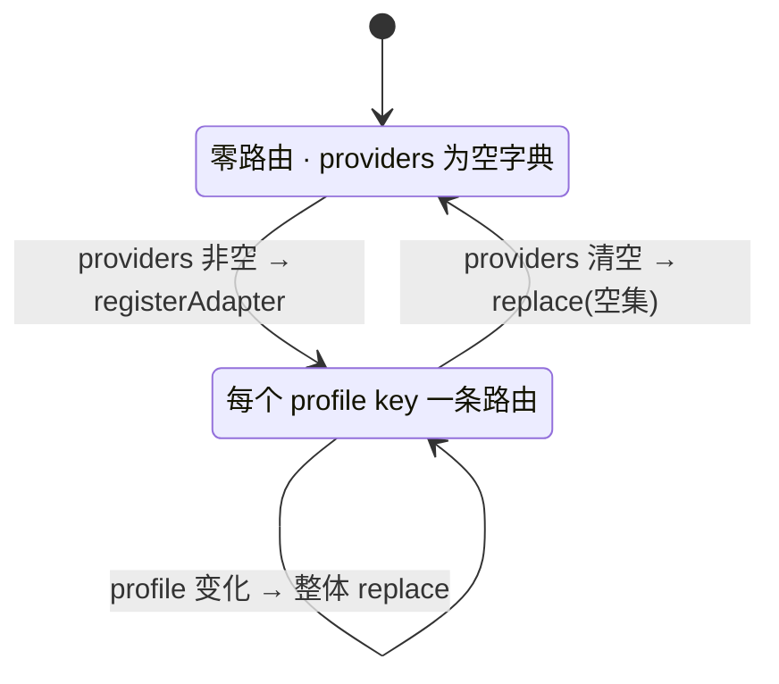
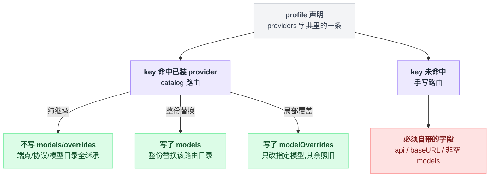

# llm-pi-ai

> `@deepseek-ai/dsh-llm-pi-ai` · bundle：`base` · 配置树 id：`llm-pi-ai` · v0.1.0-rc.5（commit `47f9438`）2026-08-14 核对

**一句话**：基于 `@earendil-works/pi-ai` 的通用多 provider adapter，出厂**休眠挂载**（零路由），一旦 settings 里出现 `llm-pi-ai:` profiles 就把那些路由注册上去；它是 [llm-deepseek](./dsh-llm-deepseek.md) 的「另一半双胞胎」。

## 它在树上长什么样

```yaml
    # The pi-ai multi-provider twin, mounted dormant: zero routes (and no extra
    # models in the picker) until a `llm-pi-ai:` settings section supplies provider
    # profiles — then those routes register live, keys resolving per request
    # through their apiKeyEnv references, and drop again when the section empties.
    # Supplying those profiles is exactly what the web Models page does. Which
    # adapters exist is composition; which providers run is the user's settings
    # document.
    - id: llm-pi-ai
      name: '@deepseek-ai/dsh-llm-pi-ai'
```

这一行**不带 config**，也就是 `providers` 默认为空 dict。源码级 `inject = ['llm']`。

出处：挂载 `packages/bundle/base/cordis.patch.yml:88-96`；默认空 dict `packages/llm/llm-pi-ai/src/config.ts:256`；inject `src/index.ts:85`。

## 它注册了什么

| 类型 | 名字 | 说明 |
|---|---|---|
| adapter 路由 | 当前 profiles 的每一个 key | `src/index.ts:270`；**零路由时根本不调 `registerAdapter`**（`:266-269`），这就是休眠姿态 |
| configurable provider 目录 | 已安装 catalog 中每个可用 API key 认证的 provider ∪ 当前 profiles 声明的每条路由 | 注册在 `src/index.ts:220`，条目形状见 `:120-147`，`settingsPath` 是 `['providers', <provider>]`（`:130`），`declared` 标记「pi-ai 根本没出这个 provider」（`:134`） |
| model discovery | 命名空间 `llm-pi-ai` | `ctx.llm.registerModelDiscovery(NS, …)`，`src/index.ts:246`。配置面把用户正在编辑的**草稿**发过来问「这个端点有哪些模型」 |
| settings section | 命名空间 `llm-pi-ai`，带 `validate: assertServiceable` | `src/index.ts:278-282` |

**不监听任何事件**（`src/` 下无 `ctx.on`），不注册工具 / prompt 段 / 命令。

休眠与活跃是两个可以来回切换的状态，钥匙只有一把：`providers` 字典是否为空。



切换不是逐条增删，而是整体换集合。路由集与每条路由的 retry policy 都是**注册级事实**，任一变化就整体 `registration.replace(routes)`：

```
配置变化时:
    facts = registrationFacts()          // 按 provider 排序,所以 key 顺序变了不算变化
    if facts 与 registeredFacts 相同:  什么都不做
    routes = 由 providers 字典算出的候选集
    if routes 为空:                     不调 registerAdapter        // 休眠姿态
    整体校验候选集
    if 撞车:                            保留旧路由继续服务
    else:
        registration.replace(routes)
        registeredFacts = facts          // 注册表真正吃下之后才前移
```

也就是说：撞车不会把你已有的服务掀翻，而 `registeredFacts` 前移得晚一步，正是为了让失败的那次替换不留下假的「已生效」记录。

出处：整体替换与事实前移见 `src/index.ts:253-275`；排序见 `:94-105`。

## 配置项

顶层只有一个字段：

| 字段 | 类型 | 默认值 | 作用 |
|---|---|---|---|
| `providers` | `Record<string, PiAiProviderProfile>` | `{}` | 按 provider 路由名做 key 的 profile 字典；dict 形状让重复路由不可表达。前 release 的数组形状会带迁移提示装载失败（`src/config.ts:304-306`） |

单条 profile 的字段：`apiKeyEnv`、`displayName`、`api`、`baseURL`、`models`、`modelOverrides`、`compat`、`defaultContextWindow`、`defaultMaxTokens`、`defaultInput`、`headers`、`reasoning`、`thinkingBudgets`、`cacheRetention`、`transport`、`timeoutMs`、`websocketConnectTimeoutMs`、`streamIdleTimeoutMs`、`retryPolicy`。

schema 在 `src/config.ts:232-252`，注释在 `:65-141`，另见 `docs/config-catalog.md:911-988`。

其中四个兜底默认值值得单独记住：

| 字段 | 兜底默认值 | 出处 |
|---|---|---|
| `defaultContextWindow` | 262,144 | `src/config.ts:38` |
| `defaultMaxTokens` | 32,768 | `:41` |
| `streamIdleTimeoutMs` | 300,000 | `:35` |
| `defaultInput` | `[text]` | `:53` |

profile 写出来会落进四种形态，由 key 是否命中 catalog、以及写了哪些字段共同决定：

| 形态 | 什么时候是它 | 效果 |
|---|---|---|
| catalog 路由 | key 命中已安装的 pi-ai provider | 端点、协议、模型目录全部继承，逐字段覆盖 |
| catalog 路由 + `models` | 同上，且写了 `models` | 这份列表**整份替换**该路由的目录，每一项的未设字段再从同 id 的已装模型继承 |
| `modelOverrides` | 只在「catalog 路由且没写 `models`」时有意义 | 只改指定几个已装模型，其余照旧服务；写错了会被拒绝而不是静默跳过 |
| 手写路由 | pi-ai 没出的 key | 必须自带 `api`、`baseURL` 和非空 `models` |

四种形态见 `README.md:74-100`。



## 模型看得见什么

Model Experience 分请求、响应两半。

请求侧：所选模型收到 `GenerateOptions.system`、历史、工具和 pi-ai 通用流式 API 支持的采样字段，**本包不加任何 prompt 文字**；只有当 adapter 校验通过时才恢复 provider 原生的 replay 元数据。

响应侧是一次翻译，pi-ai 的事件被翻成 harness 的 chunk：

```
pi-ai 事件 → harness chunk:
    reasoning / text / tool-call / usage / finish
    tool-call 的参数 = JSON.stringify(pi-ai 给的对象)   // 解析好的对象又被变回原始 JSON 字符串
```

最后那一步第一遍读容易略过：pi-ai 给的本来是解析好的对象，这里重新 stringify，交回去的是**原始 JSON 字符串**。以上见 `README.md:160-188`。

KV cache：转换不加文本、保持逻辑请求顺序，复用与否由所选 provider 的序列化和 replay 状态决定；换 adapter 实例、provider、model 或任何上游 token 都可能从第一处差异起失效。

## 什么时候你会想换掉它 / 怎么换

不用换——它出厂就是空的，**你要做的是把它点亮**。往 `$DSH_HOME/settings.yaml` 写：

```yaml
llm-pi-ai:
  providers:
    openai:
      apiKeyEnv: OPENAI_API_KEY
      baseURL: https://proxy.example.com:8443
      reasoning: high
```

下一次请求即生效，不用重启（`README.md:106`）。Web 的 Models 页写的就是这一段。

想在 composition 层预置也可以——在 profile 的 `cordis.patch.yml` 里按 id 覆盖这一行的 `config`。注意 patch 是**整份替换**目标行的 config，不是合并：

```yaml
- id: llm-pi-ai
  config:
    providers:
      openai:
        apiKeyEnv: OPENAI_API_KEY
```

但预置之前先看一眼 Known Limitations 里那条：settings 层只能**加或覆盖**，删不掉 composition 给的路由。

跟本组其它插件的分工有两处：`deepseek-official` 归 [llm-deepseek](./dsh-llm-deepseek.md) 独占，这里的 pi-ai catalog 名叫 `deepseek`，两者可以并存。

每条 profile 的 `retryPolicy` 由 [llm-retry](./dsh-llm-retry.md) 在 agent 步骤边界执行，pi-ai SDK 自己的 `maxRetries` 被强制置零——保证一次 `stream()` 就是一次 provider 请求（`README.md:118`）。

## 坑与边界

以下挑自 `README.md:190-204` 的 Known Limitations and Deferred Work，捡最容易踩的：

- **只靠 OAuth 认证的 provider 不提供**：本 adapter 构建 `Models` 时不带凭据存储也不跑登录流，这类路由每次请求都会在发出前失败；目录里主动把它们扣下，`openai-codex` 是已装 catalog 里唯一一个。
- **provider 原生凭据发现只读进程环境**：`~/.aws/credentials` 没有导出 `AWS_PROFILE` 就算未配置，harness 凭据 seam 里的值它也看不见。
- **settings 能加路由、覆盖路由，但删不掉 composition 路由**；`replace` 只重置用户层。
- **分层合并对 dict key 没有 delete**：base 声明过的 `reasoningEfforts` 档位、`modelOverrides` 条目、`compat` 字段，用户层只能覆盖不能移除——而 `reasoningEfforts` 的「缺席」本身就是语义（不提供该档），所以 base 声明过的档位会一直被提供。出厂 composition 让它休眠，正是为了避开这个。
- **`headers` 里能塞进 redactor 看不见的凭据**：那是纯字符串 dict，写在里面的 `Authorization` 会被 `describe()` 原样吐出来给任何配置 UI。凭据请一律走 `apiKeyEnv`。
- **路由的 catalog 永不自刷新**、**一条路由只能一种 wire 协议**。
- **模态声明不被验证，且过度声明会拖累整个会话**：图片消息已经落到 session log 里了，只能换模型 / fork / 新会话。
- **`GenerateOptions.stop` 直接被拒**（`UNSUPPORTED_OPTION`），**provider HTTP status 拿不到**（pi-ai 错误事件不给跨 provider 稳定的状态码）。
