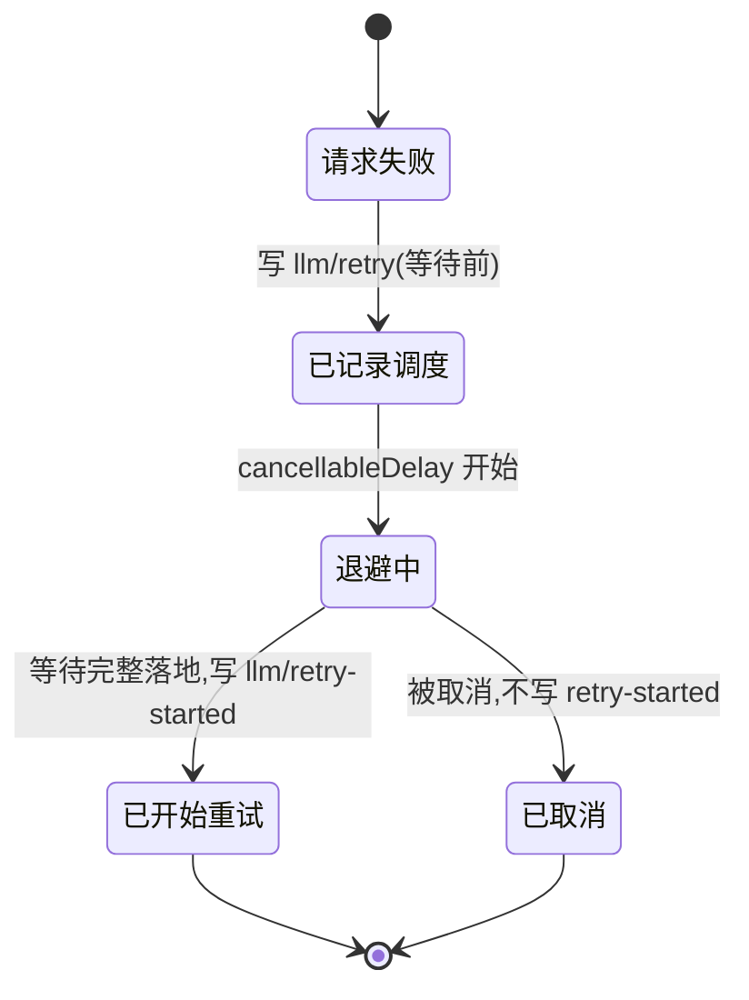
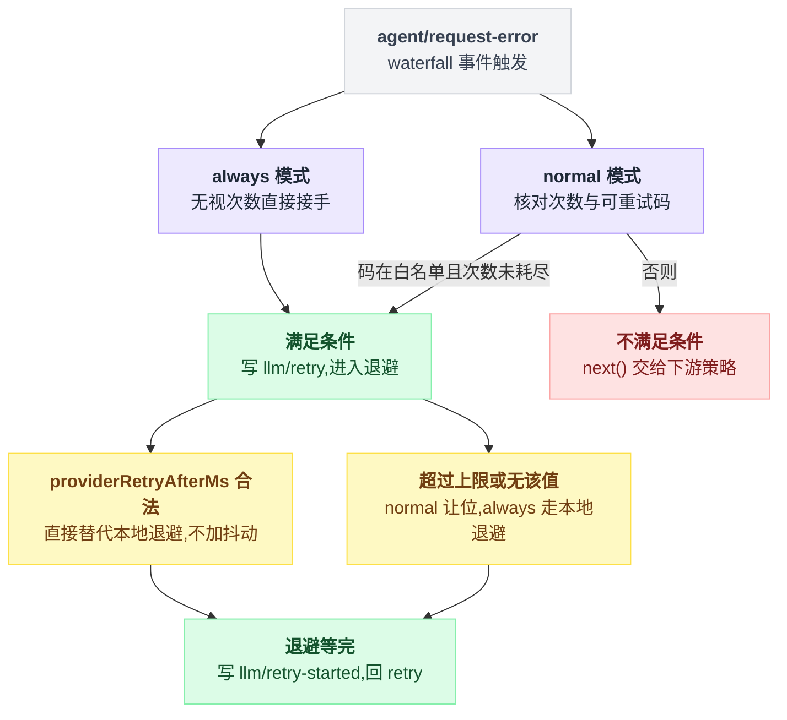

# llm-retry

> `@deepseek-ai/dsh-llm-retry` · bundle：`base` · 配置树 id：`llm-retry` · v0.1.0-rc.5（commit `47f9438`）2026-08-14 核对

**一句话**：把每条 provider 路由自带的 retry policy 真正**执行**出来的那个插件——它挂在 agent loop 的 `agent/request-error` waterfall 上，而**不是**去包 `ctx.llm.stream()`。

这个"挂在哪"是理解它的关键。我第一遍读的时候以为它是个流的包装器：调用失败了就重新调一次。不是。它站在 agent 的错误事件上，让 agent 从持久历史里**重建**一次请求，所以策略也不归它管——策略在 provider 那边。

## 它在树上长什么样

```yaml
    - id: llm-retry
      name: '@deepseek-ai/dsh-llm-retry'
```

不带 config——它**没有** config。源码级 `inject = ['agents']`，要的是 `@deepseek-ai/dsh-agent` 提供的 `ctx.agents`，不是 `ctx.llm`。

出处：树上这两行见 `packages/bundle/base/cordis.patch.yml:72-73`；`inject` 见 `packages/llm/llm-retry/src/index.ts:21`；`ctx.agents` 的提供方见 `packages/core/agent/src/index.ts:267`。

## 它注册了什么

| 类型 | 名字 | 说明 |
|---|---|---|
| 事件监听 | `agent/request-error`（**waterfall**） | `src/index.ts:210`；事件声明在 `packages/core/agent/src/runtime-types.ts:260`，`@mode waterfall` 标在 `:258`，另见 `docs/event-producer-consumer.md:20`。它要么返回 `{ kind: 'retry' }` 自己接管，要么 `next()` 交给下游 |
| session 事件类型 | `llm/retry` | 类型声明在 `src/types.ts:6-13`，写入在 `src/index.ts:150`。**非 surface** 的持久记录，等待**之前**就落盘 |
| session 事件类型 | `llm/retry-started` | 同上，写入在 `src/index.ts:152`——退避真的等完了才写（`:151` 的 `cancellableDelay` 返回 true 之后），紧接着才返回 `{ kind: 'retry' }` |
| 清理 effect | 标签 `llm-retry: abort and drain active recovery` | `ctx.effect(...)`，`src/index.ts:221-225`：摘监听、abort 生命周期、`Promise.allSettled` 排干在飞的恢复 |

不注册服务、工具、prompt 段或命令。

同包另发布的 `./invariant` companion 另有监听（`src/invariant.ts:159-160`：`session/created` 与 `internal/dispatch`），那是校验用的，不参与恢复决策。

`llm/retry` 和 `llm/retry-started` 这两条落盘时机差一整段退避等待，取消发生在中间时只留下前一条：



## 配置项

**无配置项**，而且是刻意的（`README.md:29`）：

> The executor has no policy config. Multi-provider adapters such as `dsh-llm-pi-ai` place `retryPolicy` inside each provider profile, avoiding a second provider-name list.

`Config` 就是空对象（`src/index.ts:24-27`）。`validateConfig` 还专门给最容易犯的那个错留了诊断：往这里写 `retryPolicy` 会得到 `llm-retry: retryPolicy belongs under each provider configuration`（`src/index.ts:29-36`）。

策略从哪来：[llm-deepseek](./dsh-llm-deepseek.md) 的 `config.retryPolicy`（整条路由一份）、[llm-pi-ai](./dsh-llm-pi-ai.md) 每个 provider profile 里的 `retryPolicy`。

它们在路由注册那一刻被 [llm](./dsh-llm.md) 抓取冻结成 `ResolvedRetryPolicy`，随每次调用传到最终 adapter 边界。冻结这件事有个直接后果：**路由事后被 dispose 或 replace，在飞的那次失败仍然沿用它当时的那份策略**（`README.md:7`）。

省略时的 normal 默认值（`packages/llm/llm/src/retry-policy.ts:14-24`）：

| 项 | 默认 |
|---|---|
| `maxRetries` | 2 |
| `retryableCodes` | `EMPTY_RESPONSE`、`RATE_LIMIT`、`SERVER`、`TIMEOUT`、`TRANSPORT` |
| `backoff.initialDelayMs` | 500 |
| `backoff.maxDelayMs` | 10000 |
| `backoff.jitterRatio` | 0.1 |

`always` 模式没有次数上限——次数检查只写在 normal 分支里（`src/index.ts:190`）。它先问下游要不要接手，再无限重试**任何**模型请求失败，直到成功、取消或插件被 dispose（`src/index.ts:161-176`）。

退避有两条硬规则（`README.md:9`、`src/index.ts:194-205`），核心是 provider 回给你的 `providerRetryAfterMs` 什么时候作数：

| `providerRetryAfterMs` | normal 模式 | always 模式 |
|---|---|---|
| 合法且 ≤ `maxDelayMs` | 直接替代本地退避，**不加抖动** | 同左 |
| 超过上限 | **交给下游**（`return next()`） | 改用自己的本地退避 |

第二行的不对称是有意的：这样 provider 的一条指令没法让 always 模式终止。

整条决策路径连起来是这样：



同一段逻辑写成伪代码是这样，把两条硬规则和两个事件的落盘时机放在一张图里看：

```
on agent/request-error(err):
    if 模式 == always:
        接手 = true                      // 不看次数，也不看码
    else:                                // normal
        接手 = (err.code 在 retryableCodes) 且 (已重试次数 < maxRetries)
    if not 接手:
        return next()                    // 交给下游恢复策略

    写 llm/retry 事件                     // 等待之前就落盘，记的是"调度"

    if providerRetryAfterMs 合法 且 ≤ maxDelayMs:
        延迟 = providerRetryAfterMs      // 直接替代，不加抖动
    else if 模式 == normal:
        return next()                    // 超上限就让位
    else:
        延迟 = 本地退避(initialDelayMs, maxDelayMs, jitterRatio)

    if not cancellableDelay(延迟):        // 中途被取消
        return                           // 不写 retry-started

    写 llm/retry-started 事件
    return { kind: 'retry' }
```

## 模型看得见什么

README 的 Model Experience（`README.md:31-45`）先给了一句总结：

> No retry event, delay, provider error, or failed partial output is model-visible.

重试轮次从持久的 surface 历史重建**同一个**显式 provider/model 请求，失败的 chunk 永远不进派生消息。剩下两件事值得单独摆出来：

| 维度 | 结论 |
|---|---|
| Token | 每次重试都是一次新的 provider 请求，输入 token 可能重复计费；normal 有限、always 可以无上限烧下去，`llm/retry` 本身不产生 token |
| KV cache | 重建的请求保留原前缀，按该 provider 的规则仍有资格命中缓存；非 surface 的重试事件不改变缓存身份 |

## 什么时候你会想换掉它 / 怎么换

- **想调重试行为**：不要动这一行，去改 provider 那边的 `retryPolicy`（见上）。
- **想彻底关掉重试**：patch 层不能删行，只能停用——在 profile 的 `cordis.patch.yml` 里写：

```yaml
- id: llm-retry
  disabled: true
```

（`disabled` 是 patch 的合法字段，`vendor/include/src/index.ts:151`；停用的 entry 不 mount，`vendor/loader/src/config/entry.ts:126`。）

此时 `agent/request-error` 的默认行为生效——原样保留失败，失败即终态（`packages/core/agent/src/runtime-types.ts:245-249`）。

- **想换成自己的恢复策略**：写一个自己的插件监听 `agent/request-error`，接管就返回 `{ kind: 'retry' }`，不接管就 `next()`。注意多个恢复策略是按 waterfall 顺序**组合**的，always 模式会先让下游先决定。
- **不要**改成去包 `llm/stream`——[llm](./dsh-llm.md) 的 README 明确说过，已经吐过 chunk 之后再重试没有持久的 attempt 边界，这正是 dsh 出厂重试选 `agent/request-error` 的原因。

配套的 `./invariant` 子插件（`README.md:13`）会校验一串东西：每次调度的重试都指向当前打开的 turn 和最近关闭的 step、匹配失败请求的持久 provider、身份非空、按模式有对应边界、step 记录唯一、provider-policy 维度的重试号正确、定时器延迟有界。

它还要求每个 `llm/retry-started` 都能对应上一条同 `retryId`/turn/step/retry 的调度记录，重复的 started 事件直接拒绝。

## 坑与边界

`README.md:47-53` 的 Known Limitations and Deferred Work：

- **agent turn 是唯一的重试边界**：直接调 `ctx.llm.stream()` 的消费者仍然是单次尝试，因为裸流没法把「已经吐出去的 chunk」持久地切开。
- **always 模式会重试永久性失败**：认证、配额、非法请求、协议、不可恢复的上下文错误都会一直重试下去，成本和延迟控制归部署方。
- **有限预算会叠加**：normal 只数它自己配置的码和精确的 provider policy，上下文溢出压缩另有一份预算；任何重叠策略必须自己定义注册顺序行为。
- **恢复策略按 waterfall 顺序组合**：一个忽略取消、永不 settle 的后续策略会同时卡住 fallback、turn 静默和插件 dispose。
- **`llm/retry` 记录的是「调度」不是「完成」**：成功、耗尽还是取消，要看后面的 step 和 turn 事件。

读源码补充：重试号的连续性不是靠内存里的计数器，而是靠回查上一条 `llm/retry` 事件，四个维度都得对上：

```
第 N 次重试 = 回查满足以下全部条件的上一条 llm/retry:
    同一个 turn
    同一个 step
    同一个 provider
    同一个完整 policyKey       // 逐字段相等，不是名字相等
找到 → N = 上一条的号 + 1
找不到 → N 从头开始
```

`policyKey` 把每一个影响行为的字段都编进去，normal 模式还会给 `retryableCodes` **排序**，因为资格判定用的是集合成员关系（顺序不该影响身份）。所以路由一旦被换成不同的限次/码集/退避，`policyKey` 就变了，重试历史随之**从头开始**。

另外重复一遍那个容易漏的点：退避途中被取消**不会**写 `llm/retry-started`。

出处：回查逻辑 `src/index.ts:182-188`；`policyKey` 构造与排序 `src/index.ts:65-76`；取消不写 started `src/index.ts:151`。
