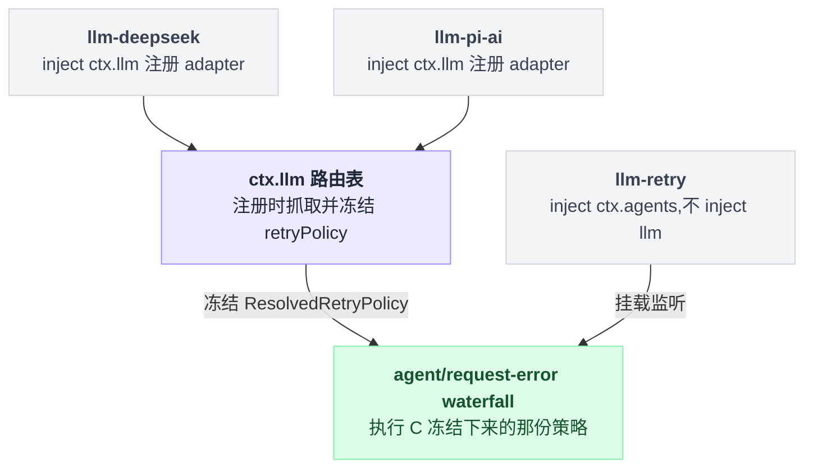
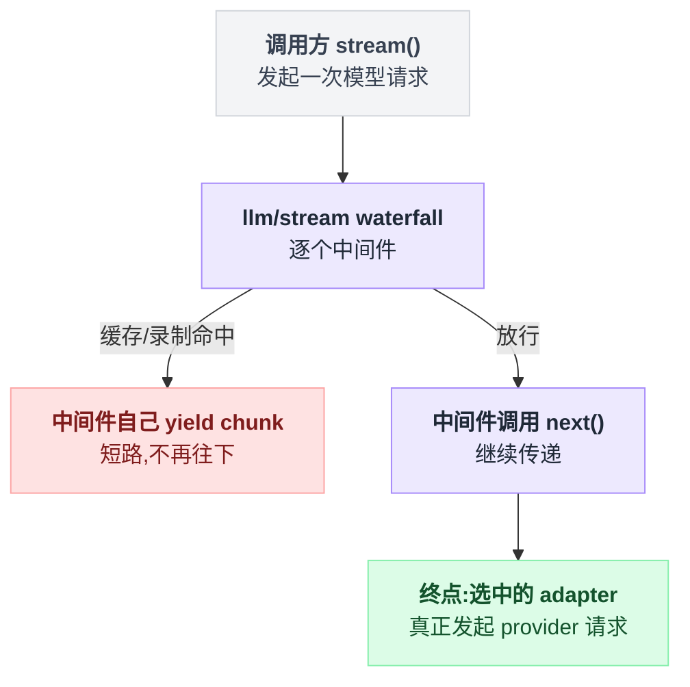

# llm

> `@deepseek-ai/dsh-llm` · bundle：`base` · 配置树 id：`llm` · v0.1.0-rc.5（commit `47f9438`）2026-08-14 核对

**一句话**：provider 中立的 LLM 词汇表加抽象服务——一个 adapter 注册表 + 一个可被 waterfall 拦截的流式调用 API，本组其余四个插件全都围着它转。

## 它在树上长什么样

```yaml
    - id: llm
      name: '@deepseek-ai/dsh-llm'
```

没有 `inject`、没有 `config`——它是**被别人 inject** 的那一个。插件本体就是这个 Service 类本身。

出处：bundle 那两行在 `packages/bundle/base/cordis.patch.yml:24-25`；`export default LlmRuntime` 在 `packages/llm/llm/src/index.ts:947`。

谁跟它有关系，分两种，很容易搞混：

| 插件 | 关系 | 出处 |
|---|---|---|
| [llm-deepseek](./dsh-llm-deepseek.md) | `inject` 写着 `llm`，注册 adapter | `packages/llm/llm-deepseek/src/index.ts:42` |
| [llm-pi-ai](./dsh-llm-pi-ai.md) | `inject` 写着 `llm`，注册 adapter | `packages/llm/llm-pi-ai/src/index.ts:85` |
| [llm-retry](./dsh-llm-retry.md) | **不** inject 它（inject 的是 `agents`），但执行的正是本服务在注册那一刻冻结下来的那份 retry policy | — |

也就是说，llm-retry 和 `ctx.llm` 之间没有依赖声明，只有一份被冻结的事实在中间传递：



## 它注册了什么

一个 service、两个事件，没别的。

| 类型 | 名字 | 说明 |
|---|---|---|
| service | `ctx.llm`（`LlmRuntime`） | 类在 `packages/llm/llm/src/index.ts:284`；`super(ctx, 'llm')` 在 `:293` |
| 事件（声明并派发） | `llm/stream`（**waterfall**） | 声明在 `src/index.ts:64`，派发在 `:921-926` |
| 事件（声明并派发） | `llm/adapters-updated`（**emit**，无 payload） | 声明在 `src/types.ts:23`，派发在 `src/index.ts:302` |

### `llm/stream`：adapter 是 waterfall 的终点，不是起点

这是这个包最需要转过弯来的一处。adapter 查找不是"先选好 adapter 再让中间件包一层"，而是**waterfall 的终点续延**——监听者调 `next()` 才会走到 adapter，它也可以自己 yield chunk，把这次模型调用整个短路掉：

```
stream(请求):
    走 llm/stream 的中间件链:
        中间件自己 yield chunk  →  直接返回,adapter 压根没被调用
        中间件调 next()        →  继续往下传

    链走到底（终点续延）:
        adapter = 路由表[请求.provider]
        if adapter 不存在: throw LlmError('NO_ADAPTER')
        return adapter.stream(请求)
```

所以"缓存命中就不发请求"这类需求，不需要动路由表，挂一个监听者自己吐 chunk 就够了。短路语义见 `src/index.ts:54-55`；`NO_ADAPTER` 在 `:818`。



### `llm/adapters-updated`：坏监听者不否决注册表变更

它走 `events.dispatch('emit', …)` 逐个调用监听者。注册表已经改完了，监听者是被通知方，所以**一个坏监听者不否决这次变更**——只有 `INVARIANT` 码的失败会在 fan-out 之后重抛（`README.md:33`）。

### 主插件不监听任何东西

它不监听事件，也不注册工具、prompt 段或命令。挂监听的是同包另发布的 `./invariant` companion：`llm/stream` 前置校验流协议，`llm/adapters-updated` 后置校验注册表可读（`src/invariant.ts:88-89`）。

### 公开方法与词汇表原产地

`ctx.llm` 的公开方法（`README.md:13-25`）：`registerAdapter` / `listProviders` / `registerConfigurableProviders` / `listConfigurableProviders` / `registerModelDiscovery` / `listModelDiscoveryNamespaces` / `discoverModels` / `providerRetryPolicy` / `listModels` / `resolveModelInfo` / `resolveCallConfig` / `prepareCall` / `stream`。

这个包同时是**类型与值的原产地**，下面这些都在 `packages/llm/llm/src/` 下：

| 名字 | 位置 |
|---|---|
| `ContentBlock` | `types.ts:110` |
| `StreamChunk` | `types.ts:291` |
| `ToolSchema` | `types.ts:312` |
| `GenerateOptions` | `types.ts:320` |
| `LlmCallConfig` | `call-config.ts:23` |
| `BlockAssembler` | `assembler.ts:36` |
| `HarnessError` | `error.ts:13` |
| `LlmError` | `index.ts:83` |
| `Message` 与它的构造器 | `message.ts` |

子系统设计文档是 `docs/subsystems/llm-streaming.md`。

浏览器侧有个细节：值构造器要从依赖更轻的 `@deepseek-ai/dsh-llm/message` 子路径引，而不是带服务的包根（`README.md:52`；该 exports 子路径确在 `package.json:33-36`）。

## 配置项

无配置项。`LlmRuntime` 的构造函数只收 `ctx`（`packages/llm/llm/src/index.ts:292-294`），bundle 那一行也不带 `config`。

它的行为完全由「谁往它上面注册了什么」决定。注册这一步做了两件事，第二件是有时效性的：

```
registerAdapter(providers, adapter):
    for p in providers:
        if p 已在路由表: throw LlmError('DUPLICATE_ADAPTER')   // provider 名字独占
        路由表[p] = adapter
        retry[p] = 冻结(adapter 身上的 retry policy 或 normal 默认值)
                   // 只在此刻抓一次,之后不再回头问 adapter
```

冻结出来的东西叫 `ResolvedRetryPolicy`。省略时的 normal 默认值：

| 项 | 值 |
|---|---|
| 重试次数 | 2 |
| 可重试码 | `EMPTY_RESPONSE` / `RATE_LIMIT` / `SERVER` / `TIMEOUT` / `TRANSPORT` |
| 退避 | 500 ms → 10 s |
| 抖动 | 10% |

出处：冲突抛错在 `src/index.ts:380`，冻结在 `:387-388`，默认值在 `packages/llm/llm/src/retry-policy.ts:14-24`。

执行这份策略的是 [llm-retry](./dsh-llm-retry.md)，不是本服务。**默认调哪个 provider/model** 也不归它管，归 [agent-default-model](./dsh-agent-default-model.md)。

## 模型看得见什么

README 的 Model Experience 一节原文（`README.md:86-88`）：

> None, as the service adds no model-bound text, schema, or message; it only materializes and logs an adapter-configured reasoning effort.

KV Cache effect（`README.md:90-92`）：

> Pass-through; the registry preserves the assembled request prefix, while the selected adapter and provider own cache reuse and routing boundaries.

## 什么时候你会想换掉它 / 怎么换

基本上不换。它是 seam 本身——换掉它等于换掉整套 `Message` / `StreamChunk` 词汇，agent loop、session log、每个 adapter 都要跟着改。

真正的扩展点有两个：

1. **加 provider**：继承 `LlmAdapter`（唯一必须实现的是 `stream()`），在自己的插件里 `ctx.llm.registerAdapter([...], adapter)`。可选覆写 `providerRetryPolicy()` / `providerInfo()` / `listModels()` / `resolveModel()`（`README.md:47`）。
2. **拦调用**：`ctx.on('llm/stream', …)` 挂 waterfall 监听者做缓存、录制、改路由。

第二条有个告诫值得单独抄一遍（`README.md:48`）：在已经吐过 chunk 之后再重试的 wrapper 没有持久的 attempt 边界。这就是为什么 dsh 出厂的重试走 `agent/request-error`，而不是走这里。

## 坑与边界

来自 `README.md:94-101` 的 Known Limitations and Deferred Work：

- **本服务不含重试、缓存、限流**：provider 注册时存了重试策略，但 `llm/stream` 仍然是**单次尝试**的调用包装。真正执行者是可选的 `@deepseek-ai/dsh-llm-retry`。
- **`GenerateOptions` 的采样参数只有 `temperature` / `maxTokens` / `stop`**，没有 `tool_choice`、`top_p`、penalty 类字段。
- **producer 未落地的变体一律不进词汇表**：`prefill`、每工具 `strict`、块级 `cache` 提示、`agent` 消息来源都被当作无生产者剪掉了。
- **`BlockAssembler` 只认核心块类型**：插件加的块类型如果其流没有被 `block-end` 关闭，`blocks()` 会抛。
- **`APP_IDENTITY.url` 指向一个还不存在的仓库**，发布前必须可达。
- **`GenerateOptions.sessionId` 是本地声明的 brand**：直接 import dsh-session 的 `SessionId` 会成环。

读源码补充：失败的归一化边界很讲究，同样是"出错了"，分两类走完全不同的路（`README.md:27`）：

| 出错位置 | 处理 |
|---|---|
| 最终 adapter 选择 | 归一成终态 `finish { kind: 'error' \| 'aborted', failure }` |
| 同步 dispatch | 同上 |
| 迭代器构造 | 同上 |
| 迭代过程 | 同上 |
| `llm/stream` 中间件 | **照抛** |
| 嵌套调用 | **照抛** |
| adapter 清理 | **照抛** |
| 下游消费者 | **照抛** |

分界线是：前四处是模型请求的结果，所以收敛进流协议唯一的终态；后四处是插件/消费者自己的故障，不该伪装成模型返回了什么。

还有一点：部分 delta 之后失败会留下未闭合的内容块，消费者要丢弃这段残缺输出。请求指向一条没人注册的 provider 路由时抛 `LlmError('NO_ADAPTER')`（`src/index.ts:818`）。
