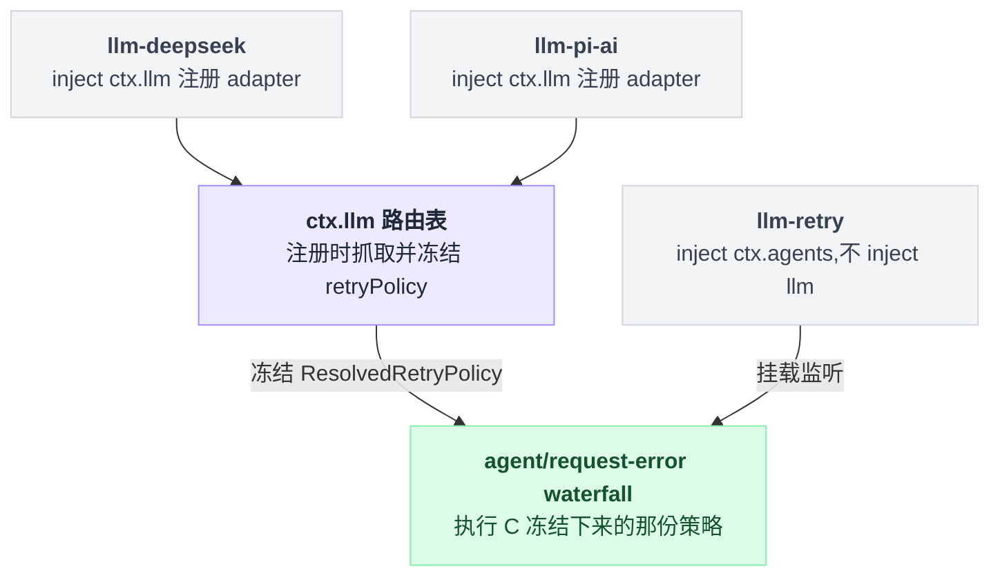
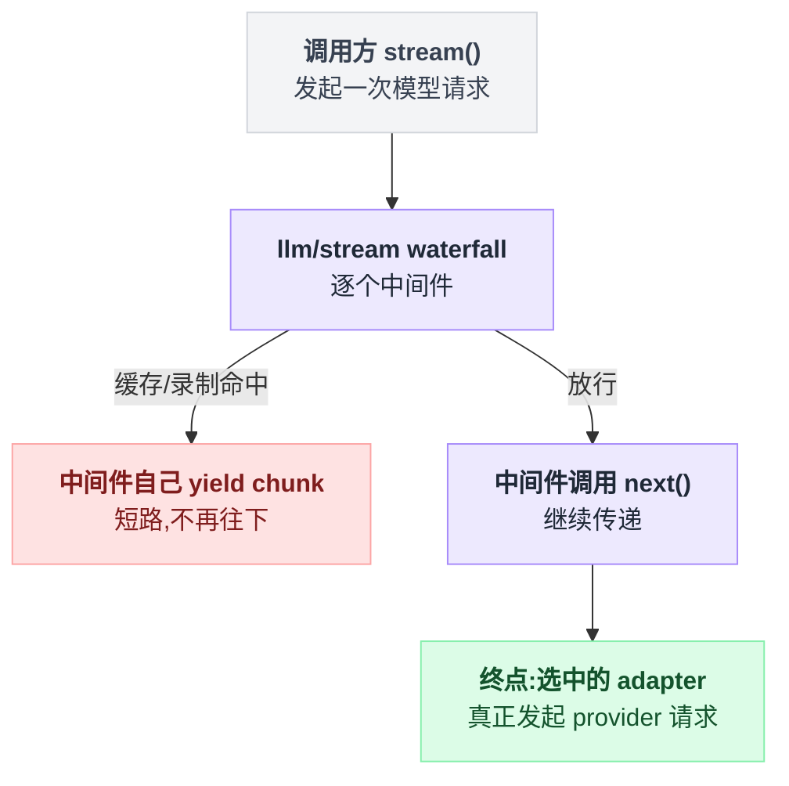

# llm

> `@deepseek-ai/dsh-llm` · bundle：`base` · 配置树 id：`llm` · v0.1.0-rc.5（commit `47f9438`）2026-08-14 核对

**一句话**：provider 中立的 LLM 词汇表加抽象服务——一个 adapter 注册表 + 一个可被 waterfall 拦截的流式调用 API，本组其余四个插件全都围着它转。

## 它在树上长什么样

```yaml
    - id: llm
      name: '@deepseek-ai/dsh-llm'
```

`packages/bundle/base/cordis.patch.yml:24-25`。没有 `inject`、没有 `config`——它是**被别人 inject** 的那一个：[llm-deepseek](./dsh-llm-deepseek.md)（`packages/llm/llm-deepseek/src/index.ts:42`）和 [llm-pi-ai](./dsh-llm-pi-ai.md)（`packages/llm/llm-pi-ai/src/index.ts:85`）的 `inject` 都写着 `llm`。[llm-retry](./dsh-llm-retry.md) **不** inject 它（它 inject 的是 `agents`），但执行的正是本服务在注册那一刻冻结下来的那份 retry policy。插件本体就是这个 Service 类本身（`packages/llm/llm/src/index.ts:947` 的 `export default LlmRuntime`）。这层"谁 inject 了它、谁只是消费它冻结下来的事实"容易搞混：



## 它注册了什么

| 类型 | 名字 | 说明 |
|---|---|---|
| service | `ctx.llm`（`LlmRuntime`） | 类在 `packages/llm/llm/src/index.ts:284`；`super(ctx, 'llm')` 在 `:293` |
| 事件（声明并派发） | `llm/stream`（**waterfall**） | 声明在 `src/index.ts:64`，派发在 `:921-926`。adapter 查找是 waterfall 的**终点续延**：监听者调 `next()` 才走到 adapter，也可以自己 yield chunk 把这次模型调用整个短路掉（`:54-55`） |


| 事件（声明并派发） | `llm/adapters-updated`（**emit**，无 payload） | 声明在 `src/types.ts:23`，派发在 `src/index.ts:302`，走 `events.dispatch('emit', …)` 逐个调用监听者。一个坏监听者不否决注册表变更，只有 `INVARIANT` 码的失败会在 fan-out 之后重抛（`README.md:33`） |

主插件**不监听**任何事件，也不注册工具、prompt 段或命令。同包另发布的 `./invariant` companion 才挂监听：`llm/stream` 前置校验流协议、`llm/adapters-updated` 后置校验注册表可读（`src/invariant.ts:88-89`）。

`ctx.llm` 的公开方法（`README.md:13-25`）：`registerAdapter` / `listProviders` / `registerConfigurableProviders` / `listConfigurableProviders` / `registerModelDiscovery` / `listModelDiscoveryNamespaces` / `discoverModels` / `providerRetryPolicy` / `listModels` / `resolveModelInfo` / `resolveCallConfig` / `prepareCall` / `stream`。

这个包同时是**类型与值的原产地**（都在 `packages/llm/llm/src/` 下）：`ContentBlock` 在 `types.ts:110`、`StreamChunk` 在 `types.ts:291`、`ToolSchema` 在 `types.ts:312`、`GenerateOptions` 在 `types.ts:320`、`LlmCallConfig` 在 `call-config.ts:23`、`BlockAssembler` 在 `assembler.ts:36`、`HarnessError` 在 `error.ts:13`、`LlmError` 在 `index.ts:83`，`Message` 与它的构造器在 `message.ts`。子系统设计文档是 `docs/subsystems/llm-streaming.md`。浏览器侧从依赖更轻的 `@deepseek-ai/dsh-llm/message` 子路径引值构造器，而不是带服务的包根（`README.md:52`；该 exports 子路径确在 `package.json:33-36`）。

## 配置项

无配置项。`LlmRuntime` 的构造函数只收 `ctx`（`packages/llm/llm/src/index.ts:292-294`），bundle 那一行也不带 `config`。

它的行为完全由「谁往它上面注册了什么」决定：

- **路由表**由 `registerAdapter(providers, adapter)` 写入，provider 名字独占，冲突抛 `LlmError('DUPLICATE_ADAPTER')`（`src/index.ts:380`）。
- **重试策略**在注册那一刻从 adapter 身上抓取并冻结成 `ResolvedRetryPolicy`（`src/index.ts:387-388`）；省略时用 normal 默认值：2 次重试，可重试码 `EMPTY_RESPONSE` / `RATE_LIMIT` / `SERVER` / `TIMEOUT` / `TRANSPORT`，退避 500 ms → 10 s、10% 抖动（`packages/llm/llm/src/retry-policy.ts:14-24`）。执行这份策略的是 [llm-retry](./dsh-llm-retry.md)，不是本服务。
- **默认调哪个 provider/model** 不归它管，归 [agent-default-model](./dsh-agent-default-model.md)。

## 模型看得见什么

README 的 Model Experience 一节原文（`README.md:86-88`）：

> None, as the service adds no model-bound text, schema, or message; it only materializes and logs an adapter-configured reasoning effort.

KV Cache effect（`README.md:90-92`）：

> Pass-through; the registry preserves the assembled request prefix, while the selected adapter and provider own cache reuse and routing boundaries.

## 什么时候你会想换掉它 / 怎么换

基本上不换。它是 seam 本身——换掉它等于换掉整套 `Message` / `StreamChunk` 词汇，agent loop、session log、每个 adapter 都要跟着改。真正的扩展点有两个：

1. **加 provider**：继承 `LlmAdapter`（唯一必须实现的是 `stream()`），在自己的插件里 `ctx.llm.registerAdapter([...], adapter)`。可选覆写 `providerRetryPolicy()` / `providerInfo()` / `listModels()` / `resolveModel()`（`README.md:47`）。
2. **拦调用**：`ctx.on('llm/stream', …)` 挂 waterfall 监听者做缓存、录制、改路由。注意 `README.md:48` 的告诫——在已经吐过 chunk 之后再重试的 wrapper 没有持久的 attempt 边界，所以 dsh 出厂的重试走 `agent/request-error` 而不是这里。

## 坑与边界

来自 `README.md:94-101` 的 Known Limitations and Deferred Work：

- **本服务不含重试、缓存、限流**：provider 注册时存了重试策略，但 `llm/stream` 仍然是**单次尝试**的调用包装。真正执行者是可选的 `@deepseek-ai/dsh-llm-retry`。
- **`GenerateOptions` 的采样参数只有 `temperature` / `maxTokens` / `stop`**，没有 `tool_choice`、`top_p`、penalty 类字段。
- **producer 未落地的变体一律不进词汇表**：`prefill`、每工具 `strict`、块级 `cache` 提示、`agent` 消息来源都被当作无生产者剪掉了。
- **`BlockAssembler` 只认核心块类型**：插件加的块类型如果其流没有被 `block-end` 关闭，`blocks()` 会抛。
- **`APP_IDENTITY.url` 指向一个还不存在的仓库**，发布前必须可达。
- **`GenerateOptions.sessionId` 是本地声明的 brand**：直接 import dsh-session 的 `SessionId` 会成环。

读源码补充：失败的归一化边界很讲究。最终 adapter 选择、同步 dispatch、迭代器构造、迭代四处的失败都被归一成流协议唯一的终态 `finish { kind: 'error' | 'aborted', failure }`；而 `llm/stream` 中间件、嵌套调用、adapter 清理、下游消费者的错误**仍然照抛**，因为那是插件/消费者的故障而不是模型请求的结果（`README.md:27`）。部分 delta 之后失败会留下未闭合的内容块，消费者要丢弃这段残缺输出。请求指向一条没人注册的 provider 路由时抛 `LlmError('NO_ADAPTER')`（`src/index.ts:818`）。

## 未确认

- ⚠️ `llm/stream` 的消费者清单（`docs/event-producer-consumer.md:39` 列了 `agent-loop`、`llm` 自己、`llm-replay`、`session-checkpoint-policy`、`session-title`）来自仓库自动生成的目录，我只核对了 `llm` 自己那条（`src/invariant.ts:88`），其余没有逐个进包确认。
