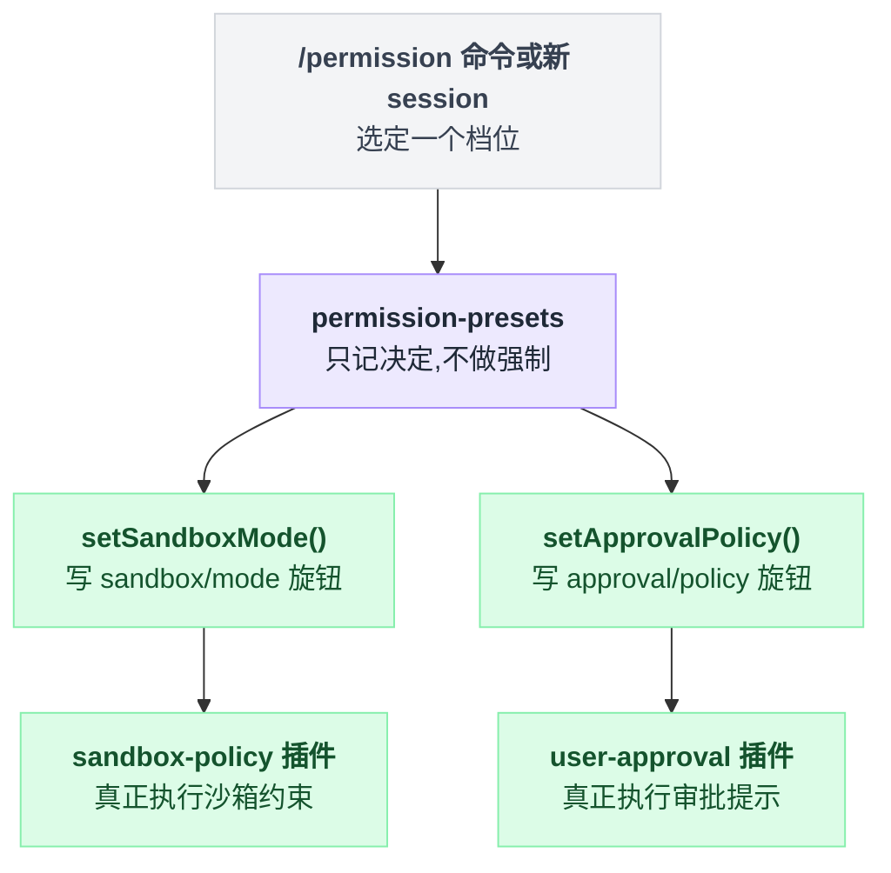
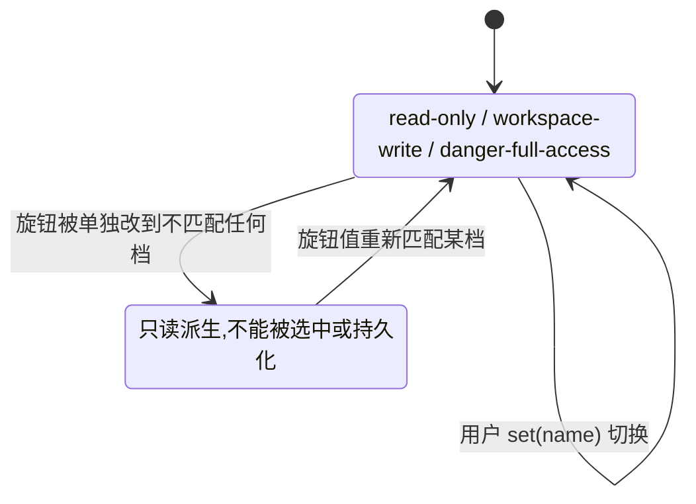

# permission-presets

> `@deepseek-ai/dsh-permission-presets` · bundle：`base` · 配置树 id：`permission` · v0.1.0-rc.5（commit `47f9438`）2026-08-14 核对。出处收在文末脚注。

**一句话**：把两个各自独立的执行旋钮——[sandbox-policy](./dsh-sandbox-policy.md) 的 `sandbox/mode` 与 [user-approval](./dsh-user-approval.md) 的 `approval/policy`——打包成用户能一次选好的命名档位，自己**不做任何强制**，只记录意图再通过两个旋钮各自的写路径落下去。

这个"不做强制"要认真理解：这个插件删掉之后，沙箱和审批照样拦你，只是没人再把它们捆在一起卖。



## 它在树上长什么样

配置树上这一段是这样[^1]：

```yaml
    - id: permission
      name: '@deepseek-ai/dsh-permission-presets'
      config:
        presets:
          read-only:
            sandbox: read-only
            approval: ask
          workspace-write:
            sandbox: workspace-write
            approval: ask
          danger-full-access:
            sandbox: danger-full-access
            approval: never
```

schema 自带的是两档表：`workspace-write` 和 `danger-full-access`[^2]。bundle 这里给了三档，看着像"加了一档 `read-only`"，其实是**整张表被换掉了**。

原因在 schemastery：dict 的默认值只在整个字段缺省时才生效，一旦你给了值，就是整表替换，不做逐 key 合并[^3]。

代价是那两档自带的 `name` / `description` 字段跟着默认表一起没了。客户端显示时会回落到表的 key[^4]，所以选择器上出现的就是 `read-only` / `workspace-write` / `danger-full-access` 这三个裸字符串。

`defaultPreset` 这行 bundle 也没给，于是走「匹配组合默认值」的推断路径[^5]。

## 它注册了什么

一共七样，坐标收在脚注里[^6]：

| 类型 | 名字 | 说明 |
|---|---|---|
| service | `ctx.permissionPresets` | `PermissionPresetService`，`super(ctx, 'permissionPresets')` |
| 依赖 | `static inject = ['shell', 'approval', 'sessions']` | bundle 那行 YAML 没写 inject，全靠这个静态字段 |
| 事件监听 | `session/created`（**emit**，非 waterfall） | 新 session 创建时钉入初始权限事实；挂载时还会把已经活着的 session 扫一遍 |
| session 事件 | `permission/preset` | log-only 的用户意图记录，不进模型 transcript |
| 可选子件：session projection | `permissions` | 仅当 `ctx.sessionProjections` 已组合时注册；fold 三个整值旋钮事件，view 出「表内选项 + 仅当前可见的 `custom`」 |
| 可选子件：命令 | `/permission` | 仅当 `ctx.commands` 已组合时注册。空参数报当前档位与可选列表，带参数即切换 |
| settings 段 | 命名空间 `permission` | `settingsNamespace('permission')`，字段只有 `defaultPreset` |

## 三档语义与 custom

切档位的写入顺序是固定的[^7]：

```
set(session, name):
    if name != 当前档位:
        append permission/preset 事件        // 档位没变就一条都不写
    if 目标 sandbox != 当前有效 sandbox:
        setSandboxMode(...)                  // 逐个旋钮比较有效值
    if 目标 approval != 当前有效 approval:
        setApprovalPolicy(...)
```

也就是说重选当前已经生效的档位，是一次彻底的空操作，事件流上什么都不留。

反过来读当前档位是一次推断，判定顺序有三步[^8]：

```
current(events):
    if 上次记录的 permission/preset 仍然匹配当前旋钮值:
        return 它                            // 记录这条事件的全部理由
    if 表中存在匹配当前旋钮值的档:
        return 第一条匹配
    return custom
```

第一步之所以排在前面，是为了应付两档共享同一组旋钮值的情况——光看旋钮分不出用户当初选的是哪档，得靠那条 `permission/preset` 保住意图。

`custom` 是**只读派生态**：可以显示为当前值，但不能被选中，也不会成为事件载荷[^9]。



新 session 的钉入分两种情况：

```
pinInitialPermission(session):
    if session 是干净的新会话:
        用当前用户默认档，一次写三条事件
    else:                                    // 带种子，或已部分初始化
        保留既有有效值，只补缺的那几条
        // session/end-seed 标记的空种子也算「已表态」，不覆盖
```

这里有个容易踩的点：**权限是在会话创建那一刻钉死的**，之后你去改设置，已经存在的 session 一个都不受影响[^10]。

构造期有三处硬性拒绝，命中直接抛[^11]：

- 表里出现名为 `custom` 的 key
- 挂载的 shell executor 不做约束，即 `ctx.shell.sandboxMode === undefined`
- 组合默认值匹配不到任何档位，且没显式给 `defaultPreset`

## 配置项

| 字段 | 类型 | schema 默认 | bundle 实际给的 | 作用 |
|---|---|---|---|---|
| `presets` | `Record<string, PresetSpec>` | `workspace-write` + `danger-full-access` 两档（带 name/description） | 三档，见上 | 档位表：name → `{ sandbox, approval, name?, description? }` |
| `defaultPreset` | `string` | 无（省略时推断） | 未给 | 新 session 的默认档；也是 settings 里唯一可改的字段 |

## 模型看得见什么

README 的 Model Experience 原文是这样[^12]：

> Indirectly, through `dsh-user-approval` and `dsh-tool-bash`, which render the approval-policy prompt, switch notice, and sandboxed tool outcomes selected by this service's knob events; `permissionPresets/preset` itself is log-only.

KV Cache effect：`No direct invalidation; the named consumer owns any request-prefix changes.`[^13]

换句话说模型永远不知道「档位」这个概念，只会看到 [sandbox-policy](./dsh-sandbox-policy.md) 和 [user-approval](./dsh-user-approval.md) 各自那句策略文本变了。

（引文里的 `permissionPresets/preset` 是 README 的旧名，源码是 `permission/preset`，见下节。）

## 什么时候你会想换掉它 / 怎么换

- **改档位表**：直接改 `permission` 那行的 `config.presets`。想让客户端选择器上显示中文说明，就把 `name` / `description` 补回去——bundle 现在这三档是没有的。
- **改新会话默认档**：给 `config.defaultPreset`，或者让用户在 settings 的 `permission` 段里改（改动在**下一个 session 创建时**才被读取）。
- **不要它**：卸掉后 `sandbox/mode` 与 `approval/policy` 依然各自工作，只是没人把它们捆在一起、也没人给新 session 钉初始值——两个旋钮就退回各自 config 的部署默认。
- 反过来注意：它 `inject` 了 `shell`，所以在没有约束型 shell executor 的组合（例如把 `bash-sandbox` 换成不约束的实现）里它会**直接抛错**，而不是安静退化。

## 坑与边界

README 的 Known Limitations and Deferred Work 这样写[^14]：

- **只捆两个机制旋钮**——`PresetSpec` 里还没有 agent/profile 的选择。
- **`custom` 只能被推导出来**——调用方可以从一个不匹配的旋钮组合切走，但没法通过本服务瞄准或持久化一个具名的自定义档。
- **档位表是进程级的**——配置在插件生命周期内固定，要改可选档位必须重载插件。
- **存下来的默认档必须还在表里**——把被引用的档位删掉，会让 Permission 设置注册一直失败，直到 `settings.yaml` 里的相应段被更新或重置。

读源码补两条。

第一条：可选的 `./invariant` 伴生插件会校验每条 `permission/preset` 事件命名的档位仍然可解析，不在表里就 fail[^15]——这正是上面最后一条限制在事件层面的体现。

第二条：**README 的三处命名已过时，按源码写。** 三处都有独立佐证，不是我一个人的判断：

| 东西 | README 写的 | 源码是 |
|---|---|---|
| 事件 | `permissionPresets/preset` | `permission/preset` |
| 命令 | `/permissionPresets` | `/permission` |
| settings 命名空间 | `permissionPresets` | `permission` |

三处的坐标与独立佐证坐标都收在脚注里[^16]。

---

## 出处

[^1]: 配置树条目：`packages/bundle/base/cordis.patch.yml:193-205`。
[^2]: schema 自带的两档表：`packages/interaction/permission-presets/src/index.ts:167-176`。
[^3]: schemastery dict 默认值的整表替换语义：`vendor/schemastery/src/index.ts:474-484`、`719-736`。
[^4]: 回落到表 key 的 `optionOf()`：`vendor/schemastery/src/index.ts:366`。
[^5]: 匹配组合默认值的推断路径：`packages/interaction/permission-presets/src/index.ts:195-196`。
[^6]: service `ctx.permissionPresets`（`PermissionPresetService`，`super(ctx, 'permissionPresets')`）：`packages/interaction/permission-presets/src/index.ts:186`；依赖 `static inject`：`:180`；`session/created` 监听与挂载时补扫已存活 session：`:220-225`，其派发模式（emit）见 `packages/core/session/src/index.ts:52`；`permission/preset` session 事件：`src/index.ts:50`；可选子件 session projection `permissions`：`:243-252`；可选子件命令 `/permission`：`:257-277`；settings 段命名空间与 `defaultPreset` 字段：`:73`、`208-218`。
[^7]: `apply()` 里固定的写入顺序：`packages/interaction/permission-presets/src/index.ts:380-392`。
[^8]: `current(events)`：`src/index.ts:304-306`；判定逻辑在 `derive()`：`src/index.ts:309-321`。
[^9]: `custom` 不可被选中、不进事件载荷：`src/index.ts:66-70`。
[^10]: `pinInitialPermission()`：`src/index.ts:400-430`。
[^11]: 三处拒绝依次在 `packages/interaction/permission-presets/src/index.ts:189-191`（表里出现名为 `custom` 的 key）、`:192-194`（挂载的 shell executor 不做约束）、`:197-199`（组合默认值无匹配且未显式给 `defaultPreset`）。
[^12]: `packages/interaction/permission-presets/README.md:17`。
[^13]: 同文件 `README.md:21`。
[^14]: `packages/interaction/permission-presets/README.md:23-28`。
[^15]: `packages/interaction/permission-presets/src/invariant.ts:16-18`。
[^16]: 事件：README 写 `permissionPresets/preset`，见 `packages/interaction/permission-presets/README.md:7`、`:9`、`:17`；源码是 `permission/preset`，见 `src/index.ts:50`；独立佐证是自动生成的 `docs/persistence-catalog.md:501`、`docs/capability-seams.md:454`、`docs/subsystems/permission-presets.md:66`。命令：README 写 `/permissionPresets`，见 `README.md:13`；源码是 `/permission`，见 `src/index.ts:259`；独立佐证是 web 客户端提交的命令字符串 `packages/client/ui-permission-presets/src/client/index.ts:164`。settings 命名空间：README 写 `permissionPresets`，见 `README.md:9`、`:28`；源码是 `permission`，见 `src/index.ts:73`；独立佐证是命名空间必须匹配小写 kebab-case（`packages/settings/settings/src/index.ts:19`、`26-31`），`permissionPresets` 根本过不了校验。
