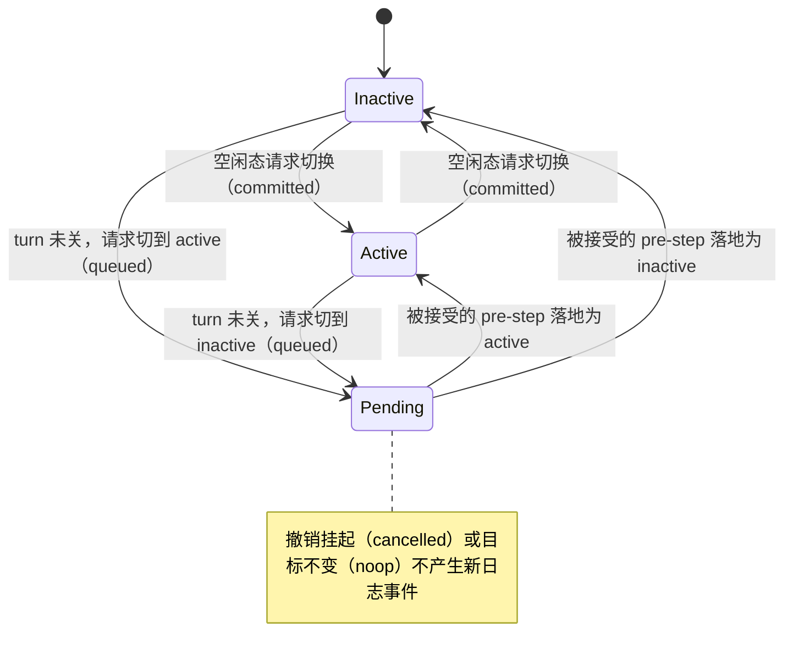
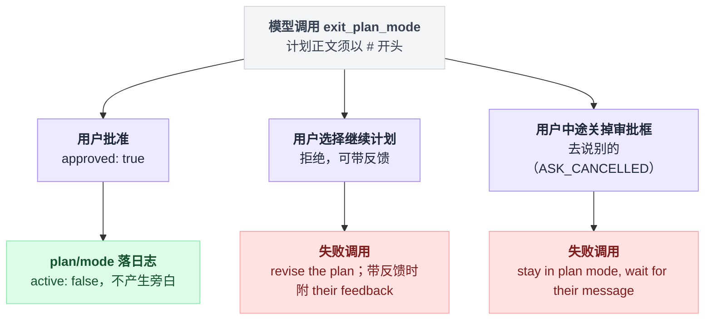

# plan-mode

> `@deepseek-ai/dsh-plan-mode` · bundle：`base` · 配置树 id：`plan-mode` · v0.1.0-rc.5（commit `47f9438`）2026-08-14 核对。出处收在文末[脚注](#出处)，点角标可跳转。

> ⚠️ **本篇未通过对抗式引用核验**：起草已完成，但逐条打开源码比对行号/字段名/英文引文的那一遍因会话额度耗尽未执行。文中脚注坐标与配置字段请以源码为准，核验后本行会被移除。

「计划模式」这四个字容易让人先猜一个方向：开着的时候，模型是不是就写不了文件了？

不是的。**一句话**：把「计划模式」做成一条从会话日志折叠出来的 per-agent 状态——开着时往系统提示插一段部署方写死的 guidance，靠 `exit_plan_mode` 走人工审批退出；它只劝导，不强制。

「只劝导，不强制」这句不是我的评价，是 README 开门见山自己划的边界：

> `Plan mode is soft guidance; sandbox mode and approval policy enforce restrictions independently and do not read or write plan state.`

真正拦得住写操作的是 sandbox 和 approval，不是这个插件[^1]。

## 它在树上长什么样

```yaml
    - id: plan-mode
      name: '@deepseek-ai/dsh-plan-mode'
      config:
        section: |
              You are in plan mode. Stay in plan mode until exit_plan_mode succeeds or the user switches the session mode. Imperative language to implement changes means plan the implementation, not execute it. A user's conversational agreement — including an answer confirming something you asked — approves nothing and does not end plan mode; fold the confirmed decision into the plan and submit it through exit_plan_mode.
```

上面贴的只是开头一小截。`section` 在 YAML 里是个 7 段的块标量，这里只有第 1 段（269 行），其余 6 段分别讲[^2]：

- 先探查、别改文件
- 工具目录跨模式不变，这些规则压倒后面任何鼓励用变更工具的说明
- 能查的别问用户
- 计划要 decision-complete
- `exit_plan_mode` 必须是那一轮唯一且最后一个工具调用

这一行**没写 `inject`**，第一眼会以为它不依赖任何服务。其实它依赖 `tools` 和 `systemPrompt` 两项能力，依赖声明写在源码里[^3]。

还有一处容易看漏：`web-app` bundle 在宿主平面把它整个关掉了（`disabled: true`），改由各个 agent preset 自己挂一份，配置文案略有差异[^4]。

## 它注册了什么

| 类型 | 名字 | 说明 |
|---|---|---|
| service | `ctx.planMode`（`PlanModeController`） | 只有 `get` 与 `set` 两个方法——`get` 按 agent 查，`set` 按 agent 与目标激活态写[^5] |
| 事件监听 | `agent/pre-step`（**waterfall**） | 先放行、等下游跑完；下游接受了这一步才把挂起的 `plan/mode` 落日志，并可能往 `decision.messages` 追加一条切换通知[^6] |
| 会话事件 | `plan/mode`（`{ active: boolean }`） | log-only、非 surface、整值替换，last-write-wins[^7] |
| prompt 段 | `plan:policy`，order **50** | 非激活态返回空串，不产生任何 token[^8] |
| 工具 | `exit_plan_mode` | 无论开关都注册，保证工具目录跨模式不变[^9] |
| 命令 | `/plan [off\|message]` | 仅当 `ctx.commands` 已挂载才注册[^10] |
| projection unit | `plan` → `{ active, pending }`，`stateVersion: 1` | 仅当 `ctx.sessionProjections` 已挂载[^11] |
| 伴生插件 | `./invariant`（`plan-mode-invariant`） | 只校验 `plan/mode.active` 是不是 boolean；默认 bundle 的 patch.yml 里没有这一行[^12] |

表里最值得停一下的是那个 waterfall 监听器。它的顺序是反直觉的——不是「先记状态再放行」，而是「先放行、下游认了才记」：

```
on agent/pre-step (waterfall):
    await next()                        // 先把下游跑完
    if 下游没 accept 这一步:  return     // 这一步作废，什么都不记
    if 有挂起的 plan/mode 选择:
        session.append('plan/mode', 挂起的值)
        可能往 decision.messages 追加一条切换通知
```

也就是说，挂起的模式切换是搭这一步的便车落地的，没有被接受的步就没有落地机会[^6]。

`agent/pre-step` 的 waterfall 派发方与消费方名单见脚注[^13]。派发模式的通用讲法见 [11 章 waterfall 专章](../11-waterfall专章.md)。

## 配置项

| 字段 | 类型 | 默认值 | 作用 |
|---|---|---|---|
| `section` | `string` | **无默认，必填** | 激活时渲染成 `plan:policy` 段的原文 |

只有一个字段，而且校验很凶。`resolveConfig` 在插件加载期就把非字符串、空白串、以及任何多余 key 抛错，不做静默忽略[^14]。

README 原文写得很直接[^15]：`section is required and non-empty. Unknown keys fail at load. The package does not accept arbitrary named modes, tool filters, sandbox settings, or approval policy.`

## 状态什么时候真正落日志

调用 `set` 传入新目标态，不等于状态就立刻变了。四个判据依次过一遍：

```
set(agent, active):
    if 目标态 == 当前态 或 == 已挂起态:      return 'noop'
    if 存在一个方向相反的挂起选择:            撤销它 → return 'cancelled'
    if hasOpenTurn(agent):                  挂起 → return 'queued'
    session.append('plan/mode', { active })  return 'committed'
```

四种返回值的官方说法如下[^16]：

| 返回 | 触发条件 |
|---|---|
| `committed` | 日志里没有未闭合的 turn（idle 态），当场把新状态写进日志 |
| `queued` | turn 开着，选择挂起，等下一个被接受的 in-turn pre-step |
| `cancelled` | 撤销了一个反向的挂起选择，日志态本来就对 |
| `noop` | 目标态等于当前态或已挂起态 |

这里有个坑：判断「现在闲不闲」用的是 `hasOpenTurn`[^17]，**不能用 agent 的 status**——agent 的 status 在 post-turn checkpoint 期间仍然是 `running`，看 status 会把 idle 误判成忙。

四种返回值本质是同一个状态机在 idle / 挂起两种处境下的落地方式：



## 模型看得见什么

**激活时**，order 50 的位置多出 `section` 全文；非激活时一个 token 都不加[^18]。

**`exit_plan_mode` 的 schema 是常驻的**——README 原文写的是 `The stable schema is available in both states`，对应表述是 `remains available in both states; execution outside plan mode fails`：schema 一直在，但计划模式之外执行会失败[^19]。

调用之后有三条分支，模型收到的东西完全不同：

| 分支 | 模型收到什么 |
|---|---|
| 批准 | 返回 `{ approved: true }`，渲染成 `Plan approved — plan mode exited; carry out the plan starting with your next step.` |
| 拒绝（继续计划） | 失败调用：`The user chose to keep planning; revise the plan and present it again.`；带反馈时换成 `The user chose to keep planning; their feedback: <feedback>` |
| 用户中途关掉审批框去说别的（`ASK_CANCELLED`） | 失败调用：`The user dismissed the plan review to speak instead; stay in plan mode, stop here, and wait for their message.` |

三条分支各自的出处见脚注[^20]。

第三条为什么不复用通用的取消消息，README 特意解释过[^21]：那条通用消息会提到 `ask_user_question`，而模型压根没调过这个工具。

三条分支的落点差别很大，批准是唯一走到「日志变更 + 无失败」的路径：



**`/plan` 命令本身不进模型历史**[^22]。但 `/plan xxx` 里的 `xxx` 会经 `agent.steer` 变成下一步的一条普通 user 文本块[^23]——命令消失了，你说的话还在。

**切换旁白只在真的换了模式时才追加**：

```
if 上一条 request/header 描述的是另一个模式:
    追加 "The user switched this session to plan mode."
         或 "The user switched this session back to the default mode."
else:
    什么都不加            // 避免重复告知
```

实现见脚注[^24]。

最后有一处跨插件的硬约束。默认 `section` 里有两条跟同组插件直接相关的硬话[^25]。第一条：

> `Do not use todo_write to track this planning phase: it tracks implementation after an approved plan, while the plan itself belongs in exit_plan_mode.`

也就是说 [tool-todo](./dsh-tool-todo.md) 的 `todo_write` 在计划期是被提示层显式禁用的。

第二条：`The tool catalog stays the same across modes for request-cache stability.` —— 这就是为什么 `exit_plan_mode` 在不激活时也照样注册。

## 什么时候你会想换掉它 / 怎么换

| 诉求 | 能不能 | 怎么办 |
|---|---|---|
| 只想改文案 | 能 | 覆盖 `section` |
| 想让它真能拦住写操作 | 不能 | 去配 sandbox 和 approval |
| 想整个关掉 | 能 | patch 里写 `disabled: true` |
| 想加多个命名模式 / 工具过滤 | 不能 | 另写插件 |

`section` 是唯一配置面，preset 各自挂一份就是这个用法。

「真能拦住」这条换不了：README 明说 `Plan mode guides rather than enforces`[^26]。要硬拦得去配 sandbox（`docs/subsystems/sandbox.md`）和 approval（`docs/subsystems/approval.md`），那两套不读也不写 plan 状态。

关掉的写法是 patch 里写 `- id: plan-mode` 加 `disabled: true`，web-app bundle 就是这么干的[^4]。关掉之后 `exit_plan_mode` 和 `/plan` 一起消失，`plan` projection key 直接缺席——注意不是变成某个空值，源码写得很明确[^27]：`Capability absence (plan-mode not composed) is the key's absence, never a value.`

命名模式和工具过滤这个包不收[^15]，只能另写插件。

## 坑与边界

README 的 Known Limitations 逐条如下[^28]：

- 只劝不拦（见上）。
- **turn 最后一个被接受的 pre-step 之后做的选择，如果进程先退出就丢了**，UI 必须重新应用一次。
- fork 出来的 agent 继承日志里的 plan 态，**新 spawn 的 agent 一律 inactive**，创建时没有 plan 选项。
- 别人家的 live child **打不开 `exit_plan_mode` 审批**，失败消息会让它把未决决策写进最终结果；但仅靠 fork 血缘不能阻止一个被 resume 成 runtime root 的会话去开审批。
- **只有 Web UI 有专门的 `plan-review` 渲染器**，别的交互 provider 会退化成通用选项流；这个渲染意图纯粹是呈现层的选择，两种渲染下工具读到的答案一样[^29]。

读源码另外发现的：

- 审批期间插件被 HMR 卸载会失败并要求重新提交——错误文案原话是 `the plan-mode service was reloaded while the plan was under review; present the plan again`[^30]，因为没有 pre-step 监听器就永远追加不了那条 `plan/mode`。
- 计划正文必须以 `# ` 开头，校验用的正则是 `/^#\s+\S/`[^31]；只有 `##` 不行。
- `pendingIntents` 是 `WeakMap<Session, …>`[^32]，进程内状态，不落盘——这正是上面「进程退出就丢」那条限制的来源。
- 批准退出时写的是 `{ active: false, narrate: false }`[^33]，所以退出不产生旁白：工具结果自己已经说了。

## 把这一章串起来

- **它只劝导，不强制**——README 自己划的界线，sandbox 和 approval 各自独立生效，不读也不写 plan 状态；
- **状态是从日志折出来的一条 per-agent 值**——真正的写路径只有一条，`plan` projection 也好、`/plan` 不带参数时打印的当前值也好，都是对同一条日志的不同投影；
- **落地时机反直觉**——waterfall 监听器先放行、等下游接受了这一步才写日志，挂起的切换选择是「搭便车」落地的，不是「先记后放」；
- **判断「闲不闲」专用一个内部函数，不能看 status**——status 在 checkpoint 期间仍是 running，会把 idle 误判成忙；
- **`exit_plan_mode` 的 schema 常驻，但退出只有一条真正生效的路径**——批准是唯一走到「日志变更 + 无失败」的分支，其余两个分支都在原地打转；
- **`/plan` 本身是纸面命令**——不进模型历史，但夹带的正文会绕道变成一条用户消息；
- **它跟 `todo_write` 有一条明文互斥**——计划阶段提示层直接禁用后者，理由写在同一段 `section` 里；
- **关掉它，`plan` 这个 key 干脆消失**——不是变成空值，这一点在类型声明里写死了。

配置面只有一个 `section` 字段；真正的强制力永远在 sandbox 和 approval 那边，不在这个插件里。

---

## 出处

[^1]: 引文出自 `packages/plan/plan-mode/README.md:5`。
[^2]: `section` 全文 7 段，此处只贴第 1 段（269 行）；完整位置见 `packages/bundle/base/cordis.patch.yml:265-279`。
[^3]: 依赖声明 `static inject = ['tools', 'systemPrompt']`：`packages/plan/plan-mode/src/index.ts:185`。
[^4]: web-app bundle 在宿主平面关闭该插件（`disabled: true`）：`packages/bundle/web-app/cordis.patch.yml:348-349`；由各 agent preset 自行挂载一份、配置文案略有差异：`apps/cli/config/agent-presets/code/agent.cordis.yml:117-125`。
[^5]: service `ctx.planMode`（`PlanModeController`）：`packages/plan/plan-mode/src/index.ts:184`。
[^6]: waterfall 监听器的注册：`packages/plan/plan-mode/src/index.ts:205`；落地逻辑：`:209-221`。
[^7]: 会话事件 `plan/mode`（`{ active: boolean }`）：`packages/plan/plan-mode/src/index.ts:46-55`。
[^8]: prompt 段 `plan:policy`，order 50：`packages/plan/plan-mode/src/index.ts:225-233`。
[^9]: 工具 `exit_plan_mode` 的注册：`packages/plan/plan-mode/src/index.ts:305`。
[^10]: 命令 `/plan [off|message]`：`packages/plan/plan-mode/src/index.ts:269-303`。
[^11]: projection unit `plan`：`packages/plan/plan-mode/src/index.ts:244-266`。
[^12]: 伴生插件 `plan-mode-invariant`：`packages/plan/plan-mode/src/invariant.ts:20-26`。
[^13]: `agent/pre-step` 的 waterfall 派发方与消费方名单：`docs/event-producer-consumer.md:18`。
[^14]: `resolveConfig`：`packages/plan/plan-mode/src/index.ts:106-119`。
[^15]: 引文出自 `packages/plan/plan-mode/README.md:38`：`section is required and non-empty. Unknown keys fail at load. The package does not accept arbitrary named modes, tool filters, sandbox settings, or approval policy.`
[^16]: 四种返回值：`packages/plan/plan-mode/src/index.ts:425-445`。
[^17]: `hasOpenTurn`：`packages/plan/plan-mode/src/index.ts:158-165`。
[^18]: `packages/plan/plan-mode/README.md:48`、`:58`。
[^19]: 引文出自 `packages/plan/plan-mode/README.md:82`：`remains available in both states; execution outside plan mode fails`。
[^20]: 三条分支依次出处：`packages/plan/plan-mode/src/index.ts:319`（批准）、`:372-374`（拒绝）、`:357-359`（用户中途关掉审批框）。
[^21]: `packages/plan/plan-mode/README.md:17`。
[^22]: `packages/plan/plan-mode/README.md:68`。
[^23]: `agent.steer()`：`packages/plan/plan-mode/src/index.ts:294`。
[^24]: `packages/plan/plan-mode/src/index.ts:463-474`。
[^25]: `packages/bundle/base/cordis.patch.yml:273`。
[^26]: 引文出自 `packages/plan/plan-mode/README.md:94`：`Plan mode guides rather than enforces`。
[^27]: 引文出自 `packages/plan/plan-mode/src/types.ts:11-17`：`Capability absence (plan-mode not composed) is the key's absence, never a value.`
[^28]: Known Limitations 全段：`packages/plan/plan-mode/README.md:94-98`。
[^29]: `intent: { kind: 'plan-review', approve: APPROVE_LABEL }`：`packages/plan/plan-mode/src/index.ts:347`。
[^30]: 引文出自 `packages/plan/plan-mode/src/index.ts:366`：`the plan-mode service was reloaded while the plan was under review; present the plan again`。
[^31]: 校验正则 `/^#\s+\S/`：`packages/plan/plan-mode/src/index.ts:327`。
[^32]: `pendingIntents` 类型 `WeakMap<Session, …>`：`packages/plan/plan-mode/src/index.ts:195`。
[^33]: 批准退出写入 `{ active: false, narrate: false }`：`packages/plan/plan-mode/src/index.ts:379`。
