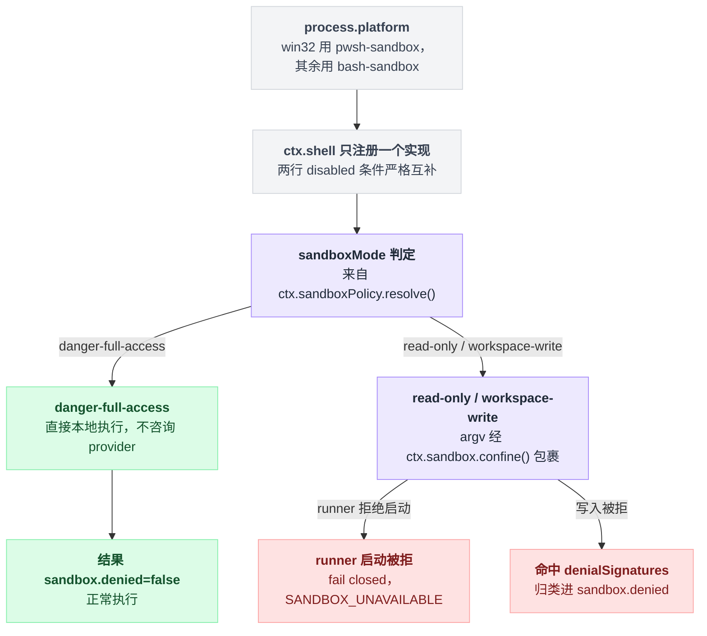

# pwsh-sandbox

> `@deepseek-ai/dsh-pwsh-sandbox` · bundle：`base` · 配置树 id：`pwsh-sandbox` · v0.1.0-rc.5（commit `47f9438`）2026-08-14 核对。出处收在文末脚注。

**一句话**：[bash-sandbox](./dsh-bash-sandbox.md) 的 PowerShell 孪生体——Windows 上 `ctx.shell` 的提供者，把 `pwsh -NoLogo -NoProfile -NonInteractive -Command <command>` 的整条 argv 交给 `ctx.sandbox` 包住再 spawn。

## 它在树上长什么样

```yaml
- id: pwsh-sandbox
  name: '@deepseek-ai/dsh-pwsh-sandbox'
  disabled: !!js process.platform !== 'win32'
```

关键在 `disabled` 这一行：它与 bash 侧的条件严格互补。base 里两行同时存在，运行时只有一行活着，所以 `ctx.shell` 永远只有一个实现。

还要注意这一行**没有 config 块**，用的是继承来的默认值。bash 侧那一行还额外覆写了 `timeoutMs: 60000`，pwsh 这行没有[^1]。

## 它注册了什么

| 类型 | 名字 | 说明 |
|---|---|---|
| service | `ctx.shell` | 经基类 `ShellExecutor` 注册[^2]；继承自 `PwshLocalExecutor` |
| 事件监听 | 无 | 与 bash 侧一致 |

覆写的方法与 bash 侧逐行对齐：`sandboxMode`、`resolve()`、`run()`、`start()`、`onProcessDone()`、私有 `confine()`。源码里用 `jscpd:ignore-start` 标注了这是刻意镜像，不是没抽干净[^3]。

与 bash 侧唯一的实质差异落在 `confine()` 上——bash 侧把 argv 写死了，pwsh 侧转身去问父类要：

```
# bash-sandbox 的 confine
argv = ['bash', '-c', command]

# pwsh-sandbox 的 confine
argv = this.argv(spec)
     = [pwshPath, '-NoLogo', '-NoProfile', '-NonInteractive', '-Command', preamble + command]
```

两边的 `confine()` 实现与父类拼出来的那条 argv，出处见脚注[^4]。

## 配置项

`export type Config = LocalConfig`[^5]，逐字继承 `@deepseek-ai/dsh-pwsh-local`：

| 字段 | 类型 | 默认值 | 作用 |
|---|---|---|---|
| `cwd` | string | 无 | 命令默认工作目录 |
| `timeoutMs` | number | `120000` | 前台默认超时 |
| `maxTimeoutMs` | number | `600000` | 逐调用超时覆写上限 |
| `maxOutputBytes` | number | `64000` | 每条流的内存输出上限 |
| `maxSpillBytes` | number | `64 * 1024 * 1024` | 每条流的 spill 文件上限 |
| `graceMs` | number | `3000` | kill 升级宽限 |
| `pwshPath` | string | 无（省略时按已知安装位置与 PATH 顺序探测） | 显式指定的 pwsh 可执行文件 |

字段来源与 `pwshPath` 的探测顺序说明见脚注[^6]。

找配置的人容易在这里扑空：沙箱模式与 workspace root **不在这里**，归 `ctx.sandboxPolicy`[^7]。

## 行为

一条命令进来，先看模式，再决定要不要过沙箱：

```
mode = ctx.sandboxPolicy.resolve()

if mode == 'danger-full-access':
    直接走本地执行器，压根不咨询 provider
    结果带上 sandbox: { mode, denied: false }
else:                                  # read-only / workspace-write
    argv = ctx.sandbox.confine(argv)   # 包一层
    if runner 起不来:  fail closed
    if 写入被拒:       按后端 denialSignatures 分类进 sandbox.denied
```

| 情况 | 结果 |
|---|---|
| `danger-full-access` | 直接走本地执行器，不咨询 provider；结果带 `sandbox: { mode, denied: false }`[^8] |
| `read-only` / `workspace-write` | argv 经 `ctx.sandbox.confine()` 包裹；runner 启动被拒 → fail closed（前台抛 `SANDBOX_UNAVAILABLE`，后台盖 `runnerFailed` 事实）；被拒的写入按后端 `denialSignatures` 分类进 `sandbox.denied`[^9] |

限制的实质是平台中立的：Windows 上 `ctx.sandbox` 接缝解析成 ACL 受限令牌 runner 链（`@deepseek-ai/dsh-sandbox-windows-acl`），Linux/macOS 上是 bwrap/Landlock/Seatbelt[^10]。

从平台选中哪个 shell provider，到一条命令最终怎么被放行或拒绝，串起来是这样一条链：



## 模型看得见什么

本包不注册工具、不注册 prompt 段。

模型看到的只有两样东西：被限制命令**自身的 stderr**（例如 Windows ACL runner 下的 `Access to the path '...' is denied.`），以及 [tool-pwsh](./dsh-tool-pwsh.md) 把分类后的拒绝转成的标准权限拒绝面[^11]。

README 把这句话写死了：「No model-visible text beyond the command's stderr and the tool layer's standard denial surface.」[^12]

## 什么时候你会想换掉它 / 怎么换

- **要裸 pwsh 执行器**：把 `name` 换成 `@deepseek-ai/dsh-pwsh-local`；工具层发现 `sandboxMode` 为 undefined 后会自动收起升权字段。
- **要放开限制**：改 `sandbox-policy` 那一行的 `mode`（或 `DSH_PERMISSION_MODE` 环境变量），而不是动这一行。
- **要在非 Windows 上跑**：改这一行的 `disabled` 表达式，同时把 `pwsh-sandbox` 与 `bash-sandbox` 的互斥关系重新捋一遍——两个都活着会因为 `ctx.shell` 重复注册直接抛[^13]。

## 坑与边界

- **Windows 上读是完全不受限的**：ACL runner 只限制写；读边界的说明在 `@deepseek-ai/dsh-sandbox-windows-acl`[^14]。
- **workspace-write 的 temp 授权是私有的**：按「活跃 session / workspace 对」私有，无 agent 的调用每次拿一个新的私有目录。环境里的 temp 根**永远不授予**，runner 会在 spawn 前把 TMP/TEMP 改写到私有目录[^15]。
- **read-only 只能算 partial**：受限令牌必须保留 Everyone，凡是 DACL 给 Everyone 写权限的对象仍属于环境权限，包括 NUL 设备的兼容打开。顺带一提，PowerShell 的 `> $null` 重定向照常工作，因为它并不打开 NUL[^16]。
- **语言模式塌陷**：read-only 下 pwsh 会因为 temp 写入被拒而落进 ConstrainedLanguage，且无法从内部提升。这条限制记在 [tool-pwsh](./dsh-tool-pwsh.md) 的 README 里，因为它由工具描述教给模型[^17]。
- **runner 归因与拒绝分类的保守性与 bash 侧完全相同**：拒绝是从「非零退出 + stderr 命中签名」推断出来的，误判/漏判都可能[^18]。

## 相关

[tool-pwsh](./dsh-tool-pwsh.md) 是它的模型侧消费者与升权审批持有者；[bash-sandbox](./dsh-bash-sandbox.md) 是同一份代码的 POSIX 侧；进程机制来自 [subprocess-local](./dsh-subprocess-local.md)。

---

## 出处

[^1]: 树上这三行：`packages/bundle/base/cordis.patch.yml:184-186`；bash 侧的 `timeoutMs` 覆写见同文件对应的 bash-sandbox 行；注入清单 `static override inject = ['subprocess', 'sandbox', 'sandboxPolicy']`：`packages/shell/pwsh-sandbox/src/index.ts:53`。
[^2]: `packages/shell/shell/src/index.ts:67`。
[^3]: `jscpd:ignore-start` 标注：`packages/shell/pwsh-sandbox/src/index.ts:51`。
[^4]: bash-sandbox 硬编码 argv：`packages/shell/bash-sandbox/src/index.ts:178`；pwsh-sandbox 调 `this.argv(spec)`：`packages/shell/pwsh-sandbox/src/index.ts:184`；父类拼出那条 argv：`packages/shell/pwsh-local/src/index.ts:218`。覆写方法对应行号：`sandboxMode` `:79`、`:83-85`；`resolve()` `:92-94`；`run()` `:96-122`；`start()` `:124-150`；`onProcessDone()` `:156-173`；`confine()` `:183-185`（均在 `packages/shell/pwsh-sandbox/src/index.ts`）。
[^5]: `packages/shell/pwsh-sandbox/src/index.ts:40`。
[^6]: 字段来源：`packages/shell/pwsh-local/src/index.ts:131-139`；`pwshPath` 探测顺序说明：`:71-77`。
[^7]: `packages/shell/pwsh-sandbox/src/index.ts:33-38`。
[^8]: README.md:11；`packages/shell/pwsh-sandbox/src/index.ts:99-102`。
[^9]: README.md:12。
[^10]: README.md:5。
[^11]: README.md:20。
[^12]: README.md:24。
[^13]: `docs/subsystems/shell.md:235`。
[^14]: README.md:32。
[^15]: README.md:33。
[^16]: README.md:34。
[^17]: `packages/shell/tool-pwsh/README.md:123`。
[^18]: 分类逻辑：`packages/shell/pwsh-sandbox/src/helpers.ts`。
