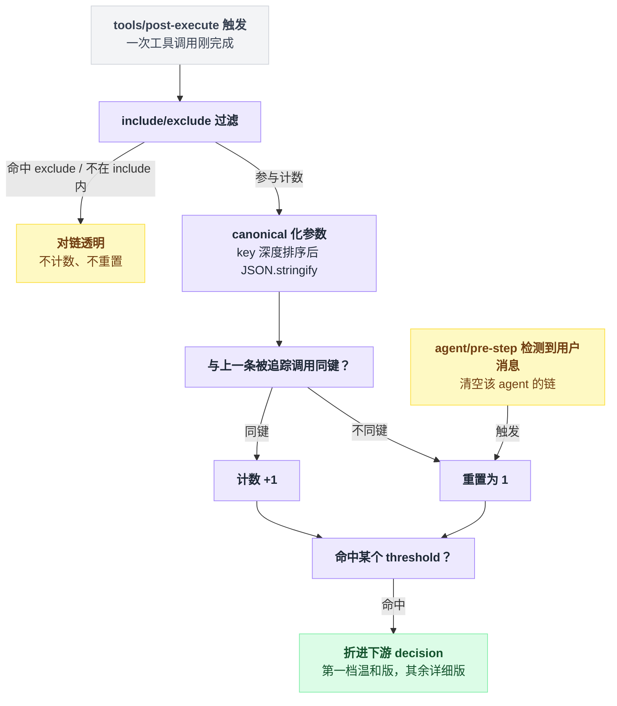

# repeat-tool-reminder

> `@deepseek-ai/dsh-repeat-tool-reminder` · bundle：`base` · 配置树 id：`repeat-tool-reminder` · v0.1.0-rc.5（commit `47f9438`）2026-08-14 核对

**一句话**：数每个 agent 连续调用同一工具、同一参数的次数，撞到配置的阈值就往结果后面塞一条劝退提醒——只劝不拦，既不否决也不改写调用。

## 它在树上长什么样

`packages/bundle/base/cordis.patch.yml:389-394`：

```yaml
    # Consecutive-repeat reminders on the tool chain.
    - id: repeat-tool-reminder
      name: '@deepseek-ai/dsh-repeat-tool-reminder'
      config:
        thresholds: [3, 5, 8]
        argumentsPreviewChars: 500
```

没有 `inject` 行，源码里也确实**没有 `export const inject`**。它只挂事件监听器，不取 service 引用，所以不需要等 `tools` 就绪——`docs/config-catalog.md:1432` 那一节同样没有 `Requires:` 行。`web-app` / `headless` 都没有覆写或禁用这一行。

这里有个容易读错的地方：bundle 只写了 `thresholds` 和 `argumentsPreviewChars` 两项，**没写 `exclude`**。

包 README 的配置示例里写着 `exclude: [todo_write]`，但那是示例不是默认值——schema 默认是空数组（`src/index.ts:48`）。所以出厂状态下 `todo_write` 是被计数的，README「记账工具不该给循环洗白」那个例子在默认配置下并不成立。

## 它注册了什么

| 类型 | 名字 | 说明 |
|---|---|---|
| 插件形态 | function 插件 | 导出 `name` / `Config` / `apply`（`src/index.ts:17`、`:45`、`:162`），非 service |
| 事件监听 | `tools/post-execute`（**waterfall**） | `src/index.ts:213`；**先计数，再 `await next()`，最后把提醒折进下游 decision** |
| 事件监听 | `agent/pre-step`（**waterfall**） | `src/index.ts:229`；纯重置钩子，永远 `return next()`，不挂任何东西 |
| 工具 / prompt 段 / 命令 | 无 | 它不在工具列表里，模型看不到它的存在 |

计数放在 post-execute 而非 pre-execute 是刻意的：被 `tools/pre-execute` 拒掉的调用也会流过这条 waterfall，而模型死磕一个被拒的调用正是最该打断的循环（`src/index.ts:181-188` 注释原文 + README § Chain semantics）。

它是 [dsh-tools](./dsh-tools.md) 的 `tools/post-execute` 消费者；[dsh-tool-call-timeout-policy](./dsh-tool-call-timeout-policy.md) 在更早一站的 `tools/execute` 上，所以一次被换成 `TOOL_TIMEOUT` 的调用照样会进这里的计数链。

链的语义写成伪代码，两个监听器一起看：

```
on tools/post-execute(exec, decision, next):
    if exec.agent 为空:              return next()   // 有人直接 ctx.tools.execute()
    if 工具名没过 include/exclude:    return next()   // 对链透明：既不加也不重置

    canonical = JSON.stringify(参数深度按 key 排序后的结果)
    key       = JSON.stringify([exec.name, canonical])

    chain = WeakMap[exec.agent]
    if key == chain.key:  chain.count += 1            // 同上一次被追踪的调用
    else:                 chain.key, chain.count = key, 1

    d = await next()                                  // 先计数，再放行下游
    if chain.count 命中某个 threshold:
        把提醒前置进 d 的 additionalContexts
    return d

on agent/pre-step(messages, next):
    if messages 里有 source.kind === 'user':
        WeakMap.delete(agent)                         // 用户插话就不算循环
    return next()
```

`canonical` 只按 key 深度排序，所以只是属性顺序不同的两次调用算同一次。链存在 `WeakMap<Agent, Chain>` 里，一个 agent 的重复不会触发另一个的提醒；agent 对象被回收即失效，不需要 dispose 监听。

出处：链语义整体 `src/index.ts:189-207`，`exec.agent` 为空跳过 `:192`，WeakMap `:173`，用户插话清链 `:230`。

从一次工具调用完成到提醒是否被塞进下游 decision，走的是同一条判定路径；用户插话则从旁路直接清空链：



## 配置项

| 字段 | 类型 | 默认值 | 作用 |
|---|---|---|---|
| `thresholds` | `number[]` | `[3, 5, 8]` | 触发提醒的连续次数；升序归一化后，**第一个**发温和版，其余发详细版 |
| `include` | `string[]` | `[]` | 纳入计数的工具名模式，空 = 全部 |
| `exclude` | `string[]` | `[]` | 对链透明的工具名模式 |
| `argumentsPreviewChars` | `number` | `500` | 详细提醒里引用参数的字符上限 |

schema 在 `src/index.ts:45-50`，但 schemastery 只校验类型。真正的严格校验在 `apply` 里，命中就**在插件加载时抛错**，绝不静默回落默认：

| 配置项 | 加载即抛错的情况 |
|---|---|
| `thresholds` | 空数组 / 含非整数 / 含 < 2 的值 / 含重复值 |
| `argumentsPreviewChars` | 不是 >= 1 的整数 |

出处：`:128-141`、`:169-171`。

`include` / `exclude` 支持 `*` 通配（`:107-111`，其余正则元字符按字面转义）。

它们是「对调用时存在的工具名做判定的谓词」，不是对注册表条目的引用——`exclude: [mcp_*]` 在一个没加载任何 MCP 工具的部署里依然合法，这一点和 `toolOrder` 的引用检查不同。

## 模型看得见什么

提醒走 post-execute decision 的 `additionalContexts`（消息构造 `:203-206`，折进下游 decision `:218`、`:222`），**不是** content 替换——`tool/result` 事件里仍是工具自己的输出，审计不受污染。

README 说 loop 把它作为一条注入的 `user/message` 排在这一步的工具结果之后，会话渲染成合成用户消息；source 是 `{kind: 'plugin', plugin: 'repeat-tool-reminder', form: 'notice', summary: '<tool> × <count>'}`（`:57`、`:205`）。

block 和 accept 两种 decision 都会被前置（`:217-223`），被拦的调用照样吃提醒。

发哪一版，只看 count 落在归一化后的阈值列表的哪个位置：

```
ts = 升序归一化(thresholds)          // 默认 [3, 5, 8]
if count == ts[0]:      发温和版
elif count in ts[1:]:   发详细版
else:                   什么都不发    // 包括 count 超过 max(ts) 之后的每一次
```

第一档（温和版，README § First-threshold reminder 逐字）：

```markdown
You are repeating the exact same tool call with identical arguments. Carefully analyze the previous result before calling again: if the task is not complete, try a different approach or different arguments instead of repeating the call.
```

后续档（详细版，README § Later-threshold reminder 逐字）：

```markdown
Repeated tool call detected:
- tool: <toolName>
- consecutive_calls: <count>
- arguments: <canonicalArguments>
The repeated calls are not making progress. Do not call this tool with these exact arguments again. Inspect the latest result and choose a different action, different arguments, or finish the task if enough evidence has been gathered.
```

参数超长时以 `… (+<omitted> more chars)` 结尾（`:118-121`）。**截断只影响提醒文本，链键始终比对完整的 canonical 串**——别以为调长参数就能骗过计数。

阈值前零 token，之后是该 agent 的保留历史；README 说 KV cache 上是 append-only。

## 什么时候你会想换掉它 / 怎么换

```yaml
- id: repeat-tool-reminder
  config:
    thresholds: [5, 10]
    exclude: [todo_write, mcp_*]
    argumentsPreviewChars: 200
```

- **老被误伤**（合法的幂等轮询）：抬高 `thresholds`，或把那个工具丢进 `exclude`。
- **只想盯某几个工具**：填 `include`，其余全部对链透明。
- **完全不要**：`disabled: true`。它没有 provider 语义，去掉不影响任何别的插件。

## 坑与边界

README 的 Known Limitations 逐条：

- **只做精确匹配** —— canonical 化只是深度 key 排序，改一个路径、值里多个空格就绕过去了；模糊匹配在拿到需求证据前不做。
- **compaction 不重置链** —— 跨过压缩检查点的链会继续计数。
- **纯建议** —— 高阈值升级成 `block` 没实现，尽管 `PostToolDecision` 本身支持。
- **subagent 不共享链** —— 父 agent 和它的 subagent 各数各的，永不合并。
- **合法的幂等轮询照样被提醒**，泄压阀只有 `thresholds` / `exclude` 两个配置。
- **超过最高阈值后彻底静音** —— 只在恰好等于配置值的那一次触发（`:199`），之后再重复也不响。
- **只存内存** —— 会话从持久化恢复后是空链，README § Chain semantics 明说这是可接受代价。

源码补充：它的 invariant 伴生插件是空实现（`src/invariant.ts:21`），理由写在 `:18-19`：

> `No runtime invariant: the repeat chain is private to one post-execute listener and exposes no package-owned event or snapshot that an independent companion can observe.`
