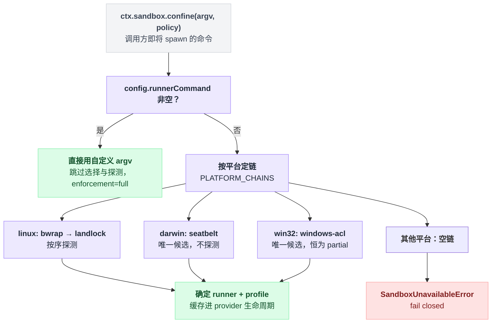

# sandbox-local

> `@deepseek-ai/dsh-sandbox-local` · bundle：`base` · 配置树 id：`sandbox` · v0.1.0-rc.5（commit `47f9438`）2026-08-14 核对；出处收在文末脚注。

**一句话**：`ctx.sandbox` 的本机实现——把调用方即将 spawn 的 argv 包一层平台 runner（Linux `bwrap`/Landlock、macOS Seatbelt、Windows ACL 受限令牌），选不出可用 runner 就抛 `SANDBOX_UNAVAILABLE` 失败关闭，绝不把未受限的原 argv 放回去。

最后半句是这个插件的性格：**没有降级路径**。包不住就报错，而不是"那就直接跑吧"。

## 它在树上长什么样

```yaml
    - id: sandbox
      name: '@deepseek-ai/dsh-sandbox-local'
```

bundle 一个 `config` 都没给，三个字段全走 schema 默认值。同一段 YAML 的注释把它称作「每个 CLI 模式共同的 file-effect boundary」[^1]。

## 它注册了什么

| 类型 | 名字 | 说明 |
|---|---|---|
| service | `ctx.sandbox` | 服务名由抽象基类 `SandboxProvider` 的 `super(ctx, 'sandbox')` 占定，本插件是仓库里唯一的生产实现，其余 `extends SandboxProvider` 都在 tests / examples 里[^2] |
| 卸载钩子 | `ctx.effect(...)` | provider dispose 时回收 windows-acl 的临时目录与可撤销 ACE；workspace 那条常驻 ACE 故意保留[^3] |

无事件监听、无工具、无 prompt 段。

**策略不存在 provider 身上**，这点第一遍容易读反。`confine(argv, policy)` 每次调用现传一份 mode + workspaceRoot(+ sessionId)，provider 自己不记住任何策略状态：

```
dsh-bash-sandbox / dsh-pwsh-sandbox
    └─ 先请 sandbox-policy 解析出 policy
    └─ 再调 ctx.sandbox.confine(argv, policy)   // 策略随调用走，不随 provider 存
```

policy 由 [sandbox-policy](./dsh-sandbox-policy.md) 解析，再经 `dsh-bash-sandbox` / `dsh-pwsh-sandbox` 带进来[^4]。

## runner 选择

一句话：**先按平台定链，再用功能探测仲裁**；链上只有一个候选就直接选中、不探测[^5]。

```
if config.runnerCommand 非空:
    用它，跳过下面全部                      // 运维接管
chain = PLATFORM_CHAINS[平台]              // 平台决定候选顺序
if chain 为空:            throw SandboxUnavailableError
if len(chain) == 1:       选中它，不探测
else:                     按序探测，chainVerdict() 仲裁
缓存结果到 selectedRunner                   // provider 活着期间不再选
```

各平台的链与结论：

| 平台 | 链 | 是否探测 | enforcement |
|---|---|---|---|
| linux | `bwrap` → `landlock` | 两个候选，按序探测 | bwrap 通过即 `full`；landlock 由 launcher 的探测报告决定 `full` / `partial` |
| darwin | `seatbelt` | 唯一候选，不探测 | `full` |
| win32 | `windows-acl` | 唯一候选，恒为 `partial` |
| 其他 | 空链 | — | `confine()` 抛 `SandboxUnavailableError` |

profile 的实际拼法在 `packages/sandbox/sandbox-local/src/profiles.ts`，三种后端各写各的方言[^6]：

| 后端 | profile 长什么样 |
|---|---|
| bwrap | `--ro-bind / /` 加 workspace 的 `--bind` |
| Landlock | 走 launcher 的 grant 参数 |
| Seatbelt | 生成 `(allow default) (deny file-write*)` 加白名单 SBPL |

Seatbelt 的白名单来自 seam 共享的 `writableRoots()`：workspace + `/tmp` + `os.tmpdir()`，全部 canonical 去重[^7]。

每次 wrap 还会带回两组「怎么读 stderr」的事实[^8]。这两组容易混，它们回答的是完全不同的问题：

| 这组事实 | 回答的问题 | 内容 |
|---|---|---|
| `denialSignatures` | 命令跑了，但被拒绝写 | bwrap `read-only file system`；landlock `permission denied`；seatbelt `operation not permitted` |
| `runnerFailureRules` | 命令根本没跑起来 | landlock 额外用 exit 125 + `landlock-run: ` 前缀；windows-acl 用 exit 127 + `windows-acl-run: ` 前缀 |

## 配置项

| 字段 | 类型 | 默认值 | 作用 |
|---|---|---|---|
| `runnerCommand` | `string[]` | `[]` | 非空即接管：跳过全部选择与探测，直接用这串 argv 并追加 bwrap 方言的 profile 参数，enforcement 自称 `full`[^9] |
| `runnerFailureSignatures` | `string[]` | `[]` | 自定义 runner 自己的致命 stderr 子串（大小写不敏感）；与 `runnerCommand` 必须成对出现，且每条非空、单行[^10] |
| `probeTimeoutMs` | `number`（schema 为 `z.natural()`） | `5000` | 每次功能探测的超时上限；构造期校验必须为正有限数，`0` 在 Node 里等于「不限时」[^11] |

三个字段的 schema 声明都在同一处[^12]。

把「`runnerCommand` 短路」和上一节的平台选链拼在一起，才是 `confine()` 一次调用的完整判定：



## 模型看得见什么

README 的 Model Experience 一节说得很干脆[^13]（此处去掉了原文里的相对链接）：

> Indirectly, through `dsh-bash-sandbox` and `dsh-tool-bash`, which render this provider's enforcement and denial facts while the `dsh-sandbox` seam owns the `SANDBOX_UNAVAILABLE` text and runner selection and profiles stay outside context.

KV Cache effect：`No direct invalidation; the named consumer owns any request-prefix changes.`[^14]

结论只有一句：模型永远看不到选了哪个 runner、profile 长什么样。

## 什么时候你会想换掉它 / 怎么换

- **想在容器 / microVM / 远端跑**：那不是换 `ctx.sandbox` provider，而是换掉整个能力 seam——本 seam 的前提是「同一个内核、同一份文件系统」。这条写在 seam 的 README 与架构文档，本包自己的 README 没提[^15]。
- **想用自家 launcher**：给 `sandbox` 节点加 `config.runnerCommand` + `runnerFailureSignatures`。注意它必须能吃 bwrap 方言的 profile 参数。
- **想彻底不受限**：不要卸这个插件——卸了以后 `dsh-bash-sandbox` 的 `inject` 不满足，整条 shell 能力都起不来。改用 [sandbox-policy](./dsh-sandbox-policy.md) 的 `danger-full-access`，那条路径根本不会调 `ctx.sandbox`[^16]。

## 坑与边界

README 的 Known Limitations and Deferred Work 列了五条[^17]：

- **Windows ACL 只能做到部分强制**——受限令牌必须保留 Everyone 才能完成进程初始化，外部对象若对 Everyone 开写就仍可写；NTFS 硬链接也能让同一个文件对象出现在 workspace 之外。所以它老老实实报 `partial`。
- **Landlock 可能是 partial**——老内核 ABI 只覆盖它暴露的访问类别。
- **Seatbelt 依赖已被 Apple 标记 deprecated 的 `sandbox-exec`**——真没了就靠功能探测失败关闭。
- **runner 选择在 provider 生命周期内缓存**——装/卸/修好一个 runner 之后必须重载插件才会重新选。
- **`runnerCommand` 是运维的断言**——不探测，默认它诚实实现了 bwrap 兼容 profile；如果它本身是个 Bash 脚本，解释器启动发生在约束生效之前。

读源码补充两条：

- `workspace` 等于或包含平台临时根时，windows-acl 在任何 ACL 改动之前就抛（校验函数 `assertTempRootOutsideWorkspace`）[^18]。
- provider dispose 时的清理失败只 warn 不抛，不中断 cordis teardown[^19]。

这两条都不在 README 的五条限制里——踩上其中任何一条时，翻遍 README 也找不到解释，只能从这里查。

---

## 出处

[^1]: 节点声明：`packages/bundle/base/cordis.patch.yml:169-170`；那句注释在同文件 `:166`。
[^2]: `super(ctx, 'sandbox')` 占定服务名：`packages/sandbox/sandbox/src/index.ts:161`；本插件是唯一生产实现：`packages/sandbox/sandbox-local/src/index.ts:250`。
[^3]: 卸载清理与保留常驻 ACE 的实现：`packages/sandbox/sandbox-local/src/index.ts:300`、`454-477`。
[^4]: 解析发生在 `packages/shell/bash-sandbox/src/index.ts:85`、`packages/shell/pwsh-sandbox/src/index.ts:93`；带入调用发生在同文件 `:178`、`:184`。
[^5]: `PLATFORM_CHAINS` 定义：`packages/sandbox/sandbox-local/src/index.ts:159-166`；仲裁函数 `chainVerdict()`：同文件 `499-510`；`selectedRunner` 缓存：`493`。
[^6]: 三段 profile 的行号，均在 `packages/sandbox/sandbox-local/src/profiles.ts`：bwrap `16-23`、Landlock `30-36`、Seatbelt `51-58`。
[^7]: `writableRoots()`：`packages/sandbox/sandbox/src/roots.ts:52-55`。
[^8]: 两组事实的构造：`packages/sandbox/sandbox-local/src/index.ts:205-213`、`231-240`；landlock 那两个常量来自 `native/landlock-run/packages/entry/src/index.ts:31`、`:22`；windows-acl 的常量见 `packages/sandbox/sandbox-local/src/index.ts:216`、`239`。
[^9]: `packages/sandbox/sandbox-local/src/index.ts:317-324`。
[^10]: 同文件 `283-291`。
[^11]: 同文件 `194-198`、`295`。
[^12]: `packages/sandbox/sandbox-local/src/index.ts:252-256`。
[^13]: `packages/sandbox/sandbox-local/README.md:28`。
[^14]: 同文件 `:32`。
[^15]: `packages/sandbox/sandbox/README.md:11`、`:40`；`docs/subsystems/sandbox.md:5`。
[^16]: `docs/subsystems/sandbox.md:23`。
[^17]: `packages/sandbox/sandbox-local/README.md:34-40`。
[^18]: `packages/sandbox/sandbox-local/src/index.ts:393`。
[^19]: 同文件 `473-476`。
