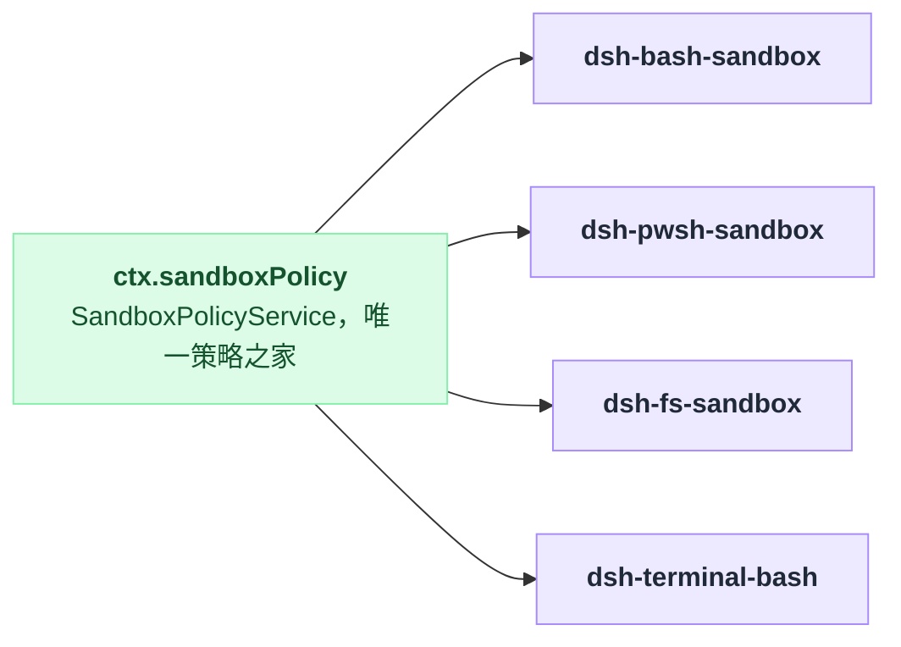
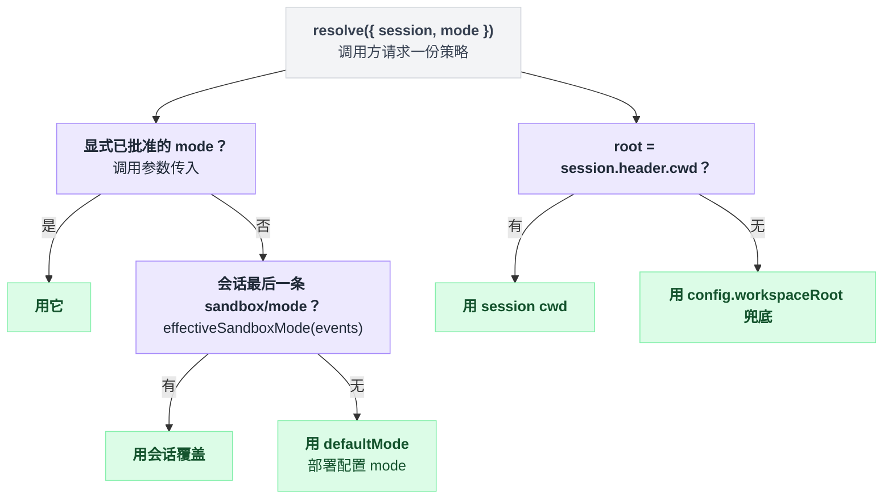

# sandbox-policy

> `@deepseek-ai/dsh-sandbox-policy` · bundle：`base` · 配置树 id：`sandbox-policy` · v0.1.0-rc.5（commit `47f9438`）2026-08-14 核对

**一句话**：沙箱策略的唯一归属地（`ctx.sandboxPolicy`）——把「部署默认 mode + 兜底 workspaceRoot」和「会话级 `sandbox/mode` 覆盖 + 会话不可变 cwd」合成每次调用一份完整策略，顺带在每个请求前把当前策略讲给模型听。

## 它在树上长什么样

```yaml
    - id: sandbox-policy
      name: '@deepseek-ai/dsh-sandbox-policy'
      config:
        mode: !!js process.env.DSH_PERMISSION_MODE ?? 'workspace-write'
        workspaceRoot: !!js process.cwd()
```

出处 `packages/bundle/base/cordis.patch.yml:172-176`。

这里有个容易看漏的地方：默认值其实有两层。schema 里 `mode` 的默认是 `read-only`，这是 fail-safe 的选择；而 bundle 把它显式抬到了 `workspace-write`。所以光读 schema 会以为开箱是只读的，实际跑起来不是。

环境变量 `DSH_PERMISSION_MODE` 可以覆盖 bundle 这个值。同一个环境变量也决定 [user-approval](./dsh-user-approval.md) 的 `policy`——两处是联动的，改一个等于改两个。

对应 `packages/sandbox/sandbox-policy/src/index.ts:94`（schema 默认）、`packages/bundle/base/cordis.patch.yml:191`（user-approval 那一处）。

## 它注册了什么

| 类型 | 名字 | 说明 |
|---|---|---|
| service | `ctx.sandboxPolicy` | `SandboxPolicyService`，`super(ctx, 'sandboxPolicy')`（`packages/sandbox/sandbox-policy/src/index.ts:105`） |
| prompt 段 | `sandbox:policy`，`order: 110` | 走 `ctx.inject(['systemPrompt'])` 可选挂载；文本是 `resolve({ session })` 的直接渲染，无 session 时返回空串（同文件 `112-123`） |
| session 事件（声明+写路径） | `sandbox/mode` | log-only、可重放、**不进模型 transcript**；`setSandboxMode()` 是唯一写入口，一次 append 一条（`src/session-mode.ts:33-37`、`69-71`） |

没有事件监听器，也没有工具。它是**被 inject 的一方**，全仓恰好四个消费者：

| 消费者 | inject 位置 |
|---|---|
| `dsh-bash-sandbox` | `packages/shell/bash-sandbox/src/index.ts:45` |
| `dsh-pwsh-sandbox` | `packages/shell/pwsh-sandbox/src/index.ts:53` |
| `dsh-fs-sandbox` | `packages/fs/fs-sandbox/src/index.ts:60` |
| `dsh-terminal-bash` | `packages/terminal/terminal-bash/src/index.ts:25` |



## 服务面

| 成员 | 说明 |
|---|---|
| `resolve({ session?, mode? })` | 一次调用一份 `SandboxExecutionPolicy`。优先级：显式已批准的 `mode` > 会话最后一条 `sandbox/mode` > `defaultMode`；root 取 `session.header.cwd`，缺失才用配置兜底（`src/index.ts:135-142`） |
| `defaultMode` / `workspaceRoot` | 部署默认与兜底根，构造期算好（`src/index.ts:109-110`） |
| `overrideOf(session)` | 只读会话覆盖，不套默认值（`149-151`） |
| `effectiveSandboxMode(events)` | 纯 fold：倒着找最后一条 `sandbox/mode`（`src/session-mode.ts:52-58`） |
| `setSandboxMode(session, mode)` | 唯一写路径 |
| `SANDBOX_MODES` | `['read-only', 'workspace-write', 'danger-full-access']`（`src/session-mode.ts:42`） |

`resolve()` 里 mode 和 root 是两条互不相干的链，各走各的：

```
resolve({ session, mode }):
    # 第一条链：定 mode
    if mode 已显式传入且已批准:  m = mode
    elif 会话里有 sandbox/mode:  m = effectiveSandboxMode(session.events)   # 倒着找，最后一条赢
    else:                        m = defaultMode

    # 第二条链：定 root，跟上面完全无关
    if session.header.cwd 存在:  r = session.header.cwd
    else:                        r = config.workspaceRoot

    return { mode: m, workspaceRoot: r }
```

`effectiveSandboxMode` 是纯 fold，没有状态，所以同一份事件列表算多少次都是同一个答案。

路径解析顺序值得单独记一笔：**先 canonical 再 lexical**。

```
resolveWorkspaceRoot(path) = resolve(canonicalPath(path))
                             ^ 后做 lexical  ^ 先做 canonical
```

顺序反过来结果就不一样了：`symlink/..` 这种路径，先 lexical 归一会把 `..` 就地抵消掉，先 canonical 则会顺着 symlink 走到真身再回退一级——后者才和进程真正 chdir 的落点一致。实现在 `src/index.ts:33-35`。



## 配置项

| 字段 | 类型 | schema 默认 | bundle 实际给的 | 作用 |
|---|---|---|---|---|
| `mode` | `'read-only' \| 'workspace-write' \| 'danger-full-access'` | `read-only` | `DSH_PERMISSION_MODE ?? 'workspace-write'` | 会话起步的 file-effect mode |
| `workspaceRoot` | `string` | 无 schema 默认，构造时落到 `process.cwd()` | `process.cwd()` | 无 session cwd 的 agentless 调用的兜底可写根 |

两个字段的默认值说明见 `packages/sandbox/sandbox-policy/README.md:13-14`。

还有一句边界需要划清楚：**runner 的选择不在这里，那是 `ctx.sandbox` provider（即 [sandbox-local](./dsh-sandbox-local.md)）的 config**。这句话出自源码 doc comment（`src/index.ts:64-65`），README 里没有对应表述。

## 模型看得见什么

每个 agent session 在 runtime-context 快照里拿到一条 `sandbox:policy`，三种 mode 三段原文：

```markdown
Current DSH file policy: read-only. Any available operation enforced by the DSH file sandbox cannot modify files in the standing mode. Do not refuse a required modification from this policy alone: try an available tool normally and follow any denial and escalation guidance it returns.
```

```markdown
Current DSH file policy: workspace-write. Any available operation enforced by the DSH file sandbox may modify files under the session workspace: "<workspace root>". Some platform temporary areas may also be writable.
```

```markdown
Current DSH file policy: danger-full-access. The DSH file sandbox does not restrict file modifications by available operations.
```

三段分别在 `packages/sandbox/sandbox-policy/src/index.ts:41`、`43`、`45`；README 的 `42`、`48`、`54` 逐字相同。

第二段里的路径由 `JSON.stringify(policy.workspaceRoot)` 现填，所以带引号——那对引号不是文案写的，是序列化带出来的。

这段文本**不枚举挂载了哪些能力**，也不列具体临时目录。

它还有一个顺带的 KV Cache effect（README `61-63`）：稳定的 system prompt 在 mode 切换前后逐字节不变，变化的完整快照追加在保留历史之后，旧前缀继续命中缓存。

## 什么时候你会想换掉它 / 怎么换

基本不换——它是「唯一策略之家」这个设计本身。要动的是它的 config：

- 想让 agent 默认只读：`config.mode: read-only`（或 `DSH_PERMISSION_MODE=read-only`）。
- 想给 agentless 调用换兜底根：改 `workspaceRoot`；正常 agent 调用不受影响，它们用 session cwd。
- 想给用户一个可切的档位而不是让他改 YAML：那是 [permission-presets](./dsh-permission-presets.md) 的活儿，它通过 `setSandboxMode()` 写这里的事件。

卸掉它的代价是连锁的：`bash-sandbox` / `pwsh-sandbox` / `fs-sandbox` / `terminal-bash` 的 `inject` 全部落空。

## 坑与边界

README 的 Known Limitations and Deferred Work（`packages/sandbox/sandbox-policy/README.md:65-69`）：

- **一个 session 只有一个主 workspace root**——policy 解析的是 `SessionHeader.cwd`，额外可写根不属于 `SandboxExecutionPolicy`。
- **只管文件效果**——`SandboxMode` 的词汇表里没有网络和进程策略，这里没有任何旋钮能限制它们。
- **临时区域是有意概括的**——各后端授予的平台临时区不同，且在策略解析之后才选定，所以当前上下文里没法如实枚举。

再补两条读源码所得。

一是 `sandbox/mode` 是 log-only、不带 `surfaceOp`，模型只从 runtime-context 快照知道它（`src/session-mode.ts:27-32`）。

二是可选的 `./invariant` 伴生插件，会在两个时机校验事件里的 mode 属于封闭词汇表：

```
on 装载:      for e in 已有事件: assert e.mode in SANDBOX_MODES
on 新 append: assert e.mode in SANDBOX_MODES
# 越界 → fail，不是警告
```

对应 `src/invariant.ts:18-19`、`24-33`。
