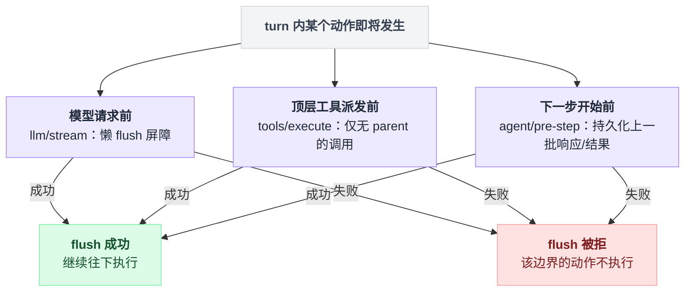

# session-checkpoint-policy

> `@deepseek-ai/dsh-session-checkpoint-policy` · bundle：`base` · 配置树 id：`session-checkpoint-policy` · v0.1.0-rc.5（commit `47f9438`）2026-08-14 核对

**一句话**：纯拦截型的"语义耐久策略"——在模型 adapter 收到请求之前、顶层工具体可能产生外部副作用之前、以及每个 `agent/pre-step` 边界上，各插一次 `ctx.sessions.flush()`，把"什么时候必须落盘"这个决定从持久化后端里拆出来单独持有。

## 它在树上长什么样

`packages/bundle/base/cordis.patch.yml:355`：

```yaml
- id: session-checkpoint-policy
  name: '@deepseek-ai/dsh-session-checkpoint-policy'
```

bundle 给这一行的注释是 `Durability checkpoints before each model request and top-level dispatch.`（`cordis.patch.yml:354`）。无 `config`；`inject` 写在代码里而不是 YAML 里。

## 它注册了什么

| 类型 | 名字 | 说明 |
|---|---|---|
| plugin name | `session-checkpoint-policy` | `packages/session/session-checkpoint-policy/src/index.ts:15` |
| inject | `['llm', 'sessionPersistence', 'sessions', 'tools']` | `src/index.ts:18`——`sessionPersistence` 在列表里，意味着**没挂持久化后端这一行就不会激活** |
| 事件监听 | `llm/stream`（**waterfall**） | 懒包装下游流：先 `await ctx.sessions.flush(session)` 再 `yield* next()`，所以下游流在缓冲的请求事件耐久之前根本不构造（`src/index.ts:64`–`68`、`34`–`37`；派发模式见 `docs/event-producer-consumer.md:39`） |
| 事件监听 | `tools/execute`（**waterfall**） | 只对**有 agent 且无 parent** 的顶层调用生效——`exec.agent === undefined \|\| exec.parent !== undefined` 一律直接 `next()`（`src/index.ts:71`）。flush 之后若已取消，返回规范的 aborted 结果，**不进工具体**（`src/index.ts:70`–`75`；`docs/event-producer-consumer.md:56`） |
| 事件监听 | `agent/pre-step`（**waterfall**） | 每次请求派生之前，把上一 step 提交的响应/结果批次持久化（`src/index.ts:79`–`82`；`docs/event-producer-consumer.md:18`） |

三个都是 waterfall，也就是说**它能拦截**：任何一个 flush 拒绝都会 fail-closed。不注册服务、工具、命令、prompt 段。

它插在管线的这些位置上：`llm/stream` 的包装是懒的；`tools/execute` 的包装在 pre-execute 策略与守卫**之后**；嵌套的工具派发复用外层模型可见调用的检查点（`README.md:21`）。

三处屏障各管一段边界，任何一处 flush 被拒都是各自范围内的 fail-closed，不牵连另外两处：



## 配置项

无配置项（README 称之为 `zero-config function plugin`，`README.md:9`）。它的行为完全由三个事件边界和 `ctx.sessions.flush()` 的语义决定；真正的批量参数在持久化后端那边——见 [session-persistence-jsonl](./dsh-session-persistence-jsonl.md) 的 `writeBatchMaxDelayMs`。

## 为什么要单独一个插件

`README.md:19` 说得很直白：持久化和检查点调度**故意是两个 Cordis 插件**。后端负责为 `session/event` 起有界的后台批次，并把每次 `session/flush` 变成立即的静默屏障；**这个策略负责选择请求、工具派发、下一步这三条屏障线**。只加载后端不加载策略是合法组合，但崩溃时可能丢掉还在批窗里或还在写的事件。第一方持久化 app 与 runtime 两个插件都显式挂，特化部署可以故意省略或替换策略。

失败语义（`README.md:23`）：检查点被拒时在模型与工具边界上 fail-closed——adapter 和顶层工具体都不会跑；step 边界被拒则在下一个请求开始前让整个 turn 失败。并发的工具检查点共用 session store 序列化的持久化排干，不会重复 seq。

取消时的规范结果由本包物化（`src/index.ts:41`–`50`）：`isError: true`，content 文本 `Error: tool call aborted before dispatch`，`error.message` 为 `tool call aborted before dispatch`，`error.info` 为 `{ name: 'AbortError', code: TOOL_ABORTED_BEFORE_DISPATCH }`。

## 模型看得见什么

**本插件不加任何 prompt 或工具 schema**（`README.md:31`）。它唯一间接影响模型的路径是：工具检查点之后、结果之前发生硬崩溃，会在日志里留下一个耐久的未配对 call，恢复时由 [session](./dsh-session.md) 补上模型可见的 `TOOL_OUTCOME_UNKNOWN` 结果——该文案允许只读/幂等工作重试，有副作用则要求先核验状态或请用户确认。

token 效果：检查点成功时零 token、不改请求；恢复时为平衡被打断的转录多出一条短的 tool-result message。KV Cache：修复结果追加在可复用前缀之后，不使更早的缓存条目失效（`README.md:33`–`39`）。

## 什么时候你会想换掉它 / 怎么换

两种改法：

1. **关掉它**（README 明确背书这种组合，`README.md:19`）。bundle 里的行在 patch 层删不掉，只能禁用：

```yaml
- id: session-checkpoint-policy
  disabled: true
```

   后端仍然按自己的批窗写盘，但崩溃可能丢掉批窗内的事件。适合把吞吐看得比"每次工具派发都可回溯"更重的批处理场景。注意 `config` 不能停一行，`disabled` 才能（patch 三种形态见 `packages/boot/app-boot/src/profile.ts:127`–`130`）。
2. **换成自己的策略插件**：它没有 provide 任何服务，只是三个 waterfall 监听器，因此"替换"就是禁用这一行、再 `insert` 一个挂在同样三个事件上按你的规则 flush 的新插件（`insert` 语义见 `vendor/include/src/index.ts:80`–`95`；直接改本行的 `name` 会因 name mismatch 被整条跳过，同文件 `:116`–`119`）。

另一个方向的调节旋钮不在这里：想缩小"两次语义检查点之间"的丢失窗口，调 [session-persistence-jsonl](./dsh-session-persistence-jsonl.md) 的 `writeBatchMaxDelayMs`。

## 坑与边界

来自 `README.md:41`–`45`：

- **它耐久记录的是执行意图，不是通用的 exactly-once 效果**。有副作用的工具应当在 provider 支持时把 `exec.callId` 当幂等键传下去。
- **流式 `assistant/chunk` 没有逐 chunk 检查点**。有界后台批次通常会在下一个语义检查点之前把它们持久化，但硬崩溃可能丢掉当前内存批次或正在进行的写。
- **一个已持久化但无结果的调用无法证明它的外部效果是否完成**，所以恢复只记录"结果未知"，不自动重试。

读源码补充：`llm/stream` 上的包装只在 `options.sessionId` 存在**且**该会话还在 store 里时才生效，否则直接 `next()`（`src/index.ts:65`–`67`）——非会话绑定的辅助模型请求（例如标题生成）不会被它拦。
