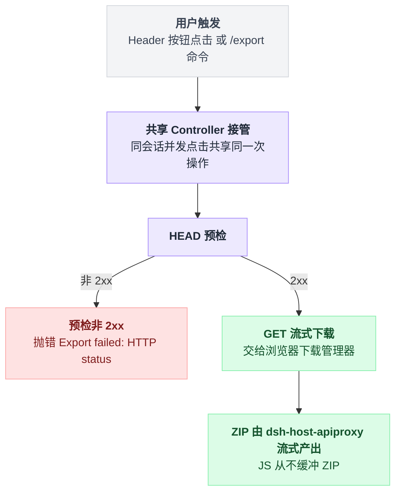

# session-log-export

> `@deepseek-ai/dsh-session-log-export` · bundle：`web-app` · 配置树 id：`session-log-download` · v0.1.0-rc.5（commit `47f9438`）2026-08-14 核对，出处收在文末脚注。

**一句话**：Web 端的"把这个会话打包下载"控件。

宿主侧只做一件事——注册一个 `/export` 命令。浏览器侧负责能看见的部分：Session Header 上的按钮、一个下载控制器、一个共享弹窗。

真正干活的既不是宿主也不是浏览器：ZIP 由 `dsh-host-apiproxy` 的下载端点流式产出。

## 它在树上长什么样

```yaml
- id: session-log-download
  name: '@deepseek-ai/dsh-session-log-export'
```

两行，没有 config，也没有 inject 行。

之所以不用写 inject，是因为两个半边各自声明了自己要什么：宿主半边写 `export const inject = ['commands']`[^1]，浏览器半边写 `export const inject = ['slots', 'locale']`[^2]，浏览器侧的包依赖清单则落在 package.json 的 `dsh.client.inject` 里[^3]。

这是一个**双面包**——一行 YAML 同时挂宿主插件和浏览器插件[^4]。

## 它注册了什么

| 类型 | 名字 | 说明 |
|---|---|---|
| 命令（宿主） | `/export` | `description: 'Download this Session log as a ZIP archive'`；handler 只返回结果，不做 IO[^5] |
| service（浏览器） | `ctx.sessionLogDownload` | `SessionLogDownloadController`，`ctx.provide('sessionLogDownload', controller)`[^6] |
| 事件监听（浏览器） | `command/executed`（emit） | `commandName === 'export' && result.kind === 'success'` 时触发下载[^7]；该事件模式标注 `@mode emit`[^8] |
| UI slot | `conversation.session.header.utilities` | 注册 id 为 `session-log-download` 的 Header 按钮 + 弹窗[^9]；按钮尺寸是 `min-width: 111px` / `height: 32px`[^10]，README 写作 "a 111×32 `Session log` action"，实为最小宽度 |
| i18n | 命名空间 `session-log-download` | zh / en 两套词典[^11] |
| invariant | 包名占位 | 空实现：命令注册表管生命周期配对，ZIP 完整性归 ApiProxy[^12] |

本插件**不监听任何会话事件**，也不注册工具或 prompt 段。

## 配置项

无配置项。行为由两处决定，都不在这一行 YAML 里。

一处是宿主端点，归 `dsh-host-apiproxy` 管：压缩级别配置项叫 `sessionExportCompressionLevel`，取值 0–9，默认 6——注意它是**那个包**的配置，不是这个包的[^13]。

另一处是浏览器端，两个值都写死在代码里：URL 是 `/api/session.export?sessionId=<id>&includeDescendants=true`[^14]，文件名固定为 `dsh-session-<清洗过的id>.zip`[^15]。

## 命令契约

| 输入 | 结果 |
|---|---|
| `/export` | 返回 `Session log download requested.`，提交的那个浏览器随后发起下载[^16] |
| `/export <path>` | 报错 `The Web /export command does not accept a path.`——浏览器下载的落点由浏览器自己决定[^17] |

Header 按钮和斜杠命令是两条入口，但走的是同一个 controller，流程只有一条：

```
export(sessionId):
    if 该 session 已有在飞的操作:
        return 那次操作            // 并发点击共享同一次，不重复发起

    resp = HEAD 下载 URL           // 预检
    if resp 非 2xx:
        throw "Export failed: HTTP <status>" + body 文本

    把 GET URL 交给浏览器下载管理器  // JS 里从不缓冲 ZIP

on 插件卸载:
    abort 预检，等待收敛
```

关键是最后那句注释：字节从端点直接流进浏览器的下载管理器，JS 全程不持有 ZIP[^18]。

两条入口最终收敛到一次操作、一条判断分支：



## 模型看得见什么

README《Model Experience》："Nothing. `/export` stays on the human-command plane, and the ZIP download does not enter model history." Token effect "Zero. The command creates no model turn."[^19]

## 什么时候你会想换掉它 / 怎么换

- **不想给用户导出入口**：把这一行删掉或 `disabled: true`。但宿主端点属于 `dsh-host-apiproxy`，**仍然开着**——真要封死得动那个包，不是这一行。
- **只留斜杠命令、不要按钮**：得改浏览器半边的 slot 注册，配置层没有开关。
- **非 Web 形态想导出**：本包只在 web-app bundle 挂载[^20]（其余 bundle 无此行），headless / TUI 没有它。那些形态直接读 `$DSH_HOME/sessions` 下的 JSONL 更直接，见 base 行 `session-persistence-jsonl`[^21]。

## 坑与边界

README《Known Limitations》里有三条[^22]：端点要求持久化后端提供**每会话原始工件**，JSONL 后端支持明文与 zstd，**SQLite 导出不含在内**；这是浏览器下载不是宿主写文件，所以返回不了本地路径；预检只能发现"流开始之前"的失败，后代会话或附件在 GET 被接受之后出问题，只会由浏览器下载管理器报出来。

弹窗和下载是两件事。关掉弹窗**不会**取消在飞的下载，之后那次操作结算也不会把弹窗弹回来[^23]：

```
on 用户关弹窗:
    open = false           // 只关 UI，在飞的下载照跑

on 操作结算(成功或失败):
    弹窗.open = open       // 沿用当前状态，不强行弹回来
```

斜杠触发时，宿主会先跨 `SessionStore.flush` 屏障再读原始工件，所以 ZIP 里含触发它的那对 `command/run` / `command/done`[^24]。

**ZIP 里是逐字原文**——这点最容易低估。`readRaw` 给的是持久化字节本身，不是从解析后事件重建的，所以里面有[^25]：

- 用户消息、工具输出、文件内容、system prompt
- `subagents/<id>/` 下的子代理日志
- `media/<attachmentId>.<ext>` 下的图片
- `session/title` 与 `session/title-llm-request`（见 [session-title](./dsh-session-title.md)、[session-title-first-prompt-llm](./dsh-session-title-first-prompt-llm.md)）

这与 [session-telemetry-otel](./dsh-session-telemetry-otel.md) 上报的是同一份内容，区别只在"发给谁"。

端点是 fail-loud 的，**绝不静默少导出**[^26]：

| 情况 | 表现 |
|---|---|
| 缺服务 | 500 |
| 后端不支持原始工件 | 501 |
| 根会话不存在 | 404 |
| 后代缺工件或图片读不出 | 整个流失败 |

---

## 出处

[^1]: 宿主半边 `inject`：`packages/session-query/session-log-export/src/index.ts:7`。
[^2]: 浏览器半边 `inject`：`src/client/index.ts:26`。
[^3]: `dsh.client.inject`：`package.json:54-59`；`platform: web` 在 `:60`。
[^4]: YAML 行：`packages/bundle/web-app/cordis.patch.yml:70-71`，上一行注释原文 `Browser Session export: /export command plus the shared download dialog.`。
[^5]: handler 实现：`src/index.ts:19-25`。
[^6]: `src/client/index.ts:33-34`。
[^7]: `src/client/index.ts:37-39`。
[^8]: `packages/client/ui-commands/src/client/service.ts:36`。
[^9]: `src/client/index.ts:40-49`、`src/client/HeaderAction.tsx:16-30`。
[^10]: `src/client/HeaderAction.module.css:5-6`。
[^11]: `src/client/index.ts:36`；`NS` 定义在 `src/client/locales.ts:2`。
[^12]: `src/invariant.ts:12-13`。
[^13]: `packages/host/apiproxy/src/index.ts:50-55`、`packages/host/apiproxy/src/session-export.ts:33`。
[^14]: `src/client/controller.ts:114-116`。
[^15]: `src/client/controller.ts:30-32`。
[^16]: `src/index.ts:9-12`、`22-23`。
[^17]: `src/index.ts:24`。
[^18]: 预检与交棒 `src/client/controller.ts:111-130`、`39-44`；并发共享 `78-88`；卸载 abort `104-109`。
[^19]: `README.md:35`、`39`。
[^20]: `README.md:14`；其余 bundle 无此行。
[^21]: `packages/bundle/base/cordis.patch.yml:98-101`。
[^22]: `README.md:47-49`。
[^23]: `README.md:18`；实现见 `src/client/controller.ts:94-98`（关闭）、`123-128`（结算时沿用当前 `open` 状态）。
[^24]: `README.md:16`、`packages/host/apiproxy/src/api-proxy.ts:3665-3666`。
[^25]: `packages/host/apiproxy/README.md:31`；路径构造见 `packages/host/apiproxy/src/session-export.ts:108`、`250`。
[^26]: `packages/host/apiproxy/src/api-proxy.ts:3645-3676`、`packages/host/apiproxy/README.md:31`。
