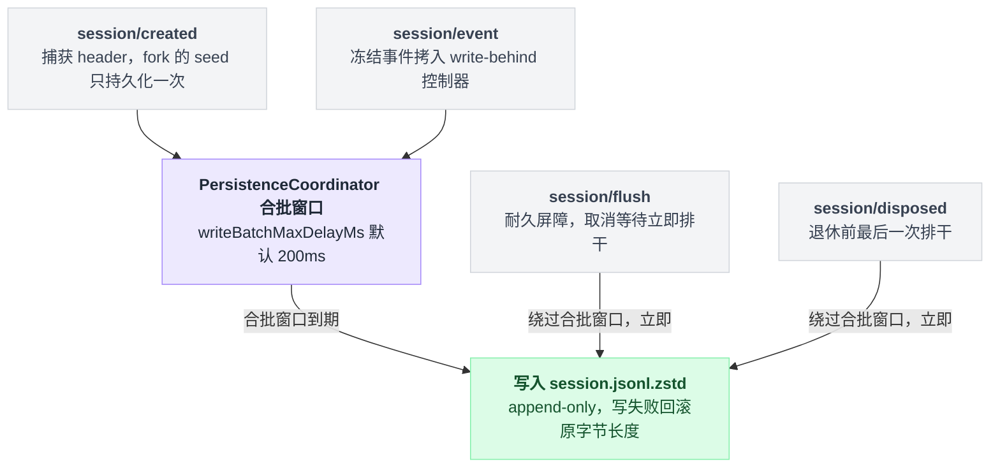
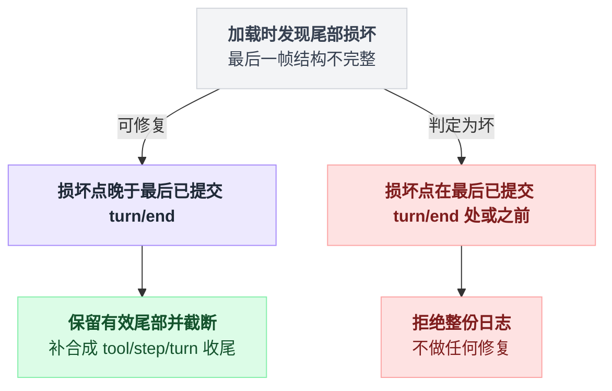

# session-persistence-jsonl

> `@deepseek-ai/dsh-session-persistence-jsonl` · bundle：`base` · 配置树 id：`session-persistence-jsonl` · v0.1.0-rc.5（commit `47f9438`）2026-08-14 核对。出处收在文末脚注，可照抄代码收在附录。

**一句话**：默认的耐久落盘后端，把 [session](./dsh-session.md) 的事件日志按会话写成一份 append-only 的逻辑 JSONL，默认物理编码是带校验和的 Zstandard 帧串（`.jsonl.zstd`）。

## 它在树上长什么样

```yaml
- id: session-persistence-jsonl
  name: '@deepseek-ai/dsh-session-persistence-jsonl'
  config:
    root: !!js dshHomePath('sessions')
```

这行 bundle 配置里唯一要填的字段是 `root`[^1]。`dshHomePath()` 把段拼到 Harness home 上，home 未由 `$DSH_HOME` 指定时默认 `~/.dsh`，所以默认根目录是 `~/.dsh/sessions`[^2]。

`root` 是**必填、无默认**的。第一次看到这条约束会觉得不近人情——直接给个当前目录当默认值不好吗？答案是不好：若默认成 `process.cwd()`，进程 cwd 一变（bash 调用、子进程），同一个会话的日志就可能被拆散到不同目录下，谁都不知道去哪找全了[^3]。

## 它注册了什么

本包只挂五样东西，全部来自同一份注册表[^4]：

| 类型 | 名字 | 说明 |
|---|---|---|
| service | `ctx.sessionPersistence`（`JsonlSessionPersistence`） | 实现 `dsh-session-persistence` 抽象 seam，`static inject = ['sessions']` |
| 事件监听 | `session/created`（**emit**） | 捕获 header，fork 的 seed 只持久化一次 |
| 事件监听 | `session/event`（**emit**） | 把冻结事件拷进本会话的 write-behind 控制器并开启批窗 |
| 事件监听 | `session/flush`（**parallel**，awaited） | 立即耐久屏障：取消等待、把当前批和待处理批全部排干 |
| 事件监听 | `session/disposed`（**emit**） | 退休并做最后一次排干，失败自我容纳 |

四个监听器各自的派发模式，定义都在同一份官方文档里[^5]。

有个容易看漏的归属问题：这些监听器是共享的 `PersistenceCoordinator` 装的，不是本包直接写的。也正因如此，HMR 热重载不会重放 `session/created`——加载时反而要把已存在的活会话补种一遍，才能补上这一课[^6]。

本包不注册工具、命令、prompt 段。

四条监听线最终只汇成两种落盘节奏——合批等待，或立即排干：



## 配置项

| 字段 | 类型 | 默认值 |
|---|---|---|
| `root` | `string` | **必填**（bundle 给 `~/.dsh/sessions`） |
| `packChunks` | `boolean` | `true` |
| `compression` | `'zstd' \| 'none'` | `'zstd'` |
| `preparedSessionCacheSize` | 正整数 | `5` |
| `writeBatchMaxDelayMs` | 正整数 | `200` |

四个字段的默认值都能在源码里对上号[^7]。

`root` 是所有会话文件的根目录。已存在的话必须是可读目录；不存在则首次落地时创建。

`packChunks` 把连续同 block 的 `assistant/chunk` delta 打包成 `text-chunks`/`reasoning-chunks`/`tool-call-chunks` 行，README 在一次真实编码会话上实测日志小约 60%。设 `false` 就得到一事件一行的诊断格式。注意**读取与本开关无关**——读的时候永远解包。

`compression` 设 `'none'` 时保留原始换行分隔 UTF-8 文本。

`preparedSessionCacheSize` 决定冷历史检查后保留多少个未发布 Session 供 resume 复用。

`writeBatchMaxDelayMs` 是空闲队列收到第一条事件后的固定合批窗口。"固定"这个词是重点：

```
队列空闲时收到第一条事件 → 起一个 200ms 的定时器
    后续事件不断进来        → 定时器照走，不重置
    定时器到期              → 整批排干写盘
    收到 flush 或 拆卸       → 不等定时器，直接排干
```

它约束的只有这个窗口本身，不约束事件循环、序列化操作或后端本身的延迟。上限是 Node 的 `2_147_483_647` ms[^8]。

## 落盘长什么样

```
<root>/--<normalized-cwd>--/<encoded-id>/session.jsonl.zstd
```

第一条逻辑行是不可变的 `SessionHeader`，标记 `{ type: 'session', version, id, cwd?, createdAt, parentSession?, seedLength?, origin?, delegationDepth, agentPreset? }`。

其中 `delegationDepth` 在盘上是必填的，顶层会话为 `0`，缺失或非法直接拒绝整份日志。`agentPreset` 之所以耐久，是因为它决定恢复后会话的工具与 prompt——换一套组合去重放历史，模型会看到自己再也执行不了的动作[^9]。

`seq` 在解码后的日志里保持连续，即 `events[i].seq === i`。

路径里那两级目录各有各的脾气。项目目录名是把 cwd 规范化后**有损**截断和替换分隔符得到的，所以规范化后相同的 cwd 会共用一个项目目录；会话 id 仍然区分出各自的会话目录。会话 id 本身是未经校验的 branded string，会被单射转义成一个安全路径段[^10]。

耐久语义有五条要点[^11]：

| 语义 | 具体行为 |
|---|---|
| 懒物化 | `create()` 什么都不写，首次 `append` 才写 header 帧并 `fsync` |
| 发布方式 | POSIX 用硬链接，Windows 用 `MoveFileExW(..., MOVEFILE_WRITE_THROUGH)`，两者均不覆盖 |
| append-only | 写失败回滚到原字节长度 |
| 崩溃恢复 | 保留有效尾部（见下） |
| 只读检查 | `inspect()` 只读、不截断 |
| 批次校验 | `append` 拒绝首 seq 接不上的批次 |

崩溃恢复那条值得单独展开，因为它能不能修，取决于损坏点相对最后一个已提交 `turn/end` 的位置：



也就是说，修复只肯往前修到最后一个完整回合为止，再往里烂就不救了。

## 模型看得见什么

JSONL 存储**不贡献任何 live prompt 或 schema**[^12]。

加载恢复已存 surface 历史并保留旧的 request header 供重建，新 loop 自己组当前信封；崩溃修复补的 `TOOL_NOT_STARTED` / `TOOL_OUTCOME_UNKNOWN` 文案由 [session](./dsh-session.md) 拥有。

token 效果：零 live 请求 token，恢复的 agent 只为保留的历史、当前信封和每个被打断调用的修复结果付费。

KV Cache：不改写 live 请求前缀，恢复后只有当重建历史、当前信封、模型路由三者都匹配时才能复用 provider cache。

## 什么时候你会想换掉它 / 怎么换

同 seam 另有一个可互换后端 `@deepseek-ai/dsh-session-persistence-sqlite`[^13]。它是一行一个 `SessionEvent`，`events` 表列为 `(session_id, seq, type, time, data, source_event_seqs, surface_op)`，与事件 1:1[^14]。

**换后端不能靠改这一行的 `name`。** 这是我第一遍就想当然写错的地方：非 insert patch 里的 `name` 是**断言**而不是覆盖。

```
patch 应用到某一行时:
    if patch.name 存在 且 != 原行的 name:
        报 "patch: name mismatch"，整条 patch 跳过     # 原后端照旧生效
```

所以正确写法是禁用旧行、再插入新行[^15]，照抄[附录 A](#a-换成-sqlite-后端)。

只想调 JSONL 自己（同 id 只改 `config` 是合法的 patch 形态），有三种常见诉求：

| 诉求 | 改法 |
|---|---|
| 要能被外部按行读 | 设 `compression: 'none'`，且必须是**新根目录** |
| 要一事件一行方便 diff | 设 `packChunks: false` |
| 崩溃窗口太大 | 调小 `writeBatchMaxDelayMs`，但真正的语义屏障在 [session-checkpoint-policy](./dsh-session-checkpoint-policy.md) |

把持久化整个关掉也合法：`disabled: true`（patch 层删不掉 bundle 行）。会话变成纯内存，代价是所有 inject 了 `sessionPersistence` 的插件都会跟着哑掉：[session-checkpoint-policy](./dsh-session-checkpoint-policy.md)、[session-projection-cache](./dsh-session-projection-cache.md)、`dsh-schedule`[^16]。

[session-query-sqlite](./dsh-session-query-sqlite.md) 是个例外：它只是把持久化那一路观察解绑，服务本身还在。

## 坑与边界

六条要点，都来自官方 README[^17]：

- **只加载配置里那种编码 + 当前 `SESSION_FORMAT_VERSION`（v0）**：改压缩方式必须换新根目录或干净根目录，预发布格式没有迁移。
- **老的扁平 `<project>/<id>.jsonl*` 布局不加载**，会报错而不是忽略。
- **压缩文件不能直接按行读**。
- **没有任何东西删会话文件**，日志在 `root` 下无限累积，seam 也没有删除 API。
- **一个会话同时只能有一个活写入者**：append 与 repair 只在拥有它的后端实例内部协调，另一个实例或进程在它安静拆卸前不得写同一会话。
- **POSIX 首次物化依赖 hard link 支持**（用 `link()` 让同 id 竞争失败而不是覆盖已提交日志）。

## 把这篇串起来

- **`root` 必填不是任性，是不让会话文件跟着进程 cwd 到处跑**——默认成当前目录，一次 cd 就能把同一个会话拆到两个地方；
- **合批窗口是"固定"的，不是"空闲重置"的**——第一条事件落地就起 200ms 定时器，后续事件再密集也不会把它往后推，只有 flush 或拆卸能提前打断它；
- **崩溃恢复只肯往前修到最后一个已提交的 `turn/end`**——损坏点落在这条线之前，整份日志直接判死刑，不做任何修复；
- **换后端不能靠改 `name`**——非 insert patch 里的 `name` 是断言不是覆盖，写错了旧后端照跑，新配置悄悄没生效，还不报错；
- **关掉持久化的代价不止"没有落盘"**——checkpoint policy、projection cache、schedule 这几个 inject 了 `sessionPersistence` 的插件会跟着一起失效；
- **没有人负责删除会话文件**，`root` 目录会一直长下去。这不是遗漏，是这个 seam 从一开始就没打算管这件事。

## 附录：可以照抄的模板

### A. 换成 SQLite 后端

禁用旧的 `session-persistence-jsonl` 行，插入新的 SQLite 后端行，二者缺一不可[^15]：

```yaml
- id: session-persistence-jsonl
  disabled: true

- insert:
    - id: session-persistence-sqlite
      name: '@deepseek-ai/dsh-session-persistence-sqlite'
      config:
        path: /path/to/sessions.db
```

## 出处

[^1]: bundle 行：`packages/bundle/base/cordis.patch.yml:98`。
[^2]: `dshHomePath()` 定义：`packages/util/home-paths/src/index.ts:98`；home 默认值同文件 `:80`、`:89`。
[^3]: `root` 无默认的理由：`packages/session/session-persistence-jsonl/README.md:26`。
[^4]: service 声明与 `inject`：`src/index.ts:121`、`:124`；四个事件监听器定义都在 `packages/session/session-persistence/src/coordinator.ts`：`session/created` 见 `:1118`，`session/event` 见 `:1123`，`session/flush` 见 `:1129`，`session/disposed` 见 `:1132`。
[^5]: 四个派发模式的定义：`docs/event-producer-consumer.md:41`–`44`。
[^6]: HMR 不重放 `session/created`、加载时补种活会话：`coordinator.ts:1136`。
[^7]: `packChunks` 默认 `true`：`src/index.ts:37`、`:128`；`compression` 默认 `'zstd'`：同文件 `:38`、`:57`；`preparedSessionCacheSize` 默认 `5`：`packages/session/session-persistence/src/coordinator.ts:27`；`writeBatchMaxDelayMs` 默认 `200`：同文件 `:30`。
[^8]: `writeBatchMaxDelayMs` 上限来源：`packages/util/timeout/src/index.ts:25`。
[^9]: `agentPreset` 耐久的理由：`README.md:17`。
[^10]: 项目目录有损归并、会话 id 各自区分：`README.md:19`；会话 id 单射转义为安全路径段：`README.md:20`。
[^11]: 五条耐久语义：`README.md:42`–`48`；发布方式的实现，POSIX 硬链接见 `src/index.ts:549`，Windows `MoveFileExW` 见 `src/win32.ts:30`、`:47`。
[^12]: `README.md:60`。
[^13]: 可互换后端声明位置：`docs/config-catalog.md:1588`。
[^14]: SQLite 后端表结构：`packages/session/session-persistence-sqlite/README.md:11`、`src/schema.ts:142`–`143`。
[^15]: patch `name` 断言行为：`vendor/include/src/index.ts:116`–`119`；`insert` 语义：同文件 `:80`–`95`。
[^16]: 关闭持久化后失效的插件：`session-checkpoint-policy` 见 `docs/config-catalog.md:3078`，`session-projection-cache` 见 `:1635`，`dsh-schedule` 见 `:3076`。
[^17]: 六条坑与边界：`README.md:70`–`77`；老布局报错的具体位置另见 `README.md:38`、`:73`。
