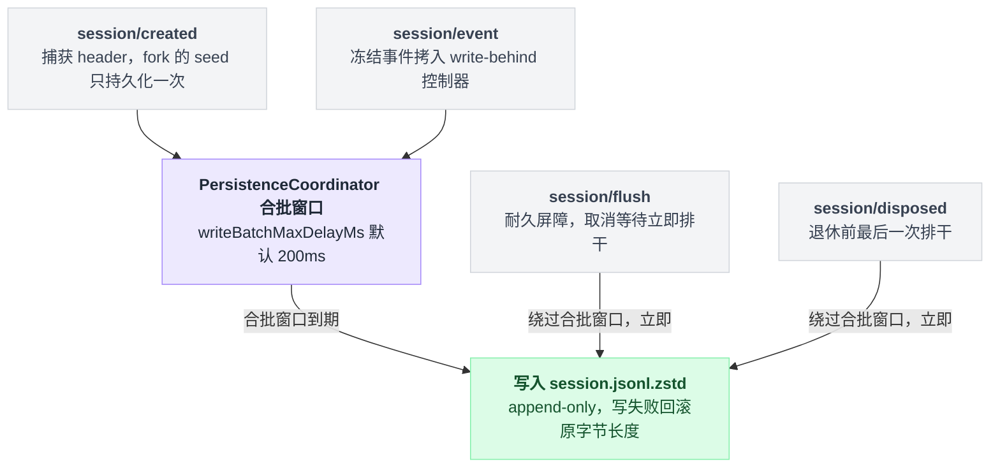
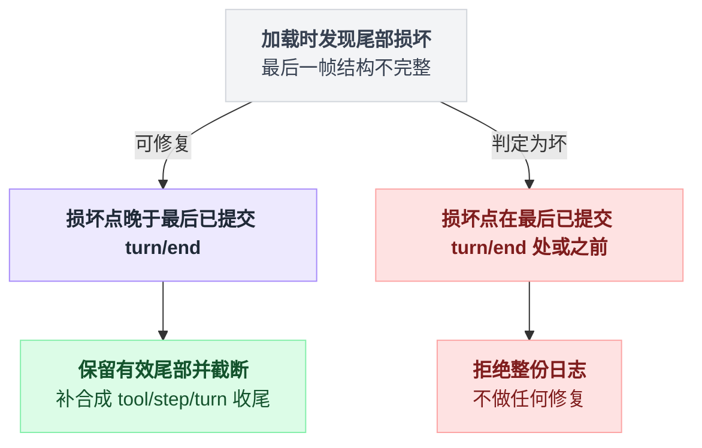

# session-persistence-jsonl

> `@deepseek-ai/dsh-session-persistence-jsonl` · bundle：`base` · 配置树 id：`session-persistence-jsonl` · v0.1.0-rc.5（commit `47f9438`）2026-08-14 核对

**一句话**：默认的耐久落盘后端，把 [session](./dsh-session.md) 的事件日志按会话写成一份 append-only 的逻辑 JSONL，默认物理编码是带校验和的 Zstandard 帧串（`.jsonl.zstd`）。

## 它在树上长什么样

`packages/bundle/base/cordis.patch.yml:98`：

```yaml
- id: session-persistence-jsonl
  name: '@deepseek-ai/dsh-session-persistence-jsonl'
  config:
    root: !!js dshHomePath('sessions')
```

`dshHomePath()` 把段拼到 Harness home 上（`packages/util/home-paths/src/index.ts:98`），home 未由 `$DSH_HOME` 指定时默认 `~/.dsh`（同文件 `:80`、`:89`），所以默认根目录是 `~/.dsh/sessions`。`root` 是**必填、无默认**——若默认成 `process.cwd()`，进程 cwd 一变（bash 调用、子进程）会话文件就散了（`packages/session/session-persistence-jsonl/README.md:26`）。

## 它注册了什么

| 类型 | 名字 | 说明 |
|---|---|---|
| service | `ctx.sessionPersistence`（`JsonlSessionPersistence`） | 实现 `dsh-session-persistence` 抽象 seam（`src/index.ts:121`）；`static inject = ['sessions']`（`src/index.ts:124`） |
| 事件监听 | `session/created`（**emit**） | 捕获 header，fork 的 seed 只持久化一次（`packages/session/session-persistence/src/coordinator.ts:1118`） |
| 事件监听 | `session/event`（**emit**） | 把冻结事件拷进本会话的 write-behind 控制器并开启批窗（`coordinator.ts:1123`） |
| 事件监听 | `session/flush`（**parallel**，awaited） | 立即耐久屏障：取消等待、把当前批和待处理批全部排干（`coordinator.ts:1129`） |
| 事件监听 | `session/disposed`（**emit**） | 退休并做最后一次排干，失败自我容纳（`coordinator.ts:1132`） |

四个派发模式见 `docs/event-producer-consumer.md:41`–`44`。监听器由共享的 `PersistenceCoordinator` 装，不是本包直接写的；HMR 热重载不会重放 `session/created`，所以加载时会把已存在的活会话补种一遍（`coordinator.ts:1136`）。本包不注册工具、命令、prompt 段。

四条监听线最终只汇成两种落盘节奏——合批等待，或立即排干：



## 配置项

| 字段 | 类型 | 默认值 | 作用 |
|---|---|---|---|
| `root` | `string` | **必填**（bundle 给 `~/.dsh/sessions`） | 所有会话文件的根目录。已存在必须是可读目录；不存在则首次落地时创建 |
| `packChunks` | `boolean` | `true`（`src/index.ts:37`、`128`） | 把连续同 block 的 `assistant/chunk` delta 打包成 `text-chunks`/`reasoning-chunks`/`tool-call-chunks` 行；README 在一次真实编码会话上实测日志小约 60%。设 `false` 得到一事件一行的诊断格式；**读取与本开关无关**，永远解包 |
| `compression` | `'zstd' \| 'none'` | `'zstd'`（`src/index.ts:38`、`57`） | `'none'` 保留原始换行分隔 UTF-8 文本 |
| `preparedSessionCacheSize` | 正整数 | `5`（`packages/session/session-persistence/src/coordinator.ts:27`） | 冷历史检查后保留多少个未发布 Session 供 resume 复用 |
| `writeBatchMaxDelayMs` | 正整数 | `200`（`coordinator.ts:30`） | 空闲队列收到第一条事件后的固定合批窗口；**后续事件不重置它**，flush 与拆卸直接绕过。它不约束事件循环、序列化操作或后端本身的延迟，上限是 Node 的 `2_147_483_647` ms（`packages/util/timeout/src/index.ts:25`） |

## 落盘长什么样

```
<root>/--<normalized-cwd>--/<encoded-id>/session.jsonl.zstd
```

第一条逻辑行是不可变的 `SessionHeader`，标记 `{ type: 'session', version, id, cwd?, createdAt, parentSession?, seedLength?, origin?, delegationDepth, agentPreset? }`。`delegationDepth` 在盘上是必填的，顶层会话为 `0`，缺失或非法直接拒绝整份日志；`agentPreset` 之所以耐久，是因为它决定恢复后会话的工具与 prompt——换一套组合去重放历史，模型会看到自己再也执行不了的动作（`README.md:17`）。`seq` 在解码后的日志里保持连续（`events[i].seq === i`）。

项目目录名是把 cwd 规范化后**有损**截断和替换分隔符得到的，所以规范化后相同的 cwd 会共用一个项目目录；会话 id 仍然区分出各自的会话目录（`README.md:19`）。会话 id 是未经校验的 branded string，会被单射转义成一个安全路径段（`README.md:20`）。

耐久语义要点（`README.md:42`–`48`）：懒物化（`create()` 什么都不写，首次 `append` 才写 header 帧并 `fsync`，POSIX 用硬链接发布、Windows 用 `MoveFileExW(..., MOVEFILE_WRITE_THROUGH)`，均不覆盖；两者分别落在 `src/index.ts:549` 与 `src/win32.ts:30`、`:47`）；append-only（写失败回滚到原字节长度）；崩溃恢复保留有效尾部（最后一帧结构不完整就保留其已解码记录、从该帧起截断并补上契约要求的合成 tool/step/turn 收尾，但**缺陷落在最后一个已提交 `turn/end` 处或之前就算损坏、直接拒绝**）；`inspect()` 只读、不截断；`append` 拒绝首 seq 接不上的批次。

崩溃恢复能不能修，取决于损坏点相对最后一个已提交 `turn/end` 的位置：



## 模型看得见什么

JSONL 存储**不贡献任何 live prompt 或 schema**（`README.md:60`）。加载恢复已存 surface 历史并保留旧的 request header 供重建，新 loop 自己组当前信封；崩溃修复补的 `TOOL_NOT_STARTED` / `TOOL_OUTCOME_UNKNOWN` 文案由 [session](./dsh-session.md) 拥有。token 效果：零 live 请求 token，恢复的 agent 只为保留的历史、当前信封和每个被打断调用的修复结果付费。KV Cache：不改写 live 请求前缀，恢复后只有当重建历史、当前信封、模型路由三者都匹配时才能复用 provider cache。

## 什么时候你会想换掉它 / 怎么换

同 seam 另有一个可互换后端 `@deepseek-ai/dsh-session-persistence-sqlite`（`docs/config-catalog.md:1588`；一行一个 `SessionEvent`，`events` 表列为 `(session_id, seq, type, time, data, source_event_seqs, surface_op)` 与事件 1:1，见 `packages/session/session-persistence-sqlite/README.md:11`、`src/schema.ts:142`–`143`）。

**换后端不能靠改这一行的 `name`。** 非 insert patch 里的 `name` 是**断言**而不是覆盖：写成另一个包名会以 `patch: name mismatch` 被整条跳过，原后端照旧生效（`vendor/include/src/index.ts:116`–`119`）。正确写法是禁用旧行 + 插入新行（`insert` 语义见同文件 `:80`–`95`）：

```yaml
- id: session-persistence-jsonl
  disabled: true

- insert:
    - id: session-persistence-sqlite
      name: '@deepseek-ai/dsh-session-persistence-sqlite'
      config:
        path: /path/to/sessions.db
```

只想调 JSONL 自己（同 id 只改 `config` 是合法的 patch 形态）：要能被外部按行读就设 `compression: 'none'`（必须是**新根目录**）；要一事件一行方便 diff 就设 `packChunks: false`；崩溃窗口太大就调小 `writeBatchMaxDelayMs`，但真正的语义屏障在 [session-checkpoint-policy](./dsh-session-checkpoint-policy.md)。

把持久化整个关掉（`disabled: true`，patch 层删不掉 bundle 行）也合法：会话变成纯内存，同时所有 inject 了 `sessionPersistence` 的插件都不会激活——[session-checkpoint-policy](./dsh-session-checkpoint-policy.md)（`docs/config-catalog.md:3078`）、[session-projection-cache](./dsh-session-projection-cache.md)（`:1635`）、`dsh-schedule`（`:3076`）；[session-query-sqlite](./dsh-session-query-sqlite.md) 只是把持久化那一路观察解绑，服务本身还在。

## 坑与边界

来自 `README.md:70`–`77`：

- **只加载配置里那种编码 + 当前 `SESSION_FORMAT_VERSION`（v0）**：改压缩方式必须换新根目录或干净根目录，预发布格式没有迁移。
- **老的扁平 `<project>/<id>.jsonl*` 布局不加载**，会报错而不是忽略（`README.md:38`、`:73`）。
- **压缩文件不能直接按行读**。
- **没有任何东西删会话文件**，日志在 `root` 下无限累积，seam 也没有删除 API。
- **一个会话同时只能有一个活写入者**：append 与 repair 只在拥有它的后端实例内部协调，另一个实例或进程在它安静拆卸前不得写同一会话。
- **POSIX 首次物化依赖 hard link 支持**（用 `link()` 让同 id 竞争失败而不是覆盖已提交日志）。
